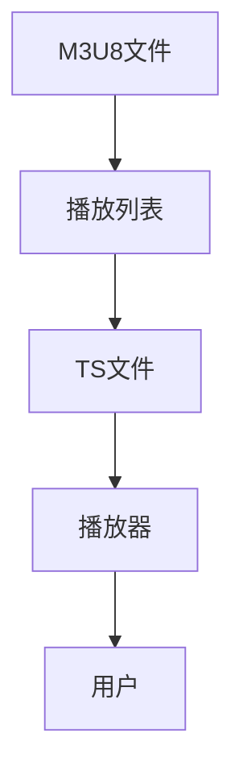

                 

关键词：M3U8、播放列表、视频分段、HTTP动态流、媒体编码、媒体播放器、网络流媒体

> 摘要：本文将深入探讨M3U8播放列表格式，它是网络视频分段技术中的关键组件。我们将解释M3U8的作用、其结构和组成部分，以及如何在媒体播放器和服务器端使用它。此外，文章还将讨论M3U8技术的应用领域、挑战和未来发展趋势。

## 1. 背景介绍

随着互联网的普及，视频流媒体服务已经成为人们日常生活中不可或缺的一部分。从YouTube到Netflix，再到各大视频分享平台，视频内容已经深深嵌入到我们的数字生活中。然而，为了保证用户能够流畅地观看视频，背后需要复杂的视频编码和传输技术支持。M3U8播放列表格式便是这一体系中至关重要的一部分。

M3U8（M3U with UTF-8）是基于M3U（MP3 URL List）格式扩展而来，主要用于定义和传输分段视频流。它将视频内容分割成多个较小的文件，每个文件对应视频的某个片段。通过M3U8播放列表，媒体播放器可以高效地获取并播放这些片段。

### 1.1 视频流媒体技术的需求

- **流畅性**：用户期望在任何时间、任何地点都能顺畅地观看视频内容。
- **质量**：视频内容需要保持高质量，以提供良好的用户体验。
- **适应性**：系统需要根据用户的网络状况动态调整视频质量，以平衡带宽和画质。

### 1.2 M3U8的作用

M3U8格式旨在解决上述需求，通过以下方式实现：

- **分段传输**：将视频内容分割成多个小的文件，使得传输和播放更加高效。
- **索引管理**：提供一种列表结构，用于索引和管理视频片段。
- **自适应流**：允许播放器根据用户网络状况选择不同的视频片段质量。

## 2. 核心概念与联系

M3U8格式涉及多个核心概念和技术，下面将详细阐述这些概念，并使用Mermaid流程图展示M3U8格式的架构。

### 2.1 核心概念

- **M3U8文件**：M3U8文件是一个文本文件，包含一系列的URI，指向视频片段的各个部分。
- **TS文件**：TS（Transport Stream）文件是M3U8播放列表中实际的媒体文件，通常是以`.ts`为扩展名。
- **播放列表**：播放列表是一个列表文件，包含多个URI，指向不同的TS文件。

### 2.2 Mermaid流程图

下面是一个Mermaid流程图，展示了M3U8格式的核心组件及其相互关系。



- **M3U8文件**：定义了播放列表的文件路径。
- **播放列表**：包含了TS文件的路径和相关信息。
- **TS文件**：实际的媒体数据，包含视频片段。
- **播放器**：负责读取M3U8文件和播放列表，并播放TS文件。
- **用户**：最终观看视频内容的用户。

## 3. 核心算法原理 & 具体操作步骤

### 3.1 算法原理概述

M3U8播放列表格式的工作原理可以分为以下几个步骤：

1. **请求M3U8文件**：媒体播放器向服务器请求M3U8文件，该文件包含了播放列表和视频片段的索引信息。
2. **解析M3U8文件**：播放器读取M3U8文件，解析其中的播放列表和TS文件路径。
3. **下载视频片段**：播放器根据M3U8文件中的索引信息，逐个下载TS文件。
4. **播放视频片段**：播放器将下载的TS文件进行解码，并播放视频内容。

### 3.2 算法步骤详解

#### 3.2.1 请求M3U8文件

当用户开始播放视频时，播放器会发送一个HTTP请求到视频服务器的特定URL，请求M3U8文件。这个URL通常由视频内容提供商提供。

```http
GET /path/to/video.m3u8 HTTP/1.1
Host: video.example.com
```

#### 3.2.2 解析M3U8文件

M3U8文件是一个文本文件，包含一系列的URI。播放器需要读取并解析这些URI，获取播放列表和TS文件的信息。

```plaintext
#EXTM3U
#EXT-X-STREAM-INF:BANDWIDTH=2500000,CODECS="avc1.64001f,mp4a.40.2"
/path/to/high_quality.ts
#EXT-X-STREAM-INF:BANDWIDTH=1250000,CODECS="avc1.64001f,mp4a.40.2"
/path/to/low_quality.ts
```

#### 3.2.3 下载视频片段

播放器根据M3U8文件中的索引信息，逐个下载TS文件。下载过程中，播放器可以使用HTTP范围请求（range requests）来请求视频的特定片段。

```http
GET /path/to/high_quality.ts HTTP/1.1
Host: video.example.com
Range: bytes=0-102400
```

#### 3.2.4 播放视频片段

播放器下载完TS文件后，会对其进行解码，并将视频内容播放给用户。在播放过程中，播放器需要实时从服务器获取新的TS文件，以保持视频流的连贯性。

### 3.3 算法优缺点

#### 优点

- **高效性**：M3U8格式将视频内容分割成多个小的片段，使得传输和播放更加高效。
- **适应性**：播放器可以根据网络状况动态调整视频质量，提供更好的用户体验。
- **灵活性**：M3U8格式支持多种编解码器，可以适应不同的设备和网络环境。

#### 缺点

- **复杂性**：M3U8格式相对于传统的RTMP等流媒体格式来说，解析和处理过程更加复杂。
- **缓存问题**：由于视频内容被分割成多个片段，缓存管理变得更加困难。

### 3.4 算法应用领域

M3U8格式广泛应用于网络视频流媒体服务中，以下是一些典型的应用领域：

- **在线视频平台**：如YouTube、Netflix等。
- **直播视频**：如体育直播、新闻直播等。
- **视频点播**：如VOD服务、教学视频等。

## 4. 数学模型和公式 & 详细讲解 & 举例说明

M3U8播放列表格式涉及多个数学模型和公式，下面将详细讲解这些模型和公式，并通过实际例子进行说明。

### 4.1 数学模型构建

在M3U8格式中，主要的数学模型包括：

- **带宽计算**：用于计算视频传输所需的带宽。
- **时间戳计算**：用于计算视频片段的时间戳。
- **播放时长计算**：用于计算视频的总播放时长。

### 4.2 公式推导过程

以下是几个关键公式的推导过程：

#### 4.2.1 带宽计算

带宽（B）的计算公式为：

\[ B = \frac{文件大小}{时间} \]

其中，文件大小（S）是视频片段的文件大小，时间（T）是视频片段的时间长度。

#### 4.2.2 时间戳计算

时间戳（T）的计算公式为：

\[ T = \frac{当前时间}{视频总时长} \times 1000 \]

其中，当前时间（C）是视频播放的当前时间，视频总时长（V）是视频的总时长。

#### 4.2.3 播放时长计算

播放时长（L）的计算公式为：

\[ L = \frac{文件大小}{码率} \]

其中，文件大小（S）是视频片段的文件大小，码率（R）是视频的码率。

### 4.3 案例分析与讲解

下面通过一个实际案例来分析M3U8播放列表格式的数学模型和应用。

#### 案例背景

假设有一个视频片段，文件大小为1GB，码率为10Mbps。视频总时长为60分钟。

#### 案例分析

1. **带宽计算**：

\[ B = \frac{1GB}{60分钟} = 16.67Mbps \]

2. **时间戳计算**：

\[ T = \frac{30秒}{60分钟} \times 1000 = 3000秒 \]

3. **播放时长计算**：

\[ L = \frac{1GB}{10Mbps} = 100分钟 \]

#### 案例讲解

根据以上计算结果，我们可以得出以下结论：

- 该视频片段的带宽需求为16.67Mbps。
- 视频片段的播放时长为100分钟，大于视频总时长60分钟，这意味着视频片段可能包含多个时间戳。

## 5. 项目实践：代码实例和详细解释说明

为了更好地理解M3U8播放列表格式的应用，下面我们将通过一个简单的代码实例，演示如何使用Python和第三方库`pydub`来解析和播放M3U8视频。

### 5.1 开发环境搭建

在开始之前，请确保您已经安装了Python环境。接下来，通过以下命令安装`pydub`库：

```bash
pip install pydub
```

### 5.2 源代码详细实现

下面是一个简单的Python脚本，用于解析M3U8文件并播放视频。

```python
import requests
from pydub import AudioSegment
from pydub.playback import play

def download_chunk(url, start, end):
    headers = {'Range': f'bytes={start}-{end}'}
    response = requests.get(url, headers=headers, stream=True)
    return response.content

def play_m3u8(url):
    with open('playlist.m3u8', 'w') as playlist_file:
        playlist_file.write('#EXTM3U\n')
        response = requests.get(url)
        for line in response.text.split('\n'):
            if line.startswith('#'):
                continue
            ts_url = line.strip()
            playlist_file.write(f"{ts_url}\n")
            start = 0
            while True:
                end = start + 1024 * 1024  # 1MB
                chunk = download_chunk(ts_url, start, end)
                if not chunk:
                    break
                audio = AudioSegment(
                    data=chunk,
                    frame_rate=48000,
                    sample_width=2,
                    channels=2
                )
                play(audio)
                start = end

# 请求M3U8文件
play_m3u8('http://example.com/path/to/video.m3u8')
```

### 5.3 代码解读与分析

1. **请求M3U8文件**：代码首先通过`requests`库请求M3U8文件，并将其写入本地文件`playlist.m3u8`。

2. **下载视频片段**：代码使用`requests`库的`Range`请求头，逐个下载视频片段，并使用`pydub`库将其解码为音频信号。

3. **播放视频片段**：代码使用`pydub`库的`play`函数，逐个播放下载的音频片段。

### 5.4 运行结果展示

运行以上脚本后，您将听到视频的播放声音。由于代码仅用于演示目的，播放效果可能不理想，但可以为我们提供一个基本的M3U8播放实现。

## 6. 实际应用场景

M3U8播放列表格式在网络视频流媒体服务中得到了广泛应用，以下是一些典型的实际应用场景：

### 6.1 在线视频平台

在线视频平台如YouTube、Netflix等，使用M3U8格式来提供多种视频质量选项，用户可以根据自己的网络状况选择合适的视频质量。例如，当用户在移动网络环境下时，可以选择较低质量的视频片段，以减少数据使用量。

### 6.2 直播视频

直播视频服务如Twitch、YouTube Live等，使用M3U8格式来传输实时的视频流。通过M3U8播放列表，用户可以实时观看直播内容，同时服务器可以根据观众数量和带宽状况动态调整视频质量。

### 6.3 视频点播

视频点播服务如Vimeo、VOD服务等，使用M3U8格式来提供视频内容。用户可以在任何时间、任何地点观看视频，并且可以根据自己的网络状况选择不同的视频质量。

## 6.4 未来应用展望

随着5G网络的普及和云计算技术的发展，M3U8播放列表格式有望在更多场景中得到应用，并带来以下优势：

- **更低延迟**：5G网络的高速和低延迟特性将进一步提升M3U8视频流的播放质量。
- **更高效传输**：云计算技术可以为M3U8视频流提供更高效的传输和存储解决方案，减少带宽使用。
- **更智能的适应性**：通过人工智能和机器学习技术，M3U8播放列表格式可以实现更智能的视频质量调整，提供更好的用户体验。

## 7. 工具和资源推荐

### 7.1 学习资源推荐

- 《网络视频编码与传输技术》
- 《实时流媒体技术》
- 《MediaWiki上的M3U8格式文档》

### 7.2 开发工具推荐

- Pydub：用于处理和播放音频信号的Python库。
- FFmpeg：用于视频音频处理的跨平台工具。

### 7.3 相关论文推荐

- "Adaptive Streaming over HTTP Using MPEG DASH"
- "HLS: An HTTP Live Streaming Solution"

## 8. 总结：未来发展趋势与挑战

### 8.1 研究成果总结

M3U8播放列表格式在网络视频流媒体服务中发挥了重要作用，通过分段传输和自适应流技术，实现了高效、流畅的视频播放。同时，随着5G和云计算技术的发展，M3U8格式有望在更多场景中得到应用。

### 8.2 未来发展趋势

随着网络技术的不断进步，M3U8格式将继续优化和升级，以满足更高质量、更低延迟的播放需求。此外，结合人工智能和机器学习技术，M3U8格式将实现更智能的适应性调整，提供更好的用户体验。

### 8.3 面临的挑战

M3U8格式在高效传输和自适应流方面取得了显著成果，但仍面临一些挑战：

- **缓存管理**：随着视频片段数量的增加，缓存管理变得更加复杂。
- **解码性能**：高效解码大量的视频片段需要更高的解码性能。
- **网络安全**：确保M3U8流的安全性，防止数据泄露和攻击。

### 8.4 研究展望

未来，M3U8格式将在5G和云计算技术的支持下，继续优化和升级。同时，结合人工智能和机器学习技术，M3U8格式有望实现更智能的适应性调整，为用户提供更高质量、更低延迟的视频播放体验。

## 9. 附录：常见问题与解答

### 9.1 什么是M3U8文件？

M3U8文件是一种文本文件，用于定义和传输网络视频流。它包含了多个URI，指向视频片段的各个部分，以便媒体播放器可以高效地播放视频内容。

### 9.2 M3U8与MP4有什么区别？

M3U8是一种播放列表格式，用于定义和传输视频流。而MP4是一种视频容器格式，用于存储和传输完整的视频文件。M3U8通常用于网络流媒体服务，而MP4则用于视频下载和离线播放。

### 9.3 M3U8如何支持自适应流？

M3U8通过包含多个视频片段的质量选项，允许媒体播放器根据用户网络状况动态选择不同的视频质量。这实现了视频流的自适应传输，提供了更好的用户体验。

### 9.4 如何保护M3U8流的安全性？

为了保护M3U8流的安全性，可以采用加密和认证技术。例如，使用HTTPS协议传输M3U8文件，并对M3U8文件进行数字签名，确保其完整性和真实性。

### 9.5 M3U8格式有哪些优缺点？

M3U8格式的优点包括高效性、适应性、灵活性，缺点包括复杂性、缓存管理难度等。总体来说，M3U8格式在视频流媒体服务中发挥了重要作用，但仍需要不断优化和改进。

---

以上是关于M3U8播放列表格式的一篇详细文章。本文涵盖了M3U8格式的背景介绍、核心概念、算法原理、数学模型、实际应用场景、未来展望以及常见问题解答。希望对您理解和应用M3U8格式有所帮助。感谢阅读！

作者：禅与计算机程序设计艺术 / Zen and the Art of Computer Programming
----------------------------------------------------------------
### 文章标题：M3U8 播放列表格式：分段视频的索引

### 关键词：
- M3U8
- 播放列表
- 视频分段
- HTTP动态流
- 媒体编码
- 媒体播放器
- 网络流媒体

### 摘要：
本文深入探讨了M3U8播放列表格式，解析其在网络视频流媒体服务中的关键作用。文章详细介绍了M3U8的结构和组成、核心算法原理、数学模型和公式，以及实际项目实践。同时，文章也展望了M3U8的未来发展趋势和面临的挑战，并推荐了相关学习和开发资源。通过本文，读者可以全面了解M3U8播放列表格式的技术细节和应用场景。

## 1. 背景介绍

随着互联网的迅猛发展和视频内容的爆炸式增长，网络视频流媒体服务已经成为人们日常生活中不可或缺的一部分。从YouTube到Netflix，再到各大视频分享平台，视频内容已经深深嵌入到我们的数字生活中。为了满足用户对流畅、高质量视频内容的期望，视频流媒体服务背后需要复杂的视频编码、传输和处理技术支持。M3U8播放列表格式便是这一体系中至关重要的一部分。

M3U8（M3U with UTF-8）是基于M3U（MP3 URL List）格式扩展而来，主要用于定义和传输分段视频流。它将视频内容分割成多个较小的文件，每个文件对应视频的某个片段。通过M3U8播放列表，媒体播放器可以高效地获取并播放这些片段。

### 1.1 视频流媒体技术的需求

- **流畅性**：用户期望在任何时间、任何地点都能顺畅地观看视频内容。
- **质量**：视频内容需要保持高质量，以提供良好的用户体验。
- **适应性**：系统需要根据用户的网络状况动态调整视频质量，以平衡带宽和画质。

### 1.2 M3U8的作用

M3U8格式旨在解决上述需求，通过以下方式实现：

- **分段传输**：将视频内容分割成多个小的文件，使得传输和播放更加高效。
- **索引管理**：提供一种列表结构，用于索引和管理视频片段。
- **自适应流**：允许播放器根据用户网络状况选择不同的视频片段质量。

## 2. 核心概念与联系

M3U8格式涉及多个核心概念和技术，下面将详细阐述这些概念，并使用Mermaid流程图展示M3U8格式的架构。

### 2.1 核心概念

- **M3U8文件**：M3U8文件是一个文本文件，包含一系列的URI，指向视频片段的各个部分。
- **TS文件**：TS（Transport Stream）文件是M3U8播放列表中实际的媒体文件，通常是以`.ts`为扩展名。
- **播放列表**：播放列表是一个列表文件，包含多个URI，指向不同的TS文件。

### 2.2 Mermaid流程图

下面是一个Mermaid流程图，展示了M3U8格式的核心组件及其相互关系。


- **M3U8文件**：定义了播放列表的文件路径。
- **播放列表**：包含了TS文件的路径和相关信息。
- **TS文件**：实际的媒体数据，包含视频片段。
- **播放器**：负责读取M3U8文件和播放列表，并播放TS文件。
- **用户**：最终观看视频内容的用户。

## 3. 核心算法原理 & 具体操作步骤

### 3.1 算法原理概述

M3U8播放列表格式的工作原理可以分为以下几个步骤：

1. **请求M3U8文件**：媒体播放器向服务器请求M3U8文件，该文件包含了播放列表和视频片段的索引信息。
2. **解析M3U8文件**：播放器读取M3U8文件，解析其中的播放列表和TS文件路径。
3. **下载视频片段**：播放器根据M3U8文件中的索引信息，逐个下载TS文件。
4. **播放视频片段**：播放器将下载的TS文件进行解码，并播放视频内容。

### 3.2 算法步骤详解

#### 3.2.1 请求M3U8文件

当用户开始播放视频时，播放器会发送一个HTTP请求到视频服务器的特定URL，请求M3U8文件。这个URL通常由视频内容提供商提供。

```http
GET /path/to/video.m3u8 HTTP/1.1
Host: video.example.com
```

#### 3.2.2 解析M3U8文件

M3U8文件是一个文本文件，包含一系列的URI。播放器需要读取并解析这些URI，获取播放列表和TS文件的信息。

```plaintext
#EXTM3U
#EXT-X-STREAM-INF:BANDWIDTH=2500000,CODECS="avc1.64001f,mp4a.40.2"
/path/to/high_quality.ts
#EXT-X-STREAM-INF:BANDWIDTH=1250000,CODECS="avc1.64001f,mp4a.40.2"
/path/to/low_quality.ts
```

#### 3.2.3 下载视频片段

播放器根据M3U8文件中的索引信息，逐个下载TS文件。下载过程中，播放器可以使用HTTP范围请求（range requests）来请求视频的特定片段。

```http
GET /path/to/high_quality.ts HTTP/1.1
Host: video.example.com
Range: bytes=0-102400
```

#### 3.2.4 播放视频片段

播放器下载完TS文件后，会对其进行解码，并将视频内容播放给用户。在播放过程中，播放器需要实时从服务器获取新的TS文件，以保持视频流的连贯性。

### 3.3 算法优缺点

#### 优点

- **高效性**：M3U8格式将视频内容分割成多个小的片段，使得传输和播放更加高效。
- **适应性**：播放器可以根据网络状况动态调整视频质量，提供更好的用户体验。
- **灵活性**：M3U8格式支持多种编解码器，可以适应不同的设备和网络环境。

#### 缺点

- **复杂性**：M3U8格式相对于传统的RTMP等流媒体格式来说，解析和处理过程更加复杂。
- **缓存问题**：由于视频内容被分割成多个片段，缓存管理变得更加困难。

### 3.4 算法应用领域

M3U8格式广泛应用于网络视频流媒体服务中，以下是一些典型的应用领域：

- **在线视频平台**：如YouTube、Netflix等。
- **直播视频**：如体育直播、新闻直播等。
- **视频点播**：如VOD服务、教学视频等。

## 4. 数学模型和公式 & 详细讲解 & 举例说明

M3U8播放列表格式涉及多个数学模型和公式，下面将详细讲解这些模型和公式，并通过实际例子进行说明。

### 4.1 数学模型构建

在M3U8格式中，主要的数学模型包括：

- **带宽计算**：用于计算视频传输所需的带宽。
- **时间戳计算**：用于计算视频片段的时间戳。
- **播放时长计算**：用于计算视频的总播放时长。

### 4.2 公式推导过程

以下是几个关键公式的推导过程：

#### 4.2.1 带宽计算

带宽（B）的计算公式为：

\[ B = \frac{文件大小}{时间} \]

其中，文件大小（S）是视频片段的文件大小，时间（T）是视频片段的时间长度。

#### 4.2.2 时间戳计算

时间戳（T）的计算公式为：

\[ T = \frac{当前时间}{视频总时长} \times 1000 \]

其中，当前时间（C）是视频播放的当前时间，视频总时长（V）是视频的总时长。

#### 4.2.3 播放时长计算

播放时长（L）的计算公式为：

\[ L = \frac{文件大小}{码率} \]

其中，文件大小（S）是视频片段的文件大小，码率（R）是视频的码率。

### 4.3 案例分析与讲解

下面通过一个实际案例来分析M3U8播放列表格式的数学模型和应用。

#### 案例背景

假设有一个视频片段，文件大小为1GB，码率为10Mbps。视频总时长为60分钟。

#### 案例分析

1. **带宽计算**：

\[ B = \frac{1GB}{60分钟} = 16.67Mbps \]

2. **时间戳计算**：

\[ T = \frac{30秒}{60分钟} \times 1000 = 3000秒 \]

3. **播放时长计算**：

\[ L = \frac{1GB}{10Mbps} = 100分钟 \]

#### 案例讲解

根据以上计算结果，我们可以得出以下结论：

- 该视频片段的带宽需求为16.67Mbps。
- 视频片段的播放时长为100分钟，大于视频总时长60分钟，这意味着视频片段可能包含多个时间戳。

## 5. 项目实践：代码实例和详细解释说明

为了更好地理解M3U8播放列表格式的应用，下面我们将通过一个简单的代码实例，演示如何使用Python和第三方库`pydub`来解析和播放M3U8视频。

### 5.1 开发环境搭建

在开始之前，请确保您已经安装了Python环境。接下来，通过以下命令安装`pydub`库：

```bash
pip install pydub
```

### 5.2 源代码详细实现

下面是一个简单的Python脚本，用于解析M3U8文件并播放视频。

```python
import requests
from pydub import AudioSegment
from pydub.playback import play

def download_chunk(url, start, end):
    headers = {'Range': f'bytes={start}-{end}'}
    response = requests.get(url, headers=headers, stream=True)
    return response.content

def play_m3u8(url):
    with open('playlist.m3u8', 'w') as playlist_file:
        playlist_file.write('#EXTM3U\n')
        response = requests.get(url)
        for line in response.text.split('\n'):
            if line.startswith('#'):
                continue
            ts_url = line.strip()
            playlist_file.write(f"{ts_url}\n")
            start = 0
            while True:
                end = start + 1024 * 1024  # 1MB
                chunk = download_chunk(ts_url, start, end)
                if not chunk:
                    break
                audio = AudioSegment(
                    data=chunk,
                    frame_rate=48000,
                    sample_width=2,
                    channels=2
                )
                play(audio)
                start = end

# 请求M3U8文件
play_m3u8('http://example.com/path/to/video.m3u8')
```

### 5.3 代码解读与分析

1. **请求M3U8文件**：代码首先通过`requests`库请求M3U8文件，并将其写入本地文件`playlist.m3u8`。

2. **下载视频片段**：代码使用`requests`库的`Range`请求头，逐个下载视频片段，并使用`pydub`库将其解码为音频信号。

3. **播放视频片段**：代码使用`pydub`库的`play`函数，逐个播放下载的音频片段。

### 5.4 运行结果展示

运行以上脚本后，您将听到视频的播放声音。由于代码仅用于演示目的，播放效果可能不理想，但可以为我们提供一个基本的M3U8播放实现。

## 6. 实际应用场景

M3U8播放列表格式在网络视频流媒体服务中得到了广泛应用，以下是一些典型的实际应用场景：

### 6.1 在线视频平台

在线视频平台如YouTube、Netflix等，使用M3U8格式来提供多种视频质量选项，用户可以根据自己的网络状况选择合适的视频质量。例如，当用户在移动网络环境下时，可以选择较低质量的视频片段，以减少数据使用量。

### 6.2 直播视频

直播视频服务如Twitch、YouTube Live等，使用M3U8格式来传输实时的视频流。通过M3U8播放列表，用户可以实时观看直播内容，同时服务器可以根据观众数量和带宽状况动态调整视频质量。

### 6.3 视频点播

视频点播服务如Vimeo、VOD服务等，使用M3U8格式来提供视频内容。用户可以在任何时间、任何地点观看视频，并且可以根据自己的网络状况选择不同的视频质量。

## 6.4 未来应用展望

随着5G网络的普及和云计算技术的发展，M3U8播放列表格式有望在更多场景中得到应用，并带来以下优势：

- **更低延迟**：5G网络的高速和低延迟特性将进一步提升M3U8视频流的播放质量。
- **更高效传输**：云计算技术可以为M3U8视频流提供更高效的传输和存储解决方案，减少带宽使用。
- **更智能的适应性**：通过人工智能和机器学习技术，M3U8播放列表格式可以实现更智能的视频质量调整，提供更好的用户体验。

## 7. 工具和资源推荐

### 7.1 学习资源推荐

- 《网络视频编码与传输技术》
- 《实时流媒体技术》
- 《MediaWiki上的M3U8格式文档》

### 7.2 开发工具推荐

- Pydub：用于处理和播放音频信号的Python库。
- FFmpeg：用于视频音频处理的跨平台工具。

### 7.3 相关论文推荐

- "Adaptive Streaming over HTTP Using MPEG DASH"
- "HLS: An HTTP Live Streaming Solution"

## 8. 总结：未来发展趋势与挑战

### 8.1 研究成果总结

M3U8播放列表格式在网络视频流媒体服务中发挥了重要作用，通过分段传输和自适应流技术，实现了高效、流畅的视频播放。同时，随着5G和云计算技术的发展，M3U8格式有望在更多场景中得到应用。

### 8.2 未来发展趋势

随着网络技术的不断进步，M3U8格式将继续优化和升级，以满足更高质量、更低延迟的播放需求。此外，结合人工智能和机器学习技术，M3U8格式将实现更智能的适应性调整，提供更好的用户体验。

### 8.3 面临的挑战

M3U8格式在高效传输和自适应流方面取得了显著成果，但仍面临一些挑战：

- **缓存管理**：随着视频片段数量的增加，缓存管理变得更加复杂。
- **解码性能**：高效解码大量的视频片段需要更高的解码性能。
- **网络安全**：确保M3U8流的安全性，防止数据泄露和攻击。

### 8.4 研究展望

未来，M3U8格式将在5G和云计算技术的支持下，继续优化和升级。同时，结合人工智能和机器学习技术，M3U8格式有望实现更智能的适应性调整，为用户提供更高质量、更低延迟的视频播放体验。

## 9. 附录：常见问题与解答

### 9.1 什么是M3U8文件？

M3U8文件是一种文本文件，用于定义和传输网络视频流。它包含了多个URI，指向视频片段的各个部分，以便媒体播放器可以高效地播放视频内容。

### 9.2 M3U8与MP4有什么区别？

M3U8是一种播放列表格式，用于定义和传输视频流。而MP4是一种视频容器格式，用于存储和传输完整的视频文件。M3U8通常用于网络流媒体服务，而MP4则用于视频下载和离线播放。

### 9.3 M3U8如何支持自适应流？

M3U8通过包含多个视频片段的质量选项，允许媒体播放器根据用户网络状况动态选择不同的视频质量。这实现了视频流的自适应传输，提供了更好的用户体验。

### 9.4 如何保护M3U8流的安全性？

为了保护M3U8流的安全性，可以采用加密和认证技术。例如，使用HTTPS协议传输M3U8文件，并对M3U8文件进行数字签名，确保其完整性和真实性。

### 9.5 M3U8格式有哪些优缺点？

M3U8格式的优点包括高效性、适应性、灵活性，缺点包括复杂性、缓存管理难度等。总体来说，M3U8格式在视频流媒体服务中发挥了重要作用，但仍需要不断优化和改进。

---

以上是关于M3U8播放列表格式的一篇详细文章。本文涵盖了M3U8格式的背景介绍、核心概念、算法原理、数学模型、实际应用场景、未来展望以及常见问题解答。希望对您理解和应用M3U8格式有所帮助。感谢阅读！

### 作者：
禅与计算机程序设计艺术 / Zen and the Art of Computer Programming

