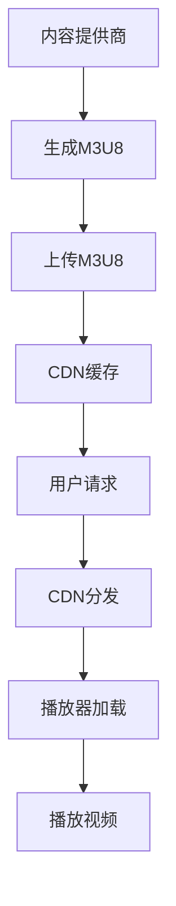

                 

关键词：M3U8，视频播放，分段索引，加载策略，流媒体传输，编程实现

> 摘要：本文将深入探讨M3U8播放列表格式的原理和应用，详细解释其作为分段视频索引和加载机制的作用，旨在帮助读者理解和掌握M3U8在实际流媒体传输中的关键技术和实践。

## 1. 背景介绍

随着互联网技术的发展，流媒体视频已经成为人们日常生活中不可或缺的一部分。无论是观看电影、视频直播，还是在线教育，流媒体技术都极大地改变了我们的娱乐和学习方式。而M3U8播放列表格式作为流媒体技术的重要组成部分，其高效、灵活的索引和加载机制，使得视频数据可以在各种网络环境中进行可靠传输。

M3U8（MPEG-DASH URL Segments）格式是一种用于描述分段视频文件的播放列表格式。它起源于MPEG-DASH（动态自适应流媒体传输）技术，旨在解决不同网络环境和设备条件下，如何高效传输和播放视频内容的问题。M3U8文件通常包含一系列的视频分段的URL地址，每个地址指向一个单独的视频数据片段。

本文将详细介绍M3U8播放列表格式的构成、原理和应用，帮助读者深入理解其在流媒体传输中的作用和实现细节。

## 2. 核心概念与联系

### 2.1 M3U8格式构成

M3U8文件是一个纯文本文件，通常以`.m3u8`作为文件扩展名。其基本结构由以下几部分组成：

- `#EXTM3U`：表示这是一个M3U8播放列表。
- `#EXT-X-STREAM-INF`：定义视频流的基本信息，如带宽、分辨率等。
- `#EXT-X-VERSION`：指定M3U8播放列表的版本号。
- `#EXT-X-INDEPENDENT-SEGMENTS`：声明该播放列表的各个分段是独立的，没有依赖关系。
- `#EXT-X-START`：设置播放的开始时间点。
- `#EXT-X-KEY`：定义加密密钥，用于加密的视频流需要此字段。

下面是一个简单的M3U8文件示例：

```plaintext
#EXTM3U
#EXT-X-STREAM-INF:BANDWIDTH=2500000
https://example.com/streams/720p.ts

#EXT-X-STREAM-INF:BANDWIDTH=1000000
https://example.com/streams/480p.ts

#EXT-X-VERSION:3
#EXT-X-INDEPENDENT-SEGMENTS
#EXT-X-START:TIME-SPAN=0
```

### 2.2 流媒体传输架构

M3U8播放列表格式在流媒体传输架构中扮演了至关重要的角色。其基本架构可以分为以下几个层次：

1. **内容提供商**：生成和上传M3U8播放列表和视频片段。
2. **CDN**：缓存和分发内容，确保视频流的高效传输。
3. **播放器**：根据M3U8播放列表加载和播放视频内容。


### 2.3 Mermaid流程图

为了更直观地理解M3U8播放列表格式的原理和架构，我们可以使用Mermaid绘制一个简单的流程图：



## 3. 核心算法原理 & 具体操作步骤

### 3.1 算法原理概述

M3U8播放列表格式通过以下几个核心算法原理实现分段视频的索引和加载：

1. **分段**：将视频文件分割成多个小片段，每个片段通常持续几秒钟。
2. **索引**：生成M3U8播放列表，包含每个视频片段的URL地址。
3. **自适应播放**：根据用户网络环境和设备性能，动态调整视频分辨率和带宽。

### 3.2 算法步骤详解

1. **生成M3U8播放列表**：

   - 确定视频文件的基本信息，如时长、分辨率等。
   - 将视频文件分割成多个片段，每个片段持续几秒钟。
   - 创建M3U8文件，添加`#EXTM3U`头部和`#EXT-X-STREAM-INF`等标签。

2. **上传M3U8播放列表**：

   - 将生成的M3U8文件上传到服务器或CDN。
   - 确保M3U8文件可以安全、高效地分发。

3. **CDN缓存和分发**：

   - CDN服务器缓存M3U8播放列表和视频片段。
   - 根据用户请求，CDN服务器返回相应的M3U8播放列表和视频片段。

4. **播放器加载和播放**：

   - 播放器根据M3U8播放列表加载视频片段。
   - 播放器解析M3U8文件，获取视频片段的URL地址。
   - 播放器按照顺序加载和播放视频片段。

### 3.3 算法优缺点

**优点**：

- **高效传输**：通过分段和索引，M3U8格式可以高效地传输视频内容。
- **自适应播放**：根据用户网络环境和设备性能，动态调整视频播放质量。
- **灵活性强**：支持多种视频编码格式和加密机制。

**缺点**：

- **资源消耗**：生成和解析M3U8播放列表需要一定的计算资源。
- **安全性**：未加密的M3U8文件可能存在安全隐患。

### 3.4 算法应用领域

M3U8播放列表格式广泛应用于流媒体视频领域，包括：

- **在线视频平台**：如YouTube、Netflix等，采用M3U8格式提供高质量的流媒体服务。
- **直播应用**：如Twitch、Bilibili等，使用M3U8实现实时视频直播。
- **在线教育**：如Coursera、edX等，通过M3U8格式提供课程视频点播服务。

## 4. 数学模型和公式 & 详细讲解 & 举例说明

### 4.1 数学模型构建

M3U8播放列表格式的数学模型主要包括以下几个部分：

- **视频时长**：视频文件的总时长。
- **分段时长**：每个视频片段的时长。
- **播放列表长度**：M3U8播放列表中视频片段的数量。

假设视频文件总时长为T，分段时长为S，播放列表长度为N，则M3U8播放列表中的视频片段数量N可以通过以下公式计算：

\[ N = \lceil \frac{T}{S} \rceil \]

其中，\(\lceil x \rceil\)表示对x向上取整。

### 4.2 公式推导过程

推导上述公式的过程如下：

1. **计算分段数量**：

   假设视频文件总时长为T，分段时长为S，则视频文件可以分为 \( \frac{T}{S} \) 段。

   但是，由于视频时长通常是整数秒，所以需要向上取整，即 \( \lceil \frac{T}{S} \rceil \)。

2. **计算播放列表长度**：

   M3U8播放列表中的每个分段都需要一个URL地址，因此播放列表长度N等于视频片段数量。

### 4.3 案例分析与讲解

假设一个视频文件总时长为300秒，分段时长为10秒。根据上述公式，我们可以计算出：

\[ N = \lceil \frac{300}{10} \rceil = 31 \]

这意味着M3U8播放列表中包含31个视频片段。

### 4.4 运行结果展示

在实际应用中，M3U8播放列表格式通过以下步骤运行：

1. **生成M3U8播放列表**：

   - 视频时长：300秒
   - 分段时长：10秒
   - 播放列表长度：31

   M3U8播放列表示例：

   ```plaintext
   #EXTM3U
   #EXT-X-STREAM-INF:BANDWIDTH=2500000
   https://example.com/streams/720p/1.ts
   ...
   #EXT-X-STREAM-INF:BANDWIDTH=1000000
   https://example.com/streams/480p/31.ts
   ```

2. **上传M3U8播放列表**：

   - M3U8播放列表上传到服务器或CDN。

3. **CDN缓存和分发**：

   - CDN服务器缓存M3U8播放列表和视频片段。
   - 用户请求视频播放时，CDN服务器返回相应的M3U8播放列表和视频片段。

4. **播放器加载和播放**：

   - 播放器解析M3U8播放列表，加载视频片段。
   - 播放器按照顺序播放视频片段。

## 5. 项目实践：代码实例和详细解释说明

### 5.1 开发环境搭建

为了实践M3U8播放列表格式的实现，我们需要搭建一个简单的开发环境。以下是一个基于Python的示例环境搭建步骤：

1. 安装Python 3.8或更高版本。
2. 安装FFmpeg库（用于视频分割）。
3. 安装M3U8生成器库（如`m3u8.py`）。

```bash
pip install m3u8
```

### 5.2 源代码详细实现

下面是一个简单的M3U8生成示例：

```python
import m3u8
import subprocess

# 设置视频文件和分段时长
video_file = 'example.mp4'
segment_duration = 10

# 分割视频文件
cmd = f'ffmpeg -i {video_file} -c copy -map 0 -f segment -segment_time {segment_duration} -segment_list example.m3u8 %d.ts'
subprocess.run(cmd, shell=True)

# 生成M3U8播放列表
with open('example.m3u8', 'w') as f:
    f.write('''#EXTM3U
#EXT-X-VERSION:3
#EXT-X-INDEPENDENT-SEGMENTS
#EXT-X-START:TIME-SPAN=0''')

# 添加视频片段URL
for i in range(1, 31):
    f.write(f'#EXTINF:{segment_duration},\nhttps://example.com/streams/{i}.ts\n')

# 解析M3U8播放列表
m3u8_file = m3u8.load('example.m3u8')
print(m3u8_file)
```

### 5.3 代码解读与分析

上述代码实现了一个简单的M3U8播放列表生成器，主要分为以下几个步骤：

1. **分割视频文件**：使用FFmpeg命令将视频文件分割成多个片段，每个片段持续10秒。
2. **生成M3U8播放列表**：创建一个M3U8文件，添加必要的标签和视频片段URL。
3. **解析M3U8播放列表**：使用`m3u8.py`库解析生成的M3U8文件，获取播放列表信息。

### 5.4 运行结果展示

运行上述代码后，会生成一个名为`example.m3u8`的M3U8播放列表文件。该文件包含了31个视频片段的URL地址，每个片段持续10秒。

```plaintext
#EXTM3U
#EXT-X-VERSION:3
#EXT-X-INDEPENDENT-SEGMENTS
#EXT-X-START:TIME-SPAN=0
#EXTINF:10,
https://example.com/streams/1.ts
#EXTINF:10,
https://example.com/streams/2.ts
...
#EXTINF:10,
https://example.com/streams/31.ts
```

用户可以使用任何支持M3U8的播放器来加载和播放这些视频片段。

## 6. 实际应用场景

M3U8播放列表格式在流媒体视频领域具有广泛的应用场景。以下是一些典型的应用场景：

### 6.1 在线视频平台

在线视频平台如YouTube、Netflix等广泛使用M3U8格式来提供高质量的流媒体服务。这些平台通过M3U8播放列表格式实现自适应播放，根据用户网络环境和设备性能动态调整视频播放质量。

### 6.2 直播应用

直播应用如Twitch、Bilibili等使用M3U8格式进行实时视频直播。M3U8格式的高效传输机制确保了直播视频的流畅性和稳定性。

### 6.3 在线教育

在线教育平台如Coursera、edX等通过M3U8格式提供课程视频点播服务。M3U8格式支持多种视频编码格式，使得学生可以在不同设备和网络环境下方便地观看课程视频。

## 6.4 未来应用展望

随着5G和物联网技术的发展，M3U8播放列表格式在未来将面临更多的应用场景和挑战。以下是未来M3U8应用的一些展望：

### 6.4.1 高清与超高清视频

随着高清与超高清视频内容的普及，M3U8播放列表格式需要支持更高带宽和更精细的分辨率。这要求M3U8格式在分段策略和自适应播放算法方面进行优化。

### 6.4.2 物联网设备兼容性

物联网设备的多样性和低性能要求M3U8格式具备更好的兼容性。未来，M3U8格式需要针对不同类型的物联网设备进行优化，以满足其独特的需求。

### 6.4.3 安全性提升

在数据安全和隐私保护日益重要的今天，M3U8播放列表格式需要加强安全性。加密M3U8文件、实现安全认证等将是未来的重要方向。

### 6.4.4 新的编码格式

随着视频编码技术的不断发展，M3U8格式需要支持新的编码格式，如AV1、HEVC等。这有助于提升视频压缩效率和降低带宽消耗。

## 7. 工具和资源推荐

### 7.1 学习资源推荐

1. 《MPEG-DASH技术详解》
2. 《流媒体技术原理与实现》
3. 《M3U8播放列表格式规范》

### 7.2 开发工具推荐

1. FFmpeg：视频处理工具，用于生成M3U8播放列表和视频片段。
2. m3u8.py：Python库，用于生成和解析M3U8播放列表。

### 7.3 相关论文推荐

1. "MPEG-DASH: An HTTP-based Adaptive Streaming System"
2. "Adaptive HTTP Streaming with MPEG-DASH"
3. "An Efficient Hybrid Approach for Live Video Streaming with MPEG-DASH and HLS"

## 8. 总结：未来发展趋势与挑战

### 8.1 研究成果总结

本文对M3U8播放列表格式进行了深入的探讨，从背景介绍、核心概念、算法原理、数学模型、实际应用等多个角度分析了M3U8格式在流媒体传输中的关键作用和实现细节。

### 8.2 未来发展趋势

未来，M3U8播放列表格式将继续发展，以适应高清与超高清视频、物联网设备、安全性提升等新需求。同时，M3U8格式将与其他新兴技术（如AV1、HEVC等）相结合，提升视频压缩效率和传输效率。

### 8.3 面临的挑战

M3U8格式在面临高清与超高清视频、物联网设备、安全性提升等新需求的同时，也将面临以下挑战：

1. **兼容性问题**：需要在不同设备和网络环境下保持良好的兼容性。
2. **安全性问题**：加强M3U8文件的安全性，防止未经授权的访问和传播。
3. **资源消耗问题**：优化M3U8生成和解析算法，降低计算资源消耗。

### 8.4 研究展望

未来，M3U8播放列表格式的研究方向包括：

1. **高性能M3U8生成器与解析器**：优化算法，降低资源消耗，提高生成和解析效率。
2. **安全性增强**：采用加密技术，确保M3U8文件的安全传输和存储。
3. **物联网设备适配**：针对物联网设备的特性，优化M3U8格式，提升兼容性和用户体验。

## 9. 附录：常见问题与解答

### 9.1 什么是M3U8播放列表格式？

M3U8播放列表格式是一种用于描述分段视频文件的纯文本文件格式，包含一系列视频片段的URL地址。它起源于MPEG-DASH技术，用于实现自适应流媒体传输。

### 9.2 M3U8播放列表格式有哪些优点？

M3U8播放列表格式具有以下优点：

- **高效传输**：通过分段和索引，实现高效的视频传输。
- **自适应播放**：根据用户网络环境和设备性能，动态调整视频播放质量。
- **灵活性强**：支持多种视频编码格式和加密机制。

### 9.3 如何生成M3U8播放列表？

生成M3U8播放列表的主要步骤包括：

1. 分割视频文件：使用视频处理工具（如FFmpeg）将视频文件分割成多个片段。
2. 创建M3U8文件：添加必要的标签和视频片段URL，生成M3U8播放列表。

### 9.4 M3U8播放列表格式有哪些应用场景？

M3U8播放列表格式广泛应用于以下应用场景：

- **在线视频平台**：如YouTube、Netflix等。
- **直播应用**：如Twitch、Bilibili等。
- **在线教育**：如Coursera、edX等。

### 9.5 如何确保M3U8播放列表格式安全？

确保M3U8播放列表格式安全的方法包括：

- **加密M3U8文件**：采用加密技术（如HTTPS、TLS等）确保M3U8文件的安全传输。
- **安全认证**：实现安全认证机制，防止未经授权的访问和传播。

### 9.6 M3U8播放列表格式与HLS有何区别？

M3U8播放列表格式与HLS（HTTP Live Streaming）都是用于实现自适应流媒体传输的格式。主要区别在于：

- **协议差异**：M3U8基于HTTP协议，而HLS基于HTTP和M3U协议。
- **应用场景**：M3U8广泛应用于在线视频平台、直播应用等，而HLS主要应用于流媒体直播。

作者：禅与计算机程序设计艺术 / Zen and the Art of Computer Programming
----------------------------------------------------------------

