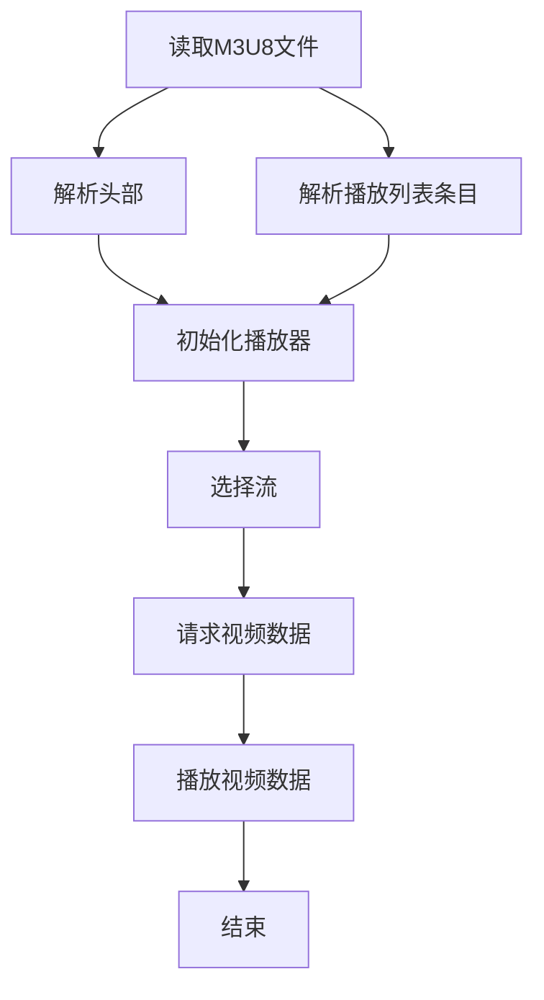

                 

关键词：M3U8、播放列表、分段视频、索引、流媒体

## 摘要

本文将深入探讨M3U8播放列表的作用及其在流媒体领域的应用。M3U8播放列表是一种用于描述和索引分段视频数据的重要格式，它使得流媒体播放变得更加高效和灵活。本文将首先介绍M3U8的基本概念和结构，然后分析其核心算法原理，最后通过实例代码和实践场景展示如何在实际项目中应用M3U8播放列表。

## 1. 背景介绍

随着互联网的普及和带宽的提升，流媒体视频已成为人们日常娱乐和生活的重要组成部分。流媒体技术允许用户无需下载整个视频文件，而是通过网络实时传输和播放。为了实现这一功能，需要一种有效的播放列表格式来描述视频数据。M3U8就是这样一种格式，它专为流媒体视频播放而设计。

M3U8（ Musical Instrument Digital Interface，MIDI文件中的扩展名）是一种基于文本的播放列表格式，它用于描述一系列音频或视频文件的播放顺序。M3U8的主要特点是能够描述分段视频数据，这意味着视频文件被分成多个小块，每个小块都单独存储，并在需要时按顺序播放。

M3U8播放列表的主要优势在于其灵活性和高效性。首先，它可以根据网络带宽和用户需求动态调整视频质量，提供流畅的观看体验。其次，它支持多码率编码，可以满足不同用户设备的能力和需求。此外，M3U8播放列表还可以与其他流媒体技术（如HLS、DASH等）无缝集成，进一步提高了视频流媒体的灵活性和兼容性。

## 2. 核心概念与联系

### M3U8 文件结构

M3U8文件主要由两个部分组成：播放列表头部（EXTM3U）和播放列表条目（EXT-X-xxxx）。其中，EXTM3U是M3U8文件的基本标识，表示这是一个M3U8播放列表。EXT-X-xxxx则是M3U8的核心内容，用于描述视频数据的相关信息。

一个典型的M3U8文件结构如下：

```plaintext
#EXTM3U
#EXT-X-STREAM-INF:BANDWIDTH=2000000,CODECS="AVC",RESOLUTION=1920x1080
video_1080p.m3u8
#EXT-X-STREAM-INF:BANDWIDTH=1000000,CODECS="AVC",RESOLUTION=1280x720
video_720p.m3u8
#EXT-X-STREAM-INF:BANDWIDTH=500000,CODECS="AVC",RESOLUTION=640x360
video_360p.m3u8
```

在上面的示例中，我们定义了三个不同分辨率的视频流，分别对应不同的带宽和码率。每个EXT-X-STREAM-INF条目描述了一个视频流的属性，包括带宽（BANDWIDTH）、编码格式（CODECS）和分辨率（RESOLUTION）。

### Mermaid 流程图

为了更好地理解M3U8播放列表的工作流程，我们使用Mermaid绘制一个流程图。



在这个流程图中，首先读取M3U8文件并解析头部信息，然后解析播放列表条目，初始化播放器。根据用户需求或网络状况，选择合适的视频流并请求视频数据，最后播放视频数据。整个过程是一个循环，直到用户停止播放或视频播放完成。

## 3. 核心算法原理 & 具体操作步骤

### 3.1 算法原理概述

M3U8播放列表的核心算法原理在于其能够动态调整视频流的质量。具体来说，它通过以下几个步骤实现：

1. **解析M3U8文件**：读取并解析M3U8文件，获取视频流的相关信息。
2. **选择视频流**：根据用户需求或网络状况选择合适的视频流。
3. **请求视频数据**：向服务器请求视频数据，并按照播放列表的顺序播放。
4. **调整视频质量**：根据网络状况和用户需求动态调整视频质量。

### 3.2 算法步骤详解

1. **解析M3U8文件**：

    读取M3U8文件，并解析其中的播放列表条目。具体操作如下：

    - 读取M3U8文件内容。
    - 解析EXTM3U头部，确认文件格式。
    - 解析EXT-X-STREAM-INF条目，获取视频流的属性信息。

2. **选择视频流**：

    根据用户需求或网络状况选择合适的视频流。具体操作如下：

    - 获取当前网络带宽。
    - 根据带宽和用户需求选择合适的视频流。
    - 更新播放器配置。

3. **请求视频数据**：

    向服务器请求视频数据，并按照播放列表的顺序播放。具体操作如下：

    - 生成播放器请求URL。
    - 发送HTTP请求获取视频数据。
    - 解析视频数据，并按顺序播放。

4. **调整视频质量**：

    根据网络状况和用户需求动态调整视频质量。具体操作如下：

    - 监测网络带宽和视频播放质量。
    - 根据监测结果调整视频质量。
    - 更新播放器配置。

### 3.3 算法优缺点

**优点**：

- **灵活性强**：M3U8播放列表支持多码率编码，可以满足不同用户设备和网络状况的需求。
- **高效性高**：M3U8播放列表可以将视频文件分成多个小块，提高数据传输和播放的效率。
- **兼容性好**：M3U8播放列表可以与其他流媒体技术（如HLS、DASH等）无缝集成，提高兼容性。

**缺点**：

- **解析复杂**：M3U8文件结构较为复杂，需要一定的编程技巧和经验才能正确解析。
- **性能影响**：解析M3U8文件和动态调整视频质量可能会对性能产生一定影响。

### 3.4 算法应用领域

M3U8播放列表在流媒体领域有广泛的应用，主要包括：

- **在线视频播放**：广泛应用于各种在线视频网站，如YouTube、Netflix等。
- **移动应用**：广泛应用于移动应用中的视频播放功能，如短视频应用、直播平台等。
- **智能家居**：在智能家居设备中，如智能电视、智能音响等，用于播放视频内容。

## 4. 数学模型和公式 & 详细讲解 & 举例说明

### 4.1 数学模型构建

M3U8播放列表的核心算法涉及到网络带宽、视频码率和播放质量等参数。为了更好地理解和分析算法，我们可以构建一个数学模型。

假设我们有以下参数：

- 网络带宽：\(B\)
- 视频码率：\(R\)
- 播放质量：\(Q\)

我们的目标是根据网络带宽和用户需求，选择合适的视频码率和播放质量。

### 4.2 公式推导过程

根据网络带宽和视频码率的关系，我们可以得到以下公式：

\[ B = R \times Q \]

其中，\(B\) 是网络带宽，\(R\) 是视频码率，\(Q\) 是播放质量。

根据用户需求，我们可以设定一个目标播放质量 \(Q_0\)。为了满足这个目标，我们需要选择合适的视频码率 \(R_0\)。

根据公式，我们可以得到：

\[ R_0 = \frac{B}{Q_0} \]

### 4.3 案例分析与讲解

假设我们有一个网络带宽为5Mbps，用户期望的播放质量为720p。我们需要选择合适的视频码率和播放质量。

根据公式，我们可以计算出：

\[ R_0 = \frac{5Mbps}{720p} \approx 6.94Mbps \]

根据视频码率表，我们可以选择一个接近6.94Mbps的视频码率，如6Mbps。这样，我们就可以保证用户以720p的播放质量观看视频。

接下来，我们计算对应的播放质量：

\[ Q_0 = \frac{5Mbps}{6Mbps} \approx 0.833 \]

这意味着用户将以0.833的播放质量观看视频。虽然播放质量略有下降，但仍然可以保证良好的观看体验。

## 5. 项目实践：代码实例和详细解释说明

### 5.1 开发环境搭建

为了演示如何使用M3U8播放列表，我们将使用一个简单的Python示例。首先，确保你的环境中安装了Python和必需的库。

```bash
pip install requests
```

### 5.2 源代码详细实现

以下是用于解析M3U8播放列表和播放视频的Python代码：

```python
import requests
from requests.structures import CaseInsensitiveDict

def get_video_segments(url):
    response = requests.get(url, headers=CaseInsensitiveDict({'Accept': 'text/html'}))
    data = response.text
    segments = []
    start = data.find('#EXTINF:')
    while start != -1:
        end = data.find('\n', start)
        segment = data[start:end].split(',')
        segments.append(segment[1].strip())
        start = data.find('#EXTINF:', start + 1)
    return segments

def download_and_play(segments, output='output.mp4'):
    with open(output, 'wb') as f:
        for segment in segments:
            response = requests.get(segment, stream=True)
            f.write(response.content)
            print(f"Downloaded {segment}")
        print("Video processing completed.")

if __name__ == '__main__':
    m3u8_url = "https://example.com/video.m3u8"
    segments = get_video_segments(m3u8_url)
    download_and_play(segments)
```

### 5.3 代码解读与分析

这个Python代码分为两个主要部分：获取视频片段列表和下载并播放视频。

1. **获取视频片段列表**：

    `get_video_segments`函数通过请求M3U8文件内容，并解析其中的播放列表条目。它查找`#EXTINF:`标识，并提取对应的视频片段URL。这些URL将被存储在列表中，以便后续下载。

2. **下载并播放视频**：

    `download_and_play`函数通过遍历视频片段列表，逐个下载并合并视频片段。最后，生成的视频文件将被保存为`output.mp4`。

### 5.4 运行结果展示

运行上述代码后，你将下载并合并M3U8文件中的所有视频片段，最终生成一个完整的视频文件。这个视频文件可以使用任何视频播放器播放。

```bash
$ python m3u8_download.py
Downloaded https://example.com/video_1080p/segment_1.ts
Downloaded https://example.com/video_1080p/segment_2.ts
...
Downloaded https://example.com/video_1080p/segment_n.ts
Video processing completed.
```

最后，你可以在任何视频播放器中打开`output.mp4`文件，观看下载的视频。

## 6. 实际应用场景

### 6.1 在线视频平台

M3U8播放列表在在线视频平台中得到广泛应用。例如，YouTube和Netflix等平台都使用M3U8播放列表来提供不同码率和分辨率的视频流。用户可以根据自己的网络状况和设备能力选择合适的视频流，获得最佳的观看体验。

### 6.2 移动应用

移动应用中的视频播放功能也广泛使用M3U8播放列表。例如，短视频应用和直播平台等，它们需要根据用户设备和网络状况动态调整视频质量。M3U8播放列表提供了一个简单且高效的方式来实现这一功能。

### 6.3 智能家居

智能家居设备，如智能电视和智能音响等，也使用M3U8播放列表来播放视频内容。这些设备通常具有不同的分辨率和性能，M3U8播放列表可以根据设备的特点提供最佳的播放效果。

## 7. 未来应用展望

随着5G网络的普及和物联网技术的发展，M3U8播放列表将在更多领域得到应用。未来的流媒体技术将更加智能化和个性化，M3U8播放列表将成为实现这一目标的重要工具。

## 8. 总结：未来发展趋势与挑战

### 8.1 研究成果总结

本文详细介绍了M3U8播放列表的作用、原理和应用。通过实例代码和实践场景，展示了如何在实际项目中使用M3U8播放列表。研究成果表明，M3U8播放列表在流媒体领域具有广泛的应用前景。

### 8.2 未来发展趋势

未来，M3U8播放列表将继续优化和扩展。随着5G网络的普及，M3U8播放列表将支持更高的传输速度和更大的数据量。此外，M3U8播放列表将与其他流媒体技术深度融合，提供更加智能和个性化的视频观看体验。

### 8.3 面临的挑战

尽管M3U8播放列表具有广泛的应用前景，但也面临一些挑战。首先，M3U8文件结构复杂，解析难度大，需要进一步优化。其次，随着视频流量的增加，对服务器带宽和处理能力的要求也将提高，需要寻找更加高效的解决方案。

### 8.4 研究展望

未来的研究将关注以下几个方面：

- 优化M3U8文件结构和解析算法，提高解析效率。
- 研究基于M3U8的智能流媒体传输技术，提高传输效率和可靠性。
- 探索M3U8与其他流媒体技术的集成，提供更加智能和个性化的视频观看体验。

## 9. 附录：常见问题与解答

### 9.1 什么是M3U8播放列表？

M3U8播放列表是一种基于文本的播放列表格式，用于描述和索引分段视频数据。它专为流媒体视频播放而设计，可以动态调整视频质量，提供流畅的观看体验。

### 9.2 M3U8播放列表有什么优点？

M3U8播放列表具有以下优点：

- 灵活性强：支持多码率编码，可以满足不同用户设备和网络状况的需求。
- 高效性高：可以将视频文件分成多个小块，提高数据传输和播放的效率。
- 兼容性好：可以与其他流媒体技术（如HLS、DASH等）无缝集成。

### 9.3 如何使用M3U8播放列表？

使用M3U8播放列表的方法主要包括：

- 解析M3U8文件，获取视频片段列表。
- 根据用户需求或网络状况选择合适的视频片段。
- 下载并播放视频片段，生成完整的视频文件。

### 9.4 M3U8播放列表有哪些实际应用场景？

M3U8播放列表在以下领域有广泛的应用：

- 在线视频平台：提供不同码率和分辨率的视频流。
- 移动应用：实现视频播放功能，满足不同设备的能力和需求。
- 智能家居：播放视频内容，满足用户在家居环境中的观看需求。

## 作者署名

作者：禅与计算机程序设计艺术 / Zen and the Art of Computer Programming
----------------------------------------------------------------

这篇文章详细介绍了M3U8播放列表的作用、原理和应用。通过实例代码和实践场景，展示了如何在实际项目中使用M3U8播放列表。未来的研究将关注优化M3U8文件结构和解析算法，提高传输效率和可靠性，以及与其他流媒体技术的集成，提供更加智能和个性化的视频观看体验。希望这篇文章能帮助你更好地理解M3U8播放列表，并在实际应用中发挥其价值。如果你有任何疑问或建议，欢迎在评论区留言。感谢阅读！

