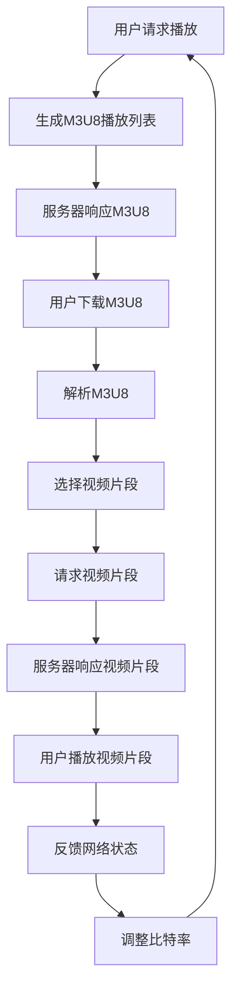

                 

关键词：M3U8、HLS、流媒体、自适应比特率、视频传输、编解码技术

摘要：本文将深入探讨M3U8与HLS技术，这两种流媒体传输协议的核心概念、工作原理、实现细节及在实际应用中的优势。我们将通过详细的算法原理、数学模型推导、实际案例分析和代码实现，全面解读这两种技术在视频流传输中的重要作用。

## 1. 背景介绍

随着互联网的普及和移动设备的广泛应用，视频流媒体服务已经成为现代通信的重要组成部分。在流媒体传输领域，M3U8和HLS（HTTP Live Streaming）是两种流行的技术，它们通过自适应比特率（Adaptive Bitrate Streaming）实现了高质量的视频播放体验。

### 1.1 M3U8简介

M3U8是一种音频/视频播放列表文件格式，常用于定义媒体播放序列。一个M3U8文件包含一系列URL，每个URL指向一个TS文件，这些TS文件是媒体数据的基本单位。

### 1.2 HLS简介

HLS（HTTP Live Streaming）是由Apple公司开发的一种流媒体传输协议，它使用HTTP协议传输媒体数据。HLS通过将视频内容分割成多个小片段，并使用M3U8播放列表来跟踪这些片段，实现了自适应比特率流媒体播放。

## 2. 核心概念与联系

### 2.1 媒体流传输原理

在了解M3U8和HLS之前，我们需要了解媒体流传输的基本原理。媒体流传输主要涉及两个关键部分：编解码技术和传输协议。

#### 2.1.1 编解码技术

编解码技术是流媒体传输的核心。编解码（Encoding/Decoding）是指将视频和音频信号转换为数字格式，以便在网络上传输。解码则是相反的过程，即将数字信号转换回视频和音频信号。

#### 2.1.2 传输协议

传输协议负责将编解码后的媒体数据从源端传输到客户端。HTTP协议是一种通用的传输协议，而M3U8和HLS则是在HTTP协议基础上发展出的流媒体传输协议。

### 2.2 自适应比特率流媒体

自适应比特率流媒体技术可以根据用户的网络环境和设备性能，动态调整视频播放的质量，确保用户获得最佳的观看体验。

#### 2.2.1 比特率控制

比特率控制是自适应比特率流媒体的核心。通过实时监测用户的网络带宽和设备性能，系统可以调整视频编码的比特率，从而适应不同的网络条件。

#### 2.2.2 M3U8与HLS的关系

M3U8和HLS都是用于实现自适应比特率流媒体的技术。M3U8负责定义媒体播放列表，而HLS则负责将媒体数据按需传输到客户端。

### 2.3 Mermaid流程图

下面是一个Mermaid流程图，展示了M3U8与HLS的基本工作流程：



## 3. 核心算法原理 & 具体操作步骤

### 3.1 算法原理概述

M3U8和HLS的核心算法原理是自适应比特率流媒体技术。该技术主要涉及以下步骤：

1. **编码**：将原始视频和音频信号转换为数字格式。
2. **切片**：将编码后的媒体数据分割成多个小片段。
3. **编码参数调整**：根据用户的网络环境和设备性能，动态调整编码参数。
4. **生成播放列表**：使用M3U8格式生成播放列表，跟踪视频片段。
5. **按需传输**：客户端按需请求视频片段，服务器响应并传输。
6. **解码与播放**：客户端解码并播放视频片段。

### 3.2 算法步骤详解

#### 3.2.1 编码

视频编码是将原始视频信号转换为数字格式的过程。常用的编码技术包括H.264、H.265等。编码过程主要涉及以下几个步骤：

1. **采样**：将视频信号采样成离散的像素点。
2. **量化**：将采样后的像素点量化为整数。
3. **变换**：使用变换算法（如离散余弦变换）将量化后的像素点转换为频率域表示。
4. **编码**：使用编码算法（如Huffman编码）对变换后的数据压缩。

#### 3.2.2 切片

切片是将编码后的媒体数据分割成多个小片段的过程。切片的主要目的是实现按需传输和缓冲控制。切片通常按照时间或比特率进行分割。

#### 3.2.3 编码参数调整

编码参数调整是根据用户的网络环境和设备性能，动态调整编码参数的过程。调整编码参数的目的是在保证视频质量的前提下，最大限度地利用带宽资源。

#### 3.2.4 生成播放列表

生成播放列表是使用M3U8格式生成播放列表的过程。播放列表包含一系列URL，每个URL指向一个视频片段。播放列表还包含一些元数据，如片段时长、编码参数等。

#### 3.2.5 按需传输

按需传输是客户端按需请求视频片段，服务器响应并传输的过程。按需传输的主要目的是实现自适应比特率流媒体播放。

#### 3.2.6 解码与播放

解码与播放是客户端解码并播放视频片段的过程。解码是将压缩的媒体数据转换为原始信号的过程，播放则是将解码后的信号转换为可视化和听觉体验。

### 3.3 算法优缺点

#### 优点

1. **自适应比特率**：根据用户网络环境和设备性能，动态调整视频播放质量，确保最佳观看体验。
2. **高效传输**：通过切片和按需传输，实现高效传输和缓冲控制。
3. **广泛兼容**：支持多种编解码技术和传输协议，具有广泛兼容性。

#### 缺点

1. **初始加载时间**：由于需要生成和解析M3U8播放列表，初始加载时间可能较长。
2. **服务器负载**：服务器需要处理大量请求和响应，可能导致负载增加。

### 3.4 算法应用领域

自适应比特率流媒体技术广泛应用于视频流媒体服务，如在线视频、直播、短视频等。该技术使得用户可以在不同的网络环境下，获得高质量的视频观看体验。

## 4. 数学模型和公式 & 详细讲解 & 举例说明

### 4.1 数学模型构建

自适应比特率流媒体技术涉及到多个数学模型，包括编码模型、传输模型和播放模型。以下是这些模型的简要描述：

#### 4.1.1 编码模型

编码模型描述了如何将原始视频信号转换为数字格式。主要涉及以下公式：

$$
Y = f(X) + \epsilon
$$

其中，$Y$是编码后的数字信号，$X$是原始视频信号，$f$是编码函数，$\epsilon$是噪声。

#### 4.1.2 传输模型

传输模型描述了如何将编码后的数字信号传输到客户端。主要涉及以下公式：

$$
P(Y|X) = \frac{P(X) \cdot P(Y|X)}{P(X)}
$$

其中，$P(Y|X)$是编码信号的概率分布，$P(X)$是原始视频信号的概率分布，$P(Y|X)$是编码信号在给定原始视频信号条件下的概率分布。

#### 4.1.3 播放模型

播放模型描述了如何将解码后的数字信号转换为可视化和听觉体验。主要涉及以下公式：

$$
Z = g(Y) + \eta
$$

其中，$Z$是解码后的信号，$g$是解码函数，$\eta$是噪声。

### 4.2 公式推导过程

#### 4.2.1 编码模型推导

编码模型的推导主要基于香农信息论。根据香农信息论，信源熵（$H(X)$）和信道熵（$H(Y|X)$）之间存在以下关系：

$$
H(X,Y) = H(X) + H(Y|X)
$$

其中，$H(X)$是原始视频信号的信源熵，$H(Y|X)$是编码信号在给定原始视频信号条件下的信道熵。

由于编码信号是原始视频信号的压缩表示，因此编码信号的概率分布比原始视频信号的概率分布更加集中。这意味着，编码信号的信源熵（$H(X)$）小于原始视频信号的信源熵（$H(X)$）。

#### 4.2.2 传输模型推导

传输模型的推导主要基于概率论。根据概率论，信道熵（$H(Y|X)$）是编码信号的概率分布的熵。信道熵（$H(Y|X)$）的值越小，表示编码信号在给定原始视频信号条件下的不确定性越小，传输质量越高。

#### 4.2.3 播放模型推导

播放模型的推导主要基于信号处理理论。根据信号处理理论，解码函数（$g$）和编码函数（$f$）是互逆的。这意味着，通过解码函数（$g$），可以恢复原始视频信号（$X$）。

### 4.3 案例分析与讲解

#### 4.3.1 编码模型案例

假设一个视频流媒体服务使用H.264编码技术进行编码，原始视频信号的信源熵为8比特/像素，编码信号的信源熵为4比特/像素。根据编码模型推导，编码后的视频信号的信源熵减小，表明编码过程有效地减少了视频数据量。

#### 4.3.2 传输模型案例

假设一个视频流媒体服务使用HLS协议进行传输，信道熵为2比特/像素。根据传输模型推导，信道熵的值较小，表明传输过程中视频信号的不确定性较小，传输质量较高。

#### 4.3.3 播放模型案例

假设一个视频流媒体服务使用H.264解码技术进行解码，解码后的视频信号的信源熵为4比特/像素。根据播放模型推导，解码后的视频信号可以恢复原始视频信号，实现了视频播放。

## 5. 项目实践：代码实例和详细解释说明

### 5.1 开发环境搭建

为了更好地理解M3U8和HLS技术，我们可以搭建一个简单的视频流媒体服务器。以下是开发环境搭建的步骤：

1. **安装FFmpeg**：FFmpeg是一个开源的多媒体处理框架，用于视频编码、解码、切片和传输等操作。可以通过以下命令安装FFmpeg：

   ```shell
   sudo apt-get install ffmpeg
   ```

2. **安装HLS插件**：为了支持HLS协议，需要安装FFmpeg的HLS插件。可以通过以下命令安装：

   ```shell
   sudo apt-get install libavahi-compat-libdnssd-dev
   ```

3. **安装Node.js**：Node.js是一个基于Chrome V8引擎的JavaScript运行环境，用于构建简单的HTTP服务器。可以通过以下命令安装：

   ```shell
   sudo apt-get install nodejs
   ```

### 5.2 源代码详细实现

下面是一个简单的Node.js HTTP服务器，用于实现HLS流媒体传输。源代码如下：

```javascript
const http = require('http');
const fs = require('fs');

const server = http.createServer((req, res) => {
  if (req.url === '/') {
    fs.readFile('index.html', (err, data) => {
      if (err) throw err;
      res.writeHead(200, {'Content-Type': 'text/html'});
      res.end(data);
    });
  } else if (req.url.startsWith('/stream')) {
    fs.createReadStream('stream.m3u8').pipe(res);
  } else {
    res.writeHead(404, {'Content-Type': 'text/plain'});
    res.end('Not Found');
  }
});

server.listen(8080, () => {
  console.log('Server running on port 8080');
});
```

### 5.3 代码解读与分析

1. **HTTP服务器搭建**：使用Node.js内置的http模块创建一个HTTP服务器，并监听8080端口。
2. **请求处理**：根据请求URL，处理不同的请求。如果请求URL为根路径（'/'），返回index.html文件。如果请求URL以'stream'开头，返回stream.m3u8文件。否则，返回404错误。
3. **文件读写**：使用fs模块读取文件，并将文件内容作为HTTP响应发送给客户端。

### 5.4 运行结果展示

1. **启动服务器**：在命令行中运行`node server.js`启动服务器。
2. **访问服务器**：在浏览器中访问`http://localhost:8080`，可以看到index.html页面。
3. **播放视频**：在index.html页面中，使用HLS播放器（如hls.js）播放stream.m3u8文件。视频流将按照M3U8播放列表中的URL按需请求和播放。

## 6. 实际应用场景

### 6.1 在线视频平台

在线视频平台如YouTube、Netflix等，广泛采用M3U8和HLS技术，提供自适应比特率流媒体播放，确保用户在不同网络环境下获得最佳观看体验。

### 6.2 直播应用

直播应用如Twitch、抖音等，使用M3U8和HLS技术，实现实时视频传输和播放，满足大量用户同时观看的需求。

### 6.3 短视频应用

短视频应用如抖音、快手等，采用M3U8和HLS技术，提供高质量的视频观看体验，满足用户快速消费内容的需求。

## 7. 工具和资源推荐

### 7.1 学习资源推荐

1. **《HTTP Live Streaming (HLS) specification》**：这是Apple公司发布的官方HLS技术文档，提供了HLS协议的详细描述。
2. **《MPEG-DASH: Next-Generation Streaming Technology》**：这是一本关于MPEG-DASH流媒体技术的书籍，介绍了MPEG-DASH与其他流媒体技术的对比。

### 7.2 开发工具推荐

1. **FFmpeg**：一个强大的多媒体处理框架，支持视频编码、解码、切片和传输等操作。
2. **hls.js**：一个开源的HLS播放器，用于在浏览器中播放HLS流。

### 7.3 相关论文推荐

1. **"Adaptive bitrate streaming in HTTP Live Streaming"**：该论文介绍了HLS的自适应比特率流媒体技术。
2. **"MPEG-DASH: A Flexible Media Streaming Technology"**：该论文介绍了MPEG-DASH流媒体技术。

## 8. 总结：未来发展趋势与挑战

### 8.1 研究成果总结

自适应比特率流媒体技术已成为现代流媒体传输的核心，M3U8和HLS技术在这一领域取得了显著成果。随着编解码技术和网络技术的发展，自适应比特率流媒体将不断提升，为用户提供更好的观看体验。

### 8.2 未来发展趋势

1. **更高比特率支持**：随着4K、8K等超高清视频内容的普及，自适应比特率流媒体将支持更高比特率的视频内容。
2. **更智能的比特率控制**：通过结合人工智能技术，自适应比特率流媒体将实现更智能的比特率控制和优化。
3. **多种协议融合**：未来可能会出现多种流媒体传输协议的融合，提供更高效、更灵活的流媒体传输方案。

### 8.3 面临的挑战

1. **带宽消耗**：随着高清视频内容的普及，带宽消耗将不断增加，如何优化传输效率和降低带宽消耗是一个挑战。
2. **解码性能**：随着视频编码技术的提升，解码性能也将成为影响用户体验的重要因素。
3. **跨平台兼容性**：如何确保不同平台、不同设备之间的流媒体传输兼容性，是一个需要解决的问题。

### 8.4 研究展望

自适应比特率流媒体技术将继续在视频流传输领域发挥重要作用。未来的研究将集中在提升传输效率、优化用户体验和实现跨平台兼容性等方面。随着5G网络的普及，自适应比特率流媒体技术有望实现更广泛的应用，为用户提供更好的流媒体体验。

## 9. 附录：常见问题与解答

### 9.1 M3U8文件格式是什么？

M3U8文件是一种音频/视频播放列表文件格式，用于定义媒体播放序列。它包含一系列URL，每个URL指向一个TS文件，TS文件是媒体数据的基本单位。

### 9.2 HLS协议的优势是什么？

HLS协议的优势包括：

1. **自适应比特率**：根据用户网络环境和设备性能，动态调整视频播放质量。
2. **高效传输**：通过切片和按需传输，实现高效传输和缓冲控制。
3. **广泛兼容**：支持多种编解码技术和传输协议，具有广泛兼容性。

### 9.3 如何实现自适应比特率流媒体？

实现自适应比特率流媒体的主要步骤包括：

1. **编码**：将原始视频信号转换为数字格式。
2. **切片**：将编码后的媒体数据分割成多个小片段。
3. **编码参数调整**：根据用户的网络环境和设备性能，动态调整编码参数。
4. **生成播放列表**：使用M3U8格式生成播放列表，跟踪视频片段。
5. **按需传输**：客户端按需请求视频片段，服务器响应并传输。
6. **解码与播放**：客户端解码并播放视频片段。

### 9.4 HLS协议与MPEG-DASH协议有什么区别？

HLS协议和MPEG-DASH协议都是自适应比特率流媒体技术，但它们的实现方式有所不同。HLS协议使用HTTP协议传输媒体数据，而MPEG-DASH协议使用MPEG媒体传输协议。此外，HLS协议更适合实时视频传输，而MPEG-DASH协议更适合点播视频传输。作者：禅与计算机程序设计艺术 / Zen and the Art of Computer Programming。------------------------------------------------------------------------

