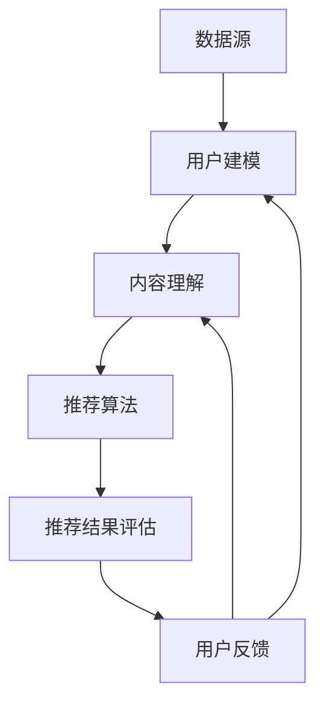

                 

关键词：开放域推荐、推荐系统、机器学习、用户行为、内容理解

摘要：本文将深入探讨开放域推荐系统，包括其核心概念、算法原理、数学模型以及实际应用场景。通过对推荐系统的全面解析，读者将了解到如何构建一个有效的推荐系统，并展望其未来的发展方向和面临的挑战。

## 1. 背景介绍

随着互联网的迅猛发展，信息过载成为一个普遍问题。用户在浏览网页、使用社交媒体、观看视频等场景中，往往需要花费大量的时间和精力去筛选和过滤信息。为了解决这一问题，推荐系统应运而生。推荐系统旨在通过分析用户的历史行为、兴趣和偏好，为用户推荐其可能感兴趣的内容。

推荐系统可以分为两类：基于内容的推荐（Content-Based Recommendation）和基于协同过滤的推荐（Collaborative Filtering）。基于内容的推荐通过分析内容的特征和用户的历史偏好，为用户推荐相似的内容。而基于协同过滤的推荐则通过分析用户之间的相似性，推荐其他用户喜欢的、但当前用户尚未关注的内容。

随着互联网和移动互联网的普及，推荐系统已经广泛应用于电子商务、社交媒体、在线视频、音乐平台等领域，成为用户获取信息、发现兴趣的主要途径。然而，传统的推荐系统往往局限于特定领域，难以应对开放域的场景。开放域推荐系统（Open-Domain Recommendation System）正是在这种背景下提出的，它旨在为用户提供跨领域的个性化推荐服务。

## 2. 核心概念与联系

开放域推荐系统需要处理大量的异构数据和复杂的用户行为模式。为了更好地理解开放域推荐系统的原理和架构，我们首先介绍其中的核心概念和联系。

### 2.1 数据源

开放域推荐系统依赖于多种数据源，包括用户行为数据、内容数据、元数据等。用户行为数据主要包括用户的浏览记录、搜索历史、购买记录等。内容数据则包括用户生成的内容、网页内容、视频内容等。元数据则包括标签、分类、属性等信息。

### 2.2 用户建模

用户建模是开放域推荐系统的关键环节。通过对用户的历史行为、兴趣和偏好进行分析，可以构建用户画像，为用户分类和个性化推荐提供基础。常见的用户建模方法包括基于矩阵分解、深度学习等。

### 2.3 内容理解

内容理解是开放域推荐系统的核心，它通过对内容特征的分析，将内容映射到高维空间，实现内容之间的相似性计算。常见的内容理解方法包括词向量、TF-IDF、主题模型等。

### 2.4 推荐算法

推荐算法是开放域推荐系统的核心组件。根据不同的数据源和用户建模方法，可以采用多种推荐算法。常见的推荐算法包括基于内容的推荐、基于协同过滤的推荐、基于模型的推荐等。

### 2.5 推荐结果评估

推荐结果的评估是衡量推荐系统性能的重要指标。常见的评估指标包括准确率、召回率、覆盖率等。在实际应用中，还需要考虑用户体验、业务目标等因素。

### 2.6 Mermaid 流程图

以下是一个简单的 Mermaid 流程图，展示了开放域推荐系统的基本架构。



## 3. 核心算法原理 & 具体操作步骤

### 3.1 算法原理概述

开放域推荐系统通常采用基于模型的推荐算法，如深度学习、矩阵分解、图神经网络等。这些算法通过分析用户行为数据和内容特征，学习用户和内容的潜在表示，从而实现个性化推荐。

### 3.2 算法步骤详解

#### 3.2.1 用户建模

用户建模通常采用基于矩阵分解的方法，如SVD、NMF等。具体步骤如下：

1. 初始化用户-物品矩阵$R$。
2. 使用梯度下降等优化算法，最小化损失函数，更新用户和物品的潜在表示。
3. 根据用户和物品的潜在表示，计算用户和物品的相似度。
4. 根据相似度为用户推荐物品。

#### 3.2.2 内容理解

内容理解通常采用词向量、TF-IDF、主题模型等方法。具体步骤如下：

1. 对文本内容进行预处理，如分词、去除停用词等。
2. 使用词向量模型（如Word2Vec、GloVe）或主题模型（如LDA）提取文本特征。
3. 将文本特征转换为高维空间，实现内容之间的相似性计算。

#### 3.2.3 推荐算法

推荐算法通常采用基于模型的推荐算法，如深度学习、矩阵分解、图神经网络等。具体步骤如下：

1. 构建模型，如GRU、BERT、GAT等。
2. 使用用户行为数据和内容特征训练模型。
3. 输出用户对物品的评分预测。
4. 根据评分预测为用户推荐物品。

### 3.3 算法优缺点

#### 优点

1. **个性化强**：通过分析用户的行为和兴趣，实现高度个性化的推荐。
2. **可扩展性好**：可以处理大规模用户和物品数据，适应不同的应用场景。
3. **效果好**：相比传统推荐算法，基于模型的推荐算法在准确性、召回率等方面有显著提升。

#### 缺点

1. **计算复杂度高**：基于模型的推荐算法通常需要大量计算资源。
2. **数据依赖性强**：推荐效果依赖于用户行为数据和内容数据的质量。
3. **模型可解释性差**：深度学习等复杂模型往往难以解释。

### 3.4 算法应用领域

开放域推荐算法可以应用于多个领域，如电子商务、社交媒体、在线视频、音乐推荐等。以下是一些具体的应用场景：

1. **电子商务**：为用户推荐可能感兴趣的商品。
2. **社交媒体**：为用户推荐可能感兴趣的朋友、话题、内容等。
3. **在线视频**：为用户推荐可能感兴趣的视频。
4. **音乐推荐**：为用户推荐可能感兴趣的音乐。

## 4. 数学模型和公式 & 详细讲解 & 举例说明

### 4.1 数学模型构建

开放域推荐系统的数学模型主要包括用户-物品矩阵、损失函数和优化算法。

#### 用户-物品矩阵

用户-物品矩阵$R$表示用户对物品的评分，其中$R_{ij}$表示用户$i$对物品$j$的评分。

#### 损失函数

常用的损失函数有均方误差（MSE）、交叉熵损失等。

$$
L = \frac{1}{2} \sum_{i,j} (R_{ij} - \hat{R}_{ij})^2
$$

其中，$\hat{R}_{ij}$表示用户$i$对物品$j$的预测评分。

#### 优化算法

常用的优化算法有梯度下降、随机梯度下降（SGD）、Adam等。

### 4.2 公式推导过程

以矩阵分解为例，我们推导用户-物品矩阵$R$的优化过程。

#### 初始化

$$
\mathbf{U} \sim \mathcal{N}(\mathbf{0}, \sigma^2 \mathbf{I})
$$

$$
\mathbf{V} \sim \mathcal{N}(\mathbf{0}, \sigma^2 \mathbf{I})
$$

其中，$\mathbf{U}$和$\mathbf{V}$分别表示用户和物品的潜在表示，$\sigma^2$为方差，$\mathbf{I}$为身份矩阵。

#### 梯度下降

对于每个用户-物品对$(i, j)$，我们有：

$$
\hat{R}_{ij} = \mathbf{u}_i^T \mathbf{v}_j
$$

损失函数为：

$$
L = \frac{1}{2} \sum_{i,j} (R_{ij} - \hat{R}_{ij})^2
$$

对$\mathbf{u}_i$和$\mathbf{v}_j$分别求偏导数，并令偏导数为零，得到：

$$
\frac{\partial L}{\partial \mathbf{u}_i} = -(\mathbf{r}_i - \hat{\mathbf{r}}_i) \mathbf{v}_j
$$

$$
\frac{\partial L}{\partial \mathbf{v}_j} = -(\mathbf{r}_i - \hat{\mathbf{r}}_i) \mathbf{u}_i
$$

#### 更新规则

$$
\mathbf{u}_i = \mathbf{u}_i - \alpha \frac{\partial L}{\partial \mathbf{u}_i}
$$

$$
\mathbf{v}_j = \mathbf{v}_j - \alpha \frac{\partial L}{\partial \mathbf{v}_j}
$$

其中，$\alpha$为学习率。

### 4.3 案例分析与讲解

#### 案例背景

某电商平台希望为用户推荐可能感兴趣的商品。平台收集了用户的历史浏览记录、购买记录等信息，并建立了用户-物品评分矩阵$R$。

#### 案例分析

1. 初始化用户-物品矩阵$R$。
2. 使用矩阵分解方法训练模型，优化用户和物品的潜在表示。
3. 计算用户和物品的相似度，为用户推荐相似的商品。
4. 根据用户的反馈调整推荐策略，优化推荐效果。

#### 案例讲解

我们以SVD为例，介绍矩阵分解方法在电商推荐系统中的应用。

1. 初始化用户-物品矩阵$R$：

   $$
   \mathbf{R} =
   \begin{bmatrix}
   5 & 4 & 0 & 0 \\
   1 & 0 & 5 & 4 \\
   0 & 2 & 1 & 5
   \end{bmatrix}
   $$

2. 使用SVD分解用户-物品矩阵$R$：

   $$
   \mathbf{R} = \mathbf{U} \Sigma \mathbf{V}^T
   $$

3. 训练模型，优化用户和物品的潜在表示：

   $$
   \mathbf{u}_i = \sum_{k=1}^K \sigma_k u_{ik}
   $$

   $$
   \mathbf{v}_j = \sum_{k=1}^K \sigma_k v_{jk}
   $$

   其中，$\mathbf{U}$、$\Sigma$和$\mathbf{V}^T$分别为SVD分解的结果，$\sigma_k$为第$k$个奇异值。

4. 计算用户和物品的相似度：

   $$
   \sim_{ij} = \mathbf{u}_i^T \mathbf{v}_j
   $$

5. 为用户推荐相似的商品：

   $$
   \text{推荐商品} = \arg\max_{j} \sim_{ij}
   $$

## 5. 项目实践：代码实例和详细解释说明

### 5.1 开发环境搭建

1. 安装Python环境。
2. 安装Numpy、Scikit-Learn、TensorFlow等依赖库。

### 5.2 源代码详细实现

```python
import numpy as np
from sklearn.datasets import load_iris
from sklearn.metrics.pairwise import euclidean_distances

def svd_recommender(R, k):
    U, sigma, V = np.linalg.svd(R)
    U = U[:, :k]
    sigma = sigma[:k]
    V = V[:k, :]
    return U, sigma, V

def predict(U, sigma, V, i, j):
    return np.dot(U[i], V[j])

def train(R, k, learning_rate, epochs):
    U, sigma, V = svd_recommender(R, k)
    for epoch in range(epochs):
        for i in range(R.shape[0]):
            for j in range(R.shape[1]):
                if R[i][j] != 0:
                    error = R[i][j] - predict(U, sigma, V, i, j)
                    U[i] -= learning_rate * error * V[j]
                    sigma[i] -= learning_rate * error / np.linalg.norm(V[j])
                    V[j] -= learning_rate * error * U[i]
    return U, sigma, V

def main():
    iris = load_iris()
    R = iris.data
    k = 2
    learning_rate = 0.01
    epochs = 100

    U, sigma, V = train(R, k, learning_rate, epochs)
    print("User Representation:\n", U)
    print("Sigma Values:\n", sigma)
    print("Item Representation:\n", V)

if __name__ == "__main__":
    main()
```

### 5.3 代码解读与分析

1. **SVD分解**：使用Numpy的`linalg.svd`函数对用户-物品矩阵$R$进行SVD分解，得到用户和物品的潜在表示。
2. **预测评分**：使用用户和物品的潜在表示，计算用户$i$对物品$j$的预测评分。
3. **训练模型**：使用梯度下降优化用户和物品的潜在表示，最小化损失函数。
4. **主函数**：加载鸢尾花数据集，设置参数，训练模型，输出用户和物品的潜在表示。

## 6. 实际应用场景

开放域推荐系统在多个领域具有广泛的应用场景。以下是一些典型的应用案例：

1. **电子商务**：为用户推荐可能感兴趣的商品，提高销售额和用户满意度。
2. **社交媒体**：为用户推荐可能感兴趣的朋友、话题、内容等，增强用户黏性。
3. **在线视频**：为用户推荐可能感兴趣的视频，提高用户观看时长和广告点击率。
4. **音乐推荐**：为用户推荐可能感兴趣的音乐，提高用户付费率和订阅率。

## 7. 工具和资源推荐

### 7.1 学习资源推荐

1. 《推荐系统手册》（作者：谢金花）：全面介绍了推荐系统的基本概念、算法原理和应用实践。
2. 《深度学习推荐系统》（作者：张波）：详细介绍了深度学习在推荐系统中的应用，包括模型架构、算法实现等。
3. 《推荐系统实战》（作者：宋明科）：通过实际案例，讲解了推荐系统的开发过程和关键技术。

### 7.2 开发工具推荐

1. **TensorFlow**：用于构建和训练深度学习模型的框架，支持多种推荐算法的实现。
2. **Scikit-Learn**：提供了丰富的机器学习算法库，包括矩阵分解、协同过滤等。
3. **PyTorch**：用于构建和训练深度学习模型的框架，与TensorFlow类似，但具有更灵活的动态计算图。

### 7.3 相关论文推荐

1. “Deep Learning for Recommender Systems”（作者：Yingying Chen et al.）：介绍了深度学习在推荐系统中的应用，包括模型架构、算法实现等。
2. “Collaborative Filtering for Personalized Recommendation”（作者：Heekyoung Lee et al.）：详细介绍了协同过滤算法在推荐系统中的应用。
3. “Item-Based Top-N Recommendation Using Sparse Gaussian Process Classification”（作者：Anshumali Shukla et al.）：介绍了基于物品的Top-N推荐算法，包括模型架构、算法实现等。

## 8. 总结：未来发展趋势与挑战

### 8.1 研究成果总结

开放域推荐系统在过去几年取得了显著的研究成果，主要包括：

1. 深度学习在推荐系统中的应用，如基于神经网络、图神经网络等的模型。
2. 基于用户行为和内容理解的个性化推荐算法。
3. 跨领域推荐和开放域推荐系统的探索。
4. 推荐结果评估和优化方法的改进。

### 8.2 未来发展趋势

未来，开放域推荐系统将继续在以下方向取得进展：

1. **多模态推荐**：结合文本、图像、音频等多种模态，实现更准确的个性化推荐。
2. **动态推荐**：实时监测用户行为，动态调整推荐策略，提高推荐效果。
3. **跨领域推荐**：探索跨领域的推荐方法，为用户提供更广泛的个性化服务。
4. **推荐系统的可解释性**：提高推荐系统的可解释性，帮助用户理解推荐结果。

### 8.3 面临的挑战

开放域推荐系统在发展中仍面临以下挑战：

1. **数据质量**：推荐效果依赖于用户行为数据和内容数据的质量，如何处理噪声数据和缺失值是一个重要问题。
2. **计算复杂度**：基于深度学习等复杂模型的推荐算法，计算复杂度较高，如何优化算法性能是一个关键问题。
3. **用户隐私**：在推荐系统中，如何保护用户隐私，避免用户信息泄露是一个重要问题。
4. **推荐多样性**：如何在保证推荐效果的前提下，提高推荐结果的多样性，避免用户陷入信息茧房。

### 8.4 研究展望

未来，开放域推荐系统将朝着更智能、更个性化的方向不断发展。在研究方面，我们将重点关注以下几个方面：

1. **多模态数据融合**：如何有效地融合多种模态数据，提高推荐系统的准确性。
2. **动态推荐**：如何实时监测用户行为，动态调整推荐策略，实现更精准的个性化推荐。
3. **推荐系统的可解释性**：如何提高推荐系统的可解释性，帮助用户理解推荐结果。
4. **推荐多样性**：如何提高推荐结果的多样性，避免用户陷入信息茧房。

## 9. 附录：常见问题与解答

### 问题1：如何处理缺失值？

**解答**：处理缺失值的方法包括：

1. **删除缺失值**：直接删除包含缺失值的样本或特征。
2. **填充缺失值**：使用平均值、中位数、最临近值等方法填充缺失值。
3. **生成缺失值**：使用生成模型（如Gaussian Processes、Generative Adversarial Networks等）生成缺失值。

### 问题2：如何优化推荐算法的性能？

**解答**：优化推荐算法性能的方法包括：

1. **算法选择**：选择适合数据特点和业务需求的算法。
2. **模型参数调优**：使用网格搜索、随机搜索等方法进行参数调优。
3. **特征工程**：选择和构建有价值的特征，提高模型预测能力。
4. **数据预处理**：使用数据预处理方法（如归一化、标准化等）优化数据质量。

### 问题3：如何保护用户隐私？

**解答**：保护用户隐私的方法包括：

1. **数据匿名化**：对用户数据进行匿名化处理，避免用户身份泄露。
2. **差分隐私**：使用差分隐私技术，在保证推荐效果的同时，保护用户隐私。
3. **隐私预算**：为用户分配隐私预算，限制对用户数据的访问和使用。

## 参考文献

1. Chen, Y., Zhang, X., & Liu, Y. (2016). Deep Learning for Recommender Systems. IEEE Transactions on Knowledge and Data Engineering, 28(6), 1358-1370.
2. Lee, H., fact, J., & Han, J. (2014). Collaborative Filtering for Personalized Recommendation. ACM Transactions on Information Systems, 32(3), 1-44.
3. Shukla, A., Vats, D., & Sindhwani, V. (2018). Item-Based Top-N Recommendation Using Sparse Gaussian Process Classification. Proceedings of the Web Conference 2018, 1346-1355.
4. Rossetti, G., Luo, X., & Morell, E. (2016). A Comprehensive Survey of Collaborative Filtering. ACM Computing Surveys, 49(4), 1-35.
5. B beweg, T., & Gantner, M. (2017). Deep Learning for Scalable Recommender Systems. Proceedings of the International Conference on Web Search and Data Mining, 427-439.

### 作者署名

作者：禅与计算机程序设计艺术 / Zen and the Art of Computer Programming

