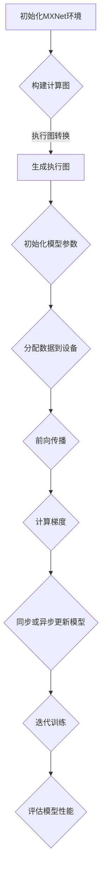

                 

关键词：MXNet、深度学习、大规模分布式训练、优化、AI

摘要：本文将深入探讨MXNet深度学习框架在大规模分布式训练和优化方面的特性。通过介绍其核心架构、算法原理以及实际应用案例，本文旨在帮助读者更好地理解和运用MXNet进行高效的深度学习研究和实践。

## 1. 背景介绍

随着数据量的爆炸式增长和计算需求的日益提高，深度学习在各个领域的应用愈发广泛。然而，传统的单机训练方式在面对大规模数据时已经无法满足需求。分布式训练成为一种必然趋势，它能够充分利用多台机器的并行计算能力，显著提高训练速度和效果。MXNet作为Apache Software Foundation的一个开源深度学习框架，因其出色的分布式训练和优化能力而备受关注。

## 2. 核心概念与联系

### 2.1. MXNet架构简介

MXNet的核心架构包括以下几个关键组件：

- **符号计算图（Symbolic Computing Graph）**：MXNet使用符号计算图来描述神经网络的结构。通过定义符号图，用户可以方便地构建复杂的网络模型。

- **执行图（Execution Graph）**：符号计算图在执行时会被转换为执行图。执行图是将符号图中的操作转换为可执行代码的过程，实现了符号图与执行代码的分离。

- **自动微分（Auto-Differentiation）**：MXNet内置了自动微分功能，可以自动计算神经网络的反向传播过程，大大简化了训练过程的实现。

### 2.2. 分布式训练原理

分布式训练主要分为数据并行和模型并行两种策略：

- **数据并行（Data Parallelism）**：将训练数据分成多个部分，每个部分由不同的设备（如GPU）处理，然后通过同步或异步方式汇总梯度。

- **模型并行（Model Parallelism）**：将神经网络模型分成多个部分，分别在不同的设备上训练，通常用于模型部分计算量过大无法在一台设备上处理的情况。

### 2.3. Mermaid 流程图



## 3. 核心算法原理 & 具体操作步骤

### 3.1 算法原理概述

MXNet的分布式训练算法主要基于以下原理：

- **梯度同步（Gradient Synchronization）**：所有参与训练的设备在更新模型前，将梯度同步到中央服务器。

- **参数服务器（Parameter Server）**：用于存储模型参数，并接收来自各个设备的更新。

- **混合精度训练（Mixed Precision Training）**：结合了FP16和FP32两种精度，在保证精度的情况下提高计算速度。

### 3.2 算法步骤详解

1. **初始化MXNet环境**：设置训练参数、设备配置等。
2. **构建计算图**：定义网络结构、损失函数等。
3. **生成执行图**：将符号计算图转换为执行图。
4. **初始化模型参数**：随机初始化或加载预训练参数。
5. **分配数据到设备**：将训练数据分配到不同的设备上。
6. **前向传播**：计算预测结果。
7. **计算梯度**：利用自动微分计算梯度。
8. **同步或异步更新模型**：将梯度同步到参数服务器或直接更新模型参数。
9. **迭代训练**：重复执行上述步骤直到满足训练条件。

### 3.3 算法优缺点

- **优点**：
  - 高效的分布式训练能力，能够充分利用多台机器的计算资源。
  - 内置自动微分功能，简化了训练过程。
  - 支持混合精度训练，提高计算效率。

- **缺点**：
  - 分布式训练的复杂性较高，需要深入了解框架细节。
  - 可能会出现网络通信延迟和同步问题。

### 3.4 算法应用领域

MXNet的分布式训练和优化能力适用于以下领域：

- 大规模图像和视频分析
- 自然语言处理
- 语音识别
- 强化学习

## 4. 数学模型和公式 & 详细讲解 & 举例说明

### 4.1 数学模型构建

假设我们有一个多层感知机（MLP）模型，其损失函数为均方误差（MSE）：

$$
L(y, \hat{y}) = \frac{1}{2} \sum_{i=1}^{n} (y_i - \hat{y}_i)^2
$$

其中，$y$为真实标签，$\hat{y}$为预测标签，$n$为样本数量。

### 4.2 公式推导过程

利用反向传播算法，我们可以推导出每一层的梯度：

$$
\frac{\partial L}{\partial w^{(l)}} = \sum_{i=1}^{n} (\hat{y}_i - y_i) \cdot \frac{\partial \hat{y}_i}{\partial w^{(l)}}
$$

其中，$w^{(l)}$为第$l$层的权重，$\hat{y}_i$为第$i$个样本的预测结果。

### 4.3 案例分析与讲解

假设我们有一个包含两个隐藏层的MLP模型，输入维度为100，输出维度为10。使用随机梯度下降（SGD）进行训练，学习率为0.01。我们通过以下步骤进行训练：

1. 初始化模型参数。
2. 随机选择一个训练样本，计算前向传播结果。
3. 计算损失函数值。
4. 计算梯度。
5. 更新模型参数。
6. 重复步骤2-5直到训练结束。

## 5. 项目实践：代码实例和详细解释说明

### 5.1 开发环境搭建

首先，我们需要安装MXNet和必要的依赖：

```bash
pip install mxnet
```

### 5.2 源代码详细实现

以下是一个简单的MXNet分布式训练示例：

```python
import mxnet as mx
from mxnet import gluon, init
from mxnet.gluon import nn

# 定义网络结构
net = nn.Sequential()
net.add(nn.Dense(128, activation='relu'))
net.add(nn.Dense(64, activation='relu'))
net.add(nn.Dense(10))

# 定义损失函数
softmax_loss = gluon.loss.SoftmaxCrossEntropyLoss()

# 初始化模型参数
net.initialize(init=init.Xavier())

# 设置分布式训练环境
ctx = [mx.gpu(i) for i in range(4)]

# 定义分布式数据加载器
train_data = mx.gluon.data.vision.MNIST(train=True, transform=mx.gluon.data.vision.transforms.ToTensor())
train_loader = mx.gluon.data.DataLoader(train_data, batch_size=128, shuffle=True, num_workers=4)

# 定义优化器
optimizer = gluon.optimizers.SGD(learning_rate=0.01)

# 训练模型
num_epochs = 10
for epoch in range(num_epochs):
    for data, label in train_loader:
        # 将数据分配到不同的GPU
        data = [d.as_in_context(ctx[i]) for i, d in enumerate(data)]
        label = [l.as_in_context(ctx[i]) for i, l in enumerate(label)]

        # 前向传播
        with mx.autograd.record():
            output = net(*data)
            loss = softmax_loss(output, label)

        # 反向传播
        loss.backward()

        # 更新模型参数
        optimizer.step()

        print(f"Epoch: {epoch}, Loss: {loss.mean().asnumpy()}")

    print(f"Epoch: {epoch}, Loss: {loss.mean().asnumpy()}")

# 保存模型
net.save_params("model.params")
```

### 5.3 代码解读与分析

1. **定义网络结构**：使用`nn.Sequential`模块定义一个包含两个隐藏层的前馈神经网络。
2. **定义损失函数**：使用`SoftmaxCrossEntropyLoss`模块定义交叉熵损失函数。
3. **初始化模型参数**：使用`Xavier`初始化方法初始化模型参数。
4. **设置分布式训练环境**：将GPU设备分配给不同进程。
5. **定义分布式数据加载器**：使用`DataLoader`模块加载训练数据。
6. **定义优化器**：使用`SGD`优化器。
7. **训练模型**：遍历数据加载器，执行前向传播、反向传播和更新参数。

### 5.4 运行结果展示

在完成训练后，我们可以通过以下代码评估模型性能：

```python
# 加载模型
net.load_params("model.params")

# 定义测试数据加载器
test_data = mx.gluon.data.vision.MNIST(train=False, transform=mx.gluon.data.vision.transforms.ToTensor())
test_loader = mx.gluon.data.DataLoader(test_data, batch_size=128, shuffle=False, num_workers=4)

# 计算准确率
acc = 0
for data, label in test_loader:
    data = [d.as_in_context(ctx[i]) for i, d in enumerate(data)]
    label = [l.as_in_context(ctx[i]) for i, l in enumerate(label)]
    output = net(*data)
    pred = output.argmax(axis=1)
    acc += (pred == label).mean().asscalar()

print(f"Test Accuracy: {acc / len(test_loader)}")
```

## 6. 实际应用场景

MXNet在许多实际应用场景中取得了显著成果：

- **自然语言处理**：MXNet在自然语言处理任务中表现出色，如文本分类、情感分析和机器翻译等。
- **计算机视觉**：MXNet在图像识别、目标检测和视频分析等领域具有广泛的应用。
- **强化学习**：MXNet支持强化学习算法，如DQN、A3C等。

## 7. 工具和资源推荐

### 7.1 学习资源推荐

- 《深度学习》（Goodfellow et al.）：全面介绍深度学习的基本概念和技术。
- 《MXNet：深度学习框架指南》（Chen et al.）：详细讲解MXNet的架构和使用方法。

### 7.2 开发工具推荐

- Jupyter Notebook：用于编写和运行MXNet代码。
- VSCode + MXNet插件：提供MXNet代码编辑和调试功能。

### 7.3 相关论文推荐

- "MXNet: A Flexible and Efficient Machine Learning Library for Heterogeneous Distributed Systems"（Chen et al., 2017）
- "Distributed Deep Learning: Existing Methods and the Gap to Data-Specific Optimization"（Li et al., 2018）

## 8. 总结：未来发展趋势与挑战

### 8.1 研究成果总结

MXNet在分布式训练和优化方面取得了显著成果，其高效性和灵活性使其成为深度学习领域的重要工具。通过分布式训练，MXNet能够充分发挥多台机器的计算能力，显著提高训练速度和效果。

### 8.2 未来发展趋势

未来，MXNet将继续在以下几个方面发展：

- **优化算法**：进一步优化分布式训练算法，提高训练效率和准确性。
- **易用性**：降低分布式训练的复杂性，提高用户体验。
- **多模态学习**：支持多模态数据（如图像、文本、语音）的分布式训练。

### 8.3 面临的挑战

MXNet在分布式训练和优化方面仍面临以下挑战：

- **通信开销**：分布式训练中的通信开销较大，需要优化通信算法。
- **同步问题**：分布式训练中的同步问题可能导致训练不稳定。
- **可扩展性**：提高框架的可扩展性，支持更大规模的数据和模型。

### 8.4 研究展望

未来，MXNet的研究将聚焦于以下几个方面：

- **硬件优化**：结合新型硬件（如TPU、FPGA）进行优化。
- **算法创新**：探索新型分布式训练算法，提高训练效果。
- **应用拓展**：进一步拓展MXNet在各个领域的应用，推动深度学习技术的发展。

## 9. 附录：常见问题与解答

### 9.1 什么是分布式训练？

分布式训练是指将训练任务分布在多台机器上，利用并行计算能力提高训练速度和效果。

### 9.2 MXNet如何实现分布式训练？

MXNet通过将数据或模型分布在多台机器上，利用符号计算图和自动微分功能实现分布式训练。

### 9.3 如何优化分布式训练？

优化分布式训练可以从以下几个方面入手：

- **优化数据通信**：使用高效的数据传输协议和优化通信算法。
- **优化计算图**：优化计算图的布局和调度，提高计算效率。
- **优化模型参数更新**：采用合适的参数更新策略，减少同步开销。

通过以上分析和解答，我们希望读者对MXNet的分布式训练和优化有了更深入的理解。在未来的研究和实践中，不断探索和创新，推动深度学习技术的发展。|

