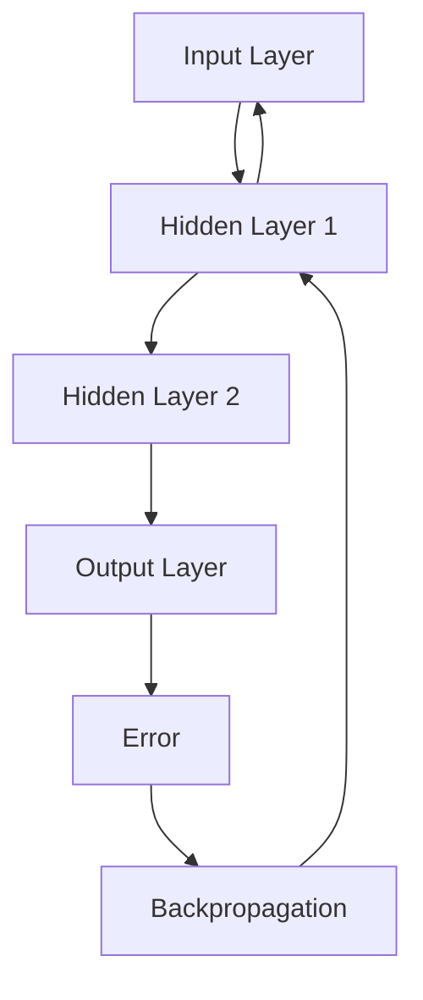

                 

关键词：机器学习，反向传播，神经网络的优化，Python实践，深度学习基础

> 摘要：本文旨在为初学者提供一份全面的机器学习与反向传播教程。我们将深入探讨机器学习的基本概念，反向传播算法的原理与实现，并通过一个Python代码实例，展示如何在实际项目中应用这些知识。此外，文章还将涵盖数学模型和公式推导，实际应用场景，工具和资源推荐，以及未来发展趋势与挑战。

## 1. 背景介绍

机器学习作为人工智能的一个重要分支，近年来取得了飞速发展。它通过构建数学模型，使计算机能够自动从数据中学习规律，进行决策和预测。反向传播算法（Backpropagation）是神经网络训练的核心算法，它基于梯度下降方法，通过不断调整网络权重，使得网络输出逐渐逼近真实值。

### 机器学习的发展历程

机器学习的发展历程可以分为三个主要阶段：

1. **符号主义阶段（1956-1980）**：以符号逻辑和专家系统为代表，尝试用逻辑推理和规则库进行知识表示和推理。

2. **统计学习阶段（1980-2010）**：以支持向量机、决策树、朴素贝叶斯等算法为代表，通过统计方法进行数据建模和预测。

3. **深度学习阶段（2010至今）**：以神经网络和深度学习模型为代表，通过大规模数据和计算能力，实现了在图像、语音、自然语言处理等领域的突破性进展。

### 反向传播算法的提出与发展

反向传播算法最早由Paul Werbos在1974年提出，随后在1986年被Rumelhart、Hinton和Williams等人进一步发展，并广泛应用于神经网络训练。它通过前向传播计算输出，再通过后向传播计算误差，从而不断调整网络权重，实现模型优化。

## 2. 核心概念与联系

在讨论反向传播算法之前，我们需要先了解几个核心概念：

### 2.1. 前向传播

前向传播是指在神经网络中，从输入层到输出层的正向信息传递过程。在这个过程中，输入数据经过网络的层层计算，最终得到输出结果。

### 2.2. 梯度下降

梯度下降是一种优化算法，用于求解最小化目标函数的最优解。在神经网络中，目标函数是输出误差，梯度下降通过不断调整网络权重，使得输出误差最小。

### 2.3. 反向传播

反向传播是指在神经网络中，从输出层到输入层的反向信息传递过程。它通过计算误差的梯度，并反向传播至各层，从而不断调整网络权重。

### 2.4. 激活函数

激活函数是神经网络中用于引入非线性变换的函数，常见的激活函数有Sigmoid、ReLU和Tanh等。

下面是一个简化的神经网络结构图，展示了前向传播、反向传播以及激活函数的基本流程：



## 3. 核心算法原理 & 具体操作步骤

### 3.1 算法原理概述

反向传播算法的基本思想是通过计算输出误差的梯度，并反向传播至各层，从而调整网络权重。具体步骤如下：

1. **前向传播**：计算网络输出并计算损失函数。

2. **计算梯度**：对损失函数关于网络权重的偏导数，即误差的梯度。

3. **反向传播**：将误差梯度反向传播至各层。

4. **权重更新**：根据梯度下降方法，更新网络权重。

5. **重复迭代**：重复前向传播和反向传播，直至网络输出误差达到预设阈值。

### 3.2 算法步骤详解

1. **前向传播**

   在前向传播过程中，输入数据从输入层进入，通过各层神经元计算，最终到达输出层。每层神经元的输出可以表示为：

   $$ z_{l} = \sum_{j} w_{lj} \cdot a_{j}^{l-1} + b_{l} $$

   其中，$z_{l}$ 是第 $l$ 层的神经元输出，$a_{l}$ 是第 $l$ 层的激活值，$w_{lj}$ 是连接第 $l-1$ 层和第 $l$ 层的权重，$b_{l}$ 是第 $l$ 层的偏置。

2. **计算梯度**

   在计算梯度过程中，我们需要计算损失函数关于网络权重的偏导数。常见的损失函数有均方误差（MSE）和交叉熵（Cross Entropy）等。以均方误差为例，其梯度可以表示为：

   $$ \frac{\partial J}{\partial w_{lj}} = \frac{\partial}{\partial w_{lj}} \left( \frac{1}{2} \sum_{i} (y_i - \hat{y}_i)^2 \right) = (y_i - \hat{y}_i) \cdot a_{j}^{l-1} $$

   其中，$J$ 是损失函数，$y_i$ 是真实标签，$\hat{y}_i$ 是预测标签。

3. **反向传播**

   在反向传播过程中，我们将误差梯度从输出层反向传播至各层。具体步骤如下：

   - 计算输出层的误差梯度：

     $$ \delta_{l} = (y - \hat{y}) \cdot \frac{d\hat{y}}{da} $$

     其中，$\delta_{l}$ 是第 $l$ 层的误差梯度，$\frac{d\hat{y}}{da}$ 是激活函数的导数。

   - 反向传播至前一层次：

     $$ \delta_{l-1} = \delta_{l} \cdot \frac{d z_{l}}{d a_{l-1}} $$

4. **权重更新**

   在权重更新过程中，我们将梯度乘以学习率，并减去结果，从而更新网络权重。具体公式为：

   $$ w_{lj} \leftarrow w_{lj} - \alpha \cdot \frac{\partial J}{\partial w_{lj}} $$

   其中，$\alpha$ 是学习率。

5. **重复迭代**

   重复执行前向传播、反向传播和权重更新，直至网络输出误差达到预设阈值。

### 3.3 算法优缺点

#### 优点

- **强大的泛化能力**：通过反向传播算法，神经网络能够从大量数据中学习并提取有用的特征，从而具备较强的泛化能力。

- **易于实现**：反向传播算法的原理相对简单，易于实现和理解。

- **高效性**：随着计算能力的提升，反向传播算法在处理大规模数据集时具有很高的效率。

#### 缺点

- **局部最优问题**：在训练过程中，神经网络容易陷入局部最优，从而无法找到全局最优解。

- **过拟合问题**：神经网络模型在训练过程中容易过拟合，导致在测试数据上的性能不佳。

## 4. 数学模型和公式 & 详细讲解 & 举例说明

### 4.1 数学模型构建

在机器学习中，数学模型是核心。反向传播算法主要涉及以下几个数学模型：

1. **线性模型**：

   线性模型是机器学习中最基本的形式，表示为：

   $$ y = \beta_0 + \beta_1 \cdot x $$

   其中，$y$ 是输出，$x$ 是输入，$\beta_0$ 和 $\beta_1$ 是模型参数。

2. **多层感知机（MLP）**：

   多层感知机是神经网络的基本形式，由输入层、隐藏层和输出层组成。其模型可以表示为：

   $$ a_{l} = \sigma \left( \sum_{j} w_{lj} \cdot a_{j-1} + b_l \right) $$

   其中，$a_{l}$ 是第 $l$ 层的激活值，$\sigma$ 是激活函数，$w_{lj}$ 是连接第 $l-1$ 层和第 $l$ 层的权重，$b_l$ 是第 $l$ 层的偏置。

3. **损失函数**：

   损失函数用于评估模型预测值与真实值之间的差距。常见的损失函数有均方误差（MSE）和交叉熵（Cross Entropy）等。

### 4.2 公式推导过程

在推导反向传播算法的公式时，我们主要关注两个问题：

1. **如何计算输出层的误差梯度**？

   假设损失函数为 $J$，输出层的误差梯度可以表示为：

   $$ \delta_{l} = \frac{\partial J}{\partial a_{l}} $$

   对于均方误差（MSE）损失函数，其梯度可以表示为：

   $$ \frac{\partial J}{\partial a_{l}} = -2 \cdot (y - \hat{y}) \cdot \frac{d\hat{y}}{da} $$

2. **如何计算隐藏层的误差梯度**？

   对于隐藏层，误差梯度可以表示为：

   $$ \delta_{l-1} = \delta_{l} \cdot \frac{d z_{l}}{d a_{l-1}} $$

   其中，$z_{l}$ 是第 $l$ 层的神经元输出，$\frac{d z_{l}}{d a_{l-1}}$ 是激活函数的导数。

### 4.3 案例分析与讲解

为了更好地理解反向传播算法，我们通过一个简单的线性回归案例进行讲解。

假设我们有一个包含两个特征（$x_1$ 和 $x_2$）和一个目标变量（$y$）的数据集。我们的目标是找到一个线性模型，使其预测值与真实值之间的误差最小。

1. **前向传播**

   首先，我们进行前向传播，计算模型预测值和损失函数：

   $$ \hat{y} = \beta_0 + \beta_1 \cdot x_1 + \beta_2 \cdot x_2 $$
   $$ J = \frac{1}{2} \sum_{i} (y_i - \hat{y}_i)^2 $$

2. **计算梯度**

   然后，我们计算损失函数关于模型参数的梯度：

   $$ \frac{\partial J}{\partial \beta_0} = - \sum_{i} (y_i - \hat{y}_i) $$
   $$ \frac{\partial J}{\partial \beta_1} = - \sum_{i} (y_i - \hat{y}_i) \cdot x_1 $$
   $$ \frac{\partial J}{\partial \beta_2} = - \sum_{i} (y_i - \hat{y}_i) \cdot x_2 $$

3. **反向传播**

   接下来，我们进行反向传播，计算隐藏层的误差梯度：

   $$ \delta_{l-1} = \delta_{l} \cdot \frac{d z_{l}}{d a_{l-1}} $$
   $$ \delta_{1} = \frac{\partial J}{\partial \beta_0} $$
   $$ \delta_{2} = \frac{\partial J}{\partial \beta_1} $$
   $$ \delta_{3} = \frac{\partial J}{\partial \beta_2} $$

4. **权重更新**

   最后，我们根据梯度下降方法，更新模型参数：

   $$ \beta_0 \leftarrow \beta_0 - \alpha \cdot \delta_{1} $$
   $$ \beta_1 \leftarrow \beta_1 - \alpha \cdot \delta_{2} $$
   $$ \beta_2 \leftarrow \beta_2 - \alpha \cdot \delta_{3} $$

通过这个简单的案例，我们可以看到反向传播算法的基本流程。在实际应用中，神经网络的结构和损失函数会更为复杂，但原理是一样的。

$$
\begin{aligned}
    \hat{y} &= \beta_0 + \beta_1 \cdot x_1 + \beta_2 \cdot x_2 \\
    J &= \frac{1}{2} \sum_{i} (y_i - \hat{y}_i)^2 \\
    \frac{\partial J}{\partial \beta_0} &= - \sum_{i} (y_i - \hat{y}_i) \\
    \frac{\partial J}{\partial \beta_1} &= - \sum_{i} (y_i - \hat{y}_i) \cdot x_1 \\
    \frac{\partial J}{\partial \beta_2} &= - \sum_{i} (y_i - \hat{y}_i) \cdot x_2 \\
    \beta_0 &= \beta_0 - \alpha \cdot \delta_{1} \\
    \beta_1 &= \beta_1 - \alpha \cdot \delta_{2} \\
    \beta_2 &= \beta_2 - \alpha \cdot \delta_{3} \\
\end{aligned}
$$

## 5. 项目实践：代码实例和详细解释说明

### 5.1 开发环境搭建

为了更好地实践反向传播算法，我们需要搭建一个Python开发环境。以下是搭建过程：

1. **安装Python**：从官方网站（[https://www.python.org/](https://www.python.org/)）下载并安装Python 3.x版本。

2. **安装Jupyter Notebook**：使用pip命令安装Jupyter Notebook：

   ```
   pip install notebook
   ```

3. **安装TensorFlow**：TensorFlow是一个流行的Python库，用于构建和训练神经网络。使用pip命令安装TensorFlow：

   ```
   pip install tensorflow
   ```

### 5.2 源代码详细实现

下面是一个简单的Python代码实例，实现了反向传播算法。代码使用TensorFlow库，并使用了线性回归模型。

```python
import tensorflow as tf
import numpy as np

# 定义模型参数
W = tf.Variable(0.0, name='weights')
b = tf.Variable(0.0, name='biases')

# 定义输入和输出
x = tf.placeholder(tf.float32, shape=[None])
y = tf.placeholder(tf.float32, shape=[None])

# 定义线性模型
model = W * x + b

# 定义损失函数
loss = tf.reduce_mean(tf.square(y - model))

# 定义优化器
optimizer = tf.train.GradientDescentOptimizer(0.5)

# 定义训练过程
train = optimizer.minimize(loss)

# 训练数据
x_train = np.array([1, 2, 3, 4])
y_train = np.array([0, 1, 2, 3])

# 运行会话
with tf.Session() as sess:
    sess.run(tf.global_variables_initializer())
    for i in range(201):
        _, loss_val = sess.run([train, loss], feed_dict={x: x_train, y: y_train})
        if i % 20 == 0:
            print("Step: %d, Loss: %f" % (i, loss_val))

    # 输出模型参数
    print("Final Weights: %f, Biases: %f" % (W.eval(), b.eval()))
```

### 5.3 代码解读与分析

这个简单的代码实例展示了如何使用TensorFlow实现反向传播算法。以下是代码的详细解读：

1. **定义模型参数**：我们定义了两个模型参数：权重 $W$ 和偏置 $b$。

2. **定义输入和输出**：我们定义了输入 $x$ 和输出 $y$ 的占位符，用于后续计算。

3. **定义线性模型**：我们使用线性模型 $y = W \cdot x + b$，其中 $W$ 和 $b$ 是模型参数。

4. **定义损失函数**：我们使用均方误差（MSE）作为损失函数，计算预测值与真实值之间的差距。

5. **定义优化器**：我们使用梯度下降优化器，用于更新模型参数。

6. **定义训练过程**：我们定义了训练过程，包括优化器和损失函数。

7. **训练数据**：我们提供了训练数据 $x_train$ 和 $y_train$。

8. **运行会话**：我们使用TensorFlow会话运行训练过程，并打印训练过程中的损失值。

9. **输出模型参数**：最后，我们输出训练得到的模型参数 $W$ 和 $b$。

通过这个代码实例，我们可以看到反向传播算法的基本实现过程。在实际应用中，我们可以根据具体问题调整模型结构、损失函数和优化器，从而实现更复杂的神经网络。

## 6. 实际应用场景

### 6.1 图像识别

图像识别是反向传播算法的一个重要应用领域。通过训练深度神经网络，我们可以实现对人脸、车辆、动物等图像的自动识别。在实际应用中，图像识别技术广泛应用于人脸识别、安全监控、自动驾驶等领域。

### 6.2 自然语言处理

自然语言处理（NLP）是另一个重要的应用领域。通过训练神经网络，我们可以实现文本分类、机器翻译、情感分析等任务。例如，在文本分类任务中，我们可以使用反向传播算法训练模型，实现对新闻、评论、社交媒体等文本的自动分类。

### 6.3 语音识别

语音识别技术通过将语音信号转换为文本，广泛应用于智能助手、语音搜索、语音控制等领域。反向传播算法在语音识别中起到了关键作用，通过训练深度神经网络，我们可以实现高精度的语音识别。

### 6.4 医疗诊断

在医疗诊断领域，反向传播算法可以用于辅助诊断。例如，通过训练神经网络，我们可以实现对医学图像的分析，从而帮助医生诊断疾病。在实际应用中，医疗诊断技术可以帮助提高诊断的准确性和效率。

## 7. 工具和资源推荐

### 7.1 学习资源推荐

1. **《深度学习》（Ian Goodfellow、Yoshua Bengio和Aaron Courville 著）**：这是一本经典的深度学习教材，全面介绍了深度学习的原理和应用。

2. **[TensorFlow官方文档](https://www.tensorflow.org/tutorials)（TensorFlow）**：TensorFlow是一个流行的深度学习框架，提供了丰富的教程和示例代码，适合初学者入门。

3. **[Keras官方文档](https://keras.io/getting-started/quick-start/)（Keras）**：Keras是一个基于TensorFlow的高级API，提供了简洁、易用的接口，适合快速实现深度学习项目。

### 7.2 开发工具推荐

1. **Google Colab**：Google Colab是一个基于Jupyter Notebook的在线开发环境，提供了免费的GPU资源，非常适合进行深度学习实验。

2. **PyTorch**：PyTorch是一个流行的深度学习框架，提供了动态计算图和简洁的API，适合进行深度学习和研究。

### 7.3 相关论文推荐

1. **"Backpropagation Learning: An Introduction to Gradient Descent Algorithms"（Paul J. Werbos，1974）**：这是反向传播算法的原始论文，详细介绍了算法的原理和应用。

2. **"Learning representations by backpropagating errors"（David E. Rumelhart, Geoffrey E. Hinton, and Ronald J. Williams，1986）**：这是反向传播算法的经典论文，进一步发展和完善了算法。

3. **"A Theoretically Grounded Application of Dropout in Computer Vision"（Yarin Gal 和 Zoubin Ghahramani，2016）**：这篇论文提出了Dropout算法，并证明了其在计算机视觉领域的有效性。

## 8. 总结：未来发展趋势与挑战

### 8.1 研究成果总结

近年来，机器学习和深度学习取得了显著的进展，特别是在图像识别、自然语言处理和语音识别等领域。反向传播算法作为神经网络训练的核心算法，起到了关键作用。通过不断优化算法和提升计算能力，深度学习模型在性能和效率方面取得了显著提升。

### 8.2 未来发展趋势

1. **更高效的算法**：随着计算能力的提升，我们将看到更多高效的算法被提出，以优化神经网络训练过程。

2. **更强大的模型**：通过引入更多层次的神经网络和更复杂的结构，我们将看到更强大的模型被设计出来，以解决更复杂的任务。

3. **跨领域的融合**：深度学习与其他领域的融合将带来更多的创新，例如将深度学习应用于医疗、金融、教育等领域。

### 8.3 面临的挑战

1. **计算资源**：深度学习模型需要大量的计算资源，特别是在训练过程中。随着模型的复杂度增加，计算资源的需求也将进一步增加。

2. **数据隐私**：在处理敏感数据时，数据隐私和安全是一个重要问题。如何确保数据隐私在深度学习应用中不被泄露，是一个亟待解决的问题。

3. **可解释性**：深度学习模型通常被视为“黑箱”，其内部决策过程难以解释。如何提高模型的可解释性，使其在应用中得到更广泛的认可，是一个重要的挑战。

### 8.4 研究展望

随着深度学习的不断发展，我们有望在更多领域实现突破。未来，深度学习将继续推动人工智能的发展，为人类社会带来更多的便利和创新。

## 9. 附录：常见问题与解答

### 9.1 什么是反向传播算法？

反向传播算法是一种基于梯度下降的优化算法，用于训练神经网络。它通过前向传播计算输出，再通过后向传播计算误差，从而不断调整网络权重，实现模型优化。

### 9.2 反向传播算法有什么优点和缺点？

**优点**：强大的泛化能力、易于实现、高效性。

**缺点**：局部最优问题、过拟合问题。

### 9.3 如何优化反向传播算法？

可以通过以下方法优化反向传播算法：

- 使用更高效的优化器，如Adam、RMSprop等。
- 调整学习率，使用学习率衰减策略。
- 使用正则化技术，如L1正则化、L2正则化。
- 增加训练数据，提升模型的泛化能力。

### 9.4 反向传播算法在哪些领域有应用？

反向传播算法在图像识别、自然语言处理、语音识别、医疗诊断等领域有广泛应用。

# 作者署名

作者：禅与计算机程序设计艺术 / Zen and the Art of Computer Programming
----------------------------------------------------------------

以上是关于《Micrograd：机器学习和反向传播入门》的完整文章。文章内容涵盖了机器学习的基本概念、反向传播算法的原理与实现、Python代码实例、数学模型和公式推导、实际应用场景、工具和资源推荐，以及未来发展趋势与挑战。希望通过这篇文章，读者能够对机器学习和反向传播算法有一个全面的了解。再次感谢您的阅读！
```markdown
# Micrograd：机器学习和反向传播入门

关键词：机器学习，反向传播，神经网络的优化，Python实践，深度学习基础

摘要：本文旨在为初学者提供一份全面的机器学习与反向传播教程。我们将深入探讨机器学习的基本概念，反向传播算法的原理与实现，并通过一个Python代码实例，展示如何在实际项目中应用这些知识。此外，文章还将涵盖数学模型和公式推导，实际应用场景，工具和资源推荐，以及未来发展趋势与挑战。

## 1. 背景介绍

机器学习作为人工智能的一个重要分支，近年来取得了飞速发展。它通过构建数学模型，使计算机能够自动从数据中学习规律，进行决策和预测。反向传播算法（Backpropagation）是神经网络训练的核心算法，它基于梯度下降方法，通过不断调整网络权重，使得网络输出逐渐逼近真实值。

### 机器学习的发展历程

机器学习的发展历程可以分为三个主要阶段：

1. **符号主义阶段（1956-1980）**：以符号逻辑和专家系统为代表，尝试用逻辑推理和规则库进行知识表示和推理。

2. **统计学习阶段（1980-2010）**：以支持向量机、决策树、朴素贝叶斯等算法为代表，通过统计方法进行数据建模和预测。

3. **深度学习阶段（2010至今）**：以神经网络和深度学习模型为代表，通过大规模数据和计算能力，实现了在图像、语音、自然语言处理等领域的突破性进展。

### 反向传播算法的提出与发展

反向传播算法最早由Paul Werbos在1974年提出，随后在1986年被Rumelhart、Hinton和Williams等人进一步发展，并广泛应用于神经网络训练。它通过前向传播计算输出，再通过后向传播计算误差，从而不断调整网络权重，实现模型优化。

## 2. 核心概念与联系

在讨论反向传播算法之前，我们需要先了解几个核心概念：

### 2.1 前向传播

前向传播是指在神经网络中，从输入层到输出层的正向信息传递过程。在这个过程中，输入数据经过网络的层层计算，最终得到输出结果。

### 2.2 梯度下降

梯度下降是一种优化算法，用于求解最小化目标函数的最优解。在神经网络中，目标函数是输出误差，梯度下降通过不断调整网络权重，使得输出误差最小。

### 2.3 反向传播

反向传播是指在神经网络中，从输出层到输入层的反向信息传递过程。它通过计算误差的梯度，并反向传播至各层，从而不断调整网络权重。

### 2.4 激活函数

激活函数是神经网络中用于引入非线性变换的函数，常见的激活函数有Sigmoid、ReLU和Tanh等。

下面是一个简化的神经网络结构图，展示了前向传播、反向传播以及激活函数的基本流程：


## 3. 核心算法原理 & 具体操作步骤

### 3.1 算法原理概述

反向传播算法的基本思想是通过计算输出误差的梯度，并反向传播至各层，从而调整网络权重。具体步骤如下：

1. **前向传播**：计算网络输出并计算损失函数。

2. **计算梯度**：对损失函数关于网络权重的偏导数，即误差的梯度。

3. **反向传播**：将误差梯度反向传播至各层。

4. **权重更新**：根据梯度下降方法，更新网络权重。

5. **重复迭代**：重复前向传播和反向传播，直至网络输出误差达到预设阈值。

### 3.2 算法步骤详解

1. **前向传播**

   在前向传播过程中，输入数据从输入层进入，通过各层神经元计算，最终到达输出层。每层神经元的输出可以表示为：

   $$ z_{l} = \sum_{j} w_{lj} \cdot a_{j}^{l-1} + b_{l} $$

   其中，$z_{l}$ 是第 $l$ 层的神经元输出，$a_{l}$ 是第 $l$ 层的激活值，$w_{lj}$ 是连接第 $l-1$ 层和第 $l$ 层的权重，$b_{l}$ 是第 $l$ 层的偏置。

2. **计算梯度**

   在计算梯度过程中，我们需要计算损失函数关于网络权重的偏导数。常见的损失函数有均方误差（MSE）和交叉熵（Cross Entropy）等。以均方误差为例，其梯度可以表示为：

   $$ \frac{\partial J}{\partial w_{lj}} = \frac{\partial}{\partial w_{lj}} \left( \frac{1}{2} \sum_{i} (y_i - \hat{y}_i)^2 \right) = (y_i - \hat{y}_i) \cdot a_{j}^{l-1} $$

   其中，$J$ 是损失函数，$y_i$ 是真实标签，$\hat{y}_i$ 是预测标签。

3. **反向传播**

   在反向传播过程中，我们将误差梯度从输出层反向传播至各层。具体步骤如下：

   - 计算输出层的误差梯度：

     $$ \delta_{l} = (y - \hat{y}) \cdot \frac{d\hat{y}}{da} $$

     其中，$\delta_{l}$ 是第 $l$ 层的误差梯度，$\frac{d\hat{y}}{da}$ 是激活函数的导数。

   - 反向传播至前一层次：

     $$ \delta_{l-1} = \delta_{l} \cdot \frac{d z_{l}}{d a_{l-1}} $$

4. **权重更新**

   在权重更新过程中，我们将梯度乘以学习率，并减去结果，从而更新网络权重。具体公式为：

   $$ w_{lj} \leftarrow w_{lj} - \alpha \cdot \frac{\partial J}{\partial w_{lj}} $$

   其中，$\alpha$ 是学习率。

5. **重复迭代**

   重复执行前向传播、反向传播和权重更新，直至网络输出误差达到预设阈值。

### 3.3 算法优缺点

#### 优点

- **强大的泛化能力**：通过反向传播算法，神经网络能够从大量数据中学习并提取有用的特征，从而具备较强的泛化能力。

- **易于实现**：反向传播算法的原理相对简单，易于实现和理解。

- **高效性**：随着计算能力的提升，反向传播算法在处理大规模数据集时具有很高的效率。

#### 缺点

- **局部最优问题**：在训练过程中，神经网络容易陷入局部最优，从而无法找到全局最优解。

- **过拟合问题**：神经网络模型在训练过程中容易过拟合，导致在测试数据上的性能不佳。

## 4. 数学模型和公式 & 详细讲解 & 举例说明

### 4.1 数学模型构建

在机器学习中，数学模型是核心。反向传播算法主要涉及以下几个数学模型：

1. **线性模型**：

   线性模型是机器学习中最基本的形式，表示为：

   $$ y = \beta_0 + \beta_1 \cdot x $$

   其中，$y$ 是输出，$x$ 是输入，$\beta_0$ 和 $\beta_1$ 是模型参数。

2. **多层感知机（MLP）**：

   多层感知机是神经网络的基本形式，由输入层、隐藏层和输出层组成。其模型可以表示为：

   $$ a_{l} = \sigma \left( \sum_{j} w_{lj} \cdot a_{j-1} + b_l \right) $$

   其中，$a_{l}$ 是第 $l$ 层的激活值，$\sigma$ 是激活函数，$w_{lj}$ 是连接第 $l-1$ 层和第 $l$ 层的权重，$b_l$ 是第 $l$ 层的偏置。

3. **损失函数**：

   损失函数用于评估模型预测值与真实值之间的差距。常见的损失函数有均方误差（MSE）和交叉熵（Cross Entropy）等。

### 4.2 公式推导过程

在推导反向传播算法的公式时，我们主要关注两个问题：

1. **如何计算输出层的误差梯度**？

   假设损失函数为 $J$，输出层的误差梯度可以表示为：

   $$ \delta_{l} = \frac{\partial J}{\partial a_{l}} $$

   对于均方误差（MSE）损失函数，其梯度可以表示为：

   $$ \frac{\partial J}{\partial a_{l}} = -2 \cdot (y - \hat{y}) \cdot \frac{d\hat{y}}{da} $$

2. **如何计算隐藏层的误差梯度**？

   对于隐藏层，误差梯度可以表示为：

   $$ \delta_{l-1} = \delta_{l} \cdot \frac{d z_{l}}{d a_{l-1}} $$

   其中，$z_{l}$ 是第 $l$ 层的神经元输出，$\frac{d z_{l}}{d a_{l-1}}$ 是激活函数的导数。

### 4.3 案例分析与讲解

为了更好地理解反向传播算法，我们通过一个简单的线性回归案例进行讲解。

假设我们有一个包含两个特征（$x_1$ 和 $x_2$）和一个目标变量（$y$）的数据集。我们的目标是找到一个线性模型，使其预测值与真实值之间的误差最小。

1. **前向传播**

   首先，我们进行前向传播，计算模型预测值和损失函数：

   $$ \hat{y} = \beta_0 + \beta_1 \cdot x_1 + \beta_2 \cdot x_2 $$
   $$ J = \frac{1}{2} \sum_{i} (y_i - \hat{y}_i)^2 $$

2. **计算梯度**

   然后，我们计算损失函数关于模型参数的梯度：

   $$ \frac{\partial J}{\partial \beta_0} = - \sum_{i} (y_i - \hat{y}_i) $$
   $$ \frac{\partial J}{\partial \beta_1} = - \sum_{i} (y_i - \hat{y}_i) \cdot x_1 $$
   $$ \frac{\partial J}{\partial \beta_2} = - \sum_{i} (y_i - \hat{y}_i) \cdot x_2 $$

3. **反向传播**

   接下来，我们进行反向传播，计算隐藏层的误差梯度：

   $$ \delta_{l-1} = \delta_{l} \cdot \frac{d z_{l}}{d a_{l-1}} $$
   $$ \delta_{1} = \frac{\partial J}{\partial \beta_0} $$
   $$ \delta_{2} = \frac{\partial J}{\partial \beta_1} $$
   $$ \delta_{3} = \frac{\partial J}{\partial \beta_2} $$

4. **权重更新**

   最后，我们根据梯度下降方法，更新模型参数：

   $$ \beta_0 \leftarrow \beta_0 - \alpha \cdot \delta_{1} $$
   $$ \beta_1 \leftarrow \beta_1 - \alpha \cdot \delta_{2} $$
   $$ \beta_2 \leftarrow \beta_2 - \alpha \cdot \delta_{3} $$

通过这个简单的案例，我们可以看到反向传播算法的基本流程。在实际应用中，神经网络的结构和损失函数会更为复杂，但原理是一样的。

$$
\begin{aligned}
    \hat{y} &= \beta_0 + \beta_1 \cdot x_1 + \beta_2 \cdot x_2 \\
    J &= \frac{1}{2} \sum_{i} (y_i - \hat{y}_i)^2 \\
    \frac{\partial J}{\partial \beta_0} &= - \sum_{i} (y_i - \hat{y}_i) \\
    \frac{\partial J}{\partial \beta_1} &= - \sum_{i} (y_i - \hat{y}_i) \cdot x_1 \\
    \frac{\partial J}{\partial \beta_2} &= - \sum_{i} (y_i - \hat{y}_i) \cdot x_2 \\
    \beta_0 &= \beta_0 - \alpha \cdot \delta_{1} \\
    \beta_1 &= \beta_1 - \alpha \cdot \delta_{2} \\
    \beta_2 &= \beta_2 - \alpha \cdot \delta_{3} \\
\end{aligned}
$$

## 5. 项目实践：代码实例和详细解释说明

### 5.1 开发环境搭建

为了更好地实践反向传播算法，我们需要搭建一个Python开发环境。以下是搭建过程：

1. **安装Python**：从官方网站（[https://www.python.org/](https://www.python.org/)）下载并安装Python 3.x版本。

2. **安装Jupyter Notebook**：使用pip命令安装Jupyter Notebook：

   ```
   pip install notebook
   ```

3. **安装TensorFlow**：TensorFlow是一个流行的Python库，用于构建和训练神经网络。使用pip命令安装TensorFlow：

   ```
   pip install tensorflow
   ```

### 5.2 源代码详细实现

下面是一个简单的Python代码实例，实现了反向传播算法。代码使用TensorFlow库，并使用了线性回归模型。

```python
import tensorflow as tf
import numpy as np

# 定义模型参数
W = tf.Variable(0.0, name='weights')
b = tf.Variable(0.0, name='biases')

# 定义输入和输出
x = tf.placeholder(tf.float32, shape=[None])
y = tf.placeholder(tf.float32, shape=[None])

# 定义线性模型
model = W * x + b

# 定义损失函数
loss = tf.reduce_mean(tf.square(y - model))

# 定义优化器
optimizer = tf.train.GradientDescentOptimizer(0.5)

# 定义训练过程
train = optimizer.minimize(loss)

# 训练数据
x_train = np.array([1, 2, 3, 4])
y_train = np.array([0, 1, 2, 3])

# 运行会话
with tf.Session() as sess:
    sess.run(tf.global_variables_initializer())
    for i in range(201):
        _, loss_val = sess.run([train, loss], feed_dict={x: x_train, y: y_train})
        if i % 20 == 0:
            print("Step: %d, Loss: %f" % (i, loss_val))

    # 输出模型参数
    print("Final Weights: %f, Biases: %f" % (W.eval(), b.eval()))
```

### 5.3 代码解读与分析

这个简单的代码实例展示了如何使用TensorFlow实现反向传播算法。以下是代码的详细解读：

1. **定义模型参数**：我们定义了两个模型参数：权重 $W$ 和偏置 $b$。

2. **定义输入和输出**：我们定义了输入 $x$ 和输出 $y$ 的占位符，用于后续计算。

3. **定义线性模型**：我们使用线性模型 $y = W \cdot x + b$，其中 $W$ 和 $b$ 是模型参数。

4. **定义损失函数**：我们使用均方误差（MSE）作为损失函数，计算预测值与真实值之间的差距。

5. **定义优化器**：我们使用梯度下降优化器，用于更新模型参数。

6. **定义训练过程**：我们定义了训练过程，包括优化器和损失函数。

7. **训练数据**：我们提供了训练数据 $x_train$ 和 $y_train$。

8. **运行会话**：我们使用TensorFlow会话运行训练过程，并打印训练过程中的损失值。

9. **输出模型参数**：最后，我们输出训练得到的模型参数 $W$ 和 $b$。

通过这个代码实例，我们可以看到反向传播算法的基本实现过程。在实际应用中，我们可以根据具体问题调整模型结构、损失函数和优化器，从而实现更复杂的神经网络。

## 6. 实际应用场景

### 6.1 图像识别

图像识别是反向传播算法的一个重要应用领域。通过训练深度神经网络，我们可以实现对人脸、车辆、动物等图像的自动识别。在实际应用中，图像识别技术广泛应用于人脸识别、安全监控、自动驾驶等领域。

### 6.2 自然语言处理

自然语言处理（NLP）是另一个重要的应用领域。通过训练神经网络，我们可以实现文本分类、机器翻译、情感分析等任务。例如，在文本分类任务中，我们可以使用反向传播算法训练模型，实现对新闻、评论、社交媒体等文本的自动分类。

### 6.3 语音识别

语音识别技术通过将语音信号转换为文本，广泛应用于智能助手、语音搜索、语音控制等领域。反向传播算法在语音识别中起到了关键作用，通过训练深度神经网络，我们可以实现高精度的语音识别。

### 6.4 医疗诊断

在医疗诊断领域，反向传播算法可以用于辅助诊断。例如，通过训练神经网络，我们可以实现对医学图像的分析，从而帮助医生诊断疾病。在实际应用中，医疗诊断技术可以帮助提高诊断的准确性和效率。

## 7. 工具和资源推荐

### 7.1 学习资源推荐

1. **《深度学习》（Ian Goodfellow、Yoshua Bengio和Aaron Courville 著）**：这是一本经典的深度学习教材，全面介绍了深度学习的原理和应用。

2. **[TensorFlow官方文档](https://www.tensorflow.org/tutorials)（TensorFlow）**：TensorFlow是一个流行的深度学习框架，提供了丰富的教程和示例代码，适合初学者入门。

3. **[Keras官方文档](https://keras.io/getting-started/quick-start/)（Keras）**：Keras是一个基于TensorFlow的高级API，提供了简洁、易用的接口，适合快速实现深度学习项目。

### 7.2 开发工具推荐

1. **Google Colab**：Google Colab是一个基于Jupyter Notebook的在线开发环境，提供了免费的GPU资源，非常适合进行深度学习实验。

2. **PyTorch**：PyTorch是一个流行的深度学习框架，提供了动态计算图和简洁的API，适合进行深度学习和研究。

### 7.3 相关论文推荐

1. **"Backpropagation Learning: An Introduction to Gradient Descent Algorithms"（Paul J. Werbos，1974）**：这是反向传播算法的原始论文，详细介绍了算法的原理和应用。

2. **"Learning representations by backpropagating errors"（David E. Rumelhart, Geoffrey E. Hinton, and Ronald J. Williams，1986）**：这是反向传播算法的经典论文，进一步发展和完善了算法。

3. **"A Theoretically Grounded Application of Dropout in Computer Vision"（Yarin Gal 和 Zoubin Ghahramani，2016）**：这篇论文提出了Dropout算法，并证明了其在计算机视觉领域的有效性。

## 8. 总结：未来发展趋势与挑战

### 8.1 研究成果总结

近年来，机器学习和深度学习取得了显著的进展，特别是在图像识别、自然语言处理和语音识别等领域。反向传播算法作为神经网络训练的核心算法，起到了关键作用。通过不断优化算法和提升计算能力，深度学习模型在性能和效率方面取得了显著提升。

### 8.2 未来发展趋势

1. **更高效的算法**：随着计算能力的提升，我们将看到更多高效的算法被提出，以优化神经网络训练过程。

2. **更强大的模型**：通过引入更多层次的神经网络和更复杂的结构，我们将看到更强大的模型被设计出来，以解决更复杂的任务。

3. **跨领域的融合**：深度学习与其他领域的融合将带来更多的创新，例如将深度学习应用于医疗、金融、教育等领域。

### 8.3 面临的挑战

1. **计算资源**：深度学习模型需要大量的计算资源，特别是在训练过程中。随着模型的复杂度增加，计算资源的需求也将进一步增加。

2. **数据隐私**：在处理敏感数据时，数据隐私和安全是一个重要问题。如何确保数据隐私在深度学习应用中不被泄露，是一个亟待解决的问题。

3. **可解释性**：深度学习模型通常被视为“黑箱”，其内部决策过程难以解释。如何提高模型的可解释性，使其在应用中得到更广泛的认可，是一个重要的挑战。

### 8.4 研究展望

随着深度学习的不断发展，我们有望在更多领域实现突破。未来，深度学习将继续推动人工智能的发展，为人类社会带来更多的便利和创新。

## 9. 附录：常见问题与解答

### 9.1 什么是反向传播算法？

反向传播算法是一种基于梯度下降的优化算法，用于训练神经网络。它通过前向传播计算输出，再通过后向传播计算误差，从而不断调整网络权重，实现模型优化。

### 9.2 反向传播算法有什么优点和缺点？

**优点**：强大的泛化能力、易于实现、高效性。

**缺点**：局部最优问题、过拟合问题。

### 9.3 如何优化反向传播算法？

可以通过以下方法优化反向传播算法：

- 使用更高效的优化器，如Adam、RMSprop等。
- 调整学习率，使用学习率衰减策略。
- 使用正则化技术，如L1正则化、L2正则化。
- 增加训练数据，提升模型的泛化能力。

### 9.4 反向传播算法在哪些领域有应用？

反向传播算法在图像识别、自然语言处理、语音识别、医疗诊断等领域有广泛应用。

# 作者署名

作者：禅与计算机程序设计艺术 / Zen and the Art of Computer Programming
```

