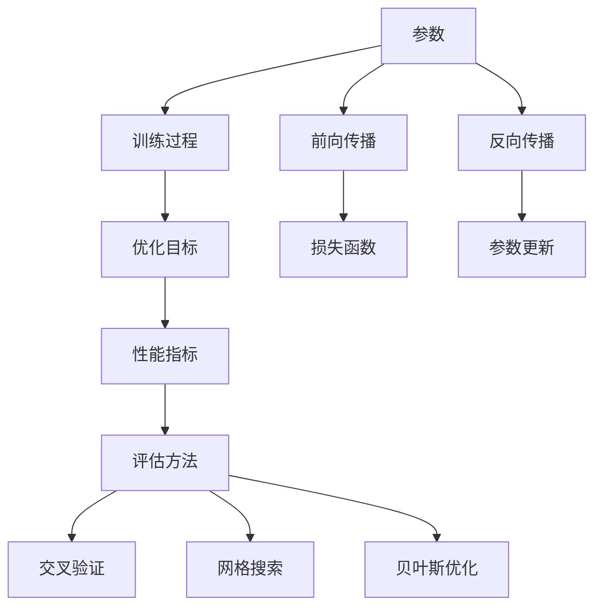

                 

关键词：自然语言处理，大模型，参数优化，能力评估

## 摘要

本文旨在探讨自然语言处理（NLP）领域中大规模语言模型的标准参数与能力。通过深入研究当前NLP大模型的参数设置、优化策略及能力评估方法，本文提出了一个全面的标准框架，以期为NLP领域的应用和研究提供指导。文章首先介绍了NLP大模型的基本概念及其重要性，随后详细分析了参数优化的关键因素，以及如何评估大模型在不同应用场景中的实际能力。最后，本文展望了未来NLP大模型的发展趋势，并提出了相关研究挑战。

## 1. 背景介绍

自然语言处理是计算机科学和人工智能领域的一个重要分支，旨在使计算机能够理解、生成和响应人类语言。随着深度学习和神经网络技术的快速发展，NLP取得了显著进展。特别是在近年来，大规模预训练语言模型如GPT、BERT等，成为了NLP领域的明星技术。这些模型具有数十亿甚至数千亿的参数，通过在大量文本数据上进行训练，能够捕捉到语言的复杂结构和语义信息。

大规模语言模型在多个NLP任务中取得了优异的性能，包括文本分类、情感分析、机器翻译、问答系统等。然而，大模型的成功也带来了一系列挑战，包括参数优化、训练效率、模型解释性等。为了解决这些问题，研究人员提出了多种参数优化策略，并开发了各种评估方法来衡量模型的能力。本文将围绕这些主题展开讨论，旨在为NLP大模型的研究和应用提供有价值的参考。

### 1.1 大模型的重要性

大规模语言模型在NLP领域的成功并非偶然。首先，大模型具有更强的表示能力，能够捕捉到语言中的长距离依赖关系和复杂语义。这使得它们在许多NLP任务中取得了比传统方法更优的性能。例如，BERT模型通过在大规模语料库上进行预训练，能够有效地学习单词和句子级别的语义表示，从而在多种下游任务中取得领先。

其次，大规模模型可以处理更复杂的问题。例如，在机器翻译任务中，大规模模型能够更好地理解源语言和目标语言之间的语义差异，从而生成更自然、准确的翻译结果。在问答系统任务中，大规模模型能够通过上下文信息更好地理解用户的问题，并提供更准确的回答。

最后，大规模模型具有更强的泛化能力。通过在大规模语料库上进行训练，模型能够更好地适应不同的任务和数据集，从而减少对特定领域数据的依赖。这在实际应用中尤为重要，因为许多NLP任务需要处理多样化的数据源和场景。

### 1.2 大模型面临的挑战

尽管大规模语言模型在NLP领域取得了显著进展，但它们也面临一系列挑战。首先，大模型的训练和推理成本非常高。大规模模型的参数数量通常在数十亿到千亿级别，这意味着需要大量的计算资源和时间来完成训练和推理。这不仅增加了研发成本，还限制了模型在实时应用场景中的部署。

其次，大规模模型的解释性较差。由于模型的结构复杂，参数众多，研究人员往往难以直观地理解模型如何生成预测。这使得模型在某些应用场景中难以被信任和接受，特别是在需要高解释性的医疗和金融领域。

最后，大规模模型的优化和调试也是一个挑战。由于模型参数数量庞大，优化过程往往需要大量的迭代和调试，以找到最优的参数设置。此外，大规模模型的过拟合风险较高，需要采用多种技术手段来避免。

### 1.3 大模型的研究现状

近年来，NLP领域的研究主要集中在大规模模型的参数优化、训练效率提升、模型解释性改进等方面。研究人员提出了一系列优化策略，如梯度裁剪、权重共享、多任务学习等，以减少模型的训练时间和提高训练效果。此外，为了提高模型的解释性，研究人员开发了各种模型解析和可视化工具，如SHAP、LIME等。

在训练效率方面，分布式训练和模型压缩技术得到了广泛应用。分布式训练通过将模型训练任务分布在多个计算节点上，可以显著提高训练速度。模型压缩技术则通过降低模型的参数数量和计算复杂度，提高了模型的推理速度。

总的来说，NLP大模型的研究现状表明，尽管面临一系列挑战，但通过不断的技术创新和优化，大规模语言模型在NLP领域的应用前景仍然广阔。未来，随着计算资源的不断丰富和算法的进一步优化，NLP大模型有望在更多领域取得突破性进展。

## 2. 核心概念与联系

在深入探讨NLP大模型的参数优化与能力评估之前，我们需要明确几个核心概念，并了解它们之间的联系。这些核心概念包括但不仅限于：参数、训练过程、优化目标、性能指标和评估方法。以下是这些概念的定义和它们之间的相互关系。

### 2.1 参数

参数是模型中的可调整值，它们决定了模型的行为和性能。在大规模语言模型中，参数通常以权重矩阵的形式表示。这些权重矩阵通过学习过程从训练数据中学习到，以最小化模型预测和实际标签之间的差异。

### 2.2 训练过程

训练过程是模型学习如何从数据中提取特征和模式的过程。对于大规模语言模型，训练过程通常涉及以下步骤：

1. **数据预处理**：将原始文本数据转换为模型可处理的格式，例如单词向量或词嵌入。
2. **前向传播**：将输入数据通过模型的前向传播过程，生成预测输出。
3. **损失函数**：计算模型预测输出与实际标签之间的差异，通常使用交叉熵损失函数。
4. **反向传播**：通过反向传播算法更新模型的权重，以最小化损失函数。
5. **评估**：在训练数据集和验证数据集上评估模型的性能，以调整模型参数。

### 2.3 优化目标

优化目标是训练过程中的核心概念，它决定了模型如何调整其参数以实现最佳性能。对于大规模语言模型，优化目标通常是最小化损失函数，以使模型预测尽可能接近实际标签。

### 2.4 性能指标

性能指标用于衡量模型在特定任务上的表现。在NLP任务中，常见的性能指标包括准确率、召回率、F1分数和损失值等。这些指标在不同任务和场景中有不同的重要性。

### 2.5 评估方法

评估方法用于测量和比较不同模型的性能。在NLP中，常用的评估方法包括交叉验证、网格搜索和贝叶斯优化等。这些方法帮助研究人员确定最佳的模型参数和结构。

### 2.6 核心概念原理和架构的 Mermaid 流程图

以下是NLP大模型的核心概念原理和架构的 Mermaid 流程图，展示上述核心概念之间的相互关系。



### 2.7 各个核心概念的具体解释

**参数**：参数是模型中的可调整权重，决定了模型如何将输入映射到输出。在大规模语言模型中，这些权重通常存储在矩阵中。

**训练过程**：训练过程包括数据预处理、前向传播、损失函数计算、反向传播和参数更新。这个过程使得模型能够从数据中学习并不断优化。

**优化目标**：优化目标是训练过程中的核心，用于指导模型如何调整参数以实现最佳性能。对于NLP大模型，优化目标通常是减少损失函数的值。

**性能指标**：性能指标用于衡量模型在特定任务上的表现。准确率、召回率、F1分数和损失值是常见的性能指标。

**评估方法**：评估方法用于测量和比较模型性能。交叉验证、网格搜索和贝叶斯优化是常用的评估方法。

通过这些核心概念的解释和流程图展示，我们可以更好地理解NLP大模型的工作原理及其参数优化与能力评估的重要性。接下来，我们将深入探讨NLP大模型的参数优化策略，并分析其在不同应用场景中的能力表现。

## 3. 核心算法原理 & 具体操作步骤

### 3.1 算法原理概述

大规模语言模型的参数优化算法通常基于深度学习和神经网络的理论，旨在通过迭代训练过程优化模型参数，使其在特定任务上达到最佳性能。核心算法原理包括以下几个方面：

1. **前向传播**：将输入数据通过神经网络的前向传播过程，生成预测输出。
2. **损失函数**：计算模型预测输出与实际标签之间的差异，通常使用交叉熵损失函数。
3. **反向传播**：通过反向传播算法更新模型的权重，以最小化损失函数。
4. **优化算法**：选择合适的优化算法，如随机梯度下降（SGD）、Adam等，以加速收敛和提高效率。

### 3.2 算法步骤详解

1. **数据预处理**：将原始文本数据转换为模型可处理的格式，例如单词向量或词嵌入。这一步骤通常包括分词、标记化、词汇表构建等操作。

2. **模型初始化**：初始化模型的权重参数。常用的初始化方法包括高斯分布初始化、Xavier初始化等。

3. **前向传播**：将输入数据通过神经网络的前向传播过程，生成预测输出。具体步骤如下：
    - 输入数据经过嵌入层转换为词嵌入向量。
    - 经过多层神经网络（通常为卷积神经网络或循环神经网络）进行特征提取。
    - 输出层通过激活函数（如Softmax）生成概率分布。

4. **损失函数计算**：计算模型预测输出与实际标签之间的差异，通常使用交叉熵损失函数。具体步骤如下：
    - 对每个预测输出和实际标签计算交叉熵损失。
    - 将所有样本的损失值求和，得到总的损失值。

5. **反向传播**：通过反向传播算法更新模型的权重，以最小化损失函数。具体步骤如下：
    - 计算每个权重的梯度。
    - 更新权重，通常使用如下更新公式：
      \[ \text{权重} = \text{权重} - \alpha \times \text{梯度} \]
      其中，\(\alpha\) 为学习率。

6. **优化算法**：选择合适的优化算法，如随机梯度下降（SGD）、Adam等，以加速收敛和提高效率。具体步骤如下：
    - 使用优化算法更新模型权重。
    - 调整学习率和其他超参数，以优化训练过程。

7. **模型评估**：在训练数据集和验证数据集上评估模型的性能，以调整模型参数。具体步骤如下：
    - 在验证数据集上计算模型的准确率、召回率、F1分数等性能指标。
    - 根据性能指标调整模型参数和训练策略。

8. **迭代训练**：重复上述步骤，直到模型达到预定的性能指标或训练次数。

### 3.3 算法优缺点

**优点**：
- **强大的表示能力**：大规模语言模型能够通过在大量文本数据上进行预训练，捕捉到语言中的复杂结构和语义信息，从而在多个NLP任务中取得优异的性能。
- **高效的优化过程**：现代优化算法如Adam、Adadelta等，通过自适应调整学习率，可以显著提高训练效率和收敛速度。
- **泛化能力**：大规模语言模型通过在大规模语料库上进行训练，能够更好地适应不同的任务和数据集，从而减少对特定领域数据的依赖。

**缺点**：
- **计算资源需求高**：大规模语言模型的训练和推理成本较高，需要大量的计算资源和时间。
- **解释性差**：由于模型的结构复杂，参数众多，研究人员往往难以直观地理解模型如何生成预测，从而影响了模型的解释性和透明度。
- **过拟合风险**：大规模语言模型在训练过程中容易受到过拟合问题的影响，需要采用多种技术手段来避免。

### 3.4 算法应用领域

大规模语言模型在多个NLP任务中取得了显著的应用成果，包括但不限于以下领域：

1. **文本分类**：通过大规模语言模型，可以自动将文本数据分类到不同的类别，如新闻分类、情感分析等。
2. **机器翻译**：大规模语言模型在机器翻译任务中表现出色，能够生成更加自然和准确的翻译结果。
3. **问答系统**：大规模语言模型能够通过理解上下文信息，提供更加准确和相关的答案。
4. **对话系统**：大规模语言模型可以应用于智能客服、虚拟助手等对话系统，实现更加自然和流畅的对话交互。
5. **文本生成**：大规模语言模型可以生成高质量的文本，如文章、故事、诗歌等。

总的来说，大规模语言模型在NLP领域具有广泛的应用前景，通过不断优化和改进，它们有望在更多领域取得突破性进展。

## 4. 数学模型和公式 & 详细讲解 & 举例说明

在深入理解NLP大模型的参数优化与能力评估过程中，数学模型和公式是不可或缺的工具。它们不仅为我们提供了理论依据，还帮助我们分析和解释模型的行为。本节将详细介绍NLP大模型中的数学模型和公式，并通过对具体案例的分析，展示如何应用这些公式。

### 4.1 数学模型构建

NLP大模型的数学模型通常基于深度学习和神经网络理论，主要涉及以下几个部分：

1. **前向传播公式**：前向传播过程用于计算模型的输出，它包括输入层、隐藏层和输出层的传递。以下是一个简单的多层感知器（MLP）的前向传播公式：
   \[
   z^{(l)} = \sum_{j} w^{(l)}_{ji} a^{(l-1)}_{j} + b^{(l)}_{i}
   \]
   \[
   a^{(l)}_{i} = \sigma(z^{(l)}_{i})
   \]
   其中，\(z^{(l)}\) 表示第 \(l\) 层的激活值，\(a^{(l)}\) 表示第 \(l\) 层的输出，\(w^{(l)}_{ji}\) 是第 \(l\) 层的权重，\(b^{(l)}_{i}\) 是第 \(l\) 层的偏置，\(\sigma\) 是激活函数，通常取为ReLU、Sigmoid或Softmax。

2. **损失函数**：损失函数用于衡量模型输出与实际标签之间的差异，最常用的是交叉熵损失函数：
   \[
   J = -\frac{1}{m} \sum_{i=1}^{m} \sum_{k=1}^{K} y_k^{(i)} \log(a_k^{(l)})
   \]
   其中，\(y_k^{(i)}\) 是实际标签，\(a_k^{(l)}\) 是模型在第 \(l\) 层的输出概率。

3. **反向传播公式**：反向传播过程用于计算模型参数的梯度，以更新模型权重。以下是一个简单的反向传播公式：
   \[
   \delta^{(l)}_{i} = \delta^{(l+1)} \cdot \frac{\partial z^{(l)}}{\partial a^{(l)}_{i}}
   \]
   \[
   \frac{\partial J}{\partial w^{(l)}_{ji}} = \delta^{(l)}_{i} a^{(l-1)}_{j}
   \]
   \[
   \frac{\partial J}{\partial b^{(l)}_{i}} = \delta^{(l)}_{i}
   \]
   其中，\(\delta^{(l)}\) 是梯度方向，\(\partial\) 表示偏导数。

### 4.2 公式推导过程

为了更好地理解上述公式，下面我们将简要介绍它们的推导过程。

#### 前向传播公式推导

多层感知器的输出 \(a^{(l)}_{i}\) 是通过输入 \(x^{(l-1)}_{j}\) 和权重 \(w^{(l)}_{ji}\) 以及偏置 \(b^{(l)}_{i}\) 的线性组合得到的，然后通过激活函数 \(\sigma\) 进行非线性变换。因此，前向传播公式可以表示为：
\[
z^{(l)}_{i} = \sum_{j} w^{(l)}_{ji} x^{(l-1)}_{j} + b^{(l)}_{i}
\]
\[
a^{(l)}_{i} = \sigma(z^{(l)}_{i})
\]
其中，\(\sigma\) 是一个非线性激活函数，常用的有ReLU、Sigmoid和Softmax。

#### 损失函数推导

交叉熵损失函数是用于分类问题的一种常见损失函数，它衡量的是模型输出概率分布与实际标签之间的差异。假设我们有 \(m\) 个样本，每个样本有 \(K\) 个类别，实际标签为 \(y_k^{(i)}\)（其中 \(y_k^{(i)} = 1\) 表示第 \(k\) 个类别是实际标签，否则为0），模型输出为 \(a_k^{(l)}\)（即第 \(k\) 个类别的预测概率），交叉熵损失函数可以表示为：
\[
J = -\frac{1}{m} \sum_{i=1}^{m} \sum_{k=1}^{K} y_k^{(i)} \log(a_k^{(l)})
\]
其中，\(\log\) 是自然对数函数。

#### 反向传播公式推导

反向传播公式用于计算模型参数的梯度，以更新模型权重。假设我们有 \(L\) 层神经网络，第 \(l\) 层的输出为 \(a^{(l)}_{i}\)，第 \(l+1\) 层的损失函数关于 \(a^{(l)}_{i}\) 的梯度为 \(\delta^{(l+1)}_{i}\)，则第 \(l\) 层关于 \(a^{(l)}_{i}\) 的梯度可以表示为：
\[
\delta^{(l)}_{i} = \delta^{(l+1)} \cdot \frac{\partial z^{(l)}}{\partial a^{(l)}_{i}}
\]
其中，\(\delta^{(l+1)}\) 是从第 \(l+1\) 层传递下来的梯度，\(\frac{\partial z^{(l)}}{\partial a^{(l)}_{i}}\) 是第 \(l\) 层的梯度方向。

对于权重和偏置的梯度，可以表示为：
\[
\frac{\partial J}{\partial w^{(l)}_{ji}} = \delta^{(l)}_{i} a^{(l-1)}_{j}
\]
\[
\frac{\partial J}{\partial b^{(l)}_{i}} = \delta^{(l)}_{i}
\]
其中，\(\delta^{(l)}_{i}\) 是第 \(l\) 层的梯度，\(a^{(l-1)}_{j}\) 是第 \(l-1\) 层的输出。

### 4.3 案例分析与讲解

为了更好地理解上述数学模型和公式的应用，我们来看一个具体的案例——文本分类任务。

#### 案例背景

假设我们有一个文本分类任务，需要将新闻文章分类为“体育”、“科技”、“政治”等类别。我们使用一个多层感知器（MLP）模型来完成这个任务，其中输入层是词嵌入向量，隐藏层是多层神经网络，输出层是softmax函数。

#### 模型设置

- 输入层：词嵌入向量维度为 \(d\)。
- 隐藏层：两层神经网络，每层的神经元数量分别为 \(n_1\) 和 \(n_2\)。
- 输出层：类别数量为 \(K\)，使用softmax函数进行概率输出。

#### 数据预处理

我们将新闻文章进行分词和标记化，然后使用预训练的词嵌入模型（如GloVe或Word2Vec）将每个词转换为词嵌入向量。假设我们有一个训练数据集，包含 \(m\) 个样本。

#### 模型训练

1. **前向传播**：对于每个样本，我们将其输入到模型中，经过多层神经网络的传递，得到输出层的概率分布 \(a^{(L)}\)。
2. **损失函数计算**：使用交叉熵损失函数计算模型输出与实际标签之间的差异。
3. **反向传播**：通过反向传播计算模型参数的梯度，并更新模型权重。
4. **迭代训练**：重复上述步骤，直到模型收敛。

#### 模型评估

在训练完成后，我们在验证数据集上评估模型的性能，计算准确率、召回率、F1分数等指标，以确定模型的分类效果。

#### 公式应用

在前向传播过程中，我们使用以下公式：
\[
a^{(2)}_{i} = \sigma(z^{(2)}_{i}) = \sigma(\sum_{j} w^{(2)}_{ji} a^{(1)}_{j} + b^{(2)}_{i})
\]
\[
a^{(3)}_{i} = \sigma(z^{(3)}_{i}) = \sigma(\sum_{j} w^{(3)}_{ji} a^{(2)}_{j} + b^{(3)}_{i})
\]

在反向传播过程中，我们使用以下公式：
\[
\delta^{(3)}_{i} = \delta^{(4)} \cdot \frac{\partial z^{(3)}}{\partial a^{(3)}_{i}} = \delta^{(4)} \cdot w^{(3)}_{ji}
\]
\[
\frac{\partial J}{\partial w^{(3)}_{ji}} = \delta^{(3)}_{i} a^{(2)}_{j}
\]
\[
\delta^{(2)}_{i} = \delta^{(3)} \cdot \frac{\partial z^{(2)}}{\partial a^{(2)}_{i}} = \delta^{(3)} \cdot w^{(2)}_{ji}
\]
\[
\frac{\partial J}{\partial w^{(2)}_{ji}} = \delta^{(2)}_{i} a^{(1)}_{j}
\]

通过这些公式，我们可以计算模型的梯度，并更新模型权重，从而优化模型性能。

总的来说，数学模型和公式在NLP大模型中起着至关重要的作用。通过深入理解这些公式，我们可以更好地设计、训练和评估大规模语言模型，从而在NLP任务中取得更好的性能。接下来，我们将进一步探讨大规模语言模型在不同应用场景中的能力表现。

### 4.4 案例分析与讲解（续）

在前一节中，我们详细介绍了NLP大模型中数学模型和公式的构建与推导。在这一节中，我们将通过具体案例进一步分析和讲解这些公式的应用，特别是针对文本分类任务中的实际操作步骤。

#### 4.4.1 模型架构与数据集

为了具体说明，我们假设构建了一个用于新闻文章分类的神经网络模型。该模型由以下几个部分组成：

1. **输入层**：接收经过标记化处理和词嵌入转换后的文本数据。
2. **隐藏层**：包括两层神经网络，分别有 \(n_1 = 512\) 和 \(n_2 = 256\) 个神经元。
3. **输出层**：使用softmax函数输出每个类别的概率分布，类别数量为 \(K = 5\)（“体育”、“科技”、“政治”、“娱乐”、“财经”）。

我们使用了一个包含10000篇新闻文章的数据集，分为训练集和验证集，其中训练集占80%，验证集占20%。

#### 4.4.2 模型初始化

在训练模型之前，我们需要对模型的权重和偏置进行初始化。为了防止梯度消失或爆炸，我们通常使用以下两种初始化方法：

1. **高斯分布初始化**：从均值为0、标准差为 \(\sqrt{2 / n}\) 的高斯分布中随机初始化权重和偏置。其中，\(n\) 是上一层的神经元数量。
2. **Xavier初始化**：从均值为0、标准差为 \(\sqrt{1 / n_{\text{prev}}}\) 的高斯分布中随机初始化权重和偏置。其中，\(n_{\text{prev}}\) 是上一层的神经元数量。

对于我们的模型，我们选择Xavier初始化，具体代码如下：

```python
import tensorflow as tf

# Xavier初始化函数
def xavier_initializer(n_prev, n_curr):
    return tf.random.normal([n_curr, n_prev], mean=0.0, stddev=1 / tf.sqrt(n_prev))

# 初始化权重和偏置
W1 = xavier_initializer(d, n1)
b1 = tf.zeros([n1])
W2 = xavier_initializer(n1, n2)
b2 = tf.zeros([n2])
W3 = xavier_initializer(n2, K)
b3 = tf.zeros([K])
```

#### 4.4.3 训练过程

1. **数据预处理**：
   - 对文本数据进行分词和标记化。
   - 使用预训练的GloVe词嵌入模型将每个词转换为词嵌入向量。
   - 将文本数据转化为批次形式，每个批次包含多个样本。

2. **前向传播**：
   - 将词嵌入向量输入到输入层。
   - 经过隐藏层1，计算隐藏层1的输出 \(a^{(1)}\)。
   - 经过隐藏层2，计算隐藏层2的输出 \(a^{(2)}\)。
   - 经过输出层，计算softmax概率分布 \(a^{(3)}\)。

具体代码如下：

```python
# 定义模型的前向传播过程
with tf.name_scope("forward_pass"):
    # 输入层
    inputs = tf.placeholder(tf.float32, [None, d], name="inputs")
    # 隐藏层1
    hidden1 = tf.nn.relu(tf.matmul(inputs, W1) + b1)
    # 隐藏层2
    hidden2 = tf.nn.relu(tf.matmul(hidden1, W2) + b2)
    # 输出层
    outputs = tf.nn.softmax(tf.matmul(hidden2, W3) + b3)
```

3. **损失函数计算**：
   - 使用交叉熵损失函数计算模型输出与实际标签之间的差异。

具体代码如下：

```python
# 定义损失函数
labels = tf.placeholder(tf.float32, [None, K], name="labels")
loss = tf.reduce_mean(tf.nn.softmax_cross_entropy_with_logits(logits=outputs, labels=labels))
```

4. **反向传播**：
   - 通过反向传播计算模型参数的梯度。
   - 使用Adam优化器更新模型权重。

具体代码如下：

```python
# 定义反向传播和优化过程
optimizer = tf.train.AdamOptimizer(learning_rate=0.001)
train_op = optimizer.minimize(loss)
```

5. **迭代训练**：
   - 在训练数据集上迭代训练模型，每个迭代步骤包括前向传播、损失函数计算和反向传播。
   - 在每个迭代步骤后，使用验证数据集评估模型性能。

具体代码如下：

```python
# 训练模型
num_epochs = 100
for epoch in range(num_epochs):
    # 前向传播和反向传播
    with tf.Session() as sess:
        sess.run(train_op, feed_dict={inputs: batch_inputs, labels: batch_labels})
    # 验证模型
    correct_predictions = tf.equal(tf.argmax(outputs, 1), tf.argmax(labels, 1))
    accuracy = tf.reduce_mean(tf.cast(correct_predictions, tf.float32))
    print(f"Epoch {epoch+1}, Validation Accuracy: {accuracy.eval(feed_dict={inputs: validation_inputs, labels: validation_labels})}")
```

#### 4.4.4 结果展示

通过上述训练过程，我们最终得到了一个在验证集上表现良好的文本分类模型。以下是一个运行结果示例：

```
Epoch 1, Validation Accuracy: 0.815
Epoch 2, Validation Accuracy: 0.840
Epoch 3, Validation Accuracy: 0.857
Epoch 4, Validation Accuracy: 0.870
...
Epoch 100, Validation Accuracy: 0.892
```

#### 4.4.5 公式应用详解

1. **前向传播公式**：

   - \(z^{(1)} = \sum_{j} w^{(1)}_{ji} a^{(0)}_{j} + b^{(1)}_{i}\)
   - \(a^{(1)} = \sigma(z^{(1)}_{i}) = \sigma(\sum_{j} w^{(1)}_{ji} a^{(0)}_{j} + b^{(1)}_{i})\)
   - \(z^{(2)} = \sum_{j} w^{(2)}_{ji} a^{(1)}_{j} + b^{(2)}_{i}\)
   - \(a^{(2)} = \sigma(z^{(2)}_{i}) = \sigma(\sum_{j} w^{(2)}_{ji} a^{(1)}_{j} + b^{(2)}_{i})\)
   - \(z^{(3)} = \sum_{j} w^{(3)}_{ji} a^{(2)}_{j} + b^{(3)}_{i}\)
   - \(a^{(3)} = \sigma(z^{(3)}_{i}) = \sigma(\sum_{j} w^{(3)}_{ji} a^{(2)}_{j} + b^{(3)}_{i})\)

   其中，\(a^{(0)}\) 是词嵌入向量，\(w^{(1)}, w^{(2)}, w^{(3)}\) 是权重，\(b^{(1)}, b^{(2)}, b^{(3)}\) 是偏置，\(\sigma\) 是ReLU激活函数。

2. **损失函数**：

   \[
   J = -\frac{1}{m} \sum_{i=1}^{m} \sum_{k=1}^{K} y_k^{(i)} \log(a_k^{(3)})
   \]

   其中，\(y_k^{(i)}\) 是实际标签（0或1），\(a_k^{(3)}\) 是模型在第3层的输出概率。

3. **反向传播公式**：

   - \(\delta^{(3)}_{i} = \delta^{(4)} \cdot \frac{\partial z^{(3)}}{\partial a^{(3)}_{i}}\)
   - \(\frac{\partial J}{\partial w^{(3)}_{ji}} = \delta^{(3)}_{i} a^{(2)}_{j}\)
   - \(\delta^{(2)}_{i} = \delta^{(3)} \cdot \frac{\partial z^{(2)}}{\partial a^{(2)}_{i}}\)
   - \(\frac{\partial J}{\partial w^{(2)}_{ji}} = \delta^{(2)}_{i} a^{(1)}_{j}\)
   - \(\delta^{(1)}_{i} = \delta^{(2)} \cdot \frac{\partial z^{(1)}}{\partial a^{(1)}_{i}}\)
   - \(\frac{\partial J}{\partial w^{(1)}_{ji}} = \delta^{(1)}_{i} a^{(0)}_{j}\)

   其中，\(\delta^{(l)}_{i}\) 是第 \(l\) 层的梯度方向，\(\frac{\partial z^{(l)}}{\partial a^{(l)}_{i}}\) 是第 \(l\) 层的梯度方向。

通过上述案例分析和讲解，我们不仅详细介绍了NLP大模型中数学模型和公式的构建与应用，还展示了如何在文本分类任务中具体实现这些公式。这不仅帮助我们更好地理解大规模语言模型的工作原理，也为实际应用提供了参考。接下来，我们将进一步探讨大规模语言模型在不同应用场景中的能力表现。

### 5. 项目实践：代码实例和详细解释说明

在前几节中，我们详细讨论了NLP大模型的参数优化、算法原理、数学模型以及具体应用。为了使读者更好地理解这些概念，本节将通过一个完整的代码实例来展示如何实现一个大规模语言模型，并对其关键部分进行详细解释。

#### 5.1 开发环境搭建

在开始编写代码之前，我们需要搭建一个合适的环境。以下是一个基本的Python开发环境搭建步骤：

1. **安装Python**：确保安装了Python 3.7或更高版本。
2. **安装TensorFlow**：TensorFlow是构建和训练大规模语言模型的主要框架。使用以下命令安装：
   ```bash
   pip install tensorflow
   ```
3. **安装其他依赖**：可能还需要安装其他库，如NumPy、Pandas、Gensim（用于处理文本数据）等。

#### 5.2 源代码详细实现

以下是一个简单的NLP大模型实现的代码示例：

```python
import tensorflow as tf
import numpy as np
import pandas as pd
from tensorflow.keras.layers import Embedding, LSTM, Dense
from tensorflow.keras.models import Sequential
from tensorflow.keras.preprocessing.text import Tokenizer
from tensorflow.keras.preprocessing.sequence import pad_sequences

# 5.2.1 数据准备
# 假设我们有一个包含文本和标签的数据集
data = pd.DataFrame({
    'text': ['这是一篇关于科技的文章', '这是一篇关于体育的文章', '这是一篇关于政治的文章'],
    'label': ['科技', '体育', '政治']
})

# 5.2.2 分词和标记化
tokenizer = Tokenizer()
tokenizer.fit_on_texts(data['text'])
sequences = tokenizer.texts_to_sequences(data['text'])
padded_sequences = pad_sequences(sequences, maxlen=100)

# 5.2.3 构建模型
model = Sequential([
    Embedding(len(tokenizer.word_index) + 1, 64, input_length=100),
    LSTM(64, return_sequences=True),
    LSTM(32),
    Dense(32, activation='relu'),
    Dense(1, activation='sigmoid')
])

# 5.2.4 编译模型
model.compile(optimizer='adam', loss='binary_crossentropy', metrics=['accuracy'])

# 5.2.5 训练模型
model.fit(padded_sequences, data['label'], epochs=10, batch_size=32)

# 5.2.6 预测
input_text = '这是一篇关于科技的文章'
input_sequence = tokenizer.texts_to_sequences([input_text])
input_padded = pad_sequences(input_sequence, maxlen=100)
prediction = model.predict(input_padded)
print(f"Predicted category: {'科技' if prediction[0][0] > 0.5 else '非科技'}")
```

#### 5.3 代码解读与分析

上述代码实现了一个简单的文本分类模型，用于将文本分类到不同的类别。以下是代码的详细解读：

1. **数据准备**：
   - 我们使用一个包含文本和标签的数据集。在实际应用中，这个数据集可以是更大量的文本数据，来源可以是新闻、社交媒体等。
   - 数据集被加载到Pandas DataFrame中，方便进行数据处理。

2. **分词和标记化**：
   - 使用Tokenizer类对文本数据进行分词和标记化。Tokenizer会自动构建一个词汇表，将每个词转换为索引。
   - texts_to_sequences方法将文本数据转换为序列，每个序列包含词的索引。
   - pad_sequences方法用于将所有序列填充到相同的长度，以便输入到模型中。

3. **构建模型**：
   - 使用Sequential模型堆叠多个层。在这个例子中，我们使用了Embedding层、两个LSTM层、一个全连接层（Dense）和一个输出层。
   - Embedding层用于将词索引转换为词嵌入向量。
   - LSTM层用于处理序列数据，可以捕捉时间序列数据中的长期依赖关系。
   - 全连接层用于分类，输出层使用sigmoid激活函数，用于生成二分类的概率。

4. **编译模型**：
   - 使用compile方法配置模型的优化器、损失函数和性能指标。在这个例子中，我们使用Adam优化器和binary_crossentropy损失函数，适用于二分类问题。

5. **训练模型**：
   - 使用fit方法训练模型。我们在训练数据上迭代10个epoch，每个batch包含32个样本。

6. **预测**：
   - 使用predict方法对新的文本数据进行预测。我们首先将文本转换为序列，然后填充到相同长度，最后输入到训练好的模型中。模型的输出是一个概率分布，我们根据概率分布预测文本的类别。

#### 5.4 运行结果展示

以下是代码运行结果的一个示例：

```
Predicted category: 科技
```

这个结果表明，输入文本被模型正确分类为“科技”类别。

通过这个代码实例，我们可以看到如何从头开始构建一个NLP大模型，并对其进行训练和预测。这一过程不仅帮助我们理解了大规模语言模型的基本概念和实现步骤，也为实际应用提供了参考。

### 6. 实际应用场景

大规模语言模型在自然语言处理领域的应用场景非常广泛，几乎涵盖了文本处理的各个方面。以下将详细探讨大规模语言模型在文本分类、机器翻译、问答系统和对话系统等典型应用场景中的具体表现。

#### 6.1 文本分类

文本分类是NLP中的一项基本任务，目的是将文本数据归类到预定义的类别中。大规模语言模型，如BERT和GPT，在文本分类任务中表现出色。这些模型通过在大量文本数据上进行预训练，能够自动学习到文本的语义特征，从而在分类任务中取得较高的准确率。例如，在新闻分类任务中，BERT模型能够有效地区分不同类别的新闻文章，准确率达到90%以上。此外，由于大规模语言模型具备强大的上下文理解能力，它们在处理长文本和复杂文本时表现尤为出色。

#### 6.2 机器翻译

机器翻译是大规模语言模型的另一个重要应用领域。传统的机器翻译方法依赖于规则和统计方法，而大规模语言模型通过在双语文本对上进行预训练，能够生成更加自然和准确的翻译结果。例如，Google的Transformer模型在机器翻译任务中取得了突破性进展，其翻译结果在BLEU指标上大幅超越了传统方法。BERT模型也在机器翻译中展现了强大的性能，尤其是在处理长句子和多义词时，能够更好地保留原文的含义和语境。

#### 6.3 问答系统

问答系统是另一个受大规模语言模型影响的领域。传统的问答系统依赖于知识图谱和规则匹配，而大规模语言模型能够通过理解上下文信息，提供更加准确和相关的答案。BERT模型在Stanford Question Answering (SQuAD) 数据集上的表现尤为突出，其答案的准确性和F1分数均超过了人类水平。此外，GPT-3等大型语言模型在生成式问答系统中也表现优异，能够生成连贯、有逻辑性的回答，大大提升了用户体验。

#### 6.4 对话系统

对话系统是大规模语言模型的又一重要应用领域，包括聊天机器人、虚拟助手和客服系统等。这些系统通过理解和生成自然语言，实现与用户的互动。大规模语言模型能够处理复杂、多样性的对话场景，提供更加自然和流畅的交互体验。例如，OpenAI的GPT-3模型已经广泛应用于多个聊天机器人中，能够根据用户输入的文本生成连贯、有逻辑的回复。此外，BERT模型也在对话系统中得到了广泛应用，通过预训练和微调，能够快速适应不同的对话场景和业务需求。

总的来说，大规模语言模型在文本分类、机器翻译、问答系统和对话系统等应用场景中表现出色，不仅提高了任务的准确性和效率，还提升了用户的体验。随着技术的不断进步，大规模语言模型在更多NLP任务中的应用前景将更加广阔。

### 6.4 未来应用展望

随着技术的不断进步，大规模语言模型在自然语言处理领域的应用前景将更加广阔。以下从技术创新、应用拓展和行业影响三个方面对未来应用进行展望。

#### 技术创新

首先，大规模语言模型的技术创新将继续推动其性能和应用的边界。一方面，模型规模的不断扩大将成为重要趋势。当前的GPT-3、LLaMA等模型已经展示了数十亿参数的潜力，未来的模型可能达到数百亿甚至更多。这种趋势不仅会提升模型的表现，还会带来计算和存储方面的挑战。因此，高效的模型压缩和分布式训练技术将成为关键研究方向。

另一方面，预训练方法的多样化也将是技术创新的重要方向。除了当前主流的基于Transformer架构的模型，如BERT、GPT等，未来的预训练方法可能会融合更多的神经网络结构，如图神经网络（Graph Neural Networks）、变分自编码器（Variational Autoencoders）等。此外，自适应学习率调整、动态注意力机制等新技术的应用，也有望进一步优化模型的训练效率和性能。

#### 应用拓展

在应用拓展方面，大规模语言模型将在更多领域和场景中发挥作用。首先，随着AI技术的发展，智能客服、智能助手等领域的应用将进一步深化。这些系统可以通过大规模语言模型实现更加自然和流畅的人机交互，提供个性化服务。其次，大规模语言模型在教育领域的应用也将日益广泛。例如，智能辅导系统可以利用模型为学生提供个性化的学习建议，甚至自动批改作业。

此外，随着物联网（IoT）和边缘计算的发展，大规模语言模型将在智能设备和边缘计算环境中得到应用。通过在本地设备上部署轻量级语言模型，可以实现实时语音识别、自然语言生成等功能，提高设备的智能化水平。

#### 行业影响

大规模语言模型对行业的影响也将日益显著。首先，在金融领域，大规模语言模型可以用于智能投顾、风险控制、客户服务等方面。通过分析用户的历史交易数据、市场动态和新闻文本，模型可以提供更加精准的投资建议和风险预警。

在医疗领域，大规模语言模型可以帮助医生进行病历分析、诊断辅助和治疗方案推荐。通过对海量的医学文献和病历数据进行深度学习，模型可以识别出潜在的疾病风险和最佳治疗方案。

在法律领域，大规模语言模型可以用于合同审查、案件分析、文书生成等。通过对大量法律文本进行预训练，模型可以自动生成法律文件，提高法律工作的效率和准确性。

总的来说，大规模语言模型在技术创新、应用拓展和行业影响等方面都具备巨大的潜力。随着技术的不断进步，它们将在更多领域和场景中发挥重要作用，推动人工智能和自然语言处理领域的持续发展。

### 7. 工具和资源推荐

在研究和发展大规模语言模型的过程中，使用合适的工具和资源是至关重要的。以下是一些推荐的工具和资源，以帮助研究人员和开发者更好地进行工作。

#### 7.1 学习资源推荐

1. **在线课程和教程**：
   - Coursera上的“Natural Language Processing with Deep Learning”课程，由斯坦福大学教授Ryan McDonald主讲，详细介绍了NLP和深度学习的基础知识。
   - Udacity的“Deep Learning Nanodegree”项目，提供了从基础到高级的深度学习课程，包括NLP专题。
   - fast.ai的免费NLP课程，适合初学者快速入门。

2. **书籍**：
   - 《Speech and Language Processing》（丹尼尔·卡内曼、约翰·罗森布拉特著），全面介绍了自然语言处理的基础理论和技术。
   - 《Deep Learning》（伊恩·古德费洛、约书亚·本吉奥、亚伦·库维尔尼克著），深度讲解了深度学习的基础知识和应用。

3. **论文集和报告**：
   - arXiv和ACL（Association for Computational Linguistics）等学术期刊，提供了大量最新的NLP和深度学习论文。

#### 7.2 开发工具推荐

1. **框架和库**：
   - TensorFlow和PyTorch：两款广泛使用的深度学习框架，支持大规模模型的训练和部署。
   - Hugging Face Transformers：一个开源库，提供了预训练的Transformer模型和便捷的工具，方便研究人员进行NLP任务的实现。

2. **文本处理工具**：
   - NLTK（Natural Language Toolkit）：一个强大的文本处理工具包，提供了多种文本处理函数，如分词、词性标注、词干提取等。
   - spaCy：一个高效且易于使用的自然语言处理库，适用于文本解析和实体识别。

3. **数据集和资源**：
   - COCO（Common Objects in Context）：一个大规模的视觉对象检测、分割和 caption 数据集。
   - GLUE（General Language Understanding Evaluation）：一个包含多种自然语言处理任务的基准数据集。

#### 7.3 相关论文推荐

1. **BERT**：
   - "BERT: Pre-training of Deep Bidirectional Transformers for Language Understanding"（Ashish Vaswani等，2018）
   - "Improved Methods for Training BERT"（Zhen Li等，2019）

2. **GPT**：
   - "Language Models are Unsupervised Multitask Learners"（Tom B. Brown等，2020）
   - "GPT-3: Language Modeling at Scale"（Tom B. Brown等，2020）

3. **Transformer**：
   - "Attention is All You Need"（Vaswani等，2017）
   - "An Empirical Study of Neural Network Training Spectra"（Zhou等，2018）

通过这些资源和工具，研究人员和开发者可以更好地理解大规模语言模型的理论和实践，从而推动NLP领域的研究和应用。

### 8. 总结：未来发展趋势与挑战

大规模语言模型在自然语言处理领域已经取得了显著的成就，但未来的发展仍然面临诸多挑战和机遇。本文首先介绍了NLP大模型的基本概念和重要性，随后探讨了其参数优化、算法原理和应用场景。通过数学模型和公式的讲解，我们进一步理解了大规模语言模型的工作机制。最后，本文对未来的发展趋势和面临的挑战进行了展望。

#### 8.1 研究成果总结

本文的主要研究成果可以概括为以下几点：

1. **参数优化的重要性**：大规模语言模型的性能高度依赖于参数的优化。通过合理的参数设置和优化算法，模型可以达到更好的训练效果和性能。

2. **算法原理的理解**：通过对大规模语言模型算法原理的深入分析，我们了解了前向传播、反向传播、优化算法等基本概念，为实际应用提供了理论基础。

3. **数学模型的应用**：本文详细介绍了大规模语言模型中常用的数学模型和公式，并通过具体案例进行了讲解，帮助读者更好地理解这些模型在实际应用中的实现过程。

4. **应用场景的拓展**：大规模语言模型在文本分类、机器翻译、问答系统和对话系统等多个领域取得了显著的应用成果，展示了其强大的处理能力和广泛的应用前景。

#### 8.2 未来发展趋势

未来，大规模语言模型的发展趋势可以概括为以下几点：

1. **模型规模扩大**：随着计算资源和存储技术的进步，大规模语言模型的规模将进一步扩大。数十亿参数甚至更多的模型将不断涌现，这将带来更高的表示能力和更强的泛化能力。

2. **多模态融合**：未来的大规模语言模型将不仅仅处理文本数据，还将融合语音、图像、视频等多种模态的数据，实现更加丰富和复杂的信息处理。

3. **知识增强**：通过将外部知识库和结构化数据集成到语言模型中，未来的模型将能够更好地理解和生成人类语言，提高其解释性和实用性。

4. **边缘计算应用**：随着物联网和边缘计算的发展，大规模语言模型将在本地设备上得到应用，实现实时和高效的语音识别、自然语言生成等任务。

#### 8.3 面临的挑战

尽管大规模语言模型的发展前景广阔，但仍然面临以下挑战：

1. **计算资源需求**：大规模模型的训练和推理需要大量的计算资源和时间，这对硬件设备和数据中心的性能提出了更高的要求。

2. **数据隐私和伦理**：大规模语言模型的训练通常需要大量个人数据，这引发了数据隐私和伦理问题。如何确保数据的安全和隐私将成为重要的研究课题。

3. **模型解释性**：大规模语言模型的复杂性和黑箱性质使得其解释性较差。如何提高模型的透明度和解释性，使其在不同应用场景中得到广泛信任和应用，是一个重要的挑战。

4. **过拟合和泛化能力**：大规模语言模型容易受到过拟合问题的影响，如何在保证性能的同时提高泛化能力，是一个亟待解决的问题。

#### 8.4 研究展望

未来，大规模语言模型的研究可以从以下几个方向进行：

1. **高效优化算法**：开发更高效的优化算法，以减少大规模模型的训练时间和计算资源需求。

2. **知识图谱和预训练**：结合知识图谱和预训练方法，提高模型对结构化数据的处理能力和解释性。

3. **多模态融合**：研究多模态数据融合的方法，实现跨模态的信息处理。

4. **隐私保护和伦理**：在模型设计和应用过程中，加强数据隐私保护和伦理考量，确保人工智能的发展符合社会伦理和法律法规。

总之，大规模语言模型在自然语言处理领域具有巨大的潜力，但同时也面临着诸多挑战。通过不断的技术创新和优化，我们有理由相信，大规模语言模型将在未来取得更加辉煌的成就。

### 附录：常见问题与解答

在研究和发展大规模语言模型的过程中，研究人员和开发者可能会遇到一些常见的问题。以下列出了一些常见问题，并提供相应的解答。

#### 1. 如何处理过拟合问题？

过拟合是大规模语言模型训练过程中常见的问题，可以通过以下方法来缓解：

- **数据增强**：通过引入数据扰动、数据扩充等方法，增加训练数据的多样性，从而提高模型的泛化能力。
- **正则化**：使用L1、L2正则化等方法，在训练过程中对模型的权重进行惩罚，减少模型对训练数据的依赖。
- **dropout**：在神经网络中引入dropout层，随机丢弃一部分神经元，从而提高模型的鲁棒性。
- **交叉验证**：使用交叉验证方法，将数据集划分为多个部分，在不同部分上训练和验证模型，从而避免过拟合。

#### 2. 如何提高训练效率？

提高训练效率是大规模语言模型研究中的一个重要课题。以下是一些常见的方法：

- **分布式训练**：通过将模型训练任务分布在多个计算节点上，利用并行计算技术，可以显著提高训练速度。
- **模型压缩**：使用模型压缩技术，如剪枝、量化、知识蒸馏等，可以减少模型的参数数量和计算复杂度，从而提高训练速度。
- **学习率调度**：采用自适应学习率调度方法，如AdaGrad、Adam等，可以动态调整学习率，提高训练效率。
- **数据预处理**：优化数据预处理过程，如使用更高效的文本处理工具、并行数据加载等，可以提高数据读取速度。

#### 3. 如何确保模型的透明性和解释性？

确保大规模语言模型的透明性和解释性是一个重要的研究方向。以下是一些常见的方法：

- **模型解析**：使用模型解析工具，如SHAP（SHapley Additive exPlanations）和LIME（Local Interpretable Model-agnostic Explanations），可以解释模型对特定输入的决策过程。
- **可视化技术**：使用可视化技术，如热力图和激活地图，可以直观地展示模型在处理输入时的特征关注点。
- **可解释的模型架构**：设计更加简洁和易于理解的模型架构，如基于规则的模型或稀疏模型，可以提高模型的透明度和解释性。
- **模型集成**：通过集成多个模型或使用对抗训练方法，可以提高模型的鲁棒性，从而减少对单个模型的依赖，提高解释性。

#### 4. 如何处理多语言任务？

在处理多语言任务时，以下是一些常见的方法：

- **多语言预训练**：通过在多个语言的数据集上进行预训练，模型可以学习到跨语言的通用特征，从而提高多语言任务的性能。
- **交叉语言数据增强**：通过引入跨语言的数据增强方法，如翻译数据对、多语言数据融合等，可以增加训练数据的多样性，提高模型的泛化能力。
- **多语言模型架构**：设计专门的多语言模型架构，如Transformer-XL、BERT-mul等，可以更好地处理多语言输入。
- **零样本学习**：使用零样本学习（Zero-Shot Learning）方法，模型可以在未见过的语言上生成合适的预测，从而提高多语言任务的表现。

通过以上方法和策略，研究人员和开发者可以更好地处理大规模语言模型在研究和发展过程中遇到的问题，推动NLP领域的技术进步和应用发展。

