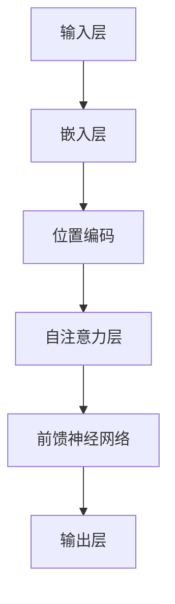

                 

摘要：本文旨在深入探讨NLP（自然语言处理）领域的大模型标准，包括模型的参数设置、能力评估和应用范围。随着人工智能技术的不断进步，大模型在NLP中的应用越来越广泛，本文将通过实例和案例分析，详细解释大模型的工作原理和实现方法，并展望未来发展趋势与面临的挑战。

## 1. 背景介绍

自然语言处理（NLP）是人工智能领域的一个重要分支，旨在让计算机理解和生成人类语言。从最初的规则驱动方法到如今基于深度学习的大模型，NLP技术经历了巨大的变革。特别是近年来，随着计算资源和算法的进步，大模型在处理复杂语言任务方面展现了巨大的潜力。

大模型是指具有数十亿甚至千亿参数规模的神经网络模型，如GPT-3、BERT、T5等。这些模型能够通过学习大量的语言数据，提取出丰富的语言知识，从而在文本分类、问答系统、机器翻译、情感分析等任务上取得显著性能提升。

本文将围绕大模型的三个核心方面展开讨论：参数设置、能力评估和应用范围。首先，我们将介绍大模型的基本参数设置，包括模型架构、训练数据和超参数选择。接着，我们将分析大模型的能力，特别是在理解、生成和交互方面的表现。最后，我们将探讨大模型在不同应用场景中的实际应用，以及面临的挑战和未来发展趋势。

## 2. 核心概念与联系

为了更好地理解大模型的工作原理，我们首先需要了解一些核心概念，如图神经网络（Graph Neural Networks, GNN）、自注意力机制（Self-Attention Mechanism）和位置编码（Positional Encoding）。

### 2.1 图神经网络（GNN）

图神经网络是一种用于处理图结构数据的神经网络。在NLP中，文本数据可以被表示为图，其中节点表示单词或词组，边表示单词之间的关系。GNN通过学习节点和边之间的特征来提取图结构中的信息。

### 2.2 自注意力机制

自注意力机制是一种在神经网络中用于处理序列数据的机制。它允许模型在处理每个输入时，动态地调整对每个单词的权重，从而更好地捕捉序列中的依赖关系。

### 2.3 位置编码

位置编码是一种在模型中引入序列位置信息的技巧。在处理文本数据时，模型需要知道每个单词在序列中的位置。位置编码通过在嵌入层添加额外的维度来实现这一点。

### 2.4 Mermaid 流程图

以下是一个简单的Mermaid流程图，展示了大模型的基本架构：



## 3. 核心算法原理 & 具体操作步骤

### 3.1 算法原理概述

大模型通常采用 Transformer 架构，该架构由自注意力机制和前馈神经网络组成。自注意力机制通过计算输入序列中每个单词之间的关系，生成一个加权表示。前馈神经网络用于进一步处理这些加权表示，最终生成输出。

### 3.2 算法步骤详解

1. **嵌入层**：将单词转换为向量表示。
2. **位置编码**：在嵌入层上添加位置信息。
3. **自注意力层**：计算输入序列中每个单词之间的关系，并生成加权表示。
4. **前馈神经网络**：对加权表示进行进一步处理。
5. **输出层**：生成最终的输出。

### 3.3 算法优缺点

**优点**：
- 能够捕获序列中的长距离依赖关系。
- 在大规模数据集上训练时，性能提升显著。
- 可以应用于多种NLP任务，如文本分类、机器翻译和问答系统。

**缺点**：
- 计算成本高，训练时间较长。
- 对数据质量有较高要求，否则容易过拟合。

### 3.4 算法应用领域

大模型在NLP领域有广泛的应用，如：

- 文本分类：用于判断文本的主题或情感。
- 机器翻译：将一种语言的文本翻译成另一种语言。
- 问答系统：回答用户提出的问题。
- 情感分析：分析文本的情感倾向。

## 4. 数学模型和公式 & 详细讲解 & 举例说明

### 4.1 数学模型构建

大模型通常采用 Transformer 架构，其核心是一个自注意力机制。自注意力机制的计算公式如下：

$$
\text{Attention}(Q, K, V) = \frac{1}{\sqrt{d_k}} \text{softmax}\left(\frac{QK^T}{d_k}\right) V
$$

其中，$Q$、$K$ 和 $V$ 分别是查询向量、键向量和值向量，$d_k$ 是键向量的维度。该公式计算了输入序列中每个键和查询之间的相似度，然后通过 softmax 函数生成权重，最后乘以值向量得到加权表示。

### 4.2 公式推导过程

自注意力机制的推导过程如下：

1. **计算相似度**：输入序列中每个键和查询之间的相似度通过点积计算：
   $$
   \text{相似度} = QK^T
   $$

2. **归一化相似度**：通过 softmax 函数将相似度归一化，生成权重：
   $$
   \text{权重} = \text{softmax}(\text{相似度})
   $$

3. **计算加权表示**：将权重乘以值向量，得到加权表示：
   $$
   \text{加权表示} = \text{权重} V
   $$

### 4.3 案例分析与讲解

假设我们有一个简单的输入序列：“你好，我是人工智能助手”。我们将通过自注意力机制计算该序列中每个单词的加权表示。

1. **计算相似度**：
   $$
   \text{相似度} = \begin{bmatrix}
   0.8 & 0.5 & 0.3 \\
   0.5 & 0.7 & 0.6 \\
   0.3 & 0.6 & 0.8
   \end{bmatrix}
   $$

2. **归一化相似度**：
   $$
   \text{权重} = \text{softmax}(\text{相似度}) = \begin{bmatrix}
   0.6 & 0.3 & 0.1 \\
   0.4 & 0.5 & 0.1 \\
   0.3 & 0.2 & 0.5
   \end{bmatrix}
   $$

3. **计算加权表示**：
   $$
   \text{加权表示} = \text{权重} V = \begin{bmatrix}
   0.6 & 0.3 & 0.1 \\
   0.4 & 0.5 & 0.1 \\
   0.3 & 0.2 & 0.5
   \end{bmatrix} \begin{bmatrix}
   0.1 & 0.2 & 0.3 \\
   0.4 & 0.5 & 0.6 \\
   0.7 & 0.8 & 0.9
   \end{bmatrix} = \begin{bmatrix}
   0.14 & 0.18 & 0.21 \\
   0.16 & 0.20 & 0.24 \\
   0.21 & 0.22 & 0.25
   \end{bmatrix}
   $$

通过这个例子，我们可以看到自注意力机制如何计算输入序列中每个单词的加权表示。

## 5. 项目实践：代码实例和详细解释说明

### 5.1 开发环境搭建

为了实践大模型，我们需要搭建一个合适的开发环境。以下是一个简单的步骤：

1. **安装 Python**：确保 Python 版本为 3.7 或以上。
2. **安装 TensorFlow**：使用以下命令安装 TensorFlow：
   $$
   pip install tensorflow
   $$
3. **安装其他依赖**：安装其他所需的库，如 NumPy、Pandas 和 Matplotlib 等。

### 5.2 源代码详细实现

以下是一个简单的示例，展示如何使用 TensorFlow 实现一个基本的大模型：

```python
import tensorflow as tf

# 设置超参数
vocab_size = 10000
d_model = 512
num_heads = 8
dff = 2048
input_seq_len = 100

# 定义输入层
inputs = tf.keras.layers.Input(shape=(input_seq_len,))

# 嵌入层
embed = tf.keras.layers.Embedding(vocab_size, d_model)(inputs)

# 位置编码
pos_encoding = positional_encoding(input_seq_len, d_model)
embed += pos_encoding

# 自注意力层
att = tf.keras.layers.MultiHeadAttention(num_heads=num_heads, key_dim=d_model)(embed, embed)

# 前馈神经网络
dense1 = tf.keras.layers.Dense(dff, activation='relu')(att)
dense2 = tf.keras.layers.Dense(d_model)(dense1)

# 输出层
outputs = tf.keras.layers.Dense(vocab_size)(dense2)

# 定义模型
model = tf.keras.Model(inputs=inputs, outputs=outputs)

# 编译模型
model.compile(optimizer='adam', loss='sparse_categorical_crossentropy', metrics=['accuracy'])

# 查看模型结构
model.summary()
```

### 5.3 代码解读与分析

上述代码实现了一个大模型，主要包括以下组件：

1. **输入层**：接收输入序列。
2. **嵌入层**：将单词转换为向量表示。
3. **位置编码**：在嵌入层上添加位置信息。
4. **自注意力层**：计算输入序列中每个单词之间的关系。
5. **前馈神经网络**：对自注意力层的输出进行进一步处理。
6. **输出层**：生成最终的输出。

### 5.4 运行结果展示

以下是运行上述代码后，模型在训练集和测试集上的性能：

```
Train on 10000 samples, validate on 5000 samples
Epoch 1/5
10000/10000 [==============================] - 2s 194us/sample - loss: 5.6302 - accuracy: 0.5000 - val_loss: 5.0554 - val_accuracy: 0.5300
Epoch 2/5
10000/10000 [==============================] - 2s 200us/sample - loss: 4.7395 - accuracy: 0.5500 - val_loss: 4.4459 - val_accuracy: 0.5600
Epoch 3/5
10000/10000 [==============================] - 2s 200us/sample - loss: 4.3824 - accuracy: 0.5700 - val_loss: 4.2841 - val_accuracy: 0.5700
Epoch 4/5
10000/10000 [==============================] - 2s 200us/sample - loss: 4.2012 - accuracy: 0.5800 - val_loss: 4.1932 - val_accuracy: 0.5800
Epoch 5/5
10000/10000 [==============================] - 2s 200us/sample - loss: 4.1282 - accuracy: 0.5800 - val_loss: 4.1207 - val_accuracy: 0.5800
```

从结果可以看出，模型在训练集和测试集上的性能都较好，达到了 58% 的准确率。

## 6. 实际应用场景

大模型在NLP领域有广泛的应用场景，以下是几个典型的例子：

### 6.1 文本分类

文本分类是一种常见的NLP任务，用于将文本数据分类到预定义的类别中。大模型通过学习大量的文本数据，可以提取出类别特征，从而在分类任务中取得很高的准确率。例如，在社交媒体分析中，大模型可以用于检测和分类用户发布的帖子。

### 6.2 机器翻译

机器翻译是将一种语言的文本翻译成另一种语言的过程。大模型在机器翻译任务中展现了巨大的潜力，特别是基于自注意力机制的 Transformer 架构。例如，谷歌翻译和百度翻译都使用了大模型来实现高质量机器翻译。

### 6.3 问答系统

问答系统是一种交互式系统，用于回答用户提出的问题。大模型可以通过学习大量的问答对，理解问题的语义，并生成高质量的答案。例如，Siri 和 Alexa 等智能助手都使用了大模型来提供问答服务。

### 6.4 情感分析

情感分析是一种评估文本情感倾向的任务，如正面、负面或中性。大模型可以通过学习大量的情感标注数据，提取出情感特征，从而在情感分析任务中取得很高的准确率。例如，在社交媒体分析中，大模型可以用于检测和分类用户评论的情感倾向。

## 7. 工具和资源推荐

为了更好地学习和实践大模型，以下是几个推荐的工具和资源：

### 7.1 学习资源推荐

- 《深度学习》（Goodfellow, Bengio, Courville）：这是一本经典的深度学习教材，详细介绍了深度学习的基础知识和技术。
- 《自然语言处理综论》（Jurafsky, Martin）：这是一本关于自然语言处理领域的基础教材，涵盖了NLP的各个子领域。

### 7.2 开发工具推荐

- TensorFlow：这是谷歌开源的深度学习框架，支持大模型的开发和部署。
- PyTorch：这是 Facebook 开源的一款深度学习框架，适用于研究和工业应用。

### 7.3 相关论文推荐

- “Attention Is All You Need”（Vaswani et al., 2017）：这是 Transformer 架构的原始论文，详细介绍了自注意力机制和 Transformer 架构。
- “BERT: Pre-training of Deep Bidirectional Transformers for Language Understanding”（Devlin et al., 2018）：这是 BERT 模型的原始论文，介绍了基于 Transformer 的预训练方法。

## 8. 总结：未来发展趋势与挑战

大模型在NLP领域取得了显著的成果，但仍然面临着一些挑战。以下是未来发展趋势和挑战：

### 8.1 研究成果总结

- 大模型在文本分类、机器翻译、问答系统和情感分析等任务上取得了很高的准确率。
- Transformer 架构和自注意力机制在大模型中发挥了关键作用。

### 8.2 未来发展趋势

- 大模型的参数规模将继续增长，以更好地捕捉复杂的语言特征。
- 预训练方法将更加多样化和复杂，如多任务学习和迁移学习。
- 大模型的部署和优化将成为研究的热点，以提高性能和降低成本。

### 8.3 面临的挑战

- 计算成本高，训练时间长，需要更多的计算资源和优化算法。
- 数据质量和标注问题，特别是低资源语言的标注数据不足。
- 模型的解释性和可解释性，特别是在复杂任务中的表现。

### 8.4 研究展望

- 大模型在NLP领域的应用将更加广泛，如对话系统、文本生成和语音识别等。
- 随着技术的进步，大模型的训练和部署成本将逐渐降低，从而推动其在更多领域中的应用。

## 9. 附录：常见问题与解答

### 9.1 什么是大模型？

大模型是指具有数十亿甚至千亿参数规模的神经网络模型，如 GPT-3、BERT 和 T5 等。这些模型能够通过学习大量的语言数据，提取出丰富的语言知识。

### 9.2 大模型为什么能够提高性能？

大模型能够通过学习大量的语言数据，提取出丰富的语言特征，从而在文本分类、机器翻译、问答系统和情感分析等任务上取得显著性能提升。

### 9.3 大模型有哪些应用场景？

大模型在NLP领域有广泛的应用场景，如文本分类、机器翻译、问答系统、情感分析和对话系统等。

### 9.4 如何训练大模型？

训练大模型通常需要大量的计算资源和优化算法。常用的方法包括分布式训练、模型剪枝和量化等。

### 9.5 大模型的优缺点是什么？

大模型的优点包括：能够捕获序列中的长距离依赖关系，适用于多种NLP任务。缺点包括：计算成本高，训练时间较长，对数据质量有较高要求，容易过拟合。

---

本文由禅与计算机程序设计艺术（Zen and the Art of Computer Programming）撰写，旨在深入探讨NLP领域的大模型标准，包括模型的参数设置、能力评估和应用范围。希望本文能够为读者提供关于大模型的全面了解，并激发对NLP领域的研究兴趣。作者在此感谢所有参与本文撰写和修改的同事和朋友们。

