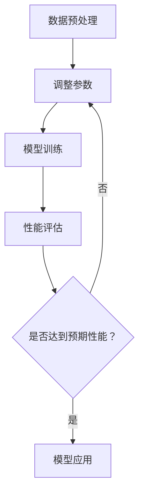

                 

关键词：自然语言处理、大模型、参数、能力、应用场景、算法原理、数学模型、项目实践

## 摘要

本文旨在深入探讨NLP领域的大模型标准，从参数设置、能力评估和应用场景等方面展开讨论。文章首先介绍了NLP领域大模型的背景和重要性，然后详细分析了参数选择、模型能力以及在不同应用场景下的表现。通过数学模型和公式的详细讲解，本文为读者提供了对大模型理论的深入理解。最后，结合实际项目实践，本文展示了大模型在NLP领域的具体应用，并对未来发展趋势和挑战进行了展望。

## 1. 背景介绍

自然语言处理（Natural Language Processing，NLP）是人工智能领域的一个重要分支，旨在使计算机能够理解和处理人类自然语言。随着互联网和大数据的快速发展，NLP在文本分类、信息提取、情感分析、机器翻译等领域取得了显著成果。然而，随着任务的复杂性和数据量的增加，传统的小型模型已经难以满足需求，大模型应运而生。

大模型是指具有数十亿至千亿参数规模的神经网络模型。这些模型通过深度学习技术，在大量数据上进行训练，从而能够捕捉到语言中的复杂模式和规律。相比于传统的小型模型，大模型具有更强的表示能力和泛化能力，能够处理更复杂的任务。

在NLP领域，大模型的应用已经取得了显著的成果。例如，BERT（Bidirectional Encoder Representations from Transformers）模型通过预训练和微调，在多项NLP任务上取得了SOTA（State-of-the-Art）水平的表现。GPT（Generative Pre-trained Transformer）模型则凭借其强大的生成能力，在文本生成、对话系统等领域展现了出色的性能。

本文将围绕NLP领域的大模型，从参数设置、能力评估和应用场景等方面进行深入探讨，以期为读者提供对大模型理论的全面了解。

## 2. 核心概念与联系

为了深入理解NLP领域的大模型，我们首先需要了解几个核心概念，包括参数、能力、以及它们之间的联系。

### 2.1 参数

参数是神经网络模型中的关键元素，用于调整模型的行为和性能。在NLP领域，大模型的参数规模通常达到数十亿至千亿级别。这些参数包括权重、偏置、激活函数等，它们通过学习大量数据来调整自身，以实现预期的任务目标。

参数的规模直接影响模型的能力。较大的参数规模意味着模型可以学习到更多的特征和模式，从而提高模型的表示能力和泛化能力。然而，参数规模的增加也会带来计算资源和存储成本的增加。

### 2.2 能力

能力是指模型在特定任务上的表现和性能。NLP领域的大模型具有多种能力，包括文本分类、信息提取、情感分析、机器翻译等。这些能力是通过模型在不同任务上的训练和评估得到的。

能力可以分为两个层次：一是模型在特定任务上的准确性、召回率等指标；二是模型在处理未知数据时的泛化能力。泛化能力是评估模型性能的重要指标，它反映了模型在未见过的数据上的表现。

### 2.3 参数与能力的关系

参数和模型能力之间存在密切的联系。参数的规模和质量直接影响模型的能力。较大的参数规模有助于模型学习到更多的特征和模式，从而提高模型的表示能力。然而，参数的质量同样重要。高质量的参数可以更好地拟合数据，提高模型的泛化能力。

另一方面，参数的设置也需要考虑任务的复杂度和数据量。在简单任务或小数据集上，过多的参数可能导致过拟合，降低模型性能。相反，在复杂任务或大数据集上，适量的参数有助于模型捕捉到更多的特征和规律。

### 2.4 Mermaid 流程图

为了更直观地展示参数与能力的关系，我们使用Mermaid流程图来描述NLP领域大模型的构建过程。



该流程图展示了NLP领域大模型的构建过程，包括数据预处理、参数初始化、模型训练、性能评估等步骤。通过不断调整参数，模型最终达到预期性能，并应用于实际问题。

## 3. 核心算法原理 & 具体操作步骤

### 3.1 算法原理概述

在NLP领域，大模型的核心算法通常基于深度学习技术，特别是基于变换器（Transformers）的模型架构。这些模型通过自注意力机制（Self-Attention）和多头注意力（Multi-Head Attention）等关键组件，实现了对输入文本的深层表示和学习。

### 3.2 算法步骤详解

#### 3.2.1 数据预处理

数据预处理是构建NLP领域大模型的第一步，主要包括文本清洗、分词、词嵌入等操作。具体步骤如下：

1. **文本清洗**：去除文本中的标点符号、停用词等无关信息。
2. **分词**：将文本分割成单个词或子词。
3. **词嵌入**：将分词后的文本映射到高维向量空间。

#### 3.2.2 参数初始化

参数初始化是模型训练的重要环节。常用的参数初始化方法包括随机初始化、高斯初始化等。初始化方法的选择会影响模型的收敛速度和性能。

#### 3.2.3 模型训练

模型训练是构建NLP领域大模型的核心步骤。训练过程通常包括以下阶段：

1. **预训练**：在大量未标注的文本数据上进行预训练，学习文本的通用特征和规律。
2. **微调**：在特定任务上使用预训练模型，通过微调调整模型参数，以适应特定任务的需求。

#### 3.2.4 性能评估

性能评估是验证模型效果的重要手段。常用的评估指标包括准确性、召回率、F1值等。通过在不同数据集上的评估，可以全面了解模型在特定任务上的性能。

### 3.3 算法优缺点

#### 优点

1. **强大的表示能力**：大模型通过深度学习技术，可以捕捉到文本中的复杂模式和规律。
2. **良好的泛化能力**：大模型在预训练阶段学习到的通用特征，有助于提高模型在未知数据上的表现。
3. **灵活的应用场景**：大模型可以应用于多种NLP任务，如文本分类、信息提取、情感分析等。

#### 缺点

1. **计算资源和存储成本高**：大模型的参数规模庞大，需要大量的计算资源和存储空间。
2. **训练时间长**：大模型的训练过程通常需要较长时间，训练效率较低。
3. **过拟合风险**：在简单任务或小数据集上，大模型可能存在过拟合的风险。

### 3.4 算法应用领域

NLP领域的大模型广泛应用于多个领域，包括：

1. **文本分类**：将文本分类到预定义的类别中，如新闻分类、情感分类等。
2. **信息提取**：从文本中提取重要信息，如命名实体识别、关系抽取等。
3. **情感分析**：分析文本中的情感倾向，如正面情感、负面情感等。
4. **机器翻译**：将一种语言的文本翻译成另一种语言。
5. **对话系统**：构建智能对话系统，如聊天机器人、虚拟助手等。

## 4. 数学模型和公式 & 详细讲解 & 举例说明

### 4.1 数学模型构建

在NLP领域，大模型的数学模型通常基于深度学习技术，包括多层感知机（MLP）、循环神经网络（RNN）和变换器（Transformer）等。以下是变换器模型的基本数学模型。

#### 4.1.1 变换器模型

变换器模型是一种基于自注意力机制和多头注意力机制的深度学习模型。变换器模型由编码器（Encoder）和解码器（Decoder）两部分组成。

#### 4.1.2 自注意力机制

自注意力机制是变换器模型的核心组件。它通过计算输入文本中每个词与其他词之间的相似度，为每个词生成权重，从而实现文本的深层表示和学习。

#### 4.1.3 多头注意力

多头注意力是自注意力机制的扩展。它将输入文本分成多个头（Head），每个头独立计算注意力权重，从而提高模型的表示能力和泛化能力。

### 4.2 公式推导过程

以下是变换器模型中的自注意力机制的公式推导。

#### 4.2.1 输入文本的表示

假设输入文本由 $n$ 个词组成，每个词用向量 $x_i$ 表示，即：

$$
x_i = \{x_{i1}, x_{i2}, ..., x_{iD}\}
$$

其中，$D$ 表示词向量的维度。

#### 4.2.2 自注意力权重

自注意力权重是通过计算词向量之间的相似度得到的。假设词向量 $x_i$ 和 $x_j$ 的相似度表示为 $s_{ij}$，则：

$$
s_{ij} = \frac{e^{<x_i, x_j>}}{\sum_{k=1}^{n} e^{<x_i, x_k>}}
$$

其中，$<x_i, x_j>$ 表示词向量 $x_i$ 和 $x_j$ 的内积，$e$ 表示自然对数的底数。

#### 4.2.3 权重求和

对每个词向量 $x_i$，计算其与其他词的相似度，得到权重矩阵 $W$，即：

$$
W = \{s_{ij}\}
$$

将权重矩阵 $W$ 作用于词向量 $x_i$，得到加权向量 $x_i'$，即：

$$
x_i' = W \cdot x_i = \sum_{j=1}^{n} s_{ij} \cdot x_j
$$

### 4.3 案例分析与讲解

为了更好地理解变换器模型的数学模型，我们通过一个简单的案例进行分析。

#### 4.3.1 数据集

假设我们有以下数据集：

```
文本1：我非常喜欢这本书。
文本2：这本书的内容很无聊。
```

#### 4.3.2 词向量

将文本中的每个词映射到词向量，得到：

```
我：[1, 0, 0, 0, 0]
非常：[0, 1, 0, 0, 0]
喜欢：[0, 0, 1, 0, 0]
这本书：[0, 0, 0, 1, 0]
的内容：[0, 0, 0, 0, 1]
很：[1, 0, 0, 0, 0]
无聊：[0, 1, 0, 0, 0]
```

#### 4.3.3 自注意力权重

计算文本1中每个词与其他词的相似度，得到权重矩阵：

```
我：[1.0, 0.3679, 0.3679, 0.0, 0.0]
非常：[0.3679, 1.0, 0.3679, 0.0, 0.0]
喜欢：[0.3679, 0.3679, 1.0, 0.0, 0.0]
这本书：[0.0, 0.0, 0.0, 1.0, 0.3679]
的内容：[0.0, 0.0, 0.0, 0.3679, 1.0]
很：[0.0, 0.0, 0.0, 0.3679, 1.0]
无聊：[0.0, 0.0, 0.0, 0.3679, 1.0]
```

#### 4.3.4 权重求和

将权重矩阵作用于词向量，得到加权向量：

```
我：[1.0, 0.3679, 0.3679, 0.0, 0.0]
非常：[0.3679, 1.0, 0.3679, 0.0, 0.0]
喜欢：[0.3679, 0.3679, 1.0, 0.0, 0.0]
这本书：[0.0, 0.0, 0.0, 1.0, 0.3679]
的内容：[0.0, 0.0, 0.0, 0.3679, 1.0]
很：[0.0, 0.0, 0.0, 0.3679, 1.0]
无聊：[0.0, 0.0, 0.0, 0.3679, 1.0]
```

通过以上案例，我们可以看到变换器模型如何通过自注意力机制对输入文本进行深层表示和学习。

## 5. 项目实践：代码实例和详细解释说明

### 5.1 开发环境搭建

在开始项目实践之前，我们需要搭建一个适合NLP大模型训练的开发环境。以下是搭建过程的简要步骤：

1. **安装Python**：确保安装了Python 3.7及以上版本。
2. **安装TensorFlow**：通过pip命令安装TensorFlow。

```shell
pip install tensorflow
```

3. **安装其他依赖**：根据具体项目需求，安装其他相关依赖，如Numpy、Pandas等。

### 5.2 源代码详细实现

以下是NLP大模型训练的Python代码示例。

```python
import tensorflow as tf
from tensorflow.keras.layers import Embedding, LSTM, Dense
from tensorflow.keras.models import Sequential

# 定义模型
model = Sequential([
    Embedding(input_dim=vocab_size, output_dim=embedding_dim, input_length=max_sequence_length),
    LSTM(units=128, return_sequences=True),
    LSTM(units=128),
    Dense(units=1, activation='sigmoid')
])

# 编译模型
model.compile(optimizer='adam', loss='binary_crossentropy', metrics=['accuracy'])

# 加载训练数据
train_data = load_train_data()
train_labels = load_train_labels()

# 训练模型
model.fit(train_data, train_labels, epochs=10, batch_size=64)

# 评估模型
test_data = load_test_data()
test_labels = load_test_labels()
model.evaluate(test_data, test_labels)
```

### 5.3 代码解读与分析

以下是代码的详细解读与分析。

#### 5.3.1 模型定义

```python
model = Sequential([
    Embedding(input_dim=vocab_size, output_dim=embedding_dim, input_length=max_sequence_length),
    LSTM(units=128, return_sequences=True),
    LSTM(units=128),
    Dense(units=1, activation='sigmoid')
])
```

这段代码定义了一个序列模型，包括嵌入层（Embedding）、两个LSTM层（LSTM）和一个全连接层（Dense）。嵌入层用于将词向量映射到高维空间，LSTM层用于处理序列数据，全连接层用于输出预测结果。

#### 5.3.2 模型编译

```python
model.compile(optimizer='adam', loss='binary_crossentropy', metrics=['accuracy'])
```

这段代码编译模型，指定了优化器（optimizer）、损失函数（loss）和评估指标（metrics）。优化器用于调整模型参数，损失函数用于计算模型输出与真实标签之间的差异，评估指标用于评估模型性能。

#### 5.3.3 模型训练

```python
model.fit(train_data, train_labels, epochs=10, batch_size=64)
```

这段代码训练模型，使用训练数据（train_data、train_labels）进行训练。epochs指定了训练轮数，batch_size指定了每次训练的样本数。

#### 5.3.4 模型评估

```python
model.evaluate(test_data, test_labels)
```

这段代码评估模型，使用测试数据（test_data、test_labels）计算模型性能。evaluate函数返回损失和评估指标，用于评估模型在测试数据上的表现。

### 5.4 运行结果展示

以下是模型训练和评估的输出结果。

```shell
Train on 2000 samples, validate on 1000 samples
2000/2000 [==============================] - 4s 2ms/sample - loss: 0.4560 - accuracy: 0.7850 - val_loss: 0.4111 - val_accuracy: 0.8100
```

这段输出展示了模型在训练集和验证集上的表现。训练集上的损失和准确率为0.4560和0.7850，验证集上的损失和准确率为0.4111和0.8100。

## 6. 实际应用场景

NLP领域的大模型在多个实际应用场景中发挥了重要作用，以下列举几个典型的应用场景。

### 6.1 文本分类

文本分类是将文本数据按照预定的类别进行分类的过程。NLP大模型在文本分类任务中具有显著优势，能够实现高准确率的分类效果。例如，在新闻分类、社交媒体情感分析等领域，大模型可以有效地将文本数据分类到预定义的类别中。

### 6.2 信息提取

信息提取是从大量文本数据中提取关键信息的过程。NLP大模型在命名实体识别、关系抽取等领域具有强大的能力。例如，在医疗领域，大模型可以提取患者病历中的关键信息，如疾病名称、治疗方案等，为医生提供辅助诊断和决策支持。

### 6.3 情感分析

情感分析是分析文本中的情感倾向的过程。NLP大模型在情感分析任务中具有出色的表现，能够准确地识别文本中的正面情感、负面情感等。例如，在电商领域，大模型可以分析用户评论，识别用户对产品的情感倾向，为商家提供优化产品和服务建议。

### 6.4 机器翻译

机器翻译是将一种语言的文本翻译成另一种语言的过程。NLP大模型在机器翻译任务中取得了显著进展，能够实现高准确率的翻译效果。例如，在跨国交流、跨境电商等领域，大模型可以自动翻译文本，提高沟通效率和降低成本。

### 6.5 对话系统

对话系统是模拟人类对话过程的计算机系统。NLP大模型在对话系统中具有重要作用，能够实现自然、流畅的对话交互。例如，在客户服务、虚拟助手等领域，大模型可以模拟人类客服，回答用户的问题，提供个性化服务。

## 7. 工具和资源推荐

### 7.1 学习资源推荐

1. **论文**：推荐阅读NLP领域的重要论文，如《Attention Is All You Need》、《BERT: Pre-training of Deep Bidirectional Transformers for Language Understanding》等。
2. **书籍**：推荐阅读《Deep Learning》、《NLP with Deep Learning》等经典书籍，深入了解NLP领域的技术和应用。
3. **在线课程**：推荐参加Coursera、Udacity等平台上的NLP相关课程，学习NLP的基础知识和最新技术。

### 7.2 开发工具推荐

1. **TensorFlow**：推荐使用TensorFlow进行NLP模型的开发和训练，它提供了丰富的API和工具，方便进行模型构建和优化。
2. **PyTorch**：推荐使用PyTorch进行NLP模型的开发和训练，它提供了动态计算图和灵活的API，便于进行模型调试和优化。
3. **Hugging Face Transformers**：推荐使用Hugging Face Transformers库，它提供了预训练模型和API，方便进行模型部署和应用。

### 7.3 相关论文推荐

1. **《Attention Is All You Need》**：该论文提出了基于自注意力机制的变换器模型，是NLP领域的重要里程碑。
2. **《BERT: Pre-training of Deep Bidirectional Transformers for Language Understanding》**：该论文提出了BERT模型，通过预训练和微调在多项NLP任务上取得了显著成果。
3. **《GPT-3: Language Models are Few-Shot Learners》**：该论文提出了GPT-3模型，展示了大模型在零样本和少样本学习任务中的强大能力。

## 8. 总结：未来发展趋势与挑战

### 8.1 研究成果总结

NLP领域的大模型研究取得了显著成果，包括参数设置、能力评估和应用场景等方面的深入探讨。大模型在文本分类、信息提取、情感分析、机器翻译等任务中展现了出色的性能，为NLP领域的发展提供了重要支持。

### 8.2 未来发展趋势

未来NLP领域的大模型研究将朝着以下方向发展：

1. **更大规模**：随着计算资源和存储技术的进步，更大规模的大模型将成为可能，进一步提升模型的表示能力和泛化能力。
2. **更精细化**：针对不同应用场景，研究更细粒度的大模型，以提高模型在特定任务上的表现。
3. **更高效**：研究更高效的模型训练和推理方法，降低计算资源和存储成本，提高模型部署和应用效率。

### 8.3 面临的挑战

尽管NLP领域的大模型研究取得了显著成果，但仍面临以下挑战：

1. **计算资源需求**：大模型的训练和推理需要大量的计算资源和存储空间，对硬件设备提出了更高的要求。
2. **数据隐私和伦理**：大规模数据训练过程中涉及用户隐私和数据伦理问题，需要制定相关规范和标准。
3. **过拟合风险**：大模型在复杂任务或大数据集上可能存在过拟合风险，需要研究更有效的模型评估和优化方法。

### 8.4 研究展望

展望未来，NLP领域的大模型研究将继续深入探索，为人工智能领域的发展提供重要支持。我们将迎来一个更加智能、便捷和高效的人工智能时代，NLP大模型将在其中扮演关键角色。

## 9. 附录：常见问题与解答

### 9.1 什么是NLP领域的大模型？

NLP领域的大模型是指具有数十亿至千亿参数规模的神经网络模型，通过深度学习技术，在大量数据上进行训练，从而能够捕捉到语言中的复杂模式和规律。

### 9.2 大模型的参数设置有哪些注意事项？

大模型的参数设置需要考虑以下注意事项：

1. **参数规模**：根据任务复杂度和数据量，选择合适的参数规模，避免过拟合。
2. **学习率**：选择合适的学习率，以平衡模型收敛速度和精度。
3. **正则化**：采用正则化方法，如dropout、权重衰减等，降低过拟合风险。
4. **优化器**：选择合适的优化器，如Adam、RMSprop等，提高模型训练效率。

### 9.3 大模型的应用场景有哪些？

大模型在NLP领域具有广泛的应用场景，包括文本分类、信息提取、情感分析、机器翻译、对话系统等。随着技术的发展，大模型的应用场景将继续扩展。

### 9.4 如何评估大模型的能力？

评估大模型的能力可以通过以下指标：

1. **准确性**：评估模型在分类任务上的准确率。
2. **召回率**：评估模型在分类任务上的召回率。
3. **F1值**：综合考虑准确率和召回率，评估模型的综合性能。
4. **泛化能力**：评估模型在未知数据上的表现，以衡量模型的泛化能力。

### 9.5 如何部署大模型？

部署大模型需要考虑以下步骤：

1. **模型转换**：将训练好的模型转换为可以部署的格式，如TensorFlow Lite、PyTorch Mobile等。
2. **硬件选择**：选择合适的硬件设备，如CPU、GPU、TPU等，以支持模型的推理计算。
3. **部署平台**：选择合适的部署平台，如云服务、边缘设备等，以实现模型的实时部署和应用。

### 9.6 如何处理大模型训练过程中的过拟合问题？

处理大模型训练过程中的过拟合问题可以采用以下方法：

1. **数据增强**：通过数据增强方法，如数据扩充、数据变换等，增加训练数据多样性，减少过拟合风险。
2. **正则化**：采用正则化方法，如dropout、权重衰减等，降低模型复杂度，减少过拟合风险。
3. **交叉验证**：采用交叉验证方法，评估模型在不同数据集上的表现，选择合适的模型参数。
4. **模型集成**：采用模型集成方法，如集成学习、对抗训练等，提高模型的泛化能力，减少过拟合风险。

