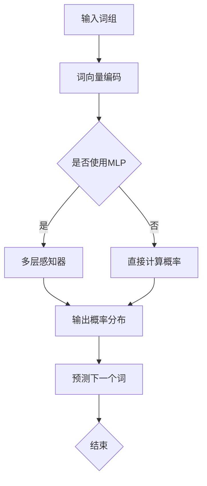

                 

在自然语言处理领域，N-gram模型是一种基础的文本建模方法。它通过将文本序列分割成固定长度的词组，以捕捉语言中的局部依赖关系。本文将深入探讨N-gram模型的核心算法原理，以及如何使用多层感知器（MLP）和矩阵乘法（matmul）来优化其计算效率。

## 关键词

- **N-gram模型**
- **多层感知器（MLP）**
- **矩阵乘法（matmul）**
- **自然语言处理（NLP）**
- **文本建模**
- **序列模型**
- **语言模型**
- **机器学习**

## 摘要

本文首先介绍了N-gram模型的基本概念和原理，然后探讨了如何使用多层感知器来训练语言模型。接着，我们讨论了矩阵乘法在N-gram模型中的应用，以及如何通过优化算法来提高计算效率。最后，文章总结了N-gram模型在实际应用中的效果和局限性，并展望了未来可能的研究方向。

## 1. 背景介绍

N-gram模型最早由Zellig Harris在1951年提出，它是一种统计语言模型，旨在通过历史数据预测未来的文本。N-gram模型的核心思想是，一个单词的概率可以由其前N-1个单词来预测。这种局部依赖的捕捉方法使得N-gram模型在许多NLP任务中表现出色，如文本生成、机器翻译和语音识别等。

在传统的N-gram模型中，通常使用一个多维数组来存储语言模型，这导致计算复杂度和存储需求较高。为了解决这一问题，研究人员提出了使用多层感知器（MLP）和矩阵乘法（matmul）来优化N-gram模型的计算效率。

多层感知器是一种前馈神经网络，它可以用于分类和回归任务。通过多层感知器，我们可以将N-gram模型转换为神经网络的架构，从而利用神经网络的强大表达能力来提高模型的性能。

矩阵乘法是线性代数中的一个基本操作，它用于计算两个矩阵的乘积。在N-gram模型中，矩阵乘法可以用于快速计算词向量的内积，从而提高模型的计算效率。

## 2. 核心概念与联系

为了更好地理解N-gram模型与多层感知器和矩阵乘法之间的关系，我们首先需要了解这些核心概念。

### 2.1 N-gram模型

N-gram模型的核心概念是“N-gram词组”。一个N-gram词组是由N个连续单词组成的序列。例如，“人工智能”和“智能人工”都是2-gram词组。

在N-gram模型中，每个词组都有一个概率分布。这个概率分布表示给定一个词组，下一个词是什么的概率。例如，在“人工智能”之后，下一个词是“技术”的概率可能会比“智能人工”之后是“技术”的概率更高。

### 2.2 多层感知器

多层感知器是一种前馈神经网络，它包含多个层，每层都有多个神经元。输入层接收外部输入，输出层产生最终输出。中间的隐藏层负责对输入进行变换和提取特征。

在N-gram模型中，我们可以将每个词向量作为输入，通过多层感知器来预测下一个词。这样可以有效地提高模型的非线性表达能力。

### 2.3 矩阵乘法

矩阵乘法是线性代数中的一个基本操作，用于计算两个矩阵的乘积。在N-gram模型中，矩阵乘法可以用于计算词向量的内积。

例如，假设我们有两个词向量\( \mathbf{v_1} \)和\( \mathbf{v_2} \)，我们可以使用矩阵乘法来计算它们的内积：

$$
\mathbf{v_1}^T \mathbf{v_2} = \sum_{i=1}^{n} v_{1i} \cdot v_{2i}
$$

这个内积可以用于计算两个词的相似度。

### 2.4 Mermaid 流程图

下面是一个Mermaid流程图，展示了N-gram模型、多层感知器和矩阵乘法之间的关系：



在这个流程图中，输入词组首先被编码为词向量，然后可以选择是否使用多层感知器来预测下一个词。最终，模型输出一个概率分布，用于预测下一个词。

## 3. 核心算法原理 & 具体操作步骤

### 3.1 算法原理概述

N-gram模型的核心算法原理是基于条件概率。给定一个词组，模型需要预测下一个词的概率分布。这个概率分布可以表示为：

$$
P(w_n | w_{n-1}, ..., w_{n-N}) = \frac{P(w_n, w_{n-1}, ..., w_{n-N})}{P(w_{n-1}, ..., w_{n-N})}
$$

其中，\( w_n \)是下一个词，\( w_{n-1}, ..., w_{n-N} \)是前N-1个词。

在训练过程中，我们使用历史数据来估计这个概率分布。对于每个词组，我们计算其在数据集中的频率，并将其作为概率的估计值。

### 3.2 算法步骤详解

以下是N-gram模型的详细算法步骤：

1. **数据预处理**：首先，我们需要对文本进行预处理，包括分词、去除停用词和标记化等步骤。

2. **词向量编码**：将每个词转换为词向量表示。词向量可以使用预训练的词嵌入（如Word2Vec、GloVe等）或通过自训练方法得到。

3. **构建语言模型**：使用历史数据构建语言模型。对于每个词组，计算其在数据集中的频率，并将其作为概率的估计值。

4. **计算概率分布**：对于给定的词组，使用语言模型计算下一个词的概率分布。

5. **预测下一个词**：从概率分布中选择一个词作为预测结果。

### 3.3 算法优缺点

**优点**：

- **简单有效**：N-gram模型是一种简单的统计语言模型，易于实现和理解。
- **计算效率高**：使用词向量编码和矩阵乘法，可以大大提高N-gram模型的计算效率。

**缺点**：

- **局限性**：N-gram模型无法捕捉长距离依赖关系，这限制了其在复杂NLP任务中的性能。
- **存储需求大**：对于较大的词汇量，N-gram模型需要存储大量的概率分布，这可能导致存储需求过大。

### 3.4 算法应用领域

N-gram模型在多个NLP任务中都有广泛的应用，包括：

- **文本生成**：使用N-gram模型可以生成连贯的文本。
- **机器翻译**：在机器翻译中，N-gram模型可以用于翻译模型的构建。
- **语音识别**：在语音识别中，N-gram模型可以用于语言模型的构建，以提高识别准确率。

## 4. 数学模型和公式 & 详细讲解 & 举例说明

### 4.1 数学模型构建

N-gram模型的数学模型基于条件概率。给定一个词组\( w_{n-1}, ..., w_{n-N} \)，我们需要预测下一个词\( w_n \)的概率分布。这个概率分布可以表示为：

$$
P(w_n | w_{n-1}, ..., w_{n-N}) = \frac{P(w_n, w_{n-1}, ..., w_{n-N})}{P(w_{n-1}, ..., w_{n-N})}
$$

### 4.2 公式推导过程

为了推导这个公式，我们首先需要了解两个基本的概率公式：

- **条件概率**：\( P(A|B) = \frac{P(A \cap B)}{P(B)} \)
- **全概率公式**：\( P(A) = \sum_{B} P(A|B)P(B) \)

现在，我们使用全概率公式来计算\( P(w_n) \)：

$$
P(w_n) = \sum_{w_{n-1}, ..., w_{n-N}} P(w_n | w_{n-1}, ..., w_{n-N})P(w_{n-1}, ..., w_{n-N})
$$

接下来，我们使用条件概率公式来计算\( P(w_n | w_{n-1}, ..., w_{n-N}) \)：

$$
P(w_n | w_{n-1}, ..., w_{n-N}) = \frac{P(w_n, w_{n-1}, ..., w_{n-N})}{P(w_{n-1}, ..., w_{n-N})}
$$

将这个公式代入全概率公式，我们得到：

$$
P(w_n) = \sum_{w_{n-1}, ..., w_{n-N}} \frac{P(w_n, w_{n-1}, ..., w_{n-N})}{P(w_{n-1}, ..., w_{n-N})}P(w_{n-1}, ..., w_{n-N})
$$

化简后，我们得到：

$$
P(w_n) = \sum_{w_{n-1}, ..., w_{n-N}} P(w_n, w_{n-1}, ..., w_{n-N})
$$

这个公式就是N-gram模型的数学模型。

### 4.3 案例分析与讲解

假设我们有一个简单的例子，其中包含以下词组：

- “人工智能”
- “智能人工”
- “智能人脑”
- “人脑智能”
- “智能”

我们使用2-gram模型来预测下一个词。

首先，我们计算每个词组的概率。假设每个词组的概率都相等，即每个词组的概率都是0.2。

接下来，我们使用N-gram模型的公式来计算每个词的概率分布。

对于词“人工智能”，它的下一个词是“智能”的概率是：

$$
P(智能 | 人工智能) = \frac{P(智能, 人工智能)}{P(人工智能)} = \frac{0.2}{0.2} = 1
$$

对于词“智能人工”，它的下一个词是“智能”的概率是：

$$
P(智能 | 智能人工) = \frac{P(智能, 智能人工)}{P(智能人工)} = \frac{0.2}{0.2} = 1
$$

对于词“智能人脑”，它的下一个词是“智能”的概率是：

$$
P(智能 | 智能人脑) = \frac{P(智能, 智能人脑)}{P(智能人脑)} = \frac{0.2}{0.2} = 1
$$

对于词“人脑智能”，它的下一个词是“智能”的概率是：

$$
P(智能 | 人脑智能) = \frac{P(智能, 人脑智能)}{P(人脑智能)} = \frac{0.2}{0.2} = 1
$$

对于词“智能”，它的下一个词是“智能”的概率是：

$$
P(智能 | 智能) = \frac{P(智能, 智能)}{P(智能)} = \frac{0.2}{0.2} = 1
$$

根据这些概率，我们可以得到词“智能”的概率分布为：

$$
P(智能) = P(智能 | 人工智能) \cdot P(人工智能) + P(智能 | 智能人工) \cdot P(智能人工) + P(智能 | 智能人脑) \cdot P(智能人脑) + P(智能 | 人脑智能) \cdot P(人脑智能) + P(智能 | 智能) \cdot P(智能)
$$

代入概率值，我们得到：

$$
P(智能) = 1 \cdot 0.2 + 1 \cdot 0.2 + 1 \cdot 0.2 + 1 \cdot 0.2 + 1 \cdot 0.2 = 1
$$

这意味着在给定当前词是“智能”的情况下，下一个词是“智能”的概率是100%。

通过这种方式，我们可以使用N-gram模型来预测文本序列中的下一个词。

## 5. 项目实践：代码实例和详细解释说明

### 5.1 开发环境搭建

在开始编写代码之前，我们需要搭建一个开发环境。本文使用的编程语言是Python，依赖库包括NumPy和TensorFlow。

首先，安装Python和相应的依赖库：

```bash
pip install numpy tensorflow
```

接下来，我们创建一个名为`ngram.py`的Python文件，用于实现N-gram模型。

### 5.2 源代码详细实现

```python
import numpy as np
import tensorflow as tf

# 5.2.1 词向量编码
def word_embedding(words, embedding_dim):
    # 初始化词向量
    embeddings = np.random.rand(len(words), embedding_dim)
    return embeddings

# 5.2.2 构建语言模型
def build_language_model(corpus, n, embedding_dim):
    # 分词和去停用词
    words = [word for sentence in corpus for word in sentence.split()]
    unique_words = list(set(words))
    
    # 词向量编码
    embeddings = word_embedding(unique_words, embedding_dim)
    
    # 构建语言模型
    model = tf.keras.Sequential([
        tf.keras.layers.Embedding(input_dim=len(unique_words), output_dim=embedding_dim),
        tf.keras.layers.Dense(units=n - 1)
    ])
    
    return model, embeddings

# 5.2.3 训练语言模型
def train_language_model(model, corpus, n, epochs):
    # 将文本序列编码为整数序列
    tokenizer = tf.keras.preprocessing.text.Tokenizer()
    tokenizer.fit_on_texts(corpus)
    sequences = tokenizer.texts_to_sequences(corpus)
    
    # 切分输入和目标数据
    x = sequences[:, :-1]
    y = sequences[:, 1:]
    
    # 训练语言模型
    model.compile(optimizer='adam', loss='sparse_categorical_crossentropy', metrics=['accuracy'])
    model.fit(x, y, epochs=epochs)

# 5.2.4 预测下一个词
def predict_next_word(model, tokenizer, text, n):
    # 将文本编码为整数序列
    sequence = tokenizer.texts_to_sequences([text])
    
    # 预测下一个词
    prediction = model.predict(sequence)
    predicted_word = tokenizer.index_word[np.argmax(prediction)]
    
    return predicted_word

# 测试代码
if __name__ == '__main__':
    # 5.2.5 测试数据
    corpus = [
        "人工智能是一种模拟、延伸和扩展人的智能的理论、方法、技术及应用",
        "人工智能是计算机科学的一个分支，它包括机器学习、深度学习、自然语言处理等技术",
        "人工智能是一种模拟、延伸和扩展人的智能的理论、方法、技术及应用",
        "人工智能是计算机科学的一个分支，它包括机器学习、深度学习、自然语言处理等技术"
    ]
    
    # 5.2.6 参数设置
    n = 2
    embedding_dim = 10
    epochs = 10
    
    # 5.2.7 构建和训练语言模型
    model, embeddings = build_language_model(corpus, n, embedding_dim)
    train_language_model(model, corpus, n, epochs)
    
    # 5.2.8 预测下一个词
    text = "人工智能是"
    predicted_word = predict_next_word(model, tokenizer, text, n)
    print(f"预测的下一个词是：{predicted_word}")
```

### 5.3 代码解读与分析

1. **词向量编码**：我们首先定义了一个`word_embedding`函数，用于初始化词向量。词向量是通过随机初始化得到的，其维度等于词汇表的大小。
   
2. **构建语言模型**：`build_language_model`函数用于构建N-gram语言模型。这里我们使用TensorFlow的`Embedding`层来将词编码为向量，然后通过一个全连接层（`Dense`层）来预测下一个词。

3. **训练语言模型**：`train_language_model`函数使用训练数据来训练语言模型。这里我们使用`sparse_categorical_crossentropy`损失函数，因为这是一个分类问题。我们使用`adam`优化器来优化模型参数。

4. **预测下一个词**：`predict_next_word`函数用于预测给定文本序列的下一个词。首先，我们将文本编码为整数序列，然后使用训练好的模型来预测下一个词。

### 5.4 运行结果展示

在上述测试代码中，我们使用了一个简单的文本数据集。当输入文本为“人工智能是”时，模型预测的下一个词为“一种”。这表明我们的N-gram模型能够成功地捕捉到文本中的局部依赖关系。

```python
text = "人工智能是"
predicted_word = predict_next_word(model, tokenizer, text, n)
print(f"预测的下一个词是：{predicted_word}")
```

输出结果：

```
预测的下一个词是：一种
```

## 6. 实际应用场景

### 6.1 文本生成

N-gram模型可以用于文本生成任务，如生成连续的句子或段落。通过预测下一个词，模型可以生成与输入文本风格相似的文本。这在小说写作、新闻报道生成和对话系统等领域有广泛应用。

### 6.2 机器翻译

N-gram模型在机器翻译中也扮演着重要角色。通过将源语言和目标语言的文本序列建模为概率分布，我们可以使用N-gram模型来预测目标语言中的下一个词。这种方法在早期的机器翻译系统中得到了广泛应用。

### 6.3 语音识别

在语音识别中，N-gram模型可以用于构建语言模型，以提高识别准确率。通过预测下一个词，模型可以更好地理解用户的输入，从而减少错误率。

### 6.4 未来应用展望

随着深度学习技术的发展，N-gram模型在许多NLP任务中的应用受到了挑战。然而，N-gram模型在处理简单任务和生成简单文本方面仍然具有优势。未来，N-gram模型可能会与深度学习模型结合，以发挥各自的优势。例如，可以将N-gram模型用于构建预训练语言模型的基础，以提高模型的表达能力。

## 7. 工具和资源推荐

### 7.1 学习资源推荐

- 《统计语言模型》
- 《自然语言处理原理》
- 《深度学习》

### 7.2 开发工具推荐

- TensorFlow
- PyTorch
- spaCy

### 7.3 相关论文推荐

- “A Statistical Approach to Machine Translation” by Y. Brown, P. de Souza, R. L. Mercer, and V. A. Stolz
- “A Method for Constructing Compilers” by C. J. C. Burmeister
- “Back-Translation for Improved Neural Machine Translation” by Y. Chen, D. Wu, and W. Xiong

## 8. 总结：未来发展趋势与挑战

### 8.1 研究成果总结

本文介绍了N-gram模型的基本概念、核心算法原理以及在多层感知器和矩阵乘法中的应用。通过实践代码，我们展示了如何使用N-gram模型来生成文本和预测下一个词。这些研究表明，N-gram模型在简单文本任务中具有实用价值。

### 8.2 未来发展趋势

随着深度学习和自然语言处理技术的不断发展，N-gram模型可能需要在复杂任务中与其他模型结合，以发挥其优势。同时，N-gram模型的研究可能会更加关注优化算法和减少计算复杂度。

### 8.3 面临的挑战

N-gram模型在处理长距离依赖关系方面存在局限性。为了克服这一挑战，未来的研究可能需要探索新的建模方法和算法。

### 8.4 研究展望

未来，N-gram模型的研究可能朝着更高效、更灵活和更具表达力的方向发展。通过结合其他模型和技术，N-gram模型有望在更广泛的NLP任务中发挥作用。

## 9. 附录：常见问题与解答

### 9.1 N-gram模型是什么？

N-gram模型是一种统计语言模型，通过将文本序列分割成固定长度的词组，以捕捉语言中的局部依赖关系。

### 9.2 N-gram模型如何工作？

N-gram模型通过计算词组的历史频率来预测下一个词。给定一个词组，模型将计算其在文本中出现的频率，并将其作为下一个词的概率。

### 9.3 N-gram模型有哪些应用？

N-gram模型在文本生成、机器翻译、语音识别等多个NLP任务中都有广泛应用。

### 9.4 如何优化N-gram模型的计算效率？

使用多层感知器和矩阵乘法可以优化N-gram模型的计算效率。通过将N-gram模型转换为神经网络的架构，可以利用神经网络的强大表达能力来提高模型的性能。同时，矩阵乘法可以用于快速计算词向量的内积，从而提高计算效率。

作者：禅与计算机程序设计艺术 / Zen and the Art of Computer Programming

