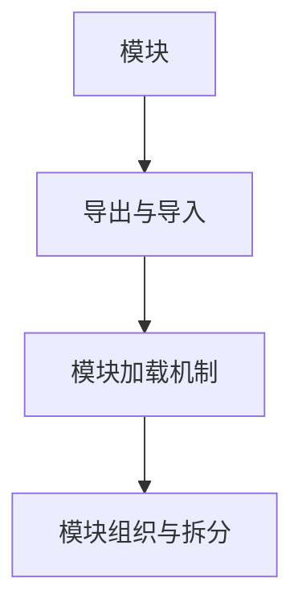

                 

关键词：Node.js、模块化编程、大型项目、依赖管理、模块化架构、模块加载机制、模块组织与拆分、模块化设计模式

摘要：本文旨在深入探讨Node.js模块化编程的实践方法，以及如何有效地管理大型项目和依赖。通过介绍模块化编程的核心概念、原理和实践技巧，本文将帮助开发者更好地组织代码、提高代码的可维护性和复用性，从而提高开发效率。

## 1. 背景介绍

随着互联网技术的迅猛发展，Web应用和后端服务的复杂性日益增加。在这种背景下，模块化编程成为了一种至关重要的技术手段。模块化编程不仅能够将复杂的系统分解为更小、更易于管理的部分，还能够提高代码的复用性、可维护性和可测试性。

Node.js作为一个流行的JavaScript运行环境，也强调模块化编程的重要性。Node.js的模块系统是基于CommonJS规范构建的，它允许开发者将代码拆分为独立的模块，并通过加载机制进行复用。本文将围绕Node.js模块化编程的实践方法进行深入探讨。

## 2. 核心概念与联系

在深入探讨Node.js模块化编程之前，我们需要了解一些核心概念，以及它们之间的关系。

### 2.1 模块

模块是代码的独立单元，它包含了一组相关功能的实现。在Node.js中，模块通常是一个文件，这个文件中包含了JavaScript代码，以及对该代码的导出和导入。

### 2.2 导出与导入

导出和导入是模块化编程的核心机制。导出是指将模块内的特定变量、函数或类暴露给其他模块，而导入则是从其他模块中获取所需的导出。

在Node.js中，使用`exports`对象进行导出，使用`require`函数进行导入。

### 2.3 模块加载机制

Node.js的模块加载机制是在运行时进行的。当`require`函数被调用时，Node.js会执行以下步骤：

1. **检查缓存**：首先检查当前模块是否已经加载并缓存，如果是，直接返回缓存中的模块。
2. **查找模块**：如果没有缓存，Node.js会根据模块的路径进行查找，包括相对路径和绝对路径。
3. **编译与执行**：找到模块后，Node.js会读取该模块的代码，并将其编译为可执行代码，然后执行。

### 2.4 模块组织与拆分

模块组织与拆分是模块化编程的重要方面。合理地组织模块可以提高代码的可读性和可维护性。常见的模块组织策略包括：

- **功能拆分**：将功能相似的部分代码拆分为独立的模块。
- **职责分离**：根据模块的职责进行拆分，确保每个模块只负责一项功能。
- **依赖管理**：确保模块之间的依赖关系清晰，避免出现循环依赖。

接下来，我们将通过一个Mermaid流程图来展示模块化编程的核心概念和关系。



## 3. 核心算法原理 & 具体操作步骤

### 3.1 算法原理概述

Node.js模块化编程的核心算法原理是模块的加载和导出机制。这个机制允许开发者将代码拆分为多个模块，并通过加载机制进行复用。以下是模块化编程的具体步骤：

### 3.2 算法步骤详解

1. **定义模块**：在源代码文件中定义模块，通常通过设置模块的`exports`对象或导出特定的变量、函数或类。

2. **导入模块**：在其他模块中，使用`require`函数导入所需的模块。

3. **模块加载**：当`require`函数被调用时，Node.js会按照模块加载机制进行模块的查找、编译和执行。

4. **模块执行**：模块加载完成后，模块中的代码将被执行，并返回导出的对象或函数。

### 3.3 算法优缺点

**优点**：

- **提高代码复用性**：通过模块化编程，可以将通用代码封装为模块，避免重复编写。
- **提高代码可维护性**：模块化编程有助于代码的拆分和组织，使得代码更易于维护和调试。
- **提高开发效率**：模块化编程可以加快开发速度，减少代码冗余，提高团队协作效率。

**缺点**：

- **引入依赖关系**：模块化编程会引入依赖关系，需要确保模块之间的依赖关系清晰，避免出现循环依赖。
- **性能开销**：模块的加载和编译可能会引入一定的性能开销。

### 3.4 算法应用领域

模块化编程广泛应用于各种Node.js应用和项目中，包括：

- **Web应用后端**：用于构建高性能、可扩展的后端服务。
- **命令行工具**：用于构建可复用的命令行工具。
- **跨平台应用**：用于构建跨平台的应用程序。

## 4. 数学模型和公式 & 详细讲解 & 举例说明

### 4.1 数学模型构建

在模块化编程中，我们可以使用数学模型来描述模块之间的关系。以下是一个简单的数学模型：

$$
M = \{ m_1, m_2, ..., m_n \}
$$

其中，$M$表示模块集合，$m_i$表示第$i$个模块。

### 4.2 公式推导过程

模块之间的关系可以用以下公式描述：

$$
\begin{align*}
& E(m_i) = \{ e_1, e_2, ..., e_k \} \\
& I(m_i) = \{ i_1, i_2, ..., i_l \}
\end{align*}
$$

其中，$E(m_i)$表示模块$m_i$的导出集合，$I(m_i)$表示模块$m_i$的导入集合。

### 4.3 案例分析与讲解

假设我们有一个包含三个模块的Node.js项目，如下所示：

- 模块A：导出了一个函数`functionA`，并导入了模块B和模块C。
- 模块B：导出了一个函数`functionB`，并导入了模块C。
- 模块C：导出了一个函数`functionC`。

我们可以用以下数学模型来表示这个项目：

$$
\begin{align*}
& E(A) = \{ functionA \} \\
& I(A) = \{ B, C \} \\
& E(B) = \{ functionB \} \\
& I(B) = \{ C \} \\
& E(C) = \{ functionC \} \\
& I(C) = \emptyset
\end{align*}
$$

在这个项目中，模块A导出了一个函数，并导入了模块B和模块C。模块B导出了一个函数，并导入了模块C。模块C没有导入其他模块，但导出了一个函数。通过这个数学模型，我们可以清晰地了解模块之间的关系。

## 5. 项目实践：代码实例和详细解释说明

### 5.1 开发环境搭建

在开始编写代码之前，我们需要搭建一个Node.js开发环境。以下是搭建步骤：

1. 安装Node.js：从Node.js官网下载并安装最新版本的Node.js。
2. 安装代码编辑器：选择一个合适的代码编辑器，如Visual Studio Code。
3. 初始化项目：在项目根目录下运行`npm init`命令，初始化项目配置文件`package.json`。

### 5.2 源代码详细实现

以下是一个简单的Node.js模块化编程示例：

**模块A：**

```javascript
// moduleA.js
exports.functionA = function() {
  console.log("Function A");
};
```

**模块B：**

```javascript
// moduleB.js
const moduleA = require('./moduleA');
moduleA.functionA();
```

**模块C：**

```javascript
// moduleC.js
exports.functionC = function() {
  console.log("Function C");
};
```

**主文件：**

```javascript
// main.js
const moduleA = require('./moduleA');
const moduleB = require('./moduleB');
const moduleC = require('./moduleC');

moduleA.functionA();
moduleB.functionB();
moduleC.functionC();
```

### 5.3 代码解读与分析

在这个示例中，我们创建了三个模块：模块A、模块B和模块C，以及一个主文件main.js。

- 模块A导出了一个名为`functionA`的函数。
- 模块B导入了模块A，并在其中调用了`functionA`。
- 模块C导出了一个名为`functionC`的函数。
- 主文件main.js导入了模块A、模块B和模块C，并在其中调用了它们对应的函数。

通过这个示例，我们可以看到模块化编程的基本原理：将功能拆分为独立的模块，并通过导入和导出进行复用。

### 5.4 运行结果展示

在终端中运行以下命令，可以查看运行结果：

```bash
node main.js
```

运行结果如下：

```bash
Function A
Function B
Function C
```

这表明我们的模块化编程示例已经成功运行。

## 6. 实际应用场景

模块化编程在Node.js项目中具有广泛的应用场景，以下是一些常见的实际应用场景：

- **Web应用后端**：用于构建RESTful API、GraphQL服务器、Web框架等。
- **命令行工具**：用于构建命令行应用程序、自动化脚本等。
- **跨平台应用**：用于构建桌面应用程序、移动应用程序等。

### 6.4 未来应用展望

随着Web应用和后端服务的不断进化，模块化编程将在以下几个方面得到进一步发展和应用：

- **模块化前端框架**：如React、Vue、Angular等，将逐渐完善模块化编程的特性。
- **模块化后端框架**：如Express、Koa等，将进一步提高模块化编程的效率和可维护性。
- **模块化数据库操作**：通过模块化编程，将数据库操作拆分为独立的模块，提高代码的复用性和可维护性。
- **模块化云计算应用**：在云计算领域，模块化编程可以帮助开发者更好地管理和部署大规模的应用程序。

## 7. 工具和资源推荐

### 7.1 学习资源推荐

- 《Node.js实战》
- 《Node.js模块化编程》
- Node.js官方文档

### 7.2 开发工具推荐

- Visual Studio Code
- IntelliJ IDEA
- WebStorm

### 7.3 相关论文推荐

- 《模块化编程：理论与实践》
- 《模块化系统设计：大型软件项目的组织与重构》

## 8. 总结：未来发展趋势与挑战

### 8.1 研究成果总结

本文详细探讨了Node.js模块化编程的核心概念、原理和实践技巧。通过介绍模块的加载机制、模块组织与拆分策略，以及具体的代码实例，本文为开发者提供了一种有效的模块化编程方法。

### 8.2 未来发展趋势

未来，模块化编程将在以下几个方面得到进一步发展：

- **模块化前端框架的完善**：如React、Vue等，将不断提高模块化编程的效率和可维护性。
- **模块化后端框架的普及**：如Express、Koa等，将逐渐成为开发者构建后端服务的首选。
- **模块化数据库操作的创新**：通过模块化编程，将数据库操作拆分为独立的模块，提高代码的复用性和可维护性。

### 8.3 面临的挑战

模块化编程在发展过程中也面临一些挑战：

- **模块依赖管理**：确保模块之间的依赖关系清晰，避免出现循环依赖。
- **性能优化**：模块的加载和编译可能会引入一定的性能开销，需要进一步优化。

### 8.4 研究展望

在未来的研究中，我们应关注以下几个方面：

- **模块化编程工具链的完善**：开发更高效的模块化编程工具，提高开发效率。
- **模块化架构的设计与优化**：探索更合理的模块化架构设计，提高代码的可维护性和可扩展性。
- **模块化编程在云计算领域的应用**：研究模块化编程在云计算领域的应用，为大规模云计算应用提供技术支持。

## 9. 附录：常见问题与解答

### 9.1 如何解决模块循环依赖问题？

模块循环依赖是模块化编程中常见的问题。解决方法包括：

- **调整模块依赖关系**：通过重新设计模块依赖关系，避免出现循环依赖。
- **使用模块加载策略**：如延迟加载、异步加载等，降低模块之间的依赖程度。
- **使用依赖注入框架**：如DI框架，可以帮助自动管理和解决循环依赖问题。

### 9.2 如何提高模块性能？

提高模块性能可以从以下几个方面入手：

- **模块拆分与缓存**：将大型模块拆分为多个小型模块，并使用缓存策略，减少模块加载时间。
- **代码压缩与打包**：使用代码压缩工具和打包工具，如UglifyJS和Webpack，减少代码体积，提高加载速度。
- **优化模块加载机制**：优化模块加载机制，如使用快速加载模块的库，提高模块加载性能。

### 9.3 如何确保模块的安全性？

确保模块安全性可以从以下几个方面入手：

- **代码审查与测试**：对模块代码进行严格审查和测试，确保代码质量和安全性。
- **使用安全库**：使用经过验证和测试的安全库，如HTTPS、JWT等，提高模块安全性。
- **代码加密与签名**：对模块代码进行加密和签名，确保代码的真实性和完整性。

通过以上方法，我们可以更好地管理和应用Node.js模块化编程，提高开发效率和质量。

**作者：禅与计算机程序设计艺术 / Zen and the Art of Computer Programming** 

以上是《Node.js 模块化编程实践：管理大型项目和依赖》的完整文章。希望本文能够为开发者提供有价值的参考和指导。在未来的技术发展中，让我们共同探索模块化编程的更多可能性，为构建更高效、更安全的软件系统贡献力量。

