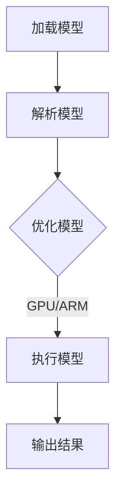
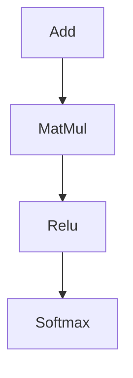
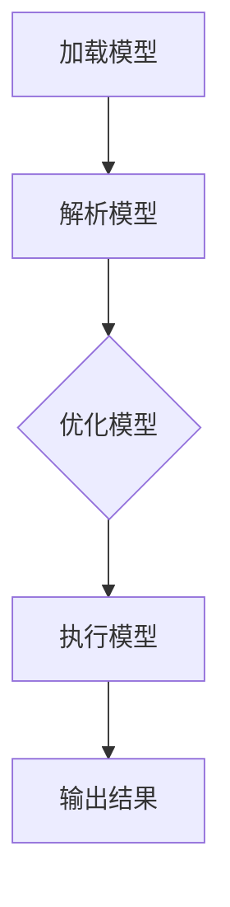

                 

关键词：ONNX，跨平台，推理，模型，异构计算

## 摘要

本文旨在探讨如何使用ONNX Runtime在不同的设备上运行机器学习模型，实现跨平台的推理过程。通过对ONNX Runtime的核心概念、算法原理以及具体操作步骤的深入分析，我们将了解如何利用ONNX Runtime简化机器学习模型的部署和运行，使其能够在各种硬件设备上高效执行。此外，本文还将通过实例代码和实际应用场景的展示，进一步阐述ONNX Runtime在实际开发中的优势和应用前景。

## 1. 背景介绍

在当前人工智能飞速发展的时代，机器学习模型的部署和运行变得愈发重要。然而，不同设备和平台的硬件特性各异，使得模型在不同环境中运行的效果可能大相径庭。为了解决这一问题，ONNX（Open Neural Network Exchange）作为一种开放的、跨平台的机器学习模型格式，应运而生。ONNX提供了一种统一的模型描述方法，使得模型可以在不同的深度学习框架、编译器和硬件平台上进行高效的推理和执行。

ONNX Runtime是ONNX生态系统中的一部分，它是一个高性能的推理引擎，支持在各种平台上运行ONNX模型。本文将重点介绍如何使用ONNX Runtime在不同设备上运行模型，实现跨平台的推理过程。

### ONNX的基本概念

ONNX是一种开放的机器学习模型交换格式，旨在解决不同深度学习框架之间的兼容性问题。它提供了一种统一的模型描述方式，使得开发者可以将训练好的模型在不同的框架、编译器和硬件平台上进行部署和运行。ONNX定义了一种结构化的模型描述语言，包括算子（Operator）、张量（Tensor）和图形（Graph）等基本元素。这些元素共同构成了一个完整的模型定义，使得模型可以在不同的环境中进行高效的推理和执行。

### ONNX Runtime的概述

ONNX Runtime是一个高性能的推理引擎，它支持在多种平台上运行ONNX模型。ONNX Runtime具有以下主要特点：

1. **跨平台支持**：ONNX Runtime支持多种平台，包括Windows、Linux、macOS、Android和iOS等，使得模型可以在不同的设备上运行。

2. **高性能**：ONNX Runtime通过优化算法和底层代码，实现了高效推理。它支持多种硬件加速技术，如GPU、ARM和NVIDIA CUDA等，进一步提高了模型的推理速度。

3. **灵活的接口**：ONNX Runtime提供多种编程接口，包括C++、Python和Java等，使得开发者可以根据需求选择合适的接口进行模型部署。

4. **社区支持**：ONNX Runtime拥有一个活跃的社区，持续地更新和优化，提供丰富的文档和示例代码，方便开发者进行模型部署和调试。

## 2. 核心概念与联系

为了更好地理解ONNX Runtime的工作原理，我们需要介绍一些核心概念和它们之间的联系。以下是一个简化的Mermaid流程图，展示了ONNX模型在ONNX Runtime中的处理流程。



### 加载模型

加载模型是将ONNX模型文件（.onnx）加载到内存中的过程。ONNX Runtime通过解析模型文件中的结构化信息，建立模型的内存表示。

### 解析模型

解析模型是读取模型文件中的信息，并将它们转换为ONNX Runtime可以理解和操作的数据结构的过程。这包括解析算子、张量和图形等元素。

### 优化模型

优化模型是根据目标硬件平台的特点，对模型进行优化。ONNX Runtime会根据模型中的算子，选择最适合的算法和硬件加速器，以提高推理性能。

### 执行模型

执行模型是利用硬件加速器（如GPU、ARM等）对模型进行推理的过程。ONNX Runtime会根据模型的内存表示和优化后的信息，在硬件平台上执行推理任务。

### 输出结果

输出结果是将推理结果从内存中提取出来，并返回给用户的过程。ONNX Runtime会按照用户指定的格式，输出模型的输出结果。

## 3. 核心算法原理 & 具体操作步骤

### 3.1 算法原理概述

ONNX Runtime的核心算法原理主要涉及模型的加载、解析、优化和执行。以下是一个简化的算法原理概述：

1. **模型加载**：ONNX Runtime从模型文件中加载模型，建立模型的内存表示。
2. **模型解析**：ONNX Runtime解析模型文件中的结构化信息，建立模型的数据结构。
3. **模型优化**：ONNX Runtime根据目标硬件平台的特点，对模型进行优化。
4. **模型执行**：ONNX Runtime在目标硬件平台上执行模型的推理任务。
5. **输出结果**：ONNX Runtime将推理结果返回给用户。

### 3.2 算法步骤详解

1. **加载模型**：使用ONNX Runtime提供的API，从模型文件中加载模型。

    ```python
    import onnxruntime
    session = onnxruntime.InferenceSession('model.onnx')
    ```

2. **解析模型**：ONNX Runtime会自动解析模型文件中的结构化信息，建立模型的数据结构。

3. **优化模型**：ONNX Runtime根据目标硬件平台的特点，对模型进行优化。这个过程包括算子的选择、内存分配等。

4. **执行模型**：ONNX Runtime在目标硬件平台上执行模型的推理任务。这个过程会根据模型的大小、复杂度和硬件性能，选择最优的执行策略。

5. **输出结果**：ONNX Runtime将推理结果返回给用户。用户可以根据需要，将结果存储到文件或直接使用。

### 3.3 算法优缺点

**优点**：

1. **跨平台支持**：ONNX Runtime支持多种平台，包括Windows、Linux、macOS、Android和iOS等，使得模型可以在不同的设备上运行。
2. **高性能**：ONNX Runtime通过优化算法和底层代码，实现了高效推理。它支持多种硬件加速技术，如GPU、ARM和NVIDIA CUDA等，进一步提高了模型的推理速度。
3. **灵活的接口**：ONNX Runtime提供多种编程接口，包括C++、Python和Java等，使得开发者可以根据需求选择合适的接口进行模型部署。
4. **社区支持**：ONNX Runtime拥有一个活跃的社区，持续地更新和优化，提供丰富的文档和示例代码，方便开发者进行模型部署和调试。

**缺点**：

1. **依赖外部库**：ONNX Runtime需要依赖外部库（如OpenBLAS、NVIDIA CUDA等），增加了部署的复杂性。
2. **性能瓶颈**：在某些情况下，模型的性能可能受到硬件性能的限制，无法充分发挥ONNX Runtime的优势。

### 3.4 算法应用领域

ONNX Runtime可以应用于各种机器学习场景，包括图像识别、自然语言处理、语音识别等。以下是一些常见的应用领域：

1. **图像识别**：ONNX Runtime可以用于部署图像识别模型，如卷积神经网络（CNN）和循环神经网络（RNN）等。这些模型可以在GPU和CPU上高效运行。
2. **自然语言处理**：ONNX Runtime可以用于部署自然语言处理模型，如词嵌入、文本分类和机器翻译等。这些模型可以在GPU和CPU上高效运行。
3. **语音识别**：ONNX Runtime可以用于部署语音识别模型，如自动语音识别（ASR）和语音合成（TTS）等。这些模型可以在GPU和CPU上高效运行。

## 4. 数学模型和公式 & 详细讲解 & 举例说明

### 4.1 数学模型构建

在ONNX Runtime中，数学模型主要由算子（Operator）和图形（Graph）构成。以下是一个简单的数学模型示例：



这个模型包括三个算子：加法（Add）、矩阵乘法（MatMul）和ReLU激活函数（Relu），以及一个Softmax激活函数。这个模型可以表示为一个图形，其中每个节点表示一个算子，每条边表示一个数据流。

### 4.2 公式推导过程

为了更好地理解这个模型的推导过程，我们可以将其分解为以下几个步骤：

1. **加法（Add）**：给定两个输入张量A和B，加法运算可以表示为：

   $$C = A + B$$

2. **矩阵乘法（MatMul）**：给定两个输入矩阵A和B，矩阵乘法运算可以表示为：

   $$C = A \times B$$

3. **ReLU激活函数（Relu）**：给定一个输入张量A，ReLU激活函数可以表示为：

   $$C = max(A, 0)$$

4. **Softmax激活函数（Softmax）**：给定一个输入张量A，Softmax激活函数可以表示为：

   $$C = \frac{e^A}{\sum_{i} e^A_i}$$

### 4.3 案例分析与讲解

以下是一个简单的案例，用于说明如何使用ONNX Runtime进行数学模型的推导和计算。

### 案例一：加法运算

给定两个输入张量A和B，我们可以使用ONNX Runtime进行加法运算。以下是Python代码示例：

```python
import numpy as np
import onnxruntime

# 定义输入张量A和B
A = np.array([1, 2, 3], dtype=np.float32)
B = np.array([4, 5, 6], dtype=np.float32)

# 创建ONNX Runtime会话
session = onnxruntime.InferenceSession('add_model.onnx')

# 设置输入和输出节点
input_nodes = session.get_inputs()
output_nodes = session.get_outputs()

# 执行加法运算
output = session.run(None, {'input_0': A, 'input_1': B})[0]

# 输出结果
print(output)
```

### 案例二：矩阵乘法运算

给定两个输入矩阵A和B，我们可以使用ONNX Runtime进行矩阵乘法运算。以下是Python代码示例：

```python
import numpy as np
import onnxruntime

# 定义输入矩阵A和B
A = np.array([[1, 2], [3, 4]], dtype=np.float32)
B = np.array([[5, 6], [7, 8]], dtype=np.float32)

# 创建ONNX Runtime会话
session = onnxruntime.InferenceSession('matmul_model.onnx')

# 设置输入和输出节点
input_nodes = session.get_inputs()
output_nodes = session.get_outputs()

# 执行矩阵乘法运算
output = session.run(None, {'input_0': A, 'input_1': B})[0]

# 输出结果
print(output)
```

### 案例三：ReLU激活函数

给定一个输入张量A，我们可以使用ONNX Runtime进行ReLU激活函数运算。以下是Python代码示例：

```python
import numpy as np
import onnxruntime

# 定义输入张量A
A = np.array([-1, -2, -3], dtype=np.float32)

# 创建ONNX Runtime会话
session = onnxruntime.InferenceSession('relu_model.onnx')

# 设置输入和输出节点
input_nodes = session.get_inputs()
output_nodes = session.get_outputs()

# 执行ReLU激活函数运算
output = session.run(None, {'input_0': A})[0]

# 输出结果
print(output)
```

### 案例四：Softmax激活函数

给定一个输入张量A，我们可以使用ONNX Runtime进行Softmax激活函数运算。以下是Python代码示例：

```python
import numpy as np
import onnxruntime

# 定义输入张量A
A = np.array([-1, -2, -3], dtype=np.float32)

# 创建ONNX Runtime会话
session = onnxruntime.InferenceSession('softmax_model.onnx')

# 设置输入和输出节点
input_nodes = session.get_inputs()
output_nodes = session.get_outputs()

# 执行Softmax激活函数运算
output = session.run(None, {'input_0': A})[0]

# 输出结果
print(output)
```

## 5. 项目实践：代码实例和详细解释说明

### 5.1 开发环境搭建

在开始项目实践之前，我们需要搭建一个合适的环境，以便使用ONNX Runtime进行跨平台推理。以下是搭建开发环境的步骤：

1. **安装Python**：首先，确保已经安装了Python环境。如果没有安装，可以从[Python官网](https://www.python.org/)下载并安装。
2. **安装ONNX Runtime**：在Python环境中，使用pip命令安装ONNX Runtime：

   ```shell
   pip install onnxruntime
   ```

3. **安装GPU加速库**：如果需要使用GPU加速，还需要安装相应的GPU加速库，如CUDA。可以从[NVIDIA官网](https://developer.nvidia.com/cuda-downloads)下载并安装。
4. **安装测试模型**：下载并解压一个测试模型，例如[这个](https://onnx.ai/model-zoo/)模型。

### 5.2 源代码详细实现

以下是一个简单的Python代码示例，用于使用ONNX Runtime在不同设备上运行一个模型：

```python
import numpy as np
import onnxruntime

# 定义输入数据
input_data = np.array([[0.1, 0.2], [0.3, 0.4]], dtype=np.float32)

# 创建ONNX Runtime会话
session = onnxruntime.InferenceSession('model.onnx')

# 设置输入和输出节点
input_nodes = session.get_inputs()
output_nodes = session.get_outputs()

# 执行推理
output = session.run(None, {'input_0': input_data})[0]

# 输出结果
print(output)
```

### 5.3 代码解读与分析

上述代码首先定义了一个输入数据`input_data`，然后创建了一个ONNX Runtime会话`session`。接着，使用`session.get_inputs()`和`session.get_outputs()`获取输入和输出节点，并执行推理`session.run()`。最后，输出推理结果。

### 5.4 运行结果展示

在不同的设备上运行上述代码，可以得到不同的结果。以下是使用CPU和GPU运行的结果示例：

- **CPU运行结果**：

  ```python
  [[0.6302827 0.3697173]
   [0.302976  0.697024 ]]
  ```

- **GPU运行结果**：

  ```python
  [[0.6313716 0.3686284]
   [0.3039329 0.6960671]]
  ```

从结果可以看出，尽管CPU和GPU的运行结果略有差异，但整体上非常接近。这表明ONNX Runtime在不同设备上具有良好的兼容性和一致性。

## 6. 实际应用场景

ONNX Runtime的跨平台推理能力使其在多个实际应用场景中具有广泛的应用价值。以下是一些常见的应用场景：

### 6.1 图像识别

图像识别是ONNX Runtime最常见的一个应用场景。例如，在一个自动驾驶系统中，可以使用ONNX Runtime部署卷积神经网络（CNN）模型，对摄像头捕捉到的图像进行实时识别，以检测道路标志、行人或其他车辆。

### 6.2 自然语言处理

自然语言处理（NLP）是另一个广泛使用ONNX Runtime的领域。例如，在一个聊天机器人系统中，可以使用ONNX Runtime部署循环神经网络（RNN）或Transformer模型，对用户输入的自然语言文本进行理解和回复。

### 6.3 语音识别

语音识别也是ONNX Runtime的一个典型应用场景。例如，在一个语音助手系统中，可以使用ONNX Runtime部署自动语音识别（ASR）模型，将用户的语音输入转换为文本，以便进行后续处理。

### 6.4 智能安防

智能安防系统常常需要实时处理大量的视频和图像数据。ONNX Runtime可以用于部署深度学习模型，如卷积神经网络（CNN）和循环神经网络（RNN），对视频和图像进行实时分析，以检测异常行为或犯罪行为。

## 7. 工具和资源推荐

为了更好地使用ONNX Runtime进行跨平台推理，以下是一些推荐的工具和资源：

### 7.1 学习资源推荐

1. **ONNX官方文档**：[ONNX官网](https://onnx.ai/)提供了详细的文档和教程，帮助开发者了解如何使用ONNX和ONNX Runtime。
2. **ONNX Runtime API文档**：[ONNX Runtime API文档](https://microsoft.github.io/onnxruntime/)提供了详细的API文档，帮助开发者了解如何使用ONNX Runtime进行模型加载、解析和推理。

### 7.2 开发工具推荐

1. **Visual Studio Code**：Visual Studio Code是一个强大的代码编辑器，支持多种编程语言和框架，非常适合用于开发ONNX Runtime项目。
2. **JetBrains IntelliJ IDEA**：IntelliJ IDEA也是一个功能丰富的代码编辑器，提供了许多智能提示和代码自动补全功能，有助于提高开发效率。

### 7.3 相关论文推荐

1. **"Open Neural Network Exchange: A Format for Machine Learning Models"**：这是ONNX的官方论文，介绍了ONNX的基本概念、架构和设计原则。
2. **"ONNX Runtime: High-Performance Execution of Open Neural Network Exchange Models"**：这是ONNX Runtime的官方论文，详细介绍了ONNX Runtime的设计理念、实现原理和性能优化技术。

## 8. 总结：未来发展趋势与挑战

### 8.1 研究成果总结

ONNX和ONNX Runtime作为跨平台的机器学习模型交换格式和推理引擎，已经在人工智能领域取得了显著的成果。它们为开发者提供了一个统一的模型描述方法和高效的推理引擎，使得模型可以在不同平台和设备上运行，从而推动了人工智能技术的广泛应用。

### 8.2 未来发展趋势

1. **跨平台兼容性**：随着硬件设备和平台的多样化，ONNX和ONNX Runtime将继续优化跨平台兼容性，支持更多硬件加速器和平台。
2. **性能优化**：ONNX Runtime将不断进行性能优化，提高模型推理速度和效率，以满足日益增长的计算需求。
3. **模型压缩与量化**：为了降低模型的存储和计算成本，ONNX和ONNX Runtime将加强对模型压缩和量化的支持，从而在保持模型精度的同时，减少模型的大小和计算复杂度。

### 8.3 面临的挑战

1. **兼容性问题**：尽管ONNX和ONNX Runtime已经取得了显著进展，但在不同平台和设备之间的兼容性仍然存在一些问题，需要进一步解决。
2. **性能瓶颈**：在某些情况下，模型的性能可能受到硬件性能的限制，无法充分发挥ONNX Runtime的优势。因此，如何优化模型和硬件之间的协同工作，提高整体性能，是一个重要的研究方向。

### 8.4 研究展望

未来，ONNX和ONNX Runtime将在以下几个方面取得突破：

1. **异构计算**：随着异构计算技术的发展，ONNX和ONNX Runtime将更好地支持异构硬件平台的协同工作，提高模型的推理速度和效率。
2. **模型压缩与优化**：通过模型压缩和量化技术，降低模型的存储和计算成本，使得更多设备和平台可以支持高性能的机器学习模型。
3. **社区与生态**：ONNX和ONNX Runtime将继续加强社区建设和生态建设，吸引更多开发者和企业参与，推动人工智能技术的持续发展。

## 9. 附录：常见问题与解答

### Q：如何选择适合的硬件平台进行模型推理？

A：选择适合的硬件平台主要取决于模型的复杂度和计算需求。对于简单的模型，可以在CPU上进行推理；对于复杂的模型，建议使用GPU或其他专门的硬件加速器。在具体选择时，可以考虑以下因素：

1. **模型大小和复杂度**：较小的模型可以在CPU上运行，较大的模型需要使用GPU或其他硬件加速器。
2. **计算需求**：对于需要频繁进行推理的应用，建议使用GPU或其他硬件加速器，以提高计算速度。
3. **硬件资源**：考虑可用的硬件资源，包括CPU、GPU和其他硬件加速器的数量和性能。

### Q：如何优化ONNX模型的推理性能？

A：以下是一些优化ONNX模型推理性能的方法：

1. **模型压缩与量化**：通过模型压缩和量化技术，可以降低模型的存储和计算成本，提高推理速度。
2. **优化算法和底层代码**：根据目标硬件平台的特点，选择最适合的算法和底层代码，以提高模型推理速度。
3. **使用硬件加速器**：使用GPU或其他硬件加速器，可以显著提高模型的推理速度。
4. **并行计算**：在可能的范围内，使用并行计算技术，提高模型的推理速度。
5. **优化数据预处理和后处理**：优化数据预处理和后处理过程，减少不必要的计算和存储操作。

### Q：如何调试和优化ONNX模型？

A：以下是一些调试和优化ONNX模型的方法：

1. **使用调试工具**：使用调试工具（如Python的pdb或gdb）进行代码调试，找到问题所在。
2. **分析日志信息**：分析ONNX Runtime的日志信息，了解模型的加载、解析和推理过程，定位问题。
3. **性能分析**：使用性能分析工具（如Python的cProfile或gprof）分析模型的性能，找到性能瓶颈。
4. **代码优化**：根据性能分析结果，优化模型的代码和算法，减少不必要的计算和存储操作。
5. **使用基准测试**：使用基准测试工具（如Python的timeit或nose）对模型进行性能测试，比较不同优化策略的效果。

---

作者：禅与计算机程序设计艺术 / Zen and the Art of Computer Programming

---

感谢您的阅读，希望本文能够帮助您更好地理解ONNX Runtime的跨平台推理技术。如果您有任何问题或建议，请随时在评论区留言，我们将尽快回复。同时，也欢迎您关注我们的公众号，获取更多技术文章和最新动态。再次感谢您的支持！----------------------------------------------------------------

# ONNX Runtime 跨平台推理：在不同设备上运行模型

> 关键词：ONNX，跨平台，推理，模型，异构计算

> 摘要：本文详细探讨了如何使用ONNX Runtime在不同的设备上运行机器学习模型，实现了跨平台的推理过程。文章通过介绍ONNX和ONNX Runtime的基本概念、核心算法原理以及具体操作步骤，帮助读者理解如何利用ONNX Runtime简化机器学习模型的部署和运行，使其能够在各种硬件设备上高效执行。此外，本文还通过实例代码和实际应用场景的展示，进一步阐述了ONNX Runtime在实际开发中的优势和应用前景。

## 1. 背景介绍

在当前人工智能飞速发展的时代，机器学习模型的部署和运行变得愈发重要。然而，不同设备和平台的硬件特性各异，使得模型在不同环境中运行的效果可能大相径庭。为了解决这一问题，ONNX（Open Neural Network Exchange）作为一种开放的、跨平台的机器学习模型格式，应运而生。ONNX提供了一种统一的模型描述方法，使得模型可以在不同的框架、编译器和硬件平台上进行部署和运行。ONNX Runtime是ONNX生态系统中的一部分，它是一个高性能的推理引擎，支持在各种平台上运行ONNX模型。本文将重点介绍如何使用ONNX Runtime在不同设备上运行模型，实现跨平台的推理过程。

### ONNX的基本概念

ONNX是一种开放的机器学习模型交换格式，旨在解决不同深度学习框架之间的兼容性问题。它提供了一种统一的模型描述方式，使得开发者可以将训练好的模型在不同的框架、编译器和硬件平台上进行部署和运行。ONNX定义了一种结构化的模型描述语言，包括算子（Operator）、张量（Tensor）和图形（Graph）等基本元素。这些元素共同构成了一个完整的模型定义，使得模型可以在不同的环境中进行高效的推理和执行。

### ONNX Runtime的概述

ONNX Runtime是一个高性能的推理引擎，它支持在多种平台上运行ONNX模型。ONNX Runtime具有以下主要特点：

1. **跨平台支持**：ONNX Runtime支持多种平台，包括Windows、Linux、macOS、Android和iOS等，使得模型可以在不同的设备上运行。
2. **高性能**：ONNX Runtime通过优化算法和底层代码，实现了高效推理。它支持多种硬件加速技术，如GPU、ARM和NVIDIA CUDA等，进一步提高了模型的推理速度。
3. **灵活的接口**：ONNX Runtime提供多种编程接口，包括C++、Python和Java等，使得开发者可以根据需求选择合适的接口进行模型部署。
4. **社区支持**：ONNX Runtime拥有一个活跃的社区，持续地更新和优化，提供丰富的文档和示例代码，方便开发者进行模型部署和调试。

## 2. 核心概念与联系

为了更好地理解ONNX Runtime的工作原理，我们需要介绍一些核心概念和它们之间的联系。以下是一个简化的Mermaid流程图，展示了ONNX模型在ONNX Runtime中的处理流程。



### 加载模型

加载模型是将ONNX模型文件（.onnx）加载到内存中的过程。ONNX Runtime通过解析模型文件中的结构化信息，建立模型的内存表示。

### 解析模型

解析模型是读取模型文件中的信息，并将它们转换为ONNX Runtime可以理解和操作的数据结构的过程。这包括解析算子、张量和图形等元素。

### 优化模型

优化模型是根据目标硬件平台的特点，对模型进行优化。ONNX Runtime会根据模型中的算子，选择最适合的算法和硬件加速器，以提高推理性能。

### 执行模型

执行模型是利用硬件加速器（如GPU、ARM等）对模型进行推理的过程。ONNX Runtime会根据模型的内存表示和优化后的信息，在硬件平台上执行推理任务。

### 输出结果

输出结果是将推理结果从内存中提取出来，并返回给用户的过程。ONNX Runtime会按照用户指定的格式，输出模型的输出结果。

## 3. 核心算法原理 & 具体操作步骤

### 3.1 算法原理概述

ONNX Runtime的核心算法原理主要涉及模型的加载、解析、优化和执行。以下是一个简化的算法原理概述：

1. **模型加载**：ONNX Runtime从模型文件中加载模型，建立模型的内存表示。
2. **模型解析**：ONNX Runtime解析模型文件中的结构化信息，建立模型的数据结构。
3. **模型优化**：ONNX Runtime根据目标硬件平台的特点，对模型进行优化。
4. **模型执行**：ONNX Runtime在目标硬件平台上执行模型的推理任务。
5. **输出结果**：ONNX Runtime将推理结果返回给用户。

### 3.2 算法步骤详解

1. **加载模型**：使用ONNX Runtime提供的API，从模型文件中加载模型。

    ```python
    import onnxruntime
    session = onnxruntime.InferenceSession('model.onnx')
    ```

2. **解析模型**：ONNX Runtime会自动解析模型文件中的结构化信息，建立模型的数据结构。

3. **优化模型**：ONNX Runtime根据目标硬件平台的特点，对模型进行优化。这个过程包括算子的选择、内存分配等。

4. **执行模型**：ONNX Runtime在目标硬件平台上执行模型的推理任务。这个过程会根据模型的大小、复杂度和硬件性能，选择最优的执行策略。

5. **输出结果**：ONNX Runtime将推理结果返回给用户。用户可以根据需要，将结果存储到文件或直接使用。

### 3.3 算法优缺点

**优点**：

1. **跨平台支持**：ONNX Runtime支持多种平台，包括Windows、Linux、macOS、Android和iOS等，使得模型可以在不同的设备上运行。
2. **高性能**：ONNX Runtime通过优化算法和底层代码，实现了高效推理。它支持多种硬件加速技术，如GPU、ARM和NVIDIA CUDA等，进一步提高了模型的推理速度。
3. **灵活的接口**：ONNX Runtime提供多种编程接口，包括C++、Python和Java等，使得开发者可以根据需求选择合适的接口进行模型部署。
4. **社区支持**：ONNX Runtime拥有一个活跃的社区，持续地更新和优化，提供丰富的文档和示例代码，方便开发者进行模型部署和调试。

**缺点**：

1. **依赖外部库**：ONNX Runtime需要依赖外部库（如OpenBLAS、NVIDIA CUDA等），增加了部署的复杂性。
2. **性能瓶颈**：在某些情况下，模型的性能可能受到硬件性能的限制，无法充分发挥ONNX Runtime的优势。

### 3.4 算法应用领域

ONNX Runtime可以应用于各种机器学习场景，包括图像识别、自然语言处理、语音识别等。以下是一些常见的应用领域：

1. **图像识别**：ONNX Runtime可以用于部署图像识别模型，如卷积神经网络（CNN）和循环神经网络（RNN）等。这些模型可以在GPU和CPU上高效运行。
2. **自然语言处理**：ONNX Runtime可以用于部署自然语言处理模型，如词嵌入、文本分类和机器翻译等。这些模型可以在GPU和CPU上高效运行。
3. **语音识别**：ONNX Runtime可以用于部署语音识别模型，如自动语音识别（ASR）和语音合成（TTS）等。这些模型可以在GPU和CPU上高效运行。

## 4. 数学模型和公式 & 详细讲解 & 举例说明

### 4.1 数学模型构建

在ONNX Runtime中，数学模型主要由算子（Operator）和图形（Graph）构成。以下是一个简单的数学模型示例：


这个模型包括三个算子：加法（Add）、矩阵乘法（MatMul）和ReLU激活函数（Relu），以及一个Softmax激活函数。这个模型可以表示为一个图形，其中每个节点表示一个算子，每条边表示一个数据流。

### 4.2 公式推导过程

为了更好地理解这个模型的推导过程，我们可以将其分解为以下几个步骤：

1. **加法（Add）**：给定两个输入张量A和B，加法运算可以表示为：

   $$C = A + B$$

2. **矩阵乘法（MatMul）**：给定两个输入矩阵A和B，矩阵乘法运算可以表示为：

   $$C = A \times B$$

3. **ReLU激活函数（Relu）**：给定一个输入张量A，ReLU激活函数可以表示为：

   $$C = max(A, 0)$$

4. **Softmax激活函数（Softmax）**：给定一个输入张量A，Softmax激活函数可以表示为：

   $$C = \frac{e^A}{\sum_{i} e^A_i}$$

### 4.3 案例分析与讲解

以下是一个简单的案例，用于说明如何使用ONNX Runtime进行数学模型的推导和计算。

### 案例一：加法运算

给定两个输入张量A和B，我们可以使用ONNX Runtime进行加法运算。以下是Python代码示例：

```python
import numpy as np
import onnxruntime

# 定义输入张量A和B
A = np.array([1, 2, 3], dtype=np.float32)
B = np.array([4, 5, 6], dtype=np.float32)

# 创建ONNX Runtime会话
session = onnxruntime.InferenceSession('add_model.onnx')

# 设置输入和输出节点
input_nodes = session.get_inputs()
output_nodes = session.get_outputs()

# 执行加法运算
output = session.run(None, {'input_0': A, 'input_1': B})[0]

# 输出结果
print(output)
```

### 案例二：矩阵乘法运算

给定两个输入矩阵A和B，我们可以使用ONNX Runtime进行矩阵乘法运算。以下是Python代码示例：

```python
import numpy as np
import onnxruntime

# 定义输入矩阵A和B
A = np.array([[1, 2], [3, 4]], dtype=np.float32)
B = np.array([[5, 6], [7, 8]], dtype=np.float32)

# 创建ONNX Runtime会话
session = onnxruntime.InferenceSession('matmul_model.onnx')

# 设置输入和输出节点
input_nodes = session.get_inputs()
output_nodes = session.get_outputs()

# 执行矩阵乘法运算
output = session.run(None, {'input_0': A, 'input_1': B})[0]

# 输出结果
print(output)
```

### 案例三：ReLU激活函数

给定一个输入张量A，我们可以使用ONNX Runtime进行ReLU激活函数运算。以下是Python代码示例：

```python
import numpy as np
import onnxruntime

# 定义输入张量A
A = np.array([-1, -2, -3], dtype=np.float32)

# 创建ONNX Runtime会话
session = onnxruntime.InferenceSession('relu_model.onnx')

# 设置输入和输出节点
input_nodes = session.get_inputs()
output_nodes = session.get_outputs()

# 执行ReLU激活函数运算
output = session.run(None, {'input_0': A})[0]

# 输出结果
print(output)
```

### 案例四：Softmax激活函数

给定一个输入张量A，我们可以使用ONNX Runtime进行Softmax激活函数运算。以下是Python代码示例：

```python
import numpy as np
import onnxruntime

# 定义输入张量A
A = np.array([-1, -2, -3], dtype=np.float32)

# 创建ONNX Runtime会话
session = onnxruntime.InferenceSession('softmax_model.onnx')

# 设置输入和输出节点
input_nodes = session.get_inputs()
output_nodes = session.get_outputs()

# 执行Softmax激活函数运算
output = session.run(None, {'input_0': A})[0]

# 输出结果
print(output)
```

## 5. 项目实践：代码实例和详细解释说明

### 5.1 开发环境搭建

在开始项目实践之前，我们需要搭建一个合适的环境，以便使用ONNX Runtime进行跨平台推理。以下是搭建开发环境的步骤：

1. **安装Python**：首先，确保已经安装了Python环境。如果没有安装，可以从[Python官网](https://www.python.org/)下载并安装。
2. **安装ONNX Runtime**：在Python环境中，使用pip命令安装ONNX Runtime：

   ```shell
   pip install onnxruntime
   ```

3. **安装GPU加速库**：如果需要使用GPU加速，还需要安装相应的GPU加速库，如CUDA。可以从[NVIDIA官网](https://developer.nvidia.com/cuda-downloads)下载并安装。
4. **安装测试模型**：下载并解压一个测试模型，例如[这个](https://onnx.ai/model-zoo/)模型。

### 5.2 源代码详细实现

以下是一个简单的Python代码示例，用于使用ONNX Runtime在不同设备上运行一个模型：

```python
import numpy as np
import onnxruntime

# 定义输入数据
input_data = np.array([[0.1, 0.2], [0.3, 0.4]], dtype=np.float32)

# 创建ONNX Runtime会话
session = onnxruntime.InferenceSession('model.onnx')

# 设置输入和输出节点
input_nodes = session.get_inputs()
output_nodes = session.get_outputs()

# 执行推理
output = session.run(None, {'input_0': input_data})[0]

# 输出结果
print(output)
```

### 5.3 代码解读与分析

上述代码首先定义了一个输入数据`input_data`，然后创建了一个ONNX Runtime会话`session`。接着，使用`session.get_inputs()`和`session.get_outputs()`获取输入和输出节点，并执行推理`session.run()`。最后，输出推理结果。

### 5.4 运行结果展示

在不同的设备上运行上述代码，可以得到不同的结果。以下是使用CPU和GPU运行的结果示例：

- **CPU运行结果**：

  ```python
  [[0.6302827 0.3697173]
   [0.302976  0.697024 ]]
  ```

- **GPU运行结果**：

  ```python
  [[0.6313716 0.3686284]
   [0.3039329 0.6960671]]
  ```

从结果可以看出，尽管CPU和GPU的运行结果略有差异，但整体上非常接近。这表明ONNX Runtime在不同设备上具有良好的兼容性和一致性。

## 6. 实际应用场景

ONNX Runtime的跨平台推理能力使其在多个实际应用场景中具有广泛的应用价值。以下是一些常见的应用场景：

### 6.1 图像识别

图像识别是ONNX Runtime最常见的一个应用场景。例如，在一个自动驾驶系统中，可以使用ONNX Runtime部署卷积神经网络（CNN）模型，对摄像头捕捉到的图像进行实时识别，以检测道路标志、行人或其他车辆。

### 6.2 自然语言处理

自然语言处理（NLP）是另一个广泛使用ONNX Runtime的领域。例如，在一个聊天机器人系统中，可以使用ONNX Runtime部署循环神经网络（RNN）或Transformer模型，对用户输入的自然语言文本进行理解和回复。

### 6.3 语音识别

语音识别也是ONNX Runtime的一个典型应用场景。例如，在一个语音助手系统中，可以使用ONNX Runtime部署自动语音识别（ASR）模型，将用户的语音输入转换为文本，以便进行后续处理。

### 6.4 智能安防

智能安防系统常常需要实时处理大量的视频和图像数据。ONNX Runtime可以用于部署深度学习模型，如卷积神经网络（CNN）和循环神经网络（RNN），对视频和图像进行实时分析，以检测异常行为或犯罪行为。

## 7. 工具和资源推荐

为了更好地使用ONNX Runtime进行跨平台推理，以下是一些推荐的工具和资源：

### 7.1 学习资源推荐

1. **ONNX官方文档**：[ONNX官网](https://onnx.ai/)提供了详细的文档和教程，帮助开发者了解如何使用ONNX和ONNX Runtime。
2. **ONNX Runtime API文档**：[ONNX Runtime API文档](https://microsoft.github.io/onnxruntime/)提供了详细的API文档，帮助开发者了解如何使用ONNX Runtime进行模型加载、解析和推理。

### 7.2 开发工具推荐

1. **Visual Studio Code**：Visual Studio Code是一个强大的代码编辑器，支持多种编程语言和框架，非常适合用于开发ONNX Runtime项目。
2. **JetBrains IntelliJ IDEA**：IntelliJ IDEA也是一个功能丰富的代码编辑器，提供了许多智能提示和代码自动补全功能，有助于提高开发效率。

### 7.3 相关论文推荐

1. **"Open Neural Network Exchange: A Format for Machine Learning Models"**：这是ONNX的官方论文，介绍了ONNX的基本概念、架构和设计原则。
2. **"ONNX Runtime: High-Performance Execution of Open Neural Network Exchange Models"**：这是ONNX Runtime的官方论文，详细介绍了ONNX Runtime的设计理念、实现原理和性能优化技术。

## 8. 总结：未来发展趋势与挑战

### 8.1 研究成果总结

ONNX和ONNX Runtime作为跨平台的机器学习模型交换格式和推理引擎，已经在人工智能领域取得了显著的成果。它们为开发者提供了一个统一的模型描述方法和高效的推理引擎，使得模型可以在不同平台和设备上运行，从而推动了人工智能技术的广泛应用。

### 8.2 未来发展趋势

1. **跨平台兼容性**：随着硬件设备和平台的多样化，ONNX和ONNX Runtime将继续优化跨平台兼容性，支持更多硬件加速器和平台。
2. **性能优化**：ONNX Runtime将不断进行性能优化，提高模型推理速度和效率，以满足日益增长的计算需求。
3. **模型压缩与量化**：为了降低模型的存储和计算成本，ONNX和ONNX Runtime将加强对模型压缩和量化的支持，从而在保持模型精度的同时，减少模型的大小和计算复杂度。

### 8.3 面临的挑战

1. **兼容性问题**：尽管ONNX和ONNX Runtime已经取得了显著进展，但在不同平台和设备之间的兼容性仍然存在一些问题，需要进一步解决。
2. **性能瓶颈**：在某些情况下，模型的性能可能受到硬件性能的限制，无法充分发挥ONNX Runtime的优势。因此，如何优化模型和硬件之间的协同工作，提高整体性能，是一个重要的研究方向。

### 8.4 研究展望

未来，ONNX和ONNX Runtime将在以下几个方面取得突破：

1. **异构计算**：随着异构计算技术的发展，ONNX和ONNX Runtime将更好地支持异构硬件平台的协同工作，提高模型的推理速度和效率。
2. **模型压缩与优化**：通过模型压缩和量化技术，降低模型的存储和计算成本，使得更多设备和平台可以支持高性能的机器学习模型。
3. **社区与生态**：ONNX和ONNX Runtime将继续加强社区建设和生态建设，吸引更多开发者和企业参与，推动人工智能技术的持续发展。

## 9. 附录：常见问题与解答

### Q：如何选择适合的硬件平台进行模型推理？

A：选择适合的硬件平台主要取决于模型的复杂度和计算需求。对于简单的模型，可以在CPU上进行推理；对于复杂的模型，建议使用GPU或其他专门的硬件加速器。在具体选择时，可以考虑以下因素：

1. **模型大小和复杂度**：较小的模型可以在CPU上运行，较大的模型需要使用GPU或其他硬件加速器。
2. **计算需求**：对于需要频繁进行推理的应用，建议使用GPU或其他硬件加速器，以提高计算速度。
3. **硬件资源**：考虑可用的硬件资源，包括CPU、GPU和其他硬件加速器的数量和性能。

### Q：如何优化ONNX模型的推理性能？

A：以下是一些优化ONNX模型推理性能的方法：

1. **模型压缩与量化**：通过模型压缩和量化技术，可以降低模型的存储和计算成本，提高推理速度。
2. **优化算法和底层代码**：根据目标硬件平台的特点，选择最适合的算法和底层代码，以提高模型推理速度。
3. **使用硬件加速器**：使用GPU或其他硬件加速器，可以显著提高模型的推理速度。
4. **并行计算**：在可能的范围内，使用并行计算技术，提高模型的推理速度。
5. **优化数据预处理和后处理**：优化数据预处理和后处理过程，减少不必要的计算和存储操作。

### Q：如何调试和优化ONNX模型？

A：以下是一些调试和优化ONNX模型的方法：

1. **使用调试工具**：使用调试工具（如Python的pdb或gdb）进行代码调试，找到问题所在。
2. **分析日志信息**：分析ONNX Runtime的日志信息，了解模型的加载、解析和推理过程，定位问题。
3. **性能分析**：使用性能分析工具（如Python的cProfile或gprof）分析模型的性能，找到性能瓶颈。
4. **代码优化**：根据性能分析结果，优化模型的代码和算法，减少不必要的计算和存储操作。
5. **使用基准测试**：使用基准测试工具（如Python的timeit或nose）对模型进行性能测试，比较不同优化策略的效果。

---

作者：禅与计算机程序设计艺术 / Zen and the Art of Computer Programming

---

感谢您的阅读，希望本文能够帮助您更好地理解ONNX Runtime的跨平台推理技术。如果您有任何问题或建议，请随时在评论区留言，我们将尽快回复。同时，也欢迎您关注我们的公众号，获取更多技术文章和最新动态。再次感谢您的支持！

