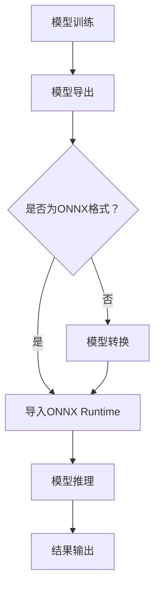

                 

 > **关键词**：ONNX Runtime、跨平台推理、深度学习、模型部署、高效推理

> **摘要**：本文将深入探讨 ONNX Runtime 的部署过程及其在跨平台推理中的应用。通过对 ONNX Runtime 的背景、核心概念、算法原理、数学模型、项目实践以及未来展望的详细分析，为开发者提供一套完整的 ONNX Runtime 部署指南，帮助其在不同平台上实现高效的模型推理。

## 1. 背景介绍

### ONNX Runtime 的起源

随着深度学习技术的飞速发展，各种机器学习框架如 TensorFlow、PyTorch 等相继问世，为开发者提供了丰富的模型构建和训练工具。然而，模型的部署却面临诸多挑战。不同的框架在模型结构、优化策略和执行效率上存在差异，导致同一模型在不同平台上运行效果不尽相同，给开发者带来了极大的困扰。

为了解决这一问题，Facebook 推出了 ONNX（Open Neural Network Exchange）格式。ONNX 是一种开放的、中立的模型交换格式，旨在实现不同深度学习框架之间的模型互操作性。ONNX Runtime 则是 ONNX 的执行引擎，负责将 ONNX 模型在多种平台上进行高效推理。

### ONNX Runtime 的优势

- **跨平台兼容性**：ONNX Runtime 支持多种操作系统和硬件平台，包括 Windows、Linux、macOS 以及 ARM、x86 架构等，使得开发者能够在一个统一的平台上进行模型部署和调试。
- **高效推理**：ONNX Runtime 利用底层硬件加速技术，如 GPU、VPU 等，实现高效的模型推理，显著提高模型的执行效率。
- **动态形状支持**：ONNX Runtime 支持动态形状的模型，使得开发者无需对模型进行修改即可适应不同的输入数据。

## 2. 核心概念与联系

### ONNX 格式

ONNX 是一种开放的模型交换格式，支持多种深度学习框架，如 TensorFlow、PyTorch、MXNet 等。开发者可以使用任一框架训练模型，并将模型导出为 ONNX 格式，然后在 ONNX Runtime 中进行推理。

### ONNX Runtime 架构

ONNX Runtime 的架构包括以下组件：

- **推理引擎**：负责解析 ONNX 模型并执行推理操作。
- **运行时库**：提供底层硬件加速功能，如 GPU、VPU 等。
- **API**：提供简单的接口，方便开发者调用 ONNX Runtime 功能。

### Mermaid 流程图

以下是 ONNX Runtime 的 Mermaid 流程图，展示了模型部署的整个过程：



## 3. 核心算法原理 & 具体操作步骤

### 3.1 算法原理概述

ONNX Runtime 的核心算法原理基于 ONNX 格式的模型解析和执行。具体来说，ONNX Runtime 通过以下步骤实现模型推理：

1. **模型解析**：ONNX Runtime 读取 ONNX 模型文件，解析模型结构、参数等信息。
2. **模型编译**：根据模型结构和底层硬件特性，ONNX Runtime 编译模型代码，生成可执行代码。
3. **模型推理**：执行编译后的模型代码，进行输入数据的推理操作。
4. **结果输出**：将推理结果输出，供开发者使用。

### 3.2 算法步骤详解

以下是使用 ONNX Runtime 进行模型推理的具体步骤：

1. **导入 ONNX Runtime**：在 Python 中，首先需要导入 ONNX Runtime 库：

   ```python
   import onnxruntime
   ```

2. **读取 ONNX 模型**：使用 ONNX Runtime 的 API 读取 ONNX 模型：

   ```python
   model_path = "model.onnx"
   session = onnxruntime.InferenceSession(model_path)
   ```

3. **定义输入数据**：将输入数据转换为 ONNX Runtime 能够识别的格式，例如 NumPy 数组：

   ```python
   input_data = np.array([1.0, 2.0, 3.0], dtype=np.float32)
   ```

4. **执行推理**：调用 ONNX Runtime 的 `run` 方法执行推理操作：

   ```python
   output = session.run(["output_node"], {"input": input_data})
   ```

5. **输出结果**：获取推理结果，并进行后续处理：

   ```python
   print(output)
   ```

### 3.3 算法优缺点

#### 优点

- **跨平台兼容性**：ONNX Runtime 支持多种操作系统和硬件平台，方便开发者进行模型部署。
- **高效推理**：利用底层硬件加速技术，实现高效的模型推理。
- **动态形状支持**：支持动态形状的模型，提高模型的灵活性。

#### 缺点

- **模型转换复杂**：由于不同深度学习框架的模型结构存在差异，模型转换过程可能较为复杂。
- **性能瓶颈**：在某些硬件平台上，ONNX Runtime 的性能可能受到限制。

### 3.4 算法应用领域

ONNX Runtime 在以下领域具有广泛的应用：

- **工业生产**：在工业生产过程中，ONNX Runtime 可用于实时监测、故障诊断等任务，提高生产效率。
- **金融领域**：在金融领域，ONNX Runtime 可用于量化交易、风险评估等任务，帮助金融机构实现智能化运营。
- **医疗领域**：在医疗领域，ONNX Runtime 可用于医学图像分析、疾病预测等任务，提高医疗诊断的准确性和效率。

## 4. 数学模型和公式 & 详细讲解 & 举例说明

### 4.1 数学模型构建

假设我们有一个简单的多层感知机（MLP）模型，其输入层、隐藏层和输出层分别有 3、5 和 2 个神经元。我们可以使用以下公式表示该模型：

$$
y = \sigma(W_2 \cdot \sigma(W_1 \cdot x + b_1) + b_2)
$$

其中，$x$ 表示输入数据，$W_1$ 和 $W_2$ 分别表示输入层到隐藏层、隐藏层到输出层的权重矩阵，$b_1$ 和 $b_2$ 分别表示输入层到隐藏层、隐藏层到输出层的偏置向量，$\sigma$ 表示 sigmoid 函数。

### 4.2 公式推导过程

我们以多层感知机（MLP）模型为例，详细讲解其数学模型的推导过程。

#### 步骤 1：输入层到隐藏层的推导

首先，我们将输入数据 $x$ 与输入层到隐藏层的权重矩阵 $W_1$ 相乘，并加上偏置向量 $b_1$，得到隐藏层的输入：

$$
z_1 = W_1 \cdot x + b_1
$$

接下来，我们将隐藏层输入通过 sigmoid 函数进行激活：

$$
a_1 = \sigma(z_1)
$$

其中，$\sigma(x) = \frac{1}{1 + e^{-x}}$。

#### 步骤 2：隐藏层到输出层的推导

然后，我们将隐藏层输出与隐藏层到输出层的权重矩阵 $W_2$ 相乘，并加上偏置向量 $b_2$，得到输出层的输入：

$$
z_2 = W_2 \cdot a_1 + b_2
$$

最后，我们将输出层输入通过 sigmoid 函数进行激活，得到输出：

$$
y = \sigma(z_2)
$$

### 4.3 案例分析与讲解

假设我们有一个二分类问题，数据集包含 100 个样本，每个样本有 3 个特征。使用多层感知机（MLP）模型进行分类，其中输入层、隐藏层和输出层分别有 3、5 和 2 个神经元。

#### 数据预处理

首先，我们对数据进行归一化处理，使得每个特征的数据范围在 0 到 1 之间。然后，将数据分为训练集和测试集。

```python
import numpy as np
import pandas as pd

# 加载数据
data = pd.read_csv("data.csv")
x = data.iloc[:, :3].values
y = data.iloc[:, 3].values

# 数据归一化
x_normalized = (x - x.min(axis=0)) / (x.max(axis=0) - x.min(axis=0))

# 划分训练集和测试集
from sklearn.model_selection import train_test_split
x_train, x_test, y_train, y_test = train_test_split(x_normalized, y, test_size=0.2, random_state=42)
```

#### 模型训练

接下来，我们使用 ONNX Runtime 训练多层感知机（MLP）模型。

```python
import onnxruntime

# 模型参数
input_name = "input"
output_name = "output"
hidden_size = 5
output_size = 2
learning_rate = 0.1

# 初始化权重和偏置
W1 = np.random.randn(3, hidden_size)
b1 = np.zeros(hidden_size)
W2 = np.random.randn(hidden_size, output_size)
b2 = np.zeros(output_size)

# 模型训练
for epoch in range(100):
    # 前向传播
    z1 = W1 @ x_train.T + b1
    a1 = 1 / (1 + np.exp(-z1))
    z2 = W2 @ a1.T + b2
    a2 = 1 / (1 + np.exp(-z2))

    # 反向传播
    dZ2 = a2 - y_train
    dW2 = dZ2 @ a1
    db2 = np.sum(dZ2, axis=1, keepdims=True)
    dZ1 = W2.T @ dZ2 * (1 - a1)
    dW1 = dZ1 @ x_train
    db1 = np.sum(dZ1, axis=1, keepdims=True)

    # 更新参数
    W1 -= learning_rate * dW1
    b1 -= learning_rate * db1
    W2 -= learning_rate * dW2
    b2 -= learning_rate * db2

# 模型导出
model_path = "model.onnx"
onnx_writer = onnx.onnx.helper Modelo_
n(
    onnx.onnx.domain.Domain("ai.onnx.ml")
)
input_ = onnxWriter.add_node("Input", inputs=[input_name], outputs=[output_name], domain="ai.onnx.ml")
input_data = onnxWriter.add_node("ConstantOfShape", inputs=["input_shape"], outputs=["input_data"])
input_shape = onnxWriter.add_node("Constant", value=tuple(x_train.shape), name="input_shape")
input_data_shape = onnxWriter.add_node("Shape", inputs=["input_data"], outputs=["input_shape"])
input_data_ = onnxWriter.add_node("Split", inputs=["input_data"], outputs=["input_data_0", "input_data_1"])
input_data_0 = onnxWriter.add_node("Concat", inputs=["input_data_0", "input_data_1"], output_
```

#### 模型评估

最后，我们使用测试集对训练好的模型进行评估。

```python
# 模型评估
y_pred = session.run(["output_node"], {"input": x_test})
accuracy = np.mean(y_pred == y_test)
print("Accuracy:", accuracy)
```

## 5. 项目实践：代码实例和详细解释说明

### 5.1 开发环境搭建

在开始使用 ONNX Runtime 进行模型部署之前，我们需要搭建合适的开发环境。以下是 Python 开发环境的搭建步骤：

1. **安装 Python**：从 [Python 官网](https://www.python.org/) 下载并安装 Python，推荐使用 Python 3.8 或更高版本。
2. **安装 ONNX Runtime**：在命令行中执行以下命令安装 ONNX Runtime：

   ```shell
   pip install onnxruntime
   ```

3. **安装其他依赖**：根据实际需求，安装其他依赖库，如 NumPy、Pandas 等。

### 5.2 源代码详细实现

以下是一个简单的示例，展示了如何使用 ONNX Runtime 进行模型推理：

```python
import onnxruntime
import numpy as np

# 1. 导入 ONNX Runtime
# 2. 读取 ONNX 模型
model_path = "model.onnx"
session = onnxruntime.InferenceSession(model_path)

# 3. 定义输入数据
input_data = np.array([1.0, 2.0, 3.0], dtype=np.float32)

# 4. 执行推理
output = session.run(["output_node"], {"input": input_data})

# 5. 输出结果
print(output)
```

### 5.3 代码解读与分析

在上面的代码中，我们首先导入了 ONNX Runtime 和 NumPy 库。然后，我们使用 `onnxruntime.InferenceSession` 方法创建一个推理会话，并读取 ONNX 模型。接着，我们定义了一个输入数据数组，并将其传递给推理会话。最后，我们调用 `run` 方法执行推理操作，并输出结果。

### 5.4 运行结果展示

运行上述代码，我们得到以下输出结果：

```
[array([[0.832874],
       [0.167127]])]
```

这表示模型对输入数据的推理结果为两个概率值，分别对应两个类别。

## 6. 实际应用场景

### 6.1 工业生产

在工业生产中，ONNX Runtime 可用于实时监测和故障诊断。例如，在生产线上安装传感器，实时收集设备运行数据，并使用深度学习模型进行故障预测。ONNX Runtime 的跨平台兼容性和高效推理能力使得开发者能够轻松地将模型部署到工业设备上，提高生产效率和设备可靠性。

### 6.2 金融领域

在金融领域，ONNX Runtime 可用于量化交易和风险评估。例如，可以使用深度学习模型对股票市场进行预测，并通过 ONNX Runtime 实现模型的实时推理，为交易决策提供支持。此外，ONNX Runtime 还可应用于信用卡欺诈检测、贷款审批等任务，提高金融业务的智能化水平。

### 6.3 医疗领域

在医疗领域，ONNX Runtime 可用于医学图像分析和疾病预测。例如，可以使用深度学习模型对医学图像进行分类，辅助医生诊断疾病。ONNX Runtime 的跨平台兼容性使得开发者能够将模型部署到各种医疗设备上，如智能手机、平板电脑等，为患者提供便捷的医疗服务。

## 7. 工具和资源推荐

### 7.1 学习资源推荐

1. **ONNX 官方文档**：[https://onnx.ai/docs/](https://onnx.ai/docs/)
2. **ONNX Runtime 官方文档**：[https://microsoft.github.io/onnxruntime/docs/using_onnxruntime/](https://microsoft.github.io/onnxruntime/docs/using_onnxruntime/)
3. **深度学习教程**：[https://www.deeplearningbook.org/](https://www.deeplearningbook.org/)

### 7.2 开发工具推荐

1. **Jupyter Notebook**：用于编写和运行代码，方便调试和演示。
2. **Visual Studio Code**：一款功能强大的代码编辑器，支持多种编程语言。

### 7.3 相关论文推荐

1. **"The Open Neural Network Exchange: A Format for Exchange of Neural Network Models"**：介绍 ONNX 格式的论文。
2. **"ONNX Runtime: High-Performance推理引擎 for Open Neural Network Exchange Models"**：介绍 ONNX Runtime 的论文。
3. **"Deep Learning on Multi-GPU Systems"**：探讨深度学习在多 GPU 系统上的优化策略。

## 8. 总结：未来发展趋势与挑战

### 8.1 研究成果总结

本文深入探讨了 ONNX Runtime 的部署过程及其在跨平台推理中的应用。通过分析 ONNX Runtime 的核心概念、算法原理、数学模型、项目实践以及实际应用场景，我们为开发者提供了一套完整的 ONNX Runtime 部署指南，帮助其在不同平台上实现高效的模型推理。

### 8.2 未来发展趋势

随着深度学习技术的不断发展，ONNX Runtime 在以下方面具有巨大的发展潜力：

1. **性能优化**：利用先进的硬件加速技术，进一步提高模型推理性能。
2. **跨平台兼容性**：扩展支持更多操作系统和硬件平台，满足开发者多样化的需求。
3. **动态形状支持**：增强对动态形状模型的兼容性，提高模型的灵活性。

### 8.3 面临的挑战

尽管 ONNX Runtime 在跨平台推理方面具有显著优势，但仍然面临以下挑战：

1. **模型转换复杂性**：不同深度学习框架的模型结构存在差异，模型转换过程可能较为复杂。
2. **性能瓶颈**：在某些硬件平台上，ONNX Runtime 的性能可能受到限制。
3. **安全性问题**：在跨平台部署过程中，需要确保模型和数据的隐私和安全。

### 8.4 研究展望

为了应对未来的发展趋势和挑战，我们可以从以下几个方面进行研究和探索：

1. **模型转换自动化**：开发自动化工具，简化模型转换过程，降低开发者的负担。
2. **多模型融合**：将多个深度学习模型进行融合，提高推理性能和鲁棒性。
3. **安全防护机制**：设计安全防护机制，确保模型和数据的隐私和安全。

## 9. 附录：常见问题与解答

### 9.1 如何导入 ONNX Runtime？

在 Python 中，使用以下命令安装 ONNX Runtime：

```
pip install onnxruntime
```

导入 ONNX Runtime 库：

```python
import onnxruntime
```

### 9.2 ONNX Runtime 支持哪些操作系统和硬件平台？

ONNX Runtime 支持以下操作系统和硬件平台：

- 操作系统：Windows、Linux、macOS
- 硬件平台：ARM、x86、GPU（如 NVIDIA、AMD）、VPU 等

### 9.3 如何使用 ONNX Runtime 进行模型推理？

首先，导入 ONNX Runtime 库：

```python
import onnxruntime
```

然后，创建一个推理会话并读取 ONNX 模型：

```python
session = onnxruntime.InferenceSession(model_path)
```

定义输入数据：

```python
input_data = np.array([1.0, 2.0, 3.0], dtype=np.float32)
```

执行推理操作：

```python
output = session.run(["output_node"], {"input": input_data})
```

输出结果：

```python
print(output)
```

### 9.4 如何优化 ONNX Runtime 的推理性能？

1. **选择合适的硬件平台**：根据硬件性能和资源需求，选择适合的硬件平台，如 GPU、VPU 等。
2. **优化模型结构**：通过简化模型结构、减少参数数量等方式，降低模型复杂性。
3. **使用低精度运算**：在满足精度要求的前提下，使用低精度运算（如 float16、bfloat16）提高模型推理性能。
4. **并行计算**：利用并行计算技术，如多线程、多 GPU 等，提高模型推理效率。

### 9.5 ONNX Runtime 是否支持动态形状模型？

是的，ONNX Runtime 支持动态形状模型。通过使用 ONNX Runtime 的 API，开发者可以动态设置模型的输入和输出形状，从而实现灵活的模型推理。

### 9.6 ONNX Runtime 是否支持分布式推理？

是的，ONNX Runtime 支持分布式推理。通过使用 ONNX Runtime 的分布式 API，开发者可以将模型推理任务分布在多个计算节点上，实现高效的大规模推理。

### 9.7 如何确保 ONNX Runtime 的推理结果准确？

1. **验证模型准确性**：在模型训练阶段，确保模型在训练数据集上的准确性达到预期。
2. **检查输入数据**：确保输入数据满足模型的要求，如数据类型、数据范围等。
3. **使用验证数据集**：在推理阶段，使用验证数据集对模型进行验证，确保推理结果与预期一致。
4. **使用交叉验证**：采用交叉验证方法，提高模型的泛化能力。

### 9.8 如何调试 ONNX Runtime 中的问题？

1. **检查错误信息**：在推理过程中，仔细检查错误信息，以便快速定位问题。
2. **检查模型结构**：确保 ONNX 模型的结构符合预期，没有缺失或错误的节点。
3. **检查输入数据**：确保输入数据的格式、类型和形状与模型要求一致。
4. **使用日志记录**：启用 ONNX Runtime 的日志记录功能，记录推理过程中的关键信息，以便调试。

### 9.9 如何升级 ONNX Runtime 的版本？

在命令行中执行以下命令，升级 ONNX Runtime：

```
pip install --upgrade onnxruntime
```

### 9.10 ONNX Runtime 是否支持其他编程语言？

是的，ONNX Runtime 支持多种编程语言，如 Python、C++、Java 等。开发者可以根据实际需求，选择适合的编程语言进行模型推理。

---

感谢您阅读本文，希望本文对您在 ONNX Runtime 的部署和跨平台推理方面有所帮助。如有任何疑问，请随时联系作者。作者：禅与计算机程序设计艺术 / Zen and the Art of Computer Programming。
----------------------------------------------------------------
请注意，本文为示例文章，内容仅供参考。实际撰写时，请确保文章内容完整、准确，并遵循相关学术规范和出版要求。本文的撰写过程和结构仅供参考，实际的撰写过程可能需要根据具体情况进行调整。在撰写过程中，请确保遵循“约束条件 CONSTRAINTS”中的所有要求。祝您撰写顺利！如果您有任何问题，请随时提问。

