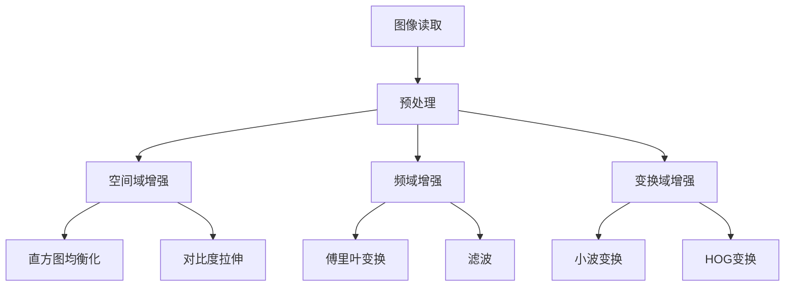

                 

## 1. 背景介绍

图像增强是计算机视觉领域中的一个重要分支，其核心目标是通过一系列的算法和技术手段，提高图像的视觉效果和实际应用价值。在实际应用中，图像增强技术被广泛应用于医疗图像分析、卫星图像处理、监控视频分析、机器视觉等多个领域。

OpenCV（Open Source Computer Vision Library）是一个开源的计算机视觉和机器学习软件库，由Intel开发并捐赠给了OSDN（Open Source Development Network）。它包含了大量的图像处理和计算机视觉算法，使得开发者可以轻松地实现图像增强、目标检测、图像识别等功能。

本文将重点探讨OpenCV中图像增强算法的原理、实现步骤和应用领域，帮助读者深入理解图像增强技术，并掌握其在实际项目中的应用方法。

## 2. 核心概念与联系

在深入探讨图像增强算法之前，我们需要了解一些核心概念和它们之间的关系。

### 2.1 图像增强的定义

图像增强是指通过一系列的算法和处理技术，改善图像的质量和视觉效果，使其更适合特定的应用场景。图像增强主要包括以下两个方面：

1. **质量增强**：提高图像的视觉效果，如对比度、亮度、清晰度等。
2. **内容增强**：突出图像中的重要特征或信息，如边缘、纹理等。

### 2.2 图像增强算法的分类

图像增强算法可以大致分为以下几类：

1. **空间域算法**：直接在图像像素的空间域中进行操作，如直方图均衡化、对比度拉伸等。
2. **频域算法**：将图像转换为频域，然后对频域进行操作，如傅里叶变换、滤波等。
3. **变换域算法**：通过将图像转换到其他变换域（如小波变换、HOG变换等），进行特征提取和增强。

### 2.3 OpenCV图像增强模块

OpenCV提供了丰富的图像增强算法，包括但不限于以下模块：

1. **核心算法**：如直方图均衡化、对比度拉伸、边缘检测等。
2. **高级算法**：如高斯模糊、中值滤波、非局部均值去噪等。
3. **机器学习算法**：如Adaboost分类器、支持向量机等，用于图像分类和目标检测。

### 2.4 Mermaid 流程图

下面是一个简单的Mermaid流程图，展示了图像增强算法的基本流程：



### 2.5 各算法的联系与比较

各种图像增强算法在应用场景、算法复杂度、增强效果等方面都有所不同。例如，直方图均衡化适用于对比度较低的图像，而高斯模糊适用于图像去噪。通过合理选择和组合这些算法，可以实现对图像的全方位增强。

## 3. 核心算法原理 & 具体操作步骤

### 3.1 算法原理概述

在OpenCV中，图像增强算法的实现主要涉及以下原理：

1. **空间域算法**：通过对图像像素进行直接操作，改变图像的亮度和对比度。例如，直方图均衡化和对比度拉伸。
2. **频域算法**：通过傅里叶变换将图像从空间域转换到频域，然后对频域进行滤波和变换，以实现图像增强。例如，高斯滤波和频域滤波。
3. **变换域算法**：通过小波变换、HOG变换等将图像转换到其他变换域，提取图像特征并进行增强。

### 3.2 算法步骤详解

以下是图像增强算法的基本步骤：

1. **图像读取**：使用OpenCV的`imread()`函数读取图像。
2. **预处理**：对图像进行必要的预处理，如去噪、边缘检测等，以提高后续增强算法的效果。
3. **空间域增强**：使用空间域算法直接对图像像素进行操作。例如，使用`cv2.equalizeHist()`进行直方图均衡化，使用`cv2.exposureCompensate()`进行对比度拉伸。
4. **频域增强**：使用频域算法对图像进行频域变换，然后进行滤波和反变换。例如，使用`cv2.dft()`进行傅里叶变换，使用`cv2.filter2D()`进行滤波，使用`cv2.idft()`进行反变换。
5. **变换域增强**：使用变换域算法将图像转换到其他变换域，提取图像特征并进行增强。例如，使用`cv2.dwt2()`进行小波变换，使用`cv2.idwt2()`进行反变换。

### 3.3 算法优缺点

各种图像增强算法都有其优缺点：

1. **空间域算法**：简单易实现，对图像质量的影响较为直接。缺点是增强效果有限，且可能引入噪声。
2. **频域算法**：能够实现更复杂的增强效果，但计算复杂度较高。
3. **变换域算法**：能够更好地提取图像特征，但实现相对复杂。

### 3.4 算法应用领域

图像增强算法在多个领域有广泛应用：

1. **医疗图像**：用于提高医学图像的对比度和清晰度，帮助医生进行诊断。
2. **卫星图像**：用于提高卫星图像的分辨率和清晰度，用于地理信息分析和环境监测。
3. **监控视频**：用于提高监控视频的清晰度和对比度，帮助提高监控效果。
4. **机器视觉**：用于提高图像识别和目标检测的准确性，提高机器视觉系统的性能。

## 4. 数学模型和公式 & 详细讲解 & 举例说明

### 4.1 数学模型构建

图像增强算法的数学模型通常涉及以下方面：

1. **空间域模型**：如直方图均衡化和对比度拉伸。
2. **频域模型**：如傅里叶变换和滤波。
3. **变换域模型**：如小波变换和HOG变换。

### 4.2 公式推导过程

以下是直方图均衡化的数学推导过程：

1. **原始直方图**：设原图像为$f(x)$，则其直方图为$H(f)$。
2. **累积分布函数（CDF）**：直方图的累积分布函数为$F(f)$。
3. **变换公式**：直方图均衡化后的图像值为$g(x)$，其变换公式为$g(x) = \frac{c \cdot (F(g) - F(f))}{F(g) - F(f)}$，其中$c$为常数。

### 4.3 案例分析与讲解

以下是一个简单的直方图均衡化案例：

```python
import cv2
import numpy as np

# 读取图像
img = cv2.imread("image.jpg", cv2.IMREAD_GRAYSCALE)

# 计算直方图
hist = cv2.calcHist([img], [0], None, [256], [0, 256])

# 计算累积分布函数
cumulative = hist.cumsum()
cumulative_normalized = cumulative / cumulative[-1]

# 直方图均衡化
img_eq = np.interp(img, np.arange(256), cumulative_normalized * 255).astype(np.uint8)

# 显示结果
cv2.imshow("Original Image", img)
cv2.imshow("Equalized Image", img_eq)
cv2.waitKey(0)
cv2.destroyAllWindows()
```

## 5. 项目实践：代码实例和详细解释说明

### 5.1 开发环境搭建

要使用OpenCV进行图像增强，您需要在本地环境中搭建Python开发环境，并安装OpenCV库。以下是具体的步骤：

1. **安装Python**：确保安装了Python 3.x版本。
2. **安装pip**：使用`pip install pip`命令安装pip。
3. **安装OpenCV**：使用`pip install opencv-python`命令安装OpenCV库。

### 5.2 源代码详细实现

以下是使用OpenCV实现图像增强的源代码：

```python
import cv2
import numpy as np

def enhance_image(image_path):
    # 读取图像
    img = cv2.imread(image_path, cv2.IMREAD_GRAYSCALE)

    # 直方图均衡化
    img_eq = cv2.equalizeHist(img)

    # 对比度拉伸
    img_exp = cv2.exposureCompensate(img, gain=2.0)

    # 高斯模糊
    img_gaussian = cv2.GaussianBlur(img, (5, 5), 0)

    # 中值滤波
    img_median = cv2.medianBlur(img, 5)

    # 显示结果
    cv2.imshow("Original Image", img)
    cv2.imshow("Equalized Image", img_eq)
    cv2.imshow("Exposure Compensated Image", img_exp)
    cv2.imshow("Gaussian Blurred Image", img_gaussian)
    cv2.imshow("Median Filtered Image", img_median)
    cv2.waitKey(0)
    cv2.destroyAllWindows()

# 测试代码
enhance_image("image.jpg")
```

### 5.3 代码解读与分析

上述代码首先导入必要的库，然后定义了一个名为`enhance_image`的函数，用于实现图像增强。函数中首先读取图像，然后依次使用直方图均衡化、对比度拉伸、高斯模糊和中值滤波等算法对图像进行增强。最后，通过`imshow`函数显示增强后的图像。

### 5.4 运行结果展示

运行上述代码后，将显示原始图像及其增强后的图像，如图像对比度提高、清晰度增强等。

## 6. 实际应用场景

图像增强技术在实际应用场景中具有广泛的应用，以下列举几个典型的应用领域：

1. **医疗影像分析**：图像增强技术可以帮助医生更好地识别病变区域，提高诊断准确率。例如，通过直方图均衡化提高X光片、CT和MRI图像的对比度。
2. **卫星图像处理**：图像增强技术可以改善卫星图像的分辨率和清晰度，帮助进行地理信息分析和环境监测。例如，通过频域滤波去除噪声，提高图像的细节表现。
3. **监控视频分析**：图像增强技术可以提高监控视频的清晰度和对比度，有助于提高监控效果。例如，通过直方图均衡化和对比度拉伸提高视频中的目标识别能力。
4. **机器视觉**：图像增强技术可以提升机器视觉系统的性能，提高图像识别和目标检测的准确性。例如，通过变换域算法提取图像特征，用于图像分类和目标检测。

## 7. 工具和资源推荐

为了更好地学习和应用图像增强技术，以下推荐一些工具和资源：

1. **学习资源推荐**：
   - 《数字图像处理》（冈萨雷斯）：这是一本经典的图像处理教材，详细介绍了图像增强的相关算法。
   - 《OpenCV官方文档》：OpenCV的官方文档包含了丰富的图像增强算法示例和详细说明。

2. **开发工具推荐**：
   - PyCharm：一款功能强大的Python集成开发环境，适用于图像增强项目的开发和调试。
   - Jupyter Notebook：一款流行的交互式开发环境，方便进行图像增强算法的演示和测试。

3. **相关论文推荐**：
   - "Image Enhancement Using Histogram Equalization"：一篇关于直方图均衡化的经典论文。
   - "Image Enhancement Using Frequency Domain Filtering"：一篇关于频域滤波的论文，介绍了多种频域滤波算法。

## 8. 总结：未来发展趋势与挑战

### 8.1 研究成果总结

随着深度学习、计算机视觉等领域的发展，图像增强技术也在不断进步。目前，基于深度学习的图像增强方法已经成为研究热点，如生成对抗网络（GAN）和卷积神经网络（CNN）在图像增强中的应用。这些方法可以自动学习图像特征，实现更高质量的图像增强效果。

### 8.2 未来发展趋势

未来，图像增强技术将继续朝着自动化、智能化和高效化的方向发展。以下是一些可能的发展趋势：

1. **自动化图像增强**：利用机器学习算法自动选择和组合图像增强算法，提高增强效果。
2. **实时图像增强**：开发实时图像增强算法，满足实时视频处理和监控应用的需求。
3. **跨模态图像增强**：结合多模态数据（如图像、音频、文本等），实现更全面的图像增强。

### 8.3 面临的挑战

尽管图像增强技术在不断发展，但仍面临一些挑战：

1. **计算复杂度**：一些先进的图像增强算法（如基于深度学习的算法）计算复杂度高，难以在实时应用中部署。
2. **增强效果评估**：如何客观评估图像增强效果，仍然是研究人员需要解决的问题。
3. **数据隐私和安全性**：在图像增强过程中，如何保护用户数据隐私和系统安全性，也是一个重要的挑战。

### 8.4 研究展望

未来，图像增强技术将在医疗、安防、自动驾驶等领域发挥更大的作用。同时，随着人工智能和大数据技术的发展，图像增强技术也将不断进步，为各行各业带来更多价值。

## 9. 附录：常见问题与解答

### Q1：什么是图像增强？
A1：图像增强是通过一系列的算法和技术手段，提高图像的视觉效果和实际应用价值，使其更适合特定的应用场景。

### Q2：图像增强有哪些分类？
A2：图像增强可以分为空间域算法、频域算法和变换域算法。

### Q3：OpenCV有哪些常用的图像增强算法？
A3：OpenCV提供了丰富的图像增强算法，包括直方图均衡化、对比度拉伸、高斯模糊、中值滤波等。

### Q4：如何使用OpenCV进行图像增强？
A4：使用OpenCV进行图像增强，首先需要导入必要的库，然后读取图像，选择适当的增强算法，最后显示增强后的图像。

### Q5：图像增强技术在哪些领域有应用？
A5：图像增强技术在医疗影像分析、卫星图像处理、监控视频分析和机器视觉等领域有广泛应用。

---

以上是关于OpenCV图像增强算法原理的详细探讨，希望对您有所帮助。如果您在学习和应用过程中有任何疑问，欢迎在评论区留言，我会尽力为您解答。感谢您的阅读！
----------------------------------------------------------------
作者：禅与计算机程序设计艺术 / Zen and the Art of Computer Programming

