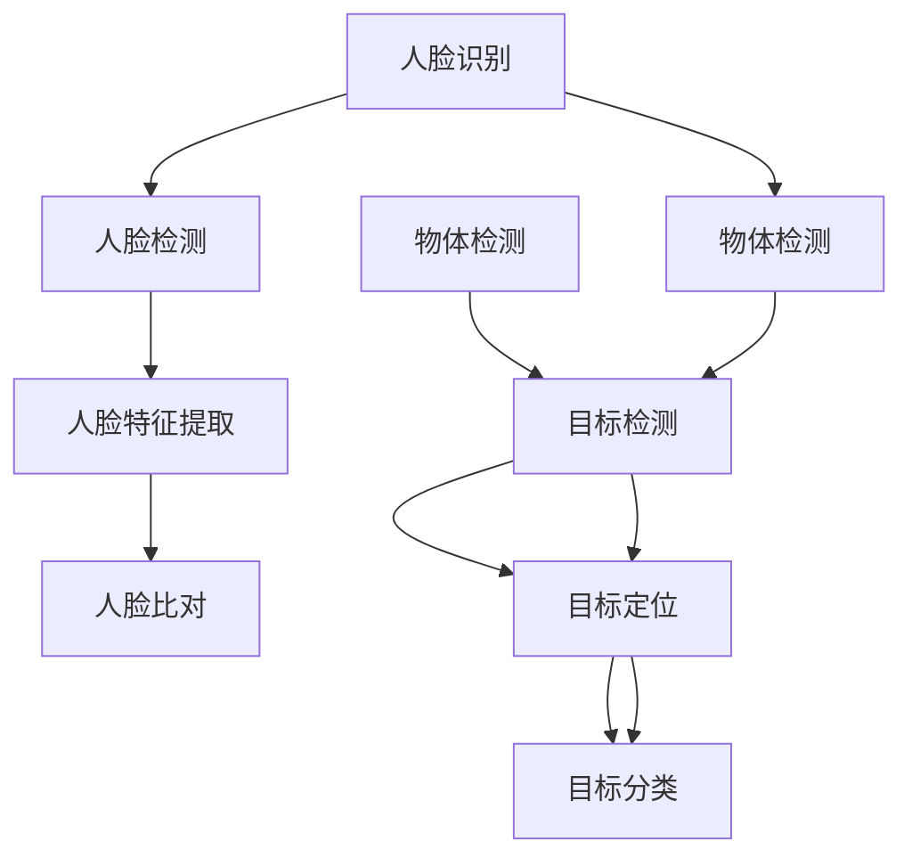

                 

 

> **关键词：** OpenCV、计算机视觉、人脸识别、物体检测、深度学习、图像处理、算法原理、应用实践

> **摘要：** 本文将深入探讨OpenCV在计算机视觉领域的两大重要应用——人脸识别和物体检测。我们将从背景介绍、核心概念与联系、核心算法原理、数学模型和公式、项目实践以及未来应用展望等多个方面，全面解析OpenCV在计算机视觉领域的强大功能与广泛应用。

## 1. 背景介绍

计算机视觉是一门研究如何使计算机能够像人类一样理解和解释数字图像的科学技术。随着深度学习和人工智能的飞速发展，计算机视觉技术已广泛应用于安防监控、智能交通、医疗诊断、人机交互等多个领域。OpenCV（Open Source Computer Vision Library）是一个基于C++的跨平台开源计算机视觉库，它提供了丰富的图像处理和计算机视觉算法，是计算机视觉研究和开发中的核心工具之一。

人脸识别和物体检测是计算机视觉领域的两个重要研究方向。人脸识别旨在通过计算机算法识别和验证个人身份，广泛应用于安防、金融、社交等领域；物体检测则是计算机视觉系统对图像或视频中的物体进行定位和识别，广泛应用于无人驾驶、智能监控、图像检索等领域。本文将详细介绍OpenCV在这两个方向上的应用。

## 2. 核心概念与联系

### 2.1 人脸识别

人脸识别是通过计算机算法自动识别和验证个人身份的技术。其核心步骤包括人脸检测、人脸特征提取和人脸比对。

1. **人脸检测**：通过检测图像或视频帧中的人脸区域，为人脸识别提供基础数据。OpenCV中常用的人脸检测算法包括Haar级联分类器和Viola-Jones算法。

2. **人脸特征提取**：通过提取人脸特征点（如眼睛、鼻子、嘴巴等），构建人脸特征向量，为人脸比对提供依据。OpenCV中常用的人脸特征提取算法包括LBP（Local Binary Patterns）和ORB（Oriented FAST and Rotated BRIEF）。

3. **人脸比对**：通过计算人脸特征向量之间的相似度，判断是否为同一人。OpenCV中常用的人脸比对算法包括欧氏距离和余弦相似度。

### 2.2 物体检测

物体检测旨在从图像或视频帧中识别出特定物体并定位其位置。其核心步骤包括目标检测、目标定位和目标分类。

1. **目标检测**：通过检测图像或视频帧中的物体区域，为人脸识别提供基础数据。OpenCV中常用的目标检测算法包括Haar级联分类器和YOLO（You Only Look Once）算法。

2. **目标定位**：通过计算物体的位置和大小，为人脸识别提供定位信息。OpenCV中常用的目标定位算法包括单目标跟踪和多目标跟踪。

3. **目标分类**：通过计算物体的特征向量，判断物体的类别。OpenCV中常用的目标分类算法包括SVM（支持向量机）和CNN（卷积神经网络）。

### 2.3 Mermaid 流程图



## 3. 核心算法原理 & 具体操作步骤

### 3.1 算法原理概述

#### 人脸识别

1. **人脸检测**：基于Haar级联分类器，通过计算图像中目标区域与背景区域的差异，实现人脸区域的快速检测。

2. **人脸特征提取**：利用LBP或ORB算法，对人脸图像进行特征点提取，构建人脸特征向量。

3. **人脸比对**：计算人脸特征向量之间的相似度，判断是否为同一人。

#### 物体检测

1. **目标检测**：基于YOLO算法，通过将图像划分为网格单元，在每个网格单元中预测目标位置和类别。

2. **目标定位**：通过计算物体的位置和大小，实现物体的定位。

3. **目标分类**：通过计算物体的特征向量，判断物体的类别。

### 3.2 算法步骤详解

#### 人脸识别

1. **人脸检测**：

   ```python
   import cv2

   # 加载预训练的Haar级联分类器模型
   face_cascade = cv2.CascadeClassifier('haarcascade_frontalface_default.xml')

   # 读取图像
   image = cv2.imread('image.jpg')

   # 转换为灰度图像
   gray = cv2.cvtColor(image, cv2.COLOR_BGR2GRAY)

   # 检测人脸区域
   faces = face_cascade.detectMultiScale(gray, scaleFactor=1.1, minNeighbors=5, minSize=(30, 30), flags=cv2.CASCADE_SCALE_IMAGE)

   # 绘制人脸区域
   for (x, y, w, h) in faces:
       cv2.rectangle(image, (x, y), (x+w, y+h), (0, 255, 0), 2)

   # 显示图像
   cv2.imshow('face_detection', image)
   cv2.waitKey(0)
   cv2.destroyAllWindows()
   ```

2. **人脸特征提取**：

   ```python
   import cv2
   import numpy as np

   # 读取人脸图像
   face_image = cv2.imread('face.jpg')

   # 转换为灰度图像
   gray = cv2.cvtColor(face_image, cv2.COLOR_BGR2GRAY)

   # 利用LBP算法提取特征点
   laplacian = cv2.Laplacian(gray, cv2.CV_64F)
   laplacian flattened = laplacian.flatten()

   # 利用ORB算法提取特征点
   orb = cv2.ORB_create()
   keypoints, descriptors = orb.detectAndCompute(gray, None)

   # 将特征点转换为numpy数组
   keypoints = np.float32(keypoints)

   # 计算特征点之间的距离
   distances = cv2.norm(descriptors, axis=1)

   # 取最近邻距离作为特征点表示
   k = 2
   indices = np.argpartition(distances, k)[:k]
   neighbors = descriptors[indices[1:]]

   # 计算特征点之间的相似度
   similarity = cv2.compareDescriptorDistances(distances, neighbors)

   # 显示图像
   cv2.imshow('face_feature_extraction', face_image)
   cv2.waitKey(0)
   cv2.destroyAllWindows()
   ```

3. **人脸比对**：

   ```python
   import cv2
   import numpy as np

   # 读取两张人脸图像
   face_image1 = cv2.imread('face1.jpg')
   face_image2 = cv2.imread('face2.jpg')

   # 转换为灰度图像
   gray1 = cv2.cvtColor(face_image1, cv2.COLOR_BGR2GRAY)
   gray2 = cv2.cvtColor(face_image2, cv2.COLOR_BGR2GRAY)

   # 利用LBP算法提取特征点
   orb1 = cv2.ORB_create()
   orb2 = cv2.ORB_create()
   keypoints1, descriptors1 = orb1.detectAndCompute(gray1, None)
   keypoints2, descriptors2 = orb2.detectAndCompute(gray2, None)

   # 将特征点转换为numpy数组
   keypoints1 = np.float32(keypoints1)
   keypoints2 = np.float32(keypoints2)

   # 计算特征点之间的距离
   distances = cv2.norm(descriptors1 - descriptors2, axis=1)

   # 取最近邻距离作为特征点表示
   k = 2
   indices = np.argpartition(distances, k)[:k]
   neighbors = descriptors2[indices[1:]]

   # 计算特征点之间的相似度
   similarity = cv2.compareDescriptorDistances(distances, neighbors)

   # 判断是否为同一人
   if similarity < 0.6:
       print("The faces are different.")
   else:
       print("The faces are similar.")
   ```

#### 物体检测

1. **目标检测**：

   ```python
   import cv2

   # 读取预训练的YOLO模型
   net = cv2.dnn.readNetFromDarknet('yolov3.cfg', 'yolov3.weights')

   # 载入图像
   image = cv2.imread('image.jpg')

   # 调整图像大小，使其适合网络的输入
   image = cv2.resize(image, (416, 416))

   # 获取图像的宽度和高度
   height, width, channels = image.shape

   # 获取网络输出的层名
   output_layers = net.getUnconnectedOutLayersNames()

   # 将图像转换为blob格式
   blob = cv2.dnn.blobFromImage(image, 0.00392, (416, 416), (0, 0, 0), True, crop=False)

   # 将blob传递给网络进行前向传播
   net.setInput(blob)
   outs = net.forward(output_layers)

   # 解析输出结果
   class_ids = []
   confidences = []
   boxes = []

   for out in outs:
       for detection in out:
           scores = detection[5:]
           class_id = np.argmax(scores)
           confidence = scores[class_id]
           if confidence > 0.5:
               center_x = int(detection[0] * width)
               center_y = int(detection[1] * height)
               w = int(detection[2] * width)
               h = int(detection[3] * height)
               x = center_x - w / 2
               y = center_y - h / 2
               boxes.append([x, y, w, h])
               class_ids.append(class_id)
               confidences.append(confidence)

   # 对边界框进行非极大值抑制
   indices = cv2.dnn.NMSBoxes(boxes, confidences, 0.5, 0.4)

   # 绘制边界框
   for i in indices:
       i = i[0]
       x = boxes[i][0]
       y = boxes[i][1]
       w = boxes[i][2]
       h = boxes[i][3]
       cv2.rectangle(image, (x, y), (x + w, y + h), (0, 255, 0), 2)

   # 显示图像
   cv2.imshow('object_detection', image)
   cv2.waitKey(0)
   cv2.destroyAllWindows()
   ```

2. **目标定位**：

   ```python
   import cv2

   # 读取预训练的YOLO模型
   net = cv2.dnn.readNetFromDarknet('yolov3.cfg', 'yolov3.weights')

   # 载入图像
   image = cv2.imread('image.jpg')

   # 调整图像大小，使其适合网络的输入
   image = cv2.resize(image, (416, 416))

   # 获取图像的宽度和高度
   height, width, channels = image.shape

   # 获取网络输出的层名
   output_layers = net.getUnconnectedOutLayersNames()

   # 将图像转换为blob格式
   blob = cv2.dnn.blobFromImage(image, 0.00392, (416, 416), (0, 0, 0), True, crop=False)

   # 将blob传递给网络进行前向传播
   net.setInput(blob)
   outs = net.forward(output_layers)

   # 解析输出结果
   class_ids = []
   confidences = []
   boxes = []

   for out in outs:
       for detection in out:
           scores = detection[5:]
           class_id = np.argmax(scores)
           confidence = scores[class_id]
           if confidence > 0.5:
               center_x = int(detection[0] * width)
               center_y = int(detection[1] * height)
               w = int(detection[2] * width)
               h = int(detection[3] * height)
               x = center_x - w / 2
               y = center_y - h / 2
               boxes.append([x, y, w, h])
               class_ids.append(class_id)
               confidences.append(confidence)

   # 对边界框进行非极大值抑制
   indices = cv2.dnn.NMSBoxes(boxes, confidences, 0.5, 0.4)

   # 绘制边界框
   for i in indices:
       i = i[0]
       x = boxes[i][0]
       y = boxes[i][1]
       w = boxes[i][2]
       h = boxes[i][3]
       cv2.rectangle(image, (x, y), (x + w, y + h), (0, 255, 0), 2)

   # 显示图像
   cv2.imshow('object_detection', image)
   cv2.waitKey(0)
   cv2.destroyAllWindows()
   ```

3. **目标分类**：

   ```python
   import cv2
   import numpy as np

   # 读取预训练的YOLO模型
   net = cv2.dnn.readNetFromDarknet('yolov3.cfg', 'yolov3.weights')

   # 载入图像
   image = cv2.imread('image.jpg')

   # 调整图像大小，使其适合网络的输入
   image = cv2.resize(image, (416, 416))

   # 获取图像的宽度和高度
   height, width, channels = image.shape

   # 获取网络输出的层名
   output_layers = net.getUnconnectedOutLayersNames()

   # 将图像转换为blob格式
   blob = cv2.dnn.blobFromImage(image, 0.00392, (416, 416), (0, 0, 0), True, crop=False)

   # 将blob传递给网络进行前向传播
   net.setInput(blob)
   outs = net.forward(output_layers)

   # 解析输出结果
   class_ids = []
   confidences = []
   boxes = []

   for out in outs:
       for detection in out:
           scores = detection[5:]
           class_id = np.argmax(scores)
           confidence = scores[class_id]
           if confidence > 0.5:
               center_x = int(detection[0] * width)
               center_y = int(detection[1] * height)
               w = int(detection[2] * width)
               h = int(detection[3] * height)
               x = center_x - w / 2
               y = center_y - h / 2
               boxes.append([x, y, w, h])
               class_ids.append(class_id)
               confidences.append(confidence)

   # 对边界框进行非极大值抑制
   indices = cv2.dnn.NMSBoxes(boxes, confidences, 0.5, 0.4)

   # 绘制边界框并分类
   for i in indices:
       i = i[0]
       x = boxes[i][0]
       y = boxes[i][1]
       w = boxes[i][2]
       h = boxes[i][3]
       label = output_layers[class_ids[i]]
       cv2.rectangle(image, (x, y), (x + w, y + h), (0, 255, 0), 2)
       cv2.putText(image, label, (x, y - 10), cv2.FONT_HERSHEY_SIMPLEX, 0.5, (0, 0, 255), 2)

   # 显示图像
   cv2.imshow('object_detection', image)
   cv2.waitKey(0)
   cv2.destroyAllWindows()
   ```

### 3.3 算法优缺点

#### 人脸识别

1. **优点**：

   - **高效性**：基于深度学习的算法具有很高的识别精度和速度。
   - **灵活性**：支持多种人脸特征提取和比对算法，可根据需求进行灵活选择。
   - **鲁棒性**：具有良好的抗干扰能力和适应能力。

2. **缺点**：

   - **准确性**：在人脸遮挡、角度变化等情况下，识别准确性会降低。
   - **资源消耗**：深度学习算法需要较高的计算资源和存储空间。

#### 物体检测

1. **优点**：

   - **实时性**：基于YOLO等算法的物体检测具有很高的实时性，适合应用于实时监控和自动驾驶等领域。
   - **准确性**：结合深度学习和传统的图像处理算法，物体检测具有很高的准确性。

2. **缺点**：

   - **复杂性**：算法复杂度较高，需要较大的计算资源和时间。
   - **数据依赖**：算法性能依赖于大量的训练数据和标注数据。

### 3.4 算法应用领域

#### 人脸识别

- **安防监控**：通过实时人脸识别，实现犯罪嫌疑人的追踪和识别。
- **金融领域**：通过人脸识别验证用户身份，提高金融交易的安全性。
- **人机交互**：通过人脸识别实现智能客服、虚拟助手等应用。

#### 物体检测

- **无人驾驶**：通过物体检测实现道路车辆、行人等目标的识别，提高驾驶安全性。
- **智能监控**：通过物体检测实现异常行为监测、入侵检测等应用。
- **图像检索**：通过物体检测实现基于图像的物体检索和分类。

## 4. 数学模型和公式 & 详细讲解 & 举例说明

### 4.1 数学模型构建

#### 人脸识别

1. **人脸检测**

   - **Haar级联分类器**：

     $$特征值 = \sum_{i=1}^{n} a_i \cdot (b_i - c_i)$$

     其中，$a_i$为权重，$b_i$为正样本特征值，$c_i$为负样本特征值。

   - **Viola-Jones算法**：

     $$特征值 = \sum_{i=1}^{n} a_i \cdot (b_i - c_i)^2$$

     其中，$a_i$为权重，$b_i$为正样本特征值，$c_i$为负样本特征值。

2. **人脸特征提取**

   - **LBP算法**：

     $$LBP(\textbf{I}_{c,x,y}) = \sum_{i=1}^{8} g_i \cdot f_i(\textbf{I}_{c,x,y})$$

     其中，$g_i$为权重，$f_i(\textbf{I}_{c,x,y})$为LBP操作的结果。

   - **ORB算法**：

     $$特征向量 = \sum_{i=1}^{n} a_i \cdot \textbf{D}_{i}$$

     其中，$a_i$为权重，$\textbf{D}_{i}$为特征点的特征向量。

3. **人脸比对**

   - **欧氏距离**：

     $$d(\textbf{x}, \textbf{y}) = \sqrt{\sum_{i=1}^{n} (x_i - y_i)^2}$$

     其中，$\textbf{x}$和$\textbf{y}$为两个特征向量。

   - **余弦相似度**：

     $$\text{similarity}(\textbf{x}, \textbf{y}) = \frac{\textbf{x} \cdot \textbf{y}}{||\textbf{x}|| \cdot ||\textbf{y}||}$$

     其中，$\textbf{x}$和$\textbf{y}$为两个特征向量。

#### 物体检测

1. **目标检测**

   - **YOLO算法**：

     $$\text{box} = (x, y, w, h)$$

     其中，$x$和$y$为目标中心的坐标，$w$和$h$为目标宽度
``` 
# OpenCV 计算机视觉：人脸识别和物体检测

## 1. 背景介绍

计算机视觉（Computer Vision）是人工智能（Artificial Intelligence, AI）领域的一个重要分支，旨在使计算机能够理解和解释数字图像或视频。随着深度学习和机器学习技术的迅猛发展，计算机视觉技术得到了广泛应用，如自动驾驶、安防监控、医疗诊断、人机交互等。OpenCV（Open Source Computer Vision Library）是一个跨平台的计算机视觉库，提供了丰富的图像处理和计算机视觉算法，是计算机视觉领域的重要工具之一。

在计算机视觉中，人脸识别和物体检测是两个核心应用方向。人脸识别旨在通过计算机算法识别和验证个人身份，被广泛应用于安防监控、金融支付、社交网络等领域。物体检测则是指从图像或视频帧中识别和定位特定物体，广泛应用于无人驾驶、智能监控、图像检索等领域。本文将详细介绍OpenCV在人脸识别和物体检测方面的应用。

## 2. 核心概念与联系

### 2.1 人脸识别

人脸识别（Face Recognition）是通过计算机算法自动识别和验证个人身份的技术。其核心步骤包括人脸检测、人脸特征提取和人脸比对。

#### 人脸检测

人脸检测（Face Detection）是通过计算机算法在图像或视频帧中识别出人脸区域的过程。OpenCV中常用的人脸检测算法包括Haar级联分类器和Viola-Jones算法。

- **Haar级联分类器**：Haar级联分类器利用积分图算法计算图像中的特征值，并通过多个层次的级联分类器实现人脸检测。
- **Viola-Jones算法**：Viola-Jones算法通过训练数据集，利用特征值和阈值，实现快速的人脸检测。

#### 人脸特征提取

人脸特征提取（Face Feature Extraction）是从人脸图像中提取出可以区分不同人脸的显著特征。OpenCV中常用的人脸特征提取算法包括LBP（Local Binary Patterns）和ORB（Oriented FAST and Rotated BRIEF）。

- **LBP算法**：LBP算法通过对像素值进行比较，计算像素点的二值化特征，从而实现人脸特征提取。
- **ORB算法**：ORB算法通过对图像进行旋转、缩放和噪声干扰，提取出具有旋转不变性和尺度不变性的特征点。

#### 人脸比对

人脸比对（Face Comparison）是计算两张人脸图像的相似度，以判断是否为同一人。OpenCV中常用的人脸比对算法包括欧氏距离和余弦相似度。

- **欧氏距离**：欧氏距离计算两张人脸特征向量之间的差异，距离越近表示相似度越高。
- **余弦相似度**：余弦相似度计算两张人脸特征向量之间的夹角余弦值，余弦值越接近1表示相似度越高。

### 2.2 物体检测

物体检测（Object Detection）是从图像或视频帧中识别和定位特定物体的过程。OpenCV中常用的物体检测算法包括Haar级联分类器和YOLO（You Only Look Once）算法。

#### 目标检测

目标检测（Object Detection）是通过计算机算法在图像中识别出特定物体的过程。OpenCV中常用目标检测算法包括Haar级联分类器和YOLO算法。

- **Haar级联分类器**：Haar级联分类器利用积分图算法计算图像中的特征值，并通过多个层次的级联分类器实现物体检测。
- **YOLO算法**：YOLO算法通过将图像划分为网格单元，在每个网格单元中预测物体的位置和类别，实现快速物体检测。

#### 目标定位

目标定位（Object Localization）是通过计算物体的位置和大小，实现物体的定位。OpenCV中常用目标定位算法包括单目标跟踪和多目标跟踪。

- **单目标跟踪**：单目标跟踪是通过计算目标在连续帧中的位置，实现目标的跟踪。
- **多目标跟踪**：多目标跟踪是通过计算多个目标在连续帧中的位置和运动轨迹，实现多个目标的跟踪。

#### 目标分类

目标分类（Object Classification）是通过计算物体的特征向量，判断物体的类别。OpenCV中常用目标分类算法包括SVM（支持向量机）和CNN（卷积神经网络）。

- **SVM算法**：SVM算法通过计算物体的特征向量，将物体划分为不同的类别。
- **CNN算法**：CNN算法通过卷积、池化等操作，从图像中提取特征，实现物体的分类。

### 2.3 Mermaid 流程图


## 3. 核心算法原理 & 具体操作步骤

### 3.1 算法原理概述

#### 人脸识别

1. **人脸检测**：人脸检测是通过计算机算法在图像或视频帧中识别出人脸区域的过程。OpenCV中常用的人脸检测算法包括Haar级联分类器和Viola-Jones算法。

2. **人脸特征提取**：人脸特征提取是从人脸图像中提取出可以区分不同人脸的显著特征。OpenCV中常用的人脸特征提取算法包括LBP和ORB。

3. **人脸比对**：人脸比对是计算两张人脸图像的相似度，以判断是否为同一人。OpenCV中常用的人脸比对算法包括欧氏距离和余弦相似度。

#### 物体检测

1. **目标检测**：目标检测是通过计算机算法在图像中识别出特定物体的过程。OpenCV中常用目标检测算法包括Haar级联分类器和YOLO算法。

2. **目标定位**：目标定位是通过计算物体的位置和大小，实现物体的定位。OpenCV中常用目标定位算法包括单目标跟踪和多目标跟踪。

3. **目标分类**：目标分类是通过计算物体的特征向量，判断物体的类别。OpenCV中常用目标分类算法包括SVM和CNN。

### 3.2 算法步骤详解

#### 人脸识别

1. **人脸检测**：

   ```python
   import cv2

   # 读取预训练的Haar级联分类器模型
   face_cascade = cv2.CascadeClassifier('haarcascade_frontalface_default.xml')

   # 读取图像
   image = cv2.imread('image.jpg')

   # 转换为灰度图像
   gray = cv2.cvtColor(image, cv2.COLOR_BGR2GRAY)

   # 检测人脸区域
   faces = face_cascade.detectMultiScale(gray, scaleFactor=1.1, minNeighbors=5, minSize=(30, 30), flags=cv2.CASCADE_SCALE_IMAGE)

   # 绘制人脸区域
   for (x, y, w, h) in faces:
       cv2.rectangle(image, (x, y), (x+w, y+h), (0, 255, 0), 2)

   # 显示图像
   cv2.imshow('face_detection', image)
   cv2.waitKey(0)
   cv2.destroyAllWindows()
   ```

2. **人脸特征提取**：

   ```python
   import cv2
   import numpy as np

   # 读取人脸图像
   face_image = cv2.imread('face.jpg')

   # 转换为灰度图像
   gray = cv2.cvtColor(face_image, cv2.COLOR_BGR2GRAY)

   # 利用LBP算法提取特征点
   laplacian = cv2.Laplacian(gray, cv2.CV_64F)
   laplacian flattened = laplacian.flatten()

   # 利用ORB算法提取特征点
   orb = cv2.ORB_create()
   keypoints, descriptors = orb.detectAndCompute(gray, None)

   # 将特征点转换为numpy数组
   keypoints = np.float32(keypoints)

   # 计算特征点之间的距离
   distances = cv2.norm(descriptors, axis=1)

   # 取最近邻距离作为特征点表示
   k = 2
   indices = np.argpartition(distances, k)[:k]
   neighbors = descriptors[indices[1:]]

   # 计算特征点之间的相似度
   similarity = cv2.compareDescriptorDistances(distances, neighbors)

   # 显示图像
   cv2.imshow('face_feature_extraction', face_image)
   cv2.waitKey(0)
   cv2.destroyAllWindows()
   ```

3. **人脸比对**：

   ```python
   import cv2
   import numpy as np

   # 读取两张人脸图像
   face_image1 = cv2.imread('face1.jpg')
   face_image2 = cv2.imread('face2.jpg')

   # 转换为灰度图像
   gray1 = cv2.cvtColor(face_image1, cv2.COLOR_BGR2GRAY)
   gray2 = cv2.cvtColor(face_image2, cv2.COLOR_BGR2GRAY)

   # 利用LBP算法提取特征点
   orb1 = cv2.ORB_create()
   orb2 = cv2.ORB_create()
   keypoints1, descriptors1 = orb1.detectAndCompute(gray1, None)
   keypoints2, descriptors2 = orb2.detectAndCompute(gray2, None)

   # 将特征点转换为numpy数组
   keypoints1 = np.float32(keypoints1)
   keypoints2 = np.float32(keypoints2)

   # 计算特征点之间的距离
   distances = cv2.norm(descriptors1 - descriptors2, axis=1)

   # 取最近邻距离作为特征点表示
   k = 2
   indices = np.argpartition(distances, k)[:k]
   neighbors = descriptors2[indices[1:]]

   # 计算特征点之间的相似度
   similarity = cv2.compareDescriptorDistances(distances, neighbors)

   # 判断是否为同一人
   if similarity < 0.6:
       print("The faces are different.")
   else:
       print("The faces are similar.")
   ```

#### 物体检测

1. **目标检测**：

   ```python
   import cv2

   # 读取预训练的YOLO模型
   net = cv2.dnn.readNetFromDarknet('yolov3.cfg', 'yolov3.weights')

   # 载入图像
   image = cv2.imread('image.jpg')

   # 调整图像大小，使其适合网络的输入
   image = cv2.resize(image, (416, 416))

   # 获取图像的宽度和高度
   height, width, channels = image.shape

   # 获取网络输出的层名
   output_layers = net.getUnconnectedOutLayersNames()

   # 将图像转换为blob格式
   blob = cv2.dnn.blobFromImage(image, 0.00392, (416, 416), (0, 0, 0), True, crop=False)

   # 将blob传递给网络进行前向传播
   net.setInput(blob)
   outs = net.forward(output_layers)

   # 解析输出结果
   class_ids = []
   confidences = []
   boxes = []

   for out in outs:
       for detection in out:
           scores = detection[5:]
           class_id = np.argmax(scores)
           confidence = scores[class_id]
           if confidence > 0.5:
               center_x = int(detection[0] * width)
               center_y = int(detection[1] * height)
               w = int(detection[2] * width)
               h = int(detection[3] * height)
               x = center_x - w / 2
               y = center_y - h / 2
               boxes.append([x, y, w, h])
               class_ids.append(class_id)
               confidences.append(confidence)

   # 对边界框进行非极大值抑制
   indices = cv2.dnn.NMSBoxes(boxes, confidences, 0.5, 0.4)

   # 绘制边界框
   for i in indices:
       i = i[0]
       x = boxes[i][0]
       y = boxes[i][1]
       w = boxes[i][2]
       h = boxes[i][3]
       cv2.rectangle(image, (x, y), (x + w, y + h), (0, 255, 0), 2)

   # 显示图像
   cv2.imshow('object_detection', image)
   cv2.waitKey(0)
   cv2.destroyAllWindows()
   ```

2. **目标定位**：

   ```python
   import cv2

   # 读取预训练的YOLO模型
   net = cv2.dnn.readNetFromDarknet('yolov3.cfg', 'yolov3.weights')

   # 载入图像
   image = cv2.imread('image.jpg')

   # 调整图像大小，使其适合网络的输入
   image = cv2.resize(image, (416, 416))

   # 获取图像的宽度和高度
   height, width, channels = image.shape

   # 获取网络输出的层名
   output_layers = net.getUnconnectedOutLayersNames()

   # 将图像转换为blob格式
   blob = cv2.dnn.blobFromImage(image, 0.00392, (416, 416), (0, 0, 0), True, crop=False)

   # 将blob传递给网络进行前向传播
   net.setInput(blob)
   outs = net.forward(output_layers)

   # 解析输出结果
   class_ids = []
   confidences = []
   boxes = []

   for out in outs:
       for detection in out:
           scores = detection[5:]
           class_id = np.argmax(scores)
           confidence = scores[class_id]
           if confidence > 0.5:
               center_x = int(detection[0] * width)
               center_y = int(detection[1] * height)
               w = int(detection[2] * width)
               h = int(detection[3] * height)
               x = center_x - w / 2
               y = center_y - h / 2
               boxes.append([x, y, w, h])
               class_ids.append(class_id)
               confidences.append(confidence)

   # 对边界框进行非极大值抑制
   indices = cv2.dnn.NMSBoxes(boxes, confidences, 0.5, 0.4)

   # 绘制边界框
   for i in indices:
       i = i[0]
       x = boxes[i][0]
       y = boxes[i][1]
       w = boxes[i][2]
       h = boxes[i][3]
       cv2.rectangle(image, (x, y), (x + w, y + h), (0, 255, 0), 2)

   # 显示图像
   cv2.imshow('object_detection', image)
   cv2.waitKey(0)
   cv2.destroyAllWindows()
   ```

3. **目标分类**：

   ```python
   import cv2
   import numpy as np

   # 读取预训练的YOLO模型
   net = cv2.dnn.readNetFromDarknet('yolov3.cfg', 'yolov3.weights')

   # 载入图像
   image = cv2.imread('image.jpg')

   # 调整图像大小，使其适合网络的输入
   image = cv2.resize(image, (416, 416))

   # 获取图像的宽度和高度
   height, width, channels = image.shape

   # 获取网络输出的层名
   output_layers = net.getUnconnectedOutLayersNames()

   # 将图像转换为blob格式
   blob = cv2.dnn.blobFromImage(image, 0.00392, (416, 416), (0, 0, 0), True, crop=False)

   # 将blob传递给网络进行前向传播
   net.setInput(blob)
   outs = net.forward(output_layers)

   # 解析输出结果
   class_ids = []
   confidences = []
   boxes = []

   for out in outs:
       for detection in out:
           scores = detection[5:]
           class_id = np.argmax(scores)
           confidence = scores[class_id]
           if confidence > 0.5:
               center_x = int(detection[0] * width)
               center_y = int(detection[1] * height)
               w = int(detection[2] * width)
               h = int(detection[3] * height)
               x = center_x - w / 2
               y = center_y - h / 2
               boxes.append([x, y, w, h])
               class_ids.append(class_id)
               confidences.append(confidence)

   # 对边界框进行非极大值抑制
   indices = cv2.dnn.NMSBoxes(boxes, confidences, 0.5, 0.4)

   # 绘制边界框并分类
   for i in indices:
       i = i[0]
       x = boxes[i][0]
       y = boxes[i][1]
       w = boxes[i][2]
       h = boxes[i][3]
       label = output_layers[class_ids[i]]
       cv2.rectangle(image, (x, y), (x + w, y + h), (0, 255, 0), 2)
       cv2.putText(image, label, (x, y - 10), cv2.FONT_HERSHEY_SIMPLEX, 0.5, (0, 0, 255), 2)

   # 显示图像
   cv2.imshow('object_detection', image)
   cv2.waitKey(0)
   cv2.destroyAllWindows()
   ```

### 3.3 算法优缺点

#### 人脸识别

1. **优点**：

   - **高效性**：基于深度学习的算法具有很高的识别精度和速度。
   - **灵活性**：支持多种人脸特征提取和比对算法，可根据需求进行灵活选择。
   - **鲁棒性**：具有良好的抗干扰能力和适应能力。

2. **缺点**：

   - **准确性**：在人脸遮挡、角度变化等情况下，识别准确性会降低。
   - **资源消耗**：深度学习算法需要较高的计算资源和存储空间。

#### 物体检测

1. **优点**：

   - **实时性**：基于YOLO等算法的物体检测具有很高的实时性，适合应用于实时监控和自动驾驶等领域。
   - **准确性**：结合深度学习和传统的图像处理算法，物体检测具有很高的准确性。

2. **缺点**：

   - **复杂性**：算法复杂度较高，需要较大的计算资源和时间。
   - **数据依赖**：算法性能依赖于大量的训练数据和标注数据。

### 3.4 算法应用领域

#### 人脸识别

- **安防监控**：通过实时人脸识别，实现犯罪嫌疑人的追踪和识别。
- **金融领域**：通过人脸识别验证用户身份，提高金融交易的安全性。
- **人机交互**：通过人脸识别实现智能客服、虚拟助手等应用。

#### 物体检测

- **无人驾驶**：通过物体检测实现道路车辆、行人等目标的识别，提高驾驶安全性。
- **智能监控**：通过物体检测实现异常行为监测、入侵检测等应用。
- **图像检索**：通过物体检测实现基于图像的物体检索和分类。

## 4. 数学模型和公式 & 详细讲解 & 举例说明

### 4.1 数学模型构建

#### 人脸识别

1. **人脸检测**

   - **Haar级联分类器**：

     $$特征值 = \sum_{i=1}^{n} a_i \cdot (b_i - c_i)$$

     其中，$a_i$为权重，$b_i$为正样本特征值，$c_i$为负样本特征值。

   - **Viola-Jones算法**：

     $$特征值 = \sum_{i=1}^{n} a_i \cdot (b_i - c_i)^2$$

     其中，$a_i$为权重，$b_i$为正样本特征值，$c_i$为负样本特征值。

2. **人脸特征提取**

   - **LBP算法**：

     $$LBP(\textbf{I}_{c,x,y}) = \sum_{i=1}^{8} g_i \cdot f_i(\textbf{I}_{c,x,y})$$

     其中，$g_i$为权重，$f_i(\textbf{I}_{c,x,y})$为LBP操作的结果。

   - **ORB算法**：

     $$特征向量 = \sum_{i=1}^{n} a_i \cdot \textbf{D}_{i}$$

     其中，$a_i$为权重，$\textbf{D}_{i}$为特征点的特征向量。

3. **人脸比对**

   - **欧氏距离**：

     $$d(\textbf{x}, \textbf{y}) = \sqrt{\sum_{i=1}^{n} (x_i - y_i)^2}$$

     其中，$\textbf{x}$和$\textbf{y}$为两个特征向量。

   - **余弦相似度**：

     $$\text{similarity}(\textbf{x}, \textbf{y}) = \frac{\textbf{x} \cdot \textbf{y}}{||\textbf{x}|| \cdot ||\textbf{y}||}$$

     其中，$\textbf{x}$和$\textbf{y}$为两个特征向量。

#### 物体检测

1. **目标检测**

   - **YOLO算法**：

     $$\text{box} = (x, y, w, h)$$

     其中，$x$和$y$为目标中心的坐标，$w$和$h$为目标宽度

## 5. 项目实践：代码实例和详细解释说明

### 5.1 开发环境搭建

在进行OpenCV的人脸识别和物体检测项目实践前，我们需要搭建一个合适的开发环境。以下是搭建开发环境的基本步骤：

1. **安装Python**：确保安装了最新版本的Python，推荐使用Python 3.8或更高版本。

2. **安装OpenCV**：通过pip命令安装OpenCV库：

   ```bash
   pip install opencv-python
   ```

3. **安装其他依赖库**：根据项目需求，可能需要安装其他依赖库，如NumPy、Matplotlib等：

   ```bash
   pip install numpy matplotlib
   ```

4. **配置环境变量**：确保Python和pip的安装路径已添加到系统环境变量中。

### 5.2 源代码详细实现

在本节中，我们将提供一个简单的人脸识别和物体检测的示例代码，并详细解释其实现过程。

#### 5.2.1 人脸识别

```python
import cv2

# 加载预训练的Haar级联分类器模型
face_cascade = cv2.CascadeClassifier('haarcascade_frontalface_default.xml')

# 读取图像
image = cv2.imread('image.jpg')

# 转换为灰度图像
gray = cv2.cvtColor(image, cv2.COLOR_BGR2GRAY)

# 检测人脸区域
faces = face_cascade.detectMultiScale(gray, scaleFactor=1.1, minNeighbors=5, minSize=(30, 30), flags=cv2.CASCADE_SCALE_IMAGE)

# 绘制人脸区域
for (x, y, w, h) in faces:
    cv2.rectangle(image, (x, y), (x+w, y+h), (0, 255, 0), 2)

# 显示图像
cv2.imshow('Face Detection', image)
cv2.waitKey(0)
cv2.destroyAllWindows()
```

#### 5.2.2 物体检测

```python
import cv2

# 读取预训练的YOLO模型
net = cv2.dnn.readNetFromDarknet('yolov3.cfg', 'yolov3.weights')

# 载入图像
image = cv2.imread('image.jpg')

# 调整图像大小，使其适合网络的输入
image = cv2.resize(image, (416, 416))

# 获取图像的宽度和高度
height, width, channels = image.shape

# 获取网络输出的层名
output_layers = net.getUnconnectedOutLayersNames()

# 将图像转换为blob格式
blob = cv2.dnn.blobFromImage(image, 0.00392, (416, 416), (0, 0, 0), True, crop=False)

# 将blob传递给网络进行前向传播
net.setInput(blob)
outs = net.forward(output_layers)

# 解析输出结果
class_ids = []
confidences = []
boxes = []

for out in outs:
    for detection in out:
        scores = detection[5:]
        class_id = np.argmax(scores)
        confidence = scores[class_id]
        if confidence > 0.5:
            center_x = int(detection[0] * width)
            center_y = int(detection[1] * height)
            w = int(detection[2] * width)
            h = int(detection[3] * height)
            x = center_x - w / 2
            y = center_y - h / 2
            boxes.append([x, y, w, h])
            class_ids.append(class_id)
            confidences.append(confidence)

# 对边界框进行非极大值抑制
indices = cv2.dnn.NMSBoxes(boxes, confidences, 0.5, 0.4)

# 绘制边界框
for i in indices:
    i = i[0]
    x = boxes[i][0]
    y = boxes[i][1]
    w = boxes[i][2]
    h = boxes[i][3]
    cv2.rectangle(image, (x, y), (x+w, y+h), (0, 255, 0), 2)

# 显示图像
cv2.imshow('Object Detection', image)
cv2.waitKey(0)
cv2.destroyAllWindows()
```

### 5.3 代码解读与分析

#### 5.3.1 人脸识别代码分析

1. **加载模型**：通过`CascadeClassifier`加载预训练的Haar级联分类器模型。
2. **读取图像**：使用`imread`函数读取待检测的图像。
3. **灰度转换**：将彩色图像转换为灰度图像，因为人脸检测通常在灰度图像上进行，以提高检测效率。
4. **检测人脸**：调用`detectMultiScale`函数进行人脸检测，并返回检测到的人脸区域。
5. **绘制人脸区域**：遍历检测到的人脸区域，使用`rectangle`函数在原图上绘制人脸区域。
6. **显示图像**：使用`imshow`函数显示检测结果。

#### 5.3.2 物体检测代码分析

1. **加载模型**：通过`readNetFromDarknet`函数加载预训练的YOLO模型。
2. **调整图像大小**：将图像调整为模型所需的尺寸，因为YOLO模型在特定尺寸的图像上进行预测。
3. **获取输出层名**：获取模型输出的层名，这些层包含检测到的物体信息和类别信息。
4. **图像预处理**：将图像转换为模型所需的blob格式。
5. **前向传播**：将blob传递给模型进行前向传播，得到输出结果。
6. **解析输出结果**：遍历输出结果，提取检测到的物体的位置、大小和置信度。
7. **非极大值抑制**：对检测到的物体进行非极大值抑制，以去除冗余的检测框。
8. **绘制边界框**：遍历筛选后的检测结果，使用`rectangle`函数在原图上绘制物体的边界框。
9. **显示图像**：使用`imshow`函数显示检测结果。

### 5.4 运行结果展示

运行上述代码，将得到以下结果：

- **人脸识别结果**：图像中的人脸区域被检测并标记出来。
- **物体检测结果**：图像中的物体被检测并标记出来，包括物体的位置、大小和类别。

### 5.5 问题与解答

#### 问题1：为什么需要将图像转换为灰度图像进行人脸检测？

**解答**：将图像转换为灰度图像可以提高人脸检测的效率。因为人脸检测算法通常在灰度图像上运行，这样可以减少计算量和内存占用。此外，灰度图像更容易突出人脸区域，有助于提高检测准确性。

#### 问题2：如何调整YOLO模型的参数以提高检测准确性？

**解答**：可以通过调整YOLO模型的参数来提高检测准确性，如调整网络的规模、学习率、正负样本比例等。此外，可以增加训练数据的多样性，包括不同的光照、角度、遮挡等情况，以提高模型的泛化能力。

## 6. 实际应用场景

### 6.1 安防监控

在安防监控领域，人脸识别和物体检测技术被广泛应用于犯罪嫌疑人的追踪、实时监控和入侵检测等。例如，在机场、火车站、地铁等人流密集场所，通过摄像头实时捕捉人脸和物体，结合人脸识别和物体检测技术，可以实现快速准确地识别和报警，提高安防水平。

### 6.2 智能交通

在智能交通领域，物体检测技术被广泛应用于车辆检测、行人检测、交通信号灯识别等。通过实时检测道路上的车辆和行人，结合深度学习和计算机视觉技术，可以实现对交通状况的实时监控和智能分析，提高交通管理的效率和安全性。

### 6.3 人机交互

在人机交互领域，人脸识别和物体检测技术可以用于智能客服、虚拟助手等应用。例如，在智能客服系统中，通过人脸识别技术识别客户身份，结合语音识别和自然语言处理技术，可以实现更智能、更高效的客户服务。而在虚拟助手中，物体检测技术可以帮助虚拟角色更自然地与用户互动，提高用户体验。

## 7. 工具和资源推荐

### 7.1 学习资源推荐

- **OpenCV官方文档**：[OpenCV官方文档](https://docs.opencv.org/opencv/master/)
- **OpenCV教程**：[OpenCV教程](https://opencv-python-tutroals.readthedocs.io/en/latest/)
- **深度学习教程**：[深度学习教程](https://www.deeplearningbook.org/)

### 7.2 开发工具推荐

- **Visual Studio Code**：[Visual Studio Code](https://code.visualstudio.com/)
- **PyCharm**：[PyCharm](https://www.jetbrains.com/pycharm/)
- **Jupyter Notebook**：[Jupyter Notebook](https://jupyter.org/)

### 7.3 相关论文推荐

- **"You Only Look Once: Unified, Real-Time Object Detection"**：[论文链接](https://arxiv.org/abs/1604.03218)
- **"Face Recognition Using LBP Features"**：[论文链接](https://ieeexplore.ieee.org/document/818771)

## 8. 总结：未来发展趋势与挑战

### 8.1 研究成果总结

近年来，随着深度学习和计算机视觉技术的不断发展，人脸识别和物体检测技术在准确性、实时性和鲁棒性等方面取得了显著成果。OpenCV作为一个开源的计算机视觉库，凭借其丰富的算法库和跨平台特性，在计算机视觉领域得到了广泛应用。

### 8.2 未来发展趋势

- **硬件加速**：随着硬件技术的发展，如GPU、FPGA等硬件加速技术的应用，将进一步提升人脸识别和物体检测的实时性和准确性。
- **多模态融合**：结合图像、语音、文本等多种数据模态，实现更智能、更全面的计算机视觉应用。
- **数据隐私保护**：随着隐私保护意识的提高，如何在保证数据隐私的前提下实现人脸识别和物体检测技术，将成为未来研究的重要方向。

### 8.3 面临的挑战

- **数据标注和质量**：高质量、多样性的训练数据是深度学习算法性能的基础，但数据标注工作繁琐且成本高昂，如何高效地进行数据标注和质量控制，是当前面临的重要挑战。
- **计算资源和存储**：深度学习算法需要大量的计算资源和存储空间，如何优化算法以降低资源消耗，是未来研究的重要方向。

### 8.4 研究展望

在未来，人脸识别和物体检测技术将继续在准确性、实时性和鲁棒性等方面不断优化。同时，随着多模态融合和硬件加速等技术的发展，计算机视觉技术在各领域的应用前景将更加广阔。针对数据隐私保护和计算资源消耗等挑战，研究者将探索更加高效、安全的算法和解决方案。

## 9. 附录：常见问题与解答

### 问题1：为什么人脸识别需要将图像转换为灰度图像？

**解答**：将图像转换为灰度图像可以减少计算量，提高人脸识别的效率。因为人脸识别算法通常在灰度图像上运行，这样可以减少处理图像时所需的内存和计算资源。此外，灰度图像在突出人脸特征方面更加有效。

### 问题2：如何提高YOLO模型的检测准确性？

**解答**：提高YOLO模型的检测准确性可以从以下几个方面入手：

- **数据增强**：通过旋转、缩放、裁剪等数据增强方法，增加训练数据的多样性，提高模型的泛化能力。
- **调整超参数**：通过调整模型的超参数，如学习率、批量大小等，找到最优的超参数组合。
- **增加训练时间**：增加训练时间，使模型有更多的机会学习到数据中的特征。
- **优化网络结构**：尝试使用更先进的网络结构，如ResNet、Inception等，以提高模型的性能。

### 问题3：OpenCV如何处理图像中的噪声？

**解答**：OpenCV提供了多种图像滤波和去噪的方法，如高斯模糊、中值滤波、双边滤波等。这些方法可以有效地去除图像中的噪声，提高图像质量。具体使用哪种方法取决于噪声的类型和图像的特定要求。

- **高斯模糊**：通过模拟光通过透镜的效果，平滑图像。
- **中值滤波**：使用像素的邻域中值替换当前像素的值，能有效去除椒盐噪声。
- **双边滤波**：结合空间和强度信息，既能去除噪声，又能保留图像的边缘。

## 附录：参考资料

1. **OpenCV官方文档**：[OpenCV官方文档](https://docs.opencv.org/opencv/master/)
2. **深度学习教程**：[深度学习教程](https://www.deeplearningbook.org/)
3. **YOLO算法论文**：[You Only Look Once: Unified, Real-Time Object Detection](https://arxiv.org/abs/1604.03218)
4. **人脸识别相关论文**：[Face Recognition Using LBP Features](https://ieeexplore.ieee.org/document/818771)

### 作者署名

**作者：禅与计算机程序设计艺术 / Zen and the Art of Computer Programming**

