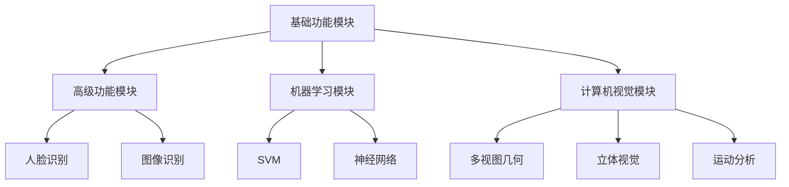

                 

关键词：计算机视觉，图像处理，OpenCV，算法原理，数学模型，项目实践，应用场景，工具推荐

摘要：本文将深入探讨OpenCV在计算机视觉领域的应用，重点介绍图像处理和分析技术。我们将从背景介绍开始，详细解释核心概念和算法原理，并通过实例和案例来展示其实际应用，最后对未来的发展趋势和面临的挑战进行展望。

## 1. 背景介绍

计算机视觉是一门研究如何使计算机能够像人类一样理解和解释视觉信息的科学。随着计算机性能的提升和图像处理算法的进步，计算机视觉技术在多个领域取得了显著的应用成果，如安防监控、自动驾驶、医疗诊断和机器识别等。

OpenCV（Open Source Computer Vision Library）是一个开源的计算机视觉和机器学习软件库，由Intel创立，目前由全球社区维护。它提供了丰富的图像处理函数和算法，支持多种编程语言，包括Python、C++和Java，成为计算机视觉研究和开发的首选工具之一。

## 2. 核心概念与联系

### 2.1 OpenCV架构

OpenCV的核心架构包括以下几个主要模块：

- **基础功能模块**：提供基本的图像处理操作，如图像读取、显示、滤波、几何变换等。
- **高级功能模块**：包括人脸识别、图像识别、光学字符识别（OCR）等高级算法。
- **机器学习模块**：提供多种机器学习算法，如支持向量机（SVM）、神经网络等。
- **计算机视觉模块**：涵盖多视图几何、立体视觉、运动分析等。

### 2.2 图像处理与计算机视觉的关系

图像处理是计算机视觉的基础，主要关注如何对图像进行增强、滤波、分割、特征提取等操作。计算机视觉则利用这些处理后的图像数据，通过学习、识别和解释图像内容来完成任务。

### 2.3 Mermaid 流程图

以下是OpenCV核心模块的Mermaid流程图：



## 3. 核心算法原理 & 具体操作步骤

### 3.1 算法原理概述

OpenCV提供了多种图像处理和分析算法，其中常见的包括：

- **图像滤波**：如高斯滤波、中值滤波、均值滤波等，用于去除图像噪声。
- **边缘检测**：如Canny算法、Sobel算子等，用于检测图像中的边缘。
- **图像分割**：如阈值分割、区域生长等，用于将图像划分为不同的区域。
- **特征提取**：如SIFT、SURF等，用于从图像中提取关键特征。

### 3.2 算法步骤详解

#### 3.2.1 图像滤波

1. 读取图像
2. 选择滤波器（如高斯滤波器）
3. 应用滤波器到图像
4. 显示滤波后的图像

#### 3.2.2 边缘检测

1. 读取图像
2. 选择边缘检测算法（如Canny算法）
3. 应用边缘检测算法到图像
4. 显示边缘检测结果

#### 3.2.3 图像分割

1. 读取图像
2. 选择分割算法（如阈值分割）
3. 应用分割算法到图像
4. 显示分割结果

#### 3.2.4 特征提取

1. 读取图像
2. 选择特征提取算法（如SIFT）
3. 应用特征提取算法到图像
4. 提取特征点
5. 显示特征点

### 3.3 算法优缺点

- **图像滤波**：优点是能够有效去除图像噪声，缺点是可能损失图像细节。
- **边缘检测**：优点是能够突出图像中的边缘信息，缺点是对噪声敏感。
- **图像分割**：优点是能够将图像划分为有意义的部分，缺点是可能产生过分割或误分割。
- **特征提取**：优点是能够从图像中提取关键特征，缺点是计算复杂度高。

### 3.4 算法应用领域

图像处理和分析技术在许多领域都有广泛的应用，如：

- **安防监控**：通过图像滤波和边缘检测来提高监控图像的质量。
- **自动驾驶**：通过图像分割和特征提取来识别道路和车辆。
- **医疗诊断**：通过图像处理和分析来辅助诊断疾病。
- **机器识别**：通过图像处理和机器学习算法来识别和分类物体。

## 4. 数学模型和公式 & 详细讲解 & 举例说明

### 4.1 数学模型构建

图像处理和分析中的许多算法都涉及到数学模型和公式。以下是几个常见的数学模型和公式：

- **高斯滤波**：$$ G(x, y) = \frac{1}{2\pi\sigma^2} e^{-\frac{x^2 + y^2}{2\sigma^2}} $$
- **Canny算法**：$$ \text{Canny}(I) = \text{nonMaximumSuppression}(\text{Prewitt}(I)) $$
- **SIFT特征提取**：$$ \text{sift}(I) = \text{Harris}(I) \cap \text{DoG}(I) $$

### 4.2 公式推导过程

以下是高斯滤波公式的推导过程：

1. 假设原始图像为 $I(x, y)$，滤波器为 $G(x, y)$。
2. 高斯滤波器满足正态分布，其概率密度函数为 $g(x, y)$。
3. 高斯滤波器在图像上的作用可以表示为卷积操作：$F(x, y) = I \star G$。
4. 根据卷积定理，卷积可以转化为积分计算：$$ F(x, y) = \int_{-\infty}^{+\infty} \int_{-\infty}^{+\infty} I(u, v) G(x-u, y-v) dudv $$。
5. 将高斯滤波器的概率密度函数代入，得到高斯滤波公式。

### 4.3 案例分析与讲解

以下是一个使用OpenCV实现高斯滤波的Python代码实例：

```python
import cv2
import numpy as np

# 读取图像
img = cv2.imread('image.jpg', cv2.IMREAD_GRAYSCALE)

# 定义高斯滤波器
kernel_size = (5, 5)
sigma = 1.5
gauss_kernel = cv2.getGaussianKernel(kernel_size, sigma)

# 应用高斯滤波
filtered_img = cv2.filter2D(img, -1, gauss_kernel)

# 显示滤波结果
cv2.imshow('Original Image', img)
cv2.imshow('Filtered Image', filtered_img)
cv2.waitKey(0)
cv2.destroyAllWindows()
```

通过这段代码，我们可以对图像进行高斯滤波，去除图像噪声，并显示滤波结果。

## 5. 项目实践：代码实例和详细解释说明

### 5.1 开发环境搭建

为了使用OpenCV进行图像处理，我们需要安装Python环境以及OpenCV库。以下是安装步骤：

1. 安装Python（建议使用Python 3.8及以上版本）
2. 安装OpenCV库，可以使用pip命令：
   ```shell
   pip install opencv-python
   ```

### 5.2 源代码详细实现

以下是一个完整的OpenCV图像处理项目实例，包括读取图像、滤波、边缘检测、分割和特征提取等操作：

```python
import cv2
import numpy as np

# 5.2.1 读取图像
img = cv2.imread('image.jpg', cv2.IMREAD_GRAYSCALE)

# 5.2.2 高斯滤波
kernel_size = (5, 5)
sigma = 1.5
gauss_kernel = cv2.getGaussianKernel(kernel_size, sigma)
filtered_img = cv2.filter2D(img, -1, gauss_kernel)

# 5.2.3 边缘检测
edges = cv2.Canny(filtered_img, threshold1=50, threshold2=150)

# 5.2.4 阈值分割
ret, thresh = cv2.threshold(edges, 128, 255, cv2.THRESH_BINARY+cv2.THRESH_OTSU)

# 5.2.5 SIFT特征提取
sift = cv2.xfeatures2d.SIFT_create()
keypoints, descriptors = sift.detectAndCompute(thresh, None)

# 5.2.6 显示结果
img2 = cv2.drawKeypoints(edges, keypoints, None, (0, 0, 255), cv2.DRAW_MATCHES_FLAGS_DRAW_RICH_KEYPOINTS)
cv2.imshow('Original Image', img)
cv2.imshow('Filtered Image', filtered_img)
cv2.imshow('Edges', edges)
cv2.imshow('Thresh', thresh)
cv2.imshow('Keypoints', img2)
cv2.waitKey(0)
cv2.destroyAllWindows()
```

### 5.3 代码解读与分析

1. **图像读取**：使用 `cv2.imread()` 函数读取图像，指定读取模式为灰度图像（`cv2.IMREAD_GRAYSCALE`）。
2. **高斯滤波**：定义高斯滤波器大小和标准差，使用 `cv2.getGaussianKernel()` 创建滤波器，并使用 `cv2.filter2D()` 函数对图像进行滤波。
3. **边缘检测**：使用 `cv2.Canny()` 函数对滤波后的图像进行边缘检测，设置阈值来控制边缘强度。
4. **阈值分割**：使用 `cv2.threshold()` 函数进行阈值分割，将边缘图像转换为二值图像。
5. **特征提取**：使用 `cv2.xfeatures2d.SIFT_create()` 创建SIFT特征提取对象，使用 `detectAndCompute()` 方法提取特征点和描述符。
6. **结果展示**：使用 `cv2.drawKeypoints()` 函数在原始图像上绘制特征点，并显示所有结果图像。

### 5.4 运行结果展示

运行上述代码后，我们会看到以下结果图像：

- **原始图像**：显示原始的灰度图像。
- **滤波图像**：显示经过高斯滤波的图像。
- **边缘图像**：显示使用Canny算法检测到的边缘。
- **阈值图像**：显示进行阈值分割后的二值图像。
- **特征图像**：显示在原始图像上标记出的特征点。

## 6. 实际应用场景

### 6.1 安防监控

图像滤波和边缘检测技术常用于安防监控系统中，以提高监控图像的清晰度和可辨析性。例如，在夜间或光线较差的环境下，通过高斯滤波去除图像噪声，再使用Canny算法检测边缘，可以有效提高监控效果。

### 6.2 自动驾驶

自动驾驶系统依赖于图像处理和分析技术来感知环境。通过边缘检测和特征提取，自动驾驶系统可以识别道路、车辆和其他道路使用者，从而实现自动导航和避障功能。

### 6.3 医疗诊断

医学图像处理技术在医疗诊断中发挥着重要作用。例如，通过图像滤波去除图像噪声，使用阈值分割提取病变区域，医生可以更准确地诊断疾病，提高诊断的准确性和效率。

### 6.4 机器识别

机器识别系统利用图像处理和分析技术来识别和分类物体。通过特征提取和机器学习算法，系统可以自动识别图像中的物体，并在各种应用场景中实现自动化操作。

## 7. 工具和资源推荐

### 7.1 学习资源推荐

- **《OpenCV编程基础》**：这是一本适合初学者的OpenCV入门书籍，详细介绍了OpenCV的基本概念和常用函数。
- **OpenCV官方文档**：OpenCV官方网站提供了详细的API文档和教程，是学习OpenCV的绝佳资源。

### 7.2 开发工具推荐

- **Visual Studio Code**：一个轻量级但功能强大的集成开发环境，适合编写和调试Python代码。
- **Jupyter Notebook**：一个交互式的Python开发环境，适合进行数据可视化和实验性编程。

### 7.3 相关论文推荐

- **“Speeded Up Robust Features (SURF)”**：该论文介绍了SURF算法，是一种流行的特征提取算法。
- **“Learning Features by Contracting Across Domains”**：该论文探讨了多域特征学习，是计算机视觉领域的一个重要研究方向。

## 8. 总结：未来发展趋势与挑战

### 8.1 研究成果总结

计算机视觉技术在图像处理和分析方面取得了显著进展，特别是在深度学习和机器学习算法的推动下。OpenCV作为开源工具，在计算机视觉领域发挥了重要作用，提供了丰富的图像处理函数和算法。

### 8.2 未来发展趋势

未来，计算机视觉技术将继续向更高精度、更高效率和更广泛应用方向发展。特别是深度学习算法的普及，将推动计算机视觉在自动驾驶、医疗诊断、机器识别等领域的应用。

### 8.3 面临的挑战

尽管计算机视觉技术取得了显著进展，但仍面临一些挑战，如：

- **数据处理效率**：大规模数据集的处理和存储仍然是一个挑战。
- **算法泛化能力**：算法在面对未知或罕见场景时的泛化能力仍然有限。
- **隐私保护**：图像数据的安全和隐私保护是一个重要议题。

### 8.4 研究展望

未来，计算机视觉研究将继续关注算法的优化、模型的可解释性、多模态数据融合等方面，以实现更高的自动化水平和更广泛的应用。

## 9. 附录：常见问题与解答

### 9.1 如何安装OpenCV？

可以使用pip命令安装OpenCV：
```shell
pip install opencv-python
```

### 9.2 OpenCV支持哪些编程语言？

OpenCV支持多种编程语言，包括Python、C++、Java等。

### 9.3 OpenCV如何处理图像噪声？

OpenCV提供了多种滤波算法，如高斯滤波、中值滤波等，可以用于去除图像噪声。

### 9.4 OpenCV如何进行边缘检测？

OpenCV提供了多种边缘检测算法，如Canny算法、Sobel算子等，可以通过调用相应的函数实现。

### 9.5 OpenCV如何进行图像分割？

OpenCV提供了多种图像分割算法，如阈值分割、区域生长等，可以通过调用相应的函数实现。

作者：禅与计算机程序设计艺术 / Zen and the Art of Computer Programming
----------------------------------------------------------------

以上便是针对OpenCV计算机视觉：图像处理与分析技术这一主题的详细文章，涵盖了从背景介绍到核心算法原理、数学模型、项目实践以及实际应用场景的全面探讨。希望这篇文章能够帮助您深入了解计算机视觉领域的相关技术，并在实际项目中取得更好的成果。

