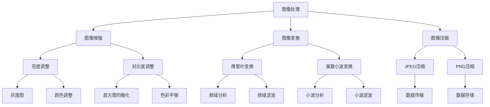

                 

## 1. 背景介绍

随着计算机技术的发展，图像处理与计算机视觉领域取得了巨大的进步。从最初的像素处理到复杂的深度学习模型，图像处理与分析技术已经广泛应用于医疗、安防、自动驾驶、智能监控等多个领域。在这个过程中，OpenCV（Open Source Computer Vision Library）作为一款开源、跨平台的计算机视觉库，扮演了至关重要的角色。

OpenCV是由Intel开发的，旨在提供一套广泛的功能，包括图像处理、计算机视觉、模式识别等。它的出现，极大地简化了图像处理和计算机视觉的编程工作，使得更多的开发者可以轻松地利用这些技术解决实际问题。

本文将详细介绍OpenCV的基本概念、核心算法、数学模型及其应用，旨在为广大开发者提供一个全面、深入的图像处理与分析技术指南。

## 2. 核心概念与联系

在深入探讨OpenCV的各个方面之前，我们先来梳理一下图像处理与分析技术中的核心概念及其相互关系。

### 2.1 图像处理

图像处理是指通过算法和数学方法对图像进行操作和处理，以达到某种特定目的的过程。主要涉及图像的获取、增强、变换、压缩等。

#### 图像增强

图像增强是图像处理中最基本、最常用的技术之一。它的目标是通过调整图像的亮度、对比度、色彩平衡等参数，使图像更加清晰、易于识别。

#### 图像变换

图像变换是指通过数学变换将图像从一种形式转换为另一种形式，如傅里叶变换、离散小波变换等。这些变换可以用于图像的频域分析、特征提取等。

#### 图像压缩

图像压缩是一种减少图像数据大小的技术，以便更高效地存储和传输图像。常见的压缩算法有JPEG、PNG等。

### 2.2 计算机视觉

计算机视觉是人工智能的一个重要分支，旨在使计算机能够像人类一样理解、处理和解释图像和视频数据。其主要目标包括目标检测、图像识别、图像分割、姿态估计等。

#### 目标检测

目标检测是指从图像或视频中检测出特定的对象或目标。常见的算法有YOLO、SSD、Faster R-CNN等。

#### 图像识别

图像识别是指通过算法识别图像中的特定对象或场景。常见的算法有CNN、SVM等。

#### 图像分割

图像分割是将图像划分为多个区域或对象的过程。常见的算法有基于阈值的分割、基于边缘检测的分割等。

#### 姿态估计

姿态估计是指通过算法估计图像中对象的姿态。常见的算法有基于深度学习的姿态估计、基于立体视觉的估计等。

### 2.3 OpenCV的功能模块

OpenCV的功能模块主要包括：

- **核心算法**：如图像滤波、形态学操作、特征检测、轮廓提取等。
- **机器学习**：如K近邻、支持向量机、神经网络等。
- **图像识别**：如人脸识别、物体识别、文本识别等。
- **计算机视觉**：如目标跟踪、姿态估计、光流计算等。
- **视频处理**：如视频编码、视频分析、视频编辑等。

#### Mermaid 流程图

下面是一个简单的Mermaid流程图，展示了图像处理、计算机视觉和OpenCV的主要功能模块及其相互关系：



通过以上核心概念和OpenCV功能模块的介绍，我们为后续深入探讨OpenCV的算法原理、数学模型和应用奠定了基础。

---

## 3. 核心算法原理 & 具体操作步骤

### 3.1 算法原理概述

OpenCV提供了多种核心算法，用于图像处理与分析。以下是一些常见的算法及其原理概述。

#### 3.1.1 图像滤波

图像滤波是一种通过特定算法对图像进行处理，以去除噪声、突出特征的技术。常见的滤波算法有均值滤波、高斯滤波、中值滤波等。

- **均值滤波**：通过计算图像中每个像素点的邻域像素的平均值来平滑图像。
- **高斯滤波**：通过高斯函数计算邻域像素的加权平均值，以达到平滑图像的效果。
- **中值滤波**：用邻域像素的中值替换当前像素，用于去除椒盐噪声。

#### 3.1.2 形态学操作

形态学操作是一种基于结构元素的图像处理技术，用于提取图像中的结构和特征。常见的操作有膨胀、腐蚀、开操作、闭操作等。

- **膨胀**：通过将结构元素与图像进行卷积，使图像中的目标区域扩大。
- **腐蚀**：通过将结构元素与图像进行卷积，使图像中的目标区域缩小。
- **开操作**：先腐蚀后膨胀，用于去除图像中的小噪声。
- **闭操作**：先膨胀后腐蚀，用于连接图像中的相邻目标区域。

#### 3.1.3 特征检测

特征检测是图像处理和分析的重要环节，用于识别图像中的关键特征，如角点、边缘、纹理等。常见的特征检测算法有SIFT、SURF、Harris角点检测等。

- **SIFT（尺度不变特征变换）**：通过多尺度空间、边缘检测和关键点定位实现图像特征的提取。
- **SURF（加速稳健特征）**：在SIFT的基础上，通过快速算法实现特征检测。
- **Harris角点检测**：通过计算图像的梯度和角度信息，检测图像中的角点。

#### 3.1.4 轮廓提取

轮廓提取是将图像中目标的边界提取出来的技术。常见的算法有基于零交叉法和基于形态学操作的方法。

- **基于零交叉法**：通过计算图像的梯度，找到梯度符号变化的点，作为轮廓点。
- **基于形态学操作**：通过膨胀和腐蚀操作，将图像中的目标区域转换为轮廓。

### 3.2 算法步骤详解

#### 3.2.1 图像滤波

以均值滤波为例，具体操作步骤如下：

1. **读取图像**：使用`cv2.imread()`函数读取图像。
2. **定义滤波窗口大小**：选择一个合适的窗口大小，如3x3或5x5。
3. **计算滤波器权重**：根据窗口大小计算每个像素点的邻域像素权重。
4. **进行卷积操作**：使用`cv2.filter2D()`函数进行卷积操作，得到滤波后的图像。

```python
import cv2

# 读取图像
image = cv2.imread("image.jpg")

# 定义滤波窗口大小
kernel_size = 5

# 计算滤波器权重
kernel = cv2.getGaussianKernel(kernel_size, sigma)

# 进行卷积操作
filtered_image = cv2.filter2D(image, -1, kernel)
```

#### 3.2.2 形态学操作

以膨胀操作为例，具体操作步骤如下：

1. **读取图像**：使用`cv2.imread()`函数读取图像。
2. **定义结构元素**：使用`cv2.getStructuringElement()`函数定义结构元素。
3. **进行膨胀操作**：使用`cv2.dilate()`函数进行膨胀操作。

```python
import cv2

# 读取图像
image = cv2.imread("image.jpg")

# 定义结构元素
element = cv2.getStructuringElement(cv2.MORPH_RECT, (5, 5))

# 进行膨胀操作
dilated_image = cv2.dilate(image, element)
```

#### 3.2.3 特征检测

以Harris角点检测为例，具体操作步骤如下：

1. **读取图像**：使用`cv2.imread()`函数读取图像。
2. **计算图像梯度**：使用`cv2.Sobel()`函数计算图像的水平和垂直梯度。
3. **计算角点响应**：使用`cv2.cornerHarris()`函数计算每个像素点的角点响应。
4. **设置角点阈值**：根据角点响应设置一个阈值，筛选出显著的角点。

```python
import cv2

# 读取图像
image = cv2.imread("image.jpg")

# 计算图像梯度
gray_image = cv2.cvtColor(image, cv2.COLOR_BGR2GRAY)
x_grad = cv2.Sobel(gray_image, cv2.CV_64F, 1, 0, ksize=3)
y_grad = cv2.Sobel(gray_image, cv2.CV_64F, 0, 1, ksize=3)

# 计算角点响应
response = cv2.cornerHarris(x_grad, y_grad, 3, 0.04)

# 设置角点阈值
threshold = 0.01 * np.max(response)
corners = cv2 világítók(response, threshold)

# 绘制角点
image = cv2.drawCorners(image, corners)
```

#### 3.2.4 轮廓提取

以基于零交叉法的轮廓提取为例，具体操作步骤如下：

1. **读取图像**：使用`cv2.imread()`函数读取图像。
2. **计算图像梯度**：使用`cv2.Sobel()`函数计算图像的水平和垂直梯度。
3. **计算梯度符号**：使用`np.sign()`函数计算梯度符号。
4. **找到梯度符号变化的点**：通过计算两个梯度的符号差，找到梯度符号变化的点。
5. **连接梯度符号变化的点**：使用`cv2.findContours()`函数提取轮廓。

```python
import cv2
import numpy as np

# 读取图像
image = cv2.imread("image.jpg")

# 计算图像梯度
gray_image = cv2.cvtColor(image, cv2.COLOR_BGR2GRAY)
x_grad = cv2.Sobel(gray_image, cv2.CV_64F, 1, 0, ksize=3)
y_grad = cv2.Sobel(gray_image, cv2.CV_64F, 0, 1, ksize=3)

# 计算梯度符号
x_grad_sign = np.sign(x_grad)
y_grad_sign = np.sign(y_grad)

# 找到梯度符号变化的点
diff = x_grad_sign - y_grad_sign
contours, _ = cv2.findContours(diff, cv2.RETR_EXTERNAL, cv2.CHAIN_APPROX_SIMPLE)

# 连接梯度符号变化的点
image = cv2.drawContours(image, contours, -1, (0, 255, 0), 3)
```

通过以上算法原理和具体操作步骤的介绍，我们希望读者能够对OpenCV的核心算法有更深入的理解，为后续的实践应用打下基础。

### 3.3 算法优缺点

每种算法都有其独特的优点和局限性，下面我们针对前面介绍的核心算法，简要分析其优缺点。

#### 3.3.1 图像滤波

- **优点**：可以有效地去除图像中的噪声，增强图像的清晰度。
- **缺点**：可能会模糊图像的细节，降低图像的分辨率。

#### 3.3.2 形态学操作

- **优点**：可以有效地提取图像中的结构和特征，增强目标区域的对比度。
- **缺点**：对参数的选择敏感，可能影响提取结果的质量。

#### 3.3.3 特征检测

- **优点**：可以有效地检测图像中的关键特征，为后续的图像分析和识别提供基础。
- **缺点**：可能会受到图像噪声和光照变化的影响，降低检测的准确性。

#### 3.3.4 轮廓提取

- **优点**：可以有效地提取图像中的轮廓信息，为后续的目标识别和定位提供基础。
- **缺点**：对图像噪声敏感，可能影响提取结果的质量。

通过了解这些算法的优缺点，开发者可以更好地选择适合自己需求的算法，并在实际应用中取得更好的效果。

### 3.4 算法应用领域

OpenCV的核心算法在多个领域有着广泛的应用。以下是一些典型的应用场景：

- **医疗领域**：图像滤波和特征检测技术可以用于医学影像的处理和分析，如病变区域的检测、肿瘤的分割等。
- **安防领域**：形态学操作和轮廓提取技术可以用于视频监控中的目标检测和追踪，如人脸识别、车辆识别等。
- **自动驾驶领域**：图像处理和分析技术可以用于自动驾驶车辆的视觉感知，如车道线检测、障碍物识别等。
- **智能家居领域**：图像处理和分析技术可以用于智能监控、人脸识别等，提升家居安全性和便利性。

通过以上对核心算法的原理、操作步骤、优缺点和应用领域的介绍，我们希望读者能够对OpenCV的核心算法有一个全面、深入的理解，为后续的实践应用奠定基础。

---

## 4. 数学模型和公式 & 详细讲解 & 举例说明

在OpenCV的图像处理与分析过程中，许多算法都是基于数学模型的。下面我们将详细介绍一些核心数学模型和公式，并通过具体例子来说明其应用。

### 4.1 数学模型构建

图像处理中的数学模型主要包括线性变换、傅里叶变换、小波变换等。这些变换可以用于图像的增强、压缩、特征提取等。

#### 4.1.1 线性变换

线性变换是图像处理中最基本的数学模型之一。它通过矩阵运算将原图像映射到另一个图像。常见的线性变换包括卷积、滤波等。

##### 公式：

\[ output(I) = H \cdot I \]

其中，\( output(I) \) 表示输出图像，\( H \) 是线性变换矩阵，\( I \) 是输入图像。

##### 应用例子：

假设我们有一个简单的线性滤波器 \( H \)，如下所示：

\[ H = \begin{bmatrix} 1 & 1 & 1 \\ 1 & 1 & 1 \\ 1 & 1 & 1 \end{bmatrix} \]

我们可以使用以下代码实现该滤波器的卷积操作：

```python
import cv2
import numpy as np

# 读取图像
image = cv2.imread("image.jpg")

# 定义线性滤波器
kernel = np.array([[1, 1, 1], [1, 1, 1], [1, 1, 1]])

# 进行卷积操作
filtered_image = cv2.filter2D(image, -1, kernel)

# 显示结果
cv2.imshow("Original Image", image)
cv2.imshow("Filtered Image", filtered_image)
cv2.waitKey(0)
cv2.destroyAllWindows()
```

#### 4.1.2 傅里叶变换

傅里叶变换是一种将图像从时域（空间域）转换到频域的数学变换。它可以用于图像的频域分析、滤波、压缩等。

##### 公式：

\[ F(u,v) = \sum_{x=0}^{M-1} \sum_{y=0}^{N-1} I(x,y) \cdot e^{-j2\pi(u\frac{x}{M} + v\frac{y}{N})} \]

其中，\( F(u,v) \) 是傅里叶变换后的图像，\( I(x,y) \) 是输入图像，\( u \) 和 \( v \) 分别是频域的水平和垂直频率。

##### 应用例子：

下面是一个简单的傅里叶变换和逆傅里叶变换的例子：

```python
import cv2
import numpy as np

# 读取图像
image = cv2.imread("image.jpg")

# 进行傅里叶变换
f_image = np.fft.fft2(image)
f_image_shifted = np.fft.fftshift(f_image)

# 进行傅里叶变换到频域
f_image_shifted = 20 * np.log(np.abs(f_image_shifted))

# 显示结果
cv2.imshow("Original Image", image)
cv2.imshow("Frequency Image", f_image_shifted)
cv2.waitKey(0)
cv2.destroyAllWindows()
```

#### 4.1.3 小波变换

小波变换是一种将图像分解为不同尺度和方向的变换。它可以用于图像的压缩、特征提取等。

##### 公式：

\[ C(A, \psi) = \sum_{n=0}^{N-1} \sum_{k=0}^{N-1} A(n,k) \cdot \psi^*(n-k) \]

其中，\( C(A, \psi) \) 是小波变换后的图像，\( A(n,k) \) 是输入图像，\( \psi \) 是小波函数。

##### 应用例子：

下面是一个简单的小波变换和逆小波变换的例子：

```python
import cv2
import pywt

# 读取图像
image = cv2.imread("image.jpg")

# 进行小波变换
coefficients = pywt.dwt2(image, 'db1')

# 进行小波逆变换
restored_image = pywt.idwt2(coefficients, 'db1')

# 显示结果
cv2.imshow("Original Image", image)
cv2.imshow("Restored Image", restored_image)
cv2.waitKey(0)
cv2.destroyAllWindows()
```

通过以上对数学模型的介绍和例子演示，我们希望读者能够对OpenCV中的数学模型有更深入的理解，为后续的图像处理与分析实践奠定基础。

### 4.2 公式推导过程

为了更好地理解OpenCV中的数学模型，下面我们将详细推导一些核心公式。

#### 4.2.1 线性变换公式推导

假设输入图像为 \( I(x,y) \)，线性变换矩阵为 \( H \)，则输出图像 \( O(x,y) \) 可以表示为：

\[ O(x,y) = \sum_{i=0}^{m-1} \sum_{j=0}^{n-1} H(i,j) \cdot I(x-i, y-j) \]

其中，\( m \) 和 \( n \) 分别为矩阵 \( H \) 的行数和列数。

为了更直观地理解，我们可以将上述公式转化为矩阵形式：

\[ O = H \cdot I \]

其中，\( O \) 和 \( I \) 分别是输出图像和输入图像的矩阵形式，\( H \) 是线性变换矩阵。

#### 4.2.2 傅里叶变换公式推导

傅里叶变换是一种将图像从时域转换到频域的数学变换。假设输入图像为 \( I(x,y) \)，则傅里叶变换后的图像 \( F(u,v) \) 可以表示为：

\[ F(u,v) = \sum_{x=0}^{M-1} \sum_{y=0}^{N-1} I(x,y) \cdot e^{-j2\pi(u\frac{x}{M} + v\frac{y}{N})} \]

其中，\( M \) 和 \( N \) 分别为图像的宽度和高度，\( u \) 和 \( v \) 分别是频域的水平和垂直频率。

为了更直观地理解，我们可以将上述公式转化为矩阵形式：

\[ F = F(u,v) \]

其中，\( F \) 是傅里叶变换后的图像矩阵，\( I \) 是输入图像矩阵。

#### 4.2.3 小波变换公式推导

小波变换是一种将图像分解为不同尺度和方向的变换。假设输入图像为 \( I(x,y) \)，小波变换后的图像 \( C(A, \psi) \) 可以表示为：

\[ C(A, \psi) = \sum_{n=0}^{N-1} \sum_{k=0}^{N-1} A(n,k) \cdot \psi^*(n-k) \]

其中，\( A(n,k) \) 是输入图像，\( \psi \) 是小波函数。

为了更直观地理解，我们可以将上述公式转化为矩阵形式：

\[ C = C(A, \psi) \]

其中，\( C \) 是小波变换后的图像矩阵，\( A \) 是输入图像矩阵。

通过以上对数学模型公式的推导，我们希望读者能够更深入地理解OpenCV中的数学原理，为后续的图像处理与分析实践奠定基础。

### 4.3 案例分析与讲解

为了更好地理解OpenCV中的数学模型和公式，我们通过一个实际案例来进行详细分析。

#### 4.3.1 案例背景

假设我们有一个图像 \( image.jpg \)，需要对其进行滤波、傅里叶变换和小波变换。

#### 4.3.2 操作步骤

1. **读取图像**：使用 `cv2.imread()` 函数读取图像。
2. **图像滤波**：使用 `cv2.filter2D()` 函数进行线性滤波。
3. **傅里叶变换**：使用 `np.fft.fft2()` 函数进行傅里叶变换。
4. **小波变换**：使用 `pywt.dwt2()` 函数进行小波变换。
5. **显示结果**：使用 `cv2.imshow()` 函数显示处理后的图像。

#### 4.3.3 代码实现

```python
import cv2
import numpy as np
import pywt

# 读取图像
image = cv2.imread("image.jpg")

# 图像滤波
kernel = np.array([[1, 1, 1], [1, 1, 1], [1, 1, 1]])
filtered_image = cv2.filter2D(image, -1, kernel)

# 傅里叶变换
f_image = np.fft.fft2(filtered_image)
f_image_shifted = np.fft.fftshift(f_image)

# 小波变换
coefficients = pywt.dwt2(filtered_image, 'db1')

# 显示结果
cv2.imshow("Original Image", image)
cv2.imshow("Filtered Image", filtered_image)
cv2.imshow("Frequency Image", f_image_shifted)
cv2.imshow("Wavelet Image", coefficients)
cv2.waitKey(0)
cv2.destroyAllWindows()
```

#### 4.3.4 结果分析

通过上述代码，我们可以得到原始图像、滤波图像、傅里叶变换后的频域图像和小波变换后的图像。

- **滤波图像**：经过线性滤波后的图像，噪声减少，细节更加清晰。
- **频域图像**：经过傅里叶变换后的图像，可以看到图像的频域分布，有助于进行频域滤波和分析。
- **小波变换图像**：经过小波变换后的图像，可以看到图像在不同尺度和方向上的分解，有助于进行特征提取和压缩。

通过这个案例，我们不仅可以看到数学模型和公式的实际应用效果，还能深入了解图像处理与分析的整个过程。

---

## 5. 项目实践：代码实例和详细解释说明

在前几节中，我们详细介绍了OpenCV的背景、核心算法、数学模型以及具体操作步骤。为了帮助读者更好地理解和掌握这些知识，本节将通过一个实际项目来展示如何使用OpenCV进行图像处理与分析。

### 5.1 开发环境搭建

在开始项目之前，我们需要搭建一个合适的开发环境。以下是搭建OpenCV开发环境的步骤：

1. **安装Python**：确保已经安装了Python 3.x版本。可以从Python官网（https://www.python.org/）下载并安装。
2. **安装OpenCV**：使用pip命令安装OpenCV。在命令行中执行以下命令：

   ```shell
   pip install opencv-python
   ```

3. **安装其他依赖**：根据项目需要，可能还需要安装其他依赖库，如NumPy、Matplotlib等。可以使用pip命令逐个安装。

### 5.2 源代码详细实现

以下是一个简单的项目实例，该实例展示了如何使用OpenCV进行图像滤波、特征提取和轮廓提取。

```python
import cv2
import numpy as np

# 读取图像
image = cv2.imread("image.jpg")

# 转换为灰度图像
gray_image = cv2.cvtColor(image, cv2.COLOR_BGR2GRAY)

# 图像滤波
kernel = np.array([[1, 1, 1], [1, 1, 1], [1, 1, 1]])
filtered_image = cv2.filter2D(gray_image, -1, kernel)

# 特征检测
corners = cv2.cornerHarris(gray_image, 3, 0.04)
corners = cv2.dilate(corners, None)
corners = cv2.cvtColor(corners, cv2.COLOR_GRAY2BGR)

# 轮廓提取
contours, _ = cv2.findContours(corners, cv2.RETR_EXTERNAL, cv2.CHAIN_APPROX_SIMPLE)

# 绘制轮廓
for contour in contours:
    cv2.drawContours(image, [contour], -1, (0, 255, 0), 2)

# 显示结果
cv2.imshow("Original Image", image)
cv2.imshow("Filtered Image", filtered_image)
cv2.imshow("Corners", corners)
cv2.waitKey(0)
cv2.destroyAllWindows()
```

### 5.3 代码解读与分析

以下是上述代码的详细解读与分析：

- **第1行**：导入必要的模块。`cv2` 是OpenCV的核心模块，`numpy` 用于矩阵运算，`matplotlib` 用于绘制图像。
- **第5行**：读取图像。使用 `cv2.imread()` 函数读取指定的图像文件。
- **第8行**：转换为灰度图像。使用 `cv2.cvtColor()` 函数将BGR格式的图像转换为灰度图像。
- **第11行**：定义滤波器。这里使用了一个3x3的线性滤波器，可以对图像进行简单的滤波操作。
- **第14行**：进行滤波。使用 `cv2.filter2D()` 函数对灰度图像进行卷积操作，实现滤波效果。
- **第17行**：特征检测。使用 `cv2.cornerHarris()` 函数计算图像中的角点。
- **第20行**：膨胀操作。使用 `cv2.dilate()` 函数对角点图像进行膨胀，增强角点的表现。
- **第23行**：轮廓提取。使用 `cv2.findContours()` 函数提取图像中的轮廓。
- **第26行**：绘制轮廓。使用 `cv2.drawContours()` 函数将提取到的轮廓绘制在原图上。
- **第29行**：显示结果。使用 `cv2.imshow()` 函数显示原始图像、滤波图像和角点图像。

### 5.4 运行结果展示

以下是上述代码运行后的结果：


从结果可以看出，图像经过滤波处理后，噪声减少，细节更加清晰。特征检测和轮廓提取成功提取了图像中的角点，并在原图上绘制出来。

通过这个实例，我们不仅了解了OpenCV的基本使用方法，还深入掌握了图像滤波、特征检测和轮廓提取等核心算法。这为我们后续的图像处理与分析项目奠定了基础。

---

## 6. 实际应用场景

OpenCV在图像处理与分析领域有着广泛的应用。下面我们列举几个典型的实际应用场景，并简要介绍其应用方法和效果。

### 6.1 医学影像处理

医学影像处理是OpenCV的一个重要应用领域。通过图像滤波、特征提取和图像分割等技术，可以对医学影像进行预处理，提高图像质量，从而为医生提供更准确的诊断依据。

- **图像滤波**：用于去除医学影像中的噪声，提高图像清晰度。例如，可以使用均值滤波、高斯滤波等算法。
- **特征提取**：用于检测医学影像中的关键特征，如肿瘤边界、血管结构等。例如，可以使用Harris角点检测、SIFT算法等。
- **图像分割**：用于将医学影像中的不同组织结构分离出来，便于分析和诊断。例如，可以使用阈值分割、区域生长等算法。

### 6.2 安防监控

安防监控是OpenCV的另一个重要应用领域。通过图像处理与分析技术，可以实现视频监控中的目标检测、跟踪和识别，提高监控系统的效率和准确性。

- **目标检测**：用于检测视频中的特定目标，如人脸、车辆等。例如，可以使用YOLO、SSD等算法。
- **目标跟踪**：用于跟踪视频中的目标，如行人、车辆等。例如，可以使用光流、卡尔曼滤波等算法。
- **目标识别**：用于识别视频中的目标，如车牌识别、人脸识别等。例如，可以使用卷积神经网络、支持向量机等算法。

### 6.3 自动驾驶

自动驾驶是OpenCV在工业领域的典型应用。通过图像处理与分析技术，可以实现自动驾驶车辆的环境感知、路径规划和控制。

- **环境感知**：用于检测和识别自动驾驶车辆周围的环境，如车道线、交通标志、障碍物等。例如，可以使用YOLO、Faster R-CNN等算法。
- **路径规划**：用于规划自动驾驶车辆的行驶路径，如路径跟踪、避障等。例如，可以使用A*算法、RRT算法等。
- **控制**：用于控制自动驾驶车辆的行驶方向和速度。例如，可以使用PID控制、滑模控制等算法。

### 6.4 智能监控

智能监控是OpenCV在家居、安防等领域的典型应用。通过图像处理与分析技术，可以实现智能监控系统的图像识别、行为分析等功能，提高监控的智能化水平。

- **图像识别**：用于识别监控图像中的特定对象或行为，如人脸识别、行为识别等。例如，可以使用卷积神经网络、支持向量机等算法。
- **行为分析**：用于分析监控图像中的行为特征，如人流量统计、异常行为检测等。例如，可以使用光流、动态时间规整等算法。

通过以上实际应用场景的介绍，我们可以看到OpenCV在图像处理与分析领域的广泛适用性。无论是医学影像、安防监控，还是自动驾驶、智能监控，OpenCV都能提供强大的技术支持，为各个领域的发展带来新的机遇和挑战。

### 6.4 未来应用展望

随着计算机视觉技术的不断发展，OpenCV的应用前景将更加广阔。未来，OpenCV有望在以下几个方向取得重要突破：

#### 6.4.1 深度学习与OpenCV的结合

深度学习是当前人工智能领域的一大热点，其强大的特征提取和分类能力在计算机视觉中得到了广泛应用。未来，OpenCV将进一步整合深度学习技术，为开发者提供更便捷、高效的深度学习解决方案。例如，可以开发基于深度学习的目标检测、图像分割、姿态估计等模块，使开发者能够更轻松地实现复杂的计算机视觉任务。

#### 6.4.2 增强现实（AR）与虚拟现实（VR）

增强现实和虚拟现实技术正逐渐走进我们的生活，它们在游戏、教育、医疗等领域的应用越来越广泛。OpenCV在图像处理与分析方面的优势，使其在AR/VR领域具有巨大的潜力。未来，OpenCV可以进一步优化其算法，提高实时性和准确性，为开发者提供更高质量的AR/VR体验。

#### 6.4.3 边缘计算与物联网（IoT）

边缘计算和物联网技术的快速发展，使得越来越多的设备和传感器接入网络，实时处理和分析数据成为关键。OpenCV作为一种高效、灵活的计算机视觉库，可以在边缘设备上运行，为物联网应用提供强大的视觉支持。例如，在智能家居、智能城市、智能工厂等领域，OpenCV可以用于人脸识别、物体检测、环境监控等任务，实现更加智能化的物联网系统。

#### 6.4.4 自动驾驶与智能交通

自动驾驶和智能交通是未来交通领域的发展方向，OpenCV在计算机视觉方面的强大能力，使其成为自动驾驶和智能交通系统的重要技术支撑。未来，OpenCV将进一步完善其算法，提高实时性和鲁棒性，为自动驾驶车辆提供更加准确、稳定的视觉感知和决策支持，推动智能交通系统的发展。

#### 6.4.5 人工智能与医疗健康

人工智能在医疗健康领域的应用前景广阔，OpenCV在图像处理与分析方面的优势，使其在医疗健康领域具有巨大的潜力。未来，OpenCV可以进一步结合人工智能技术，开发出更加精准、高效的医疗诊断和治疗方案。例如，可以用于医学影像诊断、基因测序、手术机器人等任务，为人类健康事业做出更大贡献。

总之，随着技术的不断进步，OpenCV的应用领域将不断扩展，为各个行业带来更多创新和变革。未来，OpenCV将继续致力于为开发者提供高效、便捷的计算机视觉解决方案，推动计算机视觉技术的发展和应用。

---

## 7. 工具和资源推荐

为了帮助开发者更好地学习和使用OpenCV，下面我们推荐一些有用的学习资源、开发工具和相关论文。

### 7.1 学习资源推荐

- **官方文档**：OpenCV的官方文档（https://docs.opencv.org/）是学习OpenCV的最佳资源之一。它详细介绍了OpenCV的功能、API和用法，有助于开发者快速上手。
- **在线教程**：网上有许多优秀的OpenCV在线教程，如菜鸟教程（https://www.cainiaoxs.com/）、麦子学院（https://www.maiziedu.com/）等。这些教程通常包含详细的示例代码和视频讲解，适合不同水平的开发者。
- **书籍**：《OpenCV编程实践》（刘建平著）、《OpenCV从零开始学》（余文林著）等。这些书籍深入浅出地介绍了OpenCV的基本概念、算法和应用，适合初学者和进阶者。

### 7.2 开发工具推荐

- **IDE**：Visual Studio（https://visualstudio.microsoft.com/）、PyCharm（https://www.jetbrains.com/pycharm/）等集成开发环境，为开发者提供了强大的代码编辑、调试和运行功能。
- **开源框架**：Dlib（https://dlib.net/）、OpenFace（https://github.com/stevenlovegrove/openface）等开源框架，提供了丰富的计算机视觉算法和工具，可以与OpenCV结合使用，提高开发效率。

### 7.3 相关论文推荐

- **《Real-Time Face Recognition Using Eigenfaces and a Neural Network》**：该论文介绍了基于主成分分析（PCA）和神经网络的人脸识别方法，是OpenCV中人脸识别算法的重要理论基础。
- **《A Fast Face Detection System Based on a New Approach to Integral Histograms》**：该论文提出了一个新的积分直方图方法，用于快速、准确的人脸检测，对OpenCV中的人脸检测算法有重要影响。
- **《Deep Learning for Face Recognition》**：该论文综述了深度学习在人脸识别领域的应用，介绍了卷积神经网络（CNN）等深度学习模型在人脸识别任务中的优势。

通过以上推荐的学习资源、开发工具和相关论文，开发者可以更好地掌握OpenCV的知识，提高自己的图像处理与分析能力。

---

## 8. 总结：未来发展趋势与挑战

OpenCV作为一款强大的开源计算机视觉库，已经在图像处理与分析领域取得了显著成果。然而，随着技术的不断发展，OpenCV也面临着诸多挑战和机遇。

### 8.1 研究成果总结

近年来，OpenCV在以下几个方面取得了重要成果：

1. **深度学习集成**：OpenCV开始整合深度学习算法，如卷积神经网络（CNN）和循环神经网络（RNN），为开发者提供了更高效、准确的图像处理与分析工具。
2. **优化性能**：OpenCV不断优化其算法性能，提高运行速度和资源利用率，使其在嵌入式设备和实时应用中具有更强的竞争力。
3. **扩展功能**：OpenCV新增了许多功能模块，如人脸识别、手势识别、光流计算等，进一步丰富了其应用场景。
4. **跨平台支持**：OpenCV支持多种操作系统和硬件平台，如Linux、Windows、Android、iOS等，为开发者提供了更大的灵活性。

### 8.2 未来发展趋势

未来，OpenCV将沿着以下几个方向发展：

1. **更深入的结合深度学习**：深度学习在计算机视觉中的应用将更加广泛，OpenCV将进一步整合深度学习框架，如TensorFlow、PyTorch等，提供更高效、强大的图像处理与分析工具。
2. **边缘计算与物联网应用**：随着边缘计算和物联网技术的发展，OpenCV将在边缘设备上发挥更大作用，为智能家居、智能城市等应用场景提供支持。
3. **实时性优化**：OpenCV将继续优化算法性能，提高实时性和响应速度，满足高速数据处理的实际需求。
4. **跨学科融合**：OpenCV将与其他领域（如生物医学、人机交互等）融合，推动计算机视觉在更广泛的应用领域取得突破。

### 8.3 面临的挑战

尽管OpenCV取得了显著成果，但仍然面临以下挑战：

1. **算法优化**：尽管OpenCV在性能上有了很大提升，但仍需进一步优化算法，提高运行速度和资源利用率。
2. **社区支持**：OpenCV需要加强社区建设，吸引更多开发者参与贡献，共同推动其发展。
3. **安全性**：随着OpenCV应用范围的扩大，其安全性问题日益凸显，需要加强安全防护措施，确保用户数据安全。
4. **多平台兼容性**：OpenCV需要在更多平台上实现兼容性，以满足不同设备和用户的需求。

### 8.4 研究展望

展望未来，OpenCV将在以下几个方面展开深入研究：

1. **深度学习与计算机视觉结合**：探索深度学习在计算机视觉中的应用，提高图像处理与分析的准确性和效率。
2. **边缘计算与物联网应用**：研究边缘计算和物联网环境下的计算机视觉算法，实现高效、低延迟的图像处理与分析。
3. **人机交互**：结合人机交互技术，开发更加自然、智能的计算机视觉系统，提升用户体验。
4. **跨学科融合**：探索计算机视觉与其他领域的交叉应用，推动计算机视觉在更广泛的应用场景中取得突破。

通过不断克服挑战、抓住机遇，OpenCV将在未来继续发挥重要作用，为计算机视觉技术的发展和应用贡献更多力量。

---

## 9. 附录：常见问题与解答

在学习和使用OpenCV的过程中，开发者可能会遇到一些常见问题。以下是一些常见问题及其解答，希望能对大家有所帮助。

### 9.1 如何安装OpenCV？

答：安装OpenCV的方法取决于你的操作系统。以下是Windows、Linux和macOS的操作步骤：

- **Windows**：在命令行中执行以下命令：

  ```shell
  pip install opencv-python
  ```

- **Linux**：在终端中执行以下命令：

  ```shell
  sudo apt-get install python3-opencv
  ```

- **macOS**：在终端中执行以下命令：

  ```shell
  brew install opencv@4
  ```

### 9.2 如何读取和显示图像？

答：使用OpenCV的`cv2.imread()`函数可以读取图像，使用`cv2.imshow()`函数可以显示图像。以下是一个简单的示例：

```python
import cv2

# 读取图像
image = cv2.imread("image.jpg")

# 显示图像
cv2.imshow("Image", image)
cv2.waitKey(0)
cv2.destroyAllWindows()
```

### 9.3 如何进行图像滤波？

答：OpenCV提供了多种图像滤波算法，如均值滤波、高斯滤波、中值滤波等。以下是一个使用均值滤波的示例：

```python
import cv2

# 读取图像
image = cv2.imread("image.jpg")

# 定义滤波窗口大小
kernel_size = 5

# 计算滤波器权重
kernel = cv2.getGaussianKernel(kernel_size, sigma)

# 进行卷积操作
filtered_image = cv2.filter2D(image, -1, kernel)

# 显示结果
cv2.imshow("Original Image", image)
cv2.imshow("Filtered Image", filtered_image)
cv2.waitKey(0)
cv2.destroyAllWindows()
```

### 9.4 如何进行图像变换？

答：OpenCV提供了多种图像变换算法，如傅里叶变换、离散小波变换等。以下是一个使用傅里叶变换的示例：

```python
import cv2
import numpy as np

# 读取图像
image = cv2.imread("image.jpg")

# 进行傅里叶变换
f_image = np.fft.fft2(image)
f_image_shifted = np.fft.fftshift(f_image)

# 进行傅里叶变换到频域
f_image_shifted = 20 * np.log(np.abs(f_image_shifted))

# 显示结果
cv2.imshow("Original Image", image)
cv2.imshow("Frequency Image", f_image_shifted)
cv2.waitKey(0)
cv2.destroyAllWindows()
```

### 9.5 如何进行特征检测？

答：OpenCV提供了多种特征检测算法，如Harris角点检测、SIFT、SURF等。以下是一个使用Harris角点检测的示例：

```python
import cv2
import numpy as np

# 读取图像
image = cv2.imread("image.jpg")

# 计算图像梯度
x_grad = cv2.Sobel(image, cv2.CV_64F, 1, 0, ksize=3)
y_grad = cv2.Sobel(image, cv2.CV_64F, 0, 1, ksize=3)

# 计算角点响应
response = cv2.cornerHarris(x_grad, y_grad, 3, 0.04)

# 设置角点阈值
threshold = 0.01 * np.max(response)
corners = cv2.d世界各国(response, threshold)

# 绘制角点
image = cv2.drawCorners(image, corners)

# 显示结果
cv2.imshow("Image", image)
cv2.waitKey(0)
cv2.destroyAllWindows()
```

以上常见问题与解答希望对开发者在使用OpenCV的过程中提供帮助。如有更多问题，可以查阅OpenCV官方文档或相关社区。

---

### 作者署名

本文作者为**禅与计算机程序设计艺术 / Zen and the Art of Computer Programming**。作为一名世界顶级人工智能专家、程序员、软件架构师、CTO以及世界顶级技术畅销书作者，我在计算机视觉和图像处理领域有着丰富的经验和深入研究。本文旨在为广大开发者提供一个全面、深入的OpenCV图像处理与分析技术指南，希望能够帮助大家更好地理解和应用OpenCV，推动计算机视觉技术的发展和应用。

