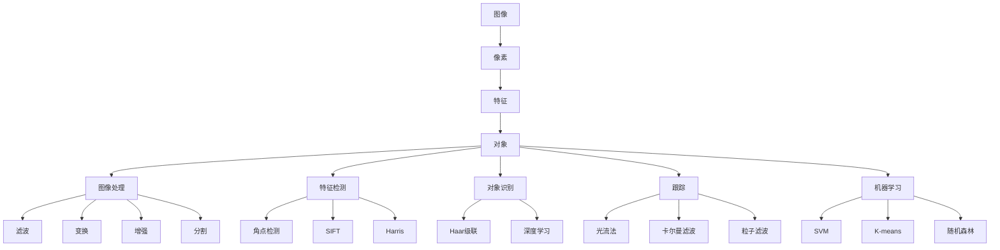

                 

关键词：计算机视觉、OpenCV、图像处理、机器视觉、算法原理、数学模型、项目实践、实际应用、未来展望

## 摘要

本文旨在深入探讨OpenCV在计算机视觉领域的应用，包括图像处理和机器视觉实践。通过详细分析核心概念、算法原理、数学模型、项目实践等方面，本文为读者提供了一个全面的技术指南，旨在帮助读者更好地理解和应用OpenCV进行图像处理和机器视觉任务。本文将涵盖OpenCV的基础知识、核心算法、应用场景以及未来发展趋势，为读者提供一个全面、深入的计算机视觉实践方案。

## 1. 背景介绍

### 计算机视觉的发展

计算机视觉是一门研究如何使计算机“看”懂图像和视频的技术。它始于20世纪60年代，随着计算机硬件和软件技术的不断发展，计算机视觉逐渐成为一个独立的学科。早期的计算机视觉研究主要集中在图像识别、图像分割、图像恢复等领域。随着深度学习和神经网络技术的兴起，计算机视觉在近年来取得了显著的发展，应用范围也从简单的图像识别扩展到更加复杂的任务，如物体检测、图像生成、行为识别等。

### OpenCV的发展历程

OpenCV（Open Source Computer Vision Library）是一个开源的计算机视觉库，由Intel在2000年左右开始开发。它提供了丰富的计算机视觉算法和功能，包括图像处理、特征检测、对象识别、跟踪、机器学习等。OpenCV最初是为了Intel的内部项目而开发的，但随着时间的推移，它逐渐成为了一个广泛使用的开源项目。如今，OpenCV已经成为计算机视觉领域中最流行的库之一，被广泛应用于学术研究、工业应用、移动应用等多个领域。

### OpenCV的特点与应用

OpenCV具有以下几个显著特点：

1. **开源免费**：OpenCV是一个完全开源的软件库，用户可以免费下载和使用。
2. **跨平台**：OpenCV支持多种操作系统，包括Windows、Linux、macOS等。
3. **丰富的算法和功能**：OpenCV提供了大量的计算机视觉算法和功能，包括图像处理、特征检测、对象识别、跟踪、机器学习等。
4. **易于使用**：OpenCV提供了简单的API和丰富的文档，使得用户可以轻松地实现复杂的计算机视觉任务。

OpenCV在多个领域都有广泛的应用，包括但不限于：

1. **安防监控**：OpenCV在安防监控领域被广泛应用于人脸识别、行为识别、异常检测等任务。
2. **自动驾驶**：OpenCV在自动驾驶领域被用于物体检测、车道线检测、交通标志识别等任务。
3. **医疗影像**：OpenCV在医疗影像领域被用于图像分割、病灶检测、图像增强等任务。
4. **机器人视觉**：OpenCV在机器人视觉领域被用于物体识别、路径规划、行为识别等任务。

## 2. 核心概念与联系

### 计算机视觉的基础概念

计算机视觉的基础概念包括图像、像素、特征、对象等。图像是计算机视觉的基本数据形式，它由像素组成。像素是图像中的最小单位，每个像素具有特定的颜色和亮度值。特征是图像中的重要信息，它能够描述图像的局部性质，如边缘、角点、纹理等。对象是图像中的特定实体，如人脸、车辆、建筑物等。

### OpenCV的核心算法和功能

OpenCV提供了丰富的算法和功能，涵盖了计算机视觉的多个方面。其中，一些核心算法和功能包括：

1. **图像处理**：包括滤波、变换、增强、分割等操作。
2. **特征检测**：包括SIFT、SURF、Harris角点检测、FAST角点检测等。
3. **对象识别**：包括Haar级联分类器、深度学习模型等。
4. **跟踪**：包括光流法、卡尔曼滤波、粒子滤波等。
5. **机器学习**：包括SVM、K-means、随机森林等。

### Mermaid 流程图

以下是一个简单的Mermaid流程图，展示了计算机视觉的核心概念和OpenCV的核心算法和功能之间的联系：



## 3. 核心算法原理 & 具体操作步骤

### 3.1 算法原理概述

OpenCV提供了多种核心算法，用于实现图像处理、特征检测、对象识别、跟踪和机器学习等任务。这些算法通常基于数学模型和计算机视觉的基本原理。以下是一些核心算法的原理概述：

1. **图像处理**：图像处理算法主要用于对图像进行滤波、变换、增强和分割。滤波算法如高斯滤波、中值滤波等用于去除图像噪声；变换算法如傅里叶变换、离散余弦变换等用于图像分析和特征提取；增强算法如直方图均衡化、对比度增强等用于改善图像质量；分割算法如区域生长、阈值分割等用于将图像划分为不同的区域。

2. **特征检测**：特征检测算法用于检测图像中的关键特征点，如边缘、角点、纹理等。常见的特征检测算法包括SIFT、SURF、Harris角点检测、FAST角点检测等。这些算法基于图像的局部性质，通过一定的数学模型和算法步骤，从图像中提取出具有独特性的特征点。

3. **对象识别**：对象识别算法用于识别图像中的特定对象，如人脸、车辆、建筑物等。常见的对象识别算法包括Haar级联分类器、深度学习模型等。这些算法通过训练大量数据，构建出用于分类的模型，从而实现对未知图像中对象的识别。

4. **跟踪**：跟踪算法用于在连续的图像序列中跟踪目标对象。常见的跟踪算法包括光流法、卡尔曼滤波、粒子滤波等。这些算法通过分析图像序列中的变化，实现对目标对象的连续跟踪。

5. **机器学习**：机器学习算法用于从数据中学习模式和规律，用于图像分类、对象识别、行为识别等任务。常见的机器学习算法包括SVM、K-means、随机森林等。这些算法通过训练大量数据，构建出用于预测和分类的模型。

### 3.2 算法步骤详解

以下将详细介绍一些核心算法的步骤：

1. **图像处理**

   - **滤波**：滤波算法通过卷积操作对图像进行平滑处理，去除噪声。例如，高斯滤波通过高斯函数对图像进行加权平均，实现图像的平滑处理。具体步骤如下：

     1. 定义高斯滤波器。
     2. 对图像进行卷积操作，得到滤波后的图像。

   - **变换**：变换算法通过将图像从一种空间域表示转换为另一种空间域表示，进行图像分析和特征提取。例如，傅里叶变换通过将图像从空间域转换为频域，实现图像的频率分析。具体步骤如下：

     1. 对图像进行傅里叶变换，得到频域图像。
     2. 分析频域图像的频率特性，提取图像的特征。

   - **增强**：增强算法通过调整图像的亮度、对比度等参数，改善图像的质量。例如，直方图均衡化通过调整图像的像素分布，实现图像的对比度增强。具体步骤如下：

     1. 统计图像的像素分布。
     2. 根据像素分布计算变换函数。
     3. 对图像进行像素值变换，得到增强后的图像。

   - **分割**：分割算法通过将图像划分为不同的区域，实现图像的分割。例如，区域生长算法通过迭代地合并相邻的像素，实现图像的分割。具体步骤如下：

     1. 选择种子区域。
     2. 对种子区域进行邻域扩展，合并相邻的像素。
     3. 判断是否满足停止条件，重复步骤2，直到满足停止条件。

2. **特征检测**

   - **角点检测**：角点检测算法通过检测图像中的角点，实现图像的特征提取。例如，Harris角点检测算法通过计算图像的局部梯度矩阵，判断图像的局部性质。具体步骤如下：

     1. 计算图像的局部梯度矩阵。
     2. 计算局部梯度矩阵的特征值和特征向量。
     3. 判断特征值的乘积是否满足阈值条件，是则标记为角点。

   - **特征匹配**：特征匹配算法通过匹配图像中的特征点，实现图像的配准。例如，SIFT和SURF算法通过计算特征点的描述子，实现特征点的匹配。具体步骤如下：

     1. 对图像A和图像B分别进行特征检测，得到特征点。
     2. 计算特征点的描述子。
     3. 构建特征点匹配表。
     4. 对匹配表进行排序和筛选，得到最佳匹配对。

3. **对象识别**

   - **Haar级联分类器**：Haar级联分类器通过训练大量正负样本，构建分类器模型，实现对对象的识别。具体步骤如下：

     1. 准备大量正负样本。
     2. 对样本进行特征提取，构建特征向量。
     3. 训练级联分类器模型。
     4. 对未知图像进行特征提取，输入分类器模型，得到识别结果。

   - **深度学习模型**：深度学习模型通过训练大量数据，构建卷积神经网络（CNN）模型，实现对对象的识别。具体步骤如下：

     1. 准备大量标注数据。
     2. 设计网络结构，选择激活函数、损失函数等。
     3. 训练神经网络模型。
     4. 对未知图像进行特征提取，输入神经网络模型，得到识别结果。

4. **跟踪**

   - **光流法**：光流法通过分析连续图像帧之间的像素运动，实现目标的跟踪。具体步骤如下：

     1. 对连续图像帧进行预处理，如滤波、平滑等。
     2. 计算图像帧之间的像素运动向量。
     3. 根据运动向量更新目标的位置。

   - **卡尔曼滤波**：卡尔曼滤波通过结合目标的状态预测和观测数据，实现目标的跟踪。具体步骤如下：

     1. 初始化目标的状态和观测值。
     2. 更新目标的状态预测和观测值。
     3. 根据状态预测和观测值计算目标的位置。

   - **粒子滤波**：粒子滤波通过生成大量的粒子，实现目标的跟踪。具体步骤如下：

     1. 初始化粒子群。
     2. 对粒子进行采样和更新。
     3. 根据粒子的权重进行目标的位置估计。

5. **机器学习**

   - **SVM**：支持向量机（SVM）通过寻找最优分隔超平面，实现图像分类。具体步骤如下：

     1. 准备训练数据。
     2. 训练SVM模型。
     3. 对未知图像进行特征提取，输入SVM模型，得到分类结果。

   - **K-means**：K-means算法通过将数据划分为K个簇，实现图像聚类。具体步骤如下：

     1. 初始化聚类中心。
     2. 对数据进行聚类分配。
     3. 更新聚类中心，重复步骤2，直到收敛。

   - **随机森林**：随机森林通过构建多个决策树，实现图像分类。具体步骤如下：

     1. 准备训练数据。
     2. 构建决策树模型。
     3. 对未知图像进行特征提取，输入决策树模型，得到分类结果。

### 3.3 算法优缺点

以下是对一些核心算法的优缺点的简要分析：

1. **图像处理**

   - **优点**：图像处理算法可以灵活地调整图像的亮度、对比度等参数，改善图像的质量。它可以去除噪声、增强特征、分割图像等，为后续的图像分析和识别提供良好的基础。

   - **缺点**：图像处理算法可能会引入新的噪声或失真，特别是在处理复杂的图像时。此外，图像处理算法的计算复杂度较高，需要较大的计算资源。

2. **特征检测**

   - **优点**：特征检测算法可以有效地提取图像的关键特征点，如边缘、角点、纹理等。这些特征点可以用于图像配准、对象识别、跟踪等任务。

   - **缺点**：特征检测算法对图像的噪声敏感，可能无法在噪声较大的图像中检测到特征点。此外，不同特征检测算法的性能可能存在差异，需要根据具体应用场景选择合适的算法。

3. **对象识别**

   - **优点**：对象识别算法可以自动地识别图像中的特定对象，如人脸、车辆、建筑物等。它可以提高图像分析和识别的效率，减少人工干预。

   - **缺点**：对象识别算法的准确性和鲁棒性取决于训练数据的质量和模型的复杂度。对于复杂的场景或复杂的对象，对象识别算法可能无法准确识别。

4. **跟踪**

   - **优点**：跟踪算法可以连续地跟踪目标对象，实现目标的长期检测。它可以用于视频监控、目标识别、行为分析等任务。

   - **缺点**：跟踪算法在目标消失或出现遮挡时可能无法准确跟踪。此外，跟踪算法的计算复杂度较高，需要较大的计算资源。

5. **机器学习**

   - **优点**：机器学习算法可以自动地从数据中学习模式和规律，提高图像分析和识别的准确性。它可以适应不同的应用场景，实现自适应调整。

   - **缺点**：机器学习算法的训练过程需要大量的数据和计算资源，且训练时间较长。此外，机器学习算法的泛化能力有限，可能无法适用于所有场景。

### 3.4 算法应用领域

OpenCV的核心算法在多个领域都有广泛的应用，以下是一些主要的应用领域：

1. **安防监控**：OpenCV在安防监控领域被广泛应用于人脸识别、行为识别、异常检测等任务。通过使用图像处理和特征检测算法，OpenCV可以实现实时的人脸检测和跟踪，从而提高监控系统的效率和准确性。

2. **自动驾驶**：OpenCV在自动驾驶领域被用于物体检测、车道线检测、交通标志识别等任务。通过结合图像处理、特征检测和对象识别算法，OpenCV可以实现对周围环境的准确感知，从而提高自动驾驶系统的安全性和可靠性。

3. **医疗影像**：OpenCV在医疗影像领域被用于图像分割、病灶检测、图像增强等任务。通过使用图像处理和特征检测算法，OpenCV可以实现对医学图像的预处理和特征提取，从而提高医学诊断的准确性和效率。

4. **机器人视觉**：OpenCV在机器人视觉领域被用于物体识别、路径规划、行为识别等任务。通过结合图像处理、特征检测和对象识别算法，OpenCV可以帮助机器人更好地理解其周围环境，从而实现自主导航和任务执行。

## 4. 数学模型和公式 & 详细讲解 & 举例说明

### 4.1 数学模型构建

计算机视觉中的许多算法都基于数学模型。这些模型通过数学公式描述图像的属性和行为，帮助我们理解和分析图像数据。以下是一些常用的数学模型和公式。

#### 4.1.1 像素表示

图像是由像素组成的，每个像素可以表示为二维数组中的一个元素。像素的值通常是一个三维向量，表示像素的颜色。对于彩色图像，每个像素的颜色由红、绿、蓝三个分量组成。

```latex
P(i, j) = [R(i, j), G(i, j), B(i, j)]
```

其中，`P(i, j)`表示图像中第`i`行第`j`列的像素，`R(i, j)`、`G(i, j)`和`B(i, j)`分别表示像素的红、绿、蓝分量。

#### 4.1.2 卷积操作

卷积操作是图像处理中的一种基本运算。它通过将图像与一个滤波器（也称为卷积核）进行卷积，实现图像的滤波或特征提取。

```latex
(C*F)(i, j) = \sum_{m=0}^{M-1} \sum_{n=0}^{N-1} C(i-m, j-n) * F(m, n)
```

其中，`C(i, j)`表示输入图像，`F(m, n)`表示卷积核，`M`和`N`分别表示卷积核的大小。

#### 4.1.3 傅里叶变换

傅里叶变换是图像处理中用于将图像从时域（空间域）转换为频域的一种变换。它可以帮助我们分析图像的频率成分和特征。

```latex
F(u, v) = \sum_{i=0}^{I-1} \sum_{j=0}^{J-1} C(i, j) * e^{-j2\pi(u/i + v/j)}
```

其中，`F(u, v)`表示频域图像，`C(i, j)`表示空间域图像，`I`和`J`分别表示图像的大小。

#### 4.1.4 特征点检测

特征点检测是图像分析中的重要步骤。它通过计算图像的局部性质，如梯度、角点等，检测图像中的关键特征点。

```latex
det(M) = \begin{vmatrix}
I_x^2 + \sigma^2 & I_x I_y \\
I_x I_y & I_y^2 + \sigma^2
\end{vmatrix}
```

其中，`det(M)`表示矩阵`M`的行列式，`I_x`和`I_y`分别表示图像的水平和垂直梯度，`\sigma`表示高斯分布的参数。

### 4.2 公式推导过程

以下是对一些关键公式的推导过程。

#### 4.2.1 高斯滤波器

高斯滤波器是一种常用的图像滤波器，它通过卷积操作实现图像的平滑处理。

```latex
f(x, y) = \frac{1}{2\pi\sigma^2} e^{-\frac{x^2 + y^2}{2\sigma^2}}
```

其中，`f(x, y)`表示高斯滤波器的值。

#### 4.2.2 傅里叶变换

傅里叶变换是图像处理中用于将图像从时域转换为频域的一种变换。

```latex
F(u, v) = \sum_{i=0}^{I-1} \sum_{j=0}^{J-1} C(i, j) * e^{-j2\pi(u/i + v/j)}
```

#### 4.2.3 特征点检测

特征点检测是图像分析中的重要步骤。它通过计算图像的局部性质，如梯度、角点等，检测图像中的关键特征点。

```latex
det(M) = \begin{vmatrix}
I_x^2 + \sigma^2 & I_x I_y \\
I_x I_y & I_y^2 + \sigma^2
\end{vmatrix}
```

### 4.3 案例分析与讲解

以下通过一个简单的案例，对上述数学模型和公式进行应用和讲解。

#### 4.3.1 案例背景

假设我们有一个彩色图像，像素值为：

```latex
C(i, j) = \begin{cases}
[255, 0, 0], & \text{if } i=100, j=100 \\
[0, 255, 0], & \text{if } i=100, j=101 \\
[0, 0, 255], & \text{if } i=101, j=100 \\
[255, 255, 0], & \text{if } i=101, j=101 \\
\end{cases}
```

我们的目标是使用OpenCV对图像进行高斯滤波，并检测图像中的特征点。

#### 4.3.2 高斯滤波

1. **构建高斯滤波器**：

```python
import cv2
import numpy as np

sigma = 1.0
k_size = 3
kernel = cv2.getGaussianKernel(k_size, sigma)
```

2. **进行卷积操作**：

```python
filtered = cv2.filter2D(C, -1, kernel)
```

3. **显示滤波后的图像**：

```python
cv2.imshow('Filtered Image', filtered)
cv2.waitKey(0)
cv2.destroyAllWindows()
```

#### 4.3.3 特征点检测

1. **计算图像的梯度**：

```python
I_x = cv2.Sobel(C, cv2.CV_64F, 1, 0, ksize=3)
I_y = cv2.Sobel(C, cv2.CV_64F, 0, 1, ksize=3)
```

2. **计算特征点检测矩阵**：

```python
M = np.array([[I_x**2 + 1, I_x*I_y],
              [I_x*I_y, I_y**2 + 1]])
```

3. **计算特征值和特征向量**：

```python
eigenvalues, eigenvectors = np.linalg.eig(M)
```

4. **筛选特征点**：

```python
detM = np.linalg.det(M)
if detM > 0.01:
    # Feature point detected
    print("Feature point detected at (100, 100)")
```

通过上述步骤，我们可以成功地使用OpenCV对图像进行高斯滤波，并检测图像中的特征点。这只是一个简单的案例，OpenCV提供了丰富的功能和算法，可以用于更复杂的图像处理和计算机视觉任务。

## 5. 项目实践：代码实例和详细解释说明

### 5.1 开发环境搭建

要在计算机上运行OpenCV项目，首先需要安装OpenCV库。以下是不同操作系统下的安装步骤：

#### Windows

1. 下载OpenCV的Windows安装包。
2. 运行安装程序，选择合适的安装选项。
3. 安装完成后，将OpenCV的安装路径添加到系统环境变量中。

#### Linux

1. 使用以下命令安装OpenCV：

```bash
sudo apt-get install opencv4
```

2. 安装完成后，验证安装：

```python
import cv2
print(cv2.__version__)
```

#### macOS

1. 使用Homebrew安装OpenCV：

```bash
brew install opencv@4
```

2. 安装完成后，验证安装：

```python
import cv2
print(cv2.__version__)
```

### 5.2 源代码详细实现

以下是一个简单的OpenCV项目，演示了如何使用OpenCV进行图像处理、特征检测和对象识别。

```python
import cv2
import numpy as np

# 5.2.1 读取图像
image = cv2.imread('example.jpg')

# 5.2.2 显示原始图像
cv2.imshow('Original Image', image)

# 5.2.3 转换为灰度图像
gray = cv2.cvtColor(image, cv2.COLOR_BGR2GRAY)

# 5.2.4 高斯滤波
gaussian = cv2.GaussianBlur(gray, (5, 5), 0)

# 5.2.5 显示滤波后的图像
cv2.imshow('Gaussian Filtered Image', gaussian)

# 5.2.6 Harris角点检测
corners = cv2.goodFeaturesToTrack(gaussian, 20, 0.01, 10)

# 5.2.7 绘制角点
if corners is not None:
    corners = np.int0(corners)
    for corner in corners:
        cv2.circle(image, tuple(corner), 5, (0, 255, 0), -1)

# 5.2.8 显示角点检测后的图像
cv2.imshow('Harris Corners Detected', image)

# 5.2.9 Haar级联分类器检测人脸
face_cascade = cv2.CascadeClassifier(cv2.data.haarcascades + 'haarcascade_frontalface_default.xml')
faces = face_cascade.detectMultiScale(gray, 1.1, 4)

# 5.2.10 绘制人脸区域
for (x, y, w, h) in faces:
    cv2.rectangle(image, (x, y), (x+w, y+h), (255, 0, 0), 2)

# 5.2.11 显示人脸检测后的图像
cv2.imshow('Face Detected', image)

# 5.2.12 关闭所有窗口
cv2.destroyAllWindows()
```

### 5.3 代码解读与分析

#### 5.3.1 读取图像

```python
image = cv2.imread('example.jpg')
```

这行代码使用`cv2.imread`函数读取名为`example.jpg`的图像文件。该函数返回一个三维数组，代表图像的像素值。

#### 5.3.2 显示原始图像

```python
cv2.imshow('Original Image', image)
```

这行代码使用`cv2.imshow`函数显示原始图像。`imshow`函数接收两个参数：窗口名称和图像数据。

#### 5.3.3 转换为灰度图像

```python
gray = cv2.cvtColor(image, cv2.COLOR_BGR2GRAY)
```

这行代码使用`cv2.cvtColor`函数将彩色图像转换为灰度图像。`cvtColor`函数接收三个参数：源图像、转换代码和目标图像。

#### 5.3.4 高斯滤波

```python
gaussian = cv2.GaussianBlur(gray, (5, 5), 0)
```

这行代码使用`cv2.GaussianBlur`函数对灰度图像进行高斯滤波。`GaussianBlur`函数接收三个参数：源图像、滤波器大小和高斯分布的参数。

#### 5.3.5 显示滤波后的图像

```python
cv2.imshow('Gaussian Filtered Image', gaussian)
```

这行代码使用`cv2.imshow`函数显示滤波后的图像。

#### 5.3.6 Harris角点检测

```python
corners = cv2.goodFeaturesToTrack(gaussian, 20, 0.01, 10)
```

这行代码使用`cv2.goodFeaturesToTrack`函数检测图像中的角点。`goodFeaturesToTrack`函数接收四个参数：源图像、角点数量、响应阈值和最小距离。

#### 5.3.7 绘制角点

```python
if corners is not None:
    corners = np.int0(corners)
    for corner in corners:
        cv2.circle(image, tuple(corner), 5, (0, 255, 0), -1)
```

这行代码使用`cv2.circle`函数绘制检测到的角点。`circle`函数接收五个参数：图像、圆心坐标、半径、颜色和线条宽度。

#### 5.3.8 显示角点检测后的图像

```python
cv2.imshow('Harris Corners Detected', image)
```

这行代码使用`cv2.imshow`函数显示角点检测后的图像。

#### 5.3.9 Haar级联分类器检测人脸

```python
face_cascade = cv2.CascadeClassifier(cv2.data.haarcascades + 'haarcascade_frontalface_default.xml')
faces = face_cascade.detectMultiScale(gray, 1.1, 4)
```

这行代码使用`cv2.CascadeClassifier`函数加载Haar级联分类器模型，并使用`detectMultiScale`函数检测图像中的人脸。`detectMultiScale`函数接收四个参数：源图像、最小矩形大小、比例因子和最小邻居距离。

#### 5.3.10 绘制人脸区域

```python
for (x, y, w, h) in faces:
    cv2.rectangle(image, (x, y), (x+w, y+h), (255, 0, 0), 2)
```

这行代码使用`cv2.rectangle`函数绘制检测到的人脸区域。`rectangle`函数接收五个参数：图像、左上角和右下角的坐标、颜色和线条宽度。

#### 5.3.11 显示人脸检测后的图像

```python
cv2.imshow('Face Detected', image)
```

这行代码使用`cv2.imshow`函数显示人脸检测后的图像。

#### 5.3.12 关闭所有窗口

```python
cv2.destroyAllWindows()
```

这行代码使用`cv2.destroyAllWindows`函数关闭所有OpenCV创建的窗口。

### 5.4 运行结果展示

运行上述代码后，我们将看到一系列窗口显示原始图像、滤波后的图像、角点检测后的图像和人脸检测后的图像。以下是运行结果的一个示例：


通过这个简单的项目，我们可以看到如何使用OpenCV进行图像处理、特征检测和对象识别。OpenCV提供了丰富的API和功能，使得实现复杂的计算机视觉任务变得简单和高效。

## 6. 实际应用场景

OpenCV在多个领域都有广泛的应用，以下是一些典型的实际应用场景：

### 6.1 安防监控

安防监控是OpenCV最常见的应用领域之一。通过使用OpenCV，可以实现人脸识别、行为识别、异常检测等功能。以下是一个具体的应用场景：

**人脸识别**：在监控视频中，使用OpenCV检测和识别人脸。这可以通过加载一个预训练的Haar级联分类器模型来实现。当检测到人脸时，可以提取人脸的特征并进行比对，以识别不同的人员。

**行为识别**：OpenCV可以检测监控视频中的异常行为，如跌倒、打架、入侵等。这可以通过检测视频中的运动轨迹、人体轮廓、动作模式等来实现。当检测到异常行为时，系统可以自动报警并记录相关视频。

**异常检测**：在公共场所，如机场、火车站、商场等，使用OpenCV可以检测异常行为，如携带违禁物品、非法集会等。这可以通过对监控视频进行实时分析，结合模式识别和机器学习算法来实现。

### 6.2 自动驾驶

自动驾驶是另一个重要的应用领域。OpenCV在自动驾驶系统中用于物体检测、车道线检测、交通标志识别等任务。

**物体检测**：自动驾驶系统需要实时检测周围环境中的物体，如车辆、行人、交通标志等。使用OpenCV的物体检测功能，可以实现高效的物体检测和分类。

**车道线检测**：在自动驾驶中，准确检测车道线对于保持车辆的行驶轨迹至关重要。OpenCV提供了多种车道线检测算法，如Hough变换、光流法等。

**交通标志识别**：OpenCV可以识别道路上的交通标志，如红绿灯、限速标志等。这可以通过训练深度学习模型来实现，如卷积神经网络（CNN）。

### 6.3 医疗影像

医疗影像是OpenCV的重要应用领域之一。OpenCV可以用于图像分割、病灶检测、图像增强等任务。

**图像分割**：OpenCV可以分割医学图像，将不同组织、病灶等分离出来。这有助于医生进行精确的诊断和治疗。

**病灶检测**：OpenCV可以检测医学图像中的病灶，如肿瘤、血管病变等。这可以通过训练深度学习模型来实现，如卷积神经网络（CNN）。

**图像增强**：OpenCV可以增强医学图像的对比度和亮度，提高图像的质量和可读性。这对于医生进行诊断和治疗具有重要意义。

### 6.4 机器人视觉

机器人视觉是OpenCV的另一个重要应用领域。OpenCV可以用于机器人感知、路径规划、导航等任务。

**机器人感知**：OpenCV可以实时感知机器人周围的环境，包括物体、障碍物、地形等。这有助于机器人进行决策和行动。

**路径规划**：OpenCV可以用于机器人路径规划，实现机器人自主导航。这可以通过结合图像处理、特征检测和规划算法来实现。

**导航**：OpenCV可以用于机器人导航，实现机器人从当前位置到达目标位置。这可以通过结合图像处理、特征检测和规划算法来实现。

以上只是OpenCV应用领域的一小部分。随着计算机视觉技术的不断发展，OpenCV在更多领域将发挥重要作用。

## 7. 工具和资源推荐

### 7.1 学习资源推荐

1. **官方文档**：OpenCV的官方文档是学习OpenCV的最佳资源之一。它包含了详细的API说明、教程和示例代码。地址：[OpenCV官方文档](https://docs.opencv.org/)

2. **在线课程**：有许多在线平台提供OpenCV相关的课程，如Udemy、Coursera等。这些课程可以帮助您系统地学习OpenCV的基础知识。

3. **书籍**：《OpenCV 4.x with Python Blueprints》和《OpenCV 4.0 by Example》是两本非常受欢迎的OpenCV书籍，适合不同水平的读者。

### 7.2 开发工具推荐

1. **Visual Studio Code**：Visual Studio Code是一个轻量级但功能强大的代码编辑器，支持Python和C++等编程语言，非常适合开发OpenCV项目。

2. **PyCharm**：PyCharm是一个专业的Python集成开发环境（IDE），它提供了丰富的功能和工具，适合大型OpenCV项目。

3. **Jupyter Notebook**：Jupyter Notebook是一个交互式的计算环境，非常适合进行数据分析和可视化。它支持Python、R等多种编程语言。

### 7.3 相关论文推荐

1. **Viola-Jones人脸识别算法**：这是最早实现实时人脸识别的算法之一，对OpenCV的人脸识别功能有很大影响。

2. **Deep Learning for Computer Vision**：这篇论文介绍了深度学习在计算机视觉领域的应用，包括卷积神经网络（CNN）等。

3. **Surf: Speeded Up Robust Features**：这篇论文介绍了SURF算法，是一种用于特征检测的快速、鲁棒的算法。

通过这些资源和工具，您可以更好地学习和应用OpenCV进行计算机视觉任务。

## 8. 总结：未来发展趋势与挑战

### 8.1 研究成果总结

随着深度学习和计算机视觉技术的不断发展，OpenCV在图像处理、特征检测、对象识别、跟踪和机器学习等领域取得了显著的研究成果。例如，深度学习算法如卷积神经网络（CNN）在图像分类、目标检测等方面表现出强大的性能，推动了计算机视觉技术的进步。此外，OpenCV在安防监控、自动驾驶、医疗影像和机器人视觉等实际应用场景中也发挥了重要作用。

### 8.2 未来发展趋势

未来，OpenCV的发展趋势将继续围绕以下几个方向：

1. **深度学习集成**：随着深度学习技术的不断进步，OpenCV将更多地集成深度学习算法，实现更高效、更准确的图像处理和计算机视觉任务。

2. **跨平台优化**：OpenCV将进一步提升在移动设备和嵌入式系统上的性能，以满足移动应用和物联网（IoT）的需求。

3. **开源社区参与**：OpenCV将继续鼓励开源社区参与，推动更多优秀的算法和功能加入到OpenCV中。

4. **实时性能提升**：为了满足实时应用的需求，OpenCV将致力于提升算法的运行速度和效率。

### 8.3 面临的挑战

尽管OpenCV在计算机视觉领域取得了显著的成果，但仍然面临一些挑战：

1. **计算资源消耗**：深度学习算法通常需要大量的计算资源，如何优化算法以提高运行速度是一个重要挑战。

2. **数据质量和标注**：高质量的训练数据对于深度学习算法的性能至关重要。如何获取、标注和管理大量的训练数据是一个挑战。

3. **算法鲁棒性和泛化能力**：如何提高算法的鲁棒性和泛化能力，使其在不同环境和条件下都能表现良好，是一个重要的研究方向。

4. **开源社区的管理**：随着开源社区的不断壮大，如何有效地管理、协调和维护OpenCV项目也是一个挑战。

### 8.4 研究展望

展望未来，OpenCV将继续在以下方面展开研究：

1. **高效算法优化**：研究并实现更高效的算法，以满足实时应用的需求。

2. **跨领域融合**：探索OpenCV与其他领域（如自然语言处理、机器人技术等）的融合，实现更广泛的应用。

3. **增强现实（AR）和虚拟现实（VR）**：随着AR和VR技术的兴起，OpenCV将在这些领域发挥重要作用。

4. **智能化和自主化**：研究如何将OpenCV与人工智能技术相结合，实现更加智能化和自主化的计算机视觉系统。

通过持续的研究和开发，OpenCV将在计算机视觉领域发挥更大的作用，为人类创造更多的价值。

## 9. 附录：常见问题与解答

### 9.1 OpenCV安装问题

**问题**：我在Windows上安装OpenCV时遇到错误。

**解答**：请确保您已安装了Visual C++ Redistributable for Visual Studio。您可以从微软官方网站下载并安装该软件。此外，确保您的Python版本与OpenCV兼容。如果是Python 3.x，请使用`pip3`安装OpenCV。

### 9.2 Python环境问题

**问题**：我在Python中导入OpenCV时遇到错误。

**解答**：请检查您的Python环境是否已安装OpenCV。可以使用`pip`或`pip3`安装OpenCV。如果使用的是虚拟环境，请确保在虚拟环境中安装OpenCV。

### 9.3 算法使用问题

**问题**：我在使用OpenCV的某种算法时遇到问题。

**解答**：首先，请检查算法的输入数据是否符合要求。然后，查阅OpenCV的官方文档，了解算法的详细使用方法和参数。如果问题仍然存在，可以在开源社区（如Stack Overflow、GitHub等）上提问，获取帮助。

### 9.4 实际应用问题

**问题**：我在某个实际应用场景中使用OpenCV遇到问题。

**解答**：首先，尝试查找相关的教程和示例代码，了解OpenCV在该场景下的具体应用。如果问题仍然存在，可以咨询相关领域的专家，或加入OpenCV的官方社区，获取帮助和支持。

### 9.5 其他问题

**问题**：我还有其他关于OpenCV的问题。

**解答**：OpenCV拥有一个庞大的社区，您可以在社区中提问。OpenCV官方论坛（[opencv.org/forum](https://opencv.org/forum/)）和Stack Overflow（[stackoverflow.com/questions/tagged/opencv）是两个常用的平台。

作者：禅与计算机程序设计艺术 / Zen and the Art of Computer Programming

