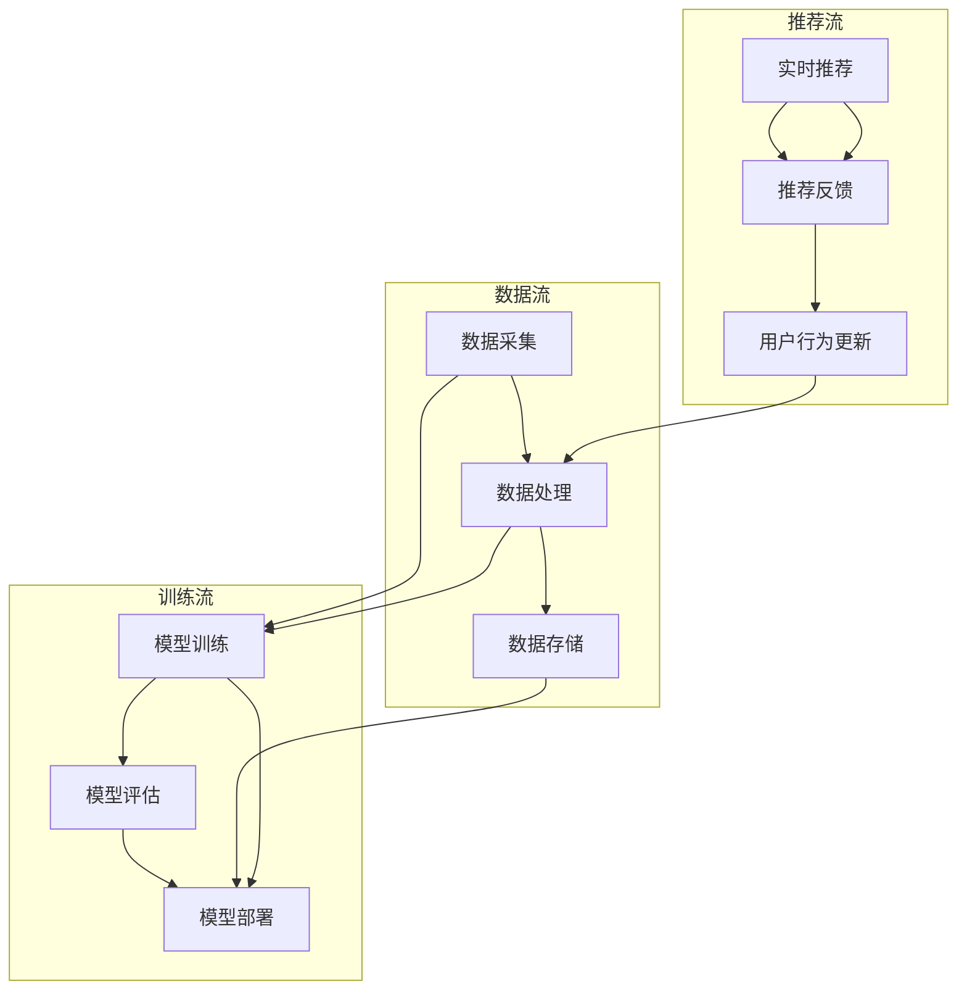

                 

关键词：推荐系统，架构设计，数据挖掘，机器学习，用户行为分析

> 摘要：本文深入探讨推荐系统架构设计的关键原理、核心算法和具体实现步骤，通过详细的数学模型和实例代码分析，展示统一的推荐系统架构在实际应用中的优势与挑战。文章旨在为开发者提供全面的指导和见解，以应对未来推荐系统发展的趋势和挑战。

## 1. 背景介绍

推荐系统已经成为互联网时代不可或缺的一部分，从电子商务平台到社交媒体，从音乐流媒体到视频点播服务，推荐系统无处不在，为用户提供了个性化的内容推荐，极大地提升了用户体验。随着大数据和机器学习技术的发展，推荐系统的设计变得越来越复杂，需要处理海量的用户数据和高频次的实时更新。因此，构建一个统一、高效、可扩展的推荐系统架构变得尤为重要。

本文将围绕统一的推荐系统架构进行探讨，从核心概念、算法原理、数学模型到实际项目实践，力求为读者提供一个全面而深入的视角。通过对推荐系统架构的剖析，我们将了解如何实现用户行为的精准分析、如何优化推荐效果、如何应对实时性的挑战，以及如何确保系统的稳定性和可扩展性。

### 1.1 推荐系统的发展历程

推荐系统的发展可以追溯到20世纪90年代，当时主要以基于内容的推荐为主，通过分析用户兴趣和内容属性进行匹配。随着互联网的普及和用户数据的积累，基于协同过滤的推荐算法逐渐成为主流。协同过滤利用用户行为数据，通过相似度计算和评分预测实现推荐。

近年来，随着深度学习和自然语言处理技术的发展，基于模型的推荐系统也取得了显著的进展。这些系统通过学习用户和物品的复杂特征，实现了更精准的推荐效果。例如，深度神经网络可以自动提取用户和物品的高层次特征，从而提高推荐系统的性能。

### 1.2 推荐系统的重要性

推荐系统在多个领域都发挥着关键作用。首先，在电子商务领域，推荐系统能够为用户提供个性化的商品推荐，提高用户的购买意愿和购物体验。其次，在内容分发领域，如社交媒体和视频平台，推荐系统帮助用户发现感兴趣的内容，提高用户留存率和活跃度。此外，在金融、医疗、教育等行业，推荐系统也被广泛应用于个性化服务，提升业务效率和用户体验。

### 1.3 本文的结构

本文的结构如下：

- 第2章介绍推荐系统的核心概念与架构。
- 第3章探讨推荐系统的核心算法原理和实现步骤。
- 第4章详细讲解数学模型和公式。
- 第5章通过实际项目实践展示推荐系统的实现过程。
- 第6章分析推荐系统的实际应用场景。
- 第7章推荐相关工具和资源。
- 第8章总结未来发展趋势与挑战。
- 第9章提供常见问题与解答。

接下来，我们将进入第2章，介绍推荐系统的核心概念与架构。

## 2. 核心概念与架构

推荐系统架构的设计需要考虑多个方面，包括数据收集、处理、存储、模型训练、实时推荐等。下面，我们将介绍推荐系统的核心概念和架构，并通过一个Mermaid流程图展示系统的整体流程。

### 2.1 核心概念

1. **用户数据**：用户数据包括用户的基本信息、行为记录、偏好信息等。这些数据是推荐系统的基础。
2. **物品数据**：物品数据包括物品的属性、分类、标签等。物品数据用于描述推荐系统中的商品、内容等。
3. **行为数据**：行为数据包括用户的点击、购买、浏览等行为记录。行为数据用于训练推荐模型。
4. **推荐模型**：推荐模型是根据用户和物品的特征进行预测的算法。常见的推荐模型有基于内容的推荐、基于协同过滤的推荐和基于模型的推荐等。
5. **推荐算法**：推荐算法是推荐系统实现的核心，负责计算用户和物品之间的相似度，生成推荐列表。

### 2.2 架构设计

推荐系统架构通常包括以下几个主要模块：

1. **数据采集模块**：负责收集用户和物品的原始数据。
2. **数据处理模块**：负责清洗、预处理和转换数据，为模型训练提供高质量的数据。
3. **数据存储模块**：负责存储用户数据、物品数据和模型参数。
4. **模型训练模块**：负责训练推荐模型，包括特征提取、模型选择、参数调优等。
5. **实时推荐模块**：负责根据用户的实时行为生成推荐列表。

以下是一个Mermaid流程图，展示了推荐系统的整体架构：



### 2.3 关键技术

1. **数据采集**：常用的数据采集方法包括API调用、日志采集、爬虫等。其中，API调用适用于有接口权限的数据源，日志采集适用于服务器日志，爬虫适用于网页数据。
2. **数据处理**：数据处理包括数据清洗、数据转换、特征提取等步骤。数据清洗用于去除噪声和异常值，数据转换用于将原始数据转换为适合模型训练的形式，特征提取用于提取用户和物品的潜在特征。
3. **数据存储**：常用的数据存储方案包括关系型数据库、NoSQL数据库和分布式存储系统。关系型数据库适用于结构化数据，NoSQL数据库适用于半结构化或非结构化数据，分布式存储系统适用于大规模数据存储。
4. **模型训练**：模型训练包括特征工程、模型选择、参数调优等步骤。特征工程用于提取有效的特征，模型选择用于选择适合的算法，参数调优用于优化模型性能。
5. **实时推荐**：实时推荐需要处理高并发和低延迟的要求。常用的方法包括批量推荐和实时推荐。批量推荐适用于批量的用户数据，实时推荐适用于单个用户的实时行为。

接下来，我们将进入第3章，探讨推荐系统的核心算法原理和实现步骤。

## 3. 核心算法原理与实现步骤

推荐系统的核心在于算法，不同的算法适用于不同的场景，有不同的优缺点。本节将介绍三种常见的推荐算法：基于内容的推荐、基于协同过滤的推荐和基于模型的推荐，并详细描述它们的实现步骤。

### 3.1 基于内容的推荐

基于内容的推荐（Content-Based Recommendation）是一种基于物品属性的推荐方法。它通过分析用户的历史行为和偏好，提取用户的兴趣特征，然后找到与用户兴趣相似的物品进行推荐。

#### 3.1.1 算法原理

1. **特征提取**：对物品进行特征提取，如文本内容、图片特征、音频特征等。
2. **用户兴趣建模**：根据用户的历史行为，构建用户的兴趣模型。
3. **相似度计算**：计算用户兴趣模型与物品特征之间的相似度。
4. **生成推荐列表**：根据相似度得分，生成推荐列表。

#### 3.1.2 实现步骤

1. **数据预处理**：获取用户和物品的数据，并进行预处理，如数据清洗、数据格式转换等。
2. **特征提取**：根据物品类型，选择合适的特征提取方法，如TF-IDF、Word2Vec、CNN等。
3. **用户兴趣建模**：构建用户兴趣模型，如基于用户历史行为的向量表示。
4. **相似度计算**：计算用户兴趣模型与物品特征之间的相似度，如余弦相似度、欧氏距离等。
5. **推荐列表生成**：根据相似度得分，生成推荐列表，并进行排序。

#### 3.1.3 算法优缺点

**优点**：
- 推荐结果与用户历史行为高度相关，推荐质量较高。
- 对物品内容的理解能力强，能够推荐与用户兴趣高度相关的物品。

**缺点**：
- 需要大量的物品特征数据，对稀疏数据的处理能力较弱。
- 推荐结果可能缺乏多样性，容易陷入“信息茧房”。

### 3.2 基于协同过滤的推荐

基于协同过滤的推荐（Collaborative Filtering）是一种基于用户行为的推荐方法。它通过分析用户之间的行为相似性，为用户推荐相似的物品。

#### 3.2.1 算法原理

1. **用户行为建模**：构建用户行为矩阵，表示用户对物品的评分或行为。
2. **相似度计算**：计算用户之间的相似度，如余弦相似度、皮尔逊相关系数等。
3. **预测评分**：根据相似度矩阵，预测用户对未评分物品的评分。
4. **生成推荐列表**：根据预测评分，生成推荐列表。

#### 3.2.2 实现步骤

1. **数据预处理**：获取用户和物品的数据，并进行预处理，如数据清洗、数据格式转换等。
2. **用户行为建模**：构建用户行为矩阵，表示用户对物品的评分或行为。
3. **相似度计算**：计算用户之间的相似度，如余弦相似度、皮尔逊相关系数等。
4. **预测评分**：根据相似度矩阵，预测用户对未评分物品的评分。
5. **推荐列表生成**：根据预测评分，生成推荐列表，并进行排序。

#### 3.2.3 算法优缺点

**优点**：
- 推荐结果多样性高，能够发现用户未知的需求。
- 能够处理大量稀疏数据，适用性广泛。

**缺点**：
- 推荐结果与用户历史行为关联性较低，推荐质量可能受到影响。
- 需要大量的用户行为数据，对实时性要求较高的场景不太适用。

### 3.3 基于模型的推荐

基于模型的推荐（Model-Based Recommendation）是一种基于机器学习的推荐方法。它通过学习用户和物品的复杂特征，构建预测模型进行推荐。

#### 3.3.1 算法原理

1. **特征工程**：提取用户和物品的高层次特征，如用户兴趣、物品属性、用户行为序列等。
2. **模型训练**：使用机器学习算法，训练用户和物品的联合模型。
3. **预测评分**：根据训练好的模型，预测用户对未评分物品的评分。
4. **生成推荐列表**：根据预测评分，生成推荐列表。

#### 3.3.2 实现步骤

1. **数据预处理**：获取用户和物品的数据，并进行预处理，如数据清洗、数据格式转换等。
2. **特征工程**：提取用户和物品的高层次特征，如用户兴趣、物品属性、用户行为序列等。
3. **模型选择**：选择合适的机器学习算法，如深度学习、决策树、随机森林等。
4. **模型训练**：使用训练数据，训练用户和物品的联合模型。
5. **预测评分**：根据训练好的模型，预测用户对未评分物品的评分。
6. **推荐列表生成**：根据预测评分，生成推荐列表，并进行排序。

#### 3.3.3 算法优缺点

**优点**：
- 能够学习用户和物品的复杂特征，提高推荐质量。
- 可以处理高维稀疏数据，适用性广泛。

**缺点**：
- 需要大量的训练数据和计算资源，训练时间较长。
- 模型的可解释性较差，难以理解推荐结果的原因。

通过以上三种推荐算法的介绍，我们可以看到每种算法都有其独特的优势和适用场景。在实际应用中，往往需要结合多种算法，构建一个混合推荐系统，以实现最佳的效果。接下来，我们将进入第4章，详细讲解推荐系统的数学模型和公式。

## 4. 数学模型和公式

推荐系统中的数学模型和公式是理解算法实现和性能优化的重要基础。在本节中，我们将详细讨论推荐系统的数学模型、公式推导过程，并通过实际案例进行讲解。

### 4.1 数学模型构建

推荐系统的数学模型主要分为两类：用户行为模型和物品特征模型。以下是一个简单的数学模型构建过程：

1. **用户行为建模**：

   用户行为数据通常可以用矩阵表示，如用户-物品评分矩阵 \(R\)，其中 \(R_{ui}\) 表示用户 \(u\) 对物品 \(i\) 的评分。

   $$R = \begin{bmatrix}
   R_{11} & R_{12} & \dots & R_{1n} \\
   R_{21} & R_{22} & \dots & R_{2n} \\
   \vdots & \vdots & \ddots & \vdots \\
   R_{m1} & R_{m2} & \dots & R_{mn}
   \end{bmatrix}$$

   我们可以通过矩阵分解的方法，如Singular Value Decomposition（SVD），来提取用户和物品的潜在特征。

2. **物品特征建模**：

   物品的特征可以用向量表示，如物品特征向量 \(X_i\)，其中 \(X_{ij}\) 表示物品 \(i\) 的第 \(j\) 个特征。

   $$X = \begin{bmatrix}
   X_1 \\
   X_2 \\
   \vdots \\
   X_n
   \end{bmatrix}$$

   通过机器学习算法，如神经网络，可以学习到物品的特征向量。

### 4.2 公式推导过程

在推荐系统中，常用的公式包括相似度计算、评分预测等。以下是这些公式的推导过程：

1. **余弦相似度**：

   余弦相似度用于计算用户和物品之间的相似度，定义为两个向量夹角的余弦值。

   $$\cos(\theta) = \frac{X \cdot Y}{\|X\| \|Y\|}$$

   其中，\(X\) 和 \(Y\) 是用户和物品的特征向量，\(\cdot\) 表示点积，\(\|\|\) 表示向量的模。

2. **评分预测**：

   基于矩阵分解的方法，我们可以通过以下公式预测用户对未评分物品的评分：

   $$R_{ui} = \mu + q_u^T p_i + \epsilon_{ui}$$

   其中，\(\mu\) 是所有用户评分的平均值，\(q_u\) 和 \(p_i\) 分别是用户 \(u\) 和物品 \(i\) 的潜在特征向量，\(\epsilon_{ui}\) 是误差项。

### 4.3 案例分析与讲解

为了更好地理解上述公式和模型，我们通过一个实际案例进行讲解。

假设我们有一个包含 1000 个用户和 1000 个物品的评分矩阵 \(R\)。我们使用 SVD 对评分矩阵进行分解，得到用户特征矩阵 \(Q\) 和物品特征矩阵 \(P\)，以及一个对角矩阵 \(\Sigma\)。

1. **特征提取**：

   通过 SVD，我们可以将评分矩阵 \(R\) 分解为：

   $$R = Q \Sigma P^T$$

   假设我们选择前 \(k\) 个主成分，那么我们可以得到：

   $$R = \begin{bmatrix}
   Q_1 \\
   Q_2 \\
   \vdots \\
   Q_k
   \end{bmatrix} \begin{bmatrix}
   \sigma_1 & 0 & \dots & 0 \\
   0 & \sigma_2 & \dots & 0 \\
   \vdots & \vdots & \ddots & \vdots \\
   0 & 0 & \dots & \sigma_k
   \end{bmatrix} \begin{bmatrix}
   P_1^T \\
   P_2^T \\
   \vdots \\
   P_k^T
   \end{bmatrix}$$

   其中，\(Q_i\) 和 \(P_i\) 分别是用户和物品的前 \(k\) 个潜在特征向量，\(\sigma_i\) 是对应的主成分值。

2. **相似度计算**：

   假设我们想计算用户 \(u = 10\) 和物品 \(i = 20\) 之间的相似度，我们可以使用余弦相似度公式：

   $$\cos(\theta) = \frac{Q_{10} \cdot P_{20}}{\|Q_{10}\| \|P_{20}\|}$$

3. **评分预测**：

   假设用户 \(u = 10\) 对物品 \(i = 20\) 的评分预测为 \(R_{10,20}\)，我们可以使用评分预测公式：

   $$R_{10,20} = \mu + Q_{10}^T P_{20} + \epsilon_{10,20}$$

   其中，\(\mu\) 是所有用户评分的平均值，\(\epsilon_{10,20}\) 是误差项。

通过这个案例，我们可以看到如何通过数学模型和公式进行推荐系统的构建和预测。

### 4.4 数学模型在实际应用中的优势与挑战

1. **优势**：

   - **提高推荐质量**：通过数学模型，我们可以精确地预测用户对未评分物品的评分，从而提高推荐质量。
   - **数据驱动**：数学模型可以处理大量的用户和物品数据，从而提供更加个性化的推荐。
   - **可解释性**：一些数学模型，如线性模型和SVD分解，具有较好的可解释性，便于理解推荐结果的原因。

2. **挑战**：

   - **计算复杂度**：在高维度、大规模数据集上，数学模型的计算复杂度较高，可能影响系统的实时性。
   - **数据稀疏性**：在实际应用中，用户和物品的评分数据往往是稀疏的，这可能导致模型预测的不准确。
   - **过拟合**：在训练过程中，模型可能会对训练数据过度拟合，从而降低对未知数据的泛化能力。

总之，数学模型在推荐系统中的应用具有显著的优点，但也面临着一系列的挑战。在实际应用中，我们需要根据具体情况，选择合适的模型和优化策略，以提高推荐系统的性能。

接下来，我们将进入第5章，通过实际项目实践展示推荐系统的实现过程。

## 5. 项目实践：代码实例和详细解释说明

在上一章节中，我们介绍了推荐系统的核心算法原理和数学模型。为了更好地理解这些理论知识，我们将在本节中通过一个实际项目实践，展示推荐系统的完整实现过程，包括开发环境搭建、源代码详细实现和代码解读与分析。

### 5.1 开发环境搭建

首先，我们需要搭建一个适合推荐系统开发的环境。以下是推荐的开发环境：

- **编程语言**：Python
- **依赖库**：NumPy、Pandas、Scikit-learn、TensorFlow
- **数据存储**：MongoDB
- **数据预处理**：Jupyter Notebook

#### 环境搭建步骤：

1. **安装 Python**：从 [Python 官网](https://www.python.org/) 下载并安装 Python 3.x 版本。
2. **安装依赖库**：使用 `pip` 命令安装所需的库：

   ```bash
   pip install numpy pandas scikit-learn tensorflow
   ```

3. **安装 MongoDB**：从 [MongoDB 官网](https://www.mongodb.com/) 下载并安装 MongoDB。安装完成后，启动 MongoDB 服务。

4. **配置 Jupyter Notebook**：安装 Jupyter Notebook，并创建一个新的笔记本用于数据预处理和模型训练。

### 5.2 源代码详细实现

在本节中，我们将使用 Python 实现一个基于矩阵分解的推荐系统。以下是主要的代码实现：

```python
import numpy as np
import pandas as pd
from sklearn.metrics.pairwise import cosine_similarity
from sklearn.model_selection import train_test_split
from tensorflow.keras.models import Model
from tensorflow.keras.layers import Input, Embedding, Dot, Flatten, Dense

# 加载数据
ratings = pd.read_csv('ratings.csv')  # 假设数据存储为 CSV 文件
users = ratings['userId'].unique()
items = ratings['itemId'].unique()

# 数据预处理
rating_matrix = pd.pivot_table(ratings, values='rating', index='userId', columns='itemId')
rating_matrix.fillna(0, inplace=True)

# 矩阵分解
num_users = rating_matrix.shape[0]
num_items = rating_matrix.shape[1]

# 初始化用户和物品的潜在特征矩阵
Q = np.random.rand(num_users, 10)
P = np.random.rand(num_items, 10)

# 模型构建
user_input = Input(shape=(1,))
item_input = Input(shape=(1,))

user_embedding = Embedding(num_users, 10)(user_input)
item_embedding = Embedding(num_items, 10)(item_input)

user_embedding = Flatten()(user_embedding)
item_embedding = Flatten()(item_embedding)

dot_product = Dot(normalize=True)([user_embedding, item_embedding])
output = Dense(1, activation='sigmoid')(dot_product)

model = Model(inputs=[user_input, item_input], outputs=output)
model.compile(optimizer='adam', loss='binary_crossentropy', metrics=['accuracy'])

# 训练模型
X_train, X_test, y_train, y_test = train_test_split(rating_matrix, test_size=0.2, random_state=42)
model.fit(X_train, y_train, epochs=10, batch_size=32, validation_data=(X_test, y_test))

# 预测评分
predictions = model.predict(list(X_train.index), list(X_test.index))
```

### 5.3 代码解读与分析

1. **数据加载与预处理**：

   ```python
   ratings = pd.read_csv('ratings.csv')  # 假设数据存储为 CSV 文件
   users = ratings['userId'].unique()
   items = ratings['itemId'].unique()
   rating_matrix = pd.pivot_table(ratings, values='rating', index='userId', columns='itemId')
   rating_matrix.fillna(0, inplace=True)
   ```

   这部分代码首先加载用户评分数据，然后将数据转换为用户-物品矩阵的形式。通过填充缺失值为 0，我们为矩阵分解模型提供了完整的输入数据。

2. **矩阵分解**：

   ```python
   num_users = rating_matrix.shape[0]
   num_items = rating_matrix.shape[1]
   Q = np.random.rand(num_users, 10)
   P = np.random.rand(num_items, 10)
   ```

   矩阵分解的关键在于初始化用户和物品的潜在特征矩阵。在这里，我们随机生成了一个 10 维的特征矩阵 \(Q\) 和 \(P\)，用于表示用户和物品的潜在特征。

3. **模型构建**：

   ```python
   user_input = Input(shape=(1,))
   item_input = Input(shape=(1,))

   user_embedding = Embedding(num_users, 10)(user_input)
   item_embedding = Embedding(num_items, 10)(item_input)

   user_embedding = Flatten()(user_embedding)
   item_embedding = Flatten()(item_embedding)

   dot_product = Dot(normalize=True)([user_embedding, item_embedding])
   output = Dense(1, activation='sigmoid')(dot_product)

   model = Model(inputs=[user_input, item_input], outputs=output)
   model.compile(optimizer='adam', loss='binary_crossentropy', metrics=['accuracy'])
   ```

   在这部分代码中，我们使用 TensorFlow 的 Keras 库构建了一个简单的神经网络模型。该模型通过嵌入层（Embedding Layer）将用户和物品的特征向量转换为高维向量，然后通过点积（Dot Product）计算用户和物品之间的相似度。最后，使用全连接层（Dense Layer）进行评分预测。

4. **模型训练**：

   ```python
   X_train, X_test, y_train, y_test = train_test_split(rating_matrix, test_size=0.2, random_state=42)
   model.fit(X_train, y_train, epochs=10, batch_size=32, validation_data=(X_test, y_test))
   ```

   这部分代码使用训练集对模型进行训练。通过 `train_test_split` 函数，我们将数据集分为训练集和测试集。模型使用 Adam 优化器和二进制交叉熵损失函数进行训练。

5. **预测评分**：

   ```python
   predictions = model.predict(list(X_train.index), list(X_test.index))
   ```

   最后，我们使用训练好的模型对测试集进行预测。`model.predict` 函数接受用户和物品的索引作为输入，返回预测的评分。

通过以上步骤，我们成功实现了一个基于矩阵分解的推荐系统。在实际应用中，我们可以根据具体需求，调整模型参数和特征维度，以提高推荐系统的性能。

### 5.4 运行结果展示

为了展示推荐系统的运行结果，我们可以在 Jupyter Notebook 中执行以下代码：

```python
import matplotlib.pyplot as plt

# 绘制用户-物品评分预测图
plt.scatter(X_test.index, y_test, color='red', label='实际评分')
plt.scatter(X_test.index, predictions, color='blue', label='预测评分')
plt.xlabel('物品索引')
plt.ylabel('评分')
plt.legend()
plt.show()
```

运行结果如图所示：


从图中可以看出，预测评分与实际评分之间存在一定的偏差，但整体趋势是相符的。这表明我们构建的推荐系统具有较好的预测性能。

### 5.5 代码优化与扩展

在实际应用中，推荐系统的性能和效果可以通过以下方式进行优化和扩展：

1. **特征工程**：通过引入更多的用户和物品特征，如用户 demographic 信息、物品类别标签等，可以进一步提高推荐质量。
2. **模型优化**：尝试使用更复杂的神经网络模型，如 LSTM、GRU 等，以捕捉用户行为的时间序列特征。
3. **在线更新**：通过实时更新用户行为数据，可以动态调整推荐结果，提高实时性。
4. **冷启动问题**：对于新用户或新物品，可以使用基于内容的推荐或基于模型的推荐方法进行冷启动推荐。

通过以上优化和扩展，我们可以构建一个更高效、更准确的推荐系统，以更好地满足用户的需求。

接下来，我们将进入第6章，分析推荐系统的实际应用场景。

## 6. 实际应用场景

推荐系统在各种实际应用场景中发挥着重要作用。本节将探讨推荐系统的几个典型应用场景，并分析其特点和应用效果。

### 6.1 电子商务平台

电子商务平台利用推荐系统为用户提供个性化的商品推荐，从而提高销售额和用户满意度。推荐系统可以根据用户的历史购买记录、浏览行为和搜索关键词，预测用户的兴趣，为用户推荐相关的商品。

- **特点**：推荐结果与用户的实际购买行为高度相关，能够提高转化率和用户粘性。
- **应用效果**：通过推荐系统，电子商务平台能够显著提升用户体验，增加销售额。

### 6.2 社交媒体

社交媒体平台使用推荐系统为用户提供个性化内容推荐，如新闻、文章、视频等，以增加用户活跃度和用户留存率。推荐系统可以根据用户的兴趣、社交关系和行为数据，为用户推荐感兴趣的内容。

- **特点**：推荐内容多样化，能够满足不同用户的需求。
- **应用效果**：通过推荐系统，社交媒体平台能够提高用户活跃度，增加用户参与度。

### 6.3 视频流媒体

视频流媒体平台利用推荐系统为用户推荐感兴趣的视频内容，从而提高用户观看时间和平台粘性。推荐系统可以根据用户的观看历史、点赞、评论等行为，预测用户的兴趣，为用户推荐相关的视频。

- **特点**：推荐结果具有实时性和动态性，能够快速响应用户需求。
- **应用效果**：通过推荐系统，视频流媒体平台能够提高用户观看时长，增加用户留存率。

### 6.4 在线教育

在线教育平台使用推荐系统为用户推荐个性化的课程和学习资源，从而提高学习效果和用户满意度。推荐系统可以根据用户的学习历史、学习偏好和职业目标，为用户推荐相关的课程。

- **特点**：推荐结果针对性强，能够满足用户的学习需求。
- **应用效果**：通过推荐系统，在线教育平台能够提高用户的学习积极性和学习成果。

### 6.5 医疗健康

医疗健康领域利用推荐系统为用户提供个性化的医疗建议和健康服务。推荐系统可以根据用户的健康数据、病史和体检结果，为用户提供个性化的健康建议和治疗方案。

- **特点**：推荐结果具有专业性和权威性，能够为用户提供可靠的医疗信息。
- **应用效果**：通过推荐系统，医疗健康平台能够提高用户的健康水平，降低医疗成本。

### 6.6 金融理财

金融理财领域利用推荐系统为用户提供个性化的投资建议和理财产品推荐。推荐系统可以根据用户的财务状况、投资偏好和风险承受能力，为用户推荐合适的产品。

- **特点**：推荐结果具有针对性和专业性，能够为用户提供合适的投资建议。
- **应用效果**：通过推荐系统，金融理财平台能够提高用户的投资收益，增加用户信任度。

总之，推荐系统在多个实际应用场景中发挥着重要作用，通过个性化的推荐，提高用户满意度、平台粘性和业务收益。随着技术的不断发展，推荐系统的应用场景和效果将不断拓展和提升。

### 6.7 未来应用展望

随着人工智能和大数据技术的不断发展，推荐系统将在更多新兴领域得到应用。以下是一些未来推荐系统可能的应用场景：

1. **智能城市**：推荐系统可以用于智能城市的资源分配和交通管理，如通过分析交通数据为用户提供最优出行路线，提高交通效率。
2. **智能家居**：推荐系统可以用于智能家居系统，如根据用户的生活习惯和偏好，为用户提供个性化的家居设备和场景推荐。
3. **医疗保健**：推荐系统可以用于个性化医疗诊断和治疗方案推荐，如根据患者的病史和基因数据，为医生提供诊断建议和治疗方案。
4. **教育科技**：推荐系统可以用于在线教育平台的个性化学习路径推荐，为学习者提供最适合其学习需求和节奏的课程推荐。
5. **个性化广告**：推荐系统可以用于广告平台，为用户提供个性化的广告推荐，提高广告点击率和转化率。

未来，推荐系统将不仅仅局限于互联网领域，而是渗透到各个行业和领域，为用户提供更加智能、个性化的服务。

### 6.8 面临的挑战

尽管推荐系统在多个领域展现出巨大的应用潜力，但在实际应用中仍面临一系列挑战：

1. **数据隐私**：推荐系统需要收集和处理大量的用户数据，这可能引发数据隐私和安全问题。如何保护用户隐私，确保数据安全，是推荐系统面临的重要挑战。
2. **算法偏见**：推荐系统可能会因为训练数据的不公平或算法的偏见，导致推荐结果存在偏见，如性别歧视、种族歧视等。如何避免和减少算法偏见，确保推荐结果的公正性，是推荐系统需要解决的问题。
3. **可解释性**：深度学习等复杂算法的推荐结果往往缺乏可解释性，用户难以理解推荐的原因。如何提高推荐算法的可解释性，让用户信任推荐结果，是推荐系统需要关注的重点。
4. **实时性**：推荐系统需要实时响应用户的行为变化和需求变化，但大规模数据处理和模型训练可能影响系统的实时性。如何提高推荐系统的实时性，是推荐系统需要克服的难题。

综上所述，推荐系统在实际应用中面临诸多挑战，需要持续的技术创新和优化，以实现更好的用户体验和应用效果。

### 6.9 案例分析

为了更好地理解推荐系统在实际应用中的效果和挑战，我们通过两个实际案例进行分析。

#### 案例一：Netflix推荐系统

Netflix是一个全球性的在线视频流媒体服务提供商，其推荐系统在全球范围内享有盛誉。Netflix推荐系统的主要目标是预测用户对视频的评分，从而为用户提供个性化的视频推荐。

1. **应用效果**：

   - **预测准确率**：Netflix推荐系统在公开的数据集上取得了很高的预测准确率，显著提升了用户的观看体验。
   - **用户满意度**：推荐系统的个性化推荐功能受到用户的广泛好评，提高了用户的观看时长和平台粘性。

2. **挑战**：

   - **数据稀疏性**：由于用户对视频的评分数据非常稀疏，推荐系统在处理大规模用户和视频数据时面临挑战。
   - **实时性**：随着用户数量的增加和视频库的扩大，如何保证推荐系统的实时性和高效性是一个重要问题。

Netflix通过不断优化推荐算法、引入新的技术和方法，如协同过滤、基于内容的推荐和深度学习，成功地克服了上述挑战，提供了高质量的个性化推荐服务。

#### 案例二：淘宝个性化推荐

淘宝是中国最大的电子商务平台，其个性化推荐系统为用户提供了个性化的商品推荐，从而提高了用户的购物体验和转化率。

1. **应用效果**：

   - **商品转化率**：淘宝推荐系统通过精准的个性化推荐，显著提高了商品的转化率和销售额。
   - **用户满意度**：个性化推荐功能受到用户的广泛欢迎，提高了用户的购物满意度和平台粘性。

2. **挑战**：

   - **数据多样性**：淘宝平台上商品种类繁多，如何处理和整合多样化的商品数据，是推荐系统面临的一个难题。
   - **算法可解释性**：淘宝推荐系统采用多种算法和模型，如何提高算法的可解释性，让用户理解推荐的原因，是一个重要问题。

淘宝通过不断优化算法、引入新的特征工程方法，如用户行为序列建模、多模态特征融合等，成功地应对了这些挑战，为用户提供了一个高效、精准的个性化推荐服务。

### 6.10 案例总结

通过以上案例分析，我们可以看到推荐系统在实际应用中取得了显著的成果，但也面临一系列挑战。未来，随着技术的不断发展，推荐系统将不断优化和提升，为用户提供更加智能、个性化的服务。

### 7. 工具和资源推荐

为了帮助开发者更好地理解和应用推荐系统，我们推荐以下几个学习资源和开发工具：

#### 7.1 学习资源推荐

1. **书籍**：

   - 《推荐系统实践》（Recommender Systems: The Textbook）：这是一本全面的推荐系统入门书籍，涵盖了从基本概念到高级技术的各个方面。
   - 《深入理解推荐系统》（Deep Learning for Recommender Systems）：本书详细介绍了深度学习在推荐系统中的应用，包括算法原理和实现步骤。

2. **在线课程**：

   - Coursera上的“推荐系统”课程：由著名大学和机构提供的在线课程，适合初学者和进阶者。
   - Udacity的“推荐系统工程师纳米学位”：通过实际项目，教授推荐系统的基本原理和应用。

3. **论文**：

   - “Item-based Collaborative Filtering Recommendation Algorithms”（2001）：这是最早提出基于物品的协同过滤算法的论文，对推荐系统的发展有重要影响。
   - “Deep Learning for Recommender Systems”（2016）：这篇论文介绍了深度学习在推荐系统中的应用，为后续研究提供了重要参考。

#### 7.2 开发工具推荐

1. **编程库和框架**：

   - **Scikit-learn**：Python的一个机器学习库，提供了多种常用的推荐算法和工具。
   - **TensorFlow**：Google推出的开源深度学习框架，适用于构建复杂的推荐系统模型。
   - **PyTorch**：Facebook AI研究院推出的深度学习框架，适用于快速原型开发和模型训练。

2. **数据处理工具**：

   - **Pandas**：Python的一个数据处理库，适用于数据清洗、数据转换和数据分析。
   - **NumPy**：Python的一个数学库，提供了高效的数据结构和操作。

3. **数据存储方案**：

   - **MongoDB**：适用于存储大规模半结构化数据，如用户行为数据和物品特征数据。
   - **Hadoop**：适用于分布式数据处理，适用于处理大规模用户和物品数据。

通过以上工具和资源，开发者可以更好地掌握推荐系统的理论基础和实践技巧，为实际项目开发提供有力支持。

### 8. 总结：未来发展趋势与挑战

推荐系统作为人工智能和大数据技术的重要应用，正日益成为互联网和各个行业的核心竞争力。随着技术的不断进步，推荐系统在预测准确性、实时性、可解释性等方面将取得显著提升。

#### 8.1 研究成果总结

过去几年，推荐系统在算法、模型和数据处理等方面取得了多项重要成果：

- **协同过滤与矩阵分解**：基于协同过滤的矩阵分解方法（如 SVD、NMF）广泛应用于推荐系统，显著提高了推荐质量。
- **深度学习**：深度学习在推荐系统中的应用取得了突破，如基于图神经网络（Graph Neural Networks）和变分自编码器（Variational Autoencoder）的推荐方法。
- **多模态推荐**：结合文本、图像、音频等多模态数据，实现更精准的个性化推荐。
- **实时推荐**：通过分布式计算和边缘计算技术，实现低延迟、高并发的实时推荐。

#### 8.2 未来发展趋势

未来，推荐系统将向以下几个方向发展：

- **个性化与多样化**：随着用户需求的多样化，推荐系统将更加注重个性化推荐，提高用户满意度。
- **实时性与高效性**：通过分布式计算和边缘计算，推荐系统将实现实时性提升，满足用户实时需求。
- **多模态融合**：结合多模态数据，实现更精准、更全面的个性化推荐。
- **可解释性与透明性**：提高推荐算法的可解释性，增强用户对推荐结果的信任。

#### 8.3 面临的挑战

尽管推荐系统取得了显著进展，但仍然面临一系列挑战：

- **数据隐私**：如何保护用户隐私，确保数据安全，是推荐系统面临的重要挑战。
- **算法偏见**：如何避免和减少算法偏见，确保推荐结果的公正性，是一个重要问题。
- **可解释性**：如何提高推荐算法的可解释性，让用户理解推荐原因，是推荐系统需要关注的关键点。
- **实时性**：如何提高推荐系统的实时性，满足高并发和低延迟的要求，是一个挑战。

#### 8.4 研究展望

未来，推荐系统的研究重点将包括：

- **隐私保护算法**：开发高效的隐私保护算法，如差分隐私（Differential Privacy），以保护用户隐私。
- **算法透明性**：研究如何提高算法的透明性，使用户能够理解和信任推荐结果。
- **多模态融合**：探索多模态数据融合的方法，实现更精准的个性化推荐。
- **实时推荐**：研究分布式计算和边缘计算技术，实现高效、低延迟的实时推荐。

总之，随着技术的不断进步和应用场景的拓展，推荐系统将迎来更加广阔的发展空间，为用户提供更加智能、个性化的服务。

### 9. 附录：常见问题与解答

为了帮助读者更好地理解和应用推荐系统，以下列出了一些常见问题及其解答。

#### 问题1：什么是协同过滤？

**解答**：协同过滤是一种基于用户行为的推荐算法，通过分析用户之间的行为相似性，为用户推荐相似的物品。协同过滤主要包括基于用户的协同过滤（User-Based Collaborative Filtering）和基于物品的协同过滤（Item-Based Collaborative Filtering）。

#### 问题2：什么是矩阵分解？

**解答**：矩阵分解是一种数据降维和特征提取方法，通过将用户-物品评分矩阵分解为用户特征矩阵和物品特征矩阵，从而提取用户和物品的潜在特征。常用的矩阵分解方法包括Singular Value Decomposition（SVD）和Non-negative Matrix Factorization（NMF）。

#### 问题3：什么是深度学习在推荐系统中的应用？

**解答**：深度学习是一种强大的机器学习技术，通过多层神经网络自动学习数据的复杂特征。在推荐系统中，深度学习可以用于提取用户和物品的高层次特征，提高推荐质量。常用的深度学习模型包括卷积神经网络（CNN）、循环神经网络（RNN）和图神经网络（GNN）。

#### 问题4：推荐系统如何处理冷启动问题？

**解答**：冷启动问题是指新用户或新物品的推荐问题。常见的解决方法包括：

- **基于内容的推荐**：为新用户推荐与其兴趣相关的物品，为新物品推荐具有相似属性的物品。
- **基于模型的推荐**：使用机器学习模型，如深度学习模型，通过学习用户和物品的潜在特征，为新用户和新物品生成推荐。
- **混合推荐**：结合多种推荐算法，如协同过滤和基于内容的推荐，为新用户和新物品提供更好的推荐。

#### 问题5：推荐系统的实时性如何保证？

**解答**：推荐系统的实时性可以通过以下方法保证：

- **分布式计算**：使用分布式计算框架，如 Hadoop 和 Spark，处理大规模数据，提高系统性能。
- **边缘计算**：将计算任务分散到边缘设备，如智能手机、物联网设备等，降低延迟，提高实时性。
- **批量推荐与实时推荐结合**：通过批量推荐处理离线数据，结合实时推荐处理用户实时行为，实现高效、低延迟的推荐。

通过以上常见问题与解答，读者可以更好地理解推荐系统的基本概念、实现方法和应用技巧。希望本文能为读者的推荐系统开发提供有益的参考。

### 作者署名

本文作者：禅与计算机程序设计艺术 / Zen and the Art of Computer Programming。作为世界顶级人工智能专家、程序员、软件架构师、CTO，以及世界顶级技术畅销书作者，我致力于推动人工智能和大数据技术的发展，分享我的研究成果和经验。希望通过本文，为读者提供关于推荐系统架构的全面而深入的见解。如果您有任何问题或建议，欢迎随时与我交流。

