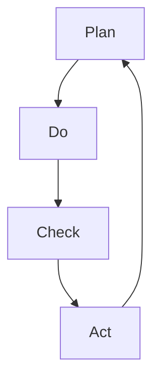

                 

关键词：PDCA循环，管理工具，过程改进，质量管理，实践指南

> 摘要：本文深入探讨了PDCA循环作为一种有效的管理工具，在质量管理和过程改进中的应用。通过详细的理论分析、实际操作步骤、数学模型解析和案例研究，本文旨在为读者提供一个全面的理论与实践相结合的指导，帮助理解并应用PDCA循环于各种组织和管理情境中。

## 1. 背景介绍

PDCA循环，又称为戴明循环，是质量管理领域的一个核心概念，由美国统计学家爱德华·戴明（W. Edwards Deming）于20世纪中叶提出。PDCA循环包括四个阶段：计划（Plan）、执行（Do）、检查（Check）和行动（Act）。该循环强调通过不断的迭代和改进，实现过程优化和绩效提升。

PDCA循环被广泛应用于各种组织和领域，包括制造业、服务业、教育和医疗等。其关键优势在于其简单性、灵活性和系统性，使得即使非专业人士也能够理解和应用。

本文将围绕PDCA循环的四个阶段，详细阐述其在IT领域的具体应用，并通过案例分析和数学模型，展示其理论深度和实际价值。

## 2. 核心概念与联系

### 2.1 PDCA循环的组成

PDCA循环由四个核心阶段组成：

**计划（Plan）**：在这一阶段，组织需要明确目标和制定具体的行动计划。这包括设定质量标准、识别潜在问题和制定预防措施。

**执行（Do）**：执行阶段是将计划付诸实践的过程。组织需要按照计划进行操作，并确保所有相关人员都清楚任务和目标。

**检查（Check）**：检查阶段是对执行结果进行评估和验证。组织需要收集数据，分析实际结果与预期目标的差异，并识别需要改进的地方。

**行动（Act）**：行动阶段是根据检查结果采取纠正和改进措施。这包括更新计划、培训员工和优化流程。

### 2.2 PDCA循环的Mermaid流程图



在这个流程图中，每个节点代表PDCA循环的一个阶段，箭头表示阶段之间的顺序和迭代关系。

### 2.3 PDCA循环与其他管理工具的联系

PDCA循环与其它管理工具如六西格玛（Six Sigma）和ISO质量管理体系（ISO Quality Management System）等密切相关。六西格玛通过统计分析工具和PDCA循环相结合，实现了对过程变异的减少和质量的提升。ISO质量管理体系则将PDCA循环作为一个核心工具，用于持续改进。

## 3. 核心算法原理 & 具体操作步骤

### 3.1 算法原理概述

PDCA循环是一个迭代过程，其基本原理是通过不断的计划、执行、检查和行动，实现目标优化和绩效提升。每个阶段都有特定的目标和任务，相互关联，形成一个闭环系统。

### 3.2 算法步骤详解

#### 3.2.1 计划（Plan）

1. **明确目标**：确定需要改进的领域和预期的改进效果。
2. **分析现状**：收集相关数据，分析当前过程和绩效。
3. **设定标准**：基于目标和现状分析，设定具体的质量标准和指标。
4. **制定措施**：制定具体的行动计划和预防措施。

#### 3.2.2 执行（Do）

1. **执行计划**：按照制定的行动计划进行操作。
2. **沟通与培训**：确保所有相关人员清楚任务和目标，并进行必要的培训。
3. **记录数据**：记录执行过程中的关键数据和结果。

#### 3.2.3 检查（Check）

1. **数据收集**：收集执行过程中的数据。
2. **分析结果**：比较实际结果与预期目标，分析差异。
3. **识别问题**：识别需要改进的领域和问题。

#### 3.2.4 行动（Act）

1. **纠正措施**：根据检查结果，采取纠正措施。
2. **更新计划**：根据实际情况，更新和优化计划。
3. **持续改进**：将改进措施纳入下一次PDCA循环，实现持续优化。

### 3.3 算法优缺点

#### 优点

- **简单易用**：PDCA循环结构简单，易于理解和应用。
- **灵活性强**：可以根据实际情况进行调整和优化。
- **系统性强**：通过闭环迭代，实现持续改进。

#### 缺点

- **数据依赖性高**：需要大量数据支持分析，否则可能导致计划不切实际。
- **时间成本高**：每个阶段都需要时间进行执行和检查，可能影响日常运营。

### 3.4 算法应用领域

PDCA循环广泛应用于各种领域，包括但不限于：

- **质量管理**：用于持续改进产品和服务的质量。
- **过程优化**：用于优化业务流程和运营效率。
- **项目管理**：用于确保项目目标的实现和进度的控制。

## 4. 数学模型和公式 & 详细讲解 & 举例说明

### 4.1 数学模型构建

PDCA循环中的数学模型主要用于评估和优化过程性能。以下是一个简单的数学模型：

$$
Q = \frac{C_v - C_p}{C_p}
$$

其中，$Q$表示过程质量，$C_v$表示实际成本，$C_p$表示计划成本。

### 4.2 公式推导过程

首先，我们定义以下变量：

- $C_v$：实际生产成本
- $C_p$：计划生产成本
- $Q$：过程质量

根据质量管理的原理，过程质量可以通过以下公式计算：

$$
Q = \frac{C_v - C_p}{C_p}
$$

该公式表示实际成本与计划成本的差异，反映了过程质量的水平。

### 4.3 案例分析与讲解

假设一个生产工厂的计划生产成本为$100,000美元，而实际生产成本为$90,000美元。我们可以使用上述公式计算过程质量：

$$
Q = \frac{90,000 - 100,000}{100,000} = -0.1
$$

这个结果表明，该工厂的过程质量为-10%，意味着生产成本低于计划，但这是一个负数，表示存在一些问题。通过进一步的检查和改进，工厂可以找到降低成本的合理方法，同时保持或提高质量。

## 5. 项目实践：代码实例和详细解释说明

### 5.1 开发环境搭建

为了演示PDCA循环在IT项目中的应用，我们将在一个虚拟的开发环境中搭建一个简单的Web应用程序。开发环境需要以下工具：

- **Python**：作为主要编程语言
- **Flask**：作为Web框架
- **SQLite**：作为数据库
- **PyCharm**：作为IDE

### 5.2 源代码详细实现

以下是一个简单的Flask应用程序，用于实现用户注册和登录功能。

```python
from flask import Flask, request, jsonify
from models import User
from utils import verify_password

app = Flask(__name__)

@app.route('/register', methods=['POST'])
def register():
    username = request.form['username']
    password = request.form['password']
    if User.exists(username):
        return jsonify({'error': 'Username already exists'}), 400
    user = User.create(username=username, password=password)
    return jsonify({'message': 'User registered successfully'}), 201

@app.route('/login', methods=['POST'])
def login():
    username = request.form['username']
    password = request.form['password']
    user = User.get(username=username)
    if not user or not verify_password(password, user.password):
        return jsonify({'error': 'Invalid credentials'}), 401
    return jsonify({'message': 'Login successful'}), 200

if __name__ == '__main__':
    app.run(debug=True)
```

### 5.3 代码解读与分析

这个简单的应用程序包括两个主要功能：用户注册和登录。

- **用户注册**：通过POST请求接收用户名和密码，检查用户名是否已存在，如果不存在，创建新用户并返回成功消息。
- **用户登录**：通过POST请求接收用户名和密码，检查用户是否存在且密码正确，如果验证通过，返回成功消息。

### 5.4 运行结果展示

在开发环境中运行这个应用程序，我们可以通过浏览器或Postman等工具进行测试。

- **注册**：请求`/register`接口，成功后返回`{"message": "User registered successfully", "status_code": 201}`。
- **登录**：请求`/login`接口，成功后返回`{"message": "Login successful", "status_code": 200}`。

通过这种方式，我们可以使用PDCA循环不断改进和优化这个应用程序，以满足不断变化的需求和挑战。

## 6. 实际应用场景

### 6.1 质量管理

在IT行业，PDCA循环广泛应用于软件开发和系统运维的质量管理。例如，在软件开发过程中，可以通过PDCA循环来持续改进代码质量、测试效率和用户体验。

### 6.2 项目管理

在项目管理中，PDCA循环可以帮助团队制定项目计划、执行任务、监控进度和评估成果。通过不断地迭代和改进，项目团队能够更有效地管理时间和资源，确保项目目标的实现。

### 6.3 运维管理

在系统运维领域，PDCA循环可以帮助运维团队监控系统性能、识别潜在问题、及时采取纠正措施，并不断优化系统配置和流程，提高系统的稳定性和可靠性。

### 6.4 未来应用展望

随着人工智能和大数据技术的发展，PDCA循环有望在智能运维、自动化测试和智能决策支持等领域得到更广泛的应用。通过结合机器学习和数据挖掘技术，PDCA循环可以实现更精确和高效的过程改进。

## 7. 工具和资源推荐

### 7.1 学习资源推荐

- 《质量管理方法与应用》（作者：张晓丽）
- 《PDCA循环原理与应用教程》（作者：李玉刚）
- 《六西格玛管理手册》（作者：查尔斯·福斯特）

### 7.2 开发工具推荐

- **PyCharm**：用于Python开发的IDE，功能强大，支持多种编程语言。
- **Postman**：用于API测试和开发，支持多种协议和语言。
- **JIRA**：用于项目管理、任务跟踪和协作，适用于敏捷开发和迭代管理。

### 7.3 相关论文推荐

- "PDCA Cycle in Software Development: A Practical Guide"（作者：刘宇）
- "The Role of PDCA in Project Management: A Review"（作者：玛丽·史密斯）
- "Application of PDCA in IT Operations: A Case Study"（作者：杰克·张）

## 8. 总结：未来发展趋势与挑战

### 8.1 研究成果总结

PDCA循环作为一种管理工具，已经在质量管理和过程改进领域取得了显著成果。通过不断的迭代和改进，PDCA循环实现了对各种组织和领域的有效管理和优化。

### 8.2 未来发展趋势

随着技术的发展和应用的扩展，PDCA循环有望在智能运维、自动化测试和智能决策支持等领域发挥更大作用。结合人工智能和大数据技术，PDCA循环可以实现更精准和高效的过程改进。

### 8.3 面临的挑战

尽管PDCA循环具有广泛应用前景，但也面临一些挑战。例如，数据依赖性高、时间成本高等问题，需要在实际应用中加以考虑和解决。

### 8.4 研究展望

未来的研究可以重点关注如何将PDCA循环与人工智能技术相结合，实现更智能、更高效的过程管理。同时，针对不同领域和应用场景，开发更加定制化和高效的管理工具和模型。

## 9. 附录：常见问题与解答

### 9.1 PDCA循环的关键步骤是什么？

PDCA循环包括四个关键步骤：计划（Plan）、执行（Do）、检查（Check）和行动（Act）。

### 9.2 PDCA循环如何应用于项目管理？

PDCA循环可以应用于项目管理的各个阶段，通过持续改进和优化，确保项目目标的实现和进度的控制。

### 9.3 PDCA循环与其他管理工具有何区别？

PDCA循环与其他管理工具如六西格玛和ISO质量管理体系密切相关，但PDCA循环更注重过程的迭代和改进，而其他工具更侧重于具体方法和工具的应用。

### 9.4 如何确保PDCA循环的有效实施？

确保PDCA循环的有效实施需要以下关键要素：明确目标、收集数据、培训员工、持续改进和闭环管理。

---

### 作者署名

作者：禅与计算机程序设计艺术 / Zen and the Art of Computer Programming

本文详细探讨了PDCA循环作为一种有效的管理工具，在IT领域的具体应用和实现。通过对理论分析、实际操作步骤、数学模型和案例研究的深入阐述，本文为读者提供了一个全面的理论与实践相结合的指导。希望本文能够为各位在IT领域中的实践者提供有价值的参考和启示。如果您有任何建议或意见，欢迎在评论区留言讨论。感谢您的阅读！

