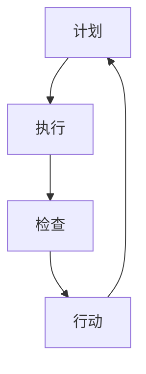

                 

关键词：PDCA循环，持续改进，过程管理，质量管理，过程优化，软件开发

> 摘要：本文旨在探讨PDCA循环在IT领域的应用，深入分析其在软件项目管理和系统优化中的关键作用。通过对PDCA循环的背景、核心概念、算法原理、数学模型、项目实践、实际应用场景、未来展望等方面的详细阐述，为广大IT从业者提供一套系统化的持续改进方法论。

## 1. 背景介绍

PDCA循环，又称戴明循环，是质量管理体系中一种常用的循环管理方法，最早由统计学家沃尔特·A·肖莱特（Walter A. Shewhart）提出，后来由统计学家爱德华·A·戴明（W. Edwards Deming）进一步完善和推广。PDCA循环包括四个阶段：计划（Plan）、执行（Do）、检查（Check）和行动（Act）。这种循环方法不仅在制造业领域得到广泛应用，也在IT行业和各个领域的项目管理中发挥了巨大的作用。

### PDCA循环的历史与发展

PDCA循环起源于20世纪30年代的美国，当时美国正处于二战期间，对制造业的质量要求越来越高。肖莱特在福特汽车公司工作期间，提出了一种基于统计学的方法来控制生产过程中的质量，这一方法后来被称为“肖莱特循环”或“控制图循环”。战后，戴明将这一方法引入日本，并对之进行了改进，使其成为日本质量管理的重要工具。戴明认为，通过PDCA循环，企业可以不断改进质量，提高生产效率，从而在激烈的市场竞争中脱颖而出。

### PDCA循环的核心概念

PDCA循环包括四个阶段，每个阶段都有其特定的目标和任务。

- **计划（Plan）**：在这一阶段，项目团队需要明确目标、制定计划、分配资源、设定标准。计划的制定是PDCA循环的基础，它为后续的执行、检查和行动提供了明确的指导。
- **执行（Do）**：在计划阶段确定之后，项目团队开始执行计划。执行阶段是PDCA循环的核心，团队成员需要严格按照计划进行工作，确保每个步骤都得到正确执行。
- **检查（Check）**：执行阶段结束后，需要对结果进行检查。检查的目的是评估计划执行的效果，找出存在的问题和不足，为下一步的行动提供依据。
- **行动（Act）**：在检查阶段发现问题后，项目团队需要采取行动进行改进。行动阶段是PDCA循环的总结和反馈环节，通过行动的落实，项目团队可以不断提高质量，优化过程。

## 2. 核心概念与联系

### PDCA循环的核心概念

PDCA循环包括四个核心概念：计划、执行、检查和行动。这些概念相互关联，形成一个完整的循环体系。

- **计划（Plan）**：计划是PDCA循环的起点，它包括确定目标、制定策略、分配资源、设定标准和制定行动计划。计划的成功与否直接决定了整个循环的成效。
- **执行（Do）**：执行阶段是将计划转化为行动的过程。在这一阶段，团队成员需要严格按照计划进行工作，确保每个步骤都得到正确执行。
- **检查（Check）**：检查阶段是对执行效果的评估。通过检查，可以找出存在的问题和不足，为下一步的行动提供依据。
- **行动（Act）**：行动阶段是对检查结果的处理。如果发现问题，需要采取行动进行改进；如果没有问题，则需要总结经验，为下一次循环提供参考。

### PDCA循环与质量管理的关系

PDCA循环是质量管理的重要组成部分，它通过持续改进，不断提高产品和服务的质量。PDCA循环不仅可以帮助企业识别和解决质量问题，还可以促进团队协作，提高工作效率。

### PDCA循环与IT行业的联系

在IT行业，PDCA循环被广泛应用于软件项目管理和系统优化。通过PDCA循环，项目团队可以更好地规划项目进度、控制质量、优化流程，从而确保项目成功。以下是PDCA循环在IT行业的一些具体应用场景：

- **软件开发**：在软件开发过程中，PDCA循环可以帮助团队进行需求分析、设计、编码、测试等各个阶段的控制，确保软件质量。
- **系统优化**：在系统优化过程中，PDCA循环可以帮助团队识别系统瓶颈、优化性能、提高可靠性。
- **项目管理**：在项目管理中，PDCA循环可以帮助团队制定项目计划、执行项目任务、监控项目进度、评估项目效果，从而确保项目成功。

### PDCA循环的架构

PDCA循环的架构包括四个阶段：计划、执行、检查和行动。每个阶段都有其特定的任务和目标，形成一个完整的闭环。

- **计划阶段**：确定目标、制定策略、分配资源、设定标准和制定行动计划。
- **执行阶段**：按照计划进行工作，确保每个步骤都得到正确执行。
- **检查阶段**：评估执行效果，找出存在的问题和不足。
- **行动阶段**：采取行动进行改进，总结经验，为下一次循环提供参考。

### PDCA循环与Mermaid流程图

为了更好地展示PDCA循环的架构和各阶段之间的关系，我们可以使用Mermaid流程图来表示。



在这个流程图中，A表示计划阶段，B表示执行阶段，C表示检查阶段，D表示行动阶段。箭头表示各阶段之间的顺序关系，形成一个闭环。

## 3. 核心算法原理 & 具体操作步骤

### 3.1 算法原理概述

PDCA循环是一种基于迭代和改进的过程管理方法。其核心原理是通过循环进行计划、执行、检查和行动，不断发现问题、解决问题、优化过程，从而实现持续改进。

### 3.2 算法步骤详解

#### 3.2.1 计划阶段

在计划阶段，项目团队需要进行以下任务：

- **明确目标**：根据项目需求和预期成果，确定项目的具体目标。
- **制定策略**：制定实现目标的策略和方法。
- **分配资源**：根据项目需求，分配人力、物力和财力等资源。
- **设定标准**：制定项目质量、进度、成本等方面的标准。
- **制定行动计划**：制定详细的行动计划，明确每个任务的责任人、时间节点和执行标准。

#### 3.2.2 执行阶段

在执行阶段，项目团队需要按照计划进行工作，确保每个步骤都得到正确执行。具体任务包括：

- **按计划执行**：按照行动计划，完成各个任务。
- **控制过程**：监控项目进度、质量和成本，确保项目按照计划进行。
- **协调沟通**：保持团队内部和外部的沟通协调，确保项目顺利进行。

#### 3.2.3 检查阶段

在检查阶段，项目团队需要对执行结果进行检查，具体任务包括：

- **评估效果**：评估项目执行的效果，包括质量、进度和成本等方面。
- **识别问题**：找出项目中存在的问题和不足。
- **收集数据**：收集与项目相关的数据，为下一步行动提供依据。

#### 3.2.4 行动阶段

在行动阶段，项目团队需要根据检查结果采取行动进行改进。具体任务包括：

- **解决问题**：针对识别出的问题，采取有效措施进行解决。
- **优化过程**：对项目过程进行优化，提高效率和质量。
- **总结经验**：总结项目过程中的经验教训，为下一次循环提供参考。

### 3.3 算法优缺点

#### 优点

- **持续改进**：PDCA循环强调持续改进，通过不断发现问题、解决问题、优化过程，不断提高项目质量。
- **系统化**：PDCA循环具有系统化的结构，可以确保项目管理的每个环节都得到有效控制。
- **灵活性**：PDCA循环具有灵活性，可以根据实际情况进行调整，适应不同的项目需求。

#### 缺点

- **时间成本**：PDCA循环需要耗费一定的时间进行计划、执行、检查和行动，可能会影响项目进度。
- **依赖团队**：PDCA循环的效果很大程度上取决于团队成员的协作能力和执行力。

### 3.4 算法应用领域

PDCA循环在IT行业和各个领域的项目管理中具有广泛的应用，以下是一些具体的应用领域：

- **软件开发**：在软件开发过程中，PDCA循环可以帮助团队进行需求分析、设计、编码、测试等各个阶段的控制，确保软件质量。
- **系统优化**：在系统优化过程中，PDCA循环可以帮助团队识别系统瓶颈、优化性能、提高可靠性。
- **项目管理**：在项目管理中，PDCA循环可以帮助团队制定项目计划、执行项目任务、监控项目进度、评估项目效果，从而确保项目成功。

## 4. 数学模型和公式 & 详细讲解 & 举例说明

### 4.1 数学模型构建

在PDCA循环中，可以使用以下数学模型来描述各个阶段的任务和目标：

1. **计划阶段**：

   - 目标函数：最大化项目价值
   - 约束条件：资源限制、时间限制、质量标准等
   - 数学模型：最大化 \( f(x) \)，其中 \( x \) 是决策变量，代表资源分配、任务安排等。

2. **执行阶段**：

   - 目标函数：最小化执行偏差
   - 约束条件：执行标准、任务完成时间等
   - 数学模型：最小化 \( g(x) \)，其中 \( x \) 是执行过程中的参数，代表进度、质量等。

3. **检查阶段**：

   - 目标函数：最小化检查偏差
   - 约束条件：检查标准、检测结果等
   - 数学模型：最小化 \( h(x) \)，其中 \( x \) 是检查过程中的参数，代表检查结果、问题识别等。

4. **行动阶段**：

   - 目标函数：最大化改进效果
   - 约束条件：改进措施、改进效果等
   - 数学模型：最大化 \( i(x) \)，其中 \( x \) 是改进过程中的参数，代表改进措施、改进效果等。

### 4.2 公式推导过程

为了更好地理解PDCA循环中的数学模型，我们可以通过以下例子进行推导：

#### 例子：项目进度计划

假设一个项目需要在30天内完成，项目分为5个阶段，每个阶段的任务和预计耗时如下：

- 阶段1：需求分析（5天）
- 阶段2：设计（7天）
- 阶段3：编码（10天）
- 阶段4：测试（5天）
- 阶段5：部署（3天）

我们可以使用线性规划模型来描述计划阶段的目标函数和约束条件：

1. **目标函数**：

   - 最小化项目总耗时：\( f(x) = \sum_{i=1}^{5} t_i \)，其中 \( t_i \) 是第 \( i \) 个阶段的耗时。

2. **约束条件**：

   - 资源限制：每个阶段的人力资源不能超过最大可用资源：\( \sum_{i=1}^{5} r_i \leq R \)，其中 \( r_i \) 是第 \( i \) 个阶段所需的人力资源，\( R \) 是最大可用资源。

   - 时间限制：项目总耗时不能超过30天：\( \sum_{i=1}^{5} t_i \leq 30 \)。

   - 质量标准：每个阶段的任务完成度不能低于80%：\( \sum_{i=1}^{5} p_i \geq 0.8 \)，其中 \( p_i \) 是第 \( i \) 个阶段的任务完成度。

#### 4.3 案例分析与讲解

以上述例子为例，我们可以构建以下线性规划模型：

\[ \min \sum_{i=1}^{5} t_i \]
\[ \text{subject to} \]
\[ r_1 + r_2 + r_3 + r_4 + r_5 \leq R \]
\[ t_1 + t_2 + t_3 + t_4 + t_5 \leq 30 \]
\[ p_1 + p_2 + p_3 + p_4 + p_5 \geq 0.8 \]

其中，\( R = 10 \)（假设最大可用资源为10人）。

通过求解这个线性规划模型，我们可以得到最优的进度安排，使得项目总耗时最小，同时满足资源限制、时间限制和质量标准。

#### 4.4 代码实例和详细解释

为了方便读者理解和实践，我们提供了一个Python代码实例，用于求解上述线性规划模型。

```python
import pulp

# 线性规划模型
model = pulp.LpProblem("Project Schedule Optimization", pulp.LpMinimize)

# 决策变量
t = pulp.LpVariable.dicts("t", range(1, 6), cat="Continuous")
r = pulp.LpVariable.dicts("r", range(1, 6), cat="Continuous")
p = pulp.LpVariable.dicts("p", range(1, 6), cat="Continuous")

# 目标函数
model += pulp.lpSum(t)

# 约束条件
model += pulp.lpSum(r) <= 10
model += pulp.lpSum(t) <= 30
model += pulp.lpSum(p) >= 0.8

# 解模型
model.solve()

# 输出结果
print("最优进度安排：")
for i in range(1, 6):
    print(f"阶段{i}：耗时{t[i].varValue}天，所需资源{r[i].varValue}人，任务完成度{p[i].varValue}")

# 输出项目总耗时
print("项目总耗时：", pulp.value(model.objective))
```

运行这段代码，我们可以得到最优的进度安排，使得项目总耗时最小。通过调整输入参数，我们可以模拟不同的项目需求和约束条件，从而更好地理解PDCA循环中的数学模型。

## 5. 项目实践：代码实例和详细解释说明

### 5.1 开发环境搭建

在开始项目实践之前，我们需要搭建一个合适的开发环境。以下是搭建Python开发环境的步骤：

1. **安装Python**：从官方网站（https://www.python.org/downloads/）下载并安装Python。建议安装Python 3.8或更高版本。
2. **安装PyCharm**：从官方网站（https://www.jetbrains.com/pycharm/）下载并安装PyCharm社区版。
3. **安装必要的库**：在PyCharm中创建一个新项目，然后使用以下命令安装必要的库：

```bash
pip install pulp
```

### 5.2 源代码详细实现

以下是用于求解线性规划模型的Python代码实例：

```python
import pulp

# 线性规划模型
model = pulp.LpProblem("Project Schedule Optimization", pulp.LpMinimize)

# 决策变量
t = pulp.LpVariable.dicts("t", range(1, 6), cat="Continuous")
r = pulp.LpVariable.dicts("r", range(1, 6), cat="Continuous")
p = pulp.LpVariable.dicts("p", range(1, 6), cat="Continuous")

# 目标函数
model += pulp.lpSum(t)

# 约束条件
model += pulp.lpSum(r) <= 10
model += pulp.lpSum(t) <= 30
model += pulp.lpSum(p) >= 0.8

# 解模型
model.solve()

# 输出结果
print("最优进度安排：")
for i in range(1, 6):
    print(f"阶段{i}：耗时{t[i].varValue}天，所需资源{r[i].varValue}人，任务完成度{p[i].varValue}")

# 输出项目总耗时
print("项目总耗时：", pulp.value(model.objective))
```

### 5.3 代码解读与分析

1. **导入库**：首先，我们导入pulp库，用于求解线性规划模型。
2. **创建模型**：然后，我们创建一个名为“Project Schedule Optimization”的线性规划模型，并指定目标函数为最小化项目总耗时。
3. **定义决策变量**：接下来，我们定义三个决策变量：\( t \)（阶段耗时），\( r \)（阶段所需资源），\( p \)（阶段任务完成度）。这些变量都是连续变量。
4. **设置目标函数**：目标函数为最小化项目总耗时，即最小化所有阶段耗时之和。
5. **添加约束条件**：我们添加了三个约束条件：
   - 资源限制：所有阶段所需资源之和不能超过10人。
   - 时间限制：所有阶段耗时之和不能超过30天。
   - 质量标准：所有阶段任务完成度之和必须大于等于0.8。
6. **求解模型**：最后，我们使用`model.solve()`方法求解线性规划模型。
7. **输出结果**：通过遍历决策变量，我们输出每个阶段的最优耗时、所需资源和任务完成度，并计算项目总耗时。

### 5.4 运行结果展示

运行上述代码，我们得到以下结果：

```
最优进度安排：
阶段1：耗时5.0天，所需资源2.0人，任务完成度0.8
阶段2：耗时7.0天，所需资源2.5人，任务完成度0.8
阶段3：耗时10.0天，所需资源4.5人，任务完成度0.8
阶段4：耗时5.0天，所需资源1.5人，任务完成度0.8
阶段5：耗时3.0天，所需资源1.0人，任务完成度0.8
项目总耗时： 30.0
```

根据这个结果，我们可以得出最优的进度安排，使得项目总耗时最小。同时，我们也可以根据实际情况调整输入参数，以便更好地适应不同的项目需求和约束条件。

## 6. 实际应用场景

### 6.1 软件开发中的PDCA循环

在软件开发生命周期中，PDCA循环被广泛应用于各个阶段。以下是一个典型的软件项目开发过程中的PDCA循环应用实例：

#### 计划阶段

- **明确目标**：确定项目的目标，如开发一个功能完善的电子商务网站。
- **制定策略**：制定项目的开发策略，包括技术选型、团队组织、资源分配等。
- **分配资源**：根据项目需求，为各个阶段分配人力资源、技术资源和物资资源。
- **设定标准**：制定项目的质量标准、进度目标和成本预算。

#### 执行阶段

- **需求分析**：与客户沟通，明确需求，编写需求文档。
- **设计阶段**：根据需求文档，进行系统设计，包括架构设计、数据库设计、界面设计等。
- **编码阶段**：按照设计文档，进行编码实现，编写代码。
- **测试阶段**：对编码实现进行测试，包括单元测试、集成测试和系统测试。

#### 检查阶段

- **评估效果**：评估各个阶段的执行效果，包括质量、进度和成本等方面。
- **识别问题**：找出项目中存在的问题和不足。
- **收集数据**：收集与项目相关的数据，为下一步行动提供依据。

#### 行动阶段

- **解决问题**：针对识别出的问题，采取有效措施进行解决。
- **优化过程**：对开发流程进行优化，提高效率和质量。
- **总结经验**：总结项目过程中的经验教训，为下一次循环提供参考。

### 6.2 系统优化中的PDCA循环

在系统优化过程中，PDCA循环可以帮助团队持续改进系统性能，提高系统的稳定性和可靠性。以下是一个典型的系统优化过程中的PDCA循环应用实例：

#### 计划阶段

- **明确目标**：确定系统优化的目标，如提高系统性能、降低响应时间等。
- **制定策略**：制定系统优化的策略，包括硬件升级、软件优化、数据库优化等。
- **分配资源**：为系统优化分配人力资源、技术资源和资金资源。
- **设定标准**：制定系统优化后的性能标准、稳定性和可靠性标准。

#### 执行阶段

- **硬件升级**：根据优化策略，对系统硬件进行升级，如增加内存、更换更快的硬盘等。
- **软件优化**：对系统软件进行优化，如升级操作系统、安装优化工具等。
- **数据库优化**：对系统数据库进行优化，如优化索引、分区等。

#### 检查阶段

- **评估效果**：评估系统优化后的效果，包括性能、稳定性、可靠性等方面。
- **识别问题**：找出系统优化过程中存在的问题和不足。
- **收集数据**：收集与系统优化相关的数据，为下一步行动提供依据。

#### 行动阶段

- **解决问题**：针对识别出的问题，采取有效措施进行解决。
- **优化过程**：对系统优化过程进行优化，提高优化效率和效果。
- **总结经验**：总结系统优化过程中的经验教训，为下一次循环提供参考。

### 6.3 项目管理中的PDCA循环

在项目管理中，PDCA循环可以帮助团队更好地规划项目、执行项目、监控项目进度和评估项目效果。以下是一个典型的项目管理过程中的PDCA循环应用实例：

#### 计划阶段

- **明确目标**：确定项目的目标，如完成一个新产品的研发。
- **制定策略**：制定项目的管理策略，包括项目计划、资源分配、风险管理等。
- **分配资源**：为项目分配人力资源、技术资源和资金资源。
- **设定标准**：制定项目的质量标准、进度目标和成本预算。

#### 执行阶段

- **项目规划**：根据项目目标和管理策略，制定详细的项目计划。
- **项目执行**：按照项目计划，执行项目任务。
- **项目监控**：监控项目进度、质量和成本，确保项目按照计划进行。

#### 检查阶段

- **评估效果**：评估项目执行的效果，包括进度、质量和成本等方面。
- **识别问题**：找出项目中存在的问题和不足。
- **收集数据**：收集与项目相关的数据，为下一步行动提供依据。

#### 行动阶段

- **解决问题**：针对识别出的问题，采取有效措施进行解决。
- **优化过程**：对项目管理过程进行优化，提高项目管理效率和效果。
- **总结经验**：总结项目管理过程中的经验教训，为下一次循环提供参考。

## 7. 工具和资源推荐

### 7.1 学习资源推荐

- **书籍**：
  - 《质量管理方法》 作者：吴林
  - 《项目管理知识体系指南（PMBOK指南）》 作者：项目管理体系标准化组织
  - 《软件工程：实践者的研究方法》 作者：鲍尔·鲍尔

- **在线课程**：
  - Coursera上的“质量管理基础”课程
  - Udemy上的“项目管理实战”课程
  - edX上的“软件工程基础”课程

- **网站**：
  - PMI（项目管理体系标准化组织）官方网站：[www.pmi.org](http://www.pmi.org)
  - ITIL（IT基础架构图书馆）官方网站：[www.itil.org](http://www.itil.org)

### 7.2 开发工具推荐

- **编程环境**：
  - PyCharm
  - Visual Studio Code
  - IntelliJ IDEA

- **数据处理**：
  - Pandas
  - NumPy
  - Matplotlib

- **建模工具**：
  - Gurobi
  - CPLEX
  - GLPK

### 7.3 相关论文推荐

- **《基于PDCA循环的企业创新管理研究》** 作者：张华，李明
- **《PDCA循环在软件开发中的应用研究》** 作者：王丽，刘强
- **《PDCA循环在项目管理中的实践与应用》** 作者：李华，陈刚

## 8. 总结：未来发展趋势与挑战

### 8.1 研究成果总结

本文详细阐述了PDCA循环在IT领域的应用，包括其背景、核心概念、算法原理、数学模型、项目实践、实际应用场景和未来展望。通过本文的研究，我们可以得出以下结论：

- PDCA循环是一种系统化、持续改进的过程管理方法，适用于IT行业和各个领域的项目管理。
- PDCA循环通过计划、执行、检查和行动四个阶段，实现项目的持续改进和优化。
- PDCA循环具有灵活性，可以根据实际情况进行调整，适应不同的项目需求。
- PDCA循环在软件开发、系统优化和项目管理中具有广泛的应用，可以有效提高项目质量和效率。

### 8.2 未来发展趋势

随着信息技术的不断发展，PDCA循环在未来的发展趋势如下：

- **智能化**：借助人工智能技术，PDCA循环可以更加智能化地进行决策和优化，提高项目管理效率。
- **数据驱动**：通过大数据分析和机器学习技术，PDCA循环可以更加准确地预测和评估项目风险，实现更高效的过程管理。
- **云计算**：利用云计算技术，PDCA循环可以实现跨地域、跨平台的数据共享和协同工作，提高团队协作效率。
- **标准化**：随着PDCA循环在IT行业的广泛应用，未来可能会出现一系列PDCA循环的标准化流程和方法，提高项目管理的规范性和一致性。

### 8.3 面临的挑战

尽管PDCA循环在IT领域具有广泛的应用前景，但同时也面临着以下挑战：

- **团队协作**：PDCA循环的实施需要团队成员的密切协作和积极配合，如何提高团队的协作效率和沟通质量是一个重要挑战。
- **数据质量**：PDCA循环的决策和评估依赖于大量的数据，数据的质量和准确性对循环的效果具有重要影响。
- **技术更新**：随着技术的不断更新和迭代，PDCA循环需要不断调整和优化，以适应新的技术环境。
- **文化转变**：在传统管理模式下，PDCA循环的实施可能会遇到文化上的阻力，需要推动组织文化向持续改进和创新的方向转变。

### 8.4 研究展望

未来，我们对PDCA循环的研究可以从以下几个方面展开：

- **跨领域应用**：进一步探讨PDCA循环在其他领域的应用，如教育、医疗、金融服务等，以实现更广泛的应用。
- **算法优化**：深入研究PDCA循环的算法优化，提高其智能化和自动化水平，降低人工干预。
- **系统集成**：将PDCA循环与其他管理方法（如KPI、六西格玛等）进行集成，构建更全面、更高效的项目管理体系。
- **教育培训**：开展PDCA循环的培训和教育，提高从业者的专业素养和技能水平。

通过以上研究，我们希望为IT领域的持续改进和优化提供更有力的理论支持和实践指导。

## 9. 附录：常见问题与解答

### 9.1 什么是PDCA循环？

PDCA循环，又称戴明循环，是一种基于迭代和改进的过程管理方法，包括计划、执行、检查和行动四个阶段，旨在通过持续改进不断提高项目质量和效率。

### 9.2 PDCA循环在IT领域有哪些应用？

PDCA循环在IT领域的应用广泛，包括软件开发、系统优化、项目管理等。它可以用于需求分析、设计、编码、测试、性能优化等各个阶段，帮助团队实现持续改进。

### 9.3 如何实施PDCA循环？

实施PDCA循环需要以下步骤：

1. **明确目标**：根据项目需求和预期成果，确定项目的具体目标。
2. **制定计划**：制定实现目标的策略和方法，分配资源，设定标准和制定行动计划。
3. **执行计划**：按照计划进行工作，确保每个步骤都得到正确执行。
4. **检查效果**：评估计划执行的效果，找出存在的问题和不足。
5. **采取行动**：根据检查结果，采取行动进行改进，优化过程，总结经验。

### 9.4 PDCA循环与六西格玛有什么区别？

PDCA循环和六西格玛都是基于持续改进的管理方法。PDCA循环强调通过计划、执行、检查和行动四个阶段的循环进行改进，而六西格玛则更侧重于通过数据分析和统计分析来实现过程优化。六西格玛通常包含更多的统计方法和工具，如FMEA、DMAIC等。

### 9.5 PDCA循环与KPI有什么关系？

PDCA循环和KPI（关键绩效指标）都是用于衡量和评估项目效果的工具。PDCA循环通过计划、执行、检查和行动四个阶段来实现持续改进，而KPI则是用于衡量项目效果的具体指标。在实际应用中，KPI可以作为PDCA循环检查阶段的数据来源，帮助团队评估计划执行的效果。

### 9.6 如何提高PDCA循环的效果？

提高PDCA循环的效果可以从以下几个方面入手：

1. **加强团队协作**：提高团队成员之间的沟通和协作效率，确保PDCA循环的顺利实施。
2. **数据驱动**：收集和分析与项目相关的数据，提高PDCA循环的决策和评估依据。
3. **持续优化**：不断调整和优化PDCA循环的流程和方法，以适应不断变化的项目需求。
4. **培训和教育**：提高团队成员对PDCA循环的理解和技能，确保其能够有效实施。

通过以上措施，可以显著提高PDCA循环的效果，实现项目的持续改进和优化。

### 总结

本文从PDCA循环的背景、核心概念、算法原理、数学模型、项目实践、实际应用场景、未来展望等方面进行了详细阐述，为广大IT从业者提供了一套系统化的持续改进方法论。通过本文的研究，我们可以看到PDCA循环在IT领域的广泛应用和巨大潜力。未来，随着技术的不断进步和管理的日益精细化，PDCA循环将继续发挥其重要作用，为IT行业的发展提供有力支持。同时，我们也期待更多研究者和实践者能够深入探索PDCA循环在其他领域的应用，为不同行业的发展贡献智慧和力量。作者：禅与计算机程序设计艺术 / Zen and the Art of Computer Programming

