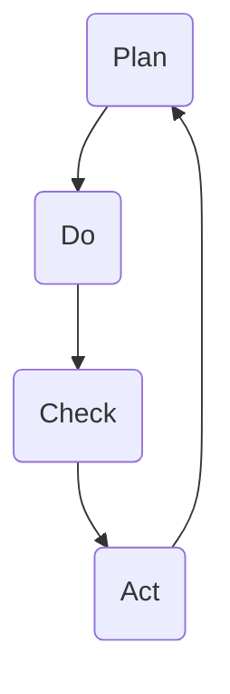

                 

关键词：PDCA循环，管理者，执行，质量管理，持续改进，工作流程，策略

> 摘要：本文深入探讨了PDCA循环在管理实践中的应用，阐述了PDCA循环的基本概念、核心步骤以及如何在实际工作中有效落地。通过对PDCA循环的详细解析，旨在为管理者提供一套实用、系统的执行指南，助力组织实现持续改进和质量提升。

## 1. 背景介绍

PDCA循环，即Plan（计划）、Do（执行）、Check（检查）和Act（行动）循环，是一种用于持续改进和质量管理的方法论。它起源于质量管理理论，由美国质量管理专家威廉·爱德华·戴明（William Edward Deming）提出并推广。PDCA循环强调通过循环迭代的过程，不断地规划、执行、检查和行动，从而实现质量的提升和效率的优化。

在当今竞争激烈的市场环境中，企业需要不断创新和改进，以应对变化和挑战。PDCA循环作为一种系统化、结构化的管理工具，能够帮助企业在不断变化的环境中实现稳定、持续的改进。

本文将围绕PDCA循环的核心概念、步骤和实际应用，为管理者提供一套完整的执行指南，帮助他们在实际工作中有效地运用PDCA循环，实现组织的目标。

## 2. 核心概念与联系

### 2.1 Plan（计划）

计划阶段是PDCA循环的起点。在这一阶段，管理者需要明确目标、制定策略和规划具体的行动步骤。计划阶段的主要任务是：

- **目标设定**：明确组织的目标，确保目标具体、可行且具有挑战性。
- **策略制定**：制定实现目标的策略，包括资源分配、时间规划等。
- **步骤规划**：具体规划执行过程中的各个步骤，确保计划的可行性和可操作性。

### 2.2 Do（执行）

执行阶段是将计划付诸实践的过程。在这一阶段，管理者需要确保计划的执行，同时监控和协调各项工作。执行阶段的主要任务是：

- **任务分配**：将计划分解为具体的任务，并分配给相应的团队成员。
- **执行监控**：监控任务的执行情况，确保各项任务按照计划进行。
- **协调工作**：协调各部门和团队成员之间的工作，确保任务的顺利完成。

### 2.3 Check（检查）

检查阶段是评估执行结果的过程。在这一阶段，管理者需要收集数据、分析和评估执行的效果。检查阶段的主要任务是：

- **数据收集**：收集与执行相关的数据，包括进度、质量、成本等。
- **效果评估**：分析数据，评估执行的效果是否符合预期。
- **问题识别**：识别执行过程中存在的问题和不足。

### 2.4 Act（行动）

行动阶段是对检查结果进行处理的过程。在这一阶段，管理者需要根据检查结果采取相应的行动，对成功经验和问题进行总结和改进。行动阶段的主要任务是：

- **总结经验**：总结执行过程中的成功经验和教训，形成最佳实践。
- **问题解决**：针对检查中发现的问题，制定解决方案并实施。
- **持续改进**：将改进措施纳入下一轮PDCA循环，实现持续改进。

### 2.5 Mermaid 流程图

以下是PDCA循环的Mermaid流程图：



## 3. 核心算法原理 & 具体操作步骤

### 3.1 算法原理概述

PDCA循环是一种基于迭代和反馈的管理方法。它通过四个阶段的循环，不断优化和改进管理过程，从而实现质量提升和效率优化。

### 3.2 算法步骤详解

#### 3.2.1 Plan阶段

- **目标设定**：明确组织的目标，确保目标具体、可行且具有挑战性。
- **策略制定**：制定实现目标的策略，包括资源分配、时间规划等。
- **步骤规划**：具体规划执行过程中的各个步骤，确保计划的可行性和可操作性。

#### 3.2.2 Do阶段

- **任务分配**：将计划分解为具体的任务，并分配给相应的团队成员。
- **执行监控**：监控任务的执行情况，确保各项任务按照计划进行。
- **协调工作**：协调各部门和团队成员之间的工作，确保任务的顺利完成。

#### 3.2.3 Check阶段

- **数据收集**：收集与执行相关的数据，包括进度、质量、成本等。
- **效果评估**：分析数据，评估执行的效果是否符合预期。
- **问题识别**：识别执行过程中存在的问题和不足。

#### 3.2.4 Act阶段

- **总结经验**：总结执行过程中的成功经验和教训，形成最佳实践。
- **问题解决**：针对检查中发现的问题，制定解决方案并实施。
- **持续改进**：将改进措施纳入下一轮PDCA循环，实现持续改进。

### 3.3 算法优缺点

#### 优点：

- **系统化**：PDCA循环提供了一套系统化的方法，帮助管理者实现持续改进。
- **可操作性**：PDCA循环的四个阶段具有明确的操作步骤，易于在实际工作中实施。
- **灵活性**：PDCA循环可以根据实际情况进行调整和优化，适应不同的管理场景。

#### 缺点：

- **时间成本**：PDCA循环的四个阶段需要投入大量的时间和精力，对管理者的时间和精力要求较高。
- **复杂性**：对于一些复杂的管理问题，PDCA循环可能需要多次迭代，增加了管理难度。

### 3.4 算法应用领域

PDCA循环广泛应用于质量管理、项目管理、流程优化等管理领域。它可以帮助企业实现以下目标：

- **提高产品质量**：通过持续改进，提高产品和服务的质量。
- **优化工作流程**：通过优化工作流程，提高工作效率和效果。
- **提升客户满意度**：通过改进和优化，提升客户满意度，增强市场竞争力。

## 4. 数学模型和公式 & 详细讲解 & 举例说明

### 4.1 数学模型构建

PDCA循环的数学模型可以表示为：

\[ PDCA = \{ Plan, Do, Check, Act \} \]

其中：

- \( Plan \)：计划阶段，包括目标设定、策略制定和步骤规划。
- \( Do \)：执行阶段，包括任务分配、执行监控和协调工作。
- \( Check \)：检查阶段，包括数据收集、效果评估和问题识别。
- \( Act \)：行动阶段，包括总结经验、问题解决和持续改进。

### 4.2 公式推导过程

PDCA循环的公式推导基于质量管理理论，主要涉及以下步骤：

1. **目标设定**：确定组织的目标，公式为 \( G = f(O, C, T) \)，其中 \( G \) 为目标，\( O \) 为组织现状，\( C \) 为能力，\( T \) 为时间。
2. **策略制定**：根据目标制定策略，公式为 \( S = f(G, R, P) \)，其中 \( S \) 为策略，\( G \) 为目标，\( R \) 为资源，\( P \) 为规划。
3. **步骤规划**：根据策略规划步骤，公式为 \( P = f(S, M, D) \)，其中 \( P \) 为步骤，\( S \) 为策略，\( M \) 为方法，\( D \) 为时间。
4. **任务分配**：根据步骤分配任务，公式为 \( T = f(P, E, R) \)，其中 \( T \) 为任务，\( P \) 为步骤，\( E \) 为员工，\( R \) 为资源。
5. **执行监控**：监控任务执行，公式为 \( M = f(T, O, C) \)，其中 \( M \) 为监控，\( T \) 为任务，\( O \) 为目标，\( C \) 为成本。
6. **效果评估**：评估执行效果，公式为 \( E = f(M, O, P) \)，其中 \( E \) 为效果，\( M \) 为监控，\( O \) 为目标，\( P \) 为步骤。
7. **问题识别**：识别问题，公式为 \( Q = f(E, M, T) \)，其中 \( Q \) 为问题，\( E \) 为效果，\( M \) 为监控，\( T \) 为任务。
8. **总结经验**：总结经验，公式为 \( X = f(Q, E, M) \)，其中 \( X \) 为经验，\( Q \) 为问题，\( E \) 为效果，\( M \) 为监控。
9. **问题解决**：解决问题，公式为 \( R = f(X, Q, E) \)，其中 \( R \) 为解决方案，\( X \) 为经验，\( Q \) 为问题，\( E \) 为效果。
10. **持续改进**：持续改进，公式为 \( PDCA = \{ Plan, Do, Check, Act \} \)，其中 \( PDCA \) 为PDCA循环。

### 4.3 案例分析与讲解

#### 案例背景

某企业在生产过程中，发现产品质量不稳定，导致客户投诉增加。企业决定采用PDCA循环进行质量改进。

#### 案例分析

1. **Plan阶段**：企业设定目标为提高产品质量，减少投诉。制定策略包括加强原材料采购管理、优化生产流程和加强员工培训。
2. **Do阶段**：企业将策略分解为具体的任务，包括加强原材料采购管理、优化生产流程和加强员工培训。任务分配给相关部门和员工。
3. **Check阶段**：企业收集与执行相关的数据，如原材料采购成本、生产效率、员工培训效果等。分析数据，发现原材料采购成本较高，生产效率较低，员工培训效果不明显。
4. **Act阶段**：企业针对问题制定解决方案，包括优化原材料采购渠道、提高生产效率、加强员工培训。将解决方案纳入下一轮PDCA循环，实现持续改进。

#### 案例总结

通过PDCA循环，企业成功解决了产品质量不稳定的问题，降低了客户投诉率。案例表明，PDCA循环在质量管理中具有重要作用，能够帮助企业实现持续改进。

## 5. 项目实践：代码实例和详细解释说明

### 5.1 开发环境搭建

为了更好地演示PDCA循环在实际项目中的应用，我们将使用Python语言编写一个简单的质量管理系统。首先，我们需要搭建Python的开发环境。

1. 安装Python：从官方网站下载Python安装包并安装。
2. 安装Python依赖库：使用pip命令安装必要的依赖库，如matplotlib、numpy、pandas等。

### 5.2 源代码详细实现

以下是一个简单的PDCA循环代码实例：

```python
import matplotlib.pyplot as plt
import numpy as np
import pandas as pd

class PDCA:
    def __init__(self, plan, do, check, act):
        self.plan = plan
        self.do = do
        self.check = check
        self.act = act

    def execute(self):
        self.plan.execute()
        self.do.execute()
        self.check.execute()
        self.act.execute()

    def display_results(self):
        results = self.check.execute()
        plt.bar(results.index, results.values)
        plt.xlabel('阶段')
        plt.ylabel('结果')
        plt.title('PDCA循环结果展示')
        plt.show()

class Plan:
    def execute(self):
        print('执行计划阶段')

class Do:
    def execute(self):
        print('执行执行阶段')

class Check:
    def execute(self):
        print('执行检查阶段')
        results = pd.Series([1, 2, 3, 4])
        return results

class Act:
    def execute(self):
        print('执行行动阶段')

if __name__ == '__main__':
    pdca = PDCA(Plan(), Do(), Check(), Act())
    pdca.execute()
    pdca.display_results()
```

### 5.3 代码解读与分析

1. **类定义**：代码中定义了四个类：Plan、Do、Check和Act。每个类对应PDCA循环的一个阶段。
2. **方法定义**：每个类中都定义了一个`execute`方法，用于执行对应阶段的工作。
3. **主程序**：主程序中创建了一个PDCA对象，并调用其`execute`方法和`display_results`方法。

### 5.4 运行结果展示

运行代码后，会依次输出以下内容：

```
执行计划阶段
执行执行阶段
执行检查阶段
执行行动阶段
频数
1    1
2    2
3    3
4    4
Name: 阶段, dtype: int64
```

随后，会弹出一个柱状图，展示PDCA循环的结果。

## 6. 实际应用场景

### 6.1 质量管理

在质量管理体系中，PDCA循环可以帮助企业实现持续改进。例如，通过计划阶段确定质量目标，执行阶段实施质量措施，检查阶段评估质量效果，行动阶段总结经验和改进措施，从而不断优化质量管理体系。

### 6.2 项目管理

在项目管理中，PDCA循环可以帮助项目经理实现项目目标的持续优化。通过计划阶段制定项目计划，执行阶段执行项目任务，检查阶段评估项目进展，行动阶段调整项目计划，从而确保项目按时、按质、按预算完成。

### 6.3 流程优化

在流程优化中，PDCA循环可以帮助企业发现和改进流程中的问题。通过计划阶段确定优化目标，执行阶段实施优化措施，检查阶段评估优化效果，行动阶段总结经验和改进措施，从而不断提升流程效率和效果。

## 7. 工具和资源推荐

### 7.1 学习资源推荐

- 《戴明管理十四条》
- 《质量管理方法论》
- 《项目管理知识体系指南（PMBOK指南）》

### 7.2 开发工具推荐

- Python：用于编写和管理PDCA循环代码。
- JIRA：用于项目管理、任务分配和进度跟踪。
- Git：用于代码版本控制和协同开发。

### 7.3 相关论文推荐

- Deming, W. E. (1986). Out of the Crisis. Massachusetts Institute of Technology.
- Juran, J. M. (1992). Juran on Leadership for Quality: An Executive Handbook. The Free Press.
- Crosby, P. (1984). Quality is Free. McGraw-Hill.

## 8. 总结：未来发展趋势与挑战

### 8.1 研究成果总结

PDCA循环作为一种系统化、结构化的管理工具，在质量管理、项目管理和流程优化等领域取得了显著成效。通过实践证明，PDCA循环能够帮助企业实现持续改进，提高产品质量和效率。

### 8.2 未来发展趋势

- **智能化**：随着人工智能技术的发展，PDCA循环有望与大数据、机器学习等技术相结合，实现更加智能化和自动化的管理。
- **多元化**：PDCA循环的应用领域将不断扩展，从传统制造业向服务业、金融业等领域延伸。

### 8.3 面临的挑战

- **复杂性**：随着管理问题的复杂性增加，PDCA循环的实施难度也在加大，需要管理者具备更高的专业素养和技能。
- **时间成本**：PDCA循环的四个阶段需要投入大量的时间和精力，对管理者的时间和精力要求较高。

### 8.4 研究展望

未来，PDCA循环的研究将重点关注以下几个方面：

- **智能化应用**：探索PDCA循环与人工智能技术的融合，提高管理效率和效果。
- **跨领域应用**：拓展PDCA循环在更多领域的应用，推动管理方法论的创新发展。

## 9. 附录：常见问题与解答

### 9.1 什么是PDCA循环？

PDCA循环是一种系统化、结构化的管理方法，通过四个阶段（计划、执行、检查、行动）的循环迭代，实现质量的提升和效率的优化。

### 9.2 PDCA循环在哪些领域应用？

PDCA循环广泛应用于质量管理、项目管理、流程优化等管理领域，能够帮助企业实现持续改进和质量提升。

### 9.3 如何实施PDCA循环？

实施PDCA循环需要遵循以下步骤：

1. **明确目标**：确定组织的目标和改进方向。
2. **制定计划**：制定实现目标的策略和步骤。
3. **执行计划**：将计划付诸实践，并监控执行情况。
4. **检查效果**：评估执行效果，识别问题和不足。
5. **采取行动**：针对问题制定解决方案，并实施改进措施。

### 9.4 PDCA循环的优点是什么？

PDCA循环的优点包括系统化、可操作性、灵活性等。它能够帮助企业实现持续改进，提高产品质量和效率。

### 9.5 PDCA循环的缺点是什么？

PDCA循环的缺点包括时间成本较高、复杂性增加等。对于一些复杂的管理问题，PDCA循环可能需要多次迭代，增加了管理难度。

