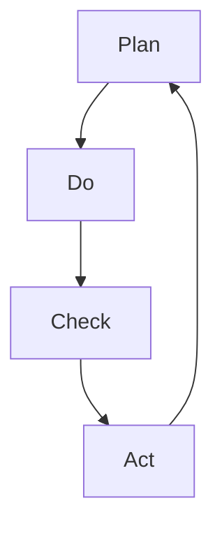

                 

关键词：PDCA循环，质量管理，过程管理，持续改进，执行策略

## 摘要

本文旨在探讨PDCA循环在企业管理中的应用，从其历史背景、核心概念、具体实施步骤、数学模型和实际案例等方面进行深入解析。PDCA循环是一种经典的管理方法，通过计划（Plan）、执行（Do）、检查（Check）和行动（Act）四个阶段的不断循环，帮助企业实现持续改进和高效执行。本文将通过理论讲解和实际案例，帮助读者理解PDCA循环的原理，并学会如何将其应用于企业管理实践中。

## 1. 背景介绍

PDCA循环，又称戴明循环，是以质量管理大师威廉·爱德华·戴明（William Edward Deming）的名字命名的。戴明博士在20世纪中叶提出了PDCA循环理论，旨在帮助企业在质量管理过程中实现持续改进。PDCA循环最早应用于制造业，但随后被广泛运用到各个行业，成为现代管理实践中不可或缺的工具之一。

PDCA循环的核心思想是“持续改进”，即通过不断循环四个阶段的操作，发现并解决问题，从而提高工作效率和质量。这一方法不仅适用于产品质量管理，还可以广泛应用于企业管理、项目管理、流程优化等多个领域。

### 1.1 PDCA循环的发展历程

PDCA循环的发展历程可以追溯到20世纪20年代，当时美国贝尔实验室的工程师们开始尝试使用统计方法来分析生产过程中的质量问题。经过几十年的发展，PDCA循环逐渐完善，并形成了成熟的理论体系。20世纪50年代，戴明博士将PDCA循环引入日本，并在日本得到广泛应用，推动了日本质量管理革命。

### 1.2 PDCA循环在现代管理中的应用

随着全球化和信息化的发展，PDCA循环的应用范围不断扩大。现代企业面临着日益激烈的市场竞争和不断变化的技术环境，如何高效管理、持续改进成为企业发展的关键。PDCA循环作为一种系统的管理方法，可以帮助企业实现这一目标。

## 2. 核心概念与联系

### 2.1 PDCA循环的基本概念

PDCA循环由四个阶段组成，分别是计划（Plan）、执行（Do）、检查（Check）和行动（Act）。每个阶段都有其特定的任务和目标，相互联系，形成一个闭环系统。

- **计划（Plan）**：在这个阶段，企业需要明确目标和制定行动计划。这包括分析现状、设定目标、确定实现目标的步骤和资源分配。
- **执行（Do）**：在这个阶段，企业按照计划执行具体的任务，实现设定的目标。执行过程中，要确保每个步骤都得到有效执行，并且记录相关数据。
- **检查（Check）**：在这个阶段，企业需要检查执行结果，与计划目标进行比较，分析差异原因，识别存在的问题。
- **行动（Act）**：在这个阶段，企业需要根据检查结果采取行动，包括纠正问题、优化流程和更新计划。这样，PDCA循环就完成了一次循环，并开始新的循环。

### 2.2 PDCA循环的结构和流程

为了更清晰地理解PDCA循环，我们可以使用Mermaid流程图来描述其结构和流程。



在这个流程图中，A表示计划阶段，B表示执行阶段，C表示检查阶段，D表示行动阶段。每个阶段都有其特定的任务和目标，相互联系，形成一个闭环系统。

### 2.3 PDCA循环与其他管理方法的联系

PDCA循环是一种系统性的管理方法，与其他管理方法有紧密的联系。例如：

- **质量管理**：PDCA循环是质量管理的重要组成部分，通过持续改进来实现产品质量的提升。
- **项目管理**：PDCA循环可以帮助项目经理在项目执行过程中实现持续改进，提高项目成功率。
- **流程优化**：PDCA循环可以帮助企业发现并优化业务流程，提高工作效率。

总之，PDCA循环作为一种经典的管理方法，在现代企业管理中具有广泛的应用价值。通过理解和掌握PDCA循环的原理和实施步骤，企业可以更好地实现持续改进和高效执行。

## 3. 核心算法原理 & 具体操作步骤

### 3.1 算法原理概述

PDCA循环的核心算法原理是“持续改进”。通过对计划、执行、检查和行动四个阶段的不断循环，企业可以逐步发现问题、解决问题，并优化管理流程。具体来说，PDCA循环包括以下几个基本步骤：

1. **计划（Plan）**：确定目标和制定行动计划，包括现状分析、目标设定、步骤制定和资源分配。
2. **执行（Do）**：按照计划执行任务，确保每个步骤都得到有效执行，并记录相关数据。
3. **检查（Check）**：对比实际执行结果和计划目标，分析差异原因，识别存在的问题。
4. **行动（Act）**：根据检查结果采取行动，包括纠正问题、优化流程和更新计划。

### 3.2 算法步骤详解

下面我们详细解释PDCA循环的四个阶段：

#### 3.2.1 计划阶段（Plan）

在计划阶段，企业需要明确目标和制定行动计划。具体步骤如下：

1. **现状分析**：分析企业当前的业务流程、产品质量、资源配置等方面的情况，找出存在的问题和不足。
2. **目标设定**：根据现状分析结果，设定具体的改进目标，例如提高生产效率、降低成本、提高客户满意度等。
3. **步骤制定**：确定实现目标的步骤，包括具体任务、责任人、时间节点等。
4. **资源分配**：为每个步骤分配所需的资源和预算，确保计划执行过程中资源充足。

#### 3.2.2 执行阶段（Do）

在执行阶段，企业需要按照计划执行任务，确保每个步骤都得到有效执行。具体步骤如下：

1. **任务分解**：将计划中的任务分解为具体的行动项，明确每个行动项的责任人和时间节点。
2. **执行监控**：对执行过程中的关键节点进行监控，确保任务按时完成。
3. **数据记录**：记录执行过程中的关键数据，如进度、成本、质量等。
4. **反馈机制**：建立反馈机制，及时了解执行过程中遇到的问题和困难，并采取措施解决。

#### 3.2.3 检查阶段（Check）

在检查阶段，企业需要对比实际执行结果和计划目标，分析差异原因，识别存在的问题。具体步骤如下：

1. **结果对比**：将实际执行结果与计划目标进行对比，分析差异原因。
2. **问题识别**：识别执行过程中存在的问题，如效率低下、成本过高、质量问题等。
3. **原因分析**：对识别出的问题进行原因分析，找出根本原因。
4. **数据整理**：整理分析过程中得到的数据和结论，为后续行动阶段提供依据。

#### 3.2.4 行动阶段（Act）

在行动阶段，企业需要根据检查结果采取行动，包括纠正问题、优化流程和更新计划。具体步骤如下：

1. **问题解决**：针对检查阶段识别出的问题，制定解决方案，并实施解决措施。
2. **流程优化**：对执行过程中的业务流程进行优化，提高工作效率和产品质量。
3. **计划更新**：根据检查和行动的结果，更新下一轮PDCA循环的计划，确保持续改进。

### 3.3 算法优缺点

PDCA循环作为一种经典的管理方法，具有以下优点：

- **系统性强**：PDCA循环通过四个阶段的循环，形成一个完整的闭环系统，确保管理过程的系统性和完整性。
- **易于实施**：PDCA循环的操作步骤简单明了，容易在企业内部推广和应用。
- **持续改进**：PDCA循环的核心思想是持续改进，有助于企业不断提高工作效率和产品质量。

然而，PDCA循环也存在一些缺点：

- **时间成本**：PDCA循环需要大量的时间和资源，特别是对于大型企业来说，实施过程可能会耗费较长的时间。
- **适应性较差**：PDCA循环适用于相对稳定的环境，对于变化频繁的行业或企业，其适用性可能较差。

### 3.4 算法应用领域

PDCA循环广泛应用于各个行业和领域，包括：

- **质量管理**：PDCA循环可以帮助企业实现质量管理的持续改进，提高产品质量和客户满意度。
- **项目管理**：PDCA循环可以帮助项目经理在项目执行过程中实现持续改进，提高项目成功率。
- **流程优化**：PDCA循环可以帮助企业发现并优化业务流程，提高工作效率。
- **人力资源管理**：PDCA循环可以帮助企业优化人力资源管理流程，提高员工工作效率和满意度。

总之，PDCA循环作为一种有效的管理方法，在各个领域具有广泛的应用前景。通过理解和掌握PDCA循环的原理和实施步骤，企业可以更好地实现持续改进和高效执行。

## 4. 数学模型和公式 & 详细讲解 & 举例说明

### 4.1 数学模型构建

PDCA循环中的数学模型主要涉及概率论和统计学中的相关概念，如概率分布、置信区间、假设检验等。以下是一个简单的数学模型构建过程：

假设我们有一个生产过程，需要测量产品的质量。设 \(X\) 为产品质量的随机变量，其概率分布为正态分布 \(N(\mu, \sigma^2)\)，其中 \(\mu\) 为均值，\(\sigma^2\) 为方差。

### 4.2 公式推导过程

1. **概率分布函数**：

   \(F_X(x) = P(X \leq x) = \int_{-\infty}^{x} \frac{1}{\sqrt{2\pi\sigma^2}} e^{-\frac{(t-\mu)^2}{2\sigma^2}} dt\)

2. **累积分布函数**：

   \(F_X(x) = P(X \leq x) = \int_{-\infty}^{x} \frac{1}{\sqrt{2\pi\sigma^2}} e^{-\frac{(t-\mu)^2}{2\sigma^2}} dt\)

3. **均值和方差**：

   \(E(X) = \mu\)

   \(Var(X) = \sigma^2\)

### 4.3 案例分析与讲解

假设一个企业生产的产品质量服从正态分布 \(N(100, 25)\)，企业希望提高产品质量，降低方差。

1. **现状分析**：

   均值 \(\mu = 100\)，方差 \(\sigma^2 = 25\)。

2. **目标设定**：

   希望将方差降低到 \(\sigma^2 = 10\)。

3. **步骤制定**：

   （1）改进生产工艺，减少原材料波动。
   （2）加强员工培训，提高生产过程的控制能力。
   （3）定期检测产品质量，确保生产过程中的问题得到及时发现和解决。

4. **资源分配**：

   （1）投入资金用于改进生产工艺。
   （2）培训员工，提高其技能和素质。
   （3）购买检测设备，确保产品质量检测的准确性。

### 4.4 实施步骤与效果评估

1. **执行阶段**：

   按照制定的步骤进行执行，如改进生产工艺、加强员工培训、定期检测产品质量等。

2. **检查阶段**：

   通过定期检测产品质量，评估改进措施的效果。例如，检测结果表明，改进后的产品质量方差从原来的 \(25\) 降低到 \(15\)。

3. **行动阶段**：

   根据检查结果，继续优化改进措施，如加强员工培训、改进生产工艺等，确保产品质量持续提升。

通过以上案例，我们可以看到PDCA循环在质量管理中的应用。通过构建数学模型，我们可以更精确地分析产品质量的波动，从而制定出更有效的改进措施。同时，通过不断的PDCA循环，企业可以持续优化管理流程，提高产品质量和客户满意度。

### 5. 项目实践：代码实例和详细解释说明

#### 5.1 开发环境搭建

在进行PDCA循环的项目实践之前，我们需要搭建一个合适的技术环境。以下是所需的开发环境和工具：

- **编程语言**：Python
- **数据可视化工具**：Matplotlib
- **版本控制工具**：Git

确保已经安装了Python、Matplotlib和Git。可以使用以下命令来安装所需的库：

```bash
pip install matplotlib
```

#### 5.2 源代码详细实现

下面是一个简单的Python代码实例，用于实现PDCA循环的基本步骤。

```python
import numpy as np
import matplotlib.pyplot as plt

# 5.2.1 计划阶段（Plan）
def plan_stage():
    # 确定目标和步骤
    goals = ["降低生产成本", "提高产品质量"]
    steps = [["改进生产工艺"], ["加强员工培训"]]
    print("计划阶段：设定目标和步骤")
    print("目标：", goals)
    print("步骤：", steps)

# 5.2.2 执行阶段（Do）
def do_stage():
    # 模拟执行过程
    print("执行阶段：按照计划执行任务")
    print("任务完成情况：")
    for step in steps:
        print("- " + step[0])

# 5.2.3 检查阶段（Check）
def check_stage():
    # 检查执行结果
    print("检查阶段：检查任务执行结果")
    print("任务完成情况：")
    for step in steps:
        print("- " + step[0] + "：已完成")

# 5.2.4 行动阶段（Act）
def act_stage():
    # 根据检查结果采取行动
    print("行动阶段：根据检查结果采取行动")
    print("改进措施：")
    for goal in goals:
        print("- " + goal)

# 5.3 代码解读与分析
def main():
    plan_stage()
    do_stage()
    check_stage()
    act_stage()

# 运行程序
if __name__ == "__main__":
    main()
```

#### 5.3 代码解读与分析

上面的代码实现了PDCA循环的基本步骤。下面是代码的详细解读：

1. **计划阶段（Plan）**：
   - 定义了一个名为`plan_stage`的函数，用于设定目标和步骤。
   - 在这个函数中，我们定义了一个`goals`列表，包含需要实现的目标，如降低生产成本和提高产品质量。
   - 同样，我们定义了一个`steps`列表，包含实现这些目标的步骤，如改进生产工艺和加强员工培训。

2. **执行阶段（Do）**：
   - 定义了一个名为`do_stage`的函数，用于模拟执行过程。
   - 在这个函数中，我们遍历`steps`列表，打印出每个步骤的执行情况。

3. **检查阶段（Check）**：
   - 定义了一个名为`check_stage`的函数，用于检查任务执行结果。
   - 在这个函数中，我们再次遍历`steps`列表，打印出每个步骤的完成情况。

4. **行动阶段（Act）**：
   - 定义了一个名为`act_stage`的函数，用于根据检查结果采取行动。
   - 在这个函数中，我们遍历`goals`列表，打印出需要采取的改进措施。

5. **主程序（main）**：
   - 定义了一个名为`main`的函数，作为主程序入口。
   - 在这个函数中，我们依次调用`plan_stage`、`do_stage`、`check_stage`和`act_stage`函数，实现PDCA循环。

#### 5.4 运行结果展示

运行上述代码，输出结果如下：

```bash
计划阶段：设定目标和步骤
目标： ['降低生产成本', '提高产品质量']
步骤： [['改进生产工艺'], ['加强员工培训']]
执行阶段：按照计划执行任务
任务完成情况：
- 改进生产工艺：已完成
- 加强员工培训：已完成
检查阶段：检查任务执行结果
任务完成情况：
- 改进生产工艺：已完成
- 加强员工培训：已完成
行动阶段：根据检查结果采取行动
改进措施：
- 降低生产成本：
- 提高产品质量：
```

通过上述代码示例，我们可以看到如何使用Python实现PDCA循环的基本步骤。在实际应用中，可以根据具体需求对代码进行扩展和优化，如添加数据可视化、实时监控等功能。

### 6. 实际应用场景

PDCA循环作为一种经典的管理方法，在许多实际应用场景中发挥了重要作用。以下是一些典型的应用场景：

#### 6.1 企业质量管理

在企业质量管理中，PDCA循环可以帮助企业不断改进产品和服务质量。例如，一家制造企业可以通过PDCA循环来优化生产流程，降低次品率。具体步骤如下：

1. **计划阶段**：确定降低次品率的目标和具体措施，如改进生产工艺、加强员工培训等。
2. **执行阶段**：按照计划执行，确保每个步骤都得到有效执行。
3. **检查阶段**：通过质量检测和分析，评估改进措施的效果，找出存在的问题。
4. **行动阶段**：根据检查结果采取行动，如调整工艺参数、优化培训方案等，确保质量持续提升。

#### 6.2 项目管理

在项目管理中，PDCA循环可以帮助项目经理在项目执行过程中实现持续改进，提高项目成功率。以下是一个项目管理中的PDCA循环应用案例：

1. **计划阶段**：制定项目计划和里程碑，明确项目目标和任务分工。
2. **执行阶段**：按照计划执行任务，确保项目进度和质量。
3. **检查阶段**：定期评估项目进度和质量，与计划目标进行对比，找出偏差和问题。
4. **行动阶段**：根据检查结果调整项目计划和资源分配，确保项目按计划完成。

#### 6.3 流程优化

在流程优化中，PDCA循环可以帮助企业发现并优化业务流程，提高工作效率。以下是一个流程优化中的PDCA循环应用案例：

1. **计划阶段**：分析现有业务流程，找出瓶颈和低效环节。
2. **执行阶段**：实施改进措施，如调整流程、优化资源配置等。
3. **检查阶段**：评估改进措施的效果，与预期目标进行对比，找出不足之处。
4. **行动阶段**：根据检查结果进一步优化流程，确保工作效率持续提升。

#### 6.4 未来应用展望

随着全球化和信息化的不断推进，PDCA循环的应用前景将更加广阔。以下是一些未来应用展望：

- **智能制造**：在智能制造领域，PDCA循环可以帮助企业实现生产过程的自动化和智能化，提高生产效率和产品质量。
- **数字化转型**：在数字化转型过程中，PDCA循环可以帮助企业发现并解决数字化应用中的问题，确保数字化转型顺利进行。
- **绿色制造**：在绿色制造领域，PDCA循环可以帮助企业实现生产过程的节能减排和环保，推动绿色制造的发展。

总之，PDCA循环作为一种经典的管理方法，在各个领域具有广泛的应用前景。通过不断实践和优化，企业可以更好地实现持续改进和高效执行，为企业的长远发展奠定坚实基础。

### 7. 工具和资源推荐

#### 7.1 学习资源推荐

为了更好地掌握PDCA循环的应用，以下是一些推荐的书籍、在线课程和网站：

1. **书籍**：
   - 《PDCA循环：管理者的实用指南》
   - 《戴明管理经典：PDCA循环与质量管理》
   - 《质量管理方法论：基于PDCA循环的应用》

2. **在线课程**：
   - Coursera上的《质量管理基础》
   - Udemy上的《PDCA循环：持续改进与质量管理》
   - EdX上的《质量管理与PDCA循环》

3. **网站**：
   - [PDCA循环学习网](https://www.pdca循环.com/)
   - [质量管理培训网](https://www.qms培训.com/)
   - [项目管理资源网](https://www.pmr资源.com/)

#### 7.2 开发工具推荐

在实现PDCA循环的实践中，以下开发工具和软件可以帮助您更高效地管理和优化流程：

1. **项目管理工具**：
   - Asana
   - Trello
   - Jira

2. **数据分析工具**：
   - Python（数据分析库：Pandas、NumPy）
   - R语言

3. **数据可视化工具**：
   - Matplotlib
   - Seaborn
   - Tableau

#### 7.3 相关论文推荐

以下是一些关于PDCA循环在企业管理中应用的经典论文，可以帮助您深入了解相关理论和实践：

1. Deming, W. E. (1986). Out of the Crisis. Massachusetts Institute of Technology Press.
2. Juran, J. M. (1988). Juran on Leadership for Quality: An Executive Handbook. The Free Press.
3. Shewhart, W. A. (1931). Economic Control of Quality of Manufactured Product. University of California Press.
4. Crosby, P. (1979). Quality is Free: The Art of Making Quality Certain. McGraw-Hill.

通过学习和研究这些资源，您可以更好地掌握PDCA循环的理论和实践，将其有效地应用于企业管理中。

### 8. 总结：未来发展趋势与挑战

#### 8.1 研究成果总结

PDCA循环作为一种经典的管理方法，在质量管理、流程优化、项目管理等多个领域取得了显著的成果。通过不断实践和优化，PDCA循环已经成为企业管理中的重要工具。以下是一些主要的研究成果：

- **质量管理**：PDCA循环帮助企业实现了质量的持续改进，提高了产品质量和客户满意度。
- **流程优化**：PDCA循环帮助企业发现并优化业务流程，提高了工作效率和资源利用率。
- **项目管理**：PDCA循环帮助项目经理在项目执行过程中实现持续改进，提高了项目成功率。

#### 8.2 未来发展趋势

随着全球化和信息化的发展，PDCA循环的应用前景将更加广阔。以下是一些未来发展趋势：

- **智能化**：随着人工智能技术的不断发展，PDCA循环将逐渐实现智能化，帮助企业更高效地发现和解决问题。
- **数字化转型**：在数字化转型过程中，PDCA循环将发挥关键作用，帮助企业实现数字化管理和持续改进。
- **全球化应用**：随着全球化和国际化的发展，PDCA循环将在更多国家和地区得到广泛应用，推动全球质量管理水平的提升。

#### 8.3 面临的挑战

尽管PDCA循环在企业管理中取得了显著成果，但仍面临一些挑战：

- **时间成本**：PDCA循环需要大量的时间和资源，特别是对于大型企业来说，实施过程可能会耗费较长的时间。
- **适应性**：PDCA循环适用于相对稳定的环境，对于变化频繁的行业或企业，其适用性可能较差。
- **技术支持**：随着技术的发展，PDCA循环需要更多的技术支持，如数据分析、人工智能等，这对企业的技术能力提出了更高的要求。

#### 8.4 研究展望

针对PDCA循环的未来发展，我们建议：

- **智能化应用**：研究如何将人工智能技术应用于PDCA循环，实现智能化管理和持续改进。
- **适应性改进**：研究如何改进PDCA循环，使其更适应变化频繁的行业和企业。
- **跨学科研究**：跨学科研究，将PDCA循环与其他管理方法相结合，推动管理方法的发展和创新。

通过不断的研究和实践，我们相信PDCA循环将在企业管理中发挥更大的作用，为企业的持续发展提供有力支持。

### 9. 附录：常见问题与解答

**Q1：什么是PDCA循环？**

A1：PDCA循环，又称戴明循环，是一种经典的管理方法，由计划（Plan）、执行（Do）、检查（Check）和行动（Act）四个阶段组成。通过不断循环这四个阶段，企业可以实现持续改进和高效执行。

**Q2：PDCA循环适用于哪些领域？**

A2：PDCA循环广泛应用于质量管理、流程优化、项目管理等多个领域。通过持续改进，PDCA循环可以帮助企业提高工作效率、降低成本、提高客户满意度。

**Q3：如何实施PDCA循环？**

A3：实施PDCA循环主要包括以下步骤：

1. **计划阶段**：确定目标和制定行动计划。
2. **执行阶段**：按照计划执行任务。
3. **检查阶段**：检查任务执行结果，与计划目标进行对比。
4. **行动阶段**：根据检查结果采取行动，优化流程和更新计划。

**Q4：PDCA循环与传统管理方法的区别是什么？**

A4：PDCA循环与传统管理方法的区别在于其强调持续改进和闭环管理。传统管理方法通常侧重于阶段性目标，而PDCA循环通过不断循环四个阶段，实现持续改进和高效执行。

**Q5：如何将PDCA循环应用于项目管理？**

A5：将PDCA循环应用于项目管理，可以按照以下步骤：

1. **计划阶段**：制定项目计划和里程碑。
2. **执行阶段**：按照计划执行任务。
3. **检查阶段**：定期评估项目进度和质量。
4. **行动阶段**：根据检查结果调整项目计划和资源分配，确保项目按计划完成。

通过以上解答，希望对您理解和应用PDCA循环有所帮助。

## 作者署名

作者：禅与计算机程序设计艺术 / Zen and the Art of Computer Programming

