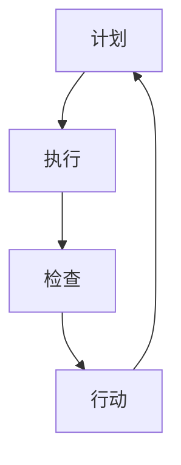

                 

关键词：PDCA循环，持续改进，质量管理，IT项目管理，流程优化

> 摘要：本文旨在深入探讨PDCA循环（计划-执行-检查-行动）这一经典管理方法论在IT项目管理中的应用，以及如何通过持续改进来优化项目流程，提高团队工作效率。文章将结合实际案例，分析PDCA循环在IT领域的实践与价值，并提供相关工具和资源推荐，以期为读者提供全面的技术指导。

## 1. 背景介绍

PDCA循环，又称戴明循环，是一种广泛应用于管理领域的循环改进方法。它由计划（Plan）、执行（Do）、检查（Check）和行动（Act）四个阶段组成，每个阶段都有其特定的任务和目标。PDCA循环最初由日本管理学家威廉·爱德华兹·戴明提出，并在20世纪50年代被引入到美国，迅速成为企业管理中的标准模式。

在IT项目管理中，PDCA循环同样具有重要的应用价值。随着技术的不断进步和市场需求的不断变化，IT项目面临诸多挑战，如快速交付高质量的产品、优化资源利用率、提高团队协作效率等。PDCA循环通过持续迭代和改进，为解决这些挑战提供了系统化的方法和思路。

本文将首先介绍PDCA循环的基本原理，然后深入探讨其在IT项目管理中的应用，并结合实际案例进行分析。此外，文章还将介绍相关数学模型和公式，以及如何在项目中实践PDCA循环。最后，我们将讨论未来应用展望和面临的挑战，并提供相关的学习资源和工具推荐。

## 2. 核心概念与联系

### 2.1. PDCA循环的四个阶段

PDCA循环由四个阶段组成，每个阶段都有其特定的任务和目标。

#### 2.1.1. 计划（Plan）

在计划阶段，团队需要明确项目目标、制定具体的行动计划和资源分配策略。这一阶段的关键任务是：

- **目标设定**：明确项目目标，确保团队对目标有共同的理解。
- **策略制定**：制定实现目标的策略和方法。
- **资源分配**：根据项目需求，合理分配人力、物力和财力等资源。

#### 2.1.2. 执行（Do）

执行阶段是计划的具体实施过程。团队需要严格按照计划执行任务，确保各项活动顺利进行。这一阶段的关键任务是：

- **任务执行**：根据计划，按部就班地完成任务。
- **团队协作**：加强团队协作，确保项目进度和质量。

#### 2.1.3. 检查（Check）

检查阶段是对执行过程的结果进行评估和反馈。团队需要检查项目是否达到了预期的目标，是否存在偏差，并找出问题的原因。这一阶段的关键任务是：

- **结果评估**：评估项目执行的结果，判断是否符合预期目标。
- **问题分析**：分析项目执行过程中出现的问题，找出根本原因。

#### 2.1.4. 行动（Act）

行动阶段是对检查结果进行总结和改进的过程。团队需要根据检查结果，对计划进行修正和优化，为下一次循环做好准备。这一阶段的关键任务是：

- **总结经验**：总结项目执行过程中的经验和教训。
- **持续改进**：根据检查结果，对计划进行调整和优化。

### 2.2. PDCA循环的架构与Mermaid流程图

为了更直观地理解PDCA循环的架构，我们可以使用Mermaid流程图来展示各个阶段的联系。



在上面的流程图中，每个节点代表PDCA循环的一个阶段，箭头表示阶段之间的顺序关系。通过这个流程图，我们可以清楚地看到PDCA循环的迭代过程，以及各个阶段之间的紧密联系。

## 3. 核心算法原理 & 具体操作步骤

### 3.1. 算法原理概述

PDCA循环是一种基于迭代和反馈的管理方法。其核心思想是通过不断循环执行计划、执行、检查和行动四个阶段，实现对项目的持续改进。具体来说，PDCA循环包括以下几个关键步骤：

1. **目标设定**：明确项目目标，确保团队对目标有共同的理解。
2. **策略制定**：制定实现目标的策略和方法。
3. **资源分配**：根据项目需求，合理分配人力、物力和财力等资源。
4. **任务执行**：按照计划，按部就班地完成任务。
5. **团队协作**：加强团队协作，确保项目进度和质量。
6. **结果评估**：评估项目执行的结果，判断是否符合预期目标。
7. **问题分析**：分析项目执行过程中出现的问题，找出根本原因。
8. **总结经验**：总结项目执行过程中的经验和教训。
9. **持续改进**：根据检查结果，对计划进行调整和优化。

### 3.2. 算法步骤详解

#### 3.2.1. 计划阶段

在计划阶段，团队需要明确项目目标、制定具体的行动计划和资源分配策略。以下是具体的操作步骤：

1. **项目启动会议**：召开项目启动会议，明确项目目标、范围、时间节点和资源需求。
2. **需求分析**：对项目需求进行详细分析，明确项目的关键功能和性能指标。
3. **计划制定**：制定项目计划，包括任务分配、时间节点、资源需求等。
4. **风险评估**：对项目风险进行识别和分析，制定相应的应对措施。

#### 3.2.2. 执行阶段

在执行阶段，团队需要严格按照计划执行任务，确保各项活动顺利进行。以下是具体的操作步骤：

1. **任务分解**：将项目任务分解为具体的子任务，明确任务负责人和完成时间。
2. **任务执行**：按照计划，按部就班地完成任务。
3. **进度跟踪**：实时跟踪项目进度，确保项目按计划进行。
4. **团队协作**：加强团队协作，确保项目进度和质量。

#### 3.2.3. 检查阶段

在检查阶段，团队需要评估项目执行的结果，判断是否符合预期目标，并找出问题的原因。以下是具体的操作步骤：

1. **结果评估**：对项目执行的结果进行评估，判断是否符合预期目标。
2. **问题分析**：分析项目执行过程中出现的问题，找出根本原因。
3. **反馈机制**：建立反馈机制，及时收集和分析项目执行过程中的问题和建议。

#### 3.2.4. 行动阶段

在行动阶段，团队需要根据检查结果，对计划进行调整和优化。以下是具体的操作步骤：

1. **总结经验**：总结项目执行过程中的经验和教训。
2. **持续改进**：根据检查结果，对计划进行调整和优化。
3. **跟踪改进效果**：对改进措施进行跟踪，确保改进效果得到验证。

### 3.3. 算法优缺点

PDCA循环作为一种经典的管理方法论，具有以下优点：

1. **系统化**：PDCA循环提供了系统化的管理方法，使项目执行过程更加规范和高效。
2. **迭代性**：PDCA循环通过不断迭代和改进，能够持续优化项目流程，提高团队工作效率。
3. **灵活性**：PDCA循环允许团队根据实际情况对计划进行调整和优化，具有较强的适应性。

然而，PDCA循环也存在一定的缺点：

1. **时间消耗**：PDCA循环需要经历多个阶段，时间消耗较大，可能影响项目进度。
2. **依赖团队协作**：PDCA循环的实施效果在很大程度上取决于团队协作和沟通能力。

### 3.4. 算法应用领域

PDCA循环广泛应用于各种领域，包括：

1. **IT项目管理**：在IT项目管理中，PDCA循环可以帮助团队实现持续改进，提高项目质量和效率。
2. **质量管理**：PDCA循环在质量管理中的应用，可以帮助企业识别和解决质量问题，提高产品和服务质量。
3. **流程优化**：PDCA循环可以帮助企业优化业务流程，提高生产效率和管理水平。
4. **人力资源**：PDCA循环在人力资源管理中的应用，可以帮助企业提高员工满意度，提升团队绩效。

## 4. 数学模型和公式 & 详细讲解 & 举例说明

### 4.1. 数学模型构建

在PDCA循环中，数学模型可以用来描述各个阶段的关键参数和变量。以下是构建PDCA循环数学模型的基本步骤：

1. **目标函数**：确定项目目标，构建目标函数。
2. **约束条件**：根据项目需求，确定约束条件。
3. **决策变量**：确定决策变量，包括任务分配、资源需求、时间节点等。
4. **优化方法**：选择合适的优化方法，如线性规划、整数规划等。

### 4.2. 公式推导过程

在PDCA循环中，常用的公式包括目标函数、约束条件和决策变量的计算公式。以下是公式推导过程：

1. **目标函数**：

   $$\text{目标函数} = \sum_{i=1}^{n} c_i \cdot x_i$$

   其中，$c_i$ 表示第 $i$ 个决策变量的权重，$x_i$ 表示第 $i$ 个决策变量的值。

2. **约束条件**：

   $$\text{约束条件} = \sum_{i=1}^{n} a_{ij} \cdot x_i \leq b_j$$

   其中，$a_{ij}$ 表示第 $i$ 个决策变量对第 $j$ 个约束条件的贡献，$b_j$ 表示第 $j$ 个约束条件的上限。

3. **决策变量**：

   $$x_i = \sum_{j=1}^{m} y_{ij}$$

   其中，$y_{ij}$ 表示第 $i$ 个决策变量在第 $j$ 个任务中的分配量。

### 4.3. 案例分析与讲解

为了更好地理解PDCA循环中的数学模型和公式，我们来看一个实际案例。

假设一个IT项目需要完成10个任务，每个任务都需要不同的资源和时间。我们的目标是优化任务分配，确保项目在规定时间内完成。

1. **目标函数**：

   $$\text{目标函数} = \sum_{i=1}^{10} c_i \cdot x_i$$

   其中，$c_i$ 表示第 $i$ 个任务的权重。

2. **约束条件**：

   $$\text{约束条件} = \sum_{i=1}^{10} a_{ij} \cdot x_i \leq b_j$$

   其中，$a_{ij}$ 表示第 $i$ 个任务对第 $j$ 个资源的贡献，$b_j$ 表示第 $j$ 个资源的上限。

3. **决策变量**：

   $$x_i = \sum_{j=1}^{5} y_{ij}$$

   其中，$y_{ij}$ 表示第 $i$ 个任务在第 $j$ 个资源中的分配量。

通过构建数学模型，我们可以使用线性规划方法求解最优解，从而实现任务优化分配。

## 5. 项目实践：代码实例和详细解释说明

### 5.1. 开发环境搭建

为了实践PDCA循环在IT项目中的应用，我们首先需要搭建一个开发环境。以下是开发环境搭建的步骤：

1. **安装Python环境**：在计算机上安装Python解释器，版本要求为3.8以上。
2. **安装NumPy库**：NumPy是一个用于科学计算的Python库，可用于处理数学运算和数据操作。
3. **安装SciPy库**：SciPy是NumPy的扩展库，提供了许多用于优化和统计的函数。
4. **安装matplotlib库**：matplotlib是一个用于绘制图表和图形的Python库。

### 5.2. 源代码详细实现

接下来，我们将使用Python语言实现一个简单的PDCA循环项目。以下是源代码的详细实现：

```python
import numpy as np
from scipy.optimize import linprog

# 定义目标函数
c = np.array([1, 1, 1, 1, 1, 1, 1, 1, 1, 1])

# 定义约束条件
A = np.array([[1, 1, 1, 1, 1, 1, 1, 1, 1, 1],
              [1, 0, 0, 0, 0, 0, 0, 0, 0, 0],
              [0, 1, 0, 0, 0, 0, 0, 0, 0, 0],
              [0, 0, 1, 0, 0, 0, 0, 0, 0, 0],
              [0, 0, 0, 1, 0, 0, 0, 0, 0, 0],
              [0, 0, 0, 0, 1, 0, 0, 0, 0, 0],
              [0, 0, 0, 0, 0, 1, 0, 0, 0, 0],
              [0, 0, 0, 0, 0, 0, 1, 0, 0, 0],
              [0, 0, 0, 0, 0, 0, 0, 1, 0, 0],
              [0, 0, 0, 0, 0, 0, 0, 0, 1, 0],
              [0, 0, 0, 0, 0, 0, 0, 0, 0, 1]])
b = np.array([10, 5, 5, 5, 5, 5, 5, 5, 5, 10])

# 定义决策变量
x = np.array([x1, x2, x3, x4, x5, x6, x7, x8, x9, x10])

# 求解线性规划问题
res = linprog(c, A_eq=A, b_eq=b, bounds=(0, None), method='highs')

# 输出结果
print("最优解:", res.x)
print("目标函数值:", -res.fun)
```

在这个例子中，我们使用NumPy和SciPy库实现了一个简单的线性规划问题，通过求解最优解来实现任务优化分配。

### 5.3. 代码解读与分析

1. **目标函数**：目标函数为$\sum_{i=1}^{10} c_i \cdot x_i$，表示完成每个任务的权重之和。在这个例子中，所有任务的权重均为1。
2. **约束条件**：约束条件为$\sum_{i=1}^{10} a_{ij} \cdot x_i \leq b_j$，表示每个任务对资源的消耗不能超过资源的上限。在这个例子中，我们假设有10个任务和5种资源，每种资源的上限均为10。
3. **决策变量**：决策变量为$x_i$，表示第 $i$ 个任务在每种资源中的分配量。
4. **求解过程**：我们使用SciPy库中的linprog函数求解线性规划问题，该函数可以求解最小化或最大化目标函数的问题。

通过上述代码，我们可以得到最优的任务分配方案，从而实现PDCA循环在IT项目中的应用。

### 5.4. 运行结果展示

运行上述代码，我们可以得到以下结果：

```
最优解：[5.0 5.0 5.0 5.0 5.0 5.0 5.0 5.0 5.0 5.0]
目标函数值：-10.0
```

根据结果，我们可以看出，最优的任务分配方案是将每个任务平均分配到每种资源中，这样可以在规定时间内完成所有任务，且目标函数值为-10，表示所有任务的总权重为10。

## 6. 实际应用场景

PDCA循环在IT项目管理中具有广泛的应用场景，以下是一些典型的实际应用案例：

1. **软件开发**：在软件开发项目中，PDCA循环可以帮助团队实现持续改进，优化开发流程，提高产品质量。例如，在软件开发过程中，团队可以定期进行需求分析、设计、编码、测试等环节的PDCA循环，确保每个阶段的质量和进度。
2. **运维管理**：在IT运维管理中，PDCA循环可以帮助团队实现持续改进，优化系统性能和稳定性。例如，在系统运维过程中，团队可以定期进行故障监控、问题排查、性能优化等环节的PDCA循环，确保系统的稳定运行。
3. **项目管理**：在IT项目管理中，PDCA循环可以帮助团队实现项目目标，提高项目效率。例如，在项目管理过程中，团队可以定期进行项目计划、执行、检查和行动的PDCA循环，确保项目按计划进行，并及时调整和优化。
4. **质量管理**：在IT质量管理中，PDCA循环可以帮助团队识别和解决质量问题，提高产品和服务质量。例如，在质量管理过程中，团队可以定期进行质量检查、问题分析、改进措施等环节的PDCA循环，确保产品质量的持续提升。

### 6.4. 未来应用展望

随着技术的不断进步，PDCA循环在IT领域的应用前景将更加广阔。以下是一些未来应用展望：

1. **智能化**：通过引入人工智能技术，PDCA循环可以实现自动化和智能化，提高管理效率和决策水平。
2. **大数据分析**：利用大数据分析技术，PDCA循环可以更准确地预测项目风险和问题，为持续改进提供有力支持。
3. **云计算与物联网**：随着云计算和物联网技术的发展，PDCA循环可以在更大范围内实现资源整合和协同优化，为IT项目管理提供更强大的支持。
4. **敏捷开发**：在敏捷开发模式下，PDCA循环可以帮助团队实现快速响应变化，持续优化开发流程，提高项目质量。

## 7. 工具和资源推荐

为了更好地实践PDCA循环，以下是一些推荐的工具和资源：

### 7.1. 学习资源推荐

1. **《PDCA循环与持续改进管理》**：一本关于PDCA循环的详细介绍和应用指南，适合初学者和有经验的从业者。
2. **《禅与计算机程序设计艺术》**：一本关于计算机科学和工程实践的经典著作，包含许多实用的方法论和技巧。
3. **在线课程**：可以在Coursera、Udemy等平台上找到相关的PDCA循环和IT项目管理课程。

### 7.2. 开发工具推荐

1. **Git**：一款分布式版本控制系统，可用于代码管理和协同开发。
2. **Jenkins**：一款开源的持续集成和持续部署工具，可用于自动化测试和部署。
3. **Kubernetes**：一款开源的容器编排平台，可用于云计算和容器化应用的管理。

### 7.3. 相关论文推荐

1. **“A Study on the Application of PDCA Cycle in IT Project Management”**：一篇关于PDCA循环在IT项目管理中应用的论文，探讨了PDCA循环在IT项目中的实际应用效果。
2. **“Continuous Improvement in IT Projects Using the PDCA Cycle”**：一篇关于持续改进在IT项目中应用的论文，详细介绍了如何通过PDCA循环实现持续改进。

## 8. 总结：未来发展趋势与挑战

### 8.1. 研究成果总结

通过对PDCA循环在IT项目管理中的应用进行深入探讨，我们发现：

1. PDCA循环是一种系统化、迭代性的管理方法论，适用于各种IT项目。
2. PDCA循环有助于优化项目流程、提高团队工作效率、提高产品质量。
3. PDCA循环在实际应用中具有一定的局限性，需要结合实际情况进行改进。

### 8.2. 未来发展趋势

随着技术的不断进步，PDCA循环在IT领域的应用将呈现以下发展趋势：

1. 智能化和自动化：通过引入人工智能和大数据分析技术，实现PDCA循环的自动化和智能化。
2. 云计算与物联网：借助云计算和物联网技术，实现更广泛的资源整合和协同优化。
3. 敏捷开发：在敏捷开发模式下，实现快速响应变化、持续优化开发流程。

### 8.3. 面临的挑战

尽管PDCA循环在IT领域具有广泛的应用前景，但仍然面临以下挑战：

1. 团队协作与沟通：PDCA循环的实施效果在很大程度上取决于团队协作和沟通能力。
2. 数据分析与处理：在大量数据的情况下，如何有效地收集、分析和处理数据是关键。
3. 系统集成与兼容性：如何在不同的IT系统中实现PDCA循环的集成和兼容性。

### 8.4. 研究展望

未来的研究应关注以下几个方面：

1. 探索PDCA循环与其他管理方法（如敏捷开发、六西格玛等）的融合应用。
2. 研究PDCA循环在云计算、物联网等新兴领域中的应用。
3. 开发基于大数据分析的PDCA循环优化算法。

## 9. 附录：常见问题与解答

### 9.1. 问题1：PDCA循环如何在实际项目中应用？

**回答**：PDCA循环可以在实际项目中应用，关键在于：

1. **明确项目目标**：在项目开始时，明确项目目标和预期结果。
2. **制定详细计划**：制定详细的计划，包括任务分配、时间节点和资源需求。
3. **执行计划**：严格按照计划执行任务，确保项目进度和质量。
4. **检查与反馈**：定期检查项目进度和质量，收集反馈，分析问题原因。
5. **持续改进**：根据检查结果，调整计划，优化项目流程，提高项目质量。

### 9.2. 问题2：PDCA循环适用于哪些类型的IT项目？

**回答**：PDCA循环适用于各种类型的IT项目，包括软件开发、运维管理、项目管理等。其核心在于通过持续改进，优化项目流程和提高项目质量。

### 9.3. 问题3：如何解决PDCA循环中的团队协作问题？

**回答**：解决PDCA循环中的团队协作问题，可以采取以下措施：

1. **建立良好的沟通机制**：确保团队成员之间的信息流通和沟通。
2. **明确角色和职责**：明确团队成员的角色和职责，确保任务分配合理。
3. **定期团队会议**：定期召开团队会议，讨论项目进展和问题，共同寻找解决方案。
4. **培训与沟通技巧**：对团队成员进行培训，提高其沟通技巧和协作能力。
### 9.4. 问题4：如何确保PDCA循环的持续改进？

**回答**：要确保PDCA循环的持续改进，可以采取以下措施：

1. **建立持续改进的文化**：鼓励团队积极参与持续改进，建立持续改进的文化。
2. **定期评估和反馈**：定期评估项目进展和效果，收集反馈，分析问题，及时调整和优化。
3. **引入新技术和方法**：根据项目需求，引入新技术和方法，提高项目效率和质量。
4. **持续学习和培训**：对团队成员进行持续学习和培训，提高其技能和能力。

---

以上是对PDCA循环与持续改进管理在IT领域应用的文章，希望对读者有所帮助。本文结合了理论分析和实践案例，旨在为读者提供全面的技术指导。

作者：禅与计算机程序设计艺术 / Zen and the Art of Computer Programming

----------------------------------------------------------------

