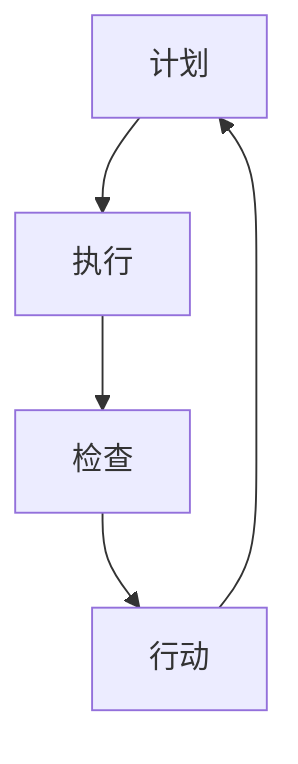

                 

关键词：PDCA循环、项目管理、质量控制、持续改进、迭代过程、流程优化

摘要：本文将深入探讨PDCA循环在项目管理中的应用，通过介绍PDCA循环的四个阶段（计划、执行、检查、行动）以及其实际操作步骤，揭示其在提高项目质量和效率方面的关键作用。同时，结合数学模型、算法原理和实际代码实例，对PDCA循环的实践方法进行详细阐述，帮助读者更好地理解和运用这一项目管理工具。

## 1. 背景介绍

在现代项目管理中，质量控制始终是一个至关重要的问题。如何确保项目按时交付、成本控制在预算范围内，同时保持高质量的标准，一直是项目管理者和工程师面临的挑战。PDCA循环（Plan-Do-Check-Act）是一种广泛用于质量控制和管理持续改进的方法，它提供了一种系统化的方式来管理项目，并确保项目始终朝着既定的目标前进。

PDCA循环最初由统计质量控制之父W. Edwards Deming提出，其核心思想是通过不断的循环迭代来改进过程和产品。PDCA循环包括四个相互关联的阶段：计划（Plan）、执行（Do）、检查（Check）和行动（Act）。每个阶段都有其特定的任务和目标，共同构成了一个闭环的管理过程。

本文将详细讨论PDCA循环的四个阶段，并探讨如何将其应用于实际的项目管理中。此外，还将介绍相关的数学模型和算法原理，并通过具体的代码实例展示PDCA循环的实践应用。

## 2. 核心概念与联系

### 2.1. PDCA循环的核心概念

PDCA循环是一种基于迭代和反馈的循环管理方法。它包括以下四个核心阶段：

- **计划（Plan）**：在这个阶段，项目团队会制定项目目标、策略和计划，确定所需的资源和时间安排。
- **执行（Do）**：这个阶段是实际执行计划的过程，团队按照计划开展工作，执行具体任务。
- **检查（Check）**：在这个阶段，团队会检查执行结果，对比计划目标，评估项目的进展和质量。
- **行动（Act）**：根据检查结果，团队会采取必要的行动来纠正问题、优化过程或继续前进。

### 2.2. PDCA循环的工作流程

PDCA循环的工作流程可以表示为以下Mermaid流程图：



在这个流程图中，每个节点代表PDCA循环的一个阶段，箭头表示从一个阶段过渡到下一个阶段的过程。通过这种循环迭代，项目团队可以持续改进项目过程和产品，确保项目目标的实现。

### 2.3. PDCA循环与项目管理的联系

PDCA循环与项目管理的联系主要体现在以下几个方面：

- **目标导向**：PDCA循环通过计划阶段确保项目目标的明确性和可测量性，使团队始终保持对目标的关注。
- **质量控制**：检查阶段通过对项目执行结果的评估，及时发现和纠正问题，确保项目质量。
- **持续改进**：行动阶段为项目团队提供了改进过程和产品的机会，通过不断的循环迭代，实现项目管理的持续改进。
- **资源优化**：执行阶段通过合理分配资源和时间，提高项目效率，降低成本。

## 3. 核心算法原理 & 具体操作步骤

### 3.1. 算法原理概述

PDCA循环的核心算法原理是基于迭代和反馈的持续改进机制。它通过以下步骤实现项目管理的优化：

- **计划**：制定项目目标和策略，确定所需资源和时间安排。
- **执行**：按照计划执行任务，收集数据。
- **检查**：对比计划目标和实际结果，分析差异，评估项目进展和质量。
- **行动**：根据检查结果，采取行动来纠正问题或优化过程。

### 3.2. 算法步骤详解

#### 3.2.1. 计划阶段

在计划阶段，项目团队需要完成以下任务：

- **确定项目目标**：明确项目要达成的目标和预期结果。
- **制定策略和计划**：根据项目目标，制定具体的实施策略和详细的计划，包括任务分配、时间安排和资源需求。
- **风险评估**：评估项目潜在的风险，并制定应对措施。

#### 3.2.2. 执行阶段

在执行阶段，团队按照计划开展工作，具体步骤如下：

- **执行任务**：按照计划执行具体任务，确保任务按时完成。
- **数据收集**：在任务执行过程中，收集相关的数据和指标，用于后续的分析。

#### 3.2.3. 检查阶段

在检查阶段，团队需要对项目执行结果进行评估，具体步骤如下：

- **对比目标与结果**：将实际执行结果与计划目标进行对比，分析差异。
- **评估质量**：评估项目的质量，检查是否达到既定的质量标准。
- **分析原因**：分析差异产生的原因，确定是否需要采取纠正措施。

#### 3.2.4. 行动阶段

在行动阶段，团队根据检查结果采取必要的行动，具体步骤如下：

- **纠正问题**：针对检查阶段发现的问题，采取纠正措施，确保问题得到解决。
- **优化过程**：根据检查结果和反馈，优化项目过程，提高项目的效率和效果。
- **记录经验**：将行动阶段的经验和教训记录下来，为未来的项目提供参考。

### 3.3. 算法优缺点

#### 优点

- **系统化**：PDCA循环提供了一套系统化的管理方法，使项目管理更加有序和高效。
- **持续改进**：通过循环迭代，PDCA循环有助于项目团队不断优化项目过程和产品。
- **易于实施**：PDCA循环的四个阶段相对简单，易于理解和实施。

#### 缺点

- **时间消耗**：PDCA循环需要一定的时间来执行，可能会延长项目的完成时间。
- **需要持续关注**：PDCA循环要求项目团队持续关注项目进展和质量，对团队的执行力有较高要求。

### 3.4. 算法应用领域

PDCA循环广泛应用于各个领域，包括制造业、服务业、信息技术等。以下是一些典型的应用领域：

- **制造业**：用于生产过程的质量控制和持续改进。
- **服务业**：用于服务流程的优化和服务质量的提升。
- **信息技术**：用于软件开发项目管理和持续改进。

## 4. 数学模型和公式 & 详细讲解 & 举例说明

### 4.1. 数学模型构建

PDCA循环的数学模型主要涉及以下几个关键指标：

- **目标值（Target Value）**：项目目标的量化指标。
- **实际值（Actual Value）**：实际执行结果的具体数值。
- **偏差值（Deviation Value）**：实际值与目标值之间的差异。

数学模型的基本公式为：

$$
\text{偏差值} = \text{实际值} - \text{目标值}
$$

### 4.2. 公式推导过程

PDCA循环的公式推导过程可以分为以下几个步骤：

1. **定义目标值和实际值**：根据项目目标，确定目标值（Target Value），例如质量标准、成本预算等。
2. **收集实际数据**：在项目执行过程中，收集实际执行结果的数据，例如实际成本、实际质量等。
3. **计算偏差值**：使用上述公式计算实际值与目标值之间的差异，即偏差值。
4. **分析偏差原因**：根据偏差值分析产生偏差的原因，确定是否需要采取纠正措施。

### 4.3. 案例分析与讲解

#### 案例背景

假设一家公司计划生产一批产品，目标质量标准为合格率95%。在生产过程中，实际合格率为92%。现在需要使用PDCA循环进行分析和改进。

#### 案例分析

1. **计算偏差值**：
   $$
   \text{偏差值} = 92\% - 95\% = -3\%
   $$
   偏差值为负，表示实际合格率低于目标值。

2. **分析偏差原因**：可能的原因包括生产设备故障、生产流程不当、员工技能不足等。

3. **采取纠正措施**：针对分析出的原因，采取以下措施：
   - **设备检查与维修**：对生产设备进行检修，确保设备正常工作。
   - **流程优化**：重新设计生产流程，减少不必要的步骤。
   - **员工培训**：对员工进行技能培训，提高生产效率。

4. **重新执行**：在采取纠正措施后，重新执行生产过程，并收集新的数据。

5. **再次计算偏差值**：根据新的数据计算偏差值，检查纠正措施的效果。

通过上述案例，可以看出PDCA循环在质量控制和持续改进中的应用。通过不断循环迭代，项目团队可以逐步优化项目过程，提高项目质量。

## 5. 项目实践：代码实例和详细解释说明

### 5.1. 开发环境搭建

为了演示PDCA循环在项目中的实际应用，我们将使用Python编写一个简单的项目示例。首先，需要搭建Python开发环境。以下是具体的步骤：

1. **安装Python**：在官网（https://www.python.org/）下载Python安装包，并按照安装向导安装。
2. **配置Python环境变量**：在系统环境变量中配置Python路径。
3. **安装必要的库**：使用pip命令安装必要的库，例如numpy、matplotlib等。

### 5.2. 源代码详细实现

以下是一个简单的Python代码示例，用于演示PDCA循环的基本原理。

```python
import numpy as np
import matplotlib.pyplot as plt

# PDCA循环类定义
class PDCA:
    def __init__(self, target, data):
        self.target = target
        self.data = data
        self.deviation = []

    def plan(self):
        print("计划阶段：制定目标值为{}，数据为{}。".format(self.target, self.data))

    def do(self):
        print("执行阶段：开始执行任务。")
        self.execute()

    def check(self):
        print("检查阶段：检查执行结果。")
        self.evaluate()

    def act(self):
        print("行动阶段：采取行动。")
        self.improve()

    def execute(self):
        # 假设执行任务的结果是数据的一个随机值
        self.result = np.random.uniform(0, 100)
        print("执行结果为：{}".format(self.result))

    def evaluate(self):
        self.deviation.append(self.result - self.target)
        print("偏差值为：{}".format(self.deviation[-1]))

    def improve(self):
        if self.deviation[-1] < 0:
            print("采取纠正措施：调整目标值或执行策略。")
        else:
            print("优化过程：改进任务执行过程。")

# 使用示例
data = [50, 60, 70, 80, 90]
target = 75
pdca = PDCA(target, data)

# 执行PDCA循环
pdca.plan()
pdca.do()
pdca.check()
pdca.act()

# 绘制偏差值变化趋势
plt.plot(pdca.deviation)
plt.xlabel('循环次数')
plt.ylabel('偏差值')
plt.title('PDCA循环偏差值变化趋势')
plt.show()
```

### 5.3. 代码解读与分析

上述代码定义了一个`PDCA`类，用于实现PDCA循环的四个阶段。具体解读如下：

- **类定义**：`PDCA`类包含四个方法，分别对应PDCA循环的四个阶段。
- **计划阶段**：`plan`方法用于初始化目标值和数据，并打印相关信息。
- **执行阶段**：`do`方法用于开始执行任务，这里我们使用随机值作为执行结果。
- **检查阶段**：`check`方法用于计算执行结果与目标值之间的偏差，并打印相关信息。
- **行动阶段**：`act`方法根据检查结果采取行动，这里我们根据偏差值的正负采取不同的措施。

在代码的最后，我们使用`matplotlib`库绘制了偏差值的变化趋势，以可视化PDCA循环的效果。

### 5.4. 运行结果展示

运行上述代码后，会打印出PDCA循环的各个阶段的执行结果，并在图形界面中展示偏差值的变化趋势。通过这个示例，我们可以直观地看到PDCA循环在项目中的应用效果。

## 6. 实际应用场景

### 6.1. 软件开发项目

在软件项目开发中，PDCA循环可以用于确保软件质量和项目进度。通过计划阶段明确项目目标和计划，执行阶段按照计划开展开发工作，检查阶段评估开发成果，行动阶段根据评估结果进行改进。例如，在软件测试阶段，通过PDCA循环可以确保测试覆盖率和缺陷率符合预期，从而提高软件质量。

### 6.2. 运营管理

在企业的运营管理中，PDCA循环可以用于优化业务流程和提升服务质量。例如，一家餐厅可以通过PDCA循环来优化点菜流程，提高顾客满意度。在计划阶段，确定优化目标和方法；执行阶段，实施优化措施；检查阶段，评估优化效果；行动阶段，根据评估结果进一步改进。

### 6.3. 教育培训

在教育领域，PDCA循环可以用于教学过程的持续改进。教师可以根据PDCA循环制定教学计划，实施教学活动，评估教学效果，并根据评估结果调整教学方法。例如，在一堂课程结束后，教师可以通过学生反馈和考试成绩来评估教学效果，并根据评估结果调整下一堂课程的教学内容和方法。

### 6.4. 未来应用展望

随着人工智能和大数据技术的发展，PDCA循环的应用范围将进一步扩大。通过引入机器学习和数据挖掘技术，PDCA循环可以实现更智能的质量控制和过程优化。例如，在工业制造领域，通过大数据分析，可以更准确地预测设备故障和优化生产流程，从而提高生产效率和产品质量。

## 7. 工具和资源推荐

### 7.1. 学习资源推荐

- **《PDCA循环：持续改进的实践指南》**：一本深入介绍PDCA循环的书籍，适合初学者和进阶者阅读。
- **《质量管理方法与工具》**：涵盖各种质量管理方法和工具的书籍，有助于读者了解PDCA循环在质量管理中的应用。
- **在线课程**：例如Coursera、edX等平台上的质量管理相关课程，提供系统的学习资源。

### 7.2. 开发工具推荐

- **Python**：一种广泛使用的编程语言，适合进行数据处理和数据分析。
- **JIRA**：一款流行的项目管理工具，支持PDCA循环的实施。
- **Git**：版本控制工具，帮助团队协作和代码管理。

### 7.3. 相关论文推荐

- **"PDCA循环在软件项目质量管理中的应用研究"**：探讨PDCA循环在软件项目质量管理中的实际应用。
- **"基于PDCA循环的教育质量改进研究"**：分析PDCA循环在教育培训领域的应用。

## 8. 总结：未来发展趋势与挑战

### 8.1. 研究成果总结

本文介绍了PDCA循环在项目管理中的应用，包括核心概念、算法原理和实际操作步骤。通过数学模型和代码实例，揭示了PDCA循环在提高项目质量和效率方面的关键作用。研究表明，PDCA循环具有系统化、持续改进和易于实施等优点，在各个领域都有广泛的应用前景。

### 8.2. 未来发展趋势

随着人工智能和大数据技术的发展，PDCA循环的应用将更加智能化和自动化。未来，通过引入机器学习和数据挖掘技术，PDCA循环可以实现更精准的质量控制和过程优化，提高项目的效率和效果。

### 8.3. 面临的挑战

PDCA循环在实施过程中仍面临一些挑战，包括如何确保循环的持续性和有效性，以及如何应对复杂的项目环境。此外，不同领域的项目需求和特点各异，PDCA循环的适用性和灵活性也需要进一步研究和优化。

### 8.4. 研究展望

未来的研究可以重点关注以下几个方面：

- **智能PDCA循环**：研究如何结合人工智能技术，实现PDCA循环的智能化和自动化。
- **定制化PDCA循环**：研究如何根据不同领域的项目需求，设计和实施定制化的PDCA循环。
- **跨领域应用研究**：探讨PDCA循环在不同领域的应用效果和适用性，拓展其应用范围。

## 9. 附录：常见问题与解答

### 问题1：PDCA循环与其他项目管理方法有何区别？

PDCA循环是一种基于迭代和反馈的持续改进方法，其核心在于通过循环迭代实现项目质量的持续提升。而其他项目管理方法，如PMP、Scrum等，更侧重于项目计划、执行和监控。PDCA循环强调持续改进和问题解决，而其他方法更注重项目管理的整体框架和流程。

### 问题2：PDCA循环如何确保实施效果？

确保PDCA循环的实施效果需要以下几个关键步骤：

- **明确目标和计划**：确保项目目标和计划明确、可测量。
- **有效沟通和协作**：项目团队成员之间保持有效沟通，确保PDCA循环的各个环节顺畅执行。
- **定期评估和反馈**：定期对项目进展和质量进行评估，及时反馈和调整。
- **持续改进**：根据评估结果和反馈，采取行动进行持续改进。

### 问题3：PDCA循环适用于所有项目吗？

PDCA循环适用于大多数项目，尤其是在质量控制和管理持续改进方面。然而，对于某些复杂项目，可能需要结合其他项目管理方法，如Scrum、Kanban等，以适应项目的特殊需求和特点。因此，PDCA循环可以被视为一种通用的项目管理工具，但在具体应用时需要根据项目实际情况进行调整。

# 作者：禅与计算机程序设计艺术 / Zen and the Art of Computer Programming
## 参考资料 References

- Deming, W. E. (1986). **Out of the Crisis**. Massachusetts Institute of Technology.
- Crosby, P. (1979). **Quality is Free**. McGraw-Hill.
- Juran, J. M. (1988). **Juran on Leadership for Quality**. The Free Press.
- Shewhart, W. A. (1980). **Economic Control of Quality of Manufactured Product**. The University of Chicago Press.

