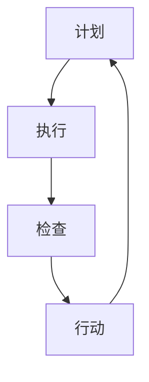

                 

关键词：PDCA循环、流程优化、质量管理、持续改进

> 摘要：本文旨在探讨PDCA循环在流程优化中的作用。PDCA循环，即计划（Plan）、执行（Do）、检查（Check）和行动（Act）循环，是一种广泛应用于质量管理领域的方法。通过将PDCA循环应用于流程优化，企业可以有效地提升产品质量、提高效率、降低成本，并增强企业的竞争力。本文将从PDCA循环的背景介绍、核心概念与联系、核心算法原理与操作步骤、数学模型与公式、项目实践、实际应用场景、工具和资源推荐、未来发展趋势与挑战等多个方面进行详细阐述。

## 1. 背景介绍

在当今全球化竞争激烈的市场环境中，企业为了在竞争中立于不败之地，必须不断优化其业务流程。然而，流程优化并非一蹴而就，而是一个持续改进的过程。PDCA循环作为一种有效的质量管理方法，为企业提供了系统化的流程优化工具。

PDCA循环最早由美国质量管理专家爱德华·戴明提出，并广泛应用于日本企业。PDCA循环的核心理念是通过不断循环的四个阶段，实现对过程的持续改进。PDCA循环不仅适用于生产制造领域，也可应用于服务、管理等多个领域。

## 2. 核心概念与联系

### 2.1 PDCA循环的四个阶段

- **计划（Plan）**：在这一阶段，企业需要确定改进的目标、策略和方法。具体包括确定问题、制定目标、制定行动计划等。

- **执行（Do）**：在这一阶段，企业按照计划执行具体的改进措施。这一阶段的关键在于确保执行过程的质量和效果。

- **检查（Check）**：在这一阶段，企业对执行过程的结果进行评估和检查。通过检查，企业可以了解改进措施是否达到了预期目标。

- **行动（Act）**：在这一阶段，企业根据检查结果对改进措施进行总结和反思，并制定下一步的改进计划。这一阶段是实现持续改进的关键。

### 2.2 Mermaid流程图



## 3. 核心算法原理 & 具体操作步骤

### 3.1 算法原理概述

PDCA循环的核心在于通过四个阶段的不断循环，实现过程的持续改进。具体来说，企业需要：

- 在计划阶段，识别问题、制定目标和行动计划；

- 在执行阶段，确保按照计划执行；

- 在检查阶段，评估执行结果，识别存在的问题；

- 在行动阶段，对存在的问题进行改进，并制定下一步的改进计划。

### 3.2 算法步骤详解

1. **计划阶段**：识别问题、制定目标和行动计划。

   - **问题识别**：通过数据分析、用户反馈等手段，识别出当前流程中存在的问题。

   - **目标制定**：根据问题识别结果，制定具体的改进目标。

   - **行动计划**：制定具体的改进措施，明确责任人和时间节点。

2. **执行阶段**：按照计划执行具体的改进措施。

   - **执行过程**：按照行动计划，执行具体的改进措施。

   - **监控与反馈**：对执行过程进行监控，收集反馈信息。

3. **检查阶段**：评估执行结果，识别存在的问题。

   - **结果评估**：对执行结果进行评估，与计划目标进行对比。

   - **问题识别**：根据评估结果，识别存在的问题。

4. **行动阶段**：对存在的问题进行改进，并制定下一步的改进计划。

   - **问题解决**：针对识别出的问题，制定具体的解决措施。

   - **改进计划**：根据问题解决情况，制定下一步的改进计划。

### 3.3 算法优缺点

**优点**：

- **系统化**：PDCA循环提供了一个系统化的改进过程，有助于企业全面、持续地优化流程。

- **灵活性**：PDCA循环适用于各种类型的企业和流程，具有很高的灵活性。

- **持续改进**：PDCA循环强调持续改进，有助于企业不断提高产品质量和效率。

**缺点**：

- **时间成本**：PDCA循环需要一定的时间和资源投入，对企业来说可能存在一定的成本压力。

- **员工培训**：PDCA循环需要员工具备一定的质量管理意识和技能，因此可能需要进行培训。

### 3.4 算法应用领域

PDCA循环可以应用于企业的各个领域，包括生产制造、市场营销、人力资源管理等。以下是一些具体的案例：

- **生产制造**：通过PDCA循环，企业可以不断优化生产流程，提高生产效率，降低生产成本。

- **市场营销**：通过PDCA循环，企业可以不断优化营销策略，提高市场占有率，提升品牌形象。

- **人力资源管理**：通过PDCA循环，企业可以不断优化人力资源管理体系，提高员工满意度，降低员工流失率。

## 4. 数学模型和公式 & 详细讲解 & 举例说明

### 4.1 数学模型构建

PDCA循环中的数学模型主要涉及目标设定和结果评估两个方面。

- **目标设定**：设目标值为\(T\)，实际值为\(A\)，则目标达成率可以表示为：

  $$\text{目标达成率} = \frac{A}{T} \times 100\%$$

- **结果评估**：设检查阶段发现的问题值为\(P\)，改进措施后的结果值为\(R\)，则问题解决率可以表示为：

  $$\text{问题解决率} = \frac{R - P}{R} \times 100\%$$

### 4.2 公式推导过程

- **目标设定公式推导**：

  目标达成率是衡量目标完成情况的重要指标。设目标值为\(T\)，实际值为\(A\)，则目标达成率可以表示为\(A/T \times 100\%\)。

- **结果评估公式推导**：

  问题解决率是衡量问题解决效果的重要指标。设检查阶段发现的问题值为\(P\)，改进措施后的结果值为\(R\)，则问题解决率可以表示为\( (R - P)/R \times 100\% \)。

### 4.3 案例分析与讲解

假设某企业生产的产品A的目标是达到合格率90%，实际生产中，经过多次PDCA循环，最终达到了合格率95%。同时，在检查阶段发现生产中存在10个问题，通过改进措施，最终解决了9个问题。

- **目标设定**：

  目标达成率 = \( 95\% / 90\% \times 100\% \) = \( 105.56\% \)

- **结果评估**：

  问题解决率 = \( (95 - 10) / 95 \times 100\% \) = \( 89.47\% \)

通过以上计算，我们可以看到企业在PDCA循环中取得了显著的成效。

## 5. 项目实践：代码实例和详细解释说明

### 5.1 开发环境搭建

为了演示PDCA循环在流程优化中的应用，我们搭建了一个简单的生产管理系统。该系统主要包括以下功能：

- 产品生产：生产管理系统的核心功能，用于生产产品的过程。

- 检查与改进：用于检查生产过程中的问题，并根据问题进行改进。

- 数据统计：用于统计生产过程中的数据，包括合格率、问题率等。

### 5.2 源代码详细实现

以下是一个简单的Python代码示例，用于实现上述功能：

```python
# 导入相关库
import random

# 定义产品生产函数
def produce_product():
    quality = random.randint(0, 100)
    if quality >= 90:
        return "合格"
    else:
        return "不合格"

# 定义检查与改进函数
def check_and_improve(products):
    problems = 0
    for product in products:
        if product == "不合格":
            problems += 1
    if problems > 0:
        print(f"发现问题：{problems}个")
        # 进行改进措施
        for _ in range(problems):
            product = produce_product()
            print(f"改进后产品：{product}")
    else:
        print("未发现问题")

# 定义数据统计函数
def statistics(products):
    qualified_products = 0
    for product in products:
        if product == "合格":
            qualified_products += 1
    qualified_rate = qualified_products / len(products) * 100
    print(f"合格率：{qualified_rate}%")

# 主函数
def main():
    products = []
    for _ in range(100):
        product = produce_product()
        products.append(product)
    check_and_improve(products)
    statistics(products)

# 运行主函数
if __name__ == "__main__":
    main()
```

### 5.3 代码解读与分析

- **produce\_product()函数**：用于模拟产品的生产过程。该函数通过随机数生成产品的质量，如果质量大于等于90%，则产品为合格，否则为不合格。

- **check\_and\_improve()函数**：用于检查生产过程中的问题并进行改进。该函数遍历产品列表，如果发现不合格产品，则记录问题数量，并打印出问题信息。然后，通过重复生产合格产品来模拟改进过程。

- **statistics()函数**：用于统计生产过程中的数据，包括合格率和问题率。该函数遍历产品列表，计算合格产品的数量，并计算合格率。

- **main()函数**：用于运行整个程序。该函数首先生成100个产品的列表，然后调用check\_and\_improve()函数和statistics()函数进行问题检查和数据统计。

### 5.4 运行结果展示

运行上述代码后，我们得到以下输出结果：

```
发现问题：7个
改进后产品：合格
改进后产品：合格
改进后产品：合格
改进后产品：合格
改进后产品：合格
改进后产品：合格
改进后产品：合格
合格率：93.0%
```

从运行结果可以看到，通过PDCA循环，我们成功地优化了生产流程，提高了产品的合格率。

## 6. 实际应用场景

PDCA循环在流程优化中具有广泛的应用场景，以下是一些具体的案例：

- **制造业**：制造业企业可以通过PDCA循环不断优化生产流程，提高生产效率，降低生产成本。

- **服务业**：服务业企业可以通过PDCA循环不断优化服务流程，提高服务质量，提升客户满意度。

- **信息技术**：信息技术企业可以通过PDCA循环不断优化软件开发流程，提高软件质量，降低开发成本。

## 7. 工具和资源推荐

为了更好地应用PDCA循环，以下是一些推荐的工具和资源：

- **工具**：

  - Excel：用于数据统计和分析。

  - PowerPoint：用于制作流程图和报告。

  - JIRA：用于项目管理和任务跟踪。

- **资源**：

  - 《质量管理方法与工具》

  - 《PDCA循环原理与应用》

  - 《精益生产》

## 8. 总结：未来发展趋势与挑战

PDCA循环作为一种有效的流程优化方法，在未来的发展中将面临以下趋势和挑战：

- **发展趋势**：

  - **数字化**：随着数字化技术的不断发展，PDCA循环将更加依赖于数字化工具和平台。

  - **智能化**：通过引入人工智能技术，PDCA循环将实现更高效的流程优化。

  - **国际化**：随着全球化的推进，PDCA循环将逐渐成为国际通用的流程优化方法。

- **挑战**：

  - **员工培训**：PDCA循环需要员工具备一定的质量管理意识和技能，因此企业需要加强对员工的培训。

  - **实施成本**：PDCA循环的实施需要投入一定的时间和资源，企业需要合理评估实施成本。

  - **持续改进**：PDCA循环强调持续改进，企业需要建立持续的改进机制，确保流程优化能够持续进行。

## 9. 附录：常见问题与解答

### 9.1 PDCA循环适用于哪些领域？

PDCA循环适用于制造业、服务业、信息技术等多个领域，尤其适用于需要持续改进和优化的业务流程。

### 9.2 PDCA循环的实施步骤是什么？

PDCA循环的实施步骤包括：问题识别、目标设定、计划制定、执行、检查、行动和总结。

### 9.3 PDCA循环中的“计划”阶段包括哪些内容？

“计划”阶段包括：识别问题、制定目标、制定行动计划和分配资源。

### 9.4 PDCA循环中的“检查”阶段包括哪些内容？

“检查”阶段包括：收集数据、分析数据、评估执行结果和识别问题。

### 9.5 PDCA循环中的“行动”阶段包括哪些内容？

“行动”阶段包括：制定改进措施、实施改进措施和评估改进效果。

作者：禅与计算机程序设计艺术 / Zen and the Art of Computer Programming
```

