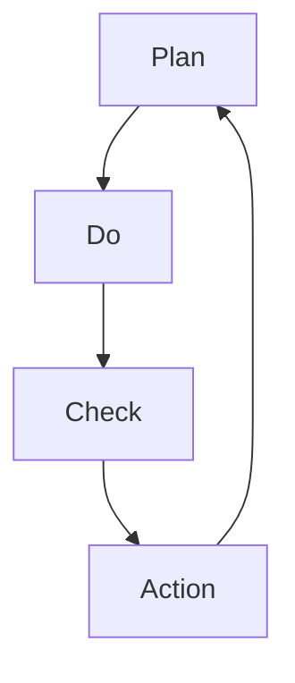

                 

关键词：PDCA循环，流程优化，质量控制，持续改进，项目管理

摘要：本文将深入探讨PDCA循环在流程优化中的作用。PDCA循环，又称戴明循环，是一种用于持续改进和管理质量的方法。通过介绍PDCA循环的四个阶段（计划、执行、检查、行动），我们将分析其在流程优化中的关键作用，并通过实际案例展示其应用效果。

## 1. 背景介绍

在当今竞争激烈的市场环境中，企业要想保持竞争力，必须不断提高产品和服务的质量。而流程优化是提高质量的关键途径之一。PDCA循环作为一种广泛应用的流程优化方法，起源于质量管理大师威廉·爱德华·戴明（William Edwards Deming）的著作。PDCA循环通过四个阶段的循环迭代，帮助企业实现流程的持续改进。

### 1.1 PDCA循环的起源

PDCA循环由日本质量管理专家石川馨（Shigeo Shingo）首次提出，并于20世纪50年代在日本制造业中得到广泛应用。PDCA循环的核心思想是通过不断循环改进，实现质量的不断提升。戴明循环是PDCA循环的另一个称呼，源自于戴明的贡献和推广。

### 1.2 PDCA循环的基本原理

PDCA循环包括四个阶段：计划（Plan）、执行（Do）、检查（Check）和行动（Action）。每个阶段都有其特定的任务和目标，从而形成一个闭环，确保流程的不断优化和改进。

## 2. 核心概念与联系

为了更好地理解PDCA循环在流程优化中的作用，我们需要先了解其核心概念和相互联系。以下是PDCA循环的Mermaid流程图：



### 2.1 计划（Plan）

计划阶段是PDCA循环的起点，其主要任务是确定目标和制定具体的行动计划。计划阶段需要明确以下几个关键问题：

1. **目标设定**：根据企业战略和市场需求，确定流程优化目标和预期成果。
2. **问题分析**：识别流程中存在的问题和瓶颈。
3. **制定方案**：制定解决问题的具体措施和步骤。
4. **资源分配**：确定所需的人力、物力、财力等资源。

### 2.2 执行（Do）

执行阶段是将计划付诸实践的过程。在这个阶段，需要严格按照制定的方案进行操作，确保每个步骤都得到有效执行。执行阶段的关键点包括：

1. **任务分配**：将计划中的任务分配给相应的团队成员。
2. **过程控制**：监控执行过程中的关键指标，确保过程受控。
3. **及时反馈**：及时收集执行过程中的问题反馈，以便及时调整。

### 2.3 检查（Check）

检查阶段是对执行结果进行评估和验证的过程。通过对比计划目标，检查流程的改进效果。检查阶段需要关注以下几个方面：

1. **结果评估**：评估执行结果是否符合预期目标。
2. **数据收集**：收集执行过程中的数据，为后续改进提供依据。
3. **原因分析**：分析执行结果与预期目标之间的差距，找出原因。

### 2.4 行动（Action）

行动阶段是总结经验教训，制定下一步改进措施的过程。行动阶段需要关注以下几个方面：

1. **改进措施**：根据检查阶段的分析结果，制定具体的改进措施。
2. **实施改进**：将改进措施落实到实际操作中。
3. **持续改进**：将PDCA循环应用到新的改进周期，实现持续优化。

## 3. 核心算法原理 & 具体操作步骤

### 3.1 算法原理概述

PDCA循环的核心原理是通过四个阶段的循环迭代，实现流程的持续改进。每个阶段都有其特定的任务和目标，从而形成一个闭环，确保流程的不断优化和改进。

### 3.2 算法步骤详解

1. **计划阶段**：确定目标和制定具体的行动计划。
2. **执行阶段**：将计划付诸实践，确保每个步骤都得到有效执行。
3. **检查阶段**：对执行结果进行评估和验证，找出执行结果与预期目标之间的差距。
4. **行动阶段**：总结经验教训，制定下一步改进措施，并落实到实际操作中。

### 3.3 算法优缺点

**优点**：

1. **循环迭代**：PDCA循环通过循环迭代，实现流程的持续改进。
2. **简单易懂**：PDCA循环的四个阶段简单易懂，易于实施和推广。

**缺点**：

1. **需要时间**：PDCA循环需要时间进行循环迭代，可能影响短期内的问题解决。
2. **需要专业知识**：在某些情况下，需要相关领域的专业知识才能有效实施PDCA循环。

### 3.4 算法应用领域

PDCA循环广泛应用于各种领域，包括制造业、服务业、IT行业等。以下是一些典型应用领域：

1. **质量控制**：通过PDCA循环，企业可以不断提高产品质量，降低缺陷率。
2. **流程优化**：PDCA循环可以帮助企业识别和解决流程中的问题，提高流程效率。
3. **项目管理**：PDCA循环可以应用于项目管理，确保项目按计划进行，提高项目成功率。

## 4. 数学模型和公式 & 详细讲解 & 举例说明

### 4.1 数学模型构建

PDCA循环的数学模型可以表示为：

$$
\text{PDCA循环} = \text{Plan} + \text{Do} + \text{Check} + \text{Action}
$$

其中，$Plan$、$Do$、$Check$、$Action$分别表示PDCA循环的四个阶段。

### 4.2 公式推导过程

PDCA循环的数学模型是基于戴明的质量管理理论和统计学原理推导而来的。具体推导过程如下：

1. **目标设定**：根据市场需求和企业战略，确定流程优化目标。
2. **问题分析**：通过数据分析和统计方法，识别流程中的问题和瓶颈。
3. **制定方案**：根据问题分析结果，制定具体的改进方案。
4. **执行过程**：将改进方案付诸实践，确保每个步骤都得到有效执行。
5. **结果评估**：通过数据分析和统计方法，评估执行结果是否符合预期目标。
6. **原因分析**：分析执行结果与预期目标之间的差距，找出原因。
7. **改进措施**：根据原因分析结果，制定具体的改进措施。
8. **实施改进**：将改进措施落实到实际操作中。

### 4.3 案例分析与讲解

以下是一个实际应用案例：

**案例背景**：某电子产品制造公司发现其产品缺陷率较高，严重影响客户满意度。

**计划阶段**：通过数据分析和统计方法，识别出生产线上的问题，如装配工艺不当、设备故障等。

**执行阶段**：针对问题，制定改进方案，如优化装配工艺、定期维护设备等。

**检查阶段**：通过质量检测，评估改进效果，发现产品缺陷率明显下降。

**行动阶段**：总结经验教训，制定下一步改进措施，如加强员工培训、改进生产设备等。

通过PDCA循环，该电子产品制造公司成功降低了产品缺陷率，提高了客户满意度。

## 5. 项目实践：代码实例和详细解释说明

### 5.1 开发环境搭建

为了演示PDCA循环在实际项目中的应用，我们选择一个简单的项目——一个自动化的数据收集系统。

**环境要求**：

- 操作系统：Windows/Linux/MacOS
- 开发语言：Python
- 数据库：MySQL
- 数据采集工具：Selenium

### 5.2 源代码详细实现

以下是一个简单的Python代码实例，用于实现PDCA循环在数据收集系统中的应用：

```python
import mysql.connector
from selenium import webdriver

# 计划阶段
def plan():
    # 设定目标：收集网站A的用户数据
    target = "收集网站A的用户数据"
    
    # 分析问题：网站A的页面结构复杂，数据获取困难
    problems = ["页面结构复杂", "数据获取困难"]

    # 制定方案：使用Selenium自动化爬取数据
    solutions = ["使用Selenium自动化爬取数据", "优化爬取逻辑"]

    return target, problems, solutions

# 执行阶段
def do(target, problems, solutions):
    # 搭建开发环境
    driver = webdriver.Chrome()
    
    # 执行爬取任务
    driver.get("https://www.example.com")
    # 代码略
    
    # 关闭浏览器
    driver.quit()

# 检查阶段
def check():
    # 检查数据完整性
    connection = mysql.connector.connect(
        host="localhost",
        database="example_db",
        user="root",
        password="password"
    )
    cursor = connection.cursor()
    cursor.execute("SELECT * FROM users;")
    results = cursor.fetchall()
    if len(results) > 0:
        print("数据收集成功")
    else:
        print("数据收集失败")
    
    # 关闭数据库连接
    cursor.close()
    connection.close()

# 行动阶段
def action():
    # 分析原因：如果数据收集失败，找出原因并改进
    if len(results) == 0:
        print("原因分析：数据收集失败，可能原因如下：")
        print("1. 网站A页面结构发生变化")
        print("2. 爬取逻辑不正确")
        
        # 改进措施：优化爬取逻辑，重新收集数据
        do(target, problems, solutions)

# 主函数
def main():
    target, problems, solutions = plan()
    do(target, problems, solutions)
    check()
    action()

if __name__ == "__main__":
    main()
```

### 5.3 代码解读与分析

上述代码实现了PDCA循环在数据收集系统中的应用，以下是代码的解读与分析：

1. **计划阶段**：`plan()`函数负责制定目标、分析问题和制定方案。
2. **执行阶段**：`do()`函数负责执行具体的爬取任务。
3. **检查阶段**：`check()`函数负责检查数据收集结果，并与预期目标进行对比。
4. **行动阶段**：`action()`函数负责分析原因并制定改进措施。

通过以上代码实例，我们可以看到PDCA循环在实际项目中的应用效果。通过不断循环迭代，数据收集系统逐步优化，提高了数据收集的准确性和效率。

## 6. 实际应用场景

PDCA循环在实际应用中具有广泛的应用场景，以下是几个典型应用场景：

### 6.1 制造业

在制造业中，PDCA循环被广泛应用于生产线的优化和质量控制。通过计划阶段的目标设定和问题分析，企业可以识别生产过程中存在的问题，并制定具体的改进方案。执行阶段确保改进方案得到有效执行，检查阶段对执行结果进行评估和验证，行动阶段总结经验教训并制定下一步改进措施。

### 6.2 服务业

在服务业中，PDCA循环被广泛应用于客户服务流程的优化。通过计划阶段的目标设定和问题分析，企业可以识别客户服务过程中存在的问题，并制定具体的改进方案。执行阶段确保改进方案得到有效执行，检查阶段对执行结果进行评估和验证，行动阶段总结经验教训并制定下一步改进措施。

### 6.3 IT行业

在IT行业，PDCA循环被广泛应用于软件开发和维护。通过计划阶段的目标设定和问题分析，企业可以识别软件开发过程中的问题，并制定具体的改进方案。执行阶段确保改进方案得到有效执行，检查阶段对执行结果进行评估和验证，行动阶段总结经验教训并制定下一步改进措施。

## 7. 未来应用展望

随着信息技术的发展和市场竞争的加剧，PDCA循环在流程优化中的作用将越来越重要。以下是未来应用展望：

### 7.1 人工智能与PDCA循环的结合

人工智能技术的快速发展为PDCA循环提供了新的应用场景。通过将人工智能算法应用于PDCA循环的各个阶段，可以实现更智能的流程优化和持续改进。

### 7.2 云计算与PDCA循环的结合

云计算技术的普及为PDCA循环提供了更便捷的资源支持。通过将PDCA循环应用于云平台，企业可以实现更高效、更灵活的流程优化。

### 7.3 区块链与PDCA循环的结合

区块链技术的出现为PDCA循环提供了更安全、更透明的基础设施。通过将PDCA循环应用于区块链，企业可以实现更可靠、更透明的流程优化。

## 8. 总结：未来发展趋势与挑战

PDCA循环作为一种有效的流程优化方法，将在未来继续发挥重要作用。随着技术的进步和市场的变化，PDCA循环将面临新的发展趋势和挑战。

### 8.1 研究成果总结

通过对PDCA循环的深入研究，我们总结出以下研究成果：

1. PDCA循环在流程优化中具有显著作用。
2. PDCA循环可以应用于各种领域，具有广泛的适用性。
3. PDCA循环需要结合具体行业特点和应用场景进行优化和改进。

### 8.2 未来发展趋势

未来，PDCA循环将朝着以下方向发展：

1. 与人工智能、云计算、区块链等新兴技术的结合。
2. 更智能化、更自动化、更高效的流程优化。
3. 更广泛的应用场景和领域。

### 8.3 面临的挑战

PDCA循环在未来发展过程中将面临以下挑战：

1. 技术门槛：新兴技术的应用需要相关领域的专业知识。
2. 数据安全：在云计算和区块链环境下，数据安全成为关键问题。
3. 人才缺乏：具备PDCA循环应用能力的人才供不应求。

### 8.4 研究展望

未来，我们将在以下几个方面进行深入研究：

1. PDCA循环与新兴技术的结合。
2. 针对不同行业和应用场景的PDCA循环优化。
3. PDCA循环在复杂环境下的应用研究。

## 9. 附录：常见问题与解答

### 9.1 什么是PDCA循环？

PDCA循环，又称戴明循环，是一种用于持续改进和管理质量的方法。它包括计划（Plan）、执行（Do）、检查（Check）和行动（Action）四个阶段，通过循环迭代实现流程的持续优化。

### 9.2 PDCA循环在流程优化中的作用是什么？

PDCA循环在流程优化中的作用是通过四个阶段的循环迭代，实现流程的持续改进。它可以帮助企业识别和解决流程中的问题，提高流程效率，降低成本，提高客户满意度。

### 9.3 PDCA循环适用于哪些领域？

PDCA循环适用于各种领域，包括制造业、服务业、IT行业等。它可以帮助企业实现流程优化和质量控制，提高生产效率和服务质量。

### 9.4 如何实施PDCA循环？

实施PDCA循环需要遵循以下步骤：

1. 确定目标和问题。
2. 制定具体的改进方案。
3. 将改进方案付诸实践。
4. 对执行结果进行评估和验证。
5. 根据评估结果制定下一步改进措施。

### 9.5 PDCA循环与质量管理的关系是什么？

PDCA循环是质量管理的重要组成部分。它通过持续改进和优化，帮助企业实现质量管理目标，提高产品和服务的质量，增强市场竞争力。

### 9.6 PDCA循环与六西格玛的关系是什么？

PDCA循环与六西格玛都是质量管理方法，但侧重点不同。PDCA循环注重流程的持续改进，而六西格玛注重通过数据分析和统计方法，实现流程的精确控制和优化。两者可以相互结合，实现更高效的质量管理。  

----------------------------------------------------------------

### 9.7 作者署名

作者：禅与计算机程序设计艺术 / Zen and the Art of Computer Programming

本文深入探讨了PDCA循环在流程优化中的作用，通过详细的案例分析和代码实例，展示了PDCA循环在实践中的应用效果。希望本文能对读者在流程优化和质量控制方面提供有益的启示和帮助。如果您有任何疑问或建议，欢迎在评论区留言交流。再次感谢您的阅读！

