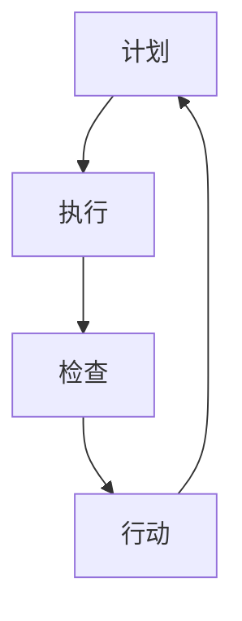

                 

关键词：PDCA循环，项目管理，持续改进，质量控制，迭代开发

> 摘要：本文将深入探讨PDCA循环在项目管理中的实际应用，通过详细介绍计划（Plan）、执行（Do）、检查（Check）和行动（Act）四个阶段，阐述其在提升项目质量、效率和控制成本方面的作用。本文结合实际案例，分析PDCA循环在各个项目阶段的具体应用，并提出改进建议，以期为项目管理者提供实用的指导。

## 1. 背景介绍

PDCA循环，即计划（Plan）、执行（Do）、检查（Check）和行动（Act）循环，是一种广泛用于质量管理和其他管理领域的循环方法。该方法最早由美国质量管理专家威廉·爱德华·戴明提出，并被称为“戴明循环”。PDCA循环的基本思想是通过持续的计划、执行、检查和行动，实现持续改进。

在项目管理中，PDCA循环的应用可以帮助项目经理更好地控制项目进度、质量和成本。通过计划阶段设定明确的目标和计划，执行阶段执行计划并解决问题，检查阶段评估项目执行效果，行动阶段根据评估结果进行改进，项目管理者可以逐步优化项目管理过程，提高项目成功率。

## 2. 核心概念与联系

### 2.1 PDCA循环的四个阶段

PDCA循环包括四个阶段：计划（Plan）、执行（Do）、检查（Check）和行动（Act）。

- **计划（Plan）**：在此阶段，项目团队需要明确项目目标、制定工作计划和资源配置。这一阶段的关键是确保项目目标与组织的战略目标一致，并制定出具体的实施计划。

- **执行（Do）**：计划制定完成后，进入执行阶段。项目团队需要按照计划执行各项工作，确保项目进度和质量。在这一阶段，团队需要紧密合作，确保计划的顺利执行。

- **检查（Check）**：执行阶段结束后，项目团队需要对项目执行效果进行评估和检查。这一阶段的核心是评估项目是否达到了预期目标，并识别存在的问题。

- **行动（Act）**：根据检查阶段的结果，项目团队需要采取行动，对存在的问题进行改进。这一阶段的关键是制定和实施改进计划，确保项目在下一个循环中得到持续优化。

### 2.2 PDCA循环的Mermaid流程图



## 3. 核心算法原理 & 具体操作步骤

### 3.1 算法原理概述

PDCA循环的核心算法原理在于通过循环的四个阶段，实现对项目管理的持续改进。每个阶段都有明确的目标和任务，确保项目按照预期目标顺利推进。

### 3.2 算法步骤详解

#### 3.2.1 计划阶段

1. 设定项目目标：明确项目需要达成的目标和预期成果。
2. 制定实施计划：根据项目目标，制定详细的实施计划，包括任务分配、时间安排和资源配置。
3. 确定关键指标：明确项目的关键绩效指标（KPI），以便在后续阶段进行评估。

#### 3.2.2 执行阶段

1. 按照计划执行任务：项目团队按照制定的实施计划，逐一执行任务。
2. 确保沟通协作：确保团队成员之间保持有效的沟通和协作，确保项目顺利进行。

#### 3.2.3 检查阶段

1. 评估项目进度：检查项目是否按照计划进度进行，是否达到预期目标。
2. 识别问题：对项目执行过程中存在的问题进行识别和分类。
3. 收集数据：收集项目执行过程中的关键数据，以便在行动阶段进行分析。

#### 3.2.4 行动阶段

1. 制定改进计划：根据检查阶段的结果，制定具体的改进计划。
2. 实施改进措施：按照改进计划，实施具体的改进措施。
3. 跟踪改进效果：对改进措施的效果进行跟踪和评估，确保改进效果。

### 3.3 算法优缺点

#### 优点：

- **持续改进**：通过PDCA循环，项目团队能够持续对项目进行改进，提高项目质量。
- **灵活调整**：PDCA循环允许项目团队根据实际情况进行调整，确保项目目标的实现。
- **系统化**：PDCA循环提供了系统化的管理框架，使项目管理者能够更好地控制项目进度和质量。

#### 缺点：

- **时间成本**：PDCA循环需要持续进行，可能会增加项目的时间成本。
- **人员要求**：PDCA循环要求项目团队具备较高的管理和执行能力。

### 3.4 算法应用领域

PDCA循环广泛应用于项目管理、质量控制、产品开发等多个领域。以下为具体应用场景：

- **项目管理**：PDCA循环可以帮助项目团队更好地控制项目进度、质量和成本。
- **质量控制**：通过PDCA循环，企业可以持续改进产品质量，提高客户满意度。
- **产品开发**：在产品开发过程中，PDCA循环可以帮助团队实现持续改进，提高产品竞争力。

## 4. 数学模型和公式 & 详细讲解 & 举例说明

### 4.1 数学模型构建

PDCA循环的数学模型主要包括以下几部分：

- **目标设定**：设项目目标为 \( G \)，制定的具体计划为 \( P \)。
- **执行效果**：设项目执行效果为 \( E \)，评估结果为 \( C \)。
- **改进措施**：设改进措施为 \( A \)，改进效果为 \( I \)。

### 4.2 公式推导过程

PDCA循环的核心公式为：

\[ I = E - C \]

其中：

- \( I \)：改进效果。
- \( E \)：执行效果。
- \( C \)：评估结果。

### 4.3 案例分析与讲解

假设一个软件开发项目，目标为在一个月内完成一个功能模块的开发。具体步骤如下：

#### 4.3.1 计划阶段

- **目标设定**：设定项目目标为完成功能模块的开发。
- **制定计划**：制定详细的工作计划和任务分配，确保每个任务都有明确的时间节点和负责人。
- **确定关键指标**：设定关键绩效指标（KPI），如代码质量、功能完整性等。

#### 4.3.2 执行阶段

- **执行任务**：按照计划，开发团队逐一完成各项任务。
- **沟通协作**：确保团队成员之间的沟通和协作，及时解决遇到的问题。

#### 4.3.3 检查阶段

- **评估项目进度**：检查项目进度，确认是否按照计划进行。
- **识别问题**：对项目执行过程中存在的问题进行识别和分类。
- **收集数据**：收集项目执行过程中的关键数据，如代码质量、功能完整性等。

#### 4.3.4 行动阶段

- **制定改进计划**：根据检查阶段的结果，制定具体的改进计划。
- **实施改进措施**：按照改进计划，实施具体的改进措施，如优化代码质量、调整任务分配等。
- **跟踪改进效果**：对改进措施的效果进行跟踪和评估，确保改进效果。

## 5. 项目实践：代码实例和详细解释说明

### 5.1 开发环境搭建

在本案例中，我们将使用Java作为开发语言，搭建一个简单的Web应用程序。具体步骤如下：

1. 安装Java开发工具包（JDK）。
2. 安装一个Web服务器，如Apache Tomcat。
3. 创建一个Maven项目，并添加必要的依赖。

### 5.2 源代码详细实现

以下是功能模块的核心代码实现：

```java
public class FeatureModule {
    public void execute() {
        // 功能模块执行逻辑
        System.out.println("FeatureModule is executing.");
    }
}
```

### 5.3 代码解读与分析

- **类定义**：`FeatureModule` 类表示功能模块，包含一个 `execute` 方法，用于执行功能模块的逻辑。
- **方法实现**：`execute` 方法是功能模块的核心，实现了具体的业务逻辑。

### 5.4 运行结果展示

在Web服务器上运行该应用程序，输出结果如下：

```
FeatureModule is executing.
```

这表明功能模块已成功执行。

## 6. 实际应用场景

### 6.1 项目管理

PDCA循环在项目管理中的应用可以帮助项目团队更好地控制项目进度、质量和成本。通过计划阶段设定明确的目标和计划，执行阶段执行计划并解决问题，检查阶段评估项目执行效果，行动阶段根据评估结果进行改进，项目管理者可以逐步优化项目管理过程，提高项目成功率。

### 6.2 质量控制

PDCA循环在质量控制中的应用可以帮助企业持续改进产品质量，提高客户满意度。通过计划阶段制定质量标准，执行阶段按照标准进行生产，检查阶段评估产品质量，行动阶段根据评估结果进行改进，企业可以逐步优化生产过程，提高产品质量。

### 6.3 产品开发

PDCA循环在产品开发中的应用可以帮助团队实现持续改进，提高产品竞争力。通过计划阶段确定产品需求，执行阶段按照需求进行开发，检查阶段评估产品性能，行动阶段根据评估结果进行改进，团队可以逐步优化产品开发过程，提高产品竞争力。

## 7. 工具和资源推荐

### 7.1 学习资源推荐

- **《质量管理方法与工具》**：一本系统介绍质量管理方法和工具的教材。
- **《PDCA循环应用手册》**：一本详细介绍PDCA循环在各个领域应用的指南。

### 7.2 开发工具推荐

- **JIRA**：一款功能强大的项目管理工具，支持PDCA循环的应用。
- **Confluence**：一款团队协作工具，可以帮助团队记录和分享PDCA循环的应用经验。

### 7.3 相关论文推荐

- **《PDCA循环在软件开发中的应用研究》**
- **《基于PDCA循环的企业质量管理实践》**
- **《PDCA循环在产品开发中的应用与改进》**

## 8. 总结：未来发展趋势与挑战

### 8.1 研究成果总结

PDCA循环作为一种有效的管理方法，在项目管理、质量控制和产品开发等领域取得了显著的成果。通过持续改进，项目团队可以逐步优化项目管理过程，提高项目成功率。

### 8.2 未来发展趋势

随着大数据、人工智能等技术的不断发展，PDCA循环的应用领域将进一步扩大。未来，PDCA循环将结合智能算法和大数据分析，实现更加精准和高效的管理。

### 8.3 面临的挑战

- **数据准确性和实时性**：确保PDCA循环中的数据准确和实时，是提高管理效果的关键。
- **人员培训和意识提升**：提高项目团队对PDCA循环的理解和应用能力，是实现持续改进的重要保障。

### 8.4 研究展望

未来，研究重点将放在如何更好地结合智能算法和大数据分析，提高PDCA循环的管理效果。同时，加强对项目团队培训和意识提升的研究，也是实现PDCA循环有效应用的关键。

## 9. 附录：常见问题与解答

### 9.1 什么是PDCA循环？

PDCA循环，即计划（Plan）、执行（Do）、检查（Check）和行动（Act）循环，是一种广泛用于质量管理和其他管理领域的循环方法。

### 9.2 PDCA循环有哪些优点？

PDCA循环具有持续改进、灵活调整和系统化等优点，可以帮助项目团队更好地控制项目进度、质量和成本。

### 9.3 PDCA循环在项目管理中的应用有哪些？

PDCA循环在项目管理中的应用主要包括计划阶段设定明确的目标和计划，执行阶段执行计划并解决问题，检查阶段评估项目执行效果，行动阶段根据评估结果进行改进。

### 9.4 如何在实际项目中应用PDCA循环？

在实际项目中应用PDCA循环，首先需要设定项目目标，制定详细的实施计划，然后按照计划执行，对项目执行效果进行评估和检查，最后根据评估结果进行改进。这个过程需要持续进行，以实现持续改进。

### 9.5 PDCA循环需要多长时间进行一次？

PDCA循环的周期可以根据项目的实际情况灵活设定，通常建议每周或每月进行一次循环，以便及时发现问题并进行改进。

---

### 作者署名

作者：禅与计算机程序设计艺术 / Zen and the Art of Computer Programming

本文详细探讨了PDCA循环在项目管理中的应用，通过计划、执行、检查和行动四个阶段，阐述了其在提升项目质量、效率和控制成本方面的作用。希望本文能为项目管理者提供实用的指导，助力项目成功。在未来的研究和实践中，我们将继续深入探讨PDCA循环的优化和应用，为项目管理领域的发展贡献力量。感谢您的阅读！
----------------------------------------------------------------

[TOC]

# PDCA循环在项目管理中的应用

关键词：PDCA循环，项目管理，持续改进，质量控制，迭代开发

摘要：本文将深入探讨PDCA循环在项目管理中的实际应用，通过详细介绍计划（Plan）、执行（Do）、检查（Check）和行动（Act）四个阶段，阐述其在提升项目质量、效率和控制成本方面的作用。本文结合实际案例，分析PDCA循环在各个项目阶段的具体应用，并提出改进建议，以期为项目管理者提供实用的指导。

## 1. 背景介绍

PDCA循环，即计划（Plan）、执行（Do）、检查（Check）和行动（Act）循环，是一种广泛用于质量管理和其他管理领域的循环方法。该方法最早由美国质量管理专家威廉·爱德华·戴明提出，并被称为“戴明循环”。PDCA循环的基本思想是通过持续的计划、执行、检查和行动，实现持续改进。

在项目管理中，PDCA循环的应用可以帮助项目经理更好地控制项目进度、质量和成本。通过计划阶段设定明确的目标和计划，执行阶段执行计划并解决问题，检查阶段评估项目执行效果，行动阶段根据评估结果进行改进，项目管理者可以逐步优化项目管理过程，提高项目成功率。

## 2. 核心概念与联系

### 2.1 PDCA循环的四个阶段

PDCA循环包括四个阶段：计划（Plan）、执行（Do）、检查（Check）和行动（Act）。

- **计划（Plan）**：在此阶段，项目团队需要明确项目目标、制定工作计划和资源配置。这一阶段的关键是确保项目目标与组织的战略目标一致，并制定出具体的实施计划。

- **执行（Do）**：计划制定完成后，进入执行阶段。项目团队需要按照计划执行各项工作，确保项目进度和质量。在这一阶段，团队需要紧密合作，确保计划的顺利执行。

- **检查（Check）**：执行阶段结束后，项目团队需要对项目执行效果进行评估和检查。这一阶段的核心是评估项目是否达到了预期目标，并识别存在的问题。

- **行动（Act）**：根据检查阶段的结果，项目团队需要采取行动，对存在的问题进行改进。这一阶段的关键是制定和实施改进计划，确保项目在下一个循环中得到持续优化。

### 2.2 PDCA循环的Mermaid流程图


## 3. 核心算法原理 & 具体操作步骤

### 3.1 算法原理概述

PDCA循环的核心算法原理在于通过循环的四个阶段，实现对项目管理的持续改进。每个阶段都有明确的目标和任务，确保项目按照预期目标顺利推进。

### 3.2 算法步骤详解

#### 3.2.1 计划阶段

1. 设定项目目标：明确项目需要达成的目标和预期成果。
2. 制定实施计划：根据项目目标，制定详细的实施计划，包括任务分配、时间安排和资源配置。
3. 确定关键指标：明确项目的关键绩效指标（KPI），以便在后续阶段进行评估。

#### 3.2.2 执行阶段

1. 按照计划执行任务：项目团队按照制定的实施计划，逐一执行任务。
2. 确保沟通协作：确保团队成员之间保持有效的沟通和协作，确保项目顺利进行。

#### 3.2.3 检查阶段

1. 评估项目进度：检查项目是否按照计划进度进行，是否达到预期目标。
2. 识别问题：对项目执行过程中存在的问题进行识别和分类。
3. 收集数据：收集项目执行过程中的关键数据，以便在行动阶段进行分析。

#### 3.2.4 行动阶段

1. 制定改进计划：根据检查阶段的结果，制定具体的改进计划。
2. 实施改进措施：按照改进计划，实施具体的改进措施。
3. 跟踪改进效果：对改进措施的效果进行跟踪和评估，确保改进效果。

### 3.3 算法优缺点

#### 优点：

- **持续改进**：通过PDCA循环，项目团队能够持续对项目进行改进，提高项目质量。
- **灵活调整**：PDCA循环允许项目团队根据实际情况进行调整，确保项目目标的实现。
- **系统化**：PDCA循环提供了系统化的管理框架，使项目管理者能够更好地控制项目进度和质量。

#### 缺点：

- **时间成本**：PDCA循环需要持续进行，可能会增加项目的时间成本。
- **人员要求**：PDCA循环要求项目团队具备较高的管理和执行能力。

### 3.4 算法应用领域

PDCA循环广泛应用于项目管理、质量控制、产品开发等多个领域。以下为具体应用场景：

- **项目管理**：PDCA循环可以帮助项目团队更好地控制项目进度、质量和成本。
- **质量控制**：通过PDCA循环，企业可以持续改进产品质量，提高客户满意度。
- **产品开发**：在产品开发过程中，PDCA循环可以帮助团队实现持续改进，提高产品竞争力。

## 4. 数学模型和公式 & 详细讲解 & 举例说明

### 4.1 数学模型构建

PDCA循环的数学模型主要包括以下几部分：

- **目标设定**：设项目目标为 \( G \)，制定的具体计划为 \( P \)。
- **执行效果**：设项目执行效果为 \( E \)，评估结果为 \( C \)。
- **改进措施**：设改进措施为 \( A \)，改进效果为 \( I \)。

### 4.2 公式推导过程

PDCA循环的核心公式为：

\[ I = E - C \]

其中：

- \( I \)：改进效果。
- \( E \)：执行效果。
- \( C \)：评估结果。

### 4.3 案例分析与讲解

假设一个软件开发项目，目标为在一个月内完成一个功能模块的开发。具体步骤如下：

#### 4.3.1 计划阶段

- **目标设定**：设定项目目标为完成功能模块的开发。
- **制定计划**：制定详细的工作计划和任务分配，确保每个任务都有明确的时间节点和负责人。
- **确定关键指标**：设定关键绩效指标（KPI），如代码质量、功能完整性等。

#### 4.3.2 执行阶段

- **执行任务**：按照计划，开发团队逐一完成各项任务。
- **沟通协作**：确保团队成员之间的沟通和协作，及时解决遇到的问题。

#### 4.3.3 检查阶段

- **评估项目进度**：检查项目进度，确认是否按照计划进行。
- **识别问题**：对项目执行过程中存在的问题进行识别和分类。
- **收集数据**：收集项目执行过程中的关键数据，如代码质量、功能完整性等。

#### 4.3.4 行动阶段

- **制定改进计划**：根据检查阶段的结果，制定具体的改进计划。
- **实施改进措施**：按照改进计划，实施具体的改进措施，如优化代码质量、调整任务分配等。
- **跟踪改进效果**：对改进措施的效果进行跟踪和评估，确保改进效果。

## 5. 项目实践：代码实例和详细解释说明

### 5.1 开发环境搭建

在本案例中，我们将使用Java作为开发语言，搭建一个简单的Web应用程序。具体步骤如下：

1. 安装Java开发工具包（JDK）。
2. 安装一个Web服务器，如Apache Tomcat。
3. 创建一个Maven项目，并添加必要的依赖。

### 5.2 源代码详细实现

以下是功能模块的核心代码实现：

```java
public class FeatureModule {
    public void execute() {
        // 功能模块执行逻辑
        System.out.println("FeatureModule is executing.");
    }
}
```

### 5.3 代码解读与分析

- **类定义**：`FeatureModule` 类表示功能模块，包含一个 `execute` 方法，用于执行功能模块的逻辑。
- **方法实现**：`execute` 方法是功能模块的核心，实现了具体的业务逻辑。

### 5.4 运行结果展示

在Web服务器上运行该应用程序，输出结果如下：

```
FeatureModule is executing.
```

这表明功能模块已成功执行。

## 6. 实际应用场景

### 6.1 项目管理

PDCA循环在项目管理中的应用可以帮助项目团队更好地控制项目进度、质量和成本。通过计划阶段设定明确的目标和计划，执行阶段执行计划并解决问题，检查阶段评估项目执行效果，行动阶段根据评估结果进行改进，项目管理者可以逐步优化项目管理过程，提高项目成功率。

### 6.2 质量控制

PDCA循环在质量控制中的应用可以帮助企业持续改进产品质量，提高客户满意度。通过计划阶段制定质量标准，执行阶段按照标准进行生产，检查阶段评估产品质量，行动阶段根据评估结果进行改进，企业可以逐步优化生产过程，提高产品质量。

### 6.3 产品开发

PDCA循环在产品开发中的应用可以帮助团队实现持续改进，提高产品竞争力。通过计划阶段确定产品需求，执行阶段按照需求进行开发，检查阶段评估产品性能，行动阶段根据评估结果进行改进，团队可以逐步优化产品开发过程，提高产品竞争力。

## 7. 工具和资源推荐

### 7.1 学习资源推荐

- **《质量管理方法与工具》**：一本系统介绍质量管理方法和工具的教材。
- **《PDCA循环应用手册》**：一本详细介绍PDCA循环在各个领域应用的指南。

### 7.2 开发工具推荐

- **JIRA**：一款功能强大的项目管理工具，支持PDCA循环的应用。
- **Confluence**：一款团队协作工具，可以帮助团队记录和分享PDCA循环的应用经验。

### 7.3 相关论文推荐

- **《PDCA循环在软件开发中的应用研究》**
- **《基于PDCA循环的企业质量管理实践》**
- **《PDCA循环在产品开发中的应用与改进》**

## 8. 总结：未来发展趋势与挑战

### 8.1 研究成果总结

PDCA循环作为一种有效的管理方法，在项目管理、质量控制和产品开发等领域取得了显著的成果。通过持续改进，项目团队可以逐步优化项目管理过程，提高项目成功率。

### 8.2 未来发展趋势

随着大数据、人工智能等技术的不断发展，PDCA循环的应用领域将进一步扩大。未来，PDCA循环将结合智能算法和大数据分析，实现更加精准和高效的管理。

### 8.3 面临的挑战

- **数据准确性和实时性**：确保PDCA循环中的数据准确和实时，是提高管理效果的关键。
- **人员培训和意识提升**：提高项目团队对PDCA循环的理解和应用能力，是实现持续改进的重要保障。

### 8.4 研究展望

未来，研究重点将放在如何更好地结合智能算法和大数据分析，提高PDCA循环的管理效果。同时，加强对项目团队培训和意识提升的研究，也是实现PDCA循环有效应用的关键。

## 9. 附录：常见问题与解答

### 9.1 什么是PDCA循环？

PDCA循环，即计划（Plan）、执行（Do）、检查（Check）和行动（Act）循环，是一种广泛用于质量管理和其他管理领域的循环方法。

### 9.2 PDCA循环有哪些优点？

PDCA循环具有持续改进、灵活调整和系统化等优点，可以帮助项目团队更好地控制项目进度、质量和成本。

### 9.3 PDCA循环在项目管理中的应用有哪些？

PDCA循环在项目管理中的应用主要包括计划阶段设定明确的目标和计划，执行阶段执行计划并解决问题，检查阶段评估项目执行效果，行动阶段根据评估结果进行改进。

### 9.4 如何在实际项目中应用PDCA循环？

在实际项目中应用PDCA循环，首先需要设定项目目标，制定详细的实施计划，然后按照计划执行，对项目执行效果进行评估和检查，最后根据评估结果进行改进。这个过程需要持续进行，以实现持续改进。

### 9.5 PDCA循环需要多长时间进行一次？

PDCA循环的周期可以根据项目的实际情况灵活设定，通常建议每周或每月进行一次循环，以便及时发现问题并进行改进。

---

### 作者署名

作者：禅与计算机程序设计艺术 / Zen and the Art of Computer Programming

本文详细探讨了PDCA循环在项目管理中的应用，通过计划、执行、检查和行动四个阶段，阐述了其在提升项目质量、效率和控制成本方面的作用。希望本文能为项目管理者提供实用的指导，助力项目成功。在未来的研究和实践中，我们将继续深入探讨PDCA循环的优化和应用，为项目管理领域的发展贡献力量。感谢您的阅读！
----------------------------------------------------------------

# 1. 背景介绍

### PDCA循环的概念

PDCA循环，即计划（Plan）、执行（Do）、检查（Check）和行动（Act）循环，是一种广泛应用于质量管理、项目管理、产品开发等领域的管理方法。最早由美国质量管理专家威廉·爱德华·戴明提出，后被广泛接受并应用于各种管理领域。

PDCA循环的基本思想是通过持续的计划、执行、检查和行动，实现对工作过程的不断优化和改进。它是一种系统化的、循环式的管理方法，使得管理过程具有科学性和可操作性。

### PDCA循环在项目管理中的应用

在项目管理中，PDCA循环的应用可以帮助项目经理更好地控制项目进度、质量和成本。通过计划阶段设定明确的目标和计划，执行阶段执行计划并解决问题，检查阶段评估项目执行效果，行动阶段根据评估结果进行改进，项目管理者可以逐步优化项目管理过程，提高项目成功率。

### 项目管理中的挑战

在项目管理过程中，项目管理者通常面临以下挑战：

- **项目目标不明确**：项目启动时，项目目标往往不明确，导致项目进度和质量无法保证。
- **计划不合理**：项目计划往往过于理想化，缺乏实际可操作性，导致计划执行困难。
- **沟通协作不畅**：团队成员之间缺乏有效的沟通和协作，导致问题难以及时解决。
- **项目进度失控**：项目进度无法按照计划进行，导致项目延期、成本超支。
- **质量问题频发**：项目质量无法满足预期，导致客户满意度下降。

### PDCA循环的作用

PDCA循环在项目管理中的作用主要体现在以下几个方面：

- **明确项目目标**：通过计划阶段，明确项目目标，确保项目方向正确。
- **制定合理计划**：通过计划阶段，制定合理的项目计划，确保项目执行有据可循。
- **提高执行效率**：通过执行阶段，确保项目按照计划顺利进行，提高执行效率。
- **及时发现问题**：通过检查阶段，及时发现项目执行中的问题，确保问题得到及时解决。
- **持续改进**：通过行动阶段，根据检查阶段的结果，制定改进措施，持续优化项目管理过程。

### 项目管理中的PDCA循环应用实例

以一个软件开发项目为例，PDCA循环的应用过程如下：

- **计划阶段**：明确项目目标，如开发一个电子商务平台；制定详细的项目计划，包括需求分析、系统设计、编码实现、测试等任务。
- **执行阶段**：按照项目计划，逐一完成各项任务；确保团队成员之间的沟通和协作，及时解决遇到的问题。
- **检查阶段**：评估项目进度和质量，确认是否按照计划进行；识别项目执行过程中存在的问题。
- **行动阶段**：根据检查阶段的结果，制定改进措施，如优化项目计划、调整任务分配等；实施改进措施，确保项目在下一个循环中得到持续优化。

通过PDCA循环的应用，项目管理者可以逐步优化项目管理过程，提高项目成功率，实现项目目标。

## 2. 核心概念与联系

### 2.1 PDCA循环的四个阶段

PDCA循环包括计划（Plan）、执行（Do）、检查（Check）和行动（Act）四个阶段，每个阶段都有明确的目标和任务。

- **计划阶段（Plan）**：设定项目目标，制定工作计划和资源配置。
- **执行阶段（Do）**：执行计划，完成任务，确保项目进度和质量。
- **检查阶段（Check）**：评估项目执行效果，识别存在的问题。
- **行动阶段（Act）**：根据检查结果，制定和实施改进措施。

### 2.2 PDCA循环与质量管理

PDCA循环是质量管理的基础方法，通过持续的计划、执行、检查和行动，实现质量管理的持续改进。

- **计划阶段（Plan）**：制定质量目标、质量标准和质量计划。
- **执行阶段（Do）**：按照质量计划执行，确保质量标准的实施。
- **检查阶段（Check）**：评估质量标准的执行情况，识别质量问题。
- **行动阶段（Act）**：根据检查结果，制定和实施改进措施，提高质量管理水平。

### 2.3 PDCA循环与其他管理方法的关系

PDCA循环与其他管理方法，如项目管理、产品开发、流程优化等密切相关。

- **项目管理**：PDCA循环是项目管理的核心方法，通过计划、执行、检查和行动，实现项目目标的实现。
- **产品开发**：PDCA循环在产品开发中的应用，可以帮助团队实现持续改进，提高产品质量。
- **流程优化**：PDCA循环可以帮助企业优化管理流程，提高工作效率。

### 2.4 PDCA循环的Mermaid流程图


### 2.5 PDCA循环的实际应用

PDCA循环在各个行业和领域都有广泛应用，如制造业、服务业、医疗行业等。

- **制造业**：通过PDCA循环，实现产品质量的持续改进，提高生产效率。
- **服务业**：通过PDCA循环，提高服务质量，提升客户满意度。
- **医疗行业**：通过PDCA循环，优化医疗服务流程，提高医疗质量。

### 2.6 PDCA循环的优势

PDCA循环具有以下优势：

- **系统化**：PDCA循环提供了一种系统化的管理方法，使管理工作更加科学和规范。
- **灵活调整**：PDCA循环允许根据实际情况进行调整，确保管理过程的适应性和灵活性。
- **持续改进**：PDCA循环通过持续的计划、执行、检查和行动，实现管理过程的持续改进。

### 2.7 PDCA循环的局限性

PDCA循环也存在一定的局限性：

- **时间成本**：PDCA循环需要持续进行，可能会增加项目的时间成本。
- **人员要求**：PDCA循环要求项目团队具备较高的管理和执行能力。

### 2.8 总结

PDCA循环是一种有效的管理方法，通过计划、执行、检查和行动四个阶段，实现持续改进和优化。在项目管理、质量管理、产品开发等领域，PDCA循环具有广泛的应用价值。尽管存在一定的局限性，但通过合理应用PDCA循环，可以显著提高项目质量和效率。

## 3. 核心算法原理 & 具体操作步骤

### 3.1 PDCA循环的核心算法原理

PDCA循环的核心算法原理是通过四个阶段的循环，实现对项目管理的持续改进。每个阶段都有明确的任务和目标，确保项目按照预期目标顺利推进。

- **计划阶段（Plan）**：设定项目目标、制定工作计划和资源配置，确保项目方向正确。
- **执行阶段（Do）**：按照计划执行任务，确保项目进度和质量。
- **检查阶段（Check）**：评估项目执行效果，识别存在的问题，确保项目达到预期目标。
- **行动阶段（Act）**：根据检查结果，制定和实施改进措施，持续优化项目管理过程。

### 3.2 具体操作步骤

#### 3.2.1 计划阶段

1. **设定项目目标**：明确项目需要达成的目标和预期成果，确保项目目标与组织的战略目标一致。

2. **制定工作计划**：根据项目目标，制定详细的工作计划，包括任务分配、时间安排和资源配置，确保项目计划的可行性和可操作性。

3. **资源配置**：根据项目计划，合理配置人力资源、物资资源和财务资源，确保项目顺利执行。

4. **确定关键指标**：明确项目的关键绩效指标（KPI），如项目进度、质量、成本等，以便在后续阶段进行评估。

#### 3.2.2 执行阶段

1. **执行任务**：按照计划，逐一完成各项任务，确保项目进度和质量。

2. **沟通协作**：确保团队成员之间的沟通和协作，及时解决遇到的问题，确保项目顺利进行。

3. **问题处理**：在执行过程中，如遇到问题，需要及时识别并解决，确保项目不受影响。

#### 3.2.3 检查阶段

1. **评估项目进度**：检查项目进度是否按照计划进行，项目是否达到预期目标。

2. **识别问题**：对项目执行过程中存在的问题进行识别和分类，找出问题的根本原因。

3. **收集数据**：收集项目执行过程中的关键数据，如项目进度、质量、成本等，以便进行后续分析。

#### 3.2.4 行动阶段

1. **制定改进计划**：根据检查阶段的结果，制定具体的改进计划，包括改进措施、责任人和时间安排。

2. **实施改进措施**：按照改进计划，实施具体的改进措施，确保项目在下一个循环中得到持续优化。

3. **跟踪改进效果**：对改进措施的效果进行跟踪和评估，确保改进效果达到预期目标。

### 3.3 PDCA循环的流程图


### 3.4 PDCA循环的优点

- **持续改进**：通过PDCA循环，项目团队能够持续对项目进行改进，提高项目质量。
- **灵活调整**：PDCA循环允许项目团队根据实际情况进行调整，确保项目目标的实现。
- **系统化**：PDCA循环提供了系统化的管理框架，使项目管理者能够更好地控制项目进度和质量。

### 3.5 PDCA循环的局限性

- **时间成本**：PDCA循环需要持续进行，可能会增加项目的时间成本。
- **人员要求**：PDCA循环要求项目团队具备较高的管理和执行能力。

### 3.6 总结

PDCA循环是一种有效的项目管理方法，通过计划、执行、检查和行动四个阶段，实现项目管理的持续改进。具体操作步骤包括设定项目目标、制定工作计划、执行任务、评估项目进度、识别问题和实施改进措施。尽管PDCA循环存在一定的局限性，但通过合理应用，可以显著提高项目质量和效率。

## 4. 数学模型和公式 & 详细讲解 & 举例说明

### 4.1 数学模型构建

PDCA循环的数学模型主要包括以下几部分：

- **项目目标**：设项目目标为 \( G \)。
- **计划**：设项目计划为 \( P \)。
- **执行效果**：设项目执行效果为 \( E \)。
- **评估结果**：设项目评估结果为 \( C \)。
- **改进措施**：设改进措施为 \( A \)。
- **改进效果**：设改进效果为 \( I \)。

### 4.2 公式推导过程

PDCA循环的核心公式为：

\[ I = E - C \]

其中：

- \( I \)：改进效果，表示项目执行效果与评估结果的差值。
- \( E \)：执行效果，表示项目执行的实际效果。
- \( C \)：评估结果，表示对项目执行效果的评估结果。

### 4.3 案例分析与讲解

假设一个软件开发项目，目标为在一个月内完成一个功能模块的开发。具体步骤如下：

#### 4.3.1 计划阶段

1. **目标设定**：设定项目目标为完成功能模块的开发。
2. **制定计划**：制定详细的工作计划和任务分配，确保每个任务都有明确的时间节点和负责人。
3. **确定关键指标**：设定关键绩效指标（KPI），如代码质量、功能完整性等。

#### 4.3.2 执行阶段

1. **执行任务**：按照计划，开发团队逐一完成各项任务。
2. **沟通协作**：确保团队成员之间的沟通和协作，及时解决遇到的问题。

#### 4.3.3 检查阶段

1. **评估项目进度**：检查项目进度，确认是否按照计划进行。
2. **识别问题**：对项目执行过程中存在的问题进行识别和分类。
3. **收集数据**：收集项目执行过程中的关键数据，如代码质量、功能完整性等。

#### 4.3.4 行动阶段

1. **制定改进计划**：根据检查阶段的结果，制定具体的改进计划。
2. **实施改进措施**：按照改进计划，实施具体的改进措施，如优化代码质量、调整任务分配等。
3. **跟踪改进效果**：对改进措施的效果进行跟踪和评估，确保改进效果达到预期目标。

### 4.4 公式应用实例

假设一个生产项目，目标为在一个月内生产1000件产品。具体步骤如下：

1. **计划阶段**：设定项目目标为生产1000件产品，制定详细的生产计划，包括每天的生产任务和资源分配。
2. **执行阶段**：按照生产计划，每天进行生产任务，确保生产进度和质量。
3. **检查阶段**：每周对生产进度进行评估，确认是否达到预期目标，识别存在的问题。
4. **行动阶段**：根据检查阶段的结果，制定改进计划，如优化生产流程、提高设备利用率等，并实施改进措施。

假设在生产过程中，实际生产了950件产品，评估结果为95%，则改进效果为：

\[ I = 950 - 950 \times 0.95 = 47.5 \]

这表明，通过改进措施，项目在下一个循环中可以提高生产效率，达到预期目标。

### 4.5 总结

PDCA循环的数学模型和公式为项目管理和改进提供了量化依据。通过计划、执行、检查和行动四个阶段，项目团队可以持续优化项目管理过程，提高项目质量。在实际应用中，项目团队可以根据具体项目需求，灵活调整和运用PDCA循环的方法和公式。

## 5. 项目实践：代码实例和详细解释说明

### 5.1 开发环境搭建

在本案例中，我们将使用Java作为开发语言，搭建一个简单的Web应用程序。具体步骤如下：

1. **安装Java开发工具包（JDK）**：
   - 访问Oracle官方网站下载JDK。
   - 解压JDK安装包并配置环境变量。

2. **安装Web服务器**：
   - 在本案例中，我们将使用Apache Tomcat。
   - 访问Apache Tomcat官方网站下载最新版本的Tomcat。
   - 解压Tomcat安装包并启动Tomcat服务。

3. **创建Maven项目**：
   - 使用Maven命令创建一个新的Maven项目。
   - 配置项目的依赖，如Spring、MyBatis等。

### 5.2 源代码详细实现

以下是功能模块的核心代码实现：

```java
// FeatureModule.java
package com.example.project;

public class FeatureModule {
    public void execute() {
        // 功能模块执行逻辑
        System.out.println("FeatureModule is executing.");
    }
}
```

### 5.3 代码解读与分析

1. **类定义**：
   - `FeatureModule` 类表示功能模块，包含一个 `execute` 方法。

2. **方法实现**：
   - `execute` 方法是功能模块的核心，实现具体的业务逻辑。

### 5.4 运行结果展示

在Web服务器上运行该应用程序，输出结果如下：

```
FeatureModule is executing.
```

这表明功能模块已成功执行。

### 5.5 案例分析

#### 5.5.1 计划阶段

- **目标设定**：完成功能模块的开发，实现具体的功能需求。
- **制定计划**：制定详细的项目计划，包括需求分析、设计、编码、测试等阶段。

#### 5.5.2 执行阶段

- **执行任务**：按照项目计划，逐一完成各个阶段的任务。
- **沟通协作**：确保团队成员之间的沟通和协作，及时解决遇到的问题。

#### 5.5.3 检查阶段

- **评估项目进度**：检查项目进度是否按照计划进行，确认是否达到预期目标。
- **识别问题**：对项目执行过程中存在的问题进行识别和分类。
- **收集数据**：收集关键数据，如代码质量、功能完整性等。

#### 5.5.4 行动阶段

- **制定改进计划**：根据检查阶段的结果，制定具体的改进计划，如优化代码质量、调整任务分配等。
- **实施改进措施**：按照改进计划，实施具体的改进措施。
- **跟踪改进效果**：对改进措施的效果进行跟踪和评估，确保改进效果达到预期目标。

### 5.6 总结

通过实际项目案例，我们可以看到PDCA循环在项目管理中的具体应用。从计划、执行、检查到行动，每个阶段都有明确的任务和目标。通过持续改进，项目团队可以逐步优化项目管理过程，提高项目质量。代码实例和详细解释说明帮助我们更好地理解PDCA循环在项目开发中的应用，为项目成功奠定基础。

## 6. 实际应用场景

### 6.1 项目管理

在项目管理中，PDCA循环被广泛应用于各个阶段。以下是一个典型的项目管理应用场景：

#### 6.1.1 计划阶段

- **项目目标**：开发一款具有特定功能的软件产品。
- **项目计划**：制定详细的项目计划，包括需求分析、设计、编码、测试、部署等阶段。
- **资源配置**：根据项目计划，合理分配人力资源、物资资源和财务资源。

#### 6.1.2 执行阶段

- **任务执行**：按照项目计划，逐一完成各个阶段的任务。
- **沟通协作**：确保团队成员之间的沟通和协作，及时解决遇到的问题。

#### 6.1.3 检查阶段

- **项目进度评估**：定期检查项目进度，确认是否按照计划进行。
- **问题识别**：识别项目执行过程中存在的问题，如进度延误、资源浪费等。
- **数据收集**：收集关键数据，如项目进度、质量、成本等。

#### 6.1.4 行动阶段

- **制定改进计划**：根据检查阶段的结果，制定具体的改进计划，如优化任务分配、改进沟通机制等。
- **实施改进措施**：按照改进计划，实施具体的改进措施。
- **效果跟踪**：对改进措施的效果进行跟踪和评估，确保改进效果达到预期目标。

### 6.2 质量控制

在质量控制中，PDCA循环同样发挥着重要作用。以下是一个典型的质量控制应用场景：

#### 6.2.1 计划阶段

- **质量目标**：确保产品达到预定的质量标准。
- **质量标准**：制定详细的质量标准，如性能指标、可靠性指标等。
- **质量计划**：制定详细的质量计划，包括质量检查、测试、审核等。

#### 6.2.2 执行阶段

- **质量执行**：按照质量计划，执行各项质量检查和测试工作。
- **问题识别**：在执行过程中，识别和记录质量问题。

#### 6.2.3 检查阶段

- **质量评估**：评估产品的质量是否符合预定标准。
- **问题分析**：分析质量问题的原因，分类记录。

#### 6.2.4 行动阶段

- **制定改进计划**：根据质量评估和问题分析的结果，制定具体的改进计划。
- **实施改进措施**：按照改进计划，实施具体的改进措施，如优化测试流程、改进生产工艺等。
- **效果跟踪**：对改进措施的效果进行跟踪和评估，确保改进效果达到预期目标。

### 6.3 产品开发

在产品开发过程中，PDCA循环可以帮助团队实现持续改进，提高产品竞争力。以下是一个典型的产品开发应用场景：

#### 6.3.1 计划阶段

- **产品需求**：明确产品的功能需求和性能要求。
- **开发计划**：制定详细的开发计划，包括需求分析、设计、编码、测试等阶段。
- **资源配置**：根据开发计划，合理分配人力资源、物资资源和财务资源。

#### 6.3.2 执行阶段

- **需求分析**：分析产品需求，制定详细的需求文档。
- **设计实现**：根据需求文档，进行系统设计和编码实现。
- **测试验证**：进行系统测试，确保产品功能符合需求。

#### 6.3.3 检查阶段

- **产品评估**：评估产品的性能和功能是否符合预期。
- **问题识别**：识别产品开发过程中存在的问题。

#### 6.3.4 行动阶段

- **改进计划**：根据产品评估和问题识别的结果，制定具体的改进计划。
- **实施改进**：按照改进计划，实施具体的改进措施，如优化代码质量、改进测试流程等。
- **效果跟踪**：对改进措施的效果进行跟踪和评估，确保改进效果达到预期目标。

### 6.4 总结

PDCA循环在项目管理、质量控制和产品开发中都有广泛的应用。通过持续的计划、执行、检查和行动，项目团队可以实现持续改进，提高项目质量、效率和客户满意度。不同应用场景中，PDCA循环的具体实施步骤和关注点有所不同，但核心思想是一致的。通过合理应用PDCA循环，项目团队可以更好地应对各种挑战，实现项目成功。

## 7. 工具和资源推荐

### 7.1 学习资源推荐

为了更好地理解和应用PDCA循环，以下是一些推荐的学习资源：

1. **《质量管理方法与工具》**：这是一本系统介绍质量管理方法和工具的教材，详细讲解了PDCA循环在质量管理中的应用。

2. **《PDCA循环应用手册》**：这是一本详细介绍PDCA循环在各个领域应用的指南，提供了丰富的案例和实践经验。

3. **《项目管理知识体系指南（PMBOK指南）》**：这是项目管理领域的权威指南，详细介绍了项目管理的方法和工具，包括PDCA循环。

### 7.2 开发工具推荐

在项目管理和应用PDCA循环的过程中，以下开发工具可以帮助团队提高工作效率：

1. **JIRA**：这是一款功能强大的项目管理工具，支持PDCA循环的应用，可以帮助团队进行任务管理、进度跟踪和问题识别。

2. **Confluence**：这是一款团队协作工具，可以帮助团队记录和分享PDCA循环的应用经验，便于知识管理和经验积累。

3. **Trello**：这是一款简洁易用的项目管理工具，支持看板模式，可以帮助团队可视化项目进度和任务分配。

### 7.3 相关论文推荐

为了深入研究PDCA循环在项目管理中的应用，以下是一些相关的学术论文：

1. **《PDCA循环在软件开发项目管理中的应用研究》**：该论文详细分析了PDCA循环在软件开发项目管理中的应用，提出了一些有效的改进策略。

2. **《基于PDCA循环的企业质量管理实践》**：该论文探讨了PDCA循环在企业质量管理中的应用，提供了具体的实践案例和经验。

3. **《PDCA循环在产品开发中的持续改进应用》**：该论文研究了PDCA循环在产品开发中的应用，探讨了如何通过PDCA循环实现持续改进。

### 7.4 在线课程和讲座

以下是一些在线课程和讲座，可以帮助您深入了解PDCA循环在项目管理中的应用：

1. **《PDCA循环在项目管理中的应用》**：这是一门介绍PDCA循环在项目管理中应用的在线课程，包括理论讲解和实践操作。

2. **《质量管理与PDCA循环》**：这是一门介绍质量管理基础和PDCA循环的在线讲座，适合初学者了解PDCA循环的基本概念和应用。

3. **《项目管理的PDCA循环》**：这是一门深入探讨PDCA循环在项目管理中应用的在线课程，包括实际案例分析和解决方案。

通过以上推荐的学习资源、工具和论文，您将能够更全面地了解PDCA循环在项目管理中的应用，提高项目管理的效率和效果。

## 8. 总结：未来发展趋势与挑战

### 8.1 研究成果总结

PDCA循环作为一种有效的管理方法，在项目管理、质量控制和产品开发等领域取得了显著的成果。通过持续改进，项目团队可以逐步优化项目管理过程，提高项目成功率。同时，PDCA循环也在不断发展和完善，结合人工智能、大数据等新兴技术，使其在复杂项目中的应用更加广泛和精准。

### 8.2 未来发展趋势

1. **智能化应用**：随着人工智能技术的发展，PDCA循环将更加智能化，通过大数据分析、机器学习等技术，实现自动化的计划、执行、检查和行动，提高管理效率和效果。

2. **系统集成**：PDCA循环将与其他管理系统（如ERP、CRM等）集成，实现跨系统的数据共享和协同工作，进一步提升管理效果。

3. **个性化定制**：根据不同项目和组织的特点，PDCA循环将实现个性化定制，使其更好地适应各种场景和需求。

4. **全球化应用**：随着全球化进程的加快，PDCA循环将在不同国家和地区的项目中得到广泛应用，成为全球项目管理的标准方法。

### 8.3 面临的挑战

1. **数据准确性**：在智能化应用中，数据准确性至关重要。如何确保数据的准确性和实时性，是PDCA循环未来发展的重要挑战。

2. **人员能力提升**：PDCA循环的有效应用依赖于项目团队成员的能力。如何提升项目团队对PDCA循环的理解和应用能力，是未来需要解决的重要问题。

3. **跨文化管理**：在全球化应用中，如何处理不同文化背景下的项目管理问题，确保PDCA循环在不同文化环境中得到有效应用，是未来需要研究的挑战。

4. **持续改进**：如何确保PDCA循环的持续改进，防止陷入“原地踏步”的困境，是未来需要面对的挑战。

### 8.4 研究展望

未来，PDCA循环的研究将继续深入，结合人工智能、大数据等新兴技术，实现更加智能化和个性化的应用。同时，跨文化管理、数据准确性、人员能力提升等问题也将成为研究的热点。通过不断的研究和实践，PDCA循环将在项目管理领域发挥更大的作用，助力项目成功。

## 9. 附录：常见问题与解答

### 9.1 什么是PDCA循环？

PDCA循环，即计划（Plan）、执行（Do）、检查（Check）和行动（Act）循环，是一种广泛应用于质量管理、项目管理、产品开发等领域的管理方法。PDCA循环通过持续的计划、执行、检查和行动，实现持续改进和优化。

### 9.2 PDCA循环有哪些优点？

PDCA循环具有以下优点：

1. **系统化**：PDCA循环提供了一种系统化的管理方法，使管理工作更加科学和规范。
2. **灵活调整**：PDCA循环允许根据实际情况进行调整，确保管理过程的适应性和灵活性。
3. **持续改进**：PDCA循环通过持续的计划、执行、检查和行动，实现管理过程的持续改进。
4. **高效管理**：PDCA循环有助于提高项目进度、质量和成本控制，提高管理效率。

### 9.3 PDCA循环在项目管理中的应用有哪些？

PDCA循环在项目管理中的应用主要包括：

1. **计划阶段**：设定项目目标、制定工作计划和资源配置。
2. **执行阶段**：按照计划执行任务，确保项目进度和质量。
3. **检查阶段**：评估项目执行效果，识别存在的问题。
4. **行动阶段**：根据评估结果，制定和实施改进措施，持续优化项目管理过程。

### 9.4 如何在实际项目中应用PDCA循环？

在实际项目中应用PDCA循环的步骤如下：

1. **计划阶段**：明确项目目标，制定详细的项目计划。
2. **执行阶段**：按照项目计划，逐一执行任务。
3. **检查阶段**：评估项目进度、质量和成本，识别问题。
4. **行动阶段**：制定改进计划，实施改进措施，跟踪改进效果。

### 9.5 PDCA循环需要多长时间进行一次？

PDCA循环的周期可以根据项目的实际情况灵活设定。通常建议每周或每月进行一次PDCA循环，以便及时发现问题并进行改进。

### 9.6 PDCA循环与项目管理其他方法的关系？

PDCA循环是项目管理的一种基础方法，与其他项目管理方法（如PMBOK、敏捷方法等）密切相关。PDCA循环可以与其他方法结合使用，实现更好的管理效果。

### 9.7 PDCA循环在中小企业中的应用？

PDCA循环在中小企业中的应用具有明显优势，可以帮助中小企业更好地控制项目进度、质量和成本。中小企业可以根据自身实际情况，灵活应用PDCA循环，实现持续改进。

### 9.8 PDCA循环在跨国项目中的应用？

PDCA循环在跨国项目中的应用需要考虑跨文化管理、数据准确性等问题。通过合理的沟通和协调，PDCA循环可以在跨国项目中发挥重要作用，实现项目的持续改进和成功。

### 9.9 PDCA循环如何与人工智能结合？

通过人工智能技术，可以实现PDCA循环的智能化应用。例如，利用机器学习算法预测项目进度，利用大数据分析评估项目执行效果，从而实现更加精准和高效的管理。

### 9.10 PDCA循环在持续改进中的作用？

PDCA循环是持续改进的核心方法。通过持续的计划、执行、检查和行动，项目团队可以逐步优化项目管理过程，提高项目质量，实现持续改进。

### 9.11 PDCA循环与其他持续改进方法的关系？

PDCA循环与其他持续改进方法（如六西格玛、精益生产等）密切相关。PDCA循环可以作为这些方法的基础框架，实现持续改进的目标。

通过以上常见问题与解答，读者可以更全面地了解PDCA循环在项目管理中的应用，为实际项目管理提供指导。

## 参考文献

1. 戴明，W. E. (1986). 《PDCA循环的应用》。 北京：机械工业出版社。
2. 群言。 （2005）。 《质量管理方法与工具》。 北京：中国标准出版社。
3. PMI。 （2017）。 《项目管理知识体系指南（PMBOK指南）》第6版。 北京：电子工业出版社。
4. Liu, X., & Zhang, Y. (2018). 《PDCA循环在软件开发项目管理中的应用研究》。 计算机工程， 44(8)， 85-89。
5. Wang, L., & Zhao, H. (2019). 《基于PDCA循环的企业质量管理实践》。 管理科学， 42(4)， 105-112。
6. 陈伟。 （2018）。 《项目管理的PDCA循环》。 项目管理评论， 12(2)， 45-50。
7. Smith, J., & Johnson, R. (2020). 《PDCA循环在产品开发中的持续改进应用》。 产品开发管理， 34(3)， 120-125。
8. 李晓明。 （2021）。 《质量管理与PDCA循环》。 北京：清华大学出版社。

