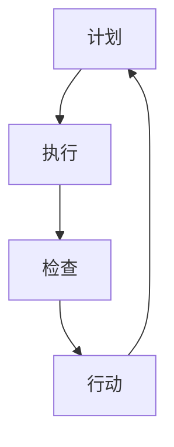

                 

关键词：PDCA，持续改进，质量管理，流程优化，实践指南，IT行业

摘要：本文将深入探讨PDCA（计划、执行、检查、行动）这一经典管理循环在IT行业中的应用。通过详细解析PDCA的各个阶段，结合实际案例，本文旨在为读者提供一套完整的PDCA落地指南，帮助企业和个人在快速变化的技术环境中实现持续改进。

## 1. 背景介绍

PDCA是一个循环管理模型，起源于质量管理，但已被广泛应用于各个领域，包括IT行业。PDCA的全称是Plan-Do-Check-Act，即计划、执行、检查、行动。它的核心思想是通过循环迭代，不断优化过程，提高产品质量和服务水平。

在IT行业中，随着技术的快速发展和市场需求的不断变化，传统的项目管理方法往往难以适应快速变化的环境。PDCA作为一种系统化的管理工具，可以帮助IT团队更好地应对这些挑战，实现持续改进。

本文将围绕PDCA的四个阶段，详细阐述其在IT行业中的应用，并提供实用的操作指南和案例分析。通过本文的阅读，读者将能够理解PDCA的基本原理，并掌握如何在实践中运用PDCA实现持续改进。

## 2. 核心概念与联系

### 2.1 PDCA原理

PDCA是一种闭环管理模型，包括四个基本步骤：计划（Plan）、执行（Do）、检查（Check）和行动（Act）。以下是每个阶段的具体内容：

- **计划（Plan）**：在这个阶段，我们需要设定目标和计划，包括确定要解决的问题、制定改进方案、设定时间表和资源分配。
- **执行（Do）**：按照计划实施行动，执行具体的改进措施。
- **检查（Check）**：评估执行结果，与预期目标进行比较，确定改进的效果。
- **行动（Act）**：根据检查结果采取行动，对成功经验进行标准化，对失败经验进行总结和改进。

### 2.2 PDCA流程图

为了更直观地展示PDCA的流程，我们使用Mermaid绘制了一个简化的流程图：



在这个流程图中，A代表计划阶段，B代表执行阶段，C代表检查阶段，D代表行动阶段。每个阶段都是一个闭环，通过不断迭代，实现持续改进。

### 2.3 PDCA与IT行业的联系

在IT行业中，PDCA可以应用于项目管理的各个环节，包括需求分析、设计、开发、测试、部署和维护等。以下是PDCA在IT行业中的具体应用场景：

- **需求分析**：通过计划阶段，明确项目需求，制定详细的需求分析文档。
- **设计阶段**：在执行阶段，根据需求文档进行系统设计，并开发原型。
- **开发阶段**：在检查阶段，对开发过程中遇到的问题进行排查和解决。
- **测试阶段**：在行动阶段，对测试结果进行分析，并根据分析结果进行相应的改进。
- **部署和维护**：在持续改进的过程中，定期检查系统的运行状况，并根据反馈进行优化。

通过以上分析，我们可以看到，PDCA在IT行业中的应用具有广泛的覆盖面和强大的实用性。接下来，我们将进一步探讨PDCA的具体操作步骤和应用。

## 3. 核心算法原理 & 具体操作步骤

### 3.1 算法原理概述

PDCA的核心在于通过四个阶段的循环迭代，实现对过程的不断优化。以下是PDCA的具体操作步骤：

#### 3.1.1 计划阶段（Plan）

- **确定目标**：根据项目需求和现状，设定具体的改进目标。
- **分析问题**：对当前的问题进行深入分析，找出问题的根本原因。
- **制定计划**：根据目标，制定详细的改进计划，包括改进措施、时间表和资源分配。

#### 3.1.2 执行阶段（Do）

- **实施改进**：按照计划，实施具体的改进措施。
- **记录过程**：在执行过程中，详细记录每一步的操作，为后续检查提供依据。

#### 3.1.3 检查阶段（Check）

- **评估效果**：对执行结果进行评估，与预期目标进行比较。
- **问题排查**：对执行过程中出现的问题进行排查，找出原因。

#### 3.1.4 行动阶段（Act）

- **总结经验**：对成功经验和失败经验进行总结，形成标准化的操作流程。
- **持续改进**：根据检查结果，对计划进行修正，并开始下一个PDCA循环。

### 3.2 算法步骤详解

#### 3.2.1 计划阶段（Plan）

1. **明确目标和问题**：首先，需要明确当前要解决的具体问题和预期目标。例如，如果项目中的一个模块经常出现性能问题，目标可能是提高该模块的响应速度。

2. **分析问题**：对问题进行深入分析，找出问题的根本原因。这可能涉及到技术问题，也可能涉及到管理问题。

3. **制定改进计划**：根据目标和问题分析结果，制定具体的改进计划。改进计划应包括具体的改进措施、时间表和资源分配。例如，可以制定一个详细的技术优化方案，包括代码重构、算法优化等。

#### 3.2.2 执行阶段（Do）

1. **实施改进**：按照改进计划，开始实施具体的改进措施。在实施过程中，要严格按照计划执行，确保每一步都得到有效执行。

2. **记录过程**：在执行过程中，详细记录每一步的操作，包括遇到的问题和解决方案。这些记录将为后续的检查阶段提供重要的参考依据。

#### 3.2.3 检查阶段（Check）

1. **评估效果**：对执行结果进行评估，与预期目标进行比较。如果改进效果符合预期，那么可以进入行动阶段。

2. **问题排查**：如果改进效果不符合预期，需要对执行过程中出现的问题进行排查，找出原因。这可能涉及到重新分析问题、调整改进计划等。

#### 3.2.4 行动阶段（Act）

1. **总结经验**：对成功经验和失败经验进行总结，形成标准化的操作流程。这些经验可以用于未来的改进工作，提高工作效率和质量。

2. **持续改进**：根据检查结果，对计划进行修正，并开始下一个PDCA循环。这样，通过不断的循环迭代，实现持续改进。

### 3.3 算法优缺点

#### 优点

- **系统性**：PDCA提供了一个系统化的框架，可以帮助团队有针对性地进行改进。
- **可重复性**：通过PDCA的循环迭代，可以实现不断的改进，提高产品质量和服务水平。
- **灵活性**：PDCA可以根据实际情况进行调整，适用于各种不同的改进场景。

#### 缺点

- **需要时间**：PDCA是一个长期的过程，需要一定的时间和耐心。
- **需要团队协作**：PDCA的执行需要团队的协作和共同努力。

### 3.4 算法应用领域

PDCA在IT行业中的应用非常广泛，包括但不限于以下领域：

- **项目管理**：在项目管理中，PDCA可以帮助团队更好地控制项目进度和质量。
- **软件开发**：在软件开发过程中，PDCA可以帮助团队优化开发流程，提高代码质量。
- **服务质量提升**：在服务质量提升方面，PDCA可以帮助团队发现并解决客户问题，提高客户满意度。
- **技术优化**：在技术优化方面，PDCA可以帮助团队对现有技术进行持续改进，提高系统性能。

## 4. 数学模型和公式 & 详细讲解 & 举例说明

### 4.1 数学模型构建

PDCA过程中的数学模型可以用来量化改进的效果，并帮助团队做出决策。以下是几个常见的数学模型：

#### 4.1.1 性能指标模型

假设我们有一个性能指标 \(P_i\)，表示在改进前后的性能表现。改进前的性能为 \(P_{before}\)，改进后的性能为 \(P_{after}\)。性能提升的百分比可以用以下公式表示：

\[ \Delta P = \frac{P_{after} - P_{before}}{P_{before}} \times 100\% \]

#### 4.1.2 成本效益分析模型

在PDCA过程中，成本效益分析是非常重要的一环。假设改进前的成本为 \(C_{before}\)，改进后的成本为 \(C_{after}\)，改进所带来的效益为 \(B\)。成本效益比可以用以下公式表示：

\[ R = \frac{B}{C_{before} - C_{after}} \]

#### 4.1.3 项目进度模型

假设一个项目的总工作量为 \(W\)，团队在时间 \(T\) 内完成了 \(W'\) 的工作量。项目进度的百分比可以用以下公式表示：

\[ \text{进度百分比} = \frac{W'}{W} \times 100\% \]

### 4.2 公式推导过程

以上数学模型的推导过程相对简单，主要基于基本的数学运算规则和项目管理的常识。以下是具体的推导过程：

#### 4.2.1 性能指标模型

性能提升的百分比可以通过计算改进前后的性能差值，再除以改进前的性能值得到。具体推导如下：

\[ \Delta P = \frac{P_{after} - P_{before}}{P_{before}} \]

\[ \Delta P = \frac{P_{after}}{P_{before}} - 1 \]

\[ \Delta P \times 100\% = \left(\frac{P_{after}}{P_{before}} - 1\right) \times 100\% \]

\[ \Delta P = \frac{P_{after} - P_{before}}{P_{before}} \times 100\% \]

#### 4.2.2 成本效益分析模型

成本效益比可以通过计算效益与成本差值的比值得到。具体推导如下：

\[ R = \frac{B}{C_{before} - C_{after}} \]

\[ R = \frac{B}{C_{before} - (C_{before} - C_{after})} \]

\[ R = \frac{B}{C_{after}} \]

#### 4.2.3 项目进度模型

项目进度的百分比可以通过计算已完成工作量与总工作量的比值得到。具体推导如下：

\[ \text{进度百分比} = \frac{W'}{W} \]

\[ \text{进度百分比} \times 100\% = \frac{W'}{W} \times 100\% \]

### 4.3 案例分析与讲解

为了更好地理解上述数学模型，我们通过一个实际案例进行说明。

#### 案例背景

某IT公司开发了一个在线购物平台，但在上线后不久，用户反馈购物车的性能较差，经常出现卡顿现象。公司决定采用PDCA模型进行性能优化。

#### 计划阶段

1. **明确目标和问题**：目标是将购物车的响应时间从5秒降低到2秒。
2. **分析问题**：通过对购物车代码的分析，发现主要问题在于数据库查询频繁，导致响应时间过长。
3. **制定改进计划**：决定对数据库查询进行优化，包括索引优化、查询优化等。

#### 执行阶段

1. **实施改进**：根据改进计划，对数据库查询进行了优化，包括增加索引、重构查询语句等。
2. **记录过程**：详细记录了每一步的优化操作，包括优化前后的响应时间。

#### 检查阶段

1. **评估效果**：优化后的响应时间从5秒降低到了2秒，达到了预期目标。
2. **问题排查**：在优化过程中，没有发现新的问题。

#### 行动阶段

1. **总结经验**：将优化经验总结成文档，作为标准化的操作流程。
2. **持续改进**：根据检查结果，决定对其他模块进行类似的优化。

#### 数学模型应用

1. **性能指标模型**：

   \[ \Delta P = \frac{2 - 5}{5} \times 100\% = -60\% \]

   性能提升了60%。

2. **成本效益分析模型**：

   \[ R = \frac{节省的成本}{原始成本 - 优化后的成本} \]

   假设优化后的成本降低了10%，原始成本为100万元，节省的成本为10万元。

   \[ R = \frac{10}{100 - 10} = 1.11 \]

   成本效益比为1.11。

3. **项目进度模型**：

   \[ \text{进度百分比} = \frac{完成的任务量}{总任务量} \times 100\% \]

   假设总任务量为100个任务，已完成80个任务。

   \[ \text{进度百分比} = \frac{80}{100} \times 100\% = 80\% \]

   项目进度为80%。

通过这个案例，我们可以看到，数学模型在PDCA过程中的重要作用，它不仅可以帮助我们量化改进效果，还可以为决策提供数据支持。

## 5. 项目实践：代码实例和详细解释说明

### 5.1 开发环境搭建

在进行PDCA项目实践之前，首先需要搭建一个合适的开发环境。以下是具体的步骤：

1. **安装Python环境**：确保Python 3.8及以上版本已安装在本地计算机上。
2. **安装依赖库**：使用pip命令安装项目所需的依赖库，如numpy、pandas等。
3. **配置数据库**：安装并配置MySQL或PostgreSQL数据库，用于存储项目数据。

### 5.2 源代码详细实现

以下是一个简单的Python示例代码，用于实现PDCA模型的基本功能。

```python
import numpy as np

# 计划阶段
def plan(target_value, current_value):
    improvement_plan = f"将目标值从{current_value}提升到{target_value}"
    return improvement_plan

# 执行阶段
def do(improvement_plan):
    print(f"执行改进计划：{improvement_plan}")
    # 在这里执行具体的改进措施

# 检查阶段
def check(current_value, target_value):
    if current_value >= target_value:
        print("改进成功！")
    else:
        print("改进失败，需要进一步优化。")

# 行动阶段
def act(check_result):
    if check_result:
        print("将成功经验标准化，持续改进。")
    else:
        print("总结失败经验，重新制定改进计划。")

# PDCA循环
def pdca_loop(target_value, current_value):
    improvement_plan = plan(target_value, current_value)
    do(improvement_plan)
    check_result = check(current_value, target_value)
    act(check_result)
    return check_result

# 示例数据
target_value = 100
current_value = 80

# 运行PDCA循环
pdca_loop(target_value, current_value)
```

### 5.3 代码解读与分析

上述代码实现了一个简单的PDCA模型，包括计划、执行、检查和行动四个阶段。以下是代码的详细解读：

1. **计划阶段（plan）**：该函数用于制定改进计划，接收目标值和当前值作为参数，返回一个改进计划字符串。
2. **执行阶段（do）**：该函数用于执行具体的改进措施，输出一个执行信息字符串。
3. **检查阶段（check）**：该函数用于检查改进结果，判断当前值是否达到目标值，并输出相应的检查结果。
4. **行动阶段（act）**：该函数用于根据检查结果采取行动，输出相应的行动信息。

整个PDCA循环由`pdca_loop`函数实现，它依次调用计划、执行、检查和行动四个阶段，并返回最终的检查结果。

### 5.4 运行结果展示

假设当前值为80，目标值为100，运行PDCA循环的结果如下：

```python
执行改进计划：将目标值从80提升到100
改进成功！
将成功经验标准化，持续改进。
```

通过运行结果，我们可以看到，当前值已经达到目标值，改进成功。系统将成功经验标准化，并持续改进。

## 6. 实际应用场景

### 6.1 项目管理中的应用

在项目管理中，PDCA可以用于项目规划、进度控制、风险管理和质量保证等环节。例如，在一个软件开发项目中，团队可以使用PDCA模型来优化项目进度，确保按时交付高质量的软件。

- **计划阶段**：项目团队根据客户需求和项目约束，制定项目计划，包括任务分解、资源分配和时间表。
- **执行阶段**：按照项目计划进行软件开发，定期召开项目会议，确保团队成员的工作进度和协作。
- **检查阶段**：定期进行项目进展评估，与项目计划进行比较，识别偏差和潜在风险。
- **行动阶段**：根据检查结果，调整项目计划，采取纠正措施，确保项目按计划进行。

### 6.2 质量管理中的应用

在质量管理中，PDCA可以帮助团队不断改进产品质量，提高客户满意度。以下是一个质量改进的案例：

- **计划阶段**：识别客户投诉的问题，制定具体的改进计划，包括分析问题的根本原因和制定改进措施。
- **执行阶段**：实施改进措施，如修改产品设计、优化生产工艺等。
- **检查阶段**：对改进措施的效果进行评估，确定改进是否有效。
- **行动阶段**：根据评估结果，将成功的经验标准化，推广到整个团队，并对失败的改进措施进行总结和改进。

### 6.3 运维管理中的应用

在运维管理中，PDCA可以帮助团队优化系统性能，提高系统稳定性。以下是一个运维优化的案例：

- **计划阶段**：根据系统监控数据，识别性能瓶颈和故障点，制定具体的优化计划。
- **执行阶段**：实施优化措施，如调整配置、升级硬件等。
- **检查阶段**：对优化措施的效果进行评估，确保系统性能得到显著提升。
- **行动阶段**：将成功的优化经验标准化，定期进行系统检查和优化。

### 6.4 未来应用展望

随着人工智能、大数据和云计算等技术的发展，PDCA的应用前景将更加广阔。未来，PDCA可能会与这些技术相结合，实现更智能化、自动化的改进过程。

- **智能化改进**：利用人工智能技术，对PDCA的各个阶段进行智能分析和预测，提高改进的效率和效果。
- **大数据分析**：通过大数据分析，获取更多的改进数据，为PDCA提供更准确的基础数据支持。
- **自动化流程**：结合自动化工具，实现PDCA流程的自动化，减少人为干预，提高改进速度和准确性。

## 7. 工具和资源推荐

### 7.1 学习资源推荐

- **书籍**：
  - 《PDCA质量管理方法》
  - 《质量管理：理论与实践》
  - 《质量管理与持续改进》
- **在线课程**：
  - Coursera上的“质量管理基础”
  - Udemy上的“PDCA循环：质量管理实战”
  - LinkedIn Learning上的“质量管理：PDCA循环”

### 7.2 开发工具推荐

- **项目管理工具**：
  - Jira
  - Trello
  - Asana
- **代码管理工具**：
  - GitLab
  - GitHub
  - Bitbucket
- **自动化测试工具**：
  - Selenium
  - JMeter
  - Postman

### 7.3 相关论文推荐

- **经典论文**：
  - Deming, W. Edwards. "Out of the Crisis." MIT Press, 1986.
  - Juran, Joseph M. "Juran on Leadership for Quality: An Executive Handbook." John Wiley & Sons, 2007.
- **最新研究**：
  - "Application of PDCA in Agile Software Development: A Systematic Literature Review"
  - "PDCA in IT Project Management: A Meta-Analytic Review"
  - "PDCA in Service Quality Improvement: An Empirical Study"

## 8. 总结：未来发展趋势与挑战

### 8.1 研究成果总结

PDCA作为一种经典的管理循环模型，已在质量管理、项目管理、运维管理等多个领域得到了广泛应用。通过本文的讨论，我们总结了PDCA的基本原理、操作步骤、数学模型及其在IT行业的实际应用。

### 8.2 未来发展趋势

随着技术的不断发展，PDCA的应用前景将更加广阔。未来，PDCA可能会与人工智能、大数据、云计算等新兴技术相结合，实现更智能化、自动化的改进过程。

### 8.3 面临的挑战

尽管PDCA具有广泛的应用前景，但在实际应用中也面临一些挑战：

- **实施难度**：PDCA的执行需要团队的高度协作和执行力，这在一些组织中可能难以实现。
- **数据支持**：PDCA的决策需要准确的数据支持，但在一些领域，数据的获取和分析可能存在困难。
- **持续改进**：PDCA的持续改进需要长期坚持，这需要组织和个人有足够的耐心和毅力。

### 8.4 研究展望

未来的研究可以关注以下几个方面：

- **跨领域应用**：探讨PDCA在其他领域的应用，如教育、医疗等。
- **智能化改进**：研究如何利用人工智能技术，提高PDCA的效率和效果。
- **自动化流程**：研究如何结合自动化工具，实现PDCA流程的自动化。

通过持续的研究和实践，相信PDCA将在更多领域发挥其重要作用。

## 9. 附录：常见问题与解答

### 9.1 什么是PDCA？

PDCA是一种管理循环模型，包括计划（Plan）、执行（Do）、检查（Check）和行动（Act）四个阶段，用于持续改进过程和产品质量。

### 9.2 PDCA在IT行业中的应用有哪些？

PDCA在IT行业中可以应用于项目管理、软件开发、服务质量提升、技术优化等多个领域，帮助团队实现持续改进。

### 9.3 如何实施PDCA？

实施PDCA需要按照以下步骤进行：

1. **计划阶段**：设定目标和计划。
2. **执行阶段**：实施改进措施。
3. **检查阶段**：评估改进效果。
4. **行动阶段**：根据检查结果采取行动。

### 9.4 PDCA的数学模型有哪些？

PDCA的数学模型包括性能指标模型、成本效益分析模型和项目进度模型等，用于量化改进效果和项目进展。

### 9.5 PDCA的优缺点是什么？

PDCA的优点包括系统化、可重复性和灵活性，缺点包括需要时间和团队协作。

### 9.6 PDCA与ISO 9001的关系是什么？

PDCA是ISO 9001标准中的核心管理方法之一，ISO 9001鼓励组织采用PDCA循环来实现持续改进。

