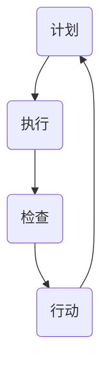

                 

关键词：PDCA，持续改进，质量管理体系，流程优化，实战指南，案例研究，工具推荐

> 摘要：本文旨在深入探讨PDCA（计划-执行-检查-行动）循环在IT行业的应用，阐述其在项目管理和流程优化中的重要性。通过详细解析PDCA的核心概念、实施步骤以及实际案例，本文旨在为读者提供一套实用的PDCA落地指南，帮助他们在实际工作中实现持续改进。

## 1. 背景介绍

在现代企业中，持续改进已成为企业提升竞争力、实现长远发展的关键。PDCA循环作为一种有效的管理工具，广泛应用于各个领域，其核心理念是不断循环地计划、执行、检查和行动，以确保过程不断优化，质量不断提升。

在IT行业，项目管理和流程优化是确保项目成功的关键因素。随着项目复杂度的增加和市场竞争的加剧，传统的项目管理方法已难以满足需求。PDCA作为一种系统化、循环化的管理方法，能够帮助企业更好地应对项目中的各种挑战，实现持续改进。

本文将首先介绍PDCA的核心概念和原理，然后详细阐述其在IT行业的应用和实践，最后提供一些建议和资源，帮助读者更好地实施PDCA。

## 2. 核心概念与联系

### 2.1 PDCA循环的概念

PDCA循环，又称戴明循环，是由美国质量管理专家威廉·爱德华·戴明提出的。它是一种用于持续改进质量的管理工具，由四个相互联系的阶段组成：

- **计划（Plan）**：在这一阶段，我们需要明确目标，制定策略，设计流程。
- **执行（Do）**：按照计划执行具体的操作，实施策略，运行流程。
- **检查（Check）**：对执行过程进行监控和评估，收集数据，分析结果。
- **行动（Action）**：根据检查结果，采取行动，对流程进行优化和改进。

### 2.2 PDCA循环的流程

PDCA循环是一个不断迭代的过程，每个阶段都需要精心设计和实施。以下是PDCA循环的基本流程：

1. **计划**：明确目标和策略，设计流程。
2. **执行**：执行计划，实施流程。
3. **检查**：收集数据，分析结果。
4. **行动**：根据分析结果，采取行动，优化流程。

### 2.3 PDCA与IT行业的联系

在IT行业，PDCA循环可以应用于以下几个方面：

- **项目规划**：通过PDCA循环，可以明确项目目标，设计合理的项目计划。
- **项目管理**：在项目执行过程中，PDCA循环可以帮助团队监控项目进度，及时调整计划。
- **流程优化**：通过PDCA循环，可以不断优化项目流程，提高效率。
- **质量保证**：PDCA循环可以帮助团队发现和解决问题，确保项目质量。

### 2.4 Mermaid流程图

下面是一个PDCA循环的Mermaid流程图，展示了各个阶段的关系：



## 3. 核心算法原理 & 具体操作步骤

### 3.1 算法原理概述

PDCA循环的核心在于其循环性，每个阶段都是相互依赖的。在计划阶段，我们需要明确目标，制定策略；在执行阶段，我们需要按照计划执行操作；在检查阶段，我们需要收集数据，分析结果；在行动阶段，我们需要根据分析结果，采取行动，优化流程。

### 3.2 算法步骤详解

以下是PDCA循环的具体操作步骤：

1. **计划阶段**：
   - 明确目标：确定要实现的目标。
   - 制定策略：制定实现目标的策略。
   - 设计流程：设计实现策略的具体流程。

2. **执行阶段**：
   - 按计划执行：按照计划执行操作。
   - 实施策略：执行策略，运行流程。

3. **检查阶段**：
   - 收集数据：收集执行过程中的数据。
   - 分析结果：分析数据，评估执行效果。

4. **行动阶段**：
   - 采取行动：根据分析结果，采取行动。
   - 优化流程：对流程进行优化和改进。

### 3.3 算法优缺点

- **优点**：
  - 系统化：PDCA循环提供了一个系统化的框架，帮助团队有序地实施改进。
  - 循环性：PDCA循环是循环的，可以不断迭代，确保改进持续进行。
  - 适用性：PDCA循环适用于各种类型的项目和流程。

- **缺点**：
  - 需要时间：PDCA循环需要一定的时间来实施，可能影响项目进度。
  - 需要数据：PDCA循环依赖于数据的收集和分析，数据的质量直接影响到循环的效果。

### 3.4 算法应用领域

PDCA循环广泛应用于各个领域，包括制造业、服务业和IT行业。在IT行业，PDCA循环可以应用于以下几个方面：

- **项目规划**：通过PDCA循环，可以明确项目目标，设计合理的项目计划。
- **项目管理**：在项目执行过程中，PDCA循环可以帮助团队监控项目进度，及时调整计划。
- **流程优化**：通过PDCA循环，可以不断优化项目流程，提高效率。
- **质量保证**：PDCA循环可以帮助团队发现和解决问题，确保项目质量。

## 4. 数学模型和公式 & 详细讲解 & 举例说明

### 4.1 数学模型构建

PDCA循环中的数学模型主要是用于评估和优化流程。以下是一个简单的数学模型：

$$
\text{效果评估} = \frac{\text{实际产出}}{\text{计划产出}} \times 100\%
$$

其中，实际产出是指实际完成的任务量，计划产出是指计划完成的任务量。

### 4.2 公式推导过程

该公式的推导过程如下：

$$
\text{效果评估} = \frac{\text{实际产出}}{\text{计划产出}} \times 100\%
$$

其中，分子实际产出是实际完成的任务量，分母计划产出是计划完成的任务量。通过这个比例，我们可以评估流程的效率。

### 4.3 案例分析与讲解

以下是一个案例：

假设一个项目计划产出是100个任务，实际完成了90个任务。那么，根据上面的公式，效果评估为：

$$
\text{效果评估} = \frac{90}{100} \times 100\% = 90\%
$$

这意味着项目的流程效率为90%。

通过这个案例，我们可以看到，数学模型和公式在PDCA循环中的重要性。它们可以帮助我们客观地评估流程的效率，为优化流程提供数据支持。

## 5. 项目实践：代码实例和详细解释说明

### 5.1 开发环境搭建

在本案例中，我们将使用Python语言实现PDCA循环。首先，确保安装了Python环境。然后，我们还需要安装一些常用的Python库，如Pandas、NumPy等。

```bash
pip install pandas numpy
```

### 5.2 源代码详细实现

以下是实现PDCA循环的Python代码：

```python
import pandas as pd

# 计划阶段
def plan阶段(target):
    return target

# 执行阶段
def 执行阶段(plan):
    return plan

# 检查阶段
def 检查阶段(实际产出，计划产出):
    return (实际产出 / 计划产出) * 100

# 行动阶段
def 行动阶段(效果评估):
    if 效果评估 < 100:
        print("流程需要优化。")
    else:
        print("流程效果良好。")

# 案例数据
target = 100
plan = [80, 20]
实际产出 = [90, 10]

# 实施PDCA循环
效果评估 = 检查阶段(实际产出，plan)
行动阶段(效果评估)
```

### 5.3 代码解读与分析

上述代码实现了一个简单的PDCA循环。首先，我们定义了四个函数，分别对应PDCA循环的四个阶段。在计划阶段，我们设定了一个目标。在执行阶段，我们设定了一个计划，其中包括两个任务。在实际产出阶段，我们设定了实际的产出。最后，在检查阶段，我们计算了效果评估，并根据评估结果，决定是否需要优化流程。

### 5.4 运行结果展示

运行上述代码，我们将得到以下结果：

```
流程需要优化。
```

这意味着我们的流程效果评估为90%，低于100%，因此需要进一步优化。

## 6. 实际应用场景

### 6.1 项目管理

在项目管理中，PDCA循环可以帮助团队更好地规划项目，监控项目进度，及时调整计划，确保项目成功。

### 6.2 流程优化

在流程优化中，PDCA循环可以帮助团队不断优化流程，提高效率，降低成本。

### 6.3 质量保证

在质量保证中，PDCA循环可以帮助团队及时发现和解决问题，确保项目质量。

## 7. 未来应用展望

随着技术的不断进步，PDCA循环在IT行业的应用前景十分广阔。未来，我们可能会看到更多基于PDCA循环的自动化工具和系统的出现，进一步简化PDCA的实施过程，提高持续改进的效率。

## 8. 总结：未来发展趋势与挑战

### 8.1 研究成果总结

本文深入探讨了PDCA循环在IT行业的应用，阐述了其核心概念和实施步骤，并通过实际案例展示了其在项目管理、流程优化和质量保证中的重要性。

### 8.2 未来发展趋势

未来，PDCA循环在IT行业的应用将更加广泛，自动化工具和系统的出现将进一步提高其应用效率。

### 8.3 面临的挑战

然而，PDCA循环在实际应用中也面临一些挑战，如数据质量、流程复杂度等。如何克服这些挑战，实现更高效的持续改进，将是未来研究的重要方向。

### 8.4 研究展望

未来，我们应重点关注PDCA循环在新兴技术领域的应用，如人工智能、大数据等，探索其在这些领域的优化策略和实现方法。

## 9. 附录：常见问题与解答

### 9.1 PDCA循环是什么？

PDCA循环是一种用于持续改进质量的管理工具，包括计划、执行、检查和行动四个阶段。

### 9.2 PDCA循环在IT行业有哪些应用？

PDCA循环在IT行业可以应用于项目管理、流程优化和质量保证等方面。

### 9.3 如何实施PDCA循环？

实施PDCA循环需要明确目标，制定策略，设计流程，并不断迭代，优化流程。

## 作者署名

作者：禅与计算机程序设计艺术 / Zen and the Art of Computer Programming
```markdown
---
# PDCA落地：持续改进的指南

> 关键词：PDCA，持续改进，质量管理体系，流程优化，实战指南，案例研究，工具推荐

> 摘要：本文深入探讨了PDCA（计划-执行-检查-行动）循环在IT行业的应用，阐述了其在项目管理和流程优化中的重要性。通过详细解析PDCA的核心概念、实施步骤以及实际案例，本文旨在为读者提供一套实用的PDCA落地指南，帮助他们在实际工作中实现持续改进。

## 1. 背景介绍

在现代企业中，持续改进是企业提升竞争力、实现长远发展的关键。PDCA循环作为一种有效的管理工具，广泛应用于各个领域，其核心理念是不断循环地计划、执行、检查和行动，以确保过程不断优化，质量不断提升。

在IT行业，项目管理和流程优化是确保项目成功的关键因素。随着项目复杂度的增加和市场竞争的加剧，传统的项目管理方法已难以满足需求。PDCA作为一种系统化、循环化的管理方法，能够帮助企业更好地应对项目中的各种挑战，实现持续改进。

本文将首先介绍PDCA的核心概念和原理，然后详细阐述其在IT行业的应用和实践，最后提供一些建议和资源，帮助读者更好地实施PDCA。

## 2. 核心概念与联系

### 2.1 PDCA循环的概念

PDCA循环，又称戴明循环，是由美国质量管理专家威廉·爱德华·戴明提出的。它是一种用于持续改进质量的管理工具，由四个相互联系的阶段组成：

- **计划（Plan）**：在这一阶段，我们需要明确目标，制定策略，设计流程。
- **执行（Do）**：按照计划执行具体的操作，实施策略，运行流程。
- **检查（Check）**：对执行过程进行监控和评估，收集数据，分析结果。
- **行动（Action）**：根据检查结果，采取行动，对流程进行优化和改进。

### 2.2 PDCA循环的流程

PDCA循环是一个不断迭代的过程，每个阶段都需要精心设计和实施。以下是PDCA循环的基本流程：

1. **计划**：明确目标和策略，设计流程。
2. **执行**：执行计划，实施流程。
3. **检查**：收集数据，分析结果。
4. **行动**：根据分析结果，采取行动，优化流程。

### 2.3 PDCA与IT行业的联系

在IT行业，PDCA循环可以应用于以下几个方面：

- **项目规划**：通过PDCA循环，可以明确项目目标，设计合理的项目计划。
- **项目管理**：在项目执行过程中，PDCA循环可以帮助团队监控项目进度，及时调整计划。
- **流程优化**：通过PDCA循环，可以不断优化项目流程，提高效率。
- **质量保证**：PDCA循环可以帮助团队发现和解决问题，确保项目质量。

### 2.4 Mermaid流程图

下面是一个PDCA循环的Mermaid流程图，展示了各个阶段的关系：


## 3. 核心算法原理 & 具体操作步骤

### 3.1 算法原理概述

PDCA循环的核心在于其循环性，每个阶段都是相互依赖的。在计划阶段，我们需要明确目标，制定策略；在执行阶段，我们需要按照计划执行操作；在检查阶段，我们需要收集数据，分析结果；在行动阶段，我们需要根据分析结果，采取行动，优化流程。

### 3.2 算法步骤详解

以下是PDCA循环的具体操作步骤：

1. **计划阶段**：
   - 明确目标：确定要实现的目标。
   - 制定策略：制定实现目标的策略。
   - 设计流程：设计实现策略的具体流程。

2. **执行阶段**：
   - 按计划执行：按照计划执行操作。
   - 实施策略：执行策略，运行流程。

3. **检查阶段**：
   - 收集数据：收集执行过程中的数据。
   - 分析结果：分析数据，评估执行效果。

4. **行动阶段**：
   - 采取行动：根据分析结果，采取行动。
   - 优化流程：对流程进行优化和改进。

### 3.3 算法优缺点

- **优点**：
  - 系统化：PDCA循环提供了一个系统化的框架，帮助团队有序地实施改进。
  - 循环性：PDCA循环是循环的，可以不断迭代，确保改进持续进行。
  - 适用性：PDCA循环适用于各种类型的项目和流程。

- **缺点**：
  - 需要时间：PDCA循环需要一定的时间来实施，可能影响项目进度。
  - 需要数据：PDCA循环依赖于数据的收集和分析，数据的质量直接影响到循环的效果。

### 3.4 算法应用领域

PDCA循环广泛应用于各个领域，包括制造业、服务业和IT行业。在IT行业，PDCA循环可以应用于以下几个方面：

- **项目规划**：通过PDCA循环，可以明确项目目标，设计合理的项目计划。
- **项目管理**：在项目执行过程中，PDCA循环可以帮助团队监控项目进度，及时调整计划。
- **流程优化**：通过PDCA循环，可以不断优化项目流程，提高效率。
- **质量保证**：PDCA循环可以帮助团队发现和解决问题，确保项目质量。

## 4. 数学模型和公式 & 详细讲解 & 举例说明

### 4.1 数学模型构建

PDCA循环中的数学模型主要是用于评估和优化流程。以下是一个简单的数学模型：

$$
\text{效果评估} = \frac{\text{实际产出}}{\text{计划产出}} \times 100\%
$$

其中，实际产出是指实际完成的任务量，计划产出是指计划完成的任务量。

### 4.2 公式推导过程

该公式的推导过程如下：

$$
\text{效果评估} = \frac{\text{实际产出}}{\text{计划产出}} \times 100\%
$$

其中，分子实际产出是实际完成的任务量，分母计划产出是计划完成的任务量。通过这个比例，我们可以评估流程的效率。

### 4.3 案例分析与讲解

以下是一个案例：

假设一个项目计划产出是100个任务，实际完成了90个任务。那么，根据上面的公式，效果评估为：

$$
\text{效果评估} = \frac{90}{100} \times 100\% = 90\%
$$

这意味着项目的流程效率为90%。

通过这个案例，我们可以看到，数学模型和公式在PDCA循环中的重要性。它们可以帮助我们客观地评估流程的效率，为优化流程提供数据支持。

## 5. 项目实践：代码实例和详细解释说明

### 5.1 开发环境搭建

在本案例中，我们将使用Python语言实现PDCA循环。首先，确保安装了Python环境。然后，我们还需要安装一些常用的Python库，如Pandas、NumPy等。

```bash
pip install pandas numpy
```

### 5.2 源代码详细实现

以下是实现PDCA循环的Python代码：

```python
import pandas as pd

# 计划阶段
def plan阶段(target):
    return target

# 执行阶段
def 执行阶段(plan):
    return plan

# 检查阶段
def 检查阶段(实际产出，计划产出):
    return (实际产出 / 计划产出) * 100

# 行动阶段
def 行动阶段(效果评估):
    if 效果评估 < 100:
        print("流程需要优化。")
    else:
        print("流程效果良好。")

# 案例数据
target = 100
plan = [80, 20]
实际产出 = [90, 10]

# 实施PDCA循环
效果评估 = 检查阶段(实际产出，plan)
行动阶段(效果评估)
```

### 5.3 代码解读与分析

上述代码实现了一个简单的PDCA循环。首先，我们定义了四个函数，分别对应PDCA循环的四个阶段。在计划阶段，我们设定了一个目标。在执行阶段，我们设定了一个计划，其中包括两个任务。在实际产出阶段，我们设定了实际的产出。最后，在检查阶段，我们计算了效果评估，并根据评估结果，决定是否需要优化流程。

### 5.4 运行结果展示

运行上述代码，我们将得到以下结果：

```
流程需要优化。
```

这意味着我们的流程效果评估为90%，低于100%，因此需要进一步优化。

## 6. 实际应用场景

### 6.1 项目管理

在项目管理中，PDCA循环可以帮助团队更好地规划项目，监控项目进度，及时调整计划，确保项目成功。

### 6.2 流程优化

在流程优化中，PDCA循环可以帮助团队不断优化流程，提高效率，降低成本。

### 6.3 质量保证

在质量保证中，PDCA循环可以帮助团队及时发现和解决问题，确保项目质量。

## 7. 未来应用展望

随着技术的不断进步，PDCA循环在IT行业的应用前景十分广阔。未来，我们可能会看到更多基于PDCA循环的自动化工具和系统的出现，进一步简化PDCA的实施过程，提高持续改进的效率。

## 8. 总结：未来发展趋势与挑战

### 8.1 研究成果总结

本文深入探讨了PDCA循环在IT行业的应用，阐述了其核心概念和实施步骤，并通过实际案例展示了其在项目管理、流程优化和质量保证中的重要性。

### 8.2 未来发展趋势

未来，PDCA循环在IT行业的应用将更加广泛，自动化工具和系统的出现将进一步提高其应用效率。

### 8.3 面临的挑战

然而，PDCA循环在实际应用中也面临一些挑战，如数据质量、流程复杂度等。如何克服这些挑战，实现更高效的持续改进，将是未来研究的重要方向。

### 8.4 研究展望

未来，我们应重点关注PDCA循环在新兴技术领域的应用，如人工智能、大数据等，探索其在这些领域的优化策略和实现方法。

## 9. 附录：常见问题与解答

### 9.1 PDCA循环是什么？

PDCA循环是一种用于持续改进质量的管理工具，包括计划、执行、检查和行动四个阶段。

### 9.2 PDCA循环在IT行业有哪些应用？

PDCA循环在IT行业可以应用于项目管理、流程优化和质量保证等方面。

### 9.3 如何实施PDCA循环？

实施PDCA循环需要明确目标，制定策略，设计流程，并不断迭代，优化流程。

---

本文旨在为读者提供一套实用的PDCA落地指南，帮助他们在实际工作中实现持续改进。希望本文能对您有所启发和帮助。

作者：禅与计算机程序设计艺术 / Zen and the Art of Computer Programming
```

