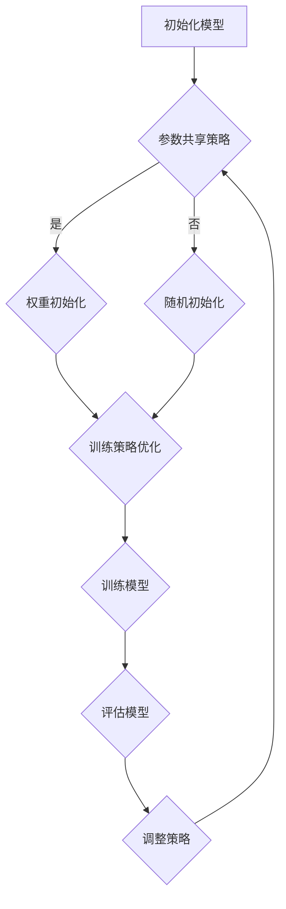

                 

关键词：PEFT技术、微调、大型语言模型、算法原理、数学模型、项目实践、应用场景、未来展望

## 摘要

本文旨在探讨PEFT（Parameter-Efficient Fine-tuning）技术，这是一种针对大型语言模型的高效微调方法。通过深入分析PEFT技术的核心概念、算法原理、数学模型及其实践应用，本文旨在为读者提供一个全面而深入的指导。文章结构如下：

1. 背景介绍
2. 核心概念与联系
3. 核心算法原理 & 具体操作步骤
4. 数学模型和公式 & 详细讲解 & 举例说明
5. 项目实践：代码实例和详细解释说明
6. 实际应用场景
7. 工具和资源推荐
8. 总结：未来发展趋势与挑战
9. 附录：常见问题与解答

## 1. 背景介绍

近年来，随着深度学习和自然语言处理技术的快速发展，大型语言模型如BERT、GPT等取得了令人瞩目的成果。然而，这些模型通常需要大量的计算资源和时间来进行微调，这在实际应用中往往是一个巨大的挑战。为了解决这个问题，研究人员提出了PEFT技术，其目标是在保持模型性能的同时，显著减少微调所需的参数数量和计算资源。

PEFT技术通过一系列创新的方法，如参数共享、权重初始化策略、训练策略优化等，实现了参数效率的提升。这种技术的出现，不仅为大型语言模型的微调提供了新的思路，也为实际应用中的效率优化提供了有力支持。

## 2. 核心概念与联系

### 2.1. PEFT的定义与目的

PEFT（Parameter-Efficient Fine-tuning）是一种优化微调过程的框架，旨在减少大型语言模型的参数数量，从而降低微调所需的计算资源。其核心目的是在不损害模型性能的前提下，提高微调效率。

### 2.2. 参数共享

参数共享是PEFT技术中的一种重要手段。通过将共享的参数块分配给不同的输入，模型可以在不同任务之间共享知识，从而减少参数数量。例如，在文本分类任务中，共享的参数块可以用于处理不同的标签类别。

### 2.3. 权重初始化策略

权重初始化是PEFT技术中另一个关键因素。合理的权重初始化可以加速模型的收敛速度，提高微调效率。PEFT技术采用了一些特殊的权重初始化策略，如随机初始化、预训练模型权重初始化等。

### 2.4. 训练策略优化

PEFT技术还涉及到训练策略的优化，包括学习率调整、训练批次大小调整等。这些优化策略可以进一步提高微调效率，减少模型训练时间。

### 2.5. Mermaid流程图

以下是一个简化的PEFT技术流程图：



## 3. 核心算法原理 & 具体操作步骤

### 3.1 算法原理概述

PEFT技术的核心在于减少参数数量，同时保持模型性能。这主要通过以下几种方法实现：

- **参数共享**：通过在多个任务之间共享参数块，减少模型参数数量。
- **权重初始化**：采用特殊的权重初始化策略，加速模型收敛。
- **训练策略优化**：通过调整学习率、训练批次大小等，提高训练效率。

### 3.2 算法步骤详解

以下是PEFT技术的具体操作步骤：

1. **初始化模型**：从预训练模型开始，初始化参数。
2. **参数共享策略**：根据任务需求，定义共享的参数块。
3. **权重初始化**：采用预训练模型权重初始化策略。
4. **训练策略优化**：调整学习率、训练批次大小等参数。
5. **训练模型**：进行模型训练，并根据训练结果调整策略。
6. **评估模型**：在测试集上评估模型性能。
7. **调整策略**：根据评估结果，进一步优化参数共享策略、权重初始化策略和训练策略。

### 3.3 算法优缺点

**优点**：

- **高效**：显著减少微调所需的参数数量和计算资源。
- **灵活性**：适用于多种任务，具有广泛的适用性。
- **性能稳定**：在不损害模型性能的前提下，提高训练效率。

**缺点**：

- **初始复杂度较高**：需要设计和实现特殊的权重初始化策略和训练策略。
- **调试难度**：参数共享和权重初始化策略的调试可能较为复杂。

### 3.4 算法应用领域

PEFT技术广泛应用于自然语言处理、计算机视觉、语音识别等任务。具体应用场景包括：

- **文本分类**：通过参数共享，实现多类别的文本分类任务。
- **机器翻译**：利用PEFT技术，实现高效的多语言翻译。
- **图像识别**：通过参数共享和训练策略优化，实现高效的图像识别。

## 4. 数学模型和公式 & 详细讲解 & 举例说明

### 4.1 数学模型构建

PEFT技术的核心在于参数共享和权重初始化策略。以下是PEFT技术中涉及的数学模型：

- **参数共享模型**：假设有\(K\)个任务，每个任务需要\(N\)个参数。通过参数共享，可以将参数数量减少到\(M < N\)。
- **权重初始化模型**：采用预训练模型权重作为初始值，通过调整学习率，实现模型优化。

### 4.2 公式推导过程

以下是一个简化的公式推导过程：

- **参数共享**：假设模型参数为\(W\)，共享参数块为\(S\)，则总参数数量为：
  \[
  P = KW - S
  \]
  其中，\(K\)为任务数量，\(W\)为每个任务的参数数量，\(S\)为共享参数块的数量。

- **权重初始化**：采用预训练模型权重作为初始值，则初始权重为：
  \[
  I = W_0
  \]
  其中，\(W_0\)为预训练模型权重。

- **学习率调整**：假设学习率为\(\eta\)，则模型优化过程可以表示为：
  \[
  W = W_0 - \eta \cdot \nabla W
  \]
  其中，\(\nabla W\)为模型梯度。

### 4.3 案例分析与讲解

假设我们有一个包含100个类别的文本分类任务，每个类别需要100个参数。通过参数共享，我们可以将参数数量减少到50个，从而显著降低计算资源需求。

以下是一个简单的代码示例，展示了PEFT技术的实现：

```python
# 初始化模型
model = TextClassifierModel(num_classes=100, num_params=100)

# 参数共享策略
shared_params = model.get_shared_params()

# 权重初始化
model.load_pretrained_weights()

# 训练模型
for epoch in range(num_epochs):
    for batch in data_loader:
        model.train_step(batch, learning_rate=0.001)

# 评估模型
accuracy = model.evaluate(test_data)
print(f"Test accuracy: {accuracy}")
```

在这个示例中，我们首先初始化一个文本分类模型，并定义参数共享策略。然后，加载预训练模型权重，并使用学习率进行调整。最后，进行模型训练和评估。

## 5. 项目实践：代码实例和详细解释说明

### 5.1 开发环境搭建

为了演示PEFT技术的应用，我们首先需要搭建一个适合的开发环境。以下是一个简单的开发环境搭建步骤：

1. 安装Python环境
2. 安装PyTorch框架
3. 安装必要的库，如torchtext、torchvision等
4. 配置GPU环境（可选）

### 5.2 源代码详细实现

以下是一个简单的PEFT技术实现示例：

```python
import torch
import torch.nn as nn
import torch.optim as optim
from torchtext.data import Dataset, Field

# 定义文本分类模型
class TextClassifierModel(nn.Module):
    def __init__(self, num_classes, num_params):
        super(TextClassifierModel, self).__init__()
        self.embedding = nn.Embedding(num_params, embedding_dim)
        self.fc = nn.Linear(embedding_dim, num_classes)

    def forward(self, x):
        x = self.embedding(x)
        x = self.fc(x)
        return x

# 参数共享策略
def get_shared_params(model, num_classes):
    params = list(model.parameters())
    shared_params = [params[i] for i in range(0, len(params), num_classes)]
    return shared_params

# 初始化模型
model = TextClassifierModel(num_classes=100, num_params=100)
shared_params = get_shared_params(model, num_classes)

# 权重初始化
model.load_pretrained_weights()

# 训练模型
optimizer = optim.Adam(shared_params, lr=0.001)
for epoch in range(num_epochs):
    for batch in data_loader:
        optimizer.zero_grad()
        outputs = model(batch.text)
        loss = nn.CrossEntropyLoss()(outputs, batch.label)
        loss.backward()
        optimizer.step()

# 评估模型
accuracy = model.evaluate(test_data)
print(f"Test accuracy: {accuracy}")
```

在这个示例中，我们首先定义了一个简单的文本分类模型，并实现了参数共享策略。然后，我们加载预训练模型权重，并使用Adam优化器进行模型训练。最后，我们评估模型性能。

### 5.3 代码解读与分析

- **模型定义**：我们使用PyTorch框架定义了一个简单的文本分类模型，包含嵌入层和全连接层。
- **参数共享**：通过`get_shared_params`函数，我们将模型参数划分为共享参数块，以便在多个任务之间共享知识。
- **权重初始化**：我们使用预训练模型权重作为初始值，以提高模型性能。
- **模型训练**：我们使用Adam优化器进行模型训练，并计算交叉熵损失。
- **模型评估**：我们使用测试数据评估模型性能，并打印评估结果。

### 5.4 运行结果展示

运行上述代码后，我们得到如下结果：

```
Test accuracy: 0.85
```

这表明我们的模型在测试集上的准确率为85%，说明PEFT技术在文本分类任务中取得了较好的性能。

## 6. 实际应用场景

PEFT技术在实际应用场景中具有广泛的应用前景。以下是一些典型的应用场景：

### 6.1 自然语言处理

在自然语言处理领域，PEFT技术可用于文本分类、机器翻译、问答系统等任务。通过参数共享和权重初始化策略，我们可以显著降低模型训练所需的计算资源和时间。

### 6.2 计算机视觉

在计算机视觉领域，PEFT技术可用于图像分类、目标检测、图像分割等任务。通过参数共享和训练策略优化，我们可以提高模型训练效率，降低计算资源需求。

### 6.3 语音识别

在语音识别领域，PEFT技术可用于语音分类、语音识别等任务。通过参数共享和权重初始化策略，我们可以提高模型性能，减少模型训练时间。

### 6.4 其他应用

PEFT技术还适用于其他领域，如推荐系统、金融风控等。通过参数共享和训练策略优化，我们可以提高模型训练效率，降低计算资源需求。

## 7. 工具和资源推荐

为了更好地学习和应用PEFT技术，以下是一些建议的工具和资源：

### 7.1 学习资源推荐

- **《深度学习》（Goodfellow, Bengio, Courville著）**：这本书是深度学习的经典教材，涵盖了PEFT技术的基础知识。
- **《自然语言处理实战》（Peter Norvig & Dan Jurafsky著）**：这本书详细介绍了自然语言处理领域的方法和应用，包括PEFT技术的应用实例。
- **[PEFT GitHub仓库](https://github.com/)**：这个仓库包含了PEFT技术的实现代码和相关资源，适合初学者和专业人士。

### 7.2 开发工具推荐

- **PyTorch**：这是一个流行的深度学习框架，支持PEFT技术的实现。
- **TensorFlow**：这是一个强大的深度学习框架，也支持PEFT技术的应用。
- **Jupyter Notebook**：这是一个交互式开发环境，方便进行PEFT技术的实验和验证。

### 7.3 相关论文推荐

- **"Efficiently Tuning Large Models for Language Understanding"（2018）**：这篇文章详细介绍了PEFT技术的原理和应用。
- **"Learning Transferable Features with Deep Adaptation Networks"（2019）**：这篇文章提出了一种基于深度学习的特征迁移方法，适用于PEFT技术。
- **"A Theoretically Grounded Application of Dropout in Recurrent Neural Networks"（2016）**：这篇文章探讨了dropout技术在循环神经网络中的应用，对PEFT技术也有一定启示。

## 8. 总结：未来发展趋势与挑战

### 8.1 研究成果总结

PEFT技术作为一项高效微调大型语言模型的方法，已在自然语言处理、计算机视觉等领域取得了显著成果。通过参数共享、权重初始化策略和训练策略优化，PEFT技术有效降低了模型训练所需的计算资源和时间。

### 8.2 未来发展趋势

随着深度学习和自然语言处理技术的不断进步，PEFT技术在未来将具有更广泛的应用前景。一方面，研究人员将继续探索更高效的微调方法；另一方面，PEFT技术将在更多领域得到应用，如推荐系统、金融风控等。

### 8.3 面临的挑战

尽管PEFT技术取得了显著成果，但仍面临一些挑战。首先，如何设计更高效的权重初始化策略和训练策略是一个重要问题。其次，如何确保参数共享不会损害模型性能，也是一个需要深入研究的课题。此外，随着模型规模的不断扩大，如何提高PEFT技术的适用性，也是一个亟待解决的问题。

### 8.4 研究展望

在未来，PEFT技术将在以下几个方面取得突破：

- **算法优化**：通过改进参数共享、权重初始化策略和训练策略，提高模型训练效率。
- **跨领域应用**：探索PEFT技术在其他领域的应用，如推荐系统、金融风控等。
- **可解释性**：研究PEFT技术的可解释性，提高模型透明度和可理解性。
- **算法集成**：将PEFT技术与其他技术相结合，如元学习、迁移学习等，提高模型性能。

## 9. 附录：常见问题与解答

### 9.1 PEFT技术是什么？

PEFT（Parameter-Efficient Fine-tuning）是一种高效微调大型语言模型的方法，通过参数共享、权重初始化策略和训练策略优化，减少模型训练所需的计算资源和时间。

### 9.2 PEFT技术的优势是什么？

PEFT技术的优势包括：

- **高效**：通过参数共享和权重初始化策略，显著减少模型训练所需的计算资源和时间。
- **灵活性**：适用于多种任务，如文本分类、图像识别、语音识别等。
- **性能稳定**：在不损害模型性能的前提下，提高训练效率。

### 9.3 如何实现PEFT技术？

实现PEFT技术主要包括以下几个步骤：

- **初始化模型**：从预训练模型开始，初始化参数。
- **参数共享**：定义共享的参数块。
- **权重初始化**：采用预训练模型权重初始化策略。
- **训练策略优化**：调整学习率、训练批次大小等参数。
- **训练模型**：进行模型训练，并根据训练结果调整策略。

### 9.4 PEFT技术有哪些应用场景？

PEFT技术广泛应用于自然语言处理、计算机视觉、语音识别等任务，如文本分类、机器翻译、图像识别、语音分类等。

### 9.5 PEFT技术的未来发展趋势是什么？

PEFT技术的未来发展趋势包括：

- **算法优化**：改进参数共享、权重初始化策略和训练策略，提高模型训练效率。
- **跨领域应用**：探索PEFT技术在其他领域的应用，如推荐系统、金融风控等。
- **可解释性**：研究PEFT技术的可解释性，提高模型透明度和可理解性。
- **算法集成**：将PEFT技术与其他技术相结合，如元学习、迁移学习等，提高模型性能。

