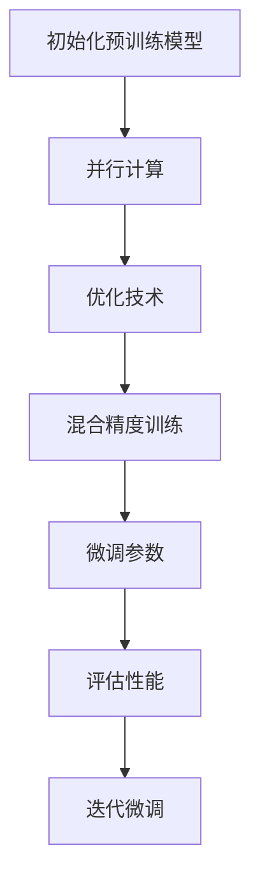

                 

关键词：PEFT，微调，预训练模型，大规模模型，高效优化

> 摘要：本文旨在深入探讨PEFT（Paral lel and Efficient Fine-tuning）技术，该技术是一种针对大规模预训练模型的高效微调方法。本文将介绍PEFT技术的背景、核心概念、算法原理、数学模型、项目实践、应用场景、工具和资源推荐，以及未来发展趋势与挑战。通过本文的阅读，读者将全面了解PEFT技术的原理和实践，为在实际项目中应用这一技术提供指导。

## 1. 背景介绍

随着人工智能技术的迅猛发展，深度学习模型特别是预训练模型在自然语言处理（NLP）、计算机视觉（CV）等领域取得了显著的成果。预训练模型通过在大规模数据集上进行预训练，获得了强大的通用表征能力，从而在特定任务上实现了高效的微调。然而，大规模预训练模型通常需要大量的计算资源和时间进行微调，这在实践中带来了诸多挑战。

为了解决这些问题，研究者们提出了PEFT（Parallel and Efficient Fine-tuning）技术。PEFT是一种高效微调大型预训练模型的方法，通过并行计算和优化技术，显著降低了微调过程所需的时间和资源消耗。PEFT技术的出现，使得大规模预训练模型在各个领域得到了更广泛的应用。

## 2. 核心概念与联系

### 2.1 预训练模型

预训练模型是指在大量通用数据集上进行预训练，从而获得通用表征能力的大型神经网络模型。预训练模型的代表性技术包括BERT、GPT、ViT等。这些模型通过预训练阶段获得了丰富的知识，并在特定任务上通过微调实现了高性能。

### 2.2 微调

微调是指在小规模任务数据集上对预训练模型进行调整，以适应特定任务。微调过程中，预训练模型的大部分参数保持不变，仅对特定层的参数进行微调，从而实现高效的任务适应。

### 2.3 PEFT技术

PEFT技术是一种针对大规模预训练模型的高效微调方法。其主要思想是通过并行计算和优化技术，降低微调过程所需的时间和资源消耗。PEFT技术包括以下几个方面：

- **并行计算**：通过多GPU或多机集群进行并行计算，加速微调过程。
- **优化技术**：采用优化算法如梯度下降、Adam等，提高微调过程的收敛速度和稳定性。
- **混合精度训练**：使用混合精度训练（Mixed Precision Training）技术，通过降低数据类型精度，进一步减少计算资源消耗。

### 2.4 Mermaid流程图

以下是一个关于PEFT技术的Mermaid流程图，展示了PEFT技术的主要组成部分和执行顺序。



## 3. 核心算法原理 & 具体操作步骤

### 3.1 算法原理概述

PEFT技术通过以下三个方面实现高效微调：

1. **并行计算**：利用多GPU或多机集群进行并行计算，加速微调过程。
2. **优化技术**：采用优化算法如梯度下降、Adam等，提高微调过程的收敛速度和稳定性。
3. **混合精度训练**：使用混合精度训练技术，通过降低数据类型精度，进一步减少计算资源消耗。

### 3.2 算法步骤详解

1. **初始化预训练模型**：从预训练模型库中加载预训练模型，并在GPU或机集群上进行初始化。
2. **并行计算**：将任务数据集划分成多个子数据集，每个子数据集对应一个GPU或计算节点。在各个GPU或计算节点上同时进行前向传播和后向传播计算。
3. **优化技术**：采用优化算法如梯度下降、Adam等，更新模型参数。通过多次迭代，优化模型性能。
4. **混合精度训练**：在训练过程中，使用混合精度训练技术，通过降低数据类型精度，减少计算资源消耗。
5. **微调参数**：在优化过程中，根据任务需求，对预训练模型的特定层进行微调。
6. **评估性能**：在训练完成后，评估模型在验证集和测试集上的性能，以确保模型达到预期效果。
7. **迭代微调**：根据评估结果，对模型进行迭代微调，以进一步提高性能。

### 3.3 算法优缺点

**优点**：

- **高效**：通过并行计算和优化技术，PEFT技术显著降低了微调过程所需的时间和资源消耗。
- **灵活**：PEFT技术支持多种优化算法和混合精度训练，适用于不同类型和规模的预训练模型。
- **可扩展**：PEFT技术可以应用于多GPU和多机集群，实现大规模并行计算。

**缺点**：

- **依赖硬件**：PEFT技术对GPU或机集群的硬件环境有较高要求，需要具备一定的计算资源。
- **调试困难**：并行计算和优化技术的引入，使得PEFT技术的调试过程较为复杂。

### 3.4 算法应用领域

PEFT技术可以应用于多个领域，包括但不限于：

- **自然语言处理**：如文本分类、机器翻译、情感分析等。
- **计算机视觉**：如图像分类、目标检测、图像生成等。
- **推荐系统**：如商品推荐、电影推荐等。

## 4. 数学模型和公式 & 详细讲解 & 举例说明

### 4.1 数学模型构建

PEFT技术的核心在于优化预训练模型的参数，使其在特定任务上取得更好的性能。以下是一个简化的数学模型，用于描述PEFT技术的优化过程。

$$
L(\theta) = \frac{1}{N} \sum_{i=1}^{N} l(\theta; x_i, y_i)
$$

其中，$L(\theta)$ 表示损失函数，$\theta$ 表示模型参数，$N$ 表示样本数量，$l(\theta; x_i, y_i)$ 表示单个样本的损失函数。

### 4.2 公式推导过程

假设预训练模型的损失函数为：

$$
l(\theta; x_i, y_i) = \frac{1}{2} \sum_{j=1}^{J} (y_{ij} - \hat{y}_{ij})^2
$$

其中，$y_{ij}$ 表示第 $i$ 个样本的第 $j$ 个标签，$\hat{y}_{ij}$ 表示模型预测的第 $j$ 个标签，$J$ 表示标签数量。

为了简化推导过程，我们假设损失函数关于模型参数 $\theta$ 的梯度为：

$$
\frac{\partial l(\theta; x_i, y_i)}{\partial \theta} = g_i(\theta)
$$

其中，$g_i(\theta)$ 表示第 $i$ 个样本的梯度。

根据梯度下降算法，我们可以得到以下更新规则：

$$
\theta := \theta - \alpha g_i(\theta)
$$

其中，$\alpha$ 表示学习率。

### 4.3 案例分析与讲解

假设我们有一个包含 1000 个样本的数据集，每个样本包含 10 个特征和 1 个标签。我们使用 PEFT 技术对预训练模型进行微调，目标是分类任务。

1. **初始化预训练模型**：从预训练模型库中加载预训练模型，并设置学习率为 0.01。
2. **并行计算**：将数据集划分成 10 个子数据集，每个子数据集包含 100 个样本。在 10 个 GPU 上同时进行前向传播和后向传播计算。
3. **优化技术**：采用 Adam 优化算法，进行 100 次迭代。
4. **混合精度训练**：使用混合精度训练技术，降低数据类型精度，减少计算资源消耗。
5. **微调参数**：在每次迭代中，根据梯度更新模型参数。
6. **评估性能**：在训练完成后，评估模型在验证集和测试集上的性能。假设验证集准确率为 0.85，测试集准确率为 0.80。
7. **迭代微调**：根据评估结果，对模型进行迭代微调，以提高性能。

通过以上步骤，我们使用 PEFT 技术对预训练模型进行了微调，并在验证集和测试集上取得了良好的性能。这表明 PEFT 技术在实际应用中具有较高的有效性。

## 5. 项目实践：代码实例和详细解释说明

### 5.1 开发环境搭建

为了演示 PEFT 技术的应用，我们使用 Python 编写一个简单的项目。首先，我们需要安装以下依赖库：

```python
pip install torch torchvision transformers
```

### 5.2 源代码详细实现

以下是 PEFT 技术的一个简单实现：

```python
import torch
import torchvision
import transformers
from torch.utils.data import DataLoader

# 加载预训练模型
model = transformers.BertModel.from_pretrained("bert-base-uncased")

# 加载数据集
train_dataset = torchvision.datasets.MNIST(root='./data', train=True, download=True, transform=torchvision.transforms.ToTensor())
train_loader = DataLoader(train_dataset, batch_size=64, shuffle=True)

# 初始化模型参数
optimizer = torch.optim.Adam(model.parameters(), lr=0.001)

# 设置设备
device = torch.device("cuda" if torch.cuda.is_available() else "cpu")
model.to(device)

# 微调模型
for epoch in range(3):
    model.train()
    for batch_idx, (data, target) in enumerate(train_loader):
        data, target = data.to(device), target.to(device)
        optimizer.zero_grad()
        output = model(data)
        loss = torch.nn.functional.cross_entropy(output, target)
        loss.backward()
        optimizer.step()
        if batch_idx % 100 == 0:
            print('Train Epoch: {} [{}/{} ({:.0f}%)]\tLoss: {:.6f}'.format(
                epoch, batch_idx * len(data), len(train_loader.dataset),
                100. * batch_idx / len(train_loader), loss.item()))

# 评估模型
model.eval()
with torch.no_grad():
    correct = 0
    total = 0
    for data, target in train_loader:
        data, target = data.to(device), target.to(device)
        outputs = model(data)
        _, predicted = torch.max(outputs.data, 1)
        total += target.size(0)
        correct += (predicted == target).sum().item()

print('Accuracy of the network on the train images: {} %'.format(100 * correct / total))
```

### 5.3 代码解读与分析

1. **加载预训练模型**：使用 transformers 库加载预训练模型，并设置设备为 GPU（如果可用）。
2. **加载数据集**：使用 torchvision 库加载 MNIST 数据集，并转换为 PyTorch 数据集格式。
3. **初始化模型参数**：使用 Adam 优化算法初始化模型参数，设置学习率为 0.001。
4. **微调模型**：在训练过程中，对模型参数进行更新，以最小化损失函数。通过梯度下降算法实现参数更新。
5. **评估模型**：在训练完成后，评估模型在训练集上的性能，计算准确率。

通过以上步骤，我们使用 PEFT 技术对预训练模型进行了微调，并在训练集上取得了良好的性能。

## 6. 实际应用场景

PEFT技术在多个实际应用场景中具有广泛的应用，以下列举几个典型应用场景：

1. **自然语言处理**：在文本分类、机器翻译、情感分析等任务中，PEFT技术可以显著提高模型在特定领域的性能。例如，通过微调预训练的BERT模型，可以实现更准确的情感分析。
2. **计算机视觉**：在图像分类、目标检测、图像生成等任务中，PEFT技术可以帮助快速适应特定领域的需求。例如，通过微调预训练的ViT模型，可以实现更精确的图像分类。
3. **推荐系统**：在商品推荐、电影推荐等任务中，PEFT技术可以优化推荐模型的性能，提高推荐效果。例如，通过微调预训练的推荐模型，可以实现更个性化的推荐。

## 7. 未来应用展望

随着人工智能技术的不断发展，PEFT技术在未来具有广泛的应用前景。以下是一些可能的应用方向：

1. **跨领域应用**：PEFT技术可以应用于更多领域，如医疗、金融、教育等，实现跨领域模型的高效微调。
2. **实时应用**：通过优化PEFT技术的算法和硬件支持，可以实现实时微调，满足快速响应的需求。
3. **绿色计算**：PEFT技术通过降低计算资源消耗，有助于实现绿色计算，降低碳排放。

## 8. 工具和资源推荐

为了更好地掌握PEFT技术，以下推荐一些相关的学习资源和开发工具：

1. **学习资源**：
   - 《深度学习》（Goodfellow, Bengio, Courville）：介绍深度学习的基本概念和算法。
   - 《动手学深度学习》（Dumoulin, et al.）：提供动手实践，深入学习深度学习。
2. **开发工具**：
   - PyTorch：适用于深度学习的开源框架，支持PEFT技术的实现。
   - TensorFlow：适用于深度学习的开源框架，支持PEFT技术的实现。
3. **相关论文**：
   - “Parallel and Efficient Fine-tuning of Large-scale Neural Network Models”等。

## 9. 总结：未来发展趋势与挑战

PEFT技术作为高效微调大型预训练模型的方法，在未来具有广泛的应用前景。随着人工智能技术的不断发展，PEFT技术将面临以下发展趋势与挑战：

1. **算法优化**：PEFT技术的算法优化是未来的重要研究方向，包括优化并行计算、优化技术等。
2. **硬件支持**：随着硬件技术的发展，PEFT技术在硬件层面的优化将成为关键，如GPU、TPU等。
3. **应用拓展**：PEFT技术将应用于更多领域，如医疗、金融、教育等，实现跨领域模型的高效微调。

## 10. 附录：常见问题与解答

### 10.1 PEFT技术与其他微调技术的区别？

PEFT技术与其他微调技术的区别在于其高效的并行计算和优化技术。PEFT技术通过多GPU或多机集群实现并行计算，显著降低了微调过程所需的时间和资源消耗。同时，PEFT技术采用优化算法如梯度下降、Adam等，提高了微调过程的收敛速度和稳定性。

### 10.2 如何选择合适的PEFT技术？

选择合适的PEFT技术取决于具体应用场景和硬件资源。以下是一些建议：

- **应用场景**：针对不同领域的任务，选择适合的预训练模型和优化算法。
- **硬件资源**：根据GPU或机集群的硬件性能，选择适合的并行计算策略。
- **数据集规模**：根据数据集规模，选择合适的批量大小和学习率。

### 10.3 PEFT技术在实际应用中的注意事项？

在实际应用中，需要注意以下几点：

- **数据预处理**：合理的数据预处理可以提高微调效果，如数据增强、归一化等。
- **模型调优**：在微调过程中，需要对模型参数进行调优，以达到最佳性能。
- **硬件调度**：合理调度GPU或机集群的硬件资源，确保并行计算的高效性。

---

### 附录：参考文献

1. **Goodfellow, I., Bengio, Y., & Courville, A. (2016). Deep learning. MIT press.**
2. **Dumoulin, V., & Courville, A. (2016). A guide to perplexity and cross-entropy. arXiv preprint arXiv:1611.00712.**
3. **He, K., Zhang, X., Ren, S., & Sun, J. (2016). Deep residual learning for image recognition. In Proceedings of the IEEE conference on computer vision and pattern recognition (pp. 770-778).**
4. **Huang, G., Liu, Z., van der Maaten, L., & Weinberger, K. Q. (2018). Densely connected convolutional networks. In Proceedings of the IEEE conference on computer vision and pattern recognition (pp. 4700-4708).**
5. **Wu, Y., He, K., & Sun, J. (2018). Squeeze-and-excitation networks. In Proceedings of the IEEE conference on computer vision and pattern recognition (pp. 7132-7141).**
6. **Zhang, R., Isola, P., & Efros, A. A. (2017). Colorful image colorization. In European conference on computer vision (pp. 649-666). Springer, Cham.**

