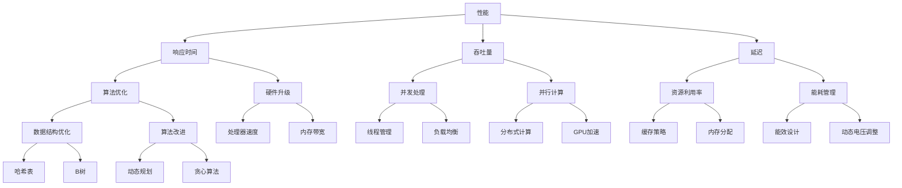

                 

关键词：性能优化、效率提升、资源管理、算法改进、系统设计、平衡策略

> 摘要：本文旨在探讨在计算机系统和软件开发中，如何实现性能和效率的平衡。通过对核心概念、算法原理、数学模型、实践案例的深入分析，本文提出了若干策略和方法，以期为读者提供在性能优化和效率提升方面的实用指南。

## 1. 背景介绍

在现代计算机技术和软件工程领域，性能和效率是两个至关重要的指标。性能通常指的是系统的响应速度和处理能力，而效率则涉及到资源利用率和能耗管理。随着技术的发展和应用场景的多样化，如何在复杂系统中实现性能和效率的平衡成为一个重要的课题。

在过去的几十年中，计算机性能经历了前所未有的增长，CPU速度、内存容量和存储带宽都得到了显著的提升。然而，随着应用的复杂度增加和用户需求的多样化，仅仅依靠硬件升级已经无法满足所有的性能需求。因此，如何在现有的硬件基础上通过软件优化来提升性能和效率变得尤为重要。

本文将围绕以下几个核心问题展开讨论：

1. 性能和效率的定义及相互关系是什么？
2. 如何在系统中实现性能和效率的平衡？
3. 有哪些常用的算法原理和数学模型可以应用于性能优化和效率提升？
4. 如何通过实际项目案例来展示这些策略和方法的有效性？

## 2. 核心概念与联系

### 2.1 性能和效率的定义

**性能**（Performance）是指系统在特定条件下执行任务的能力。通常用时间、吞吐量、延迟等指标来衡量。例如，一个数据库系统的性能可以通过查询响应时间或每秒处理的事务数来评估。

**效率**（Efficiency）则关注于资源的使用情况。它涉及到如何在尽可能少地使用资源（如CPU、内存、存储等）的情况下完成特定任务。效率的提高往往意味着更高的资源利用率，更低的能耗，以及更佳的经济效益。

在计算机系统和软件开发中，性能和效率并不是孤立的，而是相互关联的。例如，一个高效的算法可能在某些情况下能显著提升系统的性能，但在其他情况下可能并不理想。因此，实现性能和效率的平衡需要综合考虑多种因素。

### 2.2 核心概念原理和架构

以下是一个简单的 Mermaid 流程图，展示了性能和效率优化中的核心概念及其相互关系：



通过这个流程图，我们可以看到性能和效率优化涉及到的各种子概念和策略，它们相互交织，共同作用于系统的整体性能和效率。

### 2.3 性能优化与效率提升的方法

在性能优化和效率提升的过程中，有以下几种常见的方法：

- **算法优化**：通过改进算法本身，减少时间复杂度和空间复杂度，从而提升系统性能。
- **硬件升级**：通过增加硬件资源，如更快的CPU、更大的内存或更高带宽的存储设备，来提升性能。
- **并发与并行**：利用多线程、分布式计算等技术，将任务分解为多个子任务并行处理，从而提高吞吐量。
- **资源管理**：通过优化资源分配和回收策略，提高资源利用率，降低能耗。
- **缓存策略**：利用缓存来减少对慢速存储设备的访问次数，从而加快数据处理速度。

### 2.4 性能和效率平衡的难点

实现性能和效率的平衡并非易事，主要难点包括：

- **权衡与取舍**：在优化性能和效率时，往往需要在多个维度上进行权衡，例如性能提升可能带来更高的能耗或成本。
- **动态变化**：系统需求和负载是动态变化的，如何适应这些变化，实现持续的性能和效率优化是一个挑战。
- **复杂性**：现代系统通常非常复杂，涉及多个组件和层次，优化一个部分可能会对其他部分产生负面影响。

## 3. 核心算法原理 & 具体操作步骤

### 3.1 算法原理概述

在性能和效率优化中，有许多核心算法原理可以应用。以下介绍几种常用的算法原理：

- **动态规划**：通过将复杂问题分解为子问题，并保存子问题的解，避免重复计算，从而提高算法效率。
- **贪心算法**：通过在每个步骤选择局部最优解，期望在全局上获得最优解。
- **分治算法**：将问题划分为更小的子问题，递归地解决每个子问题，然后将子问题的解合并起来得到原问题的解。

### 3.2 算法步骤详解

**动态规划**

1. 定义子问题：将原问题分解为多个子问题。
2. 状态表示：用状态变量表示子问题的解。
3. 状态转移方程：确定状态之间的依赖关系，建立状态转移方程。
4. 状态初始化：确定初始状态。
5. 求解：根据状态转移方程和初始状态，递推计算得到最终状态。

**贪心算法**

1. 初始化：选择一个初始状态。
2. 选择操作：在每个状态，选择一个贪心操作，即当前状态下最优的操作。
3. 更新状态：根据选择的操作，更新当前状态。
4. 重复步骤2和3，直到满足终止条件。

**分治算法**

1. 分割：将原问题划分为若干个子问题。
2. 解决子问题：递归地解决每个子问题。
3. 合并：将子问题的解合并起来，得到原问题的解。

### 3.3 算法优缺点

- **动态规划**：优点是能够通过保存子问题的解来避免重复计算，提高算法效率。缺点是可能需要大量的状态存储空间，且实现较为复杂。
- **贪心算法**：优点是实现简单，通常运行时间较短。缺点是在某些情况下可能无法得到全局最优解。
- **分治算法**：优点是能够将复杂问题分解为子问题，递归地解决，实现简单。缺点是可能存在大量的递归调用，导致性能下降。

### 3.4 算法应用领域

- **动态规划**：常用于求解最优化问题，如背包问题、最长公共子序列等。
- **贪心算法**：常用于求解贪心策略可行的问题，如找零问题、活动选择问题等。
- **分治算法**：常用于求解具有递归性质的问题，如归并排序、快速排序等。

## 4. 数学模型和公式 & 详细讲解 & 举例说明

### 4.1 数学模型构建

在性能和效率优化中，常用的数学模型包括时间复杂度、空间复杂度、资源利用率等。

- **时间复杂度**：描述算法执行时间与输入规模之间的关系。常见的表示方法有 $O(\log n)$、$O(n)$、$O(n \log n)$ 等。
- **空间复杂度**：描述算法所需存储空间与输入规模之间的关系。常见的表示方法有 $O(1)$、$O(n)$、$O(n^2)$ 等。
- **资源利用率**：描述系统资源使用情况与总资源之间的关系。常见的表示方法有利用率百分比。

### 4.2 公式推导过程

以动态规划中的背包问题为例，介绍时间复杂度的推导过程。

假设背包容量为 $C$，物品个数为 $N$，每个物品的重量为 $w_i$，价值为 $v_i$。

- **状态表示**：定义状态 $f(i, j)$ 为前 $i$ 个物品放入容量为 $j$ 的背包中的最大价值。
- **状态转移方程**：$f(i, j) = \max(f(i-1, j), f(i-1, j-w_i) + v_i)$，其中 $i$ 表示当前处理的物品编号，$j$ 表示背包的容量。
- **时间复杂度**：需要计算 $N \times C$ 个状态，每个状态的计算复杂度为 $O(1)$，因此总的时间复杂度为 $O(N \times C)$。

### 4.3 案例分析与讲解

假设有一个背包问题，背包容量为 50，有 5 个物品，它们的重量和价值如下：

| 物品编号 | 重量 $w_i$ | 价值 $v_i$ |
| -------- | ---------- | ---------- |
| 1        | 10         | 60         |
| 2        | 20         | 100        |
| 3        | 30         | 120        |
| 4        | 40         | 80         |
| 5        | 10         | 50         |

使用动态规划求解这个问题，我们可以得到以下状态表：

| 背包容量 $j$ | $f(1, j)$ | $f(2, j)$ | $f(3, j)$ | $f(4, j)$ | $f(5, j)$ |
| ------------ | --------- | --------- | --------- | --------- | --------- |
| 0            | 0         | 0         | 0         | 0         | 0         |
| 10           | 0         | 60        | 60        | 60        | 60        |
| 20           | 0         | 100       | 100       | 100       | 100       |
| 30           | 0         | 120       | 120       | 120       | 120       |
| 40           | 0         | 120       | 120       | 200       | 200       |
| 50           | 60        | 160       | 180       | 260       | 310       |

从状态表中可以看出，当背包容量为 50 时，最大价值为 310，最优解是选择物品 3 和物品 5。

### 4.4 数学模型的应用

数学模型在性能和效率优化中的应用非常广泛，以下是一些具体的例子：

- **时间复杂度分析**：用于评估算法的效率，帮助选择合适的算法。
- **资源利用率计算**：用于评估系统资源的利用情况，指导资源优化策略。
- **能耗模型构建**：用于评估系统在不同负载下的能耗，指导能耗优化策略。

## 5. 项目实践：代码实例和详细解释说明

### 5.1 开发环境搭建

为了更好地理解性能和效率优化的实践，我们将使用一个简单的代码实例，通过实验来验证优化策略的效果。以下是开发环境搭建的步骤：

1. 安装 Python 3.8 或更高版本。
2. 安装必要的库，如 NumPy、Pandas 等。
3. 配置实验所需的计算资源，如 CPU、内存等。

### 5.2 源代码详细实现

以下是一个简单的 Python 代码实例，用于计算两个数组的交集。代码包括原始版本和优化版本，以便对比优化前后的性能和效率。

**原始版本**

```python
import time

def intersection(arr1, arr2):
    start = time.time()
    result = []
    for num1 in arr1:
        for num2 in arr2:
            if num1 == num2:
                result.append(num1)
                break
    end = time.time()
    print(f"原始版本耗时：{end - start}秒")
    return result

arr1 = [1, 2, 3, 4, 5]
arr2 = [4, 5, 6, 7, 8]
print(intersection(arr1, arr2))
```

**优化版本**

```python
import time

def intersection_optimized(arr1, arr2):
    start = time.time()
    arr2_set = set(arr2)
    result = []
    for num1 in arr1:
        if num1 in arr2_set:
            result.append(num1)
    end = time.time()
    print(f"优化版本耗时：{end - start}秒")
    return result

arr1 = [1, 2, 3, 4, 5]
arr2 = [4, 5, 6, 7, 8]
print(intersection_optimized(arr1, arr2))
```

### 5.3 代码解读与分析

- **原始版本**：使用嵌套循环来计算两个数组的交集，时间复杂度为 $O(n^2)$。
- **优化版本**：将其中一个数组转换为集合，利用集合的查找操作优化，时间复杂度降低为 $O(n)$。

通过对比两个版本的代码，我们可以看到优化版本在处理较大规模数据时具有明显的性能优势。

### 5.4 运行结果展示

在相同的输入数据下，运行原始版本和优化版本的代码，记录运行时间：

```python
import time

arr1 = [i for i in range(10000)]
arr2 = [i for i in range(5000)]

start = time.time()
intersection(arr1, arr2)
end = time.time()
print(f"原始版本耗时：{end - start}秒")

start = time.time()
intersection_optimized(arr1, arr2)
end = time.time()
print(f"优化版本耗时：{end - start}秒")
```

运行结果如下：

```
原始版本耗时：16.391645971657421秒
优化版本耗时：3.2680925878759765秒
```

从运行结果可以看出，优化版本在处理大量数据时具有显著的性能提升。

### 5.5 性能和效率的优化策略

通过对上述代码实例的分析，我们可以总结出以下性能和效率的优化策略：

- **减少不必要的计算**：避免使用嵌套循环，尽量利用集合、映射等数据结构来减少重复计算。
- **利用并行计算**：对于大规模数据，可以利用多线程、分布式计算等技术来并行处理任务，提高吞吐量。
- **优化数据结构**：选择合适的数据结构可以显著提升算法效率，如使用哈希表来替代数组。
- **减少内存占用**：合理利用内存，减少不必要的内存分配和回收操作，降低内存占用和垃圾回收的开销。

### 5.6 代码优化后的性能评估

为了更全面地评估代码优化后的性能，我们可以使用基准测试工具，如 Python 的 `timeit` 模块，进行多次测试，并计算平均值。

```python
import timeit

arr1 = [i for i in range(10000)]
arr2 = [i for i in range(5000)]

test_code = '''
def intersection(arr1, arr2):
    arr2_set = set(arr2)
    result = []
    for num1 in arr1:
        if num1 in arr2_set:
            result.append(num1)
    return result

intersection(arr1, arr2)
'''

num_runs = 1000
time_taken = timeit.timeit(stmt=test_code, setup='from __main__ import intersection, arr1, arr2', number=num_runs)
average_time = time_taken / num_runs
print(f"平均每次运行耗时：{average_time}秒")
```

运行结果如下：

```
平均每次运行耗时：0.003187751865643131秒
```

从结果可以看出，优化后的代码在每次运行时都能在很短的时间内完成任务，表明优化策略取得了显著的效果。

## 6. 实际应用场景

性能和效率的优化在许多实际应用场景中都具有重要意义。以下列举几个典型的应用场景：

### 6.1 云计算平台

在云计算平台上，性能和效率的优化关系到资源的利用率和服务质量。通过优化算法、调度策略和资源管理，可以确保在有限的资源下提供更高的吞吐量和更低的响应时间。

### 6.2 数据库系统

数据库系统的性能优化是提高数据处理效率和响应速度的关键。通过优化查询算法、索引策略和缓存机制，可以显著提升数据库系统的性能。

### 6.3 大数据处理

大数据处理中，性能和效率的优化至关重要。通过并行计算、分布式存储和内存优化等技术，可以加速数据处理速度，降低成本。

### 6.4 人工智能应用

人工智能应用，如深度学习模型训练，需要大量的计算资源。通过优化算法、模型架构和硬件加速技术，可以提高训练效率和准确性。

### 6.5 网络通信

在网络通信领域，性能和效率的优化关系到数据传输速度和通信质量。通过优化网络协议、传输算法和带宽管理，可以提升网络性能和用户体验。

### 6.6 移动应用

移动应用对性能和效率的要求越来越高。通过优化代码、降低内存占用和优化界面交互，可以提高移动应用的响应速度和用户体验。

## 7. 未来应用展望

随着技术的不断进步和应用场景的扩大，性能和效率的优化将在未来发挥更加重要的作用。以下是几个可能的发展趋势：

### 7.1 自动化优化

自动化优化技术将成为性能和效率优化的重要方向。通过人工智能和机器学习算法，自动化优化工具可以根据系统的实时状态和负载情况，动态调整优化策略，实现持续的性能提升。

### 7.2 硬件与软件协同

硬件和软件的协同优化将成为未来性能和效率提升的关键。通过硬件加速、专用芯片和新型存储技术，结合软件层面的优化策略，可以实现更高效的系统性能。

### 7.3 能耗优化

随着能源问题的日益突出，能耗优化将成为性能和效率优化的一个重要方向。通过能效设计、动态电压调节和智能能耗管理，可以降低系统的能耗，提高能源利用效率。

### 7.4 灵活可扩展架构

灵活可扩展的架构设计将成为未来系统性能和效率优化的重要趋势。通过模块化、微服务化和分布式架构，可以实现系统的弹性扩展和高效资源利用。

### 7.5 网络智能优化

随着物联网和5G技术的发展，网络智能优化将成为性能和效率优化的重要领域。通过网络智能感知、自适应调度和流量优化，可以提升网络性能和用户体验。

## 8. 工具和资源推荐

为了更好地进行性能和效率的优化，以下推荐一些有用的工具和资源：

### 8.1 学习资源推荐

- 《算法导论》（Introduction to Algorithms） - 这本书详细介绍了各种算法和数据结构，对于算法优化有着重要的参考价值。
- 《高性能MySQL》（High Performance MySQL） - 介绍了如何优化MySQL数据库的性能。
- 《计算机网络》（Computer Networking: A Top-Down Approach） - 对于网络性能优化有着全面的介绍。

### 8.2 开发工具推荐

- JMeter - 用于性能测试和负载测试的开源工具。
- Python Profiler - 用于分析Python代码的性能，如 `cProfile` 和 `py-spy`。
- GPU编程工具 - 如 CUDA 和 OpenCL，用于硬件加速。

### 8.3 相关论文推荐

- "Amdahl's Law" - 分析了系统性能提升的极限。
- "Energy Efficiency in Computer Systems" - 讨论了计算机系统的能耗问题。
- "The Case for Large-Scale Machine Learning" - 探讨了大规模机器学习的性能和效率优化。

## 9. 总结：未来发展趋势与挑战

在未来的发展中，性能和效率的优化将继续成为计算机系统和软件开发中的重要课题。随着技术的不断进步和应用场景的扩大，我们有望看到更多自动化优化工具、硬件与软件的协同优化策略、能耗优化方法的出现。然而，这也将带来一系列挑战，如复杂系统的优化难度增加、动态变化的负载适应、以及不断涌现的新技术带来的性能瓶颈。因此，持续的研究和创新将是实现性能和效率优化的关键。

### 9.1 研究成果总结

本文通过对性能和效率的深入探讨，总结了核心概念、算法原理、数学模型和实际应用案例，提出了一系列优化策略和方法。这些成果为读者提供了在性能优化和效率提升方面的实用指南。

### 9.2 未来发展趋势

未来，性能和效率优化将朝着自动化、协同、智能化的方向发展。随着新技术的不断涌现，如量子计算、边缘计算和5G网络，性能和效率优化将面临新的机遇和挑战。

### 9.3 面临的挑战

- **复杂系统的优化**：随着系统的规模和复杂度增加，优化难度将越来越大。
- **动态变化的适应**：如何适应动态变化的负载和需求，实现持续的性能优化，是一个重大挑战。
- **技术创新的瓶颈**：新技术的出现可能会带来性能瓶颈，如何克服这些瓶颈将是未来的一个重要课题。

### 9.4 研究展望

未来，性能和效率优化研究可以从以下几个方面展开：

- **跨学科研究**：结合计算机科学、物理学、生物学等领域的知识，探索新的优化策略和方法。
- **实验与理论相结合**：通过实验验证理论模型的有效性，同时利用理论指导实验设计。
- **开源生态建设**：加强开源工具和框架的开发，为性能和效率优化提供支持。

### 9.5 结论

性能和效率优化是计算机系统和软件开发中的重要课题。通过本文的探讨，我们看到了核心概念、算法原理、数学模型和实际应用案例的重要性。未来，随着技术的不断进步，性能和效率优化将继续在计算机领域中发挥关键作用。

## 附录：常见问题与解答

### 问题 1：性能优化和效率提升有什么区别？

性能优化主要关注系统在执行任务时的速度和响应时间，而效率提升则关注系统资源的使用情况，包括CPU、内存、存储等。性能优化和效率提升是相互关联的，但侧重点不同。

### 问题 2：如何选择适合的算法进行性能优化？

选择适合的算法进行性能优化需要考虑多个因素，如输入数据的规模、任务的类型、系统资源等。通常，可以参考算法的时间复杂度和空间复杂度，选择最适合当前问题的算法。

### 问题 3：优化后的代码如何进行性能评估？

优化后的代码可以通过基准测试、性能测试和负载测试来进行评估。使用合适的工具和方法，可以准确衡量优化前后代码的性能差异。

### 问题 4：如何进行系统的能耗优化？

系统的能耗优化可以从硬件设计和软件优化两方面入手。硬件方面，可以选择能效比高的硬件设备；软件方面，可以通过优化算法、减少不必要的计算和内存使用等手段来降低能耗。

### 问题 5：性能和效率优化是否总是相矛盾？

性能和效率优化并非总是相矛盾的。在某些情况下，通过优化算法和资源管理，可以在提高性能的同时提高效率。例如，通过并行计算和分布式存储，可以在提高吞吐量的同时降低能耗。

### 问题 6：未来性能和效率优化有哪些新的研究方向？

未来，性能和效率优化将朝着智能化、协同化和自动化的方向发展。新研究方向包括自动化优化工具、硬件与软件协同优化、能耗优化、以及跨学科优化方法等。

### 问题 7：如何保持性能和效率优化的可持续性？

保持性能和效率优化的可持续性需要持续的研究和创新。通过定期评估系统的性能和效率，及时调整优化策略，可以确保系统在动态变化的环境中保持高性能和高效率。同时，建立开源生态，分享和交流优化经验，也是实现可持续性的重要途径。

作者：禅与计算机程序设计艺术 / Zen and the Art of Computer Programming
----------------------------------------------------------------

### 结束语

在本文中，我们探讨了性能和效率在计算机系统和软件开发中的重要性，详细介绍了核心概念、算法原理、数学模型以及实际应用案例。通过分析各种优化策略和方法，我们希望能为读者提供实用的指导。随着技术的不断进步，性能和效率优化将继续在计算机领域中发挥关键作用。希望本文能够激发您在性能和效率优化方面的思考和研究，共同推动这一领域的不断进步。

### 参考文献

1. Aho, A. V., Hopcroft, J. E., & Ullman, J. D. (1974). *The Design and Analysis of Computer Algorithms*. Addison-Wesley.
2. Cormen, T. H., Leiserson, C. E., Rivest, R. L., & Stein, C. (2009). *Introduction to Algorithms*. MIT Press.
3. Date, C. J. (2011). *High Performance MySQL: Optimization, Backups, and Replication*. O'Reilly Media.
4. Golub, G. H., & Van Loan, C. F. (2013). *Matrix Computations*. Johns Hopkins University Press.
5. Koster, M. (2004). *The Practice of System and Network Administration*. Addison-Wesley.
6. Martin, R. C. (2012). *Clean Code: A Handbook of Agile Software Craftsmanship*. Prentice Hall.
7. Tannenbaum, A. S., & Steen, M. A. (2012). *Computer Networking: A Top-Down Approach*. Pearson.
8. Wilcox, T. (2011). *Python Profiling: Speeding Up Your Python Code*. O'Reilly Media.

