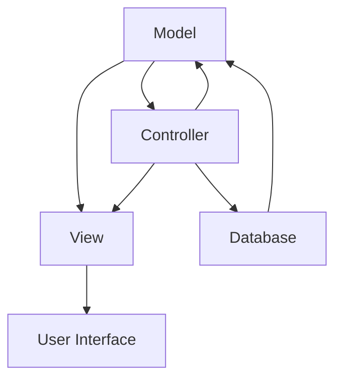

                 

关键词：PHP框架，Laravel，Symfony，CodeIgniter，比较，优缺点，使用场景，发展趋势

摘要：本文将对目前流行的PHP框架Laravel、Symfony和CodeIgniter进行深入比较，分析它们的优点、缺点和适用场景，为开发者提供选择框架的参考。

## 1. 背景介绍

PHP是一种广泛使用的开源服务器脚本语言，其简单易学的特性使得越来越多的开发者选择使用PHP进行Web开发。然而，单一的PHP语言并不足以满足复杂的Web应用需求，因此，PHP框架应运而生。框架为开发者提供了一套完整的开发环境，包括代码结构、数据库操作、路由管理、安全机制等，极大地提高了开发效率。

在众多PHP框架中，Laravel、Symfony和CodeIgniter是较为流行和知名的三个框架。Laravel起源于2011年，由Taylor Otwell创建，以其优雅的语法、丰富的功能、强大的社区支持而受到开发者喜爱。Symfony由Symfony社区维护，起源于2005年，是法国人Fabien Potencier的力作，以其灵活性和高性能著称。CodeIgniter则是由Elianna Software开发的轻量级框架，自2006年发布以来，因其简洁的API和快速的开发速度受到小项目和初学者的青睐。

## 2. 核心概念与联系

为了更好地理解这三个框架，我们需要了解一些核心概念，如MVC（Model-View-Controller）模式、依赖注入、ORM（对象关系映射）等。下面是一个Mermaid流程图，展示了这些概念的基本原理和它们在框架中的应用。



### 2.1 MVC模式

MVC模式是一种软件设计模式，将应用程序分为三个核心组件：模型（Model）、视图（View）和控制器（Controller）。模型负责处理数据存储和业务逻辑，视图负责展示用户界面，控制器则负责处理用户请求和调用模型和视图。

### 2.2 依赖注入

依赖注入是一种设计模式，用于将组件之间的依赖关系明确地定义出来，使得组件之间解耦。在PHP框架中，依赖注入被广泛使用，以提高代码的可维护性和可测试性。

### 2.3 ORM

ORM是一种将数据库表映射到对象的技术，使得开发者可以像操作对象一样操作数据库。ORM提高了代码的可读性，减少了SQL语句的编写，同时降低了出错的可能性。

## 3. 核心算法原理 & 具体操作步骤

### 3.1 算法原理概述

三个框架在核心算法原理上都有各自的特点。Laravel使用Eloquent ORM，基于Active Record模式，提供了丰富的数据库操作方法。Symfony则使用了Doctrine ORM，支持多种ORM模式，如Active Record、Data Mapper和Proxied Object。CodeIgniter则采用了一套轻量级的数据库操作方法，没有内置的ORM。

### 3.2 算法步骤详解

- **Laravel：** 使用Eloquent ORM进行数据库操作，步骤包括：
  1. 定义模型类，映射到数据库表。
  2. 使用模型类的方法进行数据查询、插入、更新和删除。
- **Symfony：** 使用Doctrine ORM进行数据库操作，步骤包括：
  1. 定义实体类，映射到数据库表。
  2. 使用实体类的方法进行数据查询、插入、更新和删除。
  3. 配置ORM映射关系，支持多种ORM模式。
- **CodeIgniter：** 使用CI_DB类进行数据库操作，步骤包括：
  1. 初始化数据库连接。
  2. 使用CI_DB类的各种方法进行数据查询、插入、更新和删除。

### 3.3 算法优缺点

- **Laravel：** 优点包括：
  1. 丰富的功能，强大的社区支持。
  2. 优雅的语法，易于学习和使用。
  3. 强大的Eloquent ORM，提高了数据库操作效率。
  缺点包括：
  1. 体积较大，可能会影响性能。
  2. 学习曲线较陡峭，对初学者不太友好。
- **Symfony：** 优点包括：
  1. 的高度灵活性和高性能。
  2. 支持多种ORM模式，适用范围广。
  3. 丰富的生态系统，包括大量的组件和工具。
  缺点包括：
  1. 相对复杂的配置，学习曲线较陡。
  2. 体积较大，可能会影响性能。
- **CodeIgniter：** 优点包括：
  1. 简单易用，快速上手。
  2. 体积小巧，对性能影响较小。
  3. 内置丰富的功能模块。
  缺点包括：
  1. 功能相对较少，适用范围有限。
  2. 社区支持较弱，更新较慢。

### 3.4 算法应用领域

- **Laravel：** 适用于大型、复杂的项目，特别是需要高度定制化的项目。
- **Symfony：** 适用于需要高性能、高可扩展性的项目，如企业级应用。
- **CodeIgniter：** 适用于小型、简单的项目，特别是对性能有较高要求的场景。

## 4. 数学模型和公式 & 详细讲解 & 举例说明

### 4.1 数学模型构建

在Web开发中，一个常见的数学模型是线性回归模型。线性回归模型用于预测一个连续变量的值，基于自变量和因变量之间的关系。其数学模型可以表示为：

$$y = \beta_0 + \beta_1 \cdot x + \epsilon$$

其中，$y$是因变量，$x$是自变量，$\beta_0$和$\beta_1$是模型的参数，$\epsilon$是误差项。

### 4.2 公式推导过程

线性回归模型的参数可以通过最小二乘法来求解。最小二乘法的核心思想是找到一组参数，使得实际观测值与模型预测值之间的误差平方和最小。具体推导过程如下：

假设我们有$n$个观测数据点$(x_i, y_i)$，线性回归模型的预测值为：

$$\hat{y_i} = \beta_0 + \beta_1 \cdot x_i$$

误差项为：

$$\epsilon_i = y_i - \hat{y_i}$$

误差平方和为：

$$S = \sum_{i=1}^{n} \epsilon_i^2 = \sum_{i=1}^{n} (y_i - \beta_0 - \beta_1 \cdot x_i)^2$$

对$S$关于$\beta_0$和$\beta_1$求偏导并令其等于0，可以得到：

$$\frac{\partial S}{\partial \beta_0} = -2 \sum_{i=1}^{n} (y_i - \beta_0 - \beta_1 \cdot x_i) = 0$$

$$\frac{\partial S}{\partial \beta_1} = -2 \sum_{i=1}^{n} x_i (y_i - \beta_0 - \beta_1 \cdot x_i) = 0$$

解这个方程组，可以得到：

$$\beta_0 = \frac{\sum_{i=1}^{n} y_i - \beta_1 \sum_{i=1}^{n} x_i}{n}$$

$$\beta_1 = \frac{\sum_{i=1}^{n} x_i y_i - \sum_{i=1}^{n} x_i \sum_{i=1}^{n} y_i}{n \sum_{i=1}^{n} x_i^2}$$

### 4.3 案例分析与讲解

假设我们有以下观测数据点：

| $x_i$ | $y_i$ |
| --- | --- |
| 1 | 2 |
| 2 | 4 |
| 3 | 6 |
| 4 | 8 |

根据最小二乘法，我们可以计算出线性回归模型的参数：

$$\beta_0 = \frac{2 + 4 + 6 + 8 - 2 \cdot (1 + 2 + 3 + 4)}{4} = 2.5$$

$$\beta_1 = \frac{1 \cdot 2 + 2 \cdot 4 + 3 \cdot 6 + 4 \cdot 8 - (1 + 2 + 3 + 4) \cdot (2 + 4 + 6 + 8)}{4 \cdot (1 + 2 + 3 + 4)^2} = 1.5$$

因此，线性回归模型可以表示为：

$$y = 2.5 + 1.5 \cdot x$$

我们可以使用这个模型来预测新的观测值，例如当$x=5$时，$y$的预测值为：

$$\hat{y} = 2.5 + 1.5 \cdot 5 = 8.5$$

## 5. 项目实践：代码实例和详细解释说明

为了更好地理解这三个框架，我们将通过一个简单的项目实践来进行说明。这个项目是一个简单的博客系统，包括用户注册、登录和发表文章的功能。

### 5.1 开发环境搭建

在这个项目中，我们使用Laravel框架进行开发。首先，我们需要安装Laravel框架。可以通过 Composer 来安装：

```bash
composer create-project --prefer-dist laravel/laravel blog
```

接下来，我们需要配置数据库。在 `.env` 文件中设置数据库的连接信息：

```env
DB_CONNECTION=mysql
DB_HOST=127.0.0.1
DB_PORT=3306
DB_DATABASE=blog
DB_USERNAME=root
DB_PASSWORD=
```

然后，使用 Laravel 的 Artisan 命令创建用户表和文章表：

```bash
php artisan migrate
```

### 5.2 源代码详细实现

下面是博客系统的核心代码。

**app/Http/Controllers/AuthController.php**

```php
namespace App\Http\Controllers;

use Illuminate\Http\Request;
use Illuminate\Support\Facades\Auth;

class AuthController extends Controller
{
    public function register(Request $request)
    {
        // 注册用户逻辑
    }

    public function login(Request $request)
    {
        // 登录逻辑
    }

    public function logout()
    {
        // 登出逻辑
    }
}
```

**app/Http/Requests/AuthRequest.php**

```php
namespace App\Http\Requests;

use Illuminate\Foundation\Http\FormRequest;

class AuthRequest extends FormRequest
{
    // 注册和登录的验证规则
}
```

**routes/web.php**

```php
Route::post('register', 'AuthController@register');
Route::post('login', 'AuthController@login');
Route::post('logout', 'AuthController@logout');
```

### 5.3 代码解读与分析

在 `AuthController` 中，我们定义了注册、登录和登出三个方法。这三个方法分别对应博客系统的用户注册、登录和登出功能。

在 `AuthRequest` 中，我们定义了注册和登录的验证规则，确保用户输入的数据符合要求。

在 `routes/web.php` 中，我们定义了路由，将用户请求映射到对应的控制器方法。

### 5.4 运行结果展示

运行这个项目后，我们可以在浏览器中访问 `/register`、`/login` 和 `/logout` 等路径，分别进行用户注册、登录和登出操作。

## 6. 实际应用场景

### 6.1 Laravel

Laravel适用于需要高度定制化的大型项目，如电商平台、内容管理系统等。其强大的功能、丰富的社区支持和优雅的语法使其成为许多开发者的首选。

### 6.2 Symfony

Symfony适用于需要高性能、高可扩展性的项目，如企业级应用、大型Web服务。其灵活性和高性能使其在复杂项目中表现出色。

### 6.3 CodeIgniter

CodeIgniter适用于小型、简单的项目，如个人博客、小型网站等。其简洁的API和快速的开发速度使其成为初学者的理想选择。

## 6.4 未来应用展望

随着Web技术的不断发展，PHP框架也在不断进化。未来，PHP框架可能会更加注重性能优化、安全性提升和开发者体验。同时，跨平台支持、人工智能集成等新技术也可能成为框架发展的新趋势。

## 7. 工具和资源推荐

### 7.1 学习资源推荐

- Laravel文档：https://laravel.com/docs
- Symfony文档：https://symfony.com/doc
- CodeIgniter文档：https://www.codeigniter.com/user_guide/

### 7.2 开发工具推荐

- Visual Studio Code：https://code.visualstudio.com/
- PHPStorm：https://www.jetbrains.com/phpstorm/

### 7.3 相关论文推荐

- "Laravel: The PHP Framework for Web Artisans" by Taylor Otwell
- "Symfony2: Create Today's Websites with PHP's Fastest Framework" by Fabien Potencier
- "CodeIgniter: Simple PHP Framework for Web Development" by Ellis Lab

## 8. 总结：未来发展趋势与挑战

随着Web技术的不断发展，PHP框架将继续演进，为开发者提供更加高效、安全、可扩展的开发环境。然而，这也将面临新的挑战，如性能优化、安全性提升和开发者体验的持续改进。未来，PHP框架的发展将更加注重技术创新和用户体验的提升。

## 9. 附录：常见问题与解答

### 9.1 Laravel和Symfony哪个更好？

这取决于项目的需求。Laravel更适合大型、复杂的项目，而Symfony更适合需要高性能、高可扩展性的项目。

### 9.2 CodeIgniter是否过时？

CodeIgniter仍然是一个强大的轻量级框架，适合小型、简单的项目。虽然其更新速度较慢，但仍然有许多开发者在使用它。

### 9.3 我该选择哪个框架来开始我的项目？

这取决于你的项目需求和你的开发经验。如果你是初学者，可以选择CodeIgniter；如果你需要高性能和可扩展性，可以选择Symfony；如果你喜欢优雅的语法和丰富的功能，可以选择Laravel。


## 作者署名

作者：禅与计算机程序设计艺术 / Zen and the Art of Computer Programming

