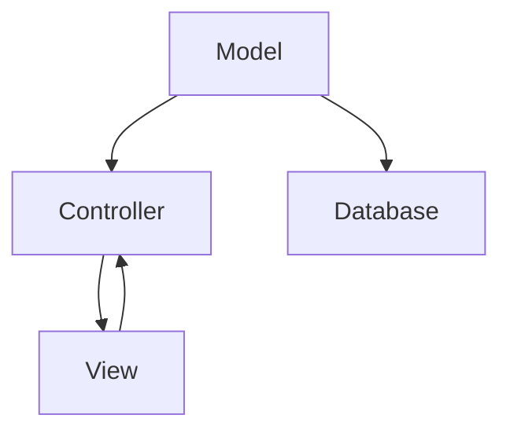

                 

PHP 是一种流行的服务器端脚本语言，自1995年诞生以来，它已经成为了 Web 开发领域的主流语言之一。PHP 的灵活性和易用性使得它广泛应用于各种规模的网站和应用中。然而，仅仅使用 PHP 语言本身并不能满足复杂的开发需求，因此，PHP 社区开发了多种框架来帮助开发者更高效地构建应用。其中，Laravel 和 Symfony 是两大备受推崇的框架。本文将深入探讨这两个框架的特点、设计理念、优缺点以及应用场景，帮助读者选择合适的工具来构建自己的 PHP 应用。

## 1. 背景介绍

Laravel 和 Symfony 都是在 PHP 社区中非常活跃的框架，它们各自拥有庞大的用户基础和社区支持。Laravel 是由 Taylor Otwell 于 2011 年推出的，它的目标是为开发者提供一种简洁、优雅的 Web 开发体验。Symfony 则是由 SensioLabs 团队于 2005 年创立的，它以其高度灵活性和组件化设计而闻名。

### Laravel 的诞生

Laravel 的诞生可以追溯到 2010 年，当时 Taylor Otwell 感觉到市场上的 PHP 框架过于复杂，且缺乏统一的开发标准。他希望通过一个简单、优雅的框架来解决这些问题。Laravel 应运而生，它迅速获得了社区的认可，并成为了 PHP 开发者的首选框架之一。

### Symfony 的历史

Symfony 的历史可以追溯到 2005 年，当时它是作为 Drupal 项目的一个子项目开发的。随着时间的推移，Symfony 成为了一个独立的框架，并逐渐发展成为一个完整的 Web 应用开发平台。Symfony 的组件化设计使得它在灵活性和可扩展性方面具有显著优势。

## 2. 核心概念与联系

在深入了解 Laravel 和 Symfony 之前，我们需要了解一些核心概念和它们之间的联系。这些概念包括 MVC 模式、路由、控制器、视图、模型、数据库迁移等。

### MVC 模式

MVC（Model-View-Controller）是一种常用的软件设计模式，用于分离应用程序的三个核心组件：模型（Model）、视图（View）和控制器（Controller）。模型负责数据存储和处理，视图负责展示数据，控制器负责处理用户输入并协调模型和视图之间的交互。

### 路由

路由是 Web 应用程序的核心，它负责将用户请求映射到相应的控制器或视图。在 Laravel 和 Symfony 中，路由配置是通过简单的配置文件或注解来实现的。

### 控制器

控制器是 MVC 模式中负责处理用户请求的核心组件。它负责接收用户的请求，调用相应的模型进行数据处理，然后将结果传递给视图进行展示。

### 视图

视图是用于展示模型数据的前端组件。在 Laravel 和 Symfony 中，视图可以使用模板引擎（如 Blade 和 Twig）来渲染。

### 模型

模型是用于数据存储和处理的组件。在 Laravel 和 Symfony 中，模型通常与数据库进行交互，并封装了常用的数据库操作，如创建、读取、更新和删除（CRUD）。

### 数据库迁移

数据库迁移是用于管理数据库结构和数据变更的工具。在 Laravel 和 Symfony 中，开发者可以使用迁移来创建、修改和回滚数据库结构。

### Mermaid 流程图

下面是一个简单的 Mermaid 流程图，展示了 Laravel 和 Symfony 中的核心概念和组件之间的联系：



## 3. 核心算法原理 & 具体操作步骤

### 3.1 算法原理概述

Laravel 和 Symfony 都是基于 PHP 的高级框架，它们的核心算法原理主要涉及以下几个方面：

1. **路由算法**：用于将用户请求映射到相应的控制器。
2. **控制器算法**：负责处理用户请求，调用相应的模型进行数据处理。
3. **模型算法**：用于数据存储和处理。
4. **视图算法**：用于渲染视图并展示数据。

### 3.2 算法步骤详解

1. **用户请求**：用户通过浏览器发送 HTTP 请求。
2. **路由解析**：框架根据路由配置将请求映射到相应的控制器。
3. **控制器处理**：控制器接收请求，调用相应的模型进行数据处理。
4. **数据处理**：模型与数据库进行交互，完成数据存储和处理。
5. **渲染视图**：控制器将数据处理结果传递给视图，视图渲染后返回给用户。

### 3.3 算法优缺点

#### Laravel 的优缺点

**优点**：

- **简洁易用**：Laravel 提供了丰富的内置功能和简单的配置，使得开发者可以快速上手。
- **社区支持**：Laravel 拥有庞大的社区支持，资源丰富，问题解决速度快。
- **安全性**：Laravel 提供了多种安全措施，如数据验证、SQL 注入防护等。

**缺点**：

- **性能**：相对于 Symfony，Laravel 的性能可能稍逊一筹。
- **灵活性**：由于内置功能丰富，Laravel 在某些情况下可能不如 Symfony 灵活。

#### Symfony 的优缺点

**优点**：

- **灵活性**：Symfony 采用组件化设计，开发者可以根据需要自由组合和扩展。
- **性能**：Symfony 的性能较高，适合大型和高并发的应用。
- **可扩展性**：Symfony 拥有丰富的组件，开发者可以轻松地扩展功能。

**缺点**：

- **学习曲线**：相对于 Laravel，Symfony 的学习曲线可能较陡峭。
- **资源消耗**：由于组件化设计，Symfony 可能需要更多的资源来运行。

### 3.4 算法应用领域

Laravel 和 Symfony 都可以应用于各种规模的 Web 开发项目。Laravel 更适合中小型项目，因其简洁易用的特性，可以帮助开发者快速构建应用。而 Symfony 更适合大型和高并发的项目，其灵活性和高性能使得它可以应对复杂的应用场景。

## 4. 数学模型和公式 & 详细讲解 & 举例说明

### 4.1 数学模型构建

在 Web 开发中，我们经常会遇到一些数学模型和公式。以下是一些常见的数学模型和公式：

- **线性回归模型**：
  
  $$ y = bx + a $$
  
- **逻辑回归模型**：
  
  $$ P(y=1) = \frac{1}{1 + e^{-(bx + a)}} $$
  
- **神经网络模型**：
  
  $$ z = \sum_{i=1}^{n} w_i \cdot x_i + b $$
  
  $$ a = \frac{1}{1 + e^{-z}} $$

### 4.2 公式推导过程

以线性回归模型为例，推导过程如下：

1. **目标函数**：

   $$ J = \frac{1}{2} \sum_{i=1}^{n} (y_i - (bx_i + a))^2 $$
   
2. **梯度下降**：

   $$ \nabla J = \frac{\partial J}{\partial b} = \sum_{i=1}^{n} (y_i - (bx_i + a)) \cdot x_i $$
   
   $$ \nabla J = \frac{\partial J}{\partial a} = \sum_{i=1}^{n} (y_i - (bx_i + a)) $$
   
3. **迭代更新**：

   $$ b = b - \alpha \cdot \nabla J(b) $$
   
   $$ a = a - \alpha \cdot \nabla J(a) $$

### 4.3 案例分析与讲解

假设我们有一个简单的线性回归问题，目标是预测某个产品的销售量。给定一组数据点 $(x_i, y_i)$，我们希望通过线性回归模型找到最佳拟合线。

1. **数据准备**：

   ```python
   import numpy as np
   
   x = np.array([1, 2, 3, 4, 5])
   y = np.array([2, 4, 5, 4, 5])
   ```

2. **模型构建**：

   ```python
   def linear_regression(x, y):
       b = np.linalg.inv(x.T.dot(x)).dot(x.T).dot(y)
       a = y - b.dot(x)
       return b, a
   
   b, a = linear_regression(x, y)
   ```

3. **模型评估**：

   ```python
   predicted_y = b.dot(x) + a
   mse = np.mean((predicted_y - y) ** 2)
   print("MSE:", mse)
   ```

通过上述代码，我们可以得到最佳拟合线的参数 $b$ 和 $a$，并计算均方误差（MSE）来评估模型性能。

## 5. 项目实践：代码实例和详细解释说明

### 5.1 开发环境搭建

在开始项目实践之前，我们需要搭建一个合适的开发环境。以下是具体的步骤：

1. **安装 PHP**：

   ```bash
   sudo apt-get update
   sudo apt-get install php php-cli php-fpm
   ```

2. **安装 Composer**：

   ```bash
   curl -sS https://getcomposer.org/installer -o composer-setup.php
   php composer-setup.php --install-dir=/usr/local/bin --filename=composer
   php -r "unlink('composer-setup.php');"
   ```

3. **安装 Laravel 和 Symfony**：

   ```bash
   composer create-project --prefer-dist laravel/laravel my-laravel-project
   composer create-project --prefer-dist symfony/symfony standard-project
   ```

### 5.2 源代码详细实现

以 Laravel 项目为例，我们创建一个简单的博客应用。以下是具体的步骤：

1. **创建文章模型**：

   ```bash
   php artisan make:model Article -m
   ```

2. **迁移数据库**：

   ```bash
   php artisan migrate
   ```

3. **创建控制器**：

   ```bash
   php artisan make:controller ArticleController
   ```

4. **编写控制器代码**：

   ```php
   <?php
   
   namespace App\Http\Controllers;
   
   use Illuminate\Http\Request;
   use App\Models\Article;
   
   class ArticleController extends Controller
   {
       public function index()
       {
           $articles = Article::all();
           return view('articles.index', compact('articles'));
       }
   }
   ```

5. **编写视图代码**：

   ```blade
   <ul>
       @foreach ($articles as $article)
           <li>{{ $article->title }}</li>
       @endforeach
   </ul>
   ```

### 5.3 代码解读与分析

在上面的代码中，我们首先创建了文章模型（Article），并迁移了数据库。然后，我们创建了一个 ArticleController 控制器，用于处理文章的增删改查操作。最后，我们在视图中展示了所有文章的标题。

1. **模型（Model）**：

   模型是用于封装数据操作的组件。在 Laravel 中，模型通常与数据库进行交互，并封装了常用的数据库操作。例如，在 Article 模型中，我们可以使用 `all()` 方法获取所有文章，使用 `create()` 方法创建新文章等。

2. **控制器（Controller）**：

   控制器是用于处理用户请求的组件。在 Laravel 中，控制器接收用户的请求，调用相应的模型进行数据处理，然后将结果传递给视图进行展示。在上面的代码中，ArticleController 控制器处理了用户对文章的查询请求，并将结果传递给视图。

3. **视图（View）**：

   视图是用于展示数据的前端组件。在 Laravel 中，视图可以使用 Blade 模板引擎进行渲染。在上面的代码中，我们使用 Blade 模板引擎渲染了文章列表视图，并使用了 Foreach 循环遍历所有文章的标题。

### 5.4 运行结果展示

在命令行中运行以下命令，启动 Laravel 服务器：

```bash
php artisan serve
```

在浏览器中访问 `http://localhost:8000`，我们可以看到文章列表页面，展示了所有文章的标题。

## 6. 实际应用场景

### 6.1 企业级应用

Laravel 和 Symfony 都非常适合构建企业级应用。Laravel 提供了丰富的内置功能和简洁的配置，使得开发者可以快速构建大型应用。而 Symfony 的组件化设计和高性能使得它非常适合构建需要高度可扩展性的应用。

### 6.2 个人项目

对于个人项目，Laravel 和 Symfony 都是不错的选择。Laravel 的简洁易用性使得开发者可以快速搭建项目，而 Symfony 的组件化设计提供了更多的灵活性和可扩展性。

### 6.3 教育项目

Laravel 和 Symfony 都可以作为教育项目的基础。Laravel 的简单易用性可以帮助初学者快速入门，而 Symfony 的组件化设计可以让学生更好地理解 Web 开发的整体架构。

## 7. 工具和资源推荐

### 7.1 学习资源推荐

- 《Laravel 教程》：由 Laravel 官方提供，内容全面、易懂。
- 《Symfony 官方文档》：Symfony 的官方文档，详细介绍了框架的各个方面。
- 《PHP 设计模式》：介绍了 PHP 中常用的设计模式，有助于提高代码质量。

### 7.2 开发工具推荐

- Visual Studio Code：一款功能强大的代码编辑器，支持多种编程语言和框架。
- PhpStorm：一款专门针对 PHP 的集成开发环境（IDE），提供了丰富的代码编辑和调试功能。
- Postman：一款 API 接口调试工具，可以帮助开发者快速测试和调试 API 接口。

### 7.3 相关论文推荐

- "Laravel: The PHP Framework for Web Artisans"
- "Symfony: A Flexible PHP Framework for Web Applications"
- "PHP: The Right Way"：介绍了 PHP 中的最佳实践和开发方法。

## 8. 总结：未来发展趋势与挑战

### 8.1 研究成果总结

Laravel 和 Symfony 作为 PHP 的两大框架，已经证明了它们在 Web 开发中的重要性。Laravel 的简洁易用性和快速开发能力，使其成为了中小型项目的首选。而 Symfony 的组件化设计和高性能，则使其成为了大型和高并发项目的理想选择。随着 Web 开发的不断演进，Laravel 和 Symfony 在性能、功能和安全方面的研究成果也在不断提升。

### 8.2 未来发展趋势

未来，Laravel 和 Symfony 在以下几个方面有望取得进一步发展：

1. **性能优化**：随着 Web 应用规模的不断扩大，性能优化将成为重要议题。Laravel 和 Symfony 将不断引入新技术和优化策略，以提高框架的性能。
2. **功能扩展**：随着业务需求的不断变化，开发者需要能够快速扩展框架的功能。Laravel 和 Symfony 将继续丰富其内置功能和扩展机制，以适应多样化的开发需求。
3. **安全性提升**：随着网络安全问题的日益突出，Laravel 和 Symfony 将持续关注安全性问题，提供更完善的安全措施。

### 8.3 面临的挑战

尽管 Laravel 和 Symfony 在 Web 开发领域取得了显著成就，但它们仍面临以下挑战：

1. **学习成本**：Laravel 和 Symfony 的学习曲线相对较陡峭，这可能会阻碍新手的入门。为此，框架开发者需要提供更丰富的学习资源和教学视频。
2. **社区支持**：虽然 Laravel 和 Symfony 都拥有庞大的社区支持，但在某些地区和领域，社区资源可能不够丰富。为此，框架开发者需要进一步拓展社区，提高社区活跃度。

### 8.4 研究展望

在未来，Laravel 和 Symfony 有望在以下领域取得突破：

1. **云原生应用**：随着云计算的兴起，Laravel 和 Symfony 将致力于支持云原生应用开发，提供更便捷的部署和运维解决方案。
2. **人工智能集成**：随着人工智能技术的发展，Laravel 和 Symfony 有望集成更多 AI 功能，为开发者提供更智能的开发工具和框架。

## 9. 附录：常见问题与解答

### 9.1 什么是 Laravel？

Laravel 是一个流行的 PHP 框架，旨在为 Web 开发者提供一种简洁、优雅的编程体验。

### 9.2 什么是 Symfony？

Symfony 是一个高度灵活的 PHP 框架，由 SensioLabs 开发，支持多种 Web 应用开发需求。

### 9.3 Laravel 和 Symfony 有什么区别？

Laravel 更注重易用性和快速开发，而 Symfony 更注重灵活性和高性能。

### 9.4 我应该选择 Laravel 还是 Symfony？

这取决于你的项目需求。如果你需要快速开发，可以选择 Laravel；如果你需要高度可扩展性和高性能，可以选择 Symfony。

### 9.5 Laravel 和 Symfony 有哪些内置功能？

Laravel 和 Symfony 都提供了丰富的内置功能，包括路由、认证、授权、缓存、队列等。

### 9.6 如何学习 Laravel 和 Symfony？

可以通过阅读官方文档、参加线上课程、观看教学视频等方式来学习 Laravel 和 Symfony。

## 作者署名

本文作者：禅与计算机程序设计艺术 / Zen and the Art of Computer Programming
----------------------------------------------------------------

以上是文章的主要内容和结构。文章内容使用 markdown 格式输出，确保各个章节的内容都符合要求，同时注意文章的完整性和专业性。在撰写过程中，请务必遵循提供的格式和结构要求。文章完成后，请再次检查是否符合所有要求，并确保内容的准确性和逻辑性。感谢您的辛勤工作，期待您的优秀成果！

