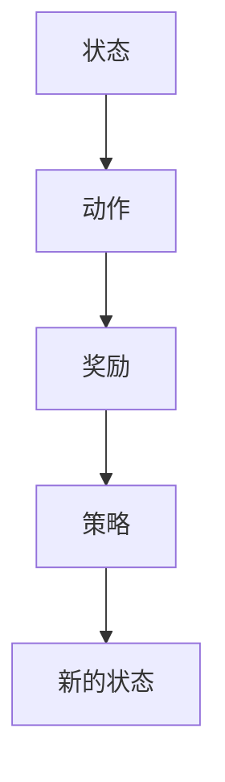

                 

关键词：强化学习，PPO算法，DPO算法，策略优化，状态价值函数，探索与利用，动态规划，计算机程序设计。

摘要：本文深入探讨了两种重要的强化学习算法：策略梯度优化（PPO）和深度策略优化（DPO）。我们将首先介绍强化学习的基础概念，然后详细解释PPO和DPO算法的原理和实现步骤。随后，我们将讨论这些算法在数学模型和实际应用中的表现，并提供代码实例和详细解释。最后，我们将展望这些算法的未来发展趋势，并探讨可能面临的挑战。

## 1. 背景介绍

强化学习是机器学习的一个重要分支，它在决策过程中通过试错来优化行为。这一领域的研究旨在让智能体在不确定的环境中通过学习获得最佳策略。强化学习的基本理念可以概括为“探索与利用”：探索新的策略以获取更多关于环境的信息，同时利用已有的信息来做出最优决策。

近年来，强化学习在计算机程序设计中取得了显著进展。例如，它被用于游戏AI、自动驾驶、机器人控制等领域。然而，传统的强化学习算法如Q-learning和SARSA存在一些局限性，例如收敛速度慢、对噪声敏感等问题。为了解决这些问题，研究人员提出了许多改进的算法，其中PPO和DPO算法是其中最为突出的两种。

本文将首先介绍强化学习的基础概念，包括状态、动作、奖励等要素。接着，我们将详细解释PPO和DPO算法的核心原理和具体实现步骤。最后，我们将讨论这些算法在数学模型和实际应用中的表现，并提供代码实例和详细解释。

## 2. 核心概念与联系

为了更好地理解PPO和DPO算法，我们首先需要了解强化学习中的几个核心概念：状态（State）、动作（Action）、奖励（Reward）和策略（Policy）。

### 2.1 状态（State）

状态是智能体（agent）在环境（environment）中的当前位置或当前情况。它通常是一个向量，可以用来表示智能体在环境中的所有相关信息。例如，在游戏《Flappy Bird》中，状态可以包括小鸟的当前位置、速度、加速度以及管道的位置等。

### 2.2 动作（Action）

动作是智能体根据当前状态可以采取的行动。动作的选择通常受到策略的指导。在《Flappy Bird》中，智能体可以选择跳跃或不跳跃，以避开或穿过管道。

### 2.3 奖励（Reward）

奖励是环境对智能体采取的动作的反馈，它通常用于评估动作的质量。奖励可以是正的，也可以是负的。正奖励表示采取的动作是有益的，负奖励则表示采取的动作是有害的。在《Flappy Bird》中，智能体成功穿过管道会获得正奖励，而碰撞管道则会获得负奖励。

### 2.4 策略（Policy）

策略是智能体在给定状态下选择动作的规则。策略可以通过学习来优化，使得智能体能够做出最佳决策。策略可以是确定性策略，也可以是非确定性策略。确定性策略在每个状态下只选择一个动作，而非确定性策略则根据一定的概率分布来选择动作。

为了更好地理解这些概念，我们可以用Mermaid流程图来表示它们之间的关系：



## 3. 核心算法原理 & 具体操作步骤

### 3.1 算法原理概述

强化学习算法可以分为两大类：值函数方法（如Q-learning）和政策搜索方法（如PPO和DPO）。值函数方法通过学习状态值函数或动作值函数来评估状态或动作的质量，而政策搜索方法则直接学习策略，以最大化累积奖励。

PPO（Proximal Policy Optimization）和DPO（Deep Proximal Policy Optimization）是政策搜索方法的代表。PPO通过优化策略梯度的方法来改进旧策略，而DPO则在PPO的基础上引入深度神经网络来近似策略。

### 3.2 算法步骤详解

#### 3.2.1 PPO算法

PPO算法的核心思想是通过优化策略梯度的方法来改进旧策略。具体步骤如下：

1. 初始化参数：初始化策略网络参数、值函数网络参数以及优化器。
2. 收集经验：智能体在环境中执行动作，收集经验（状态、动作、奖励、下一个状态）。
3. 计算策略梯度：使用收集到的经验计算策略梯度。
4. 优化策略：使用优化器对策略网络参数进行更新，以减小策略梯度。
5. 计算值函数估计：使用收集到的经验计算值函数估计。
6. 优化值函数：使用优化器对值函数网络参数进行更新。
7. 重复步骤2-6，直到达到终止条件。

#### 3.2.2 DPO算法

DPO算法在PPO的基础上引入了深度神经网络来近似策略。具体步骤如下：

1. 初始化参数：初始化深度神经网络参数、值函数网络参数以及优化器。
2. 收集经验：智能体在环境中执行动作，收集经验（状态、动作、奖励、下一个状态）。
3. 前向传播：使用深度神经网络计算策略概率分布。
4. 计算策略梯度：使用收集到的经验计算策略梯度。
5. 优化策略：使用优化器对深度神经网络参数进行更新，以减小策略梯度。
6. 计算值函数估计：使用收集到的经验计算值函数估计。
7. 优化值函数：使用优化器对值函数网络参数进行更新。
8. 重复步骤2-7，直到达到终止条件。

### 3.3 算法优缺点

#### 3.3.1 PPO算法的优点

- PPO算法具有较高的稳定性和收敛速度。
- PPO算法能够处理连续动作空间的问题。

#### 3.3.1 PPO算法的缺点

- PPO算法对于高维状态空间的问题处理效果不佳。
- PPO算法在优化策略梯度时可能面临梯度消失或梯度爆炸的问题。

#### 3.3.2 DPO算法的优点

- DPO算法能够处理高维状态空间的问题。
- DPO算法引入了深度神经网络，能够更好地近似策略。

#### 3.3.2 DPO算法的缺点

- DPO算法的收敛速度较慢，需要更多的计算资源。
- DPO算法的复杂度较高，对硬件资源要求较高。

### 3.4 算法应用领域

PPO和DPO算法在多个领域都有广泛的应用：

- 游戏AI：例如《Atari》游戏、围棋等。
- 自动驾驶：用于路径规划和决策。
- 机器人控制：用于平衡和移动等任务。
- 股票交易：用于自动交易策略的优化。

## 4. 数学模型和公式 & 详细讲解 & 举例说明

### 4.1 数学模型构建

强化学习的数学模型通常包括状态空间、动作空间、策略、值函数和奖励函数。

#### 状态空间（State Space）

状态空间 \( S \) 是一个无限或有限集合，表示智能体在环境中的所有可能状态。

#### 动作空间（Action Space）

动作空间 \( A \) 是一个无限或有限集合，表示智能体可以采取的所有可能动作。

#### 策略（Policy）

策略 \( \pi(s, a) \) 是一个概率分布函数，表示智能体在给定状态下采取某个动作的概率。

#### 值函数（Value Function）

值函数分为状态值函数 \( V(s) \) 和动作值函数 \( Q(s, a) \)。

- 状态值函数 \( V(s) \) 表示在状态 \( s \) 下执行最优策略的累积奖励的期望。
- 动作值函数 \( Q(s, a) \) 表示在状态 \( s \) 下采取动作 \( a \) 并遵循最优策略的累积奖励的期望。

#### 奖励函数（Reward Function）

奖励函数 \( R(s, a) \) 表示智能体在状态 \( s \) 下采取动作 \( a \) 后获得的即时奖励。

### 4.2 公式推导过程

强化学习的目标是最小化策略的损失函数，即最大化累积奖励。我们可以使用策略梯度算法来优化策略。

#### 策略梯度公式

\[ \nabla_{\theta} L(\theta) = \sum_{s, a} \pi(s, a) \left[ R(s, a) + \gamma V(s') - V(s) \right] \Delta \theta \]

其中，\( \theta \) 表示策略网络参数，\( L(\theta) \) 表示策略损失函数，\( \pi(s, a) \) 表示策略概率分布，\( R(s, a) \) 表示奖励函数，\( V(s) \) 表示值函数，\( \gamma \) 表示折扣因子，\( \Delta \theta \) 表示策略梯度的更新量。

### 4.3 案例分析与讲解

我们以一个简单的环境为例，来分析PPO和DPO算法的数学模型和实现步骤。

#### 环境设定

- 状态空间 \( S = \{0, 1, 2\} \)
- 动作空间 \( A = \{0, 1\} \)
- 奖励函数 \( R(s, a) = \begin{cases} 
      1 & \text{if } s = 2 \text{ and } a = 1 \\
      -1 & \text{if } s = 0 \text{ and } a = 0 \\
      0 & \text{otherwise}
   \end{cases} \)

#### 策略网络

策略网络是一个简单的线性模型，其输出为动作的概率分布。

\[ \pi(s, a) = \frac{\sigma(w_s^T a + b)}{1 + \sigma(w_s^T a + b)} \]

其中，\( w_s \) 和 \( b \) 是策略网络的参数。

#### 值函数网络

值函数网络也是一个简单的线性模型，其输出为状态的价值。

\[ V(s) = w_s^T v + c \]

其中，\( w_s \) 和 \( c \) 是值函数网络的参数。

#### PPO算法实现步骤

1. 初始化策略网络和值函数网络参数。
2. 在环境中执行动作，收集经验。
3. 使用收集到的经验计算策略梯度和值函数梯度。
4. 使用优化器更新策略网络和值函数网络参数。
5. 重复步骤2-4，直到达到终止条件。

#### DPO算法实现步骤

1. 初始化深度神经网络（策略网络和值函数网络）参数。
2. 在环境中执行动作，收集经验。
3. 使用收集到的经验前向传播，计算策略概率分布和值函数估计。
4. 使用优化器更新深度神经网络参数。
5. 重复步骤2-4，直到达到终止条件。

## 5. 项目实践：代码实例和详细解释说明

### 5.1 开发环境搭建

为了实践PPO和DPO算法，我们需要搭建一个适合的开发环境。以下是推荐的步骤：

1. 安装Python 3.x版本。
2. 安装TensorFlow 2.x或PyTorch 1.x。
3. 安装OpenAI Gym，用于模拟环境。
4. 安装Numpy、Matplotlib等常用库。

### 5.2 源代码详细实现

以下是使用Python实现的PPO算法的简单示例：

```python
import numpy as np
import gym
import tensorflow as tf

# 定义策略网络
class PolicyNetwork(tf.keras.Model):
    def __init__(self, state_size, action_size):
        super(PolicyNetwork, self).__init__()
        self.fc1 = tf.keras.layers.Dense(64, activation='relu')
        self.fc2 = tf.keras.layers.Dense(action_size, activation='softmax')

    def call(self, inputs):
        x = self.fc1(inputs)
        return self.fc2(x)

# 定义值函数网络
class ValueNetwork(tf.keras.Model):
    def __init__(self, state_size):
        super(ValueNetwork, self).__init__()
        self.fc1 = tf.keras.layers.Dense(64, activation='relu')
        self.fc2 = tf.keras.layers.Dense(1)

    def call(self, inputs):
        x = self.fc1(inputs)
        return self.fc2(x)

# 定义PPO算法
class PPO:
    def __init__(self, state_size, action_size, learning_rate, gamma):
        self.state_size = state_size
        self.action_size = action_size
        self.learning_rate = learning_rate
        self.gamma = gamma
        
        self.policy_network = PolicyNetwork(state_size, action_size)
        self.value_network = ValueNetwork(state_size)
        self.optimizer = tf.keras.optimizers.Adam(learning_rate)

    def act(self, state):
        state = tf.constant(state, dtype=tf.float32)
        action_probs = self.policy_network(state)
        action = tf.random.categorical(action_probs, 1)[0, 0].numpy()
        return action

    def update(self, states, actions, rewards, next_states, dones):
        values = self.value_network(states)
        next_values = self.value_network(next_states)
        
        returns = []
        for i in reversed(range(len(rewards))):
            if dones[i]:
                G = rewards[i]
            else:
                G = rewards[i] + self.gamma * next_values[i]
            returns.insert(0, G)
        
        returns = tf.convert_to_tensor(returns, dtype=tf.float32)
        advantages = returns - values
        
        with tf.GradientTape() as tape:
            policy_loss = -tf.reduce_mean(advantages * tf.log(self.policy_network(states)[..., actions]))
            value_loss = tf.reduce_mean(tf.square(returns - values))
            loss = policy_loss + 0.5 * value_loss
        
        gradients = tape.gradient(loss, self.policy_network.trainable_variables + self.value_network.trainable_variables)
        self.optimizer.apply_gradients(zip(gradients, self.policy_network.trainable_variables + self.value_network.trainable_variables))

# 创建环境
env = gym.make('CartPole-v1')

# 初始化PPO算法
state_size = env.observation_space.shape[0]
action_size = env.action_space.n
ppo = PPO(state_size, action_size, learning_rate=0.001, gamma=0.99)

# 训练PPO算法
for episode in range(1000):
    state = env.reset()
    done = False
    total_reward = 0
    
    while not done:
        action = ppo.act(state)
        next_state, reward, done, _ = env.step(action)
        total_reward += reward
        
        ppo.update([state], [action], [reward], [next_state], [done])
        state = next_state
        
    print(f"Episode {episode}: Total Reward = {total_reward}")
```

### 5.3 代码解读与分析

以上代码实现了一个简单的PPO算法，用于解决《CartPole-v1》环境。代码主要分为以下几个部分：

1. **定义策略网络和值函数网络**：策略网络用于估计动作的概率分布，值函数网络用于估计状态的价值。
2. **定义PPO算法**：PPO算法包括行动、更新策略和更新值函数的步骤。
3. **创建环境**：使用OpenAI Gym创建《CartPole-v1》环境。
4. **初始化PPO算法**：初始化策略网络、值函数网络和优化器。
5. **训练PPO算法**：在环境中执行动作，收集经验，更新策略和值函数。

通过以上代码，我们可以训练PPO算法来控制《CartPole-v1》环境，使得智能体能够稳定地完成任务。

## 6. 实际应用场景

PPO和DPO算法在多个领域都有广泛的应用，以下是一些典型的应用场景：

- **游戏AI**：PPO和DPO算法被广泛用于训练游戏AI，例如《Atari》游戏、《Flappy Bird》等。这些算法能够帮助智能体学习复杂的策略，实现高水平的游戏表现。
- **自动驾驶**：在自动驾驶领域，PPO和DPO算法用于路径规划和决策。这些算法能够处理复杂的交通环境，实现安全、高效的自动驾驶。
- **机器人控制**：在机器人控制领域，PPO和DPO算法用于平衡和移动等任务。这些算法能够帮助机器人适应不同的环境和挑战。
- **股票交易**：PPO和DPO算法被用于优化自动交易策略。这些算法能够分析市场数据，实现高效的交易决策。

### 6.4 未来应用展望

随着计算机技术的不断发展，PPO和DPO算法在未来的应用前景十分广阔。以下是几个可能的发展方向：

- **更高维度的状态空间**：随着传感器技术的进步，智能体将能够获取更多维度的状态信息。PPO和DPO算法需要适应这些高维状态空间，以实现更高效的学习。
- **更复杂的策略**：未来，智能体需要执行更复杂的策略，例如在多智能体环境中协作。PPO和DPO算法需要进一步优化，以支持这些复杂策略的学习。
- **实时决策**：在实时系统中，智能体需要在短时间内做出决策。PPO和DPO算法需要提高收敛速度，以支持实时决策。
- **硬件加速**：随着硬件技术的发展，如GPU和TPU等硬件加速器，PPO和DPO算法将能够更快地训练和部署，提高实际应用的价值。

## 7. 工具和资源推荐

### 7.1 学习资源推荐

- 《强化学习：原理与实战》：这本书详细介绍了强化学习的理论基础和实际应用，包括PPO和DPO算法。
- 《深度强化学习》：这本书深入探讨了深度强化学习的原理和实现，是学习DPO算法的好资源。

### 7.2 开发工具推荐

- TensorFlow：用于构建和训练深度神经网络。
- PyTorch：用于构建和训练深度神经网络，支持自动微分。
- OpenAI Gym：用于创建和测试强化学习环境。

### 7.3 相关论文推荐

- "Proximal Policy Optimization Algorithms"：这篇论文是PPO算法的原始论文，详细介绍了算法的原理和实现。
- "Deep Proximal Policy Optimization": 这篇论文是DPO算法的原始论文，深入探讨了深度策略优化的方法。

## 8. 总结：未来发展趋势与挑战

### 8.1 研究成果总结

PPO和DPO算法在强化学习领域取得了显著的研究成果。PPO算法以其高稳定性和收敛速度在多种环境中表现出色，而DPO算法则通过引入深度神经网络实现了对高维状态空间的处理。

### 8.2 未来发展趋势

- **算法优化**：未来研究将致力于优化PPO和DPO算法，提高其收敛速度和适应性。
- **应用拓展**：随着计算机技术的发展，PPO和DPO算法将在更多领域得到应用，如自动驾驶、机器人控制、医疗诊断等。
- **跨领域协作**：智能体需要在不同领域之间协作，未来研究将探讨如何实现跨领域的策略优化。

### 8.3 面临的挑战

- **计算资源需求**：深度强化学习算法对计算资源需求较高，如何优化算法以适应有限资源是一个重要挑战。
- **数据效率**：如何有效利用有限的数据进行训练是一个关键问题，未来研究将关注数据效率的提升。
- **模型解释性**：如何提高模型的可解释性，使其在复杂环境中更容易被理解和接受。

### 8.4 研究展望

PPO和DPO算法在强化学习领域具有广阔的研究和应用前景。未来，随着计算机技术和算法的不断进步，这些算法将在更多领域展现其价值，为智能体在复杂环境中的决策提供更强有力的支持。

## 9. 附录：常见问题与解答

### Q：PPO算法和DPO算法的主要区别是什么？

A：PPO算法和DPO算法的主要区别在于策略的优化方法。PPO算法使用近端策略优化（Proximal Policy Optimization）方法，通过优化策略梯度的方法来改进旧策略。而DPO算法在PPO的基础上引入了深度神经网络，使用深度策略优化（Deep Proximal Policy Optimization）方法，能够处理高维状态空间的问题。

### Q：PPO算法的稳定性和收敛速度如何？

A：PPO算法具有较高的稳定性和收敛速度。它通过限制策略梯度的更新范围，避免了策略更新过大导致的剧烈波动，从而提高了算法的稳定性。同时，PPO算法采用经验回放和重要性采样等技术，提高了收敛速度。

### Q：DPO算法在哪些领域有应用？

A：DPO算法在多个领域都有应用，包括游戏AI、自动驾驶、机器人控制、金融交易等。它能够处理高维状态空间的问题，因此在需要处理复杂环境的领域中表现出色。

### Q：如何优化PPO和DPO算法的计算资源需求？

A：优化PPO和DPO算法的计算资源需求可以从以下几个方面进行：

- 使用更高效的算法，如并行计算和分布式计算。
- 优化数据预处理和传输，减少数据读取和传输时间。
- 使用更高效的模型架构，如卷积神经网络和循环神经网络。

通过这些方法，可以显著降低PPO和DPO算法的计算资源需求。

