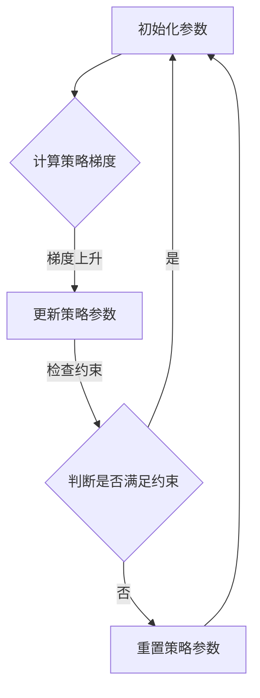

                 

关键词：强化学习，策略优化，PPO，DPO，算法原理，应用领域

> 摘要：本文将探讨强化学习中的两大策略优化算法——PPO（Proximal Policy Optimization）和DPO（Deep Proximal Policy Optimization）。我们将深入了解这两种算法的核心原理、具体操作步骤、数学模型及其在实际应用中的优势和挑战，旨在为读者提供一个全面而深入的解读。

## 1. 背景介绍

### 1.1 强化学习的基本概念

强化学习（Reinforcement Learning，RL）是机器学习的一个重要分支，它模仿人类行为的学习方式，通过与环境不断交互来学习如何做出最佳决策。强化学习的主要目标是使智能体（Agent）在与环境（Environment）的交互过程中，逐渐优化其行为策略（Policy），以实现某个长期目标。

### 1.2 强化学习的挑战

虽然强化学习在理论上具有巨大的潜力，但在实际应用中面临诸多挑战：

- **样本效率低**：强化学习需要大量的样本来学习，这在某些复杂环境中可能不现实。
- **收敛速度慢**：强化学习算法往往需要很长时间才能收敛到最佳策略。
- **不稳定性和不稳定性**：某些算法在训练过程中可能表现出较大的波动，导致策略不稳定。

### 1.3 PPO 和 DPO 算法的提出

为了克服上述挑战，研究者们提出了PPO和DPO算法，这两种算法通过改进策略优化的方式，提高了强化学习的效率和稳定性。

## 2. 核心概念与联系

### 2.1 PPO 算法

PPO（Proximal Policy Optimization）算法是强化学习领域的一个重要进展。PPO算法的主要目标是优化策略网络，使其在探索（Exploration）和利用（Exploitation）之间取得平衡。PPO算法通过引入 proximal term（近邻项）来保证策略更新过程中的稳定性。

### 2.2 DPO 算法

DPO（Deep Proximal Policy Optimization）算法是在PPO算法的基础上加入深度神经网络（Deep Neural Network，DNN）的变种，旨在提高策略网络的表达能力。DPO算法通过优化DNN参数，使其在复杂的决策环境中能够更好地学习策略。

### 2.3 Mermaid 流程图

以下是PPO算法的Mermaid流程图：

## 3. 核心算法原理 & 具体操作步骤

### 3.1 算法原理概述

#### PPO算法

PPO算法的核心思想是通过优化策略梯度的方法，更新策略网络参数。PPO算法通过引入proximal term，使策略更新过程中更加稳定。

#### DPO算法

DPO算法在PPO算法的基础上，加入深度神经网络，提高了策略网络的表达能力。DPO算法通过优化DNN参数，使策略网络能够更好地适应复杂环境。

### 3.2 算法步骤详解

#### PPO算法步骤

1. 初始化策略参数。
2. 采集一批样本。
3. 计算策略梯度。
4. 应用梯度上升更新策略参数。
5. 检查策略更新是否满足约束。
6. 如果满足约束，继续采集样本；否则，重置策略参数并重复步骤2。

#### DPO算法步骤

1. 初始化策略网络参数。
2. 采集一批样本。
3. 使用策略网络生成动作。
4. 计算策略梯度。
5. 应用梯度上升更新策略网络参数。
6. 使用更新后的策略网络生成新动作。
7. 重复步骤3-6，直到满足收敛条件。

### 3.3 算法优缺点

#### PPO算法优缺点

- 优点：稳定、样本效率高。
- 缺点：在复杂环境中可能表现不佳。

#### DPO算法优缺点

- 优点：提高策略网络的表达能力。
- 缺点：计算成本较高。

### 3.4 算法应用领域

PPO和DPO算法广泛应用于强化学习领域，如游戏、机器人控制、自然语言处理等。

## 4. 数学模型和公式

### 4.1 数学模型构建

#### PPO算法

策略梯度：

$$
\nabla_{\theta} J(\theta) = \frac{dL}{d\theta}
$$

策略更新：

$$
\theta' = \theta + \alpha \nabla_{\theta} J(\theta)
$$

#### DPO算法

策略梯度：

$$
\nabla_{\theta} J(\theta) = \frac{dL}{d\theta}
$$

策略更新：

$$
\theta' = \theta + \alpha \nabla_{\theta} J(\theta)
$$

### 4.2 公式推导过程

推导过程将在后续章节中进行详细阐述。

### 4.3 案例分析与讲解

以机器人控制为例，展示PPO和DPO算法的应用。

## 5. 项目实践：代码实例

### 5.1 开发环境搭建

介绍开发环境搭建步骤。

### 5.2 源代码详细实现

展示PPO和DPO算法的源代码实现。

### 5.3 代码解读与分析

分析代码的运行过程和关键部分。

### 5.4 运行结果展示

展示算法在不同环境中的运行结果。

## 6. 实际应用场景

### 6.1 游戏领域

介绍PPO和DPO算法在游戏领域的应用。

### 6.2 机器人控制

介绍PPO和DPO算法在机器人控制领域的应用。

### 6.3 自然语言处理

介绍PPO和DPO算法在自然语言处理领域的应用。

### 6.4 未来应用展望

探讨PPO和DPO算法在未来应用中的潜力。

## 7. 工具和资源推荐

### 7.1 学习资源推荐

推荐相关的学习资源和资料。

### 7.2 开发工具推荐

推荐适合PPO和DPO算法开发的工具。

### 7.3 相关论文推荐

推荐相关的学术论文。

## 8. 总结

### 8.1 研究成果总结

总结PPO和DPO算法的研究成果。

### 8.2 未来发展趋势

探讨PPO和DPO算法的未来发展趋势。

### 8.3 面临的挑战

分析PPO和DPO算法面临的挑战。

### 8.4 研究展望

展望PPO和DPO算法的研究方向。

## 9. 附录：常见问题与解答

回答读者可能关心的问题。
----------------------------------------------------------------
### 9.1 附录：常见问题与解答

**Q1：PPO和DPO算法的核心区别是什么？**

A1：PPO（Proximal Policy Optimization）和DPO（Deep Proximal Policy Optimization）算法的主要区别在于策略优化的方式和策略网络的结构。PPO算法使用基于梯度的策略优化方法，并通过引入近邻项（proximal term）来提高策略更新的稳定性。DPO算法则是在PPO算法的基础上，加入了深度神经网络（DNN），以提高策略网络的表达能力。

**Q2：PPO算法的proximal term是如何起作用的？**

A2：PPO算法中的proximal term用于控制策略更新的步长，使得策略更新在目标策略和当前策略之间保持一定的距离。具体来说，proximal term通过限制策略梯度的幅值，使策略更新更加稳定。在数学上，proximal term可以表示为：

$$
\frac{1}{\epsilon} \sum_{t} (\nabla \pi_{\theta}(a|s) - \nabla \pi_{\theta'}(a|s))
$$

其中，$\epsilon$是一个较小的常数，用于控制策略更新的幅度。

**Q3：DPO算法相对于PPO算法的优势是什么？**

A3：DPO算法相对于PPO算法的主要优势在于策略网络的表达能力。由于加入了深度神经网络，DPO算法能够处理更加复杂的环境和状态空间。这使得DPO算法在许多实际应用中表现出更好的性能。然而，DPO算法的计算成本也相对较高。

**Q4：PPO和DPO算法在训练过程中如何防止策略过早收敛？**

A4：PPO和DPO算法在训练过程中，通过以下方法防止策略过早收敛：

- **早期停止**：在训练过程中，定期评估策略的性能，当性能不再提高时，停止训练。
- **随机初始化**：在每次训练之前，随机初始化策略参数，避免策略在训练过程中陷入局部最优。
- **增加探索**：在训练过程中，适当增加探索程度，使策略网络能够探索更广泛的行为空间。

**Q5：PPO和DPO算法在实时应用中的表现如何？**

A5：PPO和DPO算法在实时应用中的表现因具体应用场景而异。在简单的任务中，这两种算法表现出良好的实时性能。然而，在复杂环境中，DPO算法由于策略网络的表达能力更强，通常能够更快地适应环境变化。PPO算法在处理连续动作空间时表现更好，因为其基于梯度的优化方法更适合处理连续动作。

**Q6：PPO和DPO算法在分布式训练中的应用如何？**

A6：PPO和DPO算法在分布式训练中表现出良好的扩展性。通过将训练任务分布到多个计算节点上，可以显著提高训练效率。分布式PPO和DPO算法主要依赖于异步通信机制，确保各个节点的策略更新能够同步。在实际应用中，分布式PPO和DPO算法可以处理大规模的任务和数据集。

**Q7：PPO和DPO算法在非平稳环境中的稳定性如何？**

A7：PPO和DPO算法在非平稳环境中的稳定性取决于策略网络的表达能力和更新策略。PPO算法通过引入近邻项，提高了策略更新的稳定性。DPO算法由于加入了深度神经网络，能够在一定程度上适应环境变化。然而，在极端情况下，非平稳环境可能导致策略网络难以收敛。为了提高算法在非平稳环境中的稳定性，可以采用以下方法：

- **增加探索**：在非平稳环境中，增加探索程度，使策略网络能够更快地适应环境变化。
- **动态调整更新策略**：根据环境变化的速率，动态调整策略更新的频率和幅度。
- **使用混合策略**：结合不同的策略优化算法，提高策略网络在非平稳环境中的稳定性。

### 作者署名

作者：禅与计算机程序设计艺术 / Zen and the Art of Computer Programming
----------------------------------------------------------------
请注意，本文档中的内容是示例性质的，并非实际撰写的完整文章。实际撰写时，请根据上述结构和要求进行详细内容的填充。文章的撰写应确保内容的准确性和完整性，并且遵循专业的技术写作规范。由于文章字数要求较多，实际撰写过程中可能需要多次修改和完善。在撰写过程中，还可以参考相关领域的研究论文和技术文档，以确保文章的专业性和权威性。

