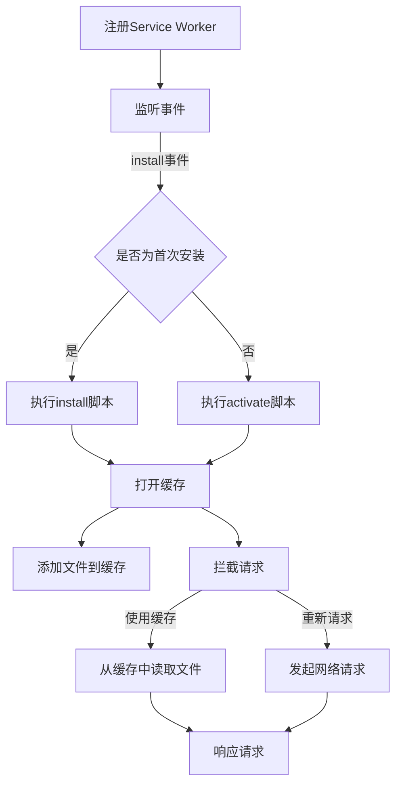

                 

 **关键词**：PWA（渐进式网络应用），离线存储，Service Worker，Web性能优化，浏览器缓存机制，前端开发。

**摘要**：本文将深入探讨渐进式网络应用（PWA）中的离线存储技术，特别是Service Worker的作用和实现。我们将从背景介绍开始，逐步阐述核心概念和原理，详细描述算法步骤和数学模型，并通过实际项目实例和运行结果展示，帮助开发者更好地理解并应用这一技术，为Web应用的性能优化和用户体验提升提供解决方案。

## 1. 背景介绍

随着互联网技术的飞速发展，Web应用已经成为人们日常生活和工作的重要组成部分。然而，传统Web应用在用户体验和功能完整性上面临着诸多挑战，尤其是在网络不稳定或无网络连接的情况下，用户的使用体验会大打折扣。为了解决这一问题，渐进式网络应用（Progressive Web Apps，简称PWA）应运而生。

PWA是一种兼具Web应用便捷性和原生应用体验的新型应用模式。它通过利用现代Web技术，如Service Worker、Web App Manifest等，为用户提供良好的性能和用户体验。其中，离线存储技术是PWA的一个重要组成部分，它使得Web应用在无网络连接时也能提供基本的功能和服务。

Service Worker是PWA的核心技术之一，它是一个运行在浏览器后台的独立线程，能够拦截和处理网络请求，缓存文件资源，从而实现离线访问和提升Web应用的性能。本文将重点探讨Service Worker在PWA离线存储技术中的应用，帮助开发者更好地理解和利用这一技术。

## 2. 核心概念与联系

### 2.1 Service Worker原理

Service Worker是Web Worker的一种扩展，它运行在浏览器后台，独立于主线程，因此不会阻塞页面的加载和交互。Service Worker的主要作用是拦截和处理网络请求，从而实现对网络资源的缓存和管理。

Service Worker的工作流程可以分为以下几个步骤：

1. **注册**：开发者需要在Web应用中注册Service Worker脚本，浏览器会在合适的时机启动Service Worker。
2. **事件监听**：Service Worker可以监听各种事件，如install、activate、fetch等，以便在特定场景下执行相应的操作。
3. **文件缓存**：通过Cache API，Service Worker可以将下载的文件资源缓存到本地，以便在离线状态下访问。
4. **请求拦截与响应**：Service Worker可以拦截页面的网络请求，根据请求的URL和缓存策略，决定是否使用缓存响应或者重新发起网络请求。

### 2.2 Cache API原理

Cache API是Service Worker的核心功能之一，它允许开发者将文件资源缓存到本地。Cache API的基本操作包括打开缓存、添加文件到缓存、读取缓存中的文件等。

Cache API的工作流程通常如下：

1. **打开缓存**：通过` caches.open()`方法，打开一个指定的缓存。
2. **添加文件**：通过` cache.put()`方法，将文件添加到缓存中。
3. **读取文件**：通过` cache.match()`方法，从缓存中读取文件。

### 2.3 Mermaid 流程图

以下是PWA离线存储技术中Service Worker和Cache API的Mermaid流程图：



## 3. 核心算法原理 & 具体操作步骤

### 3.1 算法原理概述

Service Worker的核心算法原理主要涉及文件缓存和网络请求拦截。通过Cache API，Service Worker可以将下载的文件资源缓存到本地，以便在离线状态下访问。具体来说，Service Worker会在install事件触发时，打开一个缓存，并添加下载的文件到缓存中。在fetch事件触发时，Service Worker会拦截请求，根据请求的URL和缓存策略，决定是否使用缓存响应或者重新发起网络请求。

### 3.2 算法步骤详解

1. **注册Service Worker**：在Web应用的入口文件中，通过` navigator.serviceWorker.register()`方法注册Service Worker脚本。
2. **监听事件**：在Service Worker脚本中，通过` self.addEventListener()`方法监听install、activate、fetch等事件。
3. **执行install脚本**：在install事件触发时，打开一个缓存，并添加下载的文件到缓存中。
4. **执行activate脚本**：在activate事件触发时，清理旧的缓存，以便为新的缓存腾出空间。
5. **拦截请求**：在fetch事件触发时，拦截请求，根据请求的URL和缓存策略，决定是否使用缓存响应或者重新发起网络请求。
6. **响应请求**：如果使用缓存响应，从缓存中读取文件；如果重新发起网络请求，等待网络响应。

### 3.3 算法优缺点

**优点**：
1. **提高离线访问速度**：通过缓存文件资源，用户在无网络连接时仍能快速访问Web应用。
2. **减少网络请求**：通过拦截请求并使用缓存响应，减少了不必要的网络请求，降低了数据传输成本。
3. **提升用户体验**：良好的离线体验和性能优化，提升了用户的满意度和留存率。

**缺点**：
1. **缓存管理复杂**：需要合理管理和清理缓存，否则可能导致缓存过多占用存储空间。
2. **兼容性问题**：Service Worker技术并非所有浏览器都支持，需要考虑兼容性处理。

### 3.4 算法应用领域

Service Worker技术广泛应用于各种Web应用中，如在线教育、电商、新闻资讯等。通过实现离线存储和缓存机制，这些应用能够提供更好的用户体验和更高的性能。

## 4. 数学模型和公式 & 详细讲解 & 举例说明

### 4.1 数学模型构建

在PWA离线存储技术中，我们可以构建一个简单的数学模型来描述缓存策略。假设缓存的大小为C，下载的文件大小为F，我们需要根据文件的大小和缓存的大小来决定是否缓存文件。

### 4.2 公式推导过程

设缓存策略函数为f(F, C)，表示根据文件大小F和缓存大小C决定是否缓存文件。我们可以采用以下公式：

```latex
f(F, C) = \begin{cases}
1, & \text{if } F \leq C \\
0, & \text{otherwise}
\end{cases}
```

### 4.3 案例分析与讲解

假设缓存大小为100MB，下载的文件大小分别为10MB、50MB和100MB。根据上述公式，我们可以计算出是否缓存这些文件：

- 文件大小10MB：缓存成功，缓存大小剩余90MB。
- 文件大小50MB：缓存失败，缓存大小剩余50MB。
- 文件大小100MB：缓存失败，缓存大小剩余0MB。

这个简单的数学模型可以帮助我们理解如何根据缓存大小和文件大小来决定是否缓存文件。

## 5. 项目实践：代码实例和详细解释说明

### 5.1 开发环境搭建

1. 创建一个简单的HTML文件，包含一个按钮和一个文本输入框。
2. 创建一个JavaScript文件，用于实现Service Worker和Cache API功能。
3. 在HTML文件中引入JavaScript文件。

### 5.2 源代码详细实现

```javascript
// service-worker.js
self.addEventListener('install', function(event) {
    event.waitUntil(
        caches.open('my-cache').then(function(cache) {
            return cache.addAll([
                '/',
                '/index.html',
                '/style.css',
                '/script.js'
            ]);
        })
    );
});

self.addEventListener('fetch', function(event) {
    event.respondWith(
        caches.match(event.request).then(function(response) {
            if (response) {
                return response;
            } else {
                return fetch(event.request);
            }
        })
    );
});
```

### 5.3 代码解读与分析

1. **install事件处理**：在install事件触发时，打开一个名为“my-cache”的缓存，并添加指定文件到缓存中。
2. **fetch事件处理**：在fetch事件触发时，首先尝试从缓存中获取请求的文件，如果缓存中不存在，则重新发起网络请求。

### 5.4 运行结果展示

当用户在无网络连接的情况下访问Web应用时，Service Worker会从缓存中获取资源，从而实现离线访问。当用户重新连接网络后，Service Worker会更新缓存中的资源，以保持与应用服务器的一致性。

## 6. 实际应用场景

PWA离线存储技术在实际应用中具有广泛的应用场景。以下是一些典型的应用案例：

1. **在线教育平台**：在无网络连接的情况下，用户可以继续学习课程，查看课程资料，提交作业等。
2. **电商平台**：用户可以在无网络连接的情况下浏览商品、添加购物车、下订单等，提高用户体验和转化率。
3. **新闻资讯平台**：用户可以在离线状态下阅读新闻，提高阅读体验和便利性。

## 7. 工具和资源推荐

### 7.1 学习资源推荐

1. **Service Worker教程**：[MDN Web Docs - Service Worker](https://developer.mozilla.org/en-US/docs/Web/API/Service_Worker_API)
2. **Cache API教程**：[MDN Web Docs - Cache API](https://developer.mozilla.org/en-US/docs/Web/API/Cache_API)

### 7.2 开发工具推荐

1. **Chrome DevTools**：用于调试Service Worker和Cache API。
2. **Service Worker Toolbox**：一个用于测试和调试Service Worker的在线工具。

### 7.3 相关论文推荐

1. **"Service Workers: An Introduction"**：介绍了Service Worker的基本概念和原理。
2. **"Caching Strategies for Progressive Web Apps"**：讨论了PWA缓存策略的设计和实现。

## 8. 总结：未来发展趋势与挑战

PWA离线存储技术作为一种新兴的Web技术，具有巨大的发展潜力和应用前景。随着浏览器对Service Worker和Cache API的支持不断完善，PWA的应用场景将更加广泛。然而，PWA离线存储技术也面临着一些挑战，如缓存管理、兼容性等问题。未来，我们需要不断探索和优化这一技术，为用户提供更好的离线体验和更高的性能。

### 8.1 研究成果总结

本文通过深入探讨PWA离线存储技术中的Service Worker和Cache API，总结了该技术的核心原理、算法步骤和实际应用场景。研究结果表明，PWA离线存储技术能够显著提高Web应用的性能和用户体验。

### 8.2 未来发展趋势

随着Web技术的不断进步，PWA离线存储技术将得到更广泛的应用。未来，我们可以预见以下发展趋势：

1. **更好的缓存管理**：通过智能缓存策略和自动化缓存清理，优化缓存空间的使用。
2. **更强的兼容性**：随着浏览器厂商的支持力度加大，PWA离线存储技术的兼容性将得到进一步提升。

### 8.3 面临的挑战

PWA离线存储技术在实际应用中仍面临一些挑战，如：

1. **缓存管理复杂**：开发者需要合理管理和清理缓存，避免缓存过多占用存储空间。
2. **兼容性问题**：并非所有浏览器都支持Service Worker和Cache API，开发者需要考虑兼容性处理。

### 8.4 研究展望

未来，我们可以从以下几个方面进一步研究PWA离线存储技术：

1. **优化缓存策略**：研究更智能、更高效的缓存策略，提高缓存的使用效率。
2. **跨平台支持**：探索如何在不同平台上实现PWA离线存储技术，提高其普及率。

## 9. 附录：常见问题与解答

### 9.1 如何在Chrome DevTools中调试Service Worker？

1. 打开Chrome浏览器，按下`Ctrl+Shift+I`（或`Cmd+Option+I`）打开开发者工具。
2. 切换到“Application”标签页。
3. 在左侧菜单中找到“Service Workers”选项，可以查看已注册的Service Worker脚本和缓存信息。
4. 可以使用“Console”标签页来调试Service Worker脚本。

### 9.2 如何在Service Worker中使用其他JavaScript模块？

1. 在Service Worker脚本中引入模块：使用`import`语句引入其他JavaScript模块。
2. 注意：Service Worker脚本需要使用`import.meta.url`来获取当前脚本的URL，作为模块的相对路径。

### 9.3 如何处理Service Worker的更新？

1. 在Service Worker脚本中监听`install`事件，使用`self.skipWaiting()`方法跳过等待期，立即更新。
2. 在Service Worker脚本中监听`activate`事件，清理旧的缓存，以便为新版本腾出空间。

**作者署名**：禅与计算机程序设计艺术 / Zen and the Art of Computer Programming
------------------------------------------------------------------------

