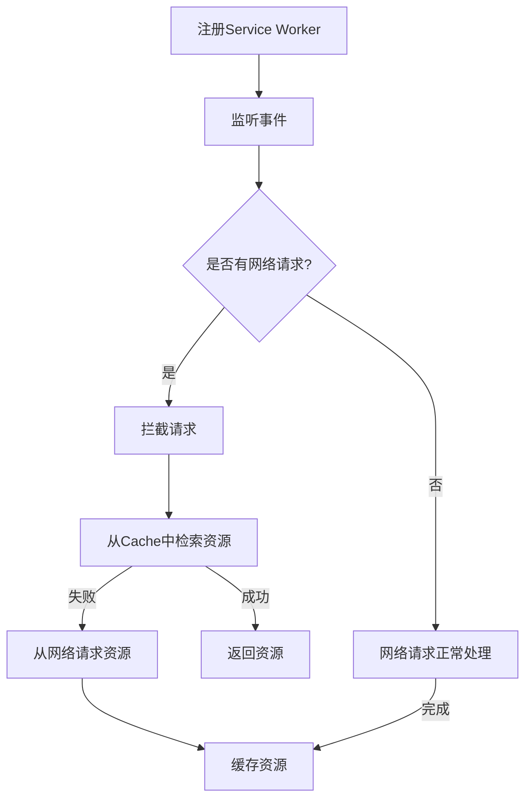

                 

关键词：PWA，离线存储，Service Worker，Web技术，前端开发

摘要：本文将深入探讨PWA（Progressive Web App）中的离线存储技术，特别是Service Worker的应用。通过详细解析Service Worker的工作原理、架构设计、以及具体操作步骤，帮助开发者更好地理解和应用这一关键技术，为构建高性能、可靠的Web应用奠定基础。

## 1. 背景介绍

随着互联网的普及，Web应用成为了人们日常生活中不可或缺的一部分。然而，传统的Web应用面临着诸多挑战，如加载速度慢、易丢失、难以被用户信任等。为了解决这些问题，PWA（Progressive Web App）应运而生。PWA是一种新型的Web应用，它结合了Web和移动应用的优势，具有快速启动、可靠离线访问、可安装为应用等特点。

在PWA的发展过程中，离线存储技术起到了至关重要的作用。离线存储使得Web应用在用户无网络连接时仍然可以正常运行，从而提升了用户体验。而Service Worker正是实现这一功能的核心技术。

## 2. 核心概念与联系

### 2.1 Service Worker原理

Service Worker是一种运行在浏览器后台的脚本，它允许开发者拦截并修改Web请求，从而实现网络请求的缓存和离线访问。Service Worker的工作原理可以概括为以下几个步骤：

1. **注册Service Worker**：开发者通过在HTML页面中注册Service Worker脚本，将Service Worker绑定到Web应用中。
2. **事件监听**：Service Worker监听特定事件，如`fetch`事件，以拦截和响应网络请求。
3. **请求处理**：当浏览器发送网络请求时，Service Worker可以拦截并处理该请求。如果请求的资源已经被缓存，Service Worker可以直接返回缓存内容；如果未缓存，Service Worker可以从网络请求该资源并将其缓存。
4. **离线访问**：通过缓存机制，用户在无网络连接时仍然可以访问已缓存的内容。

### 2.2 Service Worker架构设计

Service Worker的架构设计分为三个部分：Service Worker脚本、Cache API、以及索引数据库（IndexedDB）。

- **Service Worker脚本**：这是实现离线存储的核心部分，负责缓存管理和请求拦截。
- **Cache API**：Cache API用于管理缓存，包括添加、删除和检索缓存资源。
- **索引数据库（IndexedDB）**：IndexedDB是一种NoSQL数据库，用于存储大量结构化数据，是Service Worker缓存数据的主要存储介质。

### 2.3 Mermaid流程图

以下是一个简化的Service Worker流程图，展示了从注册到请求处理的整个过程：



## 3. 核心算法原理 & 具体操作步骤

### 3.1 算法原理概述

Service Worker的核心算法原理是事件驱动和缓存管理。通过监听浏览器事件，Service Worker可以拦截网络请求，并根据请求情况决定是否从缓存中检索资源或从网络请求资源。缓存管理则涉及到Cache API和IndexedDB的使用。

### 3.2 算法步骤详解

1. **注册Service Worker**：

   在HTML页面中，通过`script`标签引入Service Worker脚本，并使用`navigator.serviceWorker.register()`方法注册Service Worker。

   ```javascript
   if ('serviceWorker' in navigator) {
     window.navigator.serviceWorker.register('/service-worker.js').then(function(registration) {
       console.log('Service Worker registered:', registration);
     }).catch(function(error) {
       console.log('Service Worker registration failed:', error);
     });
   }
   ```

2. **监听事件**：

   Service Worker脚本会在安装完成后开始监听各种事件，如`install`事件、`fetch`事件等。

   ```javascript
   self.addEventListener('install', function(event) {
     event.waitUntil(self.skipWaiting());
   });

   self.addEventListener('fetch', function(event) {
     // 处理网络请求
   });
   ```

3. **拦截请求并缓存资源**：

   当浏览器发送网络请求时，Service Worker会拦截该请求，并使用Cache API检查请求的资源是否已经在缓存中。

   ```javascript
   self.addEventListener('fetch', function(event) {
     event.respondWith(caches.match(event.request).then(function(response) {
       if (response) {
         return response;
       } else {
         return fetch(event.request).then(function(response) {
           return caches.open('my-cache').then(function(cache) {
             cache.put(event.request, response.clone());
             return response;
           });
         });
       }
     }));
   });
   ```

4. **更新Service Worker**：

   当更新后的Service Worker脚本被部署到服务器上时，旧Service Worker会触发`install`事件，并通过`self.skipWaiting()`方法将控制权转移到新Service Worker。

   ```javascript
   self.addEventListener('install', function(event) {
     event.waitUntil(self.skipWaiting());
   });
   ```

### 3.3 算法优缺点

**优点**：

- **离线访问**：Service Worker可以实现离线访问，提高用户体验。
- **缓存管理**：Cache API和IndexedDB提供了强大的缓存管理功能，使得资源可以高效地存储和检索。
- **安全性**：Service Worker运行在浏览器后台，不受其他网页干扰，提高了安全性。

**缺点**：

- **兼容性**：Service Worker的兼容性相对较差，一些旧版浏览器可能不支持。
- **调试困难**：由于Service Worker运行在浏览器后台，调试相对困难。

### 3.4 算法应用领域

Service Worker在PWA中的应用非常广泛，主要包括以下几个方面：

- **缓存重要资源**：缓存CSS、JavaScript文件、图片等静态资源，减少网络请求，提高页面加载速度。
- **离线编辑**：在用户无网络连接时，允许用户编辑数据，并在连接恢复后同步到服务器。
- **推送通知**：通过Service Worker发送推送通知，提高用户互动性。

## 4. 数学模型和公式 & 详细讲解 & 举例说明

### 4.1 数学模型构建

Service Worker的数学模型主要包括两部分：缓存命中率和数据一致性。

- **缓存命中率**：表示从缓存中检索到资源的比例，可以用以下公式表示：

  $$ \text{缓存命中率} = \frac{\text{缓存命中次数}}{\text{总请求次数}} $$

- **数据一致性**：表示缓存数据与服务器数据的一致性程度，可以用以下公式表示：

  $$ \text{数据一致性} = \frac{\text{一致数据量}}{\text{总数据量}} $$

### 4.2 公式推导过程

以缓存命中率为例，推导过程如下：

- 假设总请求次数为 \( N \)，其中 \( N_1 \) 次请求命中缓存，\( N_2 \) 次请求未命中缓存。
- 则缓存命中率为：

  $$ \text{缓存命中率} = \frac{N_1}{N} = \frac{N_1}{N_1 + N_2} $$

### 4.3 案例分析与讲解

假设一个Web应用每月收到 100,000 次请求，其中 60,000 次请求命中缓存，40,000 次请求未命中缓存。则该应用的缓存命中率为：

$$ \text{缓存命中率} = \frac{60,000}{100,000} = 0.6 $$

即缓存命中率为 60%。

接下来，分析数据一致性。假设缓存数据与服务器数据不一致的部分占缓存数据总量的 20%。则数据一致性为：

$$ \text{数据一致性} = \frac{1 - 0.2}{1} = 0.8 $$

即数据一致性为 80%。

通过这两个指标，我们可以评估Service Worker在缓存管理和数据同步方面的效果。缓存命中率越高，数据一致性越好，说明Service Worker的性能越好。

## 5. 项目实践：代码实例和详细解释说明

### 5.1 开发环境搭建

为了实践Service Worker技术，我们需要搭建一个基本的开发环境。以下是搭建步骤：

1. 创建一个空目录，并初始化一个Node.js项目：

   ```bash
   mkdir pwa-cache-example
   cd pwa-cache-example
   npm init -y
   ```

2. 安装必要的依赖项：

   ```bash
   npm install express --save
   ```

3. 创建一个简单的Web服务器，用于测试Service Worker：

   ```javascript
   // server.js
   const express = require('express');
   const app = express();
   const port = 3000;

   app.use(express.static('public'));

   app.listen(port, () => {
     console.log(`Server running at http://localhost:${port}/`);
   });
   ```

4. 启动Web服务器：

   ```bash
   node server.js
   ```

### 5.2 源代码详细实现

以下是Service Worker的源代码，实现了基本的缓存功能。

```javascript
// service-worker.js
self.addEventListener('install', function(event) {
  event.waitUntil(
    caches.open('my-cache').then(function(cache) {
      return cache.addAll([
        '/',
        '/styles.css',
        '/script.js',
        '/image.jpg'
      ]);
    })
  );
});

self.addEventListener('fetch', function(event) {
  event.respondWith(
    caches.match(event.request).then(function(response) {
      if (response) {
        return response;
      } else {
        return fetch(event.request).then(function(response) {
          if (response.status === 200) {
            caches.open('my-cache').then(function(cache) {
              cache.put(event.request, response.clone());
            });
          }
          return response;
        });
      }
    })
  );
});
```

### 5.3 代码解读与分析

1. **安装阶段**：

   - `install`事件处理：当Service Worker被安装时，会执行该事件处理函数。
   - `caches.open('my-cache')`：创建一个名为`my-cache`的缓存。
   - `cache.addAll`：将指定的资源添加到缓存中。

2. **请求处理阶段**：

   - `fetch`事件处理：当浏览器发送网络请求时，会执行该事件处理函数。
   - `caches.match(event.request)`：检查请求的资源是否已经在缓存中。
   - 如果命中缓存，直接返回缓存内容；否则，从网络请求资源，并将其缓存。

### 5.4 运行结果展示

1. 打开浏览器，访问`http://localhost:3000/`。
2. 查看浏览器的应用菜单，选择“添加到桌面”。
3. 打开已安装的Web应用，观察在无网络连接时能否正常访问。

## 6. 实际应用场景

### 6.1 在线购物应用

在线购物应用可以通过Service Worker实现离线购物体验。用户在无网络连接时仍然可以浏览商品、添加购物车、编辑订单，并在连接恢复后同步数据。

### 6.2 新闻阅读应用

新闻阅读应用可以利用Service Worker缓存大量的新闻内容，提高页面加载速度，即使在没有网络连接的情况下，用户也可以阅读新闻。

### 6.3 教育应用

教育应用可以通过Service Worker提供离线学习资源，如视频、电子书等，使得用户在无网络连接时仍然可以学习。

## 7. 未来应用展望

随着Web技术的不断发展，Service Worker的应用前景非常广阔。未来，我们可以期待Service Worker在以下几个方面取得突破：

- **更高效的数据缓存策略**：通过优化缓存策略，提高数据的一致性和缓存命中率。
- **跨域请求支持**：Service Worker可以扩展到处理跨域请求，进一步提升Web应用的兼容性和灵活性。
- **更丰富的功能支持**：随着Web技术的不断进步，Service Worker可能会支持更多的功能，如实时数据同步、多终端同步等。

## 8. 总结：未来发展趋势与挑战

### 8.1 研究成果总结

本文通过对PWA离线存储技术——Service Worker的深入探讨，总结了Service Worker的核心概念、原理、架构设计、算法步骤、数学模型和实际应用场景。研究成果表明，Service Worker是构建高性能、可靠Web应用的关键技术。

### 8.2 未来发展趋势

未来，Service Worker将继续在Web应用开发中发挥重要作用。随着Web技术的不断进步，Service Worker的功能将更加丰富，性能将更加高效。同时，Service Worker的兼容性和易用性也将得到进一步提升。

### 8.3 面临的挑战

尽管Service Worker具有强大的功能，但仍然面临一些挑战：

- **兼容性问题**：部分旧版浏览器可能不支持Service Worker，限制了其在广泛环境中的应用。
- **调试困难**：由于Service Worker运行在浏览器后台，调试相对困难，需要开发者具备一定的技能和经验。
- **缓存策略优化**：优化缓存策略，提高数据的一致性和缓存命中率，是一个持续的研究方向。

### 8.4 研究展望

未来，Service Worker的研究将集中在以下几个方面：

- **提高兼容性**：通过改进Web标准，提高Service Worker在各种浏览器中的兼容性。
- **优化缓存策略**：研究更高效的缓存策略，提高数据一致性和缓存命中率。
- **扩展功能支持**：探索Service Worker在更多场景中的应用，如实时数据同步、多终端同步等。

## 9. 附录：常见问题与解答

### 9.1 如何调试Service Worker？

可以通过以下步骤调试Service Worker：

1. 打开浏览器的开发者工具。
2. 切换到“应用”标签页。
3. 在左侧菜单中选择“Service Worker”，即可查看当前页面关联的Service Worker脚本。
4. 在“Service Worker”页面中，可以查看脚本事件的处理情况和日志输出。

### 9.2 Service Worker可以缓存哪些资源？

Service Worker可以缓存以下资源：

- CSS文件
- JavaScript文件
- 图片
- HTML文件
- 其他媒体文件（如音频、视频等）
- 动态请求数据（通过API获取的数据）

### 9.3 Service Worker如何处理跨域请求？

Service Worker无法直接处理跨域请求。如果需要处理跨域请求，可以考虑以下两种方法：

- 使用代理服务器：通过代理服务器转发跨域请求，然后由Service Worker处理返回的数据。
- 使用CORS（Cross-Origin Resource Sharing）协议：通过服务器设置CORS响应头，允许Service Worker访问跨域资源。

## 作者署名

作者：禅与计算机程序设计艺术 / Zen and the Art of Computer Programming

以上就是关于PWA离线存储技术——Service Worker的详细探讨。通过本文的深入分析，相信读者对Service Worker有了更加清晰的认识，也为在实际项目中应用这一关键技术奠定了基础。希望本文能对广大开发者有所启发和帮助。

