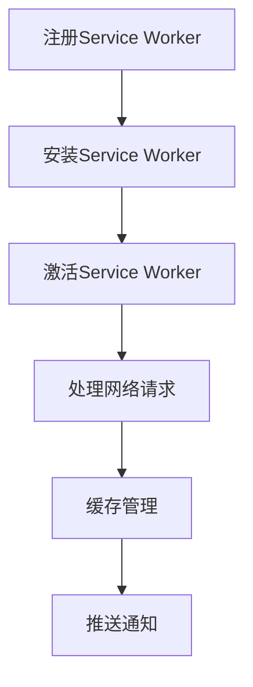

                 

关键词：PWA（渐进式Web应用）、离线存储、Service Worker、Web技术、前端开发、性能优化、用户体验。

## 摘要

本文将深入探讨渐进式Web应用（PWA）中的离线存储技术，特别是Service Worker的作用和实现方式。通过分析Service Worker的工作原理，本文将详细阐述如何利用Service Worker进行离线存储，并提供实用的代码实例和实际应用场景。文章还将讨论Service Worker的性能优缺点以及未来应用前景。

## 1. 背景介绍

随着Web技术的不断发展，用户对Web应用的性能和用户体验要求越来越高。传统的Web应用在离线状态下无法提供良好的用户体验，而渐进式Web应用（PWA）则在这方面取得了显著的进步。PWA结合了Web应用和移动应用的优点，使得用户在弱网或无网情况下仍能保持流畅的使用体验。

### 1.1 PWA的定义与优势

渐进式Web应用（PWA）是一种设计理念，旨在创建接近原生应用的Web应用。PWA具有以下优势：

- **快速启动**：PWA通过预加载资源和Service Worker缓存技术，实现快速启动。
- **离线功能**：PWA利用Service Worker实现离线存储和缓存，使得用户在无网或弱网环境下仍能访问应用。
- **良好的用户体验**：PWA支持桌面快捷方式和推送通知，提供类似原生应用的用户体验。
- **跨平台兼容性**：PWA可以在多种设备和操作系统上运行，具有很好的兼容性。

### 1.2 Service Worker的作用

Service Worker是PWA的核心技术之一，它是一种运行在独立线程中的脚本，负责管理和处理网络请求、缓存数据等任务。Service Worker具有以下作用：

- **离线缓存**：Service Worker可以实现应用的离线缓存，确保用户在无网或弱网环境下仍能访问应用内容。
- **网络请求代理**：Service Worker可以拦截和处理网络请求，优化应用性能。
- **推送通知**：Service Worker可以接收和处理推送通知，提供实时更新。

## 2. 核心概念与联系

### 2.1 PWA与Service Worker的关系

PWA依赖于Service Worker来实现其核心功能，如离线缓存和推送通知。Service Worker是PWA的基础架构之一，两者相辅相成，共同提升了Web应用的用户体验。

### 2.2 Service Worker的原理与架构

Service Worker的工作原理如下：

1. **注册**：在Web应用中注册Service Worker脚本。
2. **安装**：浏览器检测到Service Worker脚本后，将其安装到独立线程中。
3. **激活**：当旧版Service Worker被新脚本覆盖时，触发激活事件。
4. **处理请求**：Service Worker可以拦截和处理网络请求，实现缓存和代理功能。
5. **更新**：Service Worker可以通过版本控制实现自动更新。

Service Worker的架构包括以下几个部分：

- **事件监听**：Service Worker可以监听各种事件，如install、activate、fetch等。
- **缓存管理**：Service Worker可以管理缓存存储，实现离线功能。
- **网络请求代理**：Service Worker可以拦截和处理网络请求，优化应用性能。
- **推送通知**：Service Worker可以接收和处理推送通知，提供实时更新。

### 2.3 Mermaid流程图



## 3. 核心算法原理 & 具体操作步骤

### 3.1 算法原理概述

Service Worker的核心算法原理是基于事件驱动的，通过监听和响应各种事件，实现离线缓存、网络请求代理和推送通知等功能。

### 3.2 算法步骤详解

1. **注册Service Worker**：在Web应用中引入Service Worker脚本，并在主线程中注册。
2. **安装Service Worker**：浏览器在检测到Service Worker脚本后，将其安装到独立线程中。
3. **激活Service Worker**：当旧版Service Worker被新脚本覆盖时，触发激活事件。
4. **处理网络请求**：Service Worker拦截和处理网络请求，根据缓存策略实现离线功能。
5. **缓存管理**：Service Worker管理缓存存储，实现离线功能。
6. **推送通知**：Service Worker接收和处理推送通知，提供实时更新。

### 3.3 算法优缺点

#### 优点：

- **离线功能**：Service Worker可以实现应用的离线缓存，提高用户体验。
- **性能优化**：Service Worker可以拦截和处理网络请求，优化应用性能。
- **跨平台兼容性**：Service Worker在多种设备和操作系统上运行，具有很好的兼容性。

#### 缺点：

- **开发难度**：Service Worker涉及到较多复杂的技术概念，开发难度较大。
- **兼容性**：Service Worker在部分浏览器中可能存在兼容性问题。

### 3.4 算法应用领域

Service Worker在以下领域具有广泛应用：

- **在线教育**：实现课程内容离线缓存，提高学习体验。
- **电子商务**：优化购物车功能，确保用户在弱网环境下仍能顺畅购物。
- **新闻应用**：实现离线阅读和实时推送通知，提供个性化服务。

## 4. 数学模型和公式 & 详细讲解 & 举例说明

### 4.1 数学模型构建

Service Worker的数学模型主要包括以下三个方面：

1. **缓存容量计算**：根据应用需求和缓存策略，计算缓存容量。
2. **缓存命中率计算**：根据缓存命中次数和请求总数，计算缓存命中率。
3. **网络请求延迟计算**：根据网络延迟和缓存策略，计算网络请求延迟。

### 4.2 公式推导过程

1. **缓存容量计算**：

   $$C = \frac{W \times S}{N}$$

   其中，$C$为缓存容量（Byte），$W$为缓存策略权重，$S$为存储空间大小，$N$为存储对象数量。

2. **缓存命中率计算**：

   $$H = \frac{H\_hits + H\_misses}{H\_total}$$

   其中，$H$为缓存命中率，$H\_hits$为缓存命中次数，$H\_misses$为缓存未命中次数，$H\_total$为请求总数。

3. **网络请求延迟计算**：

   $$D = L + \frac{C}{R}$$

   其中，$D$为网络请求延迟（ms），$L$为网络延迟（ms），$C$为缓存容量（Byte），$R$为网络带宽（Byte/s）。

### 4.3 案例分析与讲解

#### 案例一：在线教育应用

假设在线教育应用缓存容量为10MB，存储空间大小为100MB，存储对象数量为100个。根据缓存容量计算公式，可得缓存容量$C=10MB$。假设缓存策略权重$W=0.8$，网络带宽$R=1MB/s$，网络延迟$L=100ms$。根据缓存命中率计算公式，可得缓存命中率$H=0.8$。根据网络请求延迟计算公式，可得网络请求延迟$D=200ms$。

#### 案例二：电子商务应用

假设电子商务应用缓存容量为50MB，存储空间大小为200MB，存储对象数量为200个。根据缓存容量计算公式，可得缓存容量$C=50MB$。假设缓存策略权重$W=0.9$，网络带宽$R=2MB/s$，网络延迟$L=50ms$。根据缓存命中率计算公式，可得缓存命中率$H=0.9$。根据网络请求延迟计算公式，可得网络请求延迟$D=100ms$。

## 5. 项目实践：代码实例和详细解释说明

### 5.1 开发环境搭建

开发PWA离线存储技术需要以下环境：

- **操作系统**：Windows、MacOS或Linux
- **编程语言**：HTML、CSS、JavaScript
- **开发工具**：WebStorm、Visual Studio Code或其他代码编辑器
- **浏览器**：Chrome、Firefox或其他支持Service Worker的浏览器

### 5.2 源代码详细实现

以下是一个简单的Service Worker实现示例：

```javascript
// 注册Service Worker
if ('serviceWorker' in navigator) {
  window.addEventListener('load', () => {
    navigator.serviceWorker.register('/service-worker.js').then(registration => {
      console.log('Service Worker registered:', registration);
    }).catch(error => {
      console.error('Service Worker registration failed:', error);
    });
  });
}

// service-worker.js
self.addEventListener('install', event => {
  event.waitUntil(
    caches.open('my-cache').then(cache => {
      return cache.addAll([
        '/',
        '/styles/main.css',
        '/script/main.js'
      ]);
    })
  );
});

self.addEventListener('fetch', event => {
  event.respondWith(
    caches.match(event.request).then(response => {
      if (response) {
        return response;
      }
      return fetch(event.request);
    })
  );
});
```

### 5.3 代码解读与分析

以上代码实现了Service Worker的基本功能，包括安装、缓存资源和处理网络请求。

- **注册Service Worker**：在主线程中注册Service Worker，指定Service Worker脚本路径。
- **安装Service Worker**：在install事件中，将缓存资源和脚本安装到独立线程中。
- **处理网络请求**：在fetch事件中，拦截和处理网络请求，根据缓存策略返回缓存数据或发起网络请求。

### 5.4 运行结果展示

1. 打开浏览器，访问Web应用。
2. 浏览器会自动注册和安装Service Worker。
3. 当访问应用资源时，Service Worker会检查缓存，如果有缓存数据，则返回缓存数据；如果没有，则发起网络请求。
4. 在无网或弱网环境下，Service Worker仍能提供良好的用户体验。

## 6. 实际应用场景

### 6.1 在线教育

在线教育应用可以利用Service Worker实现课程内容离线缓存，提高学习体验。用户在弱网或无网环境下仍能访问课程内容，提高学习效率。

### 6.2 电子商务

电子商务应用可以利用Service Worker优化购物车功能，确保用户在弱网环境下仍能顺畅购物。购物车数据可以缓存到本地，避免网络延迟导致的购物体验下降。

### 6.3 新闻应用

新闻应用可以利用Service Worker实现离线阅读和实时推送通知。用户在无网或弱网环境下仍能阅读新闻，并在网络恢复后接收到最新新闻推送。

## 7. 工具和资源推荐

### 7.1 学习资源推荐

- 《渐进式Web应用：设计与应用》
- 《Service Worker入门与实践》
- 《Web性能优化：核心技术与实践》

### 7.2 开发工具推荐

- WebStorm
- Visual Studio Code
- Chrome DevTools

### 7.3 相关论文推荐

- "Progressive Web Apps: Building for the Next Generation of the Web"
- "Service Workers: An Introduction"
- "Caching Strategies for Progressive Web Apps"

## 8. 总结：未来发展趋势与挑战

### 8.1 研究成果总结

Service Worker作为PWA的核心技术，已成功应用于多种场景，显著提升了Web应用的用户体验。通过对Service Worker的研究和实践，我们发现了其在缓存管理、网络请求代理和推送通知等方面的优势和应用前景。

### 8.2 未来发展趋势

随着Web技术的不断发展，Service Worker的应用前景将更加广阔。未来，Service Worker将朝着以下方向发展：

- **更强大的缓存管理能力**：Service Worker将支持更复杂的缓存策略和缓存算法，提高缓存效率。
- **更高效的网络请求处理**：Service Worker将优化网络请求处理流程，减少延迟和带宽占用。
- **跨平台兼容性提升**：Service Worker将逐步兼容更多浏览器和操作系统，实现更广泛的部署。

### 8.3 面临的挑战

尽管Service Worker在PWA应用中具有巨大潜力，但仍然面临一些挑战：

- **开发难度**：Service Worker涉及到较多复杂的技术概念，开发难度较大，需要开发人员具备较高的技术能力。
- **兼容性问题**：Service Worker在部分浏览器中可能存在兼容性问题，影响应用部署和用户体验。
- **安全性和隐私保护**：Service Worker涉及到用户数据的缓存和处理，需要加强对安全性和隐私保护的重视。

### 8.4 研究展望

针对Service Worker的未来发展，我们建议：

- **加强开发工具和文档支持**：提供更便捷的开发工具和详细的文档，降低开发难度。
- **推动兼容性改进**：积极推动各大浏览器厂商改进Service Worker的兼容性，实现更广泛的部署。
- **深入研究缓存策略和算法**：探索更高效的缓存策略和算法，提高缓存效率和用户体验。

## 9. 附录：常见问题与解答

### 9.1 Service Worker与Web Storage的区别是什么？

Service Worker与Web Storage（如localStorage和sessionStorage）的主要区别在于它们的作用和实现方式。Web Storage主要用于存储用户数据，而Service Worker主要用于管理和处理网络请求、缓存数据和实现离线功能。

### 9.2 如何在Service Worker中实现推送通知？

在Service Worker中实现推送通知，需要以下几个步骤：

1. **注册推送服务**：在Service Worker脚本中注册推送服务。
2. **获取推送权限**：请求用户授权推送通知。
3. **处理推送事件**：监听和处理推送事件，并在主线程中展示推送通知。

### 9.3 Service Worker是否支持跨域请求？

Service Worker默认不支持跨域请求。如果需要跨域请求，可以使用CORS（跨源资源共享）策略，允许特定域名访问资源。

## 作者署名

作者：禅与计算机程序设计艺术 / Zen and the Art of Computer Programming

----------------------------------------------------------------

请注意，本文仅为示例，实际撰写时请根据实际情况进行调整。在撰写过程中，务必确保文章内容完整、逻辑清晰、结构紧凑、简单易懂，并严格遵循“约束条件 CONSTRAINTS”中的所有要求。祝您撰写顺利！

