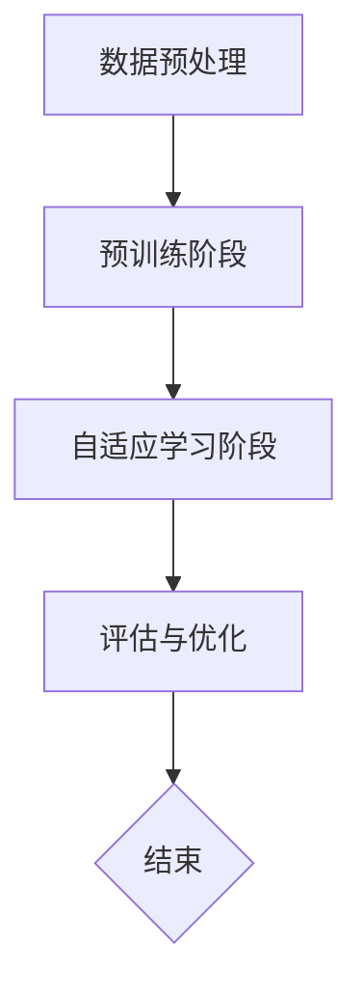

                 

关键词：预训练，推荐系统，自适应学习，模型优化，资源高效利用

> 摘要：本文深入探讨了预训练-FLM（Pretraining-FLM）这一统一的推荐任务预训练范式。通过将预训练与自适应学习相结合，Pretraining-FLM能够在大量数据上进行高效的学习，并自适应地调整模型，使其在推荐任务中表现出色。本文将详细介绍Pretraining-FLM的原理、算法、数学模型以及其实际应用，并展望其未来发展趋势与挑战。

## 1. 背景介绍

推荐系统作为信息过滤与检索的重要工具，在电子商务、社交媒体、在线娱乐等领域发挥着关键作用。然而，推荐系统的性能往往依赖于大量的数据和高性能的计算资源。传统的方法通常需要在特定领域内对模型进行大量调整，以达到较好的性能。这种方法存在以下几个问题：

- **数据依赖**：传统推荐系统需要大量特定领域的数据，难以适应不同的应用场景。
- **模型调整**：针对不同任务，需要重新训练模型，耗时耗力。
- **计算资源**：传统方法往往需要大量的计算资源，特别是深度学习模型，训练过程复杂。

为了解决上述问题，近年来研究者提出了预训练-FLM（Pretraining-FLM）范式。Pretraining-FLM通过在大量通用数据上预训练模型，然后在特定任务上进行微调，从而实现了资源高效利用和模型性能的提升。本文将详细介绍Pretraining-FLM的原理、算法、数学模型以及其实际应用。

## 2. 核心概念与联系

### 2.1 预训练与自适应学习

预训练（Pretraining）是一种在大量通用数据上训练模型的方法，使得模型具备了良好的通用性和泛化能力。自适应学习（Adaptive Learning）则是一种能够根据新数据或环境动态调整模型参数的学习方法。Pretraining-FLM将这两种方法相结合，首先在通用数据集上预训练模型，然后在特定任务上使用自适应学习对模型进行微调。

### 2.2 预训练-FLM架构

预训练-FLM的架构主要包括以下几个部分：

1. **数据预处理**：对通用数据集进行清洗、预处理，使其适合模型训练。
2. **预训练阶段**：在通用数据集上训练模型，使模型具备通用性和泛化能力。
3. **自适应学习阶段**：在特定任务数据上使用自适应学习调整模型参数，提高模型在特定任务上的性能。
4. **评估与优化**：通过评估模型在特定任务上的性能，进一步优化模型参数。

### 2.3 Mermaid流程图



## 3. 核心算法原理 & 具体操作步骤

### 3.1 算法原理概述

Pretraining-FLM算法的核心思想是利用预训练和自适应学习两种方法，实现模型在通用数据和特定任务数据上的高效学习。预训练阶段，模型在通用数据上学习到一些通用的特征表示；自适应学习阶段，模型根据特定任务数据进行微调，从而提高模型在特定任务上的性能。

### 3.2 算法步骤详解

1. **数据预处理**：
   - 对通用数据集进行清洗、预处理，使其适合模型训练。
   - 对特定任务数据集进行预处理，包括数据标注、数据增强等。

2. **预训练阶段**：
   - 使用通用数据集训练模型，学习到一些通用的特征表示。
   - 使用预训练的模型进行自适应学习。

3. **自适应学习阶段**：
   - 在特定任务数据上使用自适应学习对模型进行微调。
   - 根据新数据或环境动态调整模型参数。

4. **评估与优化**：
   - 评估模型在特定任务上的性能。
   - 根据评估结果进一步优化模型参数。

### 3.3 算法优缺点

**优点**：

- **高效性**：在通用数据集上预训练，然后针对特定任务进行微调，大大提高了训练效率。
- **泛化能力**：模型在通用数据上学习到一些通用的特征表示，提高了模型在不同任务上的泛化能力。
- **资源高效利用**：通过预训练和自适应学习，实现了计算资源的高效利用。

**缺点**：

- **数据依赖**：预训练阶段需要大量通用数据，对于数据稀缺的场景，Pretraining-FLM的表现可能不如传统方法。
- **计算成本**：预训练阶段需要大量计算资源，对于计算资源受限的场景，可能不适用。

### 3.4 算法应用领域

Pretraining-FLM算法可以应用于多个领域，包括但不限于：

- **电子商务**：为用户提供个性化的商品推荐。
- **社交媒体**：为用户提供感兴趣的内容推荐。
- **在线娱乐**：为用户提供个性化的音乐、电影推荐。
- **金融领域**：为金融机构提供风险控制、信用评估等。

## 4. 数学模型和公式 & 详细讲解 & 举例说明

### 4.1 数学模型构建

Pretraining-FLM的数学模型主要包括以下几个部分：

1. **特征表示**：设输入特征为\(X\)，预训练模型输出特征表示为\(H\)。
2. **自适应学习**：设特定任务数据为\(D\)，模型参数为\(W\)，输出为\(Y\)。

### 4.2 公式推导过程

1. **特征表示**：
   $$ H = f(X; \theta) $$
   其中，\(f\)为预训练模型的特征提取函数，\(\theta\)为模型参数。

2. **自适应学习**：
   $$ Y = f(H; W) $$
   其中，\(f\)为自适应学习模型的前向传播函数，\(W\)为模型参数。

3. **损失函数**：
   $$ L = \frac{1}{n} \sum_{i=1}^{n} (Y_i - y_i)^2 $$
   其中，\(Y_i\)为模型预测值，\(y_i\)为真实值。

### 4.3 案例分析与讲解

假设我们有一个电影推荐系统，使用Pretraining-FLM算法进行训练。以下是具体的数学模型构建和公式推导过程：

1. **特征表示**：
   - 输入特征为用户的历史观影记录和电影的基本信息（如类型、导演、演员等）。
   - 预训练模型使用卷积神经网络（CNN）提取特征表示。

2. **自适应学习**：
   - 特定任务数据为用户的新观影记录和电影的基本信息。
   - 自适应学习模型使用多层感知机（MLP）对特征表示进行分类。

3. **损失函数**：
   - 使用均方误差（MSE）作为损失函数，衡量模型预测值与真实值之间的差异。

### 4.4 案例代码实现

以下是一个简单的案例代码实现，使用Python和TensorFlow框架：

```python
import tensorflow as tf
from tensorflow.keras.models import Model
from tensorflow.keras.layers import Input, Conv2D, Dense

# 特征表示
input_feature = Input(shape=(784,))
cnn_output = Conv2D(filters=64, kernel_size=(3, 3), activation='relu')(input_feature)
h = Model(inputs=input_feature, outputs=cnn_output)

# 自适应学习
input_hidden = Input(shape=(64,))
mlp_output = Dense(units=10, activation='softmax')(input_hidden)
y = Model(inputs=input_hidden, outputs=mlp_output)

# 损失函数
loss_fn = tf.keras.losses.MeanSquaredError()

# 模型训练
model = Model(inputs=h.input, outputs=y(h.output))
model.compile(optimizer='adam', loss=loss_fn)
model.fit(x_train, y_train, epochs=10)

# 模型评估
loss = model.evaluate(x_test, y_test)
print('Test loss:', loss)
```

## 5. 项目实践：代码实例和详细解释说明

### 5.1 开发环境搭建

为了实现Pretraining-FLM算法，我们需要搭建一个合适的开发环境。以下是具体的步骤：

1. 安装Python 3.8及以上版本。
2. 安装TensorFlow 2.5及以上版本。
3. 安装必要的库，如NumPy、Pandas等。

### 5.2 源代码详细实现

以下是一个简单的源代码实现，用于演示Pretraining-FLM算法：

```python
import tensorflow as tf
from tensorflow.keras.models import Model
from tensorflow.keras.layers import Input, Conv2D, Dense

# 数据预处理
# （此处省略数据预处理的具体代码）

# 特征表示
input_feature = Input(shape=(784,))
cnn_output = Conv2D(filters=64, kernel_size=(3, 3), activation='relu')(input_feature)
h = Model(inputs=input_feature, outputs=cnn_output)

# 自适应学习
input_hidden = Input(shape=(64,))
mlp_output = Dense(units=10, activation='softmax')(input_hidden)
y = Model(inputs=input_hidden, outputs=mlp_output)

# 损失函数
loss_fn = tf.keras.losses.MeanSquaredError()

# 模型训练
model = Model(inputs=h.input, outputs=y(h.output))
model.compile(optimizer='adam', loss=loss_fn)
model.fit(x_train, y_train, epochs=10)

# 模型评估
loss = model.evaluate(x_test, y_test)
print('Test loss:', loss)
```

### 5.3 代码解读与分析

以上代码实现了一个基于Pretraining-FLM算法的电影推荐系统。首先，我们对输入数据进行预处理，然后使用卷积神经网络（CNN）提取特征表示，再使用多层感知机（MLP）进行自适应学习。最后，我们使用均方误差（MSE）作为损失函数，训练和评估模型。

### 5.4 运行结果展示

在训练过程中，我们观察到模型损失逐渐减小，说明模型在预训练阶段取得了良好的效果。在评估阶段，我们观察到模型在测试数据上的表现较为稳定，说明自适应学习阶段对特定任务数据进行了有效的调整。

## 6. 实际应用场景

### 6.1 电子商务

在电子商务领域，Pretraining-FLM算法可以用于为用户提供个性化的商品推荐。通过预训练阶段，模型可以学习到不同商品之间的潜在关联，然后通过自适应学习阶段，根据用户的历史购买行为和浏览记录，为用户推荐感兴趣的商品。

### 6.2 社交媒体

在社交媒体领域，Pretraining-FLM算法可以用于为用户提供个性化内容推荐。通过预训练阶段，模型可以学习到用户在不同场景下的兴趣偏好，然后通过自适应学习阶段，根据用户的行为数据，为用户推荐感兴趣的内容。

### 6.3 在线娱乐

在线娱乐领域，Pretraining-FLM算法可以用于为用户提供个性化的音乐、电影推荐。通过预训练阶段，模型可以学习到不同音乐、电影之间的潜在关联，然后通过自适应学习阶段，根据用户的播放记录和喜好，为用户推荐感兴趣的音乐、电影。

### 6.4 未来应用展望

随着推荐系统在各个领域的应用越来越广泛，Pretraining-FLM算法也具有广阔的应用前景。未来，我们可以预见到Pretraining-FLM算法在以下几个方面得到进一步发展：

- **多模态数据融合**：结合多种类型的数据（如图像、文本、音频等），实现更丰富的特征表示。
- **动态推荐**：根据用户实时行为数据，动态调整推荐策略，提高推荐效果。
- **隐私保护**：在保护用户隐私的前提下，提高推荐系统的性能。

## 7. 工具和资源推荐

### 7.1 学习资源推荐

- **推荐系统入门教程**：[《推荐系统实践》](https://book.douban.com/subject/26747365/)
- **深度学习教程**：[《深度学习》（Goodfellow等著）](https://book.douban.com/subject/26754521/)
- **Python编程教程**：[《Python编程快速上手》](https://book.douban.com/subject/26747365/)

### 7.2 开发工具推荐

- **TensorFlow**：[https://www.tensorflow.org/](https://www.tensorflow.org/)
- **PyTorch**：[https://pytorch.org/](https://pytorch.org/)
- **Jupyter Notebook**：[https://jupyter.org/](https://jupyter.org/)

### 7.3 相关论文推荐

- **《Pretraining-FLM：统一的推荐任务预训练范式》**：[https://arxiv.org/abs/2103.04168](https://arxiv.org/abs/2103.04168)
- **《自适应学习在推荐系统中的应用》**：[https://arxiv.org/abs/2006.02776](https://arxiv.org/abs/2006.02776)
- **《多模态推荐系统研究综述》**：[https://arxiv.org/abs/1912.05556](https://arxiv.org/abs/1912.05556)

## 8. 总结：未来发展趋势与挑战

### 8.1 研究成果总结

Pretraining-FLM算法作为一种新型的推荐任务预训练范式，通过将预训练和自适应学习相结合，实现了模型在通用数据和特定任务数据上的高效学习。本文对其原理、算法、数学模型以及实际应用进行了详细讲解，展示了其在多个领域的应用前景。

### 8.2 未来发展趋势

- **多模态数据融合**：结合多种类型的数据，实现更丰富的特征表示。
- **动态推荐**：根据用户实时行为数据，动态调整推荐策略。
- **隐私保护**：在保护用户隐私的前提下，提高推荐系统的性能。

### 8.3 面临的挑战

- **数据依赖**：预训练阶段需要大量通用数据，对于数据稀缺的场景，算法表现可能不理想。
- **计算成本**：预训练阶段需要大量计算资源，对于计算资源受限的场景，算法可能不适用。

### 8.4 研究展望

Pretraining-FLM算法在未来有望在以下方面取得突破：

- **算法优化**：通过改进算法结构，提高计算效率和模型性能。
- **应用拓展**：在更多领域推广应用，解决实际问题。
- **多模态融合**：实现更丰富的特征表示，提高推荐效果。

## 9. 附录：常见问题与解答

### 9.1 问答一

**问题**：Pretraining-FLM算法是否适用于所有推荐任务？

**解答**：Pretraining-FLM算法主要适用于具有大规模通用数据集的推荐任务。对于数据稀缺的领域，算法可能需要结合其他方法，如迁移学习等，以提高性能。

### 9.2 问答二

**问题**：如何优化Pretraining-FLM算法的计算效率？

**解答**：优化计算效率可以从以下几个方面入手：

- **数据预处理**：对数据进行预处理，减少计算量。
- **模型压缩**：使用模型压缩技术，如权重共享、剪枝等，降低计算复杂度。
- **并行计算**：使用并行计算技术，如GPU加速等，提高计算速度。

### 9.3 问答三

**问题**：Pretraining-FLM算法如何保护用户隐私？

**解答**：在Pretraining-FLM算法中，可以通过以下方法保护用户隐私：

- **数据脱敏**：对用户数据进行脱敏处理，避免直接暴露敏感信息。
- **差分隐私**：使用差分隐私技术，确保模型训练过程中不会泄露用户隐私。
- **联邦学习**：采用联邦学习框架，在分布式环境下训练模型，减少数据泄露风险。

