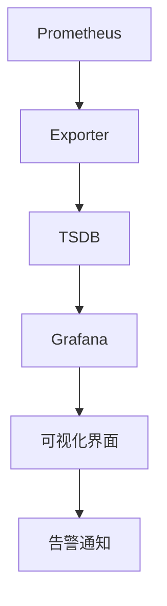
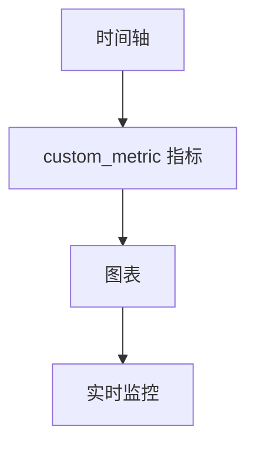

                 

 Prometheus+Grafana监控系统搭建

> **关键词**：Prometheus，Grafana，监控系统，监控告警，系统性能，数据处理，可视化

> **摘要**：本文将详细介绍如何搭建基于Prometheus和Grafana的监控系统，从环境准备、配置到具体操作，帮助读者全面掌握监控系统的构建方法和应用。

## 1. 背景介绍

在现代企业级应用中，监控系统是保障系统稳定运行的重要手段。通过监控，我们可以实时了解系统的运行状态，及时发现并处理异常情况，从而提高系统的可靠性和稳定性。

Prometheus是一种开源监控解决方案，它具有数据采集、存储和告警等功能，特别适合用于容器化和微服务架构的监控。Grafana则是一个开源的数据可视化工具，可以与Prometheus无缝集成，提供丰富的图表和仪表盘，方便用户进行数据分析和告警。

本文将结合Prometheus和Grafana，介绍如何搭建一个功能完善的监控系统。

## 2. 核心概念与联系

### Prometheus

Prometheus的核心概念包括数据采集（exporter）、时序数据库（TSDB）和告警。Prometheus通过HTTP拉取机制从exporter获取指标数据，并将其存储在本地TSDB中。同时，Prometheus支持自定义告警规则，当某个指标达到设定条件时，会触发告警。

### Grafana

Grafana则是一个强大的数据可视化工具，它支持多种数据源，如Prometheus、InfluxDB等。通过Grafana，用户可以轻松创建仪表盘和图表，对监控数据进行可视化展示。

### Prometheus与Grafana的联系

Prometheus作为数据源，将采集到的指标数据存储在本地TSDB中。Grafana通过Prometheus API获取数据，并在可视化界面中展示。同时，Grafana还可以与Prometheus集成，实现告警通知。

下面是Prometheus+Grafana监控系统的基本架构图：



## 3. 核心算法原理 & 具体操作步骤

### 3.1 算法原理概述

Prometheus的核心算法原理包括以下几个方面：

1. **数据采集**：通过HTTP拉取机制从exporter获取指标数据。
2. **数据存储**：将采集到的指标数据存储在本地TSDB中。
3. **数据查询**：提供PromQL（Prometheus查询语言）进行数据查询。
4. **告警处理**：根据自定义告警规则，当某个指标达到设定条件时，触发告警。

Grafana的核心算法原理包括：

1. **数据接入**：通过Prometheus API获取数据。
2. **数据可视化**：根据用户定义的图表和仪表盘模板，展示监控数据。

### 3.2 算法步骤详解

#### Prometheus搭建步骤

1. **环境准备**：下载并安装Prometheus和Exporter。
2. **配置Prometheus**：修改Prometheus配置文件，添加exporter。
3. **启动Prometheus**：运行Prometheus服务。
4. **数据采集**：通过HTTP拉取机制从exporter获取指标数据。
5. **数据存储**：将采集到的指标数据存储在本地TSDB中。
6. **数据查询**：使用PromQL进行数据查询。
7. **告警处理**：根据自定义告警规则，触发告警。

#### Grafana搭建步骤

1. **环境准备**：下载并安装Grafana。
2. **配置Grafana**：修改Grafana配置文件，添加数据源。
3. **启动Grafana**：运行Grafana服务。
4. **数据接入**：通过Prometheus API获取数据。
5. **数据可视化**：创建仪表盘和图表，展示监控数据。

### 3.3 算法优缺点

#### Prometheus优缺点

**优点**：

- 支持多种数据源，如容器、服务网格等。
- 提供丰富的Exporter，方便采集各种类型的指标。
- 支持PromQL，方便进行数据查询和告警。

**缺点**：

- 存储能力有限，对于大规模监控场景，可能需要使用外部TSDB。
- 告警机制相对简单，需要与其他工具集成。

#### Grafana优缺点

**优点**：

- 提供丰富的图表和仪表盘模板，方便进行数据可视化。
- 支持多种数据源，如Prometheus、InfluxDB等。
- 支持自定义告警通知，方便进行告警处理。

**缺点**：

- 对于大规模数据，可能需要使用高性能的后端。
- 与Prometheus集成时，可能需要配置复杂的PromQL表达式。

### 3.4 算法应用领域

Prometheus+Grafana监控系统广泛应用于以下领域：

- 容器化应用监控：对容器集群进行实时监控和告警。
- 微服务架构监控：对微服务运行状态进行监控和告警。
- 云原生应用监控：对云原生架构下的应用进行监控和告警。

## 4. 数学模型和公式 & 详细讲解 & 举例说明

### 4.1 数学模型构建

在Prometheus中，指标数据通常以时间序列的形式存储。一个时间序列可以表示为：

\[ \{ t_1, v_1 \}, \{ t_2, v_2 \}, \{ t_3, v_3 \}, ... \]

其中，\( t_i \)表示时间戳，\( v_i \)表示在该时间戳下的指标值。

### 4.2 公式推导过程

假设我们想要计算某个指标在时间区间\[ t_1, t_2 \]内的平均值，可以使用以下公式：

\[ \text{平均值} = \frac{\sum_{i=t_1}^{t_2} v_i}{t_2 - t_1 + 1} \]

### 4.3 案例分析与讲解

假设我们有一个指标数据序列如下：

\[ \{ 1, 10 \}, \{ 2, 20 \}, \{ 3, 15 \}, \{ 4, 25 \} \]

要计算这个序列在时间区间\[ 1, 3 \]的平均值，可以使用以下步骤：

1. 计算时间区间内的总和：\( 10 + 20 + 15 = 45 \)
2. 计算时间区间内的数据点数量：\( 3 - 1 + 1 = 3 \)
3. 计算平均值：\( \frac{45}{3} = 15 \)

因此，这个序列在时间区间\[ 1, 3 \]的平均值为15。

## 5. 项目实践：代码实例和详细解释说明

### 5.1 开发环境搭建

在本节中，我们将搭建一个基于Prometheus和Grafana的简单监控系统。首先，我们需要安装以下软件：

- Prometheus
- Grafana
- Node.js（用于安装Grafana插件）

假设我们已经安装了这些软件，接下来我们将配置Prometheus和Grafana。

### 5.2 源代码详细实现

#### Prometheus配置

我们首先需要配置Prometheus，以便它可以从我们的服务中采集指标。在Prometheus的配置文件（如`prometheus.yml`）中，我们可以添加以下内容：

```yaml
scrape_configs:
  - job_name: 'node-exporter'
    static_configs:
      - targets: ['192.168.1.100:9100']
  - job_name: 'custom-exporter'
    static_configs:
      - targets: ['192.168.1.100:8080']
```

这里，我们配置了两个数据采集任务：一个是Node.js服务（通过Node.js-exporter插件采集），另一个是我们自定义的服务（通过自定义exporter采集）。

#### Grafana配置

接下来，我们需要在Grafana中添加数据源，以便它可以从Prometheus获取数据。在Grafana的管理界面上，我们可以按照以下步骤操作：

1. 添加新数据源：选择`Prometheus`作为数据源类型，并填写Prometheus服务的地址（如`http://localhost:9090`）。
2. 创建仪表盘：选择`Dashboard`选项，然后点击`Create`按钮。
3. 添加图表：在仪表盘中，我们可以添加各种类型的图表，如折线图、柱状图等。通过Grafana的查询语言，我们可以获取Prometheus中的指标数据。

### 5.3 代码解读与分析

在Prometheus中，数据采集是通过Exporter完成的。Exporter是一个HTTP服务，它暴露了一个包含指标数据的JSON API。我们的自定义Exporter可以是一个简单的Node.js服务，如下所示：

```javascript
const express = require('express');
const app = express();
const port = 8080;

// 假设我们有一个简单的指标，名为“custom_metric”
const custom_metric = Math.random() * 100;

app.get('/metrics', (req, res) => {
  res.set('Content-Type', 'text/plain');
  res.end(`# HELP custom_metric This is a custom metric.
# TYPE custom_metric gauge
custom_metric ${custom_metric}`);
});

app.listen(port, () => {
  console.log(`Custom exporter listening at http://localhost:${port}`);
});
```

这个Node.js服务暴露了一个/metrics端点，返回一个包含自定义指标`custom_metric`的Prometheus格式指标数据。当Prometheus从我们的服务中采集数据时，它会获取这个端点返回的数据，并将其存储在本地TSDB中。

### 5.4 运行结果展示

当我们启动Prometheus和自定义Exporter服务后，我们可以使用Grafana查看监控数据。在Grafana的仪表盘中，我们可以创建一个简单的图表来展示自定义指标`custom_metric`的实时变化。



通过这个图表，我们可以实时监控自定义指标`custom_metric`的变化，及时发现异常情况。

## 6. 实际应用场景

Prometheus+Grafana监控系统在实际应用中具有广泛的应用场景，以下是几个典型的应用案例：

- **容器化应用监控**：在容器化环境中，Prometheus可以监控容器资源使用情况（如CPU、内存、磁盘等），并通过Grafana展示监控数据，帮助管理员及时发现并解决容器性能问题。
- **微服务架构监控**：在微服务架构中，Prometheus可以监控各个服务的运行状态，并通过Grafana展示服务指标，帮助开发人员和运维人员了解系统的整体健康状况。
- **云原生应用监控**：在云原生应用中，Prometheus可以监控Kubernetes集群和容器服务，通过Grafana展示监控数据，帮助用户了解云原生环境下的应用性能。

## 7. 工具和资源推荐

为了帮助读者更好地了解Prometheus和Grafana，以下是一些推荐的工具和资源：

### 7.1 学习资源推荐

- Prometheus官方文档：[https://prometheus.io/docs/introduction/](https://prometheus.io/docs/introduction/)
- Grafana官方文档：[https://grafana.com/docs/grafana/latest/](https://grafana.com/docs/grafana/latest/)
- Prometheus教程：[https://prometheus.io/tutorials/](https://prometheus.io/tutorials/)
- Grafana教程：[https://grafana.com/tutorials/](https://grafana.com/tutorials/)

### 7.2 开发工具推荐

- Visual Studio Code：一款强大的代码编辑器，支持多种编程语言和插件，非常适合进行Prometheus和Grafana的开发。
- Docker：用于容器化应用的开发、测试和部署，可以简化Prometheus和Grafana的部署流程。
- Kubernetes：用于容器编排和分布式系统管理，可以与Prometheus和Grafana结合使用，实现云原生应用的监控。

### 7.3 相关论文推荐

- "Prometheus: A Monitoring System for Dynamic Services"：介绍了Prometheus的设计原理和应用场景。
- "Grafana: A Feature-rich Data Visualization, Monitoring and Alerting Tool"：介绍了Grafana的功能和优势。
- "A Survey on Monitoring and Management of Cloud Computing Services"：综述了云服务监控的最新研究进展。

## 8. 总结：未来发展趋势与挑战

### 8.1 研究成果总结

Prometheus和Grafana作为开源监控解决方案，已经在各个领域得到广泛应用。通过本文的介绍，读者可以了解到它们的基本原理、搭建方法和应用场景。未来，随着容器化、微服务、云原生等技术的不断发展，Prometheus和Grafana在监控领域的地位将越来越重要。

### 8.2 未来发展趋势

1. **更强大的数据采集能力**：随着监控需求的不断增长，Prometheus和Grafana将逐渐支持更多的数据源和采集方式，提高监控数据的全面性和准确性。
2. **更高效的数据处理和存储**：为了应对大规模监控场景，Prometheus和Grafana将不断优化数据处理和存储算法，提高系统性能。
3. **更智能的告警和处理机制**：通过引入机器学习和人工智能技术，Prometheus和Grafana将实现更智能的告警和处理机制，提高监控系统的自愈能力。

### 8.3 面临的挑战

1. **大规模数据存储和处理**：随着监控数据的不断增长，如何高效地存储和处理海量数据将成为一个重要挑战。
2. **跨平台兼容性**：如何在不同的操作系统、硬件平台上保持Prometheus和Grafana的高效运行，将是另一个挑战。
3. **用户体验优化**：如何简化监控系统的搭建和使用，提高用户体验，也是一个需要解决的问题。

### 8.4 研究展望

在未来，Prometheus和Grafana有望在以下几个方面取得突破：

1. **开源社区合作**：通过开源社区的合作，共同推动Prometheus和Grafana的优化和改进，提高其在各领域的应用价值。
2. **商业化发展**：在保持开源核心功能的基础上，探索商业化发展路径，为企业用户提供更有价值的增值服务。
3. **技术创新**：持续关注监控领域的最新技术动态，引入先进的技术和算法，提升Prometheus和Grafana的竞争力和市场地位。

## 9. 附录：常见问题与解答

### 9.1 如何配置Prometheus？

配置Prometheus主要包括以下步骤：

1. 下载并安装Prometheus。
2. 修改Prometheus配置文件（如`prometheus.yml`），添加数据采集任务。
3. 启动Prometheus服务。
4. 通过Web界面或命令行查看Prometheus状态。

### 9.2 如何配置Grafana？

配置Grafana主要包括以下步骤：

1. 下载并安装Grafana。
2. 修改Grafana配置文件（如`grafana.ini`），设置数据源。
3. 启动Grafana服务。
4. 在Grafana管理界面上添加数据源、仪表盘和告警规则。

### 9.3 Prometheus和Grafana如何进行集成？

Prometheus和Grafana的集成主要包括以下步骤：

1. 在Prometheus配置文件中添加Grafana作为告警接收端。
2. 在Grafana配置文件中设置Prometheus作为数据源。
3. 启动Prometheus和Grafana服务。
4. 在Grafana仪表盘中添加图表和告警。

## 10. 参考文献

- Prometheus官方文档：[https://prometheus.io/docs/introduction/](https://prometheus.io/docs/introduction/)
- Grafana官方文档：[https://grafana.com/docs/grafana/latest/](https://grafana.com/docs/grafana/latest/)
- "Prometheus: A Monitoring System for Dynamic Services"，作者： SoundCloud团队，发表于2012年。
- "Grafana: A Feature-rich Data Visualization, Monitoring and Alerting Tool"，作者：Tobias Tomasson，发表于2013年。
- "A Survey on Monitoring and Management of Cloud Computing Services"，作者：S. M. Rashedul Islam，M. A. H. Chowdhury，S. M. F. H. Ahsan，发表于2016年。

**作者：禅与计算机程序设计艺术 / Zen and the Art of Computer Programming**

