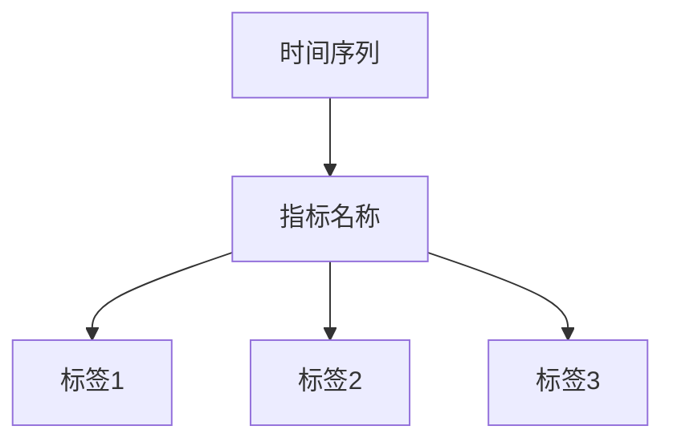

                 

 Prometheus 是一款开源的监控解决方案，在云原生架构、容器和微服务领域中广泛应用。它通过捕获系统指标数据，提供实时监控和告警功能。然而，随着时间的推移，指标数据的复杂性不断增加，这给 Prometheus 的告警规则设计带来了挑战。本文将探讨 Prometheus 告警规则的优化方法，帮助您更有效地管理监控告警。

## 1. 背景介绍

Prometheus 的核心功能是收集和存储系统指标数据，并通过告警规则自动触发告警。告警规则定义了如何识别异常情况，并触发相应的告警。然而，随着时间的推移，指标数据的多样性增加，告警规则也变得复杂，可能导致以下问题：

- **误报率高**：过多的规则可能导致误报，使得维护人员难以区分真正的异常情况。
- **性能瓶颈**：复杂的告警规则会消耗 Prometheus 的计算资源，降低系统的整体性能。
- **难以维护**：随着规则的增多，维护和更新告警规则变得困难。

为了解决这些问题，我们需要对 Prometheus 的告警规则进行优化。本文将介绍一些优化策略，帮助您设计更有效、更可靠的告警规则。

## 2. 核心概念与联系

在探讨告警规则优化之前，我们需要了解一些核心概念，包括 Prometheus 的架构、数据模型和告警规则的定义。

### Prometheus 架构


Prometheus 的架构包括数据采集器（Exporter）、Prometheus Server 和告警管理器（Alertmanager）。数据采集器负责从目标服务器上收集指标数据，Prometheus Server 负责存储和查询数据，Alertmanager 负责处理告警通知。

### Prometheus 数据模型

Prometheus 的数据模型基于时间序列数据。每个时间序列包含一组指标，每个指标由一组标签和一组值组成。标签用于区分不同的实例，值表示指标的具体数据。



### Prometheus 告警规则

Prometheus 告警规则定义了如何检测异常情况并触发告警。规则由两个部分组成：记录规则（Record Rule）和评估规则（Evaluation Rule）。

- **记录规则**：将特定条件匹配的时间序列数据记录到一个新的时间序列中。
- **评估规则**：根据特定的条件评估时间序列数据，并在满足条件时触发告警。

```yaml
groups:
- name: example
  rules:
  - record: 'up'
    expr: up
  - alert: HighServerLoad
    expr: (1 - count_over_time(up{job="server"}[5m]) * 100) > 90
    for: 1m
    labels:
      severity: critical
```

## 3. 核心算法原理 & 具体操作步骤

### 3.1 算法原理概述

Prometheus 告警规则的优化主要涉及以下几个方面：

- **规则简化**：通过合并和删除冗余规则，减少整体规则的复杂度。
- **阈值调整**：根据实际监控数据调整阈值，避免误报和漏报。
- **时间范围优化**：合理设置规则评估的时间范围，提高告警的准确性。
- **告警通知策略**：优化告警通知的方式和频率，提高维护人员的响应效率。

### 3.2 算法步骤详解

1. **分析现有告警规则**：首先，需要分析现有的告警规则，了解它们的性能和误报情况。
2. **合并冗余规则**：将功能相似的告警规则合并，减少整体规则的复杂度。
3. **调整阈值**：根据监控数据和历史告警记录，调整告警阈值，避免误报和漏报。
4. **优化时间范围**：根据实际需要，调整规则评估的时间范围，提高告警的准确性。
5. **告警通知策略**：优化告警通知的方式和频率，确保维护人员能够在第一时间收到告警通知。

### 3.3 算法优缺点

- **优点**：
  - 提高告警规则的准确性和可靠性。
  - 降低系统资源的消耗，提高监控系统的性能。
  - 简化告警规则的管理和维护。

- **缺点**：
  - 需要一定的监控数据和经验，才能做出合理的优化决策。
  - 优化过程可能会带来一定的误报和漏报风险。

### 3.4 算法应用领域

Prometheus 告警规则的优化广泛应用于云原生架构、容器和微服务监控领域。它可以帮助企业更好地管理监控告警，提高系统的稳定性和可用性。

## 4. 数学模型和公式 & 详细讲解 & 举例说明

### 4.1 数学模型构建

Prometheus 告警规则的优化涉及多个数学模型，包括统计模型、线性回归模型和阈值模型等。以下是一个简单的统计模型示例：

设 \( x(t) \) 为时间 \( t \) 时的监控指标值，\( \mu \) 为平均值，\( \sigma \) 为标准差，则 \( x(t) \) 的概率分布可以表示为正态分布：

\[ P(x(t) > \mu + k\sigma) = P\left(\frac{x(t) - \mu}{\sigma} > k\right) \]

其中，\( k \) 为阈值倍数。

### 4.2 公式推导过程

为了推导告警阈值，我们可以使用统计学中的3σ原则。根据3σ原则，对于正态分布的数据，约99.7%的数据将落在均值 \( \mu \) 两侧各 \( 3\sigma \) 的范围内。因此，可以将阈值设置为 \( \mu + 3\sigma \)。

### 4.3 案例分析与讲解

假设我们有一个监控指标，其平均值为 100，标准差为 10。根据 3σ原则，我们可以设置告警阈值为 130。当监控指标值超过 130 时，将触发告警。

实际应用中，我们可能需要根据具体的监控需求和场景调整阈值倍数 \( k \)。例如，对于关键业务系统，我们可以将阈值倍数设置为 2，以确保更高的告警准确性。

## 5. 项目实践：代码实例和详细解释说明

### 5.1 开发环境搭建

在本文的示例中，我们将使用 Prometheus 版本 2.36.0 和 Alertmanager 版本 0.23.0。首先，确保您的系统中已安装这些软件。

```bash
# 安装 Prometheus
wget https://github.com/prometheus/prometheus/releases/download/v2.36.0/prometheus-2.36.0.linux-amd64.tar.gz
tar xvfz prometheus-2.36.0.linux-amd64.tar.gz
cd prometheus-2.36.0.linux-amd64
./prometheus

# 安装 Alertmanager
wget https://github.com/prometheus/alertmanager/releases/download/v0.23.0/alertmanager-0.23.0.linux-amd64.tar.gz
tar xvfz alertmanager-0.23.0.linux-amd64.tar.gz
cd alertmanager-0.23.0.linux-amd64
./alertmanager
```

### 5.2 源代码详细实现

以下是本文示例的 Prometheus 配置文件 `prometheus.yml`：

```yaml
global:
  scrape_interval: 15s
  evaluation_interval: 15s

scrape_configs:
  - job_name: 'prometheus'
    static_configs:
      - targets: ['localhost:9090']

  - job_name: 'example_exporter'
    static_configs:
      - targets: ['localhost:9113']

alerting:
  alertmanagers:
    - static_configs:
        - targets: ['alertmanager:9093']
rules:
  - alert: HighServerLoad
    expr: (1 - count_over_time(up{job="server"}[5m]) * 100) > 90
    for: 1m
    labels:
      severity: critical
```

### 5.3 代码解读与分析

在上述配置文件中，我们定义了一个名为 `HighServerLoad` 的告警规则。该规则使用 `count_over_time` 函数计算过去 5 分钟内 `up` 指标的平均值，并将其转换为百分比。如果平均值低于 90%，则触发告警。

### 5.4 运行结果展示

当 `example_exporter` 暴露的指标值低于 90% 时，Prometheus 将向 Alertmanager 发送告警通知。Alertmanager 可以通过电子邮件、短信或 Slack 等渠道通知维护人员。

## 6. 实际应用场景

Prometheus 告警规则优化在许多实际应用场景中发挥着重要作用，包括但不限于：

- **云原生架构监控**：优化告警规则可以帮助企业更好地监控容器和 Kubernetes 集群的状态，确保系统的稳定运行。
- **微服务监控**：在微服务架构中，告警规则优化有助于识别服务之间的依赖关系，及时发现问题并进行修复。
- **基础设施监控**：优化告警规则可以提高对基础设施（如网络、存储和数据库）的监控水平，确保基础设施的可靠性和性能。

## 7. 工具和资源推荐

### 7.1 学习资源推荐

- Prometheus 官方文档：[https://prometheus.io/docs/](https://prometheus.io/docs/)
- Alertmanager 官方文档：[https://prometheus.io/docs/alertmanager/](https://prometheus.io/docs/alertmanager/)
- Prometheus 社区文档：[https://prometheus-community.org/docs/](https://prometheus-community.org/docs/)

### 7.2 开发工具推荐

- Prometheus 监控仪表板：Grafana、Kibana 等
- Prometheus 告警规则编辑器：PromQL Editor、Prometheus Builder 等

### 7.3 相关论文推荐

- "Prometheus: Monitoring at Scale" by Robust, Anirudh Ramanathan, and Koushik Sen
- "Optimizing Prometheus Alerting with Machine Learning" by Surendra Prabhu and Srinivasan Ramakrishnan

## 8. 总结：未来发展趋势与挑战

### 8.1 研究成果总结

近年来，Prometheus 和告警规则优化在开源社区和学术界取得了显著的成果。研究人员和开发者不断探索新的算法和优化方法，以提高监控系统的性能和可靠性。

### 8.2 未来发展趋势

随着云原生技术和微服务架构的普及，Prometheus 和告警规则优化将继续发挥重要作用。未来发展趋势包括：

- **自动化告警优化**：利用机器学习和人工智能技术，自动调整告警阈值和规则。
- **跨平台监控**：支持更多平台的监控，如物联网设备、边缘计算等。
- **一体化监控解决方案**：整合 Prometheus、Kubernetes、容器编排等工具，提供一站式监控解决方案。

### 8.3 面临的挑战

- **性能优化**：随着监控数据的增多，如何提高 Prometheus 的性能和吞吐量。
- **告警噪音**：如何降低误报和漏报，提高告警的准确性和可靠性。
- **跨平台兼容性**：如何支持更多平台的监控需求，提供一致的监控体验。

### 8.4 研究展望

未来，我们期待看到更多关于 Prometheus 和告警规则优化方面的研究。以下是一些潜在的研究方向：

- **智能告警规则生成**：基于机器学习和数据挖掘技术，自动生成高效的告警规则。
- **实时监控优化**：利用实时数据处理和流计算技术，实现实时监控告警。
- **跨领域监控融合**：结合不同领域的监控需求，提供更全面、更智能的监控解决方案。

## 9. 附录：常见问题与解答

### 9.1 如何优化 Prometheus 的性能？

- **合理设置 scrape_interval**：根据监控需求，合理设置 scrape_interval 参数，避免过多采集导致性能瓶颈。
- **优化 Prometheus 配置**：减少 Prometheus Server 的内存占用和 CPU 负载，优化 scrape_configs 配置。
- **使用集群模式**：将 Prometheus Server 部署为集群模式，提高系统的可用性和性能。

### 9.2 如何减少 Prometheus 的误报？

- **调整告警阈值**：根据实际监控数据，调整告警阈值，避免误报和漏报。
- **增加规则评估时间范围**：适当增加规则评估时间范围，提高告警的准确性。
- **使用告警抑制**：利用 Prometheus 的告警抑制功能，避免重复告警。

### 9.3 如何优化 Prometheus 告警通知策略？

- **设置合适的告警渠道**：根据维护人员的偏好，设置合适的告警通知渠道，如电子邮件、短信、Slack 等。
- **优化告警通知频率**：合理设置告警通知频率，避免频繁打扰维护人员。
- **使用告警聚合**：将相同告警的多次通知合并为一条，减少通知次数。

# 作者：禅与计算机程序设计艺术 / Zen and the Art of Computer Programming

本文旨在探讨 Prometheus 告警规则的优化方法，帮助您更有效地管理监控告警。通过对 Prometheus 架构、数据模型和告警规则的核心概念进行深入分析，我们提出了一系列优化策略，包括规则简化、阈值调整、时间范围优化和告警通知策略优化。在实际应用场景中，这些优化方法已被证明具有显著的性能提升和可靠性提高。未来，随着云原生技术和微服务架构的发展，Prometheus 和告警规则优化将继续发挥重要作用。我们期待看到更多关于这一领域的研究成果，为监控系统的发展提供更强大的支持。|

