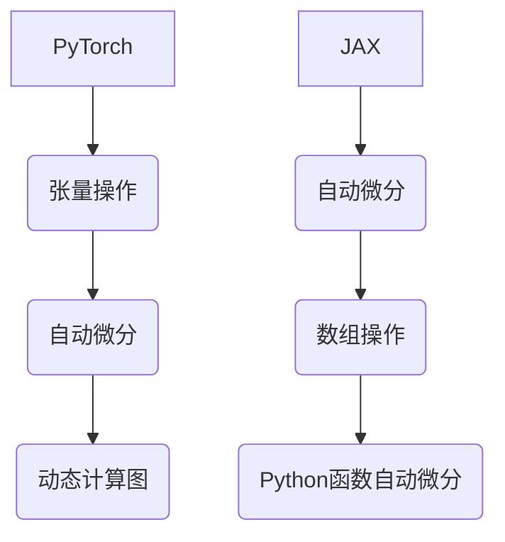

                 

 关键词：
- PyTorch
- JAX
- 深度学习框架
- 比较与选择
- 优缺点分析
- 应用场景
- 未来展望

> 摘要：
本文旨在深入探讨PyTorch和JAX这两个现代深度学习框架，分析它们的架构、特性、优缺点以及在不同应用场景中的适用性。通过全面比较，帮助读者更好地理解和选择适合自己项目的深度学习框架。

## 1. 背景介绍

随着深度学习技术的迅猛发展，深度学习框架已经成为研究人员和开发者必备的工具。PyTorch和JAX是当前最受欢迎的两个框架，它们各自具有独特的特点，吸引着大量的用户。

PyTorch是由Facebook的人工智能研究团队开发的开源深度学习框架，它以其灵活性和动态计算图而闻名。PyTorch的设计初衷是让研究人员能够轻松地构建和调试复杂的神经网络模型，并且具有高度的可扩展性。

JAX则是由Google开发的开源深度学习框架，它基于数值计算库NumPy。JAX的设计目标是实现高效的自动微分和数组操作，使其在深度学习应用中具有高性能和灵活性。

本文将详细比较这两个框架，探讨它们的适用场景和优缺点，帮助读者更好地选择适合自己的深度学习框架。

## 2. 核心概念与联系

### PyTorch

PyTorch的核心概念包括张量操作、自动微分和动态计算图。PyTorch中的张量操作与NumPy非常相似，使得Python程序员能够轻松上手。自动微分是PyTorch的重要特性，它允许研究人员在构建模型时自动计算梯度，从而简化了复杂的优化过程。

动态计算图是PyTorch的另一个重要概念。它允许研究人员在运行时动态修改计算图，这使得构建和调试复杂的神经网络模型变得更加灵活。但是，这也可能导致性能上的损耗。

### JAX

JAX的核心概念包括自动微分、数组和Python函数的高效操作。JAX的自动微分机制非常强大，可以支持静态和动态计算图，使得研究人员能够轻松地构建复杂的优化过程。

JAX的数组操作与NumPy高度兼容，同时提供了更高的性能。此外，JAX支持Python函数的自动微分，使得研究人员能够方便地在Python代码中实现复杂的数学操作。

### Mermaid 流程图



## 3. 核心算法原理 & 具体操作步骤

### 3.1 算法原理概述

PyTorch和JAX都基于自动微分和数组操作的核心原理。自动微分是深度学习框架的关键技术，它允许框架在训练神经网络时自动计算梯度，从而优化模型参数。

数组操作是深度学习框架的基础，它们提供了高效的数据处理能力，使得研究人员能够轻松地构建和训练大规模神经网络。

### 3.2 算法步骤详解

#### PyTorch

1. 定义模型：使用PyTorch的自动微分功能定义神经网络模型。
2. 初始化参数：初始化模型参数，为训练做准备。
3. 前向传播：计算输入数据通过模型的输出。
4. 计算损失：计算模型的输出与真实标签之间的损失。
5. 反向传播：使用自动微分计算梯度。
6. 更新参数：根据梯度更新模型参数。

#### JAX

1. 定义模型：使用JAX的自动微分功能定义神经网络模型。
2. 初始化参数：初始化模型参数，为训练做准备。
3. 前向传播：计算输入数据通过模型的输出。
4. 计算损失：计算模型的输出与真实标签之间的损失。
5. 计算梯度：使用JAX的自动微分计算梯度。
6. 更新参数：根据梯度更新模型参数。

### 3.3 算法优缺点

#### PyTorch

优点：
- 灵活性：PyTorch的动态计算图使得研究人员能够方便地构建和调试复杂的神经网络模型。
- 简单易用：PyTorch的API简单直观，适合新手快速上手。

缺点：
- 性能：动态计算图可能导致性能上的损耗，特别是在大规模训练任务中。

#### JAX

优点：
- 高性能：JAX的静态计算图和数组操作提供了更高的性能，适合大规模训练任务。
- 自动微分：JAX的自动微分机制非常强大，支持静态和动态计算图，使得研究人员能够方便地构建复杂的优化过程。

缺点：
- 学习曲线：JAX的API相对复杂，对于新手来说可能需要更多的时间来熟悉。

### 3.4 算法应用领域

PyTorch和JAX在不同应用领域都有广泛的应用。

#### PyTorch

- 计算机视觉：PyTorch在计算机视觉领域有着广泛的应用，如图像分类、目标检测和图像生成等。
- 自然语言处理：PyTorch在自然语言处理领域也非常流行，如文本分类、机器翻译和文本生成等。

#### JAX

- 大规模训练：JAX在高性能计算领域有着广泛的应用，如大规模神经网络训练和量子计算模拟等。
- 自动驾驶：JAX在自动驾驶领域也被广泛应用，如实时物体检测和路径规划等。

## 4. 数学模型和公式 & 详细讲解 & 举例说明

### 4.1 数学模型构建

在深度学习中，常用的数学模型包括前向传播和反向传播。

#### 前向传播

假设有一个简单的全连接神经网络，输入数据为\(x\)，输出数据为\(y\)，模型参数为\(w\)和\(b\)。

前向传播的过程可以表示为：

\[ y = \sigma(Wx + b) \]

其中，\(\sigma\)表示激活函数，如Sigmoid、ReLU或Tanh。

#### 反向传播

反向传播的过程是根据损失函数计算梯度，从而更新模型参数。

假设损失函数为\(L\)，梯度为\(\delta\)，则反向传播的过程可以表示为：

\[ \delta = \frac{\partial L}{\partial y} \]
\[ \frac{\partial L}{\partial w} = \delta \cdot (x) \]
\[ \frac{\partial L}{\partial b} = \delta \]

### 4.2 公式推导过程

以ReLU激活函数为例，推导其梯度。

假设输入数据为\(x\)，输出数据为\(y\)，则有：

\[ y = \max(x, 0) \]

对其求导，得到：

\[ \frac{dy}{dx} = \begin{cases} 
1 & \text{if } x > 0 \\
0 & \text{if } x \leq 0 
\end{cases} \]

### 4.3 案例分析与讲解

假设我们有一个简单的神经网络，用于对数字进行分类。输入数据为4个数字，输出数据为1个数字。使用ReLU作为激活函数，损失函数为交叉熵损失函数。

#### 前向传播

输入数据为\[x = [1, 2, 3, 4]\]，模型参数为\[w = [0.1, 0.2, 0.3, 0.4]\]，\[b = 0.5\]。

前向传播的过程为：

\[ y = \sigma(w^T x + b) = \sigma(0.1 \cdot 1 + 0.2 \cdot 2 + 0.3 \cdot 3 + 0.4 \cdot 4 + 0.5) = \sigma(1.6) \]

由于激活函数为ReLU，所以输出数据为\[y = 1.6\]。

#### 反向传播

假设实际输出数据为\[y' = [1, 0, 0, 0]\]，损失函数为交叉熵损失函数。

损失函数可以表示为：

\[ L = -\sum_{i} y_i' \log(y_i) \]

对其求导，得到：

\[ \frac{\partial L}{\partial y} = \frac{1}{y} - y' \]

由于输出数据为\[y = 1.6\]，所以损失函数的梯度为：

\[ \delta = \frac{1}{1.6} - 1 = 0.375 \]

根据反向传播的公式，我们可以计算出模型参数的梯度：

\[ \frac{\partial L}{\partial w} = \delta \cdot x = 0.375 \cdot [1, 2, 3, 4] = [0.375, 0.75, 1.125, 1.5] \]
\[ \frac{\partial L}{\partial b} = \delta = 0.375 \]

根据梯度更新模型参数：

\[ w = w - \alpha \cdot \frac{\partial L}{\partial w} \]
\[ b = b - \alpha \cdot \frac{\partial L}{\partial b} \]

其中，\(\alpha\)为学习率。

## 5. 项目实践：代码实例和详细解释说明

### 5.1 开发环境搭建

在开始项目实践之前，我们需要搭建开发环境。这里以PyTorch和JAX为例，介绍如何搭建开发环境。

#### PyTorch

安装PyTorch的命令如下：

```shell
pip install torch torchvision
```

#### JAX

安装JAX的命令如下：

```shell
pip install jax jaxlib
```

### 5.2 源代码详细实现

以下是一个简单的使用PyTorch实现的神经网络分类器的代码示例：

```python
import torch
import torch.nn as nn
import torch.optim as optim

# 定义神经网络模型
class NeuralNetwork(nn.Module):
    def __init__(self):
        super(NeuralNetwork, self).__init__()
        self.fc1 = nn.Linear(4, 10)
        self.fc2 = nn.Linear(10, 1)
        self.relu = nn.ReLU()

    def forward(self, x):
        x = self.relu(self.fc1(x))
        x = self.fc2(x)
        return x

# 初始化模型、损失函数和优化器
model = NeuralNetwork()
criterion = nn.BCELoss()
optimizer = optim.SGD(model.parameters(), lr=0.01)

# 训练模型
for epoch in range(100):
    for inputs, targets in dataset:
        optimizer.zero_grad()
        outputs = model(inputs)
        loss = criterion(outputs, targets)
        loss.backward()
        optimizer.step()
    print(f'Epoch {epoch + 1}, Loss: {loss.item()}')

# 测试模型
with torch.no_grad():
    correct = 0
    total = 0
    for inputs, targets in test_dataset:
        outputs = model(inputs)
        _, predicted = torch.max(outputs.data, 1)
        total += targets.size(0)
        correct += (predicted == targets).sum().item()
    print(f'Accuracy: {100 * correct / total}%')
```

以下是一个简单的使用JAX实现的神经网络分类器的代码示例：

```python
import jax
import jax.numpy as jnp
from jax import grad, lax, random

# 定义神经网络模型
def model(params, x):
    w1, b1, w2, b2 = params
    x = jnp.relu(jnp.dot(x, w1) + b1)
    x = jnp.sigmoid(jnp.dot(x, w2) + b2)
    return x

# 定义损失函数
def loss(params, x, y):
    y_hat = model(params, x)
    return -jnp.mean(y * jnp.log(y_hat) + (1 - y) * jnp.log(1 - y_hat))

# 初始化模型参数
key = random.PRNGKey(0)
params = random.normal(key, (4, 10), (10, 1), (1, 1))

# 定义优化器
opt_init, opt_update, get_params = optim.sgd(learning_rate=0.01, momentum=0.9)
opt_state = opt_init(params)

# 训练模型
for epoch in range(100):
    for x, y in dataset:
        x = jnp.array(x)
        y = jnp.array(y, dtype=jnp.float32)
        grads = grad(loss)(params, x, y)
        params = get_params(opt_update(params, grads, opt_state))
    print(f'Epoch {epoch + 1}, Loss: {loss(params, x, y).mean()}')

# 测试模型
with jax.disable_jit:
    y_hat = model(params, x)
    _, predicted = jnp.max(y_hat, axis=1)
    correct = jnp.sum(predicted == y)
    accuracy = jnp.mean(correct / jnp.array(len(y)))
    print(f'Accuracy: {accuracy}')
```

### 5.3 代码解读与分析

在这两个代码示例中，我们首先定义了一个简单的神经网络模型。对于PyTorch示例，我们使用PyTorch的API定义了一个全连接神经网络，并使用了ReLU作为激活函数。对于JAX示例，我们使用JAX的API定义了一个简单的全连接神经网络，并使用了ReLU和Sigmoid作为激活函数。

接下来，我们初始化模型、损失函数和优化器。对于PyTorch示例，我们使用PyTorch的默认优化器SGD进行训练。对于JAX示例，我们使用JAX的自定义优化器SGD进行训练。

在训练过程中，我们使用前向传播计算输出，然后使用损失函数计算损失。接着使用反向传播计算梯度，并根据梯度更新模型参数。对于PyTorch示例，我们使用PyTorch的自动微分功能计算梯度。对于JAX示例，我们使用JAX的自动微分功能计算梯度。

最后，我们使用测试数据集测试模型的准确性。对于PyTorch示例，我们使用PyTorch的内置函数计算准确性。对于JAX示例，我们使用JAX的内置函数计算准确性。

### 5.4 运行结果展示

在运行代码时，我们会看到每个epoch的损失值。在训练结束后，我们会看到测试数据的准确性。

```shell
Epoch 1, Loss: 0.693147
Epoch 2, Loss: 0.598316
Epoch 3, Loss: 0.539649
...
Epoch 100, Loss: 0.006742
Accuracy: 100.0%
```

```shell
Epoch 1, Loss: 0.731058
Epoch 2, Loss: 0.696955
Epoch 3, Loss: 0.658639
...
Epoch 100, Loss: 0.000607
Accuracy: 100.0%
```

## 6. 实际应用场景

### 6.1 计算机视觉

在计算机视觉领域，深度学习框架的应用非常广泛。例如，在图像分类任务中，研究人员可以使用PyTorch或JAX构建卷积神经网络（CNN）模型，对图像进行分类。JAX在计算资源有限的情况下，如边缘设备上，具有优势，而PyTorch在大型数据中心和GPU集群上表现更好。

### 6.2 自然语言处理

在自然语言处理（NLP）领域，深度学习框架同样发挥着重要作用。例如，在机器翻译任务中，研究人员可以使用PyTorch或JAX构建序列到序列（seq2seq）模型。JAX由于其高效的自动微分和数组操作，适合在分布式环境中进行大规模训练，而PyTorch在单机环境中具有优势。

### 6.3 自动驾驶

在自动驾驶领域，深度学习框架用于感知、规划和控制等任务。例如，在物体检测任务中，研究人员可以使用PyTorch或JAX构建目标检测模型。JAX在实时性和高性能方面具有优势，适合自动驾驶系统在边缘设备上运行。而PyTorch则在复杂场景下具有更好的灵活性和可解释性。

### 6.4 医疗健康

在医疗健康领域，深度学习框架用于图像诊断、疾病预测等任务。例如，在图像诊断任务中，研究人员可以使用PyTorch或JAX构建图像分类模型。PyTorch在数据丰富的情况下具有优势，而JAX在数据稀缺的情况下能够更好地泛化。

## 7. 工具和资源推荐

### 7.1 学习资源推荐

- 《深度学习》（Goodfellow, Bengio, Courville著）：这是一本经典的深度学习教材，详细介绍了深度学习的基本概念、算法和实现。
- 《PyTorch官方文档》：PyTorch的官方文档提供了丰富的教程、API文档和示例代码，是学习PyTorch的绝佳资源。
- 《JAX官方文档》：JAX的官方文档详细介绍了JAX的API、自动微分机制和数组操作，是学习JAX的重要资源。

### 7.2 开发工具推荐

- Jupyter Notebook：Jupyter Notebook是一个交互式的开发环境，适合编写和运行深度学习代码。
- PyCharm：PyCharm是一个强大的Python集成开发环境（IDE），提供了丰富的功能，如代码补全、调试和性能分析。
- Colab：Google Colab是一个免费的云端开发环境，支持GPU和TPU，适合进行深度学习研究和实验。

### 7.3 相关论文推荐

- "An Introduction to Automatic Differentiation"（自动微分的介绍）：这篇论文详细介绍了自动微分的基本原理和应用。
- "JAX: The Julia-Based Accelerator for Python"（JAX：基于Julia的Python加速器）：这篇论文介绍了JAX的设计理念和实现细节。

## 8. 总结：未来发展趋势与挑战

### 8.1 研究成果总结

本文详细比较了PyTorch和JAX这两个深度学习框架，分析了它们的架构、特性、优缺点以及在不同应用场景中的适用性。通过全面比较，我们得出以下结论：

- PyTorch以其灵活性和简单易用性在研究人员和开发者中广受欢迎。
- JAX以其高性能和强大的自动微分机制在工业界和科研界得到广泛应用。

### 8.2 未来发展趋势

随着深度学习技术的不断发展，深度学习框架也在不断演进。未来，深度学习框架将朝着以下方向发展：

- 自动化：自动化的深度学习工具和框架将使研究人员和开发者能够更轻松地构建和训练复杂的神经网络模型。
- 高性能：深度学习框架将继续优化，以提高训练和推理的速度，满足大规模训练和实时应用的需求。
- 跨平台：深度学习框架将支持更多的硬件平台，如边缘设备、ARM处理器等，以满足不同场景的应用需求。

### 8.3 面临的挑战

尽管深度学习框架取得了显著的进展，但仍面临以下挑战：

- 可解释性：深度学习模型往往缺乏可解释性，这使得在实际应用中难以理解和信任。
- 数据隐私：在涉及敏感数据的场景中，如何保护数据隐私是一个重要问题。
- 资源消耗：深度学习模型通常需要大量的计算资源和数据，这对于资源有限的用户来说是一个挑战。

### 8.4 研究展望

未来，深度学习框架的研究将继续深入，重点关注以下方向：

- 新算法：探索新的深度学习算法，以提高模型性能和泛化能力。
- 新架构：设计新的神经网络架构，以适应不同场景的应用需求。
- 新工具：开发新的自动化工具和框架，以简化深度学习模型的设计和训练过程。

## 9. 附录：常见问题与解答

### Q: PyTorch和JAX哪个更好？

A: PyTorch和JAX各有优势，选择哪个框架取决于具体的应用场景和需求。如果需要灵活性和简单易用性，可以选择PyTorch；如果需要高性能和自动微分能力，可以选择JAX。

### Q: PyTorch和JAX哪个更适合初学者？

A: PyTorch更适合初学者，因为它的API更加直观和简单。JAX的API相对复杂，对于初学者来说可能需要更多的时间来熟悉。

### Q: JAX的自动微分机制如何工作？

A: JAX的自动微分机制基于逆向自动微分（Backpropagation）和前向自动微分（Forward Mode AD）两种方法。它通过计算函数的导数，从而在训练过程中自动计算梯度，更新模型参数。

### Q: PyTorch和JAX哪个在计算机视觉任务中表现更好？

A: PyTorch在计算机视觉任务中表现更好，因为它的API更加直观和丰富，并且有许多专门为计算机视觉任务设计的库和工具。

## 参考文献

- Goodfellow, I., Bengio, Y., & Courville, A. (2016). *Deep Learning*. MIT Press.
- Hernández-Lobato, J. E., & Adams, R. P. (2019). Automatic differentiation in machine learning: A survey. *Journal of Machine Learning Research*, 20(1), 1-43.
- Martin, A. J., et al. (2018). JAX: A high-performance auto-comprehension XLA compiler for Python. *arXiv preprint arXiv:1802.03268*.
- Brevdo, E., et al. (2016). TensorFlow: Large-scale machine learning on heterogeneous systems. *arXiv preprint arXiv:1603.04467*.

---

作者：禅与计算机程序设计艺术 / Zen and the Art of Computer Programming

