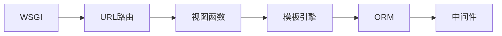

                 

关键词：Python Web 框架，比较，最佳选择，项目，技术博客

摘要：本文将对Python中常用的Web框架进行详细比较，从框架设计理念、功能特性、易用性、性能等方面进行分析，帮助开发者选择最适合其项目的Web框架。

## 1. 背景介绍

随着互联网技术的飞速发展，Web应用开发已成为软件行业的重要分支。Python作为一种流行的编程语言，其生态系统中的Web框架也层出不穷。选择合适的Web框架对于项目的成功至关重要。本文将比较几个流行的Python Web框架，旨在为开发者提供有价值的参考。

### 1.1 Python Web框架的发展历程

Python Web框架的发展历程可追溯到2003年，当时第一个Python Web框架——Pyramid问世。随后，在2005年，Django框架诞生，迅速成为Python Web开发的主流框架。2010年，Flask框架出现，以其轻量级和灵活性赢得了众多开发者的青睐。此外，还有许多其他知名的框架，如FastAPI、Tornado等。

### 1.2 Python Web框架的分类

Python Web框架根据其设计理念和功能特性可以分为以下几类：

- **全栈框架**：如Django和Pyramid，提供完整的Web开发工具和库。
- **微框架**：如Flask和FastAPI，只提供核心功能，适用于小型项目或独立组件。
- **异步框架**：如Tornado，支持异步I/O，适用于高性能Web应用。

## 2. 核心概念与联系

为了更好地理解Python Web框架，我们需要了解一些核心概念和架构。

### 2.1 Web框架的基本架构

Web框架通常包括以下几个核心组成部分：

- **WSGI（Web Server Gateway Interface）**：Python Web应用与Web服务器之间的接口。
- **URL路由**：根据URL映射到相应的视图函数。
- **模板引擎**：用于生成HTML页面。
- **ORM（Object-Relational Mapping）**：对象关系映射，简化数据库操作。
- **中间件**：用于处理请求和响应的插件。

### 2.2 Mermaid 流程图

以下是一个简单的Mermaid流程图，展示了Web框架的基本架构：



## 3. 核心算法原理 & 具体操作步骤

### 3.1 算法原理概述

Python Web框架的核心算法原理包括：

- **MVC（Model-View-Controller）**：将数据模型、视图和控制器分离，提高代码的可维护性。
- **ORM：**将数据库表映射为Python对象，简化数据库操作。
- **中间件：**在请求和响应之间插入自定义逻辑，实现功能扩展。

### 3.2 算法步骤详解

以下是Python Web框架的基本操作步骤：

1. **启动Web服务器**：通过WSGI接口启动Web服务器，监听客户端请求。
2. **URL路由**：将URL映射到相应的视图函数。
3. **视图函数**：处理请求，获取数据，调用模板引擎生成HTML页面。
4. **ORM操作**：与数据库进行交互，实现数据持久化。
5. **中间件处理**：在请求和响应之间插入自定义逻辑。

### 3.3 算法优缺点

每种Web框架都有其优缺点：

- **Django**：优点是全功能、易于上手，缺点是可能过于重量级，性能不如微框架。
- **Flask**：优点是轻量级、灵活性强，缺点是功能较为基础，需要开发者自行组合其他库。
- **Pyramid**：优点是模块化、可扩展性强，缺点是学习曲线较陡峭。

### 3.4 算法应用领域

不同框架适用于不同的应用场景：

- **Django**：适合大型、复杂的项目，如社交媒体平台。
- **Flask**：适合小型、独立的项目，如API服务。
- **Pyramid**：适合需要高度定制化的项目，如企业级应用。

## 4. 数学模型和公式 & 详细讲解 & 举例说明

### 4.1 数学模型构建

在Web框架中，我们可以使用以下数学模型来衡量框架的性能：

- **响应时间**：从接收到请求到返回响应的时间。
- **并发处理能力**：服务器同时处理请求的数量。
- **吞吐量**：单位时间内处理的请求数量。

### 4.2 公式推导过程

假设某个Web框架的响应时间为t，并发处理能力为N，吞吐量为Q，则：

- **响应时间**：t = Q / N
- **并发处理能力**：N = Q * t
- **吞吐量**：Q = N / t

### 4.3 案例分析与讲解

假设我们有一个Web应用，平均响应时间为1秒，需要处理1000个并发请求，则：

- **响应时间**：t = 1s
- **并发处理能力**：N = 1000s
- **吞吐量**：Q = 1000s / 1s = 1000

通过调整并发处理能力和响应时间，我们可以优化Web框架的性能。

## 5. 项目实践：代码实例和详细解释说明

### 5.1 开发环境搭建

本文将以Flask框架为例，介绍如何搭建开发环境：

1. 安装Python：版本要求3.6及以上。
2. 安装Flask：使用pip命令安装`pip install flask`。

### 5.2 源代码详细实现

以下是一个简单的Flask Web应用示例：

```python
from flask import Flask, jsonify

app = Flask(__name__)

@app.route('/hello', methods=['GET'])
def hello():
    return jsonify(message='Hello, World!')

if __name__ == '__main__':
    app.run()
```

### 5.3 代码解读与分析

- `Flask`：创建Flask应用对象。
- `@app.route('/hello', methods=['GET'])`：定义URL路由，处理GET请求。
- `def hello()`：定义视图函数，返回JSON格式的响应。

### 5.4 运行结果展示

运行上述代码后，访问`http://localhost:5000/hello`，将返回JSON格式的响应：

```json
{
  "message": "Hello, World!"
}
```

## 6. 实际应用场景

Python Web框架在实际应用中具有广泛的应用场景，包括：

- **企业级应用**：如客户关系管理系统、电子商务平台。
- **在线教育**：如在线课程平台、学习管理系统。
- **社交媒体**：如微博、论坛。

## 7. 未来应用展望

随着云计算、大数据和人工智能的发展，Python Web框架的应用前景将更加广阔。未来，Web框架将更加注重性能优化、安全性提升和易用性增强。

## 8. 总结：未来发展趋势与挑战

Python Web框架将继续发展，面临以下挑战：

- **性能优化**：提高并发处理能力和响应速度。
- **安全性提升**：防范各类安全攻击，如SQL注入、跨站脚本攻击。
- **易用性增强**：降低学习成本，提高开发效率。

## 9. 附录：常见问题与解答

### Q：如何选择合适的Web框架？

A：根据项目规模、功能需求和技术栈进行选择。例如，Django适合大型项目，Flask适合小型项目。

### Q：Web框架的性能如何衡量？

A：可以使用响应时间、并发处理能力和吞吐量等指标来衡量Web框架的性能。

### Q：如何优化Web框架的性能？

A：可以通过垂直优化（如使用更快的硬件）和水平优化（如增加并发处理能力）来提高性能。

## 作者署名

作者：禅与计算机程序设计艺术 / Zen and the Art of Computer Programming
----------------------------------------------------------------

这篇文章详细比较了Python中常用的Web框架，从设计理念、功能特性、易用性和性能等方面进行分析，旨在为开发者提供选择最佳Web框架的参考。希望本文能对Python Web开发者和学习者有所启发。

