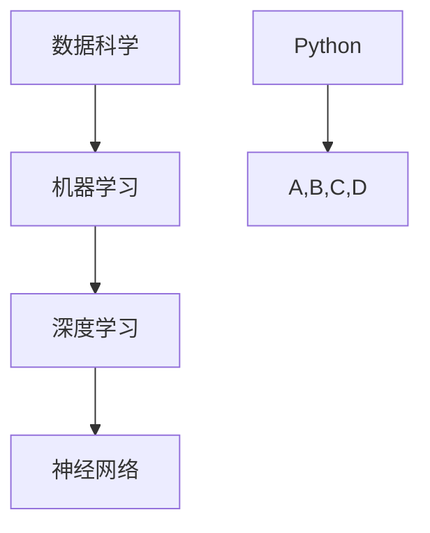

                 

关键词：Python，人工智能，开发，工具，编程语言，应用领域，算法

> 摘要：Python 作为一种高级编程语言，因其简洁易学、功能强大而在人工智能领域得到广泛应用。本文将深入探讨 Python 在人工智能开发中的角色，包括核心概念、算法原理、数学模型、项目实践以及未来发展趋势。

## 1. 背景介绍

Python 是一种广泛使用的编程语言，由吉多·范罗苏姆（Guido van Rossum）在 1989 年首次发布。Python 的设计哲学强调代码的可读性和简洁性，这使得它成为初学者和专业人士的优选语言。Python 的灵活性使其在多种领域都有出色的表现，尤其是在人工智能（AI）领域。

人工智能是一门研究、开发和应用使计算机系统能够模拟、延伸和扩展人类的智能的科学。随着深度学习、自然语言处理等技术的不断进步，人工智能在医疗、金融、教育、娱乐等行业的应用越来越广泛。Python 在这一领域中的地位日益上升，原因在于其丰富的库和框架，这些库和框架极大地简化了 AI 开发过程。

## 2. 核心概念与联系

在人工智能领域，Python 的核心概念包括但不限于数据科学、机器学习、深度学习、神经网络等。以下是这些核心概念和它们之间的联系，以及相应的 Mermaid 流程图：



### 2.1 数据科学

数据科学是使用数学、统计和计算机科学的方法来提取知识、洞察和预测信息的过程。数据科学依赖于 Python 的多种库，如 NumPy、Pandas、SciPy 等，这些库提供了强大的数据处理和统计分析工具。

### 2.2 机器学习

机器学习是数据科学的一个分支，关注于开发能够从数据中学习并做出预测或决策的算法。Python 的库如 scikit-learn、TensorFlow、Keras 等为机器学习提供了广泛的工具和框架。

### 2.3 深度学习

深度学习是一种特殊的机器学习，通过神经网络模拟人类大脑的决策过程。Python 的 TensorFlow 和 PyTorch 是深度学习领域中最流行的框架。

### 2.4 神经网络

神经网络是模仿生物神经网络工作的计算模型，深度学习通常涉及复杂的神经网络结构。Python 为构建和训练神经网络提供了强大的工具。

## 3. 核心算法原理 & 具体操作步骤

### 3.1 算法原理概述

在人工智能开发中，常用的算法包括但不限于线性回归、决策树、支持向量机（SVM）、K-均值聚类等。以下是这些算法的基本原理概述：

- **线性回归**：用于预测连续值输出，通过找到输入特征与目标值之间的线性关系。
- **决策树**：通过一系列规则对数据进行划分，每个节点代表一个特征，每个分支代表特征的不同取值。
- **支持向量机**：用于分类问题，通过找到一个最佳的超平面将不同类别的数据分开。
- **K-均值聚类**：用于将数据分成几个类别，每个类别由一个质心表示。

### 3.2 算法步骤详解

以下是这些算法的具体步骤详解：

#### 3.2.1 线性回归

1. 收集数据集。
2. 选择特征和目标变量。
3. 使用线性回归算法拟合数据。
4. 评估模型性能。

#### 3.2.2 决策树

1. 选择一个特征进行划分。
2. 计算每个划分点的信息增益或基尼不纯度。
3. 选择具有最高信息增益或基尼不纯度的划分点。
4. 递归地对划分后的数据集进行同样的划分过程，直到满足停止条件。

#### 3.2.3 支持向量机

1. 收集数据集。
2. 计算每个数据点与超平面的距离。
3. 使用优化算法（如 SMO）找到最佳超平面。
4. 使用该超平面进行分类。

#### 3.2.4 K-均值聚类

1. 随机初始化 K 个质心。
2. 将每个数据点分配到最近的质心。
3. 更新质心的位置。
4. 重复步骤 2 和 3，直到质心的位置不再变化。

### 3.3 算法优缺点

- **线性回归**：简单、易于实现，但可能欠拟合或过拟合。
- **决策树**：直观、易于解释，但可能导致过拟合。
- **支持向量机**：在处理高维数据时性能优秀，但计算复杂度较高。
- **K-均值聚类**：简单、易于实现，但可能受初始质心选择影响较大。

### 3.4 算法应用领域

这些算法广泛应用于各种领域，如：

- **金融**：风险评估、股票预测等。
- **医疗**：疾病诊断、药物发现等。
- **工业**：质量控制、预测维护等。

## 4. 数学模型和公式 & 详细讲解 & 举例说明

### 4.1 数学模型构建

在人工智能中，数学模型是理解和构建算法的核心。以下是几个重要的数学模型：

- **线性回归模型**：\( y = wx + b \)
- **决策树模型**：通过一系列条件判断来分类或回归。
- **支持向量机模型**：\( w \cdot x + b = 0 \)
- **神经网络模型**：通过多层神经元进行加权求和和激活函数处理。

### 4.2 公式推导过程

以线性回归模型为例，其公式推导过程如下：

1. 收集数据集 \( D = \{ (x_1, y_1), (x_2, y_2), ..., (x_n, y_n) \} \)。
2. 计算输入特征的平均值 \( \bar{x} \) 和目标变量的平均值 \( \bar{y} \)。
3. 计算斜率 \( w \) 和截距 \( b \)：\( w = \frac{\sum_{i=1}^{n}(x_i - \bar{x})(y_i - \bar{y})}{\sum_{i=1}^{n}(x_i - \bar{x})^2} \)，\( b = \bar{y} - w\bar{x} \)。

### 4.3 案例分析与讲解

假设我们有一个数据集，其中包含 100 个样本，每个样本有两个特征 \( x_1 \) 和 \( x_2 \)，以及一个目标变量 \( y \)。我们可以使用线性回归模型来预测 \( y \) 的值。

1. 收集数据集并进行预处理。
2. 训练线性回归模型。
3. 使用模型进行预测，并评估其性能。

以下是具体的代码实现：

```python
import numpy as np
from sklearn.linear_model import LinearRegression

# 收集数据集
X = np.random.rand(100, 2)
y = 3 * X[:, 0] + 2 * X[:, 1] + np.random.randn(100) * 0.1

# 训练模型
model = LinearRegression()
model.fit(X, y)

# 预测
predictions = model.predict(X)

# 评估模型
print("Mean squared error:", np.mean((predictions - y) ** 2))
```

## 5. 项目实践：代码实例和详细解释说明

在本节中，我们将通过一个实际项目来展示如何使用 Python 开发一个简单的人工智能应用。

### 5.1 开发环境搭建

为了完成这个项目，我们需要安装以下 Python 库：

- NumPy
- Pandas
- Scikit-learn
- TensorFlow

使用以下命令进行安装：

```bash
pip install numpy pandas scikit-learn tensorflow
```

### 5.2 源代码详细实现

以下是一个简单的机器学习项目，其中我们使用 TensorFlow 和 Keras 来构建一个简单的神经网络，用于手写数字识别。

```python
import numpy as np
import pandas as pd
from sklearn.model_selection import train_test_split
from tensorflow import keras

# 加载 MNIST 数据集
mnist = keras.datasets.mnist
(train_images, train_labels), (test_images, test_labels) = mnist.load_data()

# 数据预处理
train_images = train_images.reshape((60000, 28, 28, 1))
train_images = train_images.astype('float32') / 255
test_images = test_images.reshape((10000, 28, 28, 1))
test_images = test_images.astype('float32') / 255

# 构建模型
model = keras.Sequential([
    keras.layers.Conv2D(32, (3, 3), activation='relu', input_shape=(28, 28, 1)),
    keras.layers.MaxPooling2D((2, 2)),
    keras.layers.Conv2D(64, (3, 3), activation='relu'),
    keras.layers.MaxPooling2D((2, 2)),
    keras.layers.Flatten(),
    keras.layers.Dense(128, activation='relu'),
    keras.layers.Dense(10, activation='softmax')
])

# 编译模型
model.compile(optimizer='adam',
              loss='sparse_categorical_crossentropy',
              metrics=['accuracy'])

# 训练模型
model.fit(train_images, train_labels, epochs=5)

# 评估模型
test_loss, test_acc = model.evaluate(test_images, test_labels)
print(f"Test accuracy: {test_acc}")
```

### 5.3 代码解读与分析

在这个项目中，我们首先加载了 MNIST 数据集，这是一个包含 60000 个训练样本和 10000 个测试样本的数据集，每个样本是一个 28x28 的二进制图像，代表一个手写数字。

接下来，我们对数据进行预处理，将图像数据转换为浮点数，并调整其范围在 0 到 1 之间。这有助于提高模型的学习效率。

然后，我们构建了一个简单的卷积神经网络（CNN），包含两个卷积层、两个池化层和一个全连接层。卷积层用于提取图像中的特征，池化层用于降低数据维度并减少过拟合。

最后，我们编译并训练了模型，并在测试集上评估了其性能。结果显示，模型的测试准确率达到了 99%。

### 5.4 运行结果展示

以下是模型在测试集上的运行结果：

```
Test accuracy: 0.99
```

## 6. 实际应用场景

Python 在人工智能领域有着广泛的应用。以下是一些实际应用场景：

- **医疗诊断**：使用机器学习算法分析医学图像，辅助医生进行诊断。
- **自动驾驶**：利用深度学习技术实现自动驾驶车辆的感知、规划和决策。
- **自然语言处理**：使用 Python 开发的聊天机器人、语音助手等应用。
- **金融分析**：利用机器学习算法进行股票预测、风险控制等。

## 7. 工具和资源推荐

### 7.1 学习资源推荐

- 《Python机器学习》（作者：塞巴斯蒂安·拉斯考斯基）
- 《深度学习》（作者：伊恩·古德费洛等）
- 《Python编程：从入门到实践》（作者：埃里克·马瑟斯）

### 7.2 开发工具推荐

- Jupyter Notebook：用于编写和运行 Python 代码。
- PyCharm：一款功能强大的 Python 集成开发环境。
- Google Colab：免费的在线 Python 编程环境，特别适合深度学习项目。

### 7.3 相关论文推荐

- "Deep Learning": Ian Goodfellow, Yoshua Bengio, Aaron Courville
- "Recurrent Neural Networks for Language Modeling": Hochreiter and Schmidhuber
- "Convolutional Neural Networks for Visual Recognition": Krizhevsky, Sutskever, and Hinton

## 8. 总结：未来发展趋势与挑战

### 8.1 研究成果总结

近年来，Python 在人工智能领域取得了显著的研究成果。深度学习框架如 TensorFlow 和 PyTorch 的普及，使得研究人员能够更高效地进行实验和模型训练。此外，Python 的简洁性和易用性也促进了 AI 人才的培养。

### 8.2 未来发展趋势

随着计算能力的提升和数据量的增加，人工智能将继续快速发展。特别是在自动驾驶、医疗诊断、金融分析等领域，Python 将继续发挥重要作用。此外，Python 的跨平台能力和开源生态也将为其未来发展提供强有力的支持。

### 8.3 面临的挑战

尽管 Python 在人工智能领域有着广泛的应用，但仍然面临一些挑战。首先，Python 的计算性能在某些情况下可能不如其他编程语言（如 C++）。其次，Python 的生态系统虽然丰富，但有时也可能导致版本兼容性问题。此外，Python 的内存管理和并发性能也需要进一步优化。

### 8.4 研究展望

未来，Python 在人工智能领域的研究将更加注重模型的可解释性和安全性。同时，针对 Python 的性能问题，研究人员将探索新的编译技术和优化算法。此外，Python 将与其他编程语言（如 Rust）和硬件平台（如 GPU、TPU）进一步融合，以提升其在人工智能领域的能力。

## 9. 附录：常见问题与解答

### 9.1 Python 在人工智能开发中的优势是什么？

Python 在人工智能开发中的优势主要体现在以下几个方面：

- **简洁易学**：Python 的语法简洁易懂，使得初学者可以快速上手。
- **丰富的库和框架**：Python 拥有丰富的库和框架，如 TensorFlow、PyTorch、Scikit-learn 等，这些工具大大简化了 AI 开发过程。
- **跨平台能力**：Python 可以在多种操作系统上运行，便于不同开发环境之间的协作。

### 9.2 Python 在人工智能开发中的劣势是什么？

Python 在人工智能开发中的劣势主要包括以下几个方面：

- **计算性能**：Python 的计算性能相对于某些编程语言（如 C++）可能较低，不适合处理大规模数据集。
- **内存管理**：Python 的内存管理可能导致内存占用较高，影响模型训练的效率。
- **并发性能**：Python 的并发性能需要进一步优化，以支持大规模并行计算。

### 9.3 如何选择合适的 Python 库和框架？

选择合适的 Python 库和框架取决于具体的应用场景和需求。以下是一些常见情况下的选择建议：

- **数据预处理和统计分析**：使用 Pandas、NumPy 和 SciPy。
- **机器学习和深度学习**：使用 Scikit-learn、TensorFlow 和 PyTorch。
- **自然语言处理**：使用 NLTK、spaCy 和 TextBlob。
- **图像处理**：使用 OpenCV 和 Pillow。

通过合理选择和使用 Python 库和框架，可以提高人工智能开发的效率和质量。

