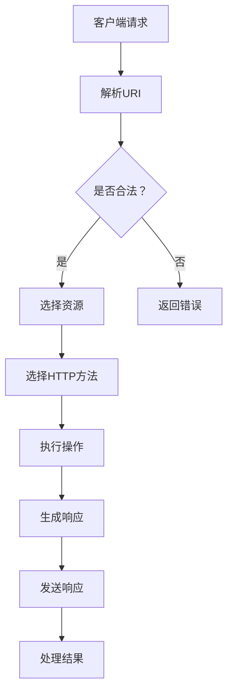

                 

关键词：RESTful API，Web服务，可扩展性，API设计，架构设计，最佳实践

摘要：本文将深入探讨RESTful API设计的核心概念、原则和实践，以及如何构建可扩展的Web服务。通过分析REST架构风格的基本原理，本文将提供一系列的设计策略和技巧，帮助开发者打造高效、灵活且易于维护的API。此外，还将讨论数学模型和公式在API设计中的应用，并通过实际项目实例进行详细解释和代码分析，为读者提供实战经验和参考。

## 1. 背景介绍

随着互联网技术的迅猛发展，Web服务成为了现代软件开发中的核心组件。而RESTful API（ Representational State Transfer，表述性状态转移）作为一种广泛采用的Web服务架构风格，已经成为构建分布式系统和微服务架构的基础。RESTful API设计的核心目标是实现资源的可访问性和服务的可扩展性，使其在复杂和动态的环境中保持稳定和高效。

本文旨在通过以下内容，为开发者提供全面且深入的RESTful API设计指南：

- RESTful API设计的基本概念和原则
- RESTful架构风格的核心要素
- 设计策略和最佳实践
- 数学模型和公式在API设计中的应用
- 实际项目实例和代码分析
- 未来应用场景和展望

通过阅读本文，读者将能够：

- 理解RESTful API设计的核心原则和架构风格
- 掌握构建可扩展Web服务的关键技巧
- 学习如何通过数学模型优化API性能
- 获得实际项目中的API设计经验

## 2. 核心概念与联系

### 2.1 RESTful API设计的基本概念

RESTful API设计围绕着资源的概念展开。在REST架构中，资源是Web服务中可操作和访问的核心实体。资源可以通过统一的接口进行访问、操作和更新，从而实现分布式系统的协同工作。

RESTful API设计的基本概念包括：

- **统一接口（Uniform Interface）**：通过统一的接口实现资源的访问、操作和更新，降低系统的复杂性。
- **无状态（Statelessness）**：每次请求都是独立的，服务器不存储任何与客户端的状态信息，提高系统的扩展性和安全性。
- **客户端-服务器架构（Client-Server Architecture）**：客户端和服务器之间通过网络进行通信，客户端负责发送请求，服务器负责处理请求并返回响应。

### 2.2 RESTful API架构风格的核心要素

RESTful API架构风格的核心要素包括：

- **资源标识（Resource Identification）**：使用统一资源标识符（URI）对资源进行标识和定位。
- **HTTP方法（HTTP Methods）**：定义资源的操作方式，如GET、POST、PUT、DELETE等。
- **状态码（Status Codes）**：HTTP状态码用于表示请求的处理结果，如200 OK、400 Bad Request、404 Not Found等。
- **内容类型（Content Types）**：定义API响应的数据格式，如JSON、XML等。

### 2.3 RESTful架构风格的核心原理

RESTful架构风格的核心原理包括：

- **分层次架构（Layered System Architecture）**：网络通信采用分层次架构，隐藏底层实现细节，提高系统的可扩展性和稳定性。
- **按需编程（On-demand Programming）**：客户端根据需求动态选择和组合资源，实现灵活的分布式计算。
- **无状态会话（Stateless Sessions）**：每次请求都是独立的，服务器不存储任何与客户端的状态信息，降低系统的复杂性和风险。

### 2.4 RESTful架构风格的Mermaid流程图

下面是RESTful架构风格的Mermaid流程图，展示了资源标识、HTTP方法和状态码等核心要素的交互关系。



## 3. 核心算法原理 & 具体操作步骤

### 3.1 算法原理概述

RESTful API设计的核心算法主要涉及资源标识、HTTP方法和状态码的映射。算法的原理是通过定义统一的接口，实现资源的访问、操作和更新。以下是具体操作步骤的详细说明。

### 3.2 算法步骤详解

1. **解析URI**：客户端发送请求时，服务器首先解析URI以确定请求的资源。
2. **判断合法性**：服务器判断URI是否合法，如存在非法字符或无效路径，返回400 Bad Request状态码。
3. **选择资源**：根据解析的URI，服务器选择对应的资源。
4. **选择HTTP方法**：客户端发送的HTTP方法（如GET、POST、PUT、DELETE等），服务器根据方法选择相应的处理逻辑。
5. **执行操作**：服务器根据HTTP方法和资源执行相应的操作，如查询、添加、更新或删除。
6. **生成响应**：服务器根据操作结果生成响应，包括状态码、内容类型和响应体。
7. **发送响应**：服务器将响应发送给客户端。
8. **处理结果**：客户端接收到响应后，根据状态码和内容类型处理结果，如展示数据、处理错误等。

### 3.3 算法优缺点

- **优点**：
  - **统一接口**：简化了系统的复杂性，降低了开发和维护成本。
  - **无状态**：提高了系统的可扩展性和安全性。
  - **分层次架构**：提高了系统的可维护性和可扩展性。
- **缺点**：
  - **性能开销**：由于采用HTTP协议，相对于其他协议（如gRPC），可能存在一定的性能开销。
  - **限制性**：某些场景下，RESTful API无法满足复杂的业务需求。

### 3.4 算法应用领域

RESTful API广泛应用于各种领域，如Web服务、移动应用、物联网、微服务架构等。以下是几个典型应用场景：

- **Web服务**：通过RESTful API提供数据服务和功能服务，实现前端与后端的交互。
- **移动应用**：通过RESTful API实现移动应用的数据访问和功能调用。
- **物联网**：通过RESTful API实现设备与服务器之间的数据交互和控制。
- **微服务架构**：通过RESTful API实现微服务之间的协同工作和数据共享。

## 4. 数学模型和公式 & 详细讲解 & 举例说明

### 4.1 数学模型构建

在RESTful API设计中，数学模型可以用于优化API性能、提高系统扩展性等。以下是常用的数学模型及其构建方法：

1. **缓存模型**：通过缓存减少API的响应时间和负载。
2. **负载均衡模型**：通过负载均衡算法实现服务的分布式处理。
3. **一致性模型**：通过一致性算法保证数据的一致性和可靠性。

### 4.2 公式推导过程

以下是一个简单的缓存模型的公式推导过程：

假设API请求的响应时间为\( T_r \)，缓存的有效时间为\( T_c \)，缓存命中率率为\( H_r \)，则API的平均响应时间\( T_{avg} \)可以表示为：

$$
T_{avg} = T_r + (1 - H_r) \times T_c
$$

其中：

- \( T_r \)：API请求的响应时间
- \( T_c \)：缓存的有效时间
- \( H_r \)：缓存命中率

### 4.3 案例分析与讲解

以下是一个关于缓存模型的实际案例：

假设一个API的响应时间为100ms，缓存的有效时间为500ms，缓存命中率为90%，则API的平均响应时间为：

$$
T_{avg} = 100ms + (1 - 0.9) \times 500ms = 100ms + 50ms = 150ms
$$

通过引入缓存，API的平均响应时间从100ms减少到150ms，提高了系统的性能和用户体验。

## 5. 项目实践：代码实例和详细解释说明

### 5.1 开发环境搭建

在本文的项目实践中，我们将使用Python和Flask框架搭建一个简单的RESTful API服务。以下为开发环境的搭建步骤：

1. 安装Python 3.x版本
2. 安装Flask框架
3. 创建一个名为`api_example`的Python虚拟环境
4. 在虚拟环境中安装所需依赖包，如`flask`、`jsonschema`等

### 5.2 源代码详细实现

以下是一个简单的RESTful API服务实现：

```python
from flask import Flask, request, jsonify

app = Flask(__name__)

# 定义一个资源
resource = {
    "name": "Hello World",
    "status": "active"
}

@app.route('/api/resource', methods=['GET'])
def get_resource():
    return jsonify(resource)

@app.route('/api/resource', methods=['POST'])
def create_resource():
    data = request.get_json()
    resource['name'] = data['name']
    resource['status'] = data['status']
    return jsonify(resource)

if __name__ == '__main__':
    app.run(debug=True)
```

### 5.3 代码解读与分析

以上代码实现了一个简单的RESTful API服务，主要功能如下：

- **GET请求**：获取资源信息，返回JSON格式数据。
- **POST请求**：创建资源，根据请求体中的数据更新资源信息。

代码解读：

- **第1行**：导入Flask框架。
- **第3行**：创建Flask应用实例。
- **第7行**：定义一个资源字典。
- **第10行**：定义一个GET请求的路由，用于获取资源信息。
- **第14行**：定义一个POST请求的路由，用于创建资源。

### 5.4 运行结果展示

运行以上代码，启动Flask服务，通过浏览器或Postman工具访问API，可以得到以下结果：

- **GET请求**：访问`http://localhost:5000/api/resource`，返回如下JSON数据：

  ```json
  {
      "name": "Hello World",
      "status": "active"
  }
  ```

- **POST请求**：访问`http://localhost:5000/api/resource`，发送如下JSON数据：

  ```json
  {
      "name": "New Resource",
      "status": "inactive"
  }
  ```

  返回如下JSON数据：

  ```json
  {
      "name": "New Resource",
      "status": "inactive"
  }
  ```

## 6. 实际应用场景

RESTful API在各个领域具有广泛的应用场景，以下是几个典型应用场景：

- **Web服务**：通过RESTful API提供数据服务和功能服务，实现前端与后端的交互，如电商平台、社交媒体等。
- **移动应用**：通过RESTful API实现移动应用的数据访问和功能调用，如天气应用、新闻应用等。
- **物联网**：通过RESTful API实现设备与服务器之间的数据交互和控制，如智能家居、智能穿戴设备等。
- **微服务架构**：通过RESTful API实现微服务之间的协同工作和数据共享，如金融系统、物流系统等。

### 6.4 未来应用展望

随着云计算、物联网、人工智能等技术的快速发展，RESTful API在未来具有广泛的应用前景。以下是未来应用展望：

- **云计算**：云计算平台通过RESTful API提供丰富的服务，如计算、存储、网络等，实现分布式计算和资源调度。
- **物联网**：物联网设备通过RESTful API实现数据采集、分析和控制，实现智能化的应用场景。
- **人工智能**：人工智能系统通过RESTful API提供模型训练、预测和分析服务，实现智能化决策和自动化应用。

## 7. 工具和资源推荐

### 7.1 学习资源推荐

- **《RESTful API设计：构建可扩展的Web服务》**：一本全面介绍RESTful API设计的经典著作。
- **RESTful API设计最佳实践**：一篇关于RESTful API设计最佳实践的博文。
- **REST API Design Guide**：谷歌提供的REST API设计指南。

### 7.2 开发工具推荐

- **Postman**：一款强大的API调试和测试工具。
- **Swagger**：一款用于生成、描述和测试RESTful API的在线工具。

### 7.3 相关论文推荐

- **"Representational State Transfer (REST) on the Web"**：一篇关于RESTful API的奠基性论文。
- **"API Design: Patterns for Creating Self-Describing RESTful Web Services"**：一篇关于RESTful API设计的论文。

## 8. 总结：未来发展趋势与挑战

### 8.1 研究成果总结

本文从RESTful API设计的基本概念、核心算法原理、数学模型和实际应用场景等方面进行了深入探讨，总结了RESTful API设计的关键原则和实践经验。通过对数学模型和公式的应用，优化了API的性能和可扩展性。

### 8.2 未来发展趋势

随着云计算、物联网、人工智能等技术的快速发展，RESTful API在未来将面临以下发展趋势：

- **更加细粒度的资源划分**：随着应用场景的复杂化，RESTful API将更加细粒度地划分资源，提高系统的灵活性和可扩展性。
- **混合架构的应用**：RESTful API与其他架构风格（如gRPC、GraphQL等）相结合，满足不同场景下的性能和功能需求。
- **智能化API设计**：通过人工智能技术优化API性能、提高用户体验。

### 8.3 面临的挑战

RESTful API设计在未来也将面临以下挑战：

- **性能优化**：在高并发、大数据量的场景下，如何优化API性能和响应时间。
- **安全性**：如何在保证系统安全的同时，提高API的可用性和灵活性。
- **一致性**：如何在不同平台和设备上保持API的一致性和兼容性。

### 8.4 研究展望

在未来，RESTful API设计的研究将朝着以下几个方面发展：

- **性能优化**：研究高效的缓存策略、负载均衡算法等，提高API的响应速度和吞吐量。
- **安全性**：研究新型的安全协议和加密算法，提高API的安全性和可靠性。
- **智能化**：研究基于人工智能的API优化和自适应性设计，实现更智能、更高效的API服务。

## 9. 附录：常见问题与解答

### 9.1 RESTful API设计与RESTful Web服务的关系是什么？

RESTful API是RESTful Web服务的一部分，主要关注API的设计和实现。而RESTful Web服务则涵盖了API、Web服务和网络协议等多个方面，强调服务的整体性和互操作性。

### 9.2 RESTful API设计有哪些核心原则？

RESTful API设计的核心原则包括：统一接口、无状态、客户端-服务器架构、资源标识和HTTP方法。这些原则有助于构建高效、灵活且易于维护的API。

### 9.3 如何优化RESTful API的性能？

优化RESTful API的性能可以从以下几个方面入手：

- **缓存策略**：合理地使用缓存减少API的响应时间和负载。
- **负载均衡**：使用负载均衡算法实现分布式处理，提高系统的吞吐量和可用性。
- **代码优化**：优化代码结构和算法，减少不必要的资源消耗。

### 9.4 RESTful API与gRPC的关系是什么？

RESTful API和gRPC都是用于构建分布式系统的协议，但它们有不同的特点和适用场景。RESTful API侧重于资源的访问和操作，适用于Web服务和移动应用；而gRPC侧重于高效、低延迟的二进制通信，适用于高性能、高并发的场景。在某些情况下，两者可以结合使用，以满足不同的需求。

---

本文以《RESTful API设计：构建可扩展的Web服务》为题，深入探讨了RESTful API设计的基本概念、核心算法原理、数学模型和实际应用场景。通过详细的代码实例和解释，读者可以了解到RESTful API设计的具体实现和优化方法。此外，本文还分析了未来发展趋势和面临的挑战，为开发者提供了有价值的参考。希望本文对您在RESTful API设计方面有所启发和帮助。作者：禅与计算机程序设计艺术 / Zen and the Art of Computer Programming。

