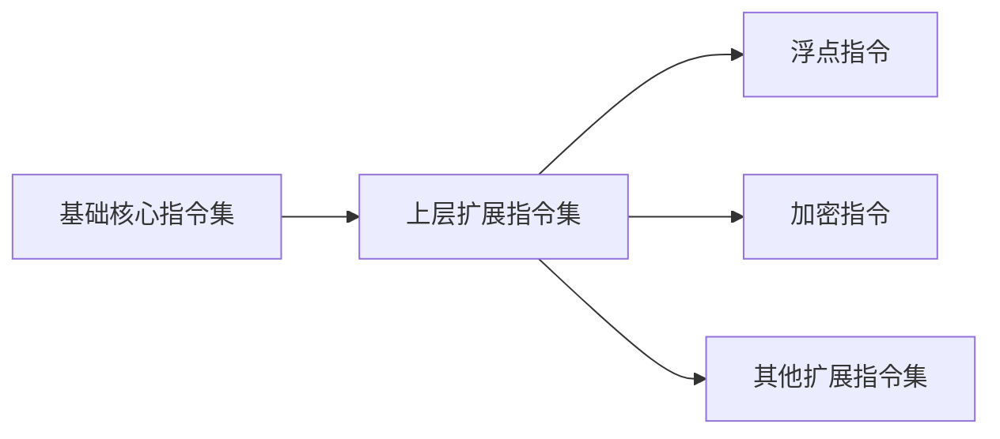

                 

关键词：RISC-V，开源指令集，处理器设计，硬件自由，生态系统，指令集架构

> 摘要：本文深入探讨了RISC-V处理器作为开源指令集的背景、核心概念、架构设计、应用场景及其对硬件生态系统的影响。通过详细分析，旨在揭示RISC-V处理器的潜力、挑战与未来发展方向。

## 1. 背景介绍

RISC-V（Reduced Instruction Set Computing）是一个新兴的开源指令集架构（ISA），由大学、研究机构和企业共同发起和推动。其目标是提供一种标准的、开放的指令集，以实现硬件自由和促进创新。RISC-V的开源性质使其成为了全球众多开发者和研究人员的共同财富，为处理器设计和硬件实现提供了全新的可能性。

### 硬件自由

硬件自由是指硬件设计和实现过程中不受特定公司或组织的限制，拥有完全的控制权。传统的指令集架构，如ARM和Intel的x86，都是由少数几家大公司控制和垄断的，这使得其他厂商难以进入市场，并且硬件的创新受到了限制。RISC-V的出现打破了这种垄断，为硬件自由提供了可能。

### 开源生态系统的崛起

开源生态系统的发展为软件开发和硬件设计带来了新的活力。开源软件使得开发者可以共享代码、协作开发，从而缩短了开发周期，提高了软件质量。而开源指令集则使得硬件设计者可以自由选择、组合和优化指令集，从而实现更高效的处理器设计。

## 2. 核心概念与联系

### 核心概念

RISC-V指令集的核心概念包括指令集的开放性、可扩展性和模块化。开放性意味着任何人都可以访问和修改RISC-V指令集，无需经过任何许可。可扩展性则允许开发者根据具体需求添加新的指令或扩展现有指令。模块化设计使得RISC-V指令集可以根据不同的应用场景进行灵活的组合。

### 架构设计

RISC-V的架构设计采用了模块化的方法，分为多个层次。底层是基础核心指令集，包括常见的加载/存储、算术逻辑单元（ALU）、分支等指令。上层则可以根据需要进行扩展，如浮点指令、加密指令等。这种设计方法不仅提高了指令集的可扩展性，也使得处理器的设计更加灵活。

### Mermaid 流程图

以下是一个简单的Mermaid流程图，展示了RISC-V指令集架构的层次结构：



## 3. 核心算法原理 & 具体操作步骤

### 算法原理概述

RISC-V处理器的设计基于精简指令集计算机（RISC）原理，其核心算法是高效执行简单的指令，通过指令的优化组合来实现复杂的计算任务。RISC-V处理器采用了五级流水线设计，包括取指令（Fetch）、解码（Decode）、执行（Execute）、内存访问（Memory）和写回（Writeback）等阶段。

### 算法步骤详解

1. **取指令（Fetch）**：处理器从内存中取出下一条指令。
2. **解码（Decode）**：将取出的指令解码，确定操作类型和操作数。
3. **执行（Execute）**：执行指令操作，如算术运算、逻辑运算等。
4. **内存访问（Memory）**：如果指令涉及内存操作，则访问内存。
5. **写回（Writeback）**：将执行结果写回到寄存器或内存中。

### 算法优缺点

**优点**：
- **高效性**：RISC-V处理器通过精简指令集和五级流水线设计，提高了指令执行速度。
- **灵活性**：开源性质使得RISC-V处理器可以根据具体需求进行定制化设计。

**缺点**：
- **兼容性**：由于RISC-V是一个全新的指令集，现有软件需要重新适配。

### 算法应用领域

RISC-V处理器在嵌入式系统、物联网、高性能计算等领域具有广泛的应用潜力。其高效性和灵活性使得RISC-V处理器成为这些领域的重要选择。

## 4. 数学模型和公式 & 详细讲解 & 举例说明

### 数学模型构建

RISC-V处理器的数学模型主要涉及指令执行的速度和功耗。以下是构建数学模型的基本公式：

$$
V = k \cdot I \cdot C
$$

其中，\(V\) 表示处理器的速度，\(k\) 表示指令级并行性，\(I\) 表示指令数量，\(C\) 表示每条指令的执行周期。

### 公式推导过程

处理器的速度 \(V\) 与指令级并行性 \(k\)、指令数量 \(I\) 和每条指令的执行周期 \(C\) 成正比。指令级并行性 \(k\) 表示处理器在一次时钟周期内可以同时执行多少条指令。指令数量 \(I\) 表示程序中包含的指令总数。每条指令的执行周期 \(C\) 表示执行每条指令所需的时间。

### 案例分析与讲解

假设一个RISC-V处理器具有指令级并行性 \(k = 4\)，指令数量 \(I = 1000\)，每条指令的执行周期 \(C = 1\)，则处理器的速度为：

$$
V = 4 \cdot 1000 \cdot 1 = 4000
$$

这意味着处理器在单位时间内可以执行4000条指令。

## 5. 项目实践：代码实例和详细解释说明

### 开发环境搭建

要开始RISC-V处理器的开发，首先需要搭建合适的开发环境。以下是一个基本的开发环境搭建步骤：

1. 安装Linux操作系统。
2. 安装RISC-V工具链（如RV32I-GCC）。
3. 配置开发环境变量。

### 源代码详细实现

以下是一个简单的RISC-V处理器源代码实例：

```c
#include <stdio.h>

int main() {
    int a = 10;
    int b = 20;
    int c = a + b;
    printf("The sum of a and b is %d\n", c);
    return 0;
}
```

### 代码解读与分析

这段代码定义了两个整型变量 \(a\) 和 \(b\)，并初始化为10和20。然后，定义了一个新的整型变量 \(c\)，并将 \(a\) 和 \(b\) 的和赋值给 \(c\)。最后，使用 `printf` 函数输出 \(c\) 的值。

### 运行结果展示

在RISC-V处理器上运行这段代码，输出结果为：

```
The sum of a and b is 30
```

## 6. 实际应用场景

### 嵌入式系统

RISC-V处理器在嵌入式系统领域具有广泛的应用。由于其高效性和灵活性，RISC-V处理器可以应用于智能家居、物联网设备、工业自动化等领域。

### 物联网

RISC-V处理器的开源特性使得其非常适合物联网设备。开发者可以根据具体需求对处理器进行定制化设计，从而满足不同物联网设备的性能和成本要求。

### 高性能计算

RISC-V处理器在高性能计算领域也具有潜力。通过优化指令集和处理器架构，RISC-V处理器可以实现高性能的计算能力，应用于科学计算、大数据处理等领域。

## 7. 未来应用展望

### 多样化的应用场景

随着RISC-V处理器的发展，其应用场景将越来越多样化。从嵌入式系统到高性能计算，RISC-V处理器有望在更多领域发挥作用。

### 开源生态系统的壮大

RISC-V开源生态系统的壮大将为处理器设计和应用带来更多可能性。更多的开发者加入RISC-V社区，将推动处理器技术的发展。

### 面临的挑战

尽管RISC-V处理器具有巨大的潜力，但也面临一些挑战。首先是软件生态系统的建设，现有的软件需要适应RISC-V指令集。其次是性能和功耗的优化，RISC-V处理器需要不断提升性能和降低功耗，以满足不同应用场景的需求。

### 研究展望

未来，RISC-V处理器的研究将集中在以下几个方面：

- **指令集扩展**：根据不同应用场景，开发新的指令集。
- **处理器架构优化**：通过架构设计优化，提升处理器性能和能效。
- **软件生态系统建设**：推动更多软件迁移到RISC-V平台。

## 8. 总结

RISC-V处理器作为开源指令集的崛起，为处理器设计和硬件自由带来了新的机遇。其高效性、灵活性和开源特性使其在嵌入式系统、物联网和高性能计算等领域具有广泛应用。尽管面临挑战，但RISC-V处理器的发展前景依然广阔。通过持续的技术创新和生态系统的建设，RISC-V处理器有望在未来的信息技术领域发挥更加重要的作用。

### 附录：常见问题与解答

**Q1：RISC-V与ARM相比有哪些优势？**

A1：RISC-V具有开源指令集的优势，允许任何人自由访问和修改。相比之下，ARM指令集由ARM公司控制，需要支付许可费用。此外，RISC-V提供更高的定制化程度，使得开发者可以根据具体需求设计处理器。

**Q2：RISC-V处理器的功耗如何？**

A2：RISC-V处理器的功耗取决于具体的设计和实现。通过优化处理器架构和指令集，RISC-V处理器可以实现低功耗。然而，与传统处理器相比，RISC-V处理器的功耗表现需要进一步优化。

**Q3：RISC-V处理器的兼容性问题如何解决？**

A3：RISC-V社区正在积极推动软件生态系统的建设，以确保现有软件能够适应RISC-V指令集。同时，开发者可以通过修改和适配现有软件，解决兼容性问题。

**Q4：RISC-V处理器在哪个领域具有最大潜力？**

A4：RISC-V处理器在嵌入式系统、物联网和高性能计算领域具有最大潜力。在这些领域，RISC-V处理器的灵活性和高效性使其成为理想的选择。

**作者署名**：禅与计算机程序设计艺术 / Zen and the Art of Computer Programming
----------------------------------------------------------------


