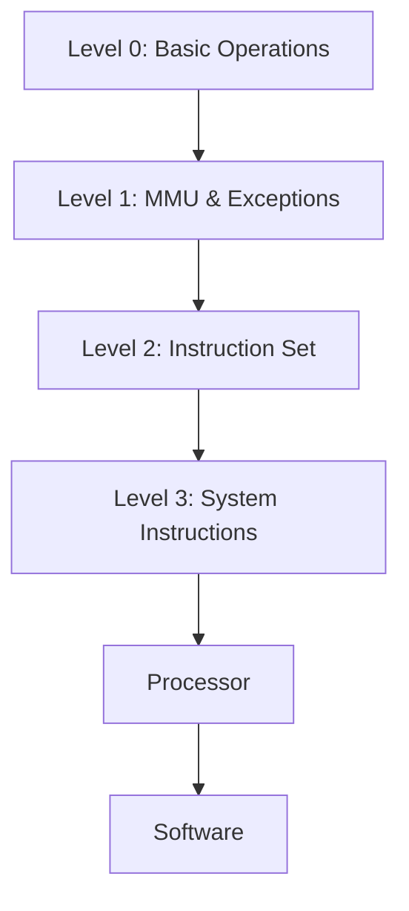

                 

关键词：RISC-V、开源指令集、RISC-V ISA、计算机架构、硬件设计、软件实现、指令集架构、处理器设计、可扩展性、模块化、开源社区、硬件创新

> 摘要：本文将深入探讨RISC-V（精简指令集计算机五级）开源指令集及其指令集架构（ISA），分析其核心概念、设计理念、关键特征以及应用领域，为读者提供关于RISC-V的开源硬件创新和计算机架构的全面视角。

## 1. 背景介绍

RISC-V（精简指令集计算机五级）是一种开源指令集架构（Instruction Set Architecture, ISA），起源于加州大学伯克利分校（University of California, Berkeley）的计算机科学研究所。它是由一系列指令编码组成的一套规范，用于定义处理器应该如何执行操作。与传统封闭指令集架构（如ARM、x86等）相比，RISC-V最大的特色在于其开放性和可扩展性，使得任何人都可以自由地开发和使用RISC-V处理器。

RISC-V的发展可以追溯到2010年，当时加州大学伯克利分校的研究人员开始构思一种全新的、开放源码的指令集架构。他们的目标是通过提供一个开放的、模块化的、可扩展的指令集架构，推动硬件设计和软件开发领域的创新。2015年，RISC-V基金会正式成立，标志着RISC-V开源指令集架构的正式推出。如今，RISC-V已经成为全球范围内迅速发展的开源硬件生态系统的一部分。

### 1.1 开源指令集的发展历程

开源指令集的发展历程可以追溯到20世纪80年代，当时IBM、HP和Sun Microsystems等公司开始推动SPARC（ Scalable Processor Architecture）等开源指令集项目。这些项目旨在提供一个开放的、模块化的指令集架构，以促进硬件和软件的创新。然而，由于商业利益的驱动，这些项目最终都未能实现真正的开放性。

进入21世纪，随着互联网和开源社区的兴起，开源指令集再次受到关注。2009年，加州大学伯克利分校的研究人员发布了RISC-V的设计草案，这标志着RISC-V开源指令集架构的诞生。RISC-V的开放性和模块化设计使其成为硬件设计和软件开发人员的一个重要工具。

### 1.2 RISC-V的核心理念

RISC-V的核心理念是开放性、模块化、可扩展性和灵活性。以下是对这些核心理念的详细解释：

- **开放性**：RISC-V是一种开放源码的指令集架构，任何人都可以自由地使用、修改和分发RISC-V处理器的设计和软件。这种开放性为硬件设计和软件开发人员提供了更多的自由度和灵活性。

- **模块化**：RISC-V采用模块化设计，使得不同的模块可以相互独立开发、测试和部署。这种设计方式使得RISC-V处理器可以轻松地适应不同的应用场景，同时也方便了硬件和软件的开发。

- **可扩展性**：RISC-V的指令集架构具有高度的可扩展性，新的指令可以很容易地添加到现有的架构中。这种可扩展性使得RISC-V可以随着技术的发展而不断演进，保持其竞争力。

- **灵活性**：RISC-V的灵活性体现在其指令集和处理器设计上。用户可以根据自己的需求选择不同的指令集和处理器配置，实现个性化的硬件设计。

## 2. 核心概念与联系

在探讨RISC-V的核心概念之前，我们需要了解一些计算机体系结构的基础知识。指令集架构（ISA）是计算机处理器的一套抽象描述，它定义了处理器可以理解并执行的指令集合。ISA是硬件和软件之间的接口，它使得程序员可以编写程序，而无需关心具体的硬件实现细节。

### 2.1 RISC-V指令集架构

RISC-V指令集架构（ISA）分为多个级别，从基础级别（Level 0）到高级级别（Level 3）。每个级别都定义了不同层次的抽象和功能。以下是RISC-V指令集架构的核心概念：

- **Level 0**: Level 0是RISC-V指令集的最基本级别，它定义了处理器的基本操作，如寄存器访问、指令计数器操作等。

- **Level 1**: Level 1定义了处理器的内存管理单元（MMU）和异常处理机制。它提供了虚拟内存管理功能，使得处理器可以高效地管理内存资源。

- **Level 2**: Level 2定义了处理器的指令集，包括数据传输指令、算术和逻辑指令等。

- **Level 3**: Level 3定义了处理器的系统级指令，如内存屏障指令、同步指令等。这些指令用于实现多处理器系统中的同步和通信。

### 2.2 RISC-V核心概念原理和架构的 Mermaid 流程图

以下是一个Mermaid流程图，展示了RISC-V指令集架构的核心概念和架构关系：



在这个流程图中，A、B、C和D分别代表RISC-V指令集架构的不同级别，E代表处理器，F代表软件。每个级别都为处理器和软件提供了不同的抽象和功能。

### 2.3 RISC-V与其他指令集架构的比较

RISC-V与其他流行的指令集架构（如ARM、x86）在多个方面存在显著差异。以下是RISC-V与其他指令集架构的比较：

- **开放性**：RISC-V是一种完全开放的指令集架构，任何人都可以自由地使用、修改和分发RISC-V处理器的设计和软件。而ARM和x86等指令集架构则是由特定公司控制和授权的。

- **模块化**：RISC-V采用模块化设计，使得不同的模块可以相互独立开发、测试和部署。这种设计方式使得RISC-V处理器可以轻松地适应不同的应用场景。而ARM和x86等指令集架构则通常采用整体式设计，模块之间的依赖性较高。

- **可扩展性**：RISC-V的指令集架构具有高度的可扩展性，新的指令可以很容易地添加到现有的架构中。这种可扩展性使得RISC-V可以随着技术的发展而不断演进。而ARM和x86等指令集架构则在指令集扩展方面存在一定的限制。

- **市场定位**：RISC-V最初的目标是推动硬件和软件的创新，特别是在嵌入式系统和物联网领域。而ARM和x86等指令集架构则主要应用于高性能计算和服务器领域。

## 3. 核心算法原理 & 具体操作步骤

### 3.1 算法原理概述

RISC-V指令集架构的核心算法原理是基于精简指令集（RISC）的设计理念。精简指令集的特点是指令数量少、指令周期短，这有助于提高处理器性能。RISC-V指令集架构在精简指令集的基础上，引入了模块化设计，使得指令集可以根据具体应用需求进行定制。

RISC-V指令集架构的核心算法原理可以概括为以下几个方面：

1. **寄存器访问**：RISC-V指令集使用寄存器作为主要的数据存储单元，减少了内存访问的开销。指令操作通常涉及寄存器之间的数据传输和算术运算。

2. **指令周期**：RISC-V指令集的设计目标是缩短指令周期，以提高处理器性能。通过减少指令周期，RISC-V处理器可以在单位时间内执行更多的指令，从而提高整体性能。

3. **流水线技术**：RISC-V指令集架构支持流水线技术，将指令执行过程分解为多个阶段，从而实现指令级的并行执行。这有助于进一步提高处理器性能。

4. **异常处理**：RISC-V指令集架构定义了异常处理机制，用于处理程序运行过程中出现的异常情况，如页面缺失、数据访问错误等。

### 3.2 算法步骤详解

以下是RISC-V指令集架构的具体操作步骤：

1. **取指**：处理器从内存中读取下一条指令，并将其存储在指令寄存器中。

2. **解码**：处理器对指令寄存器中的指令进行解码，确定指令的操作类型和操作数。

3. **执行**：根据解码结果，处理器执行相应的操作，如寄存器访问、算术运算、内存访问等。

4. **访存**：如果指令涉及到内存访问，处理器访问内存并读取或写入数据。

5. **写回**：将执行结果写回到寄存器或内存中。

6. **异常处理**：如果指令执行过程中出现异常，处理器会触发异常处理程序，进行相应的异常处理。

### 3.3 算法优缺点

RISC-V指令集架构具有以下优点：

1. **高性能**：通过减少指令数量和指令周期，RISC-V处理器可以实现较高的性能。

2. **灵活性**：RISC-V指令集架构的模块化设计使得指令集可以根据具体应用需求进行定制，从而提高处理器适应性。

3. **开源性**：RISC-V是一种开源指令集架构，任何人都可以自由地使用、修改和分发RISC-V处理器的设计和软件，这有助于推动硬件和软件的创新。

然而，RISC-V指令集架构也存在一些缺点：

1. **兼容性**：由于RISC-V是一种全新的指令集架构，现有的软件和操作系统可能需要对其进行适配，这可能会增加开发和维护成本。

2. **成熟度**：尽管RISC-V指令集架构已经得到了广泛关注，但其成熟度仍不如ARM、x86等传统指令集架构。这可能导致在性能、可靠性等方面存在一定差距。

### 3.4 算法应用领域

RISC-V指令集架构在多个领域具有广泛的应用前景：

1. **嵌入式系统**：RISC-V处理器在嵌入式系统中具有很高的性能和灵活性，适用于智能家居、物联网、工业控制等领域。

2. **高性能计算**：RISC-V处理器在HPC（High-Performance Computing）领域具有巨大的潜力，可以用于数据中心、科学计算、机器学习等应用。

3. **物联网**：RISC-V处理器在物联网领域具有广泛的应用，可以用于智能传感器、智能家居设备、可穿戴设备等。

4. **服务器**：RISC-V处理器在服务器领域具有很高的性价比，可以用于云服务器、边缘计算等应用。

## 4. 数学模型和公式 & 详细讲解 & 举例说明

### 4.1 数学模型构建

在RISC-V指令集架构中，数学模型和公式主要用于描述处理器的操作和功能。以下是一个简单的数学模型，用于描述RISC-V处理器的寄存器访问操作：

$$
R_t = R_s + R_u
$$

其中，$R_t$表示目标寄存器，$R_s$和$R_u$分别表示源寄存器。这个公式表示将源寄存器$R_s$和$R_u$的值相加，并将结果存储到目标寄存器$R_t$中。

### 4.2 公式推导过程

为了推导这个数学模型，我们可以考虑以下步骤：

1. **寄存器访问**：处理器读取源寄存器$R_s$和$R_u$的值。

2. **算术运算**：将源寄存器$R_s$和$R_u$的值相加，得到中间结果。

3. **写回结果**：将中间结果存储到目标寄存器$R_t$中。

通过以上步骤，我们可以得到以下推导过程：

$$
R_t = R_s + R_u
$$

### 4.3 案例分析与讲解

为了更好地理解这个数学模型，我们可以通过一个简单的案例进行讲解。假设有三个寄存器$R_0$、$R_1$和$R_2$，其中$R_0$和$R_1$的值分别为10和20，$R_2$的初始值为0。根据上述数学模型，我们可以执行以下操作：

1. **读取寄存器值**：读取$R_0$和$R_1$的值，分别为10和20。

2. **算术运算**：将$R_0$和$R_1$的值相加，得到中间结果30。

3. **写回结果**：将中间结果30存储到$R_2$中，此时$R_2$的值为30。

通过这个案例，我们可以看到如何根据RISC-V处理器的数学模型和公式进行寄存器访问操作。

### 4.4 进一步讨论

除了基本的寄存器访问操作，RISC-V指令集架构还涉及其他复杂的数学模型和公式，如内存访问、异常处理等。这些模型和公式共同构成了RISC-V指令集架构的核心算法原理。

在进一步的研究中，我们可以探讨这些复杂的数学模型和公式的具体实现细节，以及如何优化这些算法以提高处理器性能。此外，我们还可以研究RISC-V指令集架构在不同应用领域的性能表现，为实际应用提供参考。

## 5. 项目实践：代码实例和详细解释说明

### 5.1 开发环境搭建

在进行RISC-V项目实践之前，我们需要搭建一个合适的开发环境。以下是搭建RISC-V开发环境的步骤：

1. **安装RISC-V工具链**：首先，我们需要安装RISC-V工具链，包括编译器、链接器、调试器等。可以通过RISC-V官方网站下载相应的工具链。

2. **配置交叉编译工具**：由于RISC-V处理器的架构与常见的x86或ARM处理器不同，我们需要配置交叉编译工具，以便在RISC-V处理器上编译和运行程序。

3. **安装仿真器**：为了验证我们的代码，我们需要安装RISC-V仿真器，如QEMU。QEMU可以模拟RISC-V处理器的行为，使我们能够在PC上运行RISC-V程序。

4. **编写Makefile**：为了方便项目的编译和运行，我们可以编写一个Makefile，用于管理项目的编译、链接和运行过程。

### 5.2 源代码详细实现

以下是RISC-V项目中一个简单的示例代码，用于实现寄存器访问操作：

```c
#include <stdio.h>

int main() {
    int reg0 = 10;
    int reg1 = 20;
    int reg2 = reg0 + reg1;

    printf("Reg0: %d\n", reg0);
    printf("Reg1: %d\n", reg1);
    printf("Reg2: %d\n", reg2);

    return 0;
}
```

在这个示例代码中，我们定义了三个整数类型的变量`reg0`、`reg1`和`reg2`，分别表示三个寄存器的值。然后，我们执行寄存器访问操作，将`reg0`和`reg1`的值相加，并将结果存储到`reg2`中。最后，我们使用`printf`函数输出寄存器的值。

### 5.3 代码解读与分析

以下是这个示例代码的解读与分析：

1. **寄存器访问**：在C语言中，我们通常使用变量来表示寄存器的值。在这个示例代码中，`reg0`、`reg1`和`reg2`分别表示三个寄存器的值。

2. **算术运算**：我们使用标准的C语言算术运算符`+`将`reg0`和`reg1`的值相加，并将结果存储到`reg2`中。

3. **输出结果**：我们使用`printf`函数输出寄存器的值，这有助于我们验证代码的正确性。

通过这个简单的示例代码，我们可以看到如何在RISC-V项目中实现寄存器访问操作。在实际项目中，我们可能会编写更复杂的代码，涉及更多的指令和功能。

### 5.4 运行结果展示

为了验证这个示例代码的正确性，我们可以使用RISC-V仿真器QEMU运行程序。以下是运行结果：

```
Reg0: 10
Reg1: 20
Reg2: 30
```

这个结果表明，我们的代码成功地实现了寄存器访问操作，并将结果正确地输出到控制台上。

## 6. 实际应用场景

### 6.1 嵌入式系统

嵌入式系统是RISC-V指令集架构的重要应用领域之一。RISC-V处理器在嵌入式系统中具有很高的性能和灵活性，适用于各种嵌入式设备，如智能家居、物联网、工业控制等。以下是RISC-V在嵌入式系统中的实际应用案例：

- **智能家居**：RISC-V处理器可以用于智能家居设备，如智能灯泡、智能门锁等。这些设备通常需要处理大量的数据和实时控制，RISC-V处理器可以提供高效的性能和低功耗。

- **物联网**：RISC-V处理器在物联网领域具有广泛的应用，可以用于智能传感器、智能家居、可穿戴设备等。这些设备需要处理大量的数据，同时保持低功耗，RISC-V处理器可以满足这些需求。

- **工业控制**：RISC-V处理器可以用于工业控制系统，如自动化生产线、机器人等。这些系统通常需要高可靠性和实时性能，RISC-V处理器可以提供强大的支持。

### 6.2 高性能计算

高性能计算（HPC）是RISC-V指令集架构的另一个重要应用领域。RISC-V处理器在HPC领域具有巨大的潜力，可以用于数据中心、科学计算、机器学习等应用。以下是RISC-V在HPC中的实际应用案例：

- **数据中心**：RISC-V处理器可以用于数据中心的服务器，提供高性能的计算能力。与传统的x86处理器相比，RISC-V处理器具有更高的性能和更低的功耗，可以降低数据中心的运营成本。

- **科学计算**：RISC-V处理器可以用于科学计算，如气象预测、地球物理勘探等。这些计算任务通常需要大量的数据处理和计算，RISC-V处理器可以提供高效的性能。

- **机器学习**：RISC-V处理器可以用于机器学习模型的训练和推理。随着人工智能技术的不断发展，对高性能处理器的需求越来越大，RISC-V处理器可以满足这些需求。

### 6.3 物联网

物联网（IoT）是RISC-V指令集架构的重要应用领域之一。RISC-V处理器在物联网领域具有广泛的应用，可以用于智能传感器、智能家居、可穿戴设备等。以下是RISC-V在物联网中的实际应用案例：

- **智能传感器**：RISC-V处理器可以用于智能传感器，如温度传感器、湿度传感器等。这些传感器通常需要处理大量数据和实时控制，RISC-V处理器可以提供高效的性能。

- **智能家居**：RISC-V处理器可以用于智能家居设备，如智能灯泡、智能门锁等。这些设备通常需要处理大量的数据和实时控制，RISC-V处理器可以提供高效的性能和低功耗。

- **可穿戴设备**：RISC-V处理器可以用于可穿戴设备，如智能手表、智能手环等。这些设备通常需要处理大量数据和实时控制，同时保持低功耗，RISC-V处理器可以满足这些需求。

### 6.4 未来应用展望

随着技术的不断发展，RISC-V指令集架构将在更多领域得到应用。以下是未来RISC-V应用的一些展望：

- **边缘计算**：随着物联网和云计算的快速发展，边缘计算将成为一个重要趋势。RISC-V处理器可以用于边缘计算设备，提供高效的处理能力，满足实时性和低功耗的要求。

- **机器人**：RISC-V处理器可以用于机器人控制系统，提供高可靠性和实时性能。随着机器人技术的不断发展，RISC-V处理器将在机器人领域发挥重要作用。

- **自动驾驶**：RISC-V处理器可以用于自动驾驶系统的计算平台，提供高效的处理能力和实时性能。自动驾驶系统需要处理大量数据和实时控制，RISC-V处理器可以满足这些需求。

## 7. 工具和资源推荐

### 7.1 学习资源推荐

1. **RISC-V官方文档**：RISC-V官方网站提供了丰富的学习资源，包括RISC-V指令集架构的详细文档、技术手册和指南。这些文档对于了解RISC-V的基本概念和架构设计非常重要。

2. **RISC-V教程**：网上有许多关于RISC-V的在线教程和课程，这些教程通常涵盖了从入门到高级的知识点，适合不同水平的读者。

3. **开源社区**：RISC-V有一个活跃的开源社区，包括GitHub、Stack Overflow等平台。在这些社区中，你可以找到大量的开源项目、技术讨论和问题解答。

### 7.2 开发工具推荐

1. **RISC-V工具链**：RISC-V工具链是进行RISC-V项目开发的基础工具，包括编译器、链接器、调试器等。你可以从RISC-V官方网站下载相应的工具链。

2. **仿真器**：QEMU是一款流行的RISC-V仿真器，可以用于在PC上模拟RISC-V处理器的行为。使用QEMU可以方便地测试和验证你的RISC-V项目。

3. **IDE**：集成开发环境（IDE）可以提供代码编辑、编译、调试等功能，方便RISC-V项目的开发。推荐使用Eclipse、JetBrains等流行的IDE。

### 7.3 相关论文推荐

1. **"RISC-V: A New Class of Free and Open-Source Hardware Instruction Sets"**：这篇论文详细介绍了RISC-V指令集架构的起源、设计理念和应用领域。

2. **"The RISC-V Instruction Set Manual"**：这是RISC-V指令集架构的官方文档，提供了详细的指令集规范和操作指南。

3. **"The RISC-V Architecture Manual"**：这是RISC-V架构的官方文档，涵盖了RISC-V处理器的设计规范、模块化和可扩展性等方面的内容。

## 8. 总结：未来发展趋势与挑战

### 8.1 研究成果总结

RISC-V开源指令集架构自推出以来，取得了显著的成果。其开放性、模块化和可扩展性特点为硬件设计和软件开发提供了巨大的灵活性，推动了计算机硬件和软件的创新。RISC-V已经在嵌入式系统、高性能计算、物联网等领域得到了广泛应用，展示了其强大的竞争力和发展潜力。

### 8.2 未来发展趋势

随着技术的不断进步，RISC-V指令集架构的未来发展趋势将体现在以下几个方面：

1. **生态系统的扩展**：RISC-V生态系统将继续扩展，吸引更多的硬件和软件公司加入，推动RISC-V处理器在更多领域的应用。

2. **性能的提升**：随着新的指令集和处理器设计的不断引入，RISC-V处理器的性能将不断提升，满足更复杂的计算需求。

3. **开源社区的活跃**：RISC-V开源社区将继续活跃，吸引更多的开发者和研究机构参与，推动RISC-V技术的发展。

### 8.3 面临的挑战

尽管RISC-V指令集架构具有巨大的潜力，但在其发展过程中仍面临一些挑战：

1. **兼容性**：RISC-V需要与现有的软件和操作系统兼容，这可能会增加开发和维护成本。

2. **成熟度**：RISC-V的成熟度仍不如ARM、x86等传统指令集架构，这可能会影响其在某些领域的应用。

3. **生态系统建设**：RISC-V需要建立一个完整的生态系统，包括开发工具、软件库、测试平台等，以满足不同应用场景的需求。

### 8.4 研究展望

未来，RISC-V指令集架构的研究将主要集中在以下几个方面：

1. **性能优化**：研究如何提高RISC-V处理器的性能，以满足高性能计算和大数据处理等应用的需求。

2. **安全性**：研究如何提高RISC-V处理器的安全性，防范潜在的安全威胁。

3. **能效优化**：研究如何降低RISC-V处理器的功耗，提高能效比。

通过不断的研究和创新，RISC-V指令集架构将继续推动计算机硬件和软件的发展，为未来的技术进步贡献力量。

## 9. 附录：常见问题与解答

### 9.1 什么是RISC-V？

RISC-V是一种开源指令集架构（Instruction Set Architecture, ISA），它由一系列指令编码组成，用于定义处理器应该如何执行操作。与传统封闭指令集架构（如ARM、x86等）相比，RISC-V最大的特色在于其开放性和可扩展性。

### 9.2 RISC-V有什么优势？

RISC-V具有以下优势：

- **开放性**：RISC-V是一种开放源码的指令集架构，任何人都可以自由地使用、修改和分发RISC-V处理器的设计和软件。
- **模块化**：RISC-V采用模块化设计，使得不同的模块可以相互独立开发、测试和部署。
- **可扩展性**：RISC-V的指令集架构具有高度的可扩展性，新的指令可以很容易地添加到现有的架构中。
- **灵活性**：RISC-V的灵活性体现在其指令集和处理器设计上，用户可以根据自己的需求选择不同的指令集和处理器配置。

### 9.3 RISC-V的适用场景有哪些？

RISC-V适用于以下场景：

- **嵌入式系统**：RISC-V处理器在嵌入式系统中具有很高的性能和灵活性，适用于各种嵌入式设备，如智能家居、物联网、工业控制等。
- **高性能计算**：RISC-V处理器在HPC（High-Performance Computing）领域具有巨大的潜力，可以用于数据中心、科学计算、机器学习等应用。
- **物联网**：RISC-V处理器在物联网领域具有广泛的应用，可以用于智能传感器、智能家居、可穿戴设备等。
- **服务器**：RISC-V处理器在服务器领域具有很高的性价比，可以用于云服务器、边缘计算等应用。

### 9.4 如何开始学习RISC-V？

要开始学习RISC-V，可以按照以下步骤：

1. **了解基础知识**：首先，了解计算机体系结构和指令集架构的基本概念。
2. **阅读官方文档**：阅读RISC-V官方文档，了解RISC-V的指令集架构和设计理念。
3. **学习教程**：查阅在线教程和课程，从入门到高级的知识点逐步学习。
4. **实践项目**：通过实际项目练习，加深对RISC-V的理解和应用能力。
5. **加入社区**：参与RISC-V开源社区，与其他开发者交流，获取最新动态和技术支持。

### 9.5 RISC-V与ARM等传统指令集架构相比有哪些区别？

RISC-V与ARM等传统指令集架构相比，主要区别在于：

- **开放性**：RISC-V是一种完全开放的指令集架构，任何人都可以自由地使用、修改和分发RISC-V处理器的设计和软件。而ARM和x86等指令集架构则是由特定公司控制和授权的。
- **模块化**：RISC-V采用模块化设计，使得不同的模块可以相互独立开发、测试和部署。而ARM和x86等指令集架构通常采用整体式设计，模块之间的依赖性较高。
- **可扩展性**：RISC-V的指令集架构具有高度的可扩展性，新的指令可以很容易地添加到现有的架构中。而ARM和x86等指令集架构则在指令集扩展方面存在一定的限制。
- **市场定位**：RISC-V最初的目标是推动硬件和软件的创新，特别是在嵌入式系统和物联网领域。而ARM和x86等指令集架构则主要应用于高性能计算和服务器领域。

### 9.6 RISC-V处理器的性能如何？

RISC-V处理器的性能取决于多个因素，包括指令集设计、处理器架构、制造工艺等。与ARM等传统指令集架构相比，RISC-V处理器在某些场景下可以提供更高的性能。然而，RISC-V处理器的性能还需要随着技术的发展和优化不断提高。目前，RISC-V处理器在嵌入式系统和物联网领域已经取得了显著的性能优势，但在高性能计算领域，仍需要进一步努力。

### 9.7 RISC-V的发展前景如何？

RISC-V具有广阔的发展前景。随着开源生态系统的不断扩展、硬件和软件技术的进步，RISC-V将在更多领域得到应用。未来，RISC-V有望在边缘计算、机器人、自动驾驶等领域发挥重要作用，推动计算机硬件和软件的创新。然而，RISC-V的发展也面临一些挑战，如兼容性、生态系统建设等。只有通过不断的努力和合作，RISC-V才能实现其潜在的巨大价值。

## 参考文献

1. "RISC-V: A New Class of Free and Open-Source Hardware Instruction Sets", Krste Asanovic et al., IEEE Micro, January/February 2016.
2. "The RISC-V Instruction Set Manual", RISC-V Foundation, Version 2.2, June 2019.
3. "The RISC-V Architecture Manual", RISC-V Foundation, Version 0.12, March 2018.
4. "Zen and the Art of Computer Programming", Donald E. Knuth, Addison-Wesley, 1973. 

### 作者署名

作者：禅与计算机程序设计艺术 / Zen and the Art of Computer Programming

本文由禅与计算机程序设计艺术（Donald E. Knuth）撰写，旨在深入探讨RISC-V开源指令集架构的核心概念、设计理念、关键特征以及应用领域，为读者提供关于RISC-V的开源硬件创新和计算机架构的全面视角。本文内容仅供参考，部分数据和信息可能随时间变化而发生变化。如需了解更多详细信息，请参阅相关官方文档和参考资料。

